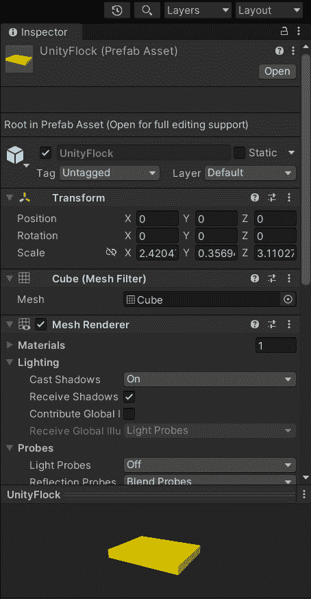
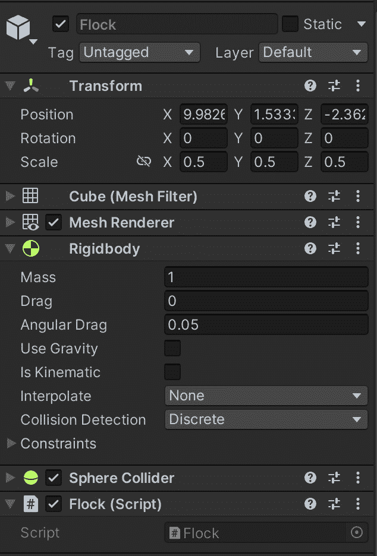
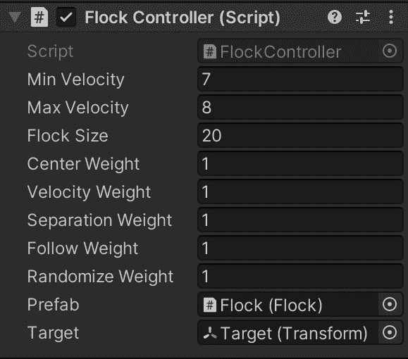
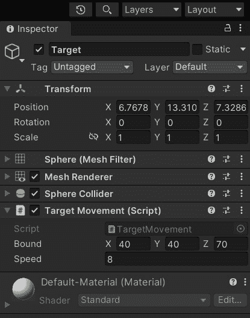
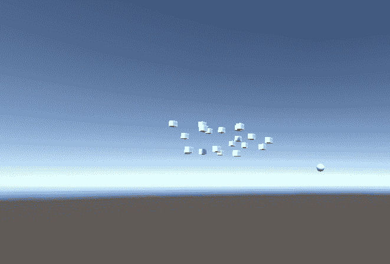

# *第五章*：鸟群

在初夏的傍晚，你可能见过成群的鸟在天空中飞翔。你可能注意到它们似乎作为一个单一的生物体移动：它们都朝着一个特定的方向移动，转弯，并且大小变化。鸟群系统旨在在游戏中复制这种行为：我们希望实现一个算法，使许多物体作为一个有机群体移动。

在游戏中，我们称鸟群中的每个元素为**boid**。要实现鸟群行为，我们不需要为每个 boid 配备高级复杂的决策系统；相反，我们只需要为每个 boid 实现简单的**反应性**规则，这些规则只依赖于鸟群本身的状态。因此，鸟群是一个很好的涌现行为的例子：每个 boid 只对其邻居的行为做出反应；然而，鸟群似乎像有人协调一样移动。

在本章中，我们将学习这些规则是什么，以及如何在 Unity3D 中实现它们。本章我们将实现两种鸟群变体。第一个是基于自游戏引擎创建以来在 Unity 社区中流传的一个旧的鸟群行为演示。

第二个变体是基于 1986 年克雷格·雷诺的原始鸟群算法。

在本章中，我们将涵盖以下主题：

+   基本鸟群行为的概述及其实现方法

+   鸟群行为的另一种实现

# 技术要求

对于本章，你只需要 Unity3D 2022。你可以在本书仓库的`第五章`文件夹中找到本章描述的示例项目：[`github.com/PacktPublishing/Unity-Artificial-Intelligence-Programming-Fifth-Edition/tree/main/Chapter05`](https://github.com/PacktPublishing/Unity-Artificial-Intelligence-Programming-Fifth-Edition/tree/main/Chapter05)。

# 基本鸟群行为

正如我们在本章引言中所说的，我们可以仅使用三个直观的属性来描述鸟群行为：

+   **分离**：这个属性，也称为**近距离排斥**，表示相邻 boid 之间的最小距离，以避免碰撞。你可以想象这个规则就像一股将 boid 推离其他物体的力量。

+   **对齐**：这个属性表示每个 boid 移动与鸟群相同方向的可能性（我们将其测量为所有单个 boid 的平均方向）。

+   **凝聚力**：这个属性，也称为**远距离吸引**，表示每个 boid 移动向鸟群质心的可能性（我们通过平均鸟群中每个 boid 的位置来测量）。因此，你可以想象这个规则就像一股将 boid 推向鸟群中心的力。

在这个演示中，我们将创建一个由物体群组成的场景，并在 C# 中实现群聚行为。对于这个第一个版本，我们将自行计算所有规则。此外，我们还将创建一个鸟群指挥官，以便轻松地控制和跟踪鸟群的总体位置。

您可以在下面的屏幕截图中看到 **Hierarchy** 场景。如您所见，我们有几个名为 **UnityFlock** 的鸟群实体，位于名为 **UnityFlockController** 的控制器下。**UnityFlock** 实体是单个鸟群对象，它引用其父 **UnityFlockController** 实体，将其用作领导者。控制器在达到当前目的地点后随机更新下一个目的地点：

![图 5.1 – 场景层次结构

![img/B17984_05_1.jpg]

图 5.1 – 场景层次结构

`UnityFlock` 脚本。我们可以为这个预制件使用任何其他网格表示来表示更有趣的东西，比如鸟。您可以添加任意数量的 **UnityFlock** 预制件。算法将自动检查 **UnityFlockController** 对象中的子项数量。

## 个体行为

*鸟群* 是克雷格·雷诺德创造的术语，指的是类似鸟类的物体。我们使用这个术语来描述我们鸟群中的每个物体。鸟群行为由一组物体组成，每个物体都有其自身的位置、速度和方向。现在，让我们实现鸟群行为。您可以在 `UnityFlock.cs` 脚本中找到控制鸟群中每个鸟群行为的代码，我们现在将检查它：

```py
using UnityEngine;
using System.Collections;
public class UnityFlock : MonoBehaviour { 
    public float minSpeed = 20.0f;
    public float turnSpeed = 20.0f; 
    public float randomFreq = 20.0f;
    public float randomForce = 20.0f;
    //alignment variables
    public float toOriginForce = 50.0f;
    public float toOriginRange = 100.0f;
    public float gravity = 2.0f;
    //seperation variables
    public float avoidanceRadius = 50.0f;
    public float avoidanceForce = 20.0f;
    //cohesion variables
    public float followVelocity = 4.0f;
    public float followRadius = 40.0f;
    //these variables control the movement of the boid
    private Transform origin;
    private Vector3 velocity;
    private Vector3 normalizedVelocity;
    private Vector3 randomPush;
    private Vector3 originPush;
    private Transform[] objects;
    private UnityFlock[] otherFlocks;
    private Transform transformComponent;
    private float randomFreqInterval;
```

作为公共字段，我们声明了算法的输入值。这些可以在检查器中设置和自定义。在这个脚本中，我们执行以下操作：

1.  我们为我们的鸟群定义了最小移动速度（`minSpeed`）和旋转速度（`turnSpeed`）。

1.  我们使用 `randomFreq` 来确定我们希望根据 `randomForce` 值更新 `randomPush` 值的次数。然后，我们使用这种力量来改变单个鸟群的速度，使鸟群的移动看起来更真实。

1.  `toOriginRange` 指定了我们希望鸟群扩散的程度。换句话说，它代表了我们要保持鸟群（遵循之前提到的凝聚力规则）的最大距离。我们使用 `avoidanceRadius` 和 `avoidanceForce` 属性来保持个体鸟群之间的最小距离（遵循分离规则）。同样，我们使用 `followRadius` 和 `followVelocity` 来保持领导者或鸟群起源之间的最小距离。`origin` 变量存储控制整个鸟群的父对象；换句话说，它是鸟群领导者。鸟群需要了解群中的其他鸟群。因此，我们使用 `objects` 和 `otherFlocks` 属性来存储邻近鸟群的信息。

这是我们的鸟群的初始化方法：

```py
void Start () {
    randomFreqInterval = 1.0f / randomFreq;
    // Assign the parent as origin 
    origin = transform.parent;
    // Flock transform 
    transformComponent = transform;
    // Temporary components 
    Component[] tempFlocks= null;
    // Get all the unity flock components from the parent 
    // transform in the group 
    if (transform.parent) {
        tempFlocks = transform.parent
          .GetComponentsInChildren<UnityFlock>();       
    }
    // Assign and store all the flock objects in this group 
    objects = new Transform[tempFlocks.Length];
    otherFlocks = new UnityFlock[tempFlocks.Length];
    for (int i = 0;i<tempFlocks.Length;i++) { 
        objects[i] = tempFlocks[i].transform;
        otherFlocks[i] = (UnityFlock)tempFlocks[i];
    }
    // Null Parent as the flock leader will be 
    // UnityFlockController object 
    transform.parent = null;
    // Calculate random push depends on the random 
    // frequency provided
    StartCoroutine(UpdateRandom());
}
```

我们将 boid 的对象的父级设置为`origin`，这意味着这是其他 boid 跟随的控制器对象。然后，我们抓取组中的所有其他 boid 并将它们存储在`otherFlocks`属性中以供以后参考。

协程

简单来说，协程是可以暂停的函数。使用协程，你可以运行一个方法，暂停执行一段时间（例如，一帧或几秒钟），然后从下一行继续，就像什么都没发生一样。它们有两个主要用途：在特定间隔后运行一个函数（无需像其他示例中那样跟踪每一帧的`elapsedTimes`）或分割一些重算法的计算到多个帧上（因此不会引起帧率下降）。事实证明，协程是一个非常有用的工具。你可以在[`docs.unity3d.com/Manual/Coroutines.html`](https://docs.unity3d.com/Manual/Coroutines.html)上了解更多信息。

现在，我们可以实现`UpdateRandom`协程。作为一个协程，函数实际上永远不会终止，但我们为每个随机时间间隔运行`while`循环的主体：

1.  我们通过指定`IEnumerator`返回类型将`UpdateRandom`方法定义为协程：

    ```py
    IEnumerator UpdateRandom() { 
        while (true) {
            randomPush = 
              Random.insideUnitSphere * randomForce;
            yield return new WaitForSeconds(
              randomFreqInterval + Random.Range(
                -randomFreqInterval / 2.0f, 
                randomFreqInterval / 2.0f));
        }
    }
    ```

1.  `UpdateRandom()`方法通过基于`randomFreq`的间隔在整个游戏过程中更新`randomPush`值。`Random.insideUnitSphere`返回一个具有随机*x*、*y*和*z*值的`Vector3`对象，这些值在以`randomForce`值为半径的球体内。

1.  在恢复`while(true)`之前，我们等待一定随机的时长。

1.  循环再次更新`randomPush`值。

1.  现在，这是我们的 boid 行为`Update()`方法，它帮助 boid 实体遵守群聚算法的三个规则：

    ```py
    void Update() {
            //Internal variables
            float speed = velocity.magnitude;
            Vector3 avgVelocity = Vector3.zero;
            Vector3 avgPosition = Vector3.zero;
            int count = 0;
            Vector3 myPosition = 
              transformComponent.position;
            Vector3 forceV;
            Vector3 toAvg;
            for (int i = 0; i < objects.Length; i++) {
                Transform boidTransform = objects[i];
                if (boidTransform != transformComponent) {
                    Vector3 otherPosition =
                      boidTransform.position;
                    // Average position to calculate 
                    // cohesion
                    avgPosition += otherPosition;
                    count++;
                    //Directional vector from other flock
                    // to this flock
                    forceV = myPosition - otherPosition;
                    //Magnitude of that directional 
                    //vector(Length)
                    float directionMagnitude = 
                      forceV.magnitude;
                    float forceMagnitude = 0.0f;
                    if (directionMagnitude < followRadius)
                    {
                        if (directionMagnitude <
                             avoidanceRadius) {
                            forceMagnitude = 1.0f – 
                              (directionMagnitude / 
                               avoidanceRadius);
                            if (directionMagnitude > 0)
                                avgVelocity += (forceV /
                                  directionMagnitude) *
                                  forceMagnitude * 
                                  avoidanceForce;
                        }
                        forceMagnitude =
                          directionMagnitude / 
                          followRadius;
                        UnityFlock tempOtherBoid = 
                          otherFlocks[i];
                        avgVelocity += followVelocity *
                          forceMagnitude * 
                         tempOtherBoid.normalizedVelocity;
                    }
                }
            }
    ```

上述代码实现了分离规则。首先，我们检查当前 boid 与其他 boid 之间的距离，然后根据注释中解释的方式相应地更新速度。

1.  我们现在通过将当前速度向量除以群中的 boid 数量来计算群的平均速度向量：

    ```py
            if (count > 0) {
                //Calculate the average flock
               //velocity(Alignment)
                avgVelocity /= count;
                //Calculate Center value of the 
                //flock(Cohesion)
                toAvg = (avgPosition / count) –
                  myPosition;
            } else {
                toAvg = Vector3.zero;
            }
            //Directional Vector to the leader
            forceV = origin.position - myPosition;
            float leaderDirectionMagnitude = 
              forceV.magnitude;
            float leaderForceMagnitude =
              leaderDirectionMagnitude / toOriginRange;
            //Calculate the velocity of the flock to the
            //leader
            if (leaderDirectionMagnitude > 0)
                originPush = leaderForceMagnitude * 
                  toOriginForce * (forceV /
                  leaderDirectionMagnitude);
            if (speed < minSpeed && speed > 0) {
                velocity = (velocity / speed) * minSpeed;
            }
            Vector3 wantedVel = velocity;
            //Calculate final velocity
            wantedVel -= wantedVel * Time.deltaTime;
            wantedVel += randomPush * Time.deltaTime;
            wantedVel += originPush * Time.deltaTime;
            wantedVel += avgVelocity * Time.deltaTime;
            wantedVel += gravity * Time.deltaTime * 
              toAvg.normalized;
            velocity = Vector3.RotateTowards(velocity,
              wantedVel, turnSpeed * Time.deltaTime, 
              100.00f);
            transformComponent.rotation =
              Quaternion.LookRotation(velocity);
            //Move the flock based on the calculated
            //velocity
            transformComponent.Translate(velocity * 
              Time.deltaTime, Space.World);
            normalizedVelocity = velocity.normalized;
        }
    ```

1.  我们将所有因素，如`randomPush`、`originPush`和`avgVelocity`相加，以计算最终的目标速度向量`wantedVel`。我们还使用`Vector3.RotateTowards`方法通过线性插值将当前速度更新为`wantedVel`。

1.  我们使用`Translate`方法根据新的速度移动我们的 boid。

1.  作为最后的润色，我们创建了一个立方网格，向其中添加了`UnityFlock`脚本，然后将其保存为预制件，如下面的截图所示：



图 5.2 – UnityFlock 预制件

## 控制器

现在，是时候创建控制器类了。这个类更新其位置，以便其他个体 boid 对象知道去哪里。前面`UnityFlock`脚本中的`origin`变量包含对这个对象的引用。

以下是在`UnityFlockController.cs`文件中的代码：

```py
using UnityEngine;
using System.Collections;
public class UnityFlockController : MonoBehaviour { 
    public Vector3 bound;
    public float speed = 100.0f;
    public float targetReachedRadius = 10.0f;
    private Vector3 initialPosition;
    private Vector3 nextMovementPoint;
    // Use this for initialization 
    void Start () {
        initialPosition = transform.position;
        CalculateNextMovementPoint();
    }
    // Update is called once per frame 
    void Update () {
        transform.Translate(Vector3.forward * speed * 
          Time.deltaTime);
        transform.rotation = 
          Quaternion.Slerp(transform.rotation,
            Quaternion.LookRotation(nextMovementPoint –
            transform.position), 1.0f * Time.deltaTime);
        if (Vector3.Distance(nextMovementPoint, 
            transform.position) <= targetReachedRadius) 
            CalculateNextMovementPoint();
    }
```

在`Update()`方法中，我们检查我们的控制器对象是否接近目标目的地点。如果是，我们再次使用我们刚才讨论的`CalculateNextMovementPoint()`方法更新`nextMovementPoint`变量：

```py
void CalculateNextMovementPoint () {
    float posX = Random.Range(initialPosition.x - bound.x,
      initialPosition.x + bound.x);
    float posY = Random.Range(initialPosition.y - bound.y, 
      initialPosition.y + bound.y);
    float posZ = Random.Range(initialPosition.z - bound.z,
      initialPosition.z + bound.z);
    nextMovementPoint = initialPosition + new Vector3(posX,
      posY, posZ);
}
```

`CalculateNextMovementPoint()`方法在当前位置和边界向量之间找到一个随机目的地位置。

最后，我们将所有这些放在一起，如图*图 5.1*所示，这应该会给出在日落时分真实飞行的方阵群：


图 5.3 – 使用 Unity 海鸥示例演示群聚行为

之前的例子向您介绍了群聚行为的基础知识。在下一节中，我们将探讨一种不同的实现方法，该方法利用了 Unity 的`Rigidbody`组件。

# 替代实现

在本节中，我们使用 Unity 物理引擎来简化代码。实际上，在这个例子中，我们将`Rigidbody`组件附加到鸟群上，以使用`Rigidbody`属性来转换和引导它们。此外，`Rigidbody`组件还有助于防止其他鸟群相互重叠。

在这个实现中，我们有两个组件：个体鸟群行为和控制器行为（在上一节中提到的称为*群控制器*的元素）。和之前一样，控制器是其他鸟群跟随的对象。

`Flock.cs`文件中的代码如下：

```py
using UnityEngine;
using System.Collections;
using System.Collections.Generic;
public class Flock : MonoBehaviour { 
    internal FlockController controller;
    private new Rigidbody rigidbody;
    private void Start() {
        rigidbody = GetComponent<Rigidbody>();
    }
    void Update () {
        if (controller) {
            Vector3 relativePos = Steer() * Time.deltaTime;
            if (relativePos != Vector3.zero)
              rigidbody.velocity = relativePos;
            // enforce minimum and maximum speeds for the
            // boids 
            float speed = rigidbody.velocity.magnitude;
            if (speed > controller.maxVelocity) {
                rigidbody.velocity =
                  rigidbody.velocity.normalized *
                  controller.maxVelocity;
            } else if (speed < controller.minVelocity) {
                rigidbody.velocity =
                  rigidbody.velocity.normalized *
                  controller.minVelocity;
            }
        }
    }
```

我们将在稍后创建`FlockController`。在此期间，在前一个代码块中的`Update()`方法中，我们使用`Steer()`方法计算鸟群的速度，并将结果应用于鸟群的刚体速度。

接下来，我们检查当前`Rigidbody`组件的速度是否在我们的控制器最大和最小速度范围内。如果不是，我们将速度限制在预设的范围内：

```py
private Vector3 Steer () {
    Vector3 center = controller.flockCenter – 
      transform.localPosition;   // cohesion
    Vector3 velocity = controller.flockVelocity –
      rigidbody.velocity; // allignement
    Vector3 follow = controller.target.localPosition – 
      transform.localPosition; // follow leader
    Vector3 separation = Vector3.zero;
    foreach (Flock flock in controller.flockList) { 
        if (flock != this) {
            Vector3 relativePos = transform.localPosition - 
              flock.transform.localPosition;
            separation += relativePos.normalized;
        }
    }
    // randomize
    Vector3 randomize = new Vector3( (Random.value * 2) –
      1, (Random.value * 2) - 1, (Random.value * 2) - 1);
    randomize.Normalize();
    return (controller.centerWeight * center + 
            controller.velocityWeight * velocity + 
            controller.separationWeight * separation +
            controller.followWeight * follow + 
            controller.randomizeWeight * randomize);
}
```

`steer()`方法实现了群聚算法的*分离*、*凝聚力*、*对齐*和*跟随领导者*规则。然后，我们将所有因素与一个随机权重值相加。我们使用这个*Flock*脚本与`Rigidbody`和`SphereCollider`组件一起创建一个 Flock 预制件，如图所示（确保通过取消选中**使用重力**来禁用重力）：



图 5.4 – 群

现在是时候实现拼图的最后一块：`FlockController`组件。

## FlockController

这个`FlockController`组件与上一个例子中的类似。除了控制鸟群的速度和位置外，这个脚本还在运行时实例化鸟群：

1.  `FlockController.cs`文件中的代码如下：

    ```py
    using UnityEngine;
    using System.Collections;
    using System.Collections.Generic;
    public class FlockController : MonoBehaviour { 
        public float minVelocity = 1;
        public float maxVelocity = 8;
        public int flockSize = 20;
        public float centerWeight = 1;
        public float velocityWeight = 1;
        public float separationWeight = 1;
        public float followWeight = 1;
        public float randomizeWeight = 1;
        public Flock prefab; 
        public Transform target;
        Vector3 flockCenter;
        internal Vector3 flockVelocity;
        public ArrayList flockList = new ArrayList();
        void Start () {
            for (int i = 0; i < flockSize; i++) {
                Flock flock = Instantiate(prefab,
                  transform.position, transform.rotation)
                  as Flock;
                flock.transform.parent = transform;
                flock.controller = this;
                flockList.Add(flock);
            }
        }
    ```

1.  我们声明所有公共属性以实现群聚算法，然后根据群聚大小输入开始生成鸟群对象。

1.  我们设置了控制器类和父`Transform`对象，就像上次做的那样。

1.  我们将创建的每个鸟群对象添加到`flockList`数组中。目标变量接受一个用作移动领导者的实体。在这个例子中，我们创建一个球体实体作为鸟群的移动目标领导者：

    ```py
        void Update() {
            //Calculate the Center and Velocity of the
            // whole flock group
            Vector3 center = Vector3.zero;
            Vector3 velocity = Vector3.zero;
            foreach (Flock flock in flockList) {
                    center += 
                      flock.transform.localPosition;
                    velocity += flock.GetComponent
                      <Rigidbody>().velocity;
            }
            flockCenter = center / flockSize;
            flockVelocity = velocity / flockSize;
        }
    }
    ```

1.  在`Update`方法中，我们持续更新群聚的平均中心和速度。这些是从鸟群对象引用的值，用于调整与控制器的凝聚力和对齐属性：



图 5.5 – 群聚控制器

我们需要使用**目标移动（脚本）**来实现我们的**目标**实体。移动脚本与我们之前在 Unity3D 示例控制器中的移动脚本相同：



图 5.6 – 带有 TargetMovement 脚本的 Target 实体

1.  我们的`TargetMovement`脚本的工作原理如下：我们随机选择一个附近的点作为目标移动到，当我们接近那个点时，我们再选择一个新的点。`TargetMovement.cs`文件中的代码如下：

    ```py
    using UnityEngine;
    using System.Collections;
    public class TargetMovement : MonoBehaviour {
        // Move target around circle with tangential speed
        public Vector3 bound;
        public float speed = 100.0f;
        public float targetReachRadius = 10.0f;
        private Vector3 initialPosition;
        private Vector3 nextMovementPoint;
        void Start () {
            initialPosition = transform.position;
            CalculateNextMovementPoint();
        }
        void CalculateNextMovementPoint () {
            float posX = Random.Range(initialPosition.x =
              bound.x, initialPosition.x+bound.x);
            float posY = Random.Range(initialPosition.y = 
              bound.y, initialPosition.y+bound.y);
            float posZ = Random.Range(initialPosition.z =
              bound.z, initialPosition.z+bound.z);
            nextMovementPoint = initialPosition + 
              new Vector3(posX, posY, posZ);
        }
        void Update () {
            transform.Translate(Vector3.forward * speed *
              Time.deltaTime); 
            transform.rotation = 
              Quaternion.Slerp(transform.rotation,
            Quaternion.LookRotation(nextMovementPoint –
              transform.position), Time.deltaTime);
            if (Vector3.Distance(nextMovementPoint,
              transform.position) <= targetReachRadius)
              CalculateNextMovementPoint();
        }
    }
    ```

1.  在我们将一切组合起来之后，我们应该在场景中看到一群立方体鸟群在飞行，它们都在追逐球形目标：



图 5.7 – 使用雷诺德算法的群聚

现在我们已经以两种不同的方式实现了群聚行为，我们可以尝试不同的参数，调整鸟群的行为，直到找到我们喜欢的移动方式。我想以一个重要的启示来结束本章：请注意，我们不需要复杂的算法来获得自然的外观行为。为此，我们只需要简单的反应性规则和一种将它们组合起来的方法。

# 摘要

在本章中，我们学习了两种实现群聚行为的方法。首先，我们检查并学习了如何仅使用我们的脚本实现基本的群聚算法。接下来，我们使用 Unity 的`Rigidbody`组件来控制鸟群的移动，以及球体碰撞器来避免与其他鸟群相撞。

在我们的例子中，我们总是将鸟群称为类似鸟类的实体。然而，我们可以将群聚应用于许多其他应用：海中的鱼群，草原上吃草的羊群，一群昆虫，甚至街道上行走的人群都可以表现出群聚行为。为了将算法适应不同的场景，我们只需更改群聚规则的值，最终将移动锁定到平面上。

在下一章中，我们将超越随机移动，看看如何跟随特定的路径。这是学习如何避开挡路的障碍物的第一步。
