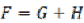
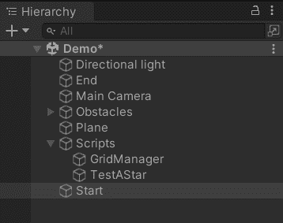
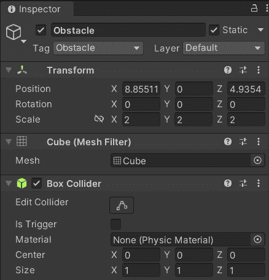
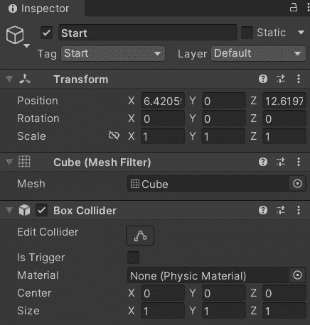
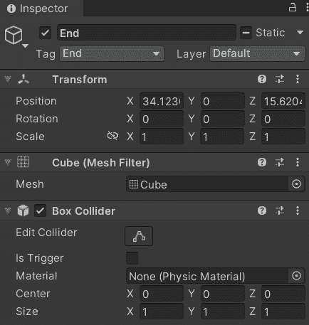
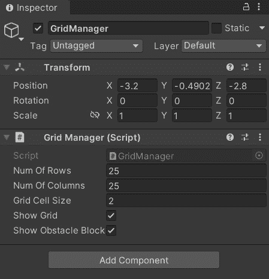
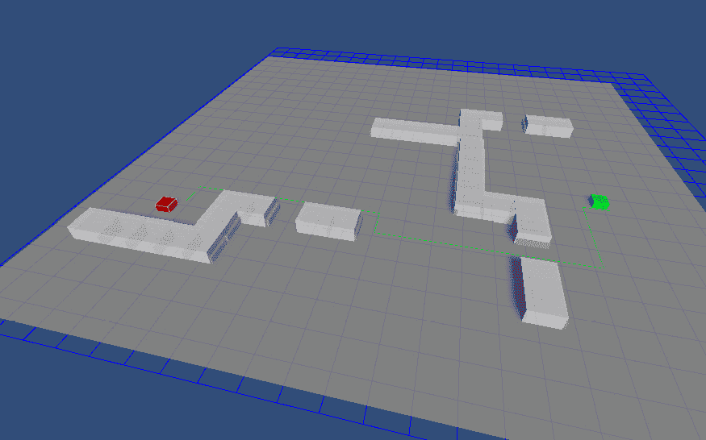
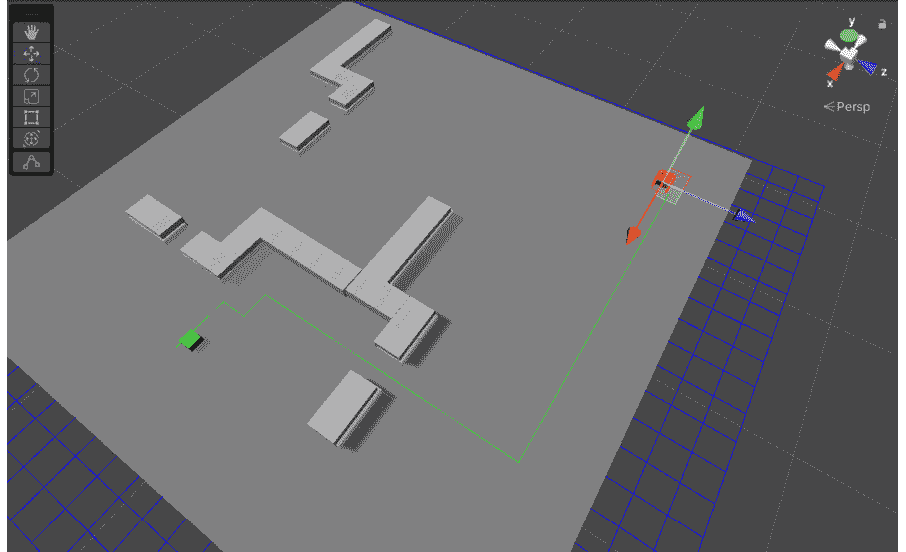

# 第七章：*第七章*：A* 路径查找

在本章中，我们将使用 C# 在 Unity3D 中实现 **A* 算法**。A* 路径查找算法因其简单性和有效性而在游戏和交互式应用中得到广泛应用。我们之前在 *第一章*，*人工智能简介* 中讨论了此算法。然而，在这里，我们将再次回顾该算法，这次是从实现的角度。

在本章中，我们将探讨以下主题：

+   重新审视 A* 算法

+   实现 A* 算法

+   设置场景

+   测试路径查找器

# 技术要求

对于本章，你只需要 Unity3D 2022\. 你可以在本书仓库的 `Chapter 7` 文件夹中找到本章描述的示例项目：[`github.com/PacktPublishing/Unity-Artificial-Intelligence-Programming-Fifth-Edition/tree/main/Chapter07`](https://github.com/PacktPublishing/Unity-Artificial-Intelligence-Programming-Fifth-Edition/tree/main/Chapter07)。

# 重新审视 A* 算法

在我们进入下一节实现 A* 算法之前，让我们回顾一下 A* 算法。任何路径查找算法的基础是对世界的表示。路径查找算法不能在游戏地图中多边形的嘈杂结构中进行搜索；相反，我们需要为他们提供一个简化的世界版本。使用这个简化的结构，我们可以识别出代理可以穿越的位置，以及不可到达的位置。

有许多方法可以做到这一点；然而，在这个例子中，我们使用最直接的一种解决方案：2D 网格。因此，我们实现了 `GridManager` 类，将“真实”地图转换为 2D 地砖表示。`GridManager` 类保持一个表示 2D 网格中单个地砖的 `Node` 对象列表。当然，我们首先需要实现 `Node` 类：这个类存储节点信息，例如其位置、是否为可穿越节点或障碍物、通过的成本以及到达目标节点的成本。

一旦我们有了世界表示，我们就实现一个 `AStar` 类来表示实际的 A* 路径查找算法。这个类很简单；`FindPath` 方法包含了所有的工作。这个类有两个变量来跟踪已经访问过的节点和将要探索的节点。我们称这些变量为 `PriorityQueue` 类，因为我们希望尽快获取得分最低的 `Node`。

相反，关闭列表需要一个允许我们高效检查是否包含特定 `Node` 的数据结构：通常，一个称为 **集合** 的数据结构是一个不错的选择。

最后，A* 的伪代码如下：

1.  首先，算法将起始节点放入开放列表中。

1.  只要开放列表不为空，算法就会继续执行以下步骤。

1.  它从开放列表中选取第一个节点并将其定义为当前节点（当然，我们假设我们正在使用优先队列作为开放列表）。

1.  然后，它获取当前节点的相邻节点，排除障碍物类型（例如无法通过的墙壁或峡谷）。这一步通常被称为扩展。

1.  在步骤 4 中，对于每个相邻节点，它检查它是否已经在关闭列表中。如果没有，它使用以下公式计算这个相邻节点的总成本（*F*）：



在这里，*G*是从起始节点到该节点的总成本（通常通过将从父节点移动到相邻节点的成本添加到父节点的*G*值来计算），而*H*是从该节点到最终目标节点的估计总成本。我们将在后面的章节中讨论估计成本的问题。

1.  该算法将成本数据存储在相邻的`node`对象中，并将当前节点指定为相邻节点的父节点。稍后，我们使用这些父节点数据从终点节点追踪回起始节点，从而重建实际路径。

1.  它将这个相邻节点放入开放列表中。开放列表是一个按*F*值排序的优先队列；因此，开放列表中的第一个节点总是具有最低的*F*值。

1.  如果没有更多的相邻节点需要处理，算法将当前节点放入关闭列表中，并从开放列表中移除。

1.  算法回到步骤 2。

一旦完成这个算法，如果从起始节点到目标节点有一条无障碍路径，那么当前节点就精确地位于目标节点位置。否则，这意味着从当前节点位置到目标节点没有可用的路径。

当我们得到一条有效路径时，我们必须使用父指针从当前节点追踪回，直到再次达到起始节点。这个过程给我们一个路径列表，列出了我们在路径查找过程中选择的节点，从目标节点到起始节点排序。作为最后一步，我们只需反转这个路径列表，就可以得到正确的路径顺序。

接下来，我们将使用 C#在 Unity3D 中实现 A*算法。那么，让我们开始吧。

# 实现 A*算法

首先，我们实现之前介绍的基本类，例如`Node`类、`GridManager`类和`PriorityQueue`类。然后，我们在主要的`AStar`类中使用它们。

## 节点

`Node`类代表 2D 网格中的每个瓦片对象。其代码在`Node.cs`文件中显示：

```py
using UnityEngine;
using System;
public class Node {
    public float costSoFar;
    public float fScore;
    public bool isObstacle;
    public Node parent;
    public Vector3 position;

    public Node(Vector3 pos) {
        fScore = 0.0f;
        costSoFar = 0.0f;
        isObstacle = false;
        parent = null;
        position = pos;
    }
    public void MarkAsObstacle() {
        isObstacle = true;
    }
```

`Node` 类存储了我们寻找路径所需的所有有价值属性。我们谈论的是诸如从起点到当前位置的成本 (`costSoFar`)、从起点到终点的总估计成本 (`fScore`)、一个标记是否为障碍物的标志、其位置以及其父节点等属性。`costSoFar` 是 *G*，即从起点节点到当前位置的移动成本值，而 `fScore` 显然是 *F*，即从起点到目标节点的总估计成本。我们还有两个简单的构造方法和一个包装方法来设置，根据这个节点是否为障碍物。然后，我们实现了 `Equals` 和 `GetHashCode` 方法，如下面的代码所示：

```py
    public override bool Equals(object obj) {
        return obj is Node node &&
               position.Equals(node.position);
    }
    public override int GetHashCode() {
        return HashCode.Combine(position);
    }
}
```

这些方法很重要。实际上，即使 `Node` 类有多个属性，代表相同位置的节点在搜索算法中应该被视为相等。要做到这一点，就像前面的例子中那样，我们需要重写默认的 `Equals` 和 `GetHashCode` 方法。

## PriorityQueue

**优先队列**是一种有序数据结构，设计目的是使列表的第一个元素（头部）始终是最小或最大的元素（取决于实现方式）。这种数据结构是处理开放列表中节点最有效的方式，因为我们将在后面看到，我们需要快速检索具有最低 *F* 值的节点。

不幸的是，没有现成的合适优先队列的方法（至少，直到 Unity 支持 .NET 6）。我们将使用的代码如下面的 `NodePriorityQueue.cs` 类所示：

```py
using System.Collections.Generic;
using System.Linq;
public class NodePriorityQueue {
    private readonly List<Node> nodes = new();
    public int Length {
        get { return nodes.Count; }
    }
    public bool Contains(Node node) {
        return nodes.Contains(node);
    }
    public Node Dequeue() {
        if (nodes.Count > 0) {
            var result = nodes[0];
            nodes.RemoveAt(0);
            return result;
        }
        return null;
    }
    public void Enqueue(Node node) {
        if (nodes.Contains(node)) {
            var oldNode = nodes.First(n => n.Equals(node));
            if (oldNode.fScore <= node.fScore) {
                return;
            } else {
                nodes.Remove(oldNode);
            }
        }
        nodes.Add(node);
        nodes.Sort((n1, n2) => n1.fScore < n2.fScore ? -1 :
                   1);
    }
} 
```

这种实现并不特别高效，因为它依赖于 `Sort` 方法在每次插入后重新排序节点的内部列表。这意味着随着队列中节点数量的增加，插入节点的成本会越来越高。如果你需要更好的性能，你可以找到许多为 A* 和搜索算法（例如你可以在 [`github.com/BlueRaja/High-Speed-Priority-Queue-for-C-Sharp`](https://github.com/BlueRaja/High-Speed-Priority-Queue-for-C-Sharp) 找到的那个）设计的优先队列实现。

目前，尽管如此，我们的小型 `NodePriorityQueue` 类将很好地完成其工作。这个类是自我解释的。你唯一需要关注的是 `Enqueue` 方法。在添加新节点之前，我们需要检查是否已经存在一个具有相同位置但 F 分数较低的节点。如果有，我们就不做任何事情（我们已经在队列中有一个 *更好* 的节点）。如果没有，这意味着我们正在添加的新节点比旧节点更好。因此，我们可以移除旧节点，以确保我们为每个位置只保留最佳节点。

## GridManager 类

`GridManager` 类处理世界地图的二维网格表示。我们将其保持为 `GridManager` 类的单例实例，因为我们只需要一个对象来表示地图。单例是一种编程模式，它限制一个类的实例化只能有一个对象，因此它使得实例在任何应用点都易于访问。设置 `GridManager` 的代码显示在 `GridManager.cs` 文件中。

1.  类的第一个部分实现了场景中的 `GridManager` 对象，如果我们找到了它，我们就将其存储在 `staticInstance` 静态变量中：

    ```py
    using UnityEngine;
    using System.Collections.Generic;
    public class GridManager : MonoBehaviour {
        private static GridManager staticInstance = null;
        public static GridManager instance {
            get {
                if (staticInstance == null) {
                    staticInstance = FindObjectOfType(
                      typeof(GridManager)) as GridManager;
                    if (staticInstance == null)
                        Debug.Log("Could not locate an
                          GridManager object. \n You have
                          to have exactly one GridManager
                          in the scene.");
                }
                return staticInstance;
            }
        }
        // Ensure that the instance is destroyed when the
        // game is stopped in the editor.
        void OnApplicationQuit() {
            staticInstance = null;
        }
    ```

1.  然后，我们声明所有需要用来表示地图的变量。`numOfRows` 和 `numOfColumns` 存储网格的行数和列数。`gridCellSize` 表示每个网格的大小。`obstacleEpsilon` 是我们将用于检测障碍物的系统（稍后会有更多介绍）的边缘。

1.  然后，我们有两个布尔变量来启用或禁用网格和障碍物的调试可视化。最后，我们有一个表示地图本身的 `nodes` 网格。我们还添加了两个属性来获取网格在全局坐标中的原点（`Origin`）和从一个瓦片移动到另一个瓦片的成本（`StepCost`）。最终产品如下所示：

    ```py
        public int numOfRows;
        public int numOfColumns;
        public float gridCellSize;
        public float obstacleEpsilon = 0.2f;
        public bool showGrid = true;
        public bool showObstacleBlocks = true;
        public Node[,] nodes { get; set; }
        public Vector3 Origin {
            get { return transform.position; }
        }
        public float StepCost {
            get { return gridCellSize; }
        }
    ```

1.  现在我们需要构建网格。为此，我们使用 `ComputeGrid` 方法，我们在 `Awake` 中调用它。代码如下所示：

    ```py
        void Awake() {
            ComputeGrid();
        }
        void ComputeGrid() {
            //Initialise the nodes
            nodes = new Node[numOfColumns, numOfRows];
            for (int i = 0; i < numOfColumns; i++) {
                for (int j = 0; j < numOfRows; j++) {
                    Vector3 cellPos = 
                      GetGridCellCenter(i,j);
                    Node node = new(cellPos);
                    var collisions = 
                      Physics.OverlapSphere(cellPos,
                      gridCellSize / 2 - obstacleEpsilon,
                      1 << LayerMask.NameToLayer(
                      "Obstacles"));
                    if (collisions.Length != 0) {
                        node.MarkAsObstacle();
                    }
                    nodes[i, j] = node;
                }
            }
        } 
    ```

1.  `ComputeGrid` 函数遵循一个简单的算法。首先，我们只是初始化 `nodes` 网格。然后我们开始遍历网格中的每个方块（由坐标 `i` 和 `j` 表示）。对于每个方块，我们执行以下操作：

    1.  首先，我们在方块中心（在全局坐标中）创建一个新的节点。

    1.  然后，我们检查该方块是否被障碍物占据。我们通过使用 `OverlapSphere` 函数来完成此操作。这个 `Physics` 函数返回所有位于或与参数中定义的球体相交的碰撞体。在我们的情况下，我们将球体中心放在网格单元格的中心（`cellPos`）上，并将球体的半径定义为略小于网格单元格大小。请注意，我们只对 `Obstacles` 层中的碰撞体感兴趣，因此我们需要添加适当的层掩码。

    1.  如果 `OverlapSphere` 函数返回任何内容，这意味着单元格内有一个障碍物，因此我们将整个单元格定义为障碍物。

`GridManager` 还有一些辅助方法来遍历网格并获取网格单元格数据。我们在以下列表中展示了其中一些，并简要描述了它们的功能。实现很简单：

1.  `GetGridCellCenter` 方法根据单元格坐标返回网格单元格在全局坐标中的位置，如下面的代码所示：

    ```py
        public Vector3 GetGridCellCenter(int col, int row)
        {
            Vector3 cellPosition = 
              GetGridCellPosition(col, row);
            cellPosition.x += gridCellSize / 2.0f;
            cellPosition.z += gridCellSize / 2.0f;
            return cellPosition;
        }
        public Vector3 GetGridCellPosition(int col, int 
          row) {
            float xPosInGrid = col * gridCellSize;
            float zPosInGrid = row * gridCellSize;
            return Origin + new Vector3(xPosInGrid, 0.0f,
              zPosInGrid);
        }
    ```

1.  `IsInBounds` 方法检查游戏中的某个位置是否在网格内：

    ```py
    public bool IsInBounds(Vector3 pos) {
        float width = numOfColumns * gridCellSize;
        float height = numOfRows * gridCellSize;
        return (pos.x >= Origin.x && pos.x <= Origin.x +
          width && pos.x <= Origin.z + height && pos.z >= 
          Origin.z);
    }
    ```

1.  `IsTraversable` 方法检查一个网格坐标是否可穿越（即它不是一个障碍物）：

    ```py
        public bool IsTraversable(int col, int row) {
            return col >= 0 && row >= 0 && col <
              numOfColumns && row < numOfRows && 
              !nodes[col, row].isObstacle;
        }
    ```

1.  另一个重要的方法是 `GetNeighbours`，它被 `AStar` 类用来检索特定节点的相邻节点。这是通过获取节点的网格坐标，然后检查四个相邻坐标（上、下、左、右）是否可穿越来完成的：

    ```py
    public List<Node> GetNeighbours(Node node) {
            List<Node> result = new();
            var (column, row) =
              GetGridCoordinates(node.position);
            if (IsTraversable(column – 1, row)) {
                result.Add(nodes[column – 1, row]);
            }
            if (IsTraversable(column + 1, row)) {
                result.Add(nodes[column + 1, row]);
            }
            if (IsTraversable(column, row – 1)) {
                result.Add(nodes[column, row – 1]);
            }
            if (IsTraversable(column, row + 1)) {
                result.Add(nodes[column, row + 1]);
            }
            return result;
    }
    ```

1.  最后，我们有用于可视化网格和障碍块的调试辅助方法：

    ```py
        void OnDrawGizmos() {
            if (showGrid) {
                DebugDrawGrid(Color.blue);
            }
            //Grid Start Position
            Gizmos.DrawSphere(Origin, 0.5f);
            if (nodes == null) return;
            //Draw Obstacle obstruction
            if (showObstacleBlocks) {
                Vector3 cellSize = new Vector3(
                  gridCellSize, 1.0f, gridCellSize);
                Gizmos.color = Color.red;
                for (int i = 0; i < numOfColumns; i++) {
                    for (int j = 0; j < numOfRows; j++) {
                        if (nodes != null && nodes[i, 
                            j].isObstacle) {
                            Gizmos.DrawCube(
                              GetGridCellCenter(i,j),
                              cellSize);
                        }
                    }
                }
            }
        }
        public void DebugDrawGrid(Color color) {
            float width = (numOfColumns * gridCellSize);
            float height = (numOfRows * gridCellSize);
            // Draw the horizontal grid lines
            for (int i = 0; i < numOfRows + 1; i++) {
                Vector3 startPos = Origin + i *
                  gridCellSize * new Vector3(0.0f, 0.0f,
                                             1.0f);
                Vector3 endPos = startPos + width * new
                  Vector3(1.0f, 0.0f, 0.0f);
                Debug.DrawLine(startPos, endPos, color);
            }
            // Draw the vertial grid lines
            for (int i = 0; i < numOfColumns + 1; i++) {
                Vector3 startPos = Origin + i *
                  gridCellSize * new Vector3(1.0f, 0.0f, 
                                             0.0f);
                Vector3 endPos = startPos + height * new
                  Vector3(0.0f, 0.0f, 1.0f);
                Debug.DrawLine(startPos, endPos, color);
            }
    }
    ```

Gizmos 可以用来在编辑器场景视图中绘制可视化调试和设置辅助工具。`OnDrawGizmos` 由引擎每帧调用。因此，如果调试标志 `showGrid` 和 `showObstacleBlocks` 被选中，我们就用线条绘制网格，并用立方体绘制障碍立方体对象。我们不会详细介绍 `DebugDrawGrid` 方法，因为它相当简单。

Info

你可以在以下 Unity3D 参考文档中了解更多关于 gizmos 的信息：[`docs.unity3d.com/ScriptReference/Gizmos.html`](https://docs.unity3d.com/ScriptReference/Gizmos.html)。

## AStar 类

`AStar` 类使用我们迄今为止实现的类来实现路径查找算法。如果你想快速回顾 A* 算法，请参阅本章早些时候的 *重新审视 A* 算法* 部分。`AStar` 的实现步骤如下：

1.  我们首先实现了一个名为 `HeuristicEstimateCost` 的方法来计算两个节点之间的成本。计算很简单。我们只需通过从一个位置向量减去另一个位置向量来找到两个节点之间的方向向量。这个结果向量的模长给出了从当前节点到目标节点的直线距离：

    ```py
    using UnityEngine;
    using System.Collections.Generic; 
    public class AStar {
        private float HeuristicEstimateCost(Node curNode,
          Node goalNode) {
            return (curNode.position –
                    goalNode.position).magnitude;
        }
    ```

    Info

    理论上，你可以用任何函数替换这个函数，返回 `curNode` 和 `goalNode` 之间的距离。然而，为了让 A* 返回可能的最短路径，这个函数必须是可接受的。简而言之，一个可接受的自适应启发式函数是一个永远不会高估 `curNode` 和 `goalNode` 之间实际“真实世界”成本之间的函数。作为一个练习，你可以很容易地验证我们在这个演示中使用的是可接受的。有关启发式函数背后的数学信息，你可以访问 [`theory.stanford.edu/~amitp/GameProgramming/Heuristics.html`](https://theory.stanford.edu/~amitp/GameProgramming/Heuristics.html)。

1.  然后，我们在 `FindPath` 方法中有主要的 A* 算法。在下面的代码片段中，我们初始化了开放和关闭列表。从起始节点开始，我们将其放入我们的开放列表中。然后，我们开始处理我们的开放列表：

    ```py
        public List<Node> FindPath(Node start, Node goal) { 
            //Start Finding the path
            NodePriorityQueue openList =
              new NodePriorityQueue();
            openList.Enqueue(start);
            start.costSoFar = 0.0f;
            start.fScore = HeuristicEstimateCost(start,
                                                 goal);
            HashSet<Node> closedList = new();
            Node node = null;
    ```

1.  然后，我们继续进行主要的算法循环：

    ```py
            while (openList.Length != 0) {
                node = openList.Dequeue();
                if (node.position == goal.position) {
                    return CalculatePath(node);
                }
                var neighbours =
                  GridManager.instance.GetNeighbours(
                  node);

                foreach (Node neighbourNode in neighbours)
                {
                    if (!closedList.Contains(
                        neighbourNode)) {
                        float totalCost = node.costSoFar +
                          GridManager.instance.StepCost;
                        float heuristicValue =
                          HeuristicEstimateCost(
                          neighbourNode, goal);
                        //Assign neighbour node properties
                        neighbourNode.costSoFar = 
                          totalCost;
                        neighbourNode.parent = node;
                        neighbourNode.fScore = 
                          totalCost + heuristicValue;
                        //Add the neighbour node to the 
                        //queue
                        if (!closedList.Contains(
                            neighbourNode)) {
                                   openList.Enqueue(
                                     neighbourNode);
                        }

                    }
                }
                closedList.Add(node);
            }
    ```

    1.  上述代码实现严格遵循我们之前讨论的算法，所以如果你对某些内容不清楚，可以参考它：

    1.  从我们的 `openList` 中获取第一个节点。记住，`openList` 总是按递增顺序排序。因此，第一个节点总是具有最低 *F* 值的节点。

    1.  检查当前节点是否已经到达目标节点。如果是，退出 `while` 循环并构建路径数组。

    1.  创建一个数组列表来存储当前正在处理的节点的邻居节点。然后，使用`GetNeighbours`方法从网格中检索邻居。

    1.  对于邻居数组中的每个节点，我们检查它是否已经在`closedList`中。如果没有，我们计算成本值，使用新的成本值和父节点数据更新节点属性，并将其放入`openList`。

    1.  将当前节点推入`closedList`并从`openList`中移除。

    1.  返回到*步骤 I*。

1.  如果`openList`中没有更多节点，当前节点应该位于目标节点，如果存在有效路径：

    ```py
            //If finished looping and cannot find the goal
            //then return null
            if (node.position != goal.position) {
                Debug.LogError("Goal Not Found");
                return null;
            }
            //Calculate the path based on the final node
            return CalculatePath(node);
    ```

1.  最后，我们使用当前节点参数调用`CalculatePath`方法：

    ```py
        private List<Node> CalculatePath(Node node) { 
            List<Node> list = new();
            while (node != null) {
                list.Add(node);
                node = node.parent;
            }
            list.Reverse();
            return list;
        }
    }
    ```

1.  `CalculatePath`方法遍历每个节点的父`node`对象并构建一个数组列表。由于我们想要从起始节点到目标节点的路径数组，我们只需调用`Reverse`方法。

现在，我们将编写一个测试脚本以测试此功能并设置一个演示场景。

## `TestCode`类

`TestCode`类使用`AStar`类从起始节点到目标节点查找路径，如下面的`TestCode.cs`文件中的代码所示：

```py
using UnityEngine;
using System.Collections;
public class TestCode : MonoBehaviour {
    private Transform startPos, endPos;
    public Node startNode { get; set; }
    public Node goalNode { get; set; }
    public List<Node> pathArray;
    GameObject objStartCube, objEndCube;
    private float elapsedTime = 0.0f;
    //Interval time between pathfinding 
    public float intervalTime = 1.0f;
```

在前面的代码片段中，我们首先设置需要引用的变量。`pathArray`变量存储从`AStar`的`FindPath`方法返回的节点数组。

在下面的代码块中，我们使用`Start`方法来查找带有`Start`和`End`标签的对象并初始化`pathArray`。我们试图在每个由`intervalTime`属性指定的间隔内找到一个新路径，以防起始节点和结束节点的位置已改变。最后，我们调用`FindPath`方法：

```py
    void Start () {
        objStartCube = 
          GameObject.FindGameObjectWithTag("Start"); 
        objEndCube =
          GameObject.FindGameObjectWithTag("End");
        pathArray = new List<Node>();
        FindPath();
    }
    void Update () {
        elapsedTime += Time.deltaTime;
        if (elapsedTime >= intervalTime) {
            elapsedTime = 0.0f;
            FindPath();
        }
    }
```

由于我们在`AStar`类中实现了路径查找算法，因此找到路径要简单得多。在下面的代码片段中，我们首先获取起始和结束游戏对象的位置。然后，我们使用`GridManager`中的`GetGridIndex`辅助方法创建新的`Node`对象，以计算它们在网格内的行和列索引位置。

之后，我们使用起始节点和目标节点调用`AStar.FindPath`方法，将返回的数组列表存储在局部的`pathArray`属性中。最后，我们实现`OnDrawGizmos`方法来绘制和可视化结果路径：

```py
void FindPath() {
        startPos = objStartCube.transform;
        endPos = objEndCube.transform;
        //Assign StartNode and Goal Node
        var (startColumn, startRow) = 
          GridManager.instance.GetGridCoordinates(
          startPos.position);
        var (goalColumn, goalRow) = 
          GridManager.instance.GetGridCoordinates(
          endPos.position);
        startNode = new Node(
          GridManager.instance.GetGridCellCenter(
          startColumn, startRow));
        goalNode = new Node(
          GridManager.instance.GetGridCellCenter(
          goalColumn, goalRow));
        pathArray = 
          new AStar().FindPath(startNode, goalNode);
}
```

我们遍历`pathArray`并使用`Debug.DrawLine`方法绘制线条，连接`pathArray`中的节点：

```py
    void OnDrawGizmos() {
        if (pathArray == null)
            return;
        if (pathArray.Count > 0) {
            int index = 1;
            foreach (Node node in pathArray) {
                if (index < pathArray.Count) {
                    Node nextNode = pathArray[index];
                    Debug.DrawLine(node.position,
                      nextNode.position, Color.green);
                    index++;
                }
            };
        }
    }
}
```

当我们运行并测试我们的程序时，我们应该看到一条连接起始节点到结束节点的绿色线条。

# 设置场景

我们将设置一个类似于以下截图的场景：

![图 7.1 – 带有障碍物的示例测试场景

![img/B17984_07_1.jpg]

图 7.1 – 带有障碍物的示例测试场景

让我们遵循以下步骤进行操作：

1.  我们创建了一个方向光、起点和终点游戏对象、几个障碍物对象、一个用作地面的平面实体，以及两个空的游戏对象，我们将 `GridManager` 和 `TestAStar` 脚本放入其中。完成此步骤后，我们的场景层次结构应该如下所示：



图 7.2 – 演示场景层次结构

1.  我们创建了一组立方体实体并将它们添加到 `GridManager`，当它创建网格世界表示时查找具有此标签的对象：



图 7.3 – 在检查器中看到的障碍节点

1.  然后，我们创建了一个立方体实体并将其标记为 **起点**：



图 7.4 – 在检查器中看到的起点节点

1.  然后，我们创建另一个立方体实体并将其标记为 **终点**：



图 7.5 – 在检查器中看到的终点节点

1.  我们创建了一个空的游戏对象，并将 `GridManager` 脚本附加到它上。我们还设置了名称为 `GridManager`，因为我们使用此名称从其他脚本中查找 `GridManager` 对象。

1.  然后，我们设置了网格的行数和列数以及每个瓦片的尺寸。



图 7.6 – GridManager 脚本

## 测试寻路器

一旦我们按下 **播放** 按钮，我们应该能看到 A* 寻路算法的实际运行。默认情况下，一旦播放场景，Unity3D 会切换到 **游戏** 视图。然而，由于我们的寻路可视化代码在调试编辑器视图中绘制，要看到找到的路径，您需要切换回 **场景** 视图或启用 **Gizmos** 可视化：



图 7.7 – 算法找到的第一个路径

现在，尝试使用编辑器的移动 Gizmo 在场景中移动起点或终点节点（不在 **游戏** 视图中，而是在 **场景** 视图中）：



图 7.8 – 算法找到的第二个路径

您应该看到路径在实时中动态更新。另一方面，如果没有可用的路径，您将在控制台窗口中收到错误消息。

# 摘要

在本章中，我们学习了如何在 Unity3D 中实现 A* 寻路算法。首先，我们实现了自己的 A* 寻路类、网格表示类、优先队列类和节点类。最后，我们使用调试绘制功能来可视化网格和路径信息。

在后面的章节中，我们将看到，由于 Unity3D 的 **NavMesh** 和 **NavAgent** 功能，您可能不需要自己实现自定义寻路算法。

尽管如此，理解基本寻路算法为您掌握许多其他高级寻路技术提供了更好的基础。

在下一章中，我们将把 A*算法背后的思想扩展到更复杂的场景表示：导航网格。
