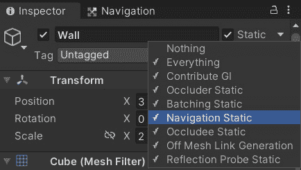

# *第八章*：导航网格

正如我们在*第七章*中看到的，*路径查找*，路径查找中最关键的决策是如何表示场景的几何形状。AI 代理需要知道障碍物的位置，作为 AI 设计师，我们的工作是向路径查找算法提供尽可能好的表示。以前，我们通过将地图划分为 2D 网格来创建自定义表示，然后通过实现 A*算法来使用该表示来实现自定义路径查找算法。但如果我们能让 Unity 为我们做所有这些工作，那岂不是太棒了？

幸运的是，Unity 可以使用**导航网格**（**NavMeshes**）来完成这项工作。在之前的 2D 表示中，我们将世界划分为完美的正方形，而使用 NavMeshes，我们将使用任意的凸多边形来划分世界。这种表示有两个令人兴奋的优点：首先，每个多边形都可以不同，因此我们可以使用少量的大多边形来表示广阔的开放区域，以及许多小多边形来表示非常拥挤的空间；其次，我们不再需要将代理锁定在网格上，因此路径查找会产生更自然的路径。

本章将解释我们如何使用 Unity 内置的 NavMesh 生成器来使 AI 代理的路径查找更加容易和高效。几年前，NavMeshes 是 Unity Pro 的独家功能。幸运的是，这不再是事实；NavMeshes 现在在 Unity 免费版本中对所有用户都可用！

在本章中，我们将涵盖以下主题：

+   设置地图

+   建立带有斜坡的场景

+   创建导航区域

+   Off Mesh Links 概述

# 技术要求

对于本章，您只需要 Unity3D 2022。您可以在本书存储库的`Chapter 8`文件夹中找到本章中描述的示例项目：[`github.com/PacktPublishing/Unity-Artificial-Intelligence-Programming-Fifth-Edition/tree/main/Chapter08`](https://github.com/PacktPublishing/Unity-Artificial-Intelligence-Programming-Fifth-Edition/tree/main/Chapter08)。

# 设置地图

要开始，让我们构建一个简单的场景，如图下所示。这是示例项目中的第一个场景，称为`NavMesh01-Simple.scene`。您可以使用平面作为地面对象，以及几个立方体实体作为墙壁对象：

![图 8.1 – NavMesh01-Simple 场景的图像，一个带有障碍物的平面]

![img/B17984_08_1.jpg]

图 8.1 – NavMesh01-Simple 场景的图像，一个带有障碍物的平面

在接下来的子章节中，我们将设置墙壁作为障碍物，烘焙 NavMesh，并配置坦克。

## 导航静态

一旦我们添加了地板和障碍物，就非常重要的是用**导航静态**标签标记它们，这样 NavMesh 生成器就知道在烘焙过程中需要考虑它们。为此，选择所有对象，点击**静态**按钮，并选择**导航静态**，如图下所示：



图 8.2 – 导航静态属性

## 烘焙 NavMesh

现在我们已经完成了场景，接下来让我们烘焙 NavMesh。为此，请按照以下步骤操作：

1.  导航到 **窗口** | **AI** | **导航**，您应该能看到此窗口：


图 8.3 – 导航窗口

信息

**导航** 窗口中的所有属性都很直观：**代理半径** 和 **代理高度** 代表 Unity 用于烘焙 NavMesh 的虚拟代理的大小，**最大坡度** 是角色可以爬上的最陡坡度的度数，等等。如果我们有多个 AI 代理，我们应该使用最小的 AI 角色的半径和高度来烘焙 NavMesh。有关更多信息，您可以查看以下 Unity 参考文档：[`docs.unity3d.com/Manual/Navigation.html`](https://docs.unity3d.com/Manual/Navigation.html)。

1.  选择平面，在 **对象** 选项卡中，将其区域设置为 **可通行**。


图 8.4 – 导航面板的对象部分

1.  将其他所有设置保留为默认值，然后点击 **烘焙**。

1.  您应该看到一个进度条正在烘焙场景的 NavMesh，过一段时间后，您应该能在场景中看到 NavMesh，如下面的截图所示：


图 8.5 – NavMesh 的烘焙

## NavMesh 代理

到目前为止，我们已经完成了超级简单的场景设置。现在，让我们添加一些 AI 代理来看看它是否工作：

1.  作为角色，我们使用我们信任的坦克模型。但是，如果您在不同的场景中工作并且有不同的模型，请不要担心。无论模型如何，一切操作都是相同的。


图 8.6 – 坦克实体

1.  将 **Nav Mesh Agent** 组件添加到我们的坦克实体中。此组件使路径查找变得简单。我们不再需要实现 A* 等路径查找算法。相反，我们只需要在运行时设置组件的目标属性，该组件将使用 Unity 的内部路径查找算法计算路径。

1.  导航到 **组件** | **导航** | **Nav Mesh Agent** 以添加此组件：


图 8.7 – Nav Mesh Agent 属性

信息

您可以在 [`docs.unity3d.com/Manual/class-NavMeshAgent.html`](https://docs.unity3d.com/Manual/class-NavMeshAgent.html) 找到关于 **Nav Mesh Agent** 的官方 Unity 参考。

需要注意的一个属性是 **区域遮罩** 属性。它指定了此 NavMesh 代理可以行走的 NavMesh 层。我们将在 *烘焙导航区域* 部分讨论导航层。

## 更新代理的目标

现在我们已经设置了我们的 AI 代理，我们需要一种方法来告诉它去哪里，并将坦克的目的地更新为鼠标点击的位置。

因此，让我们添加一个球体实体，我们将其用作标记对象，然后将`Target.cs`脚本附加到一个空的游戏对象上。然后，将这个球体实体拖放到检查器中该脚本的`targetMarker`变换属性。

### Target.cs 类

此脚本包含一个简单的类，它执行三个操作：

+   使用射线获取鼠标点击位置

+   更新标记位置

+   更新所有 NavMesh 代理的`destination`属性

以下行显示了`Target`类的代码：

```py
using UnityEngine;
using System.Collections;
public class Target : MonoBehaviour { 
    private UnityEngine.AI.NavMeshAgent[] navAgents;
    public Transform targetMarker;
    public float verticalOffset = 10.0f;
    void Start() {
        navAgents = FindObjectsOfType(
           typeof(UnityEngine.AI.NavMeshAgent)) as 
           UnityEngine.AI.NavMeshAgent[];
    }
    void UpdateTargets(Vector3 targetPosition) { 
        foreach (UnityEngine.AI.NavMeshAgent agent in 
                 navAgents) {
            agent.destination = targetPosition;
        }
    }
    void Update() {
        // Get the point of the hit position when the mouse 
        // is being clicked 
        if(Input.GetMouseButtonDown(0)) {
            Ray ray = Camera.main.ScreenPointToRay(
              Input.mousePosition);
            if (Physics.Raycast(ray.origin, ray.direction, 
                out var hitInfo)) {
                Vector3 targetPosition = hitInfo.point;
                UpdateTargets(targetPosition);
                targetMarker.position = targetPosition + 
                  new Vector3(0, verticalOffset, 0);
            }
        }
    }
}
```

游戏开始时，我们查找所有的`NavMeshAgent`数组（注意，如果你想在运行时生成新的代理，你需要更新`navAgents`列表）。然后，每当有鼠标点击事件时，我们进行简单的射线投射以确定射线碰撞的第一个对象。如果光线击中一个对象，我们更新标记的位置，并通过将`destination`属性设置为新的位置来更新每个 NavMesh 代理的目的地。我们将在这个章节的整个过程中使用这个脚本来告诉我们的 AI 代理目标位置。

现在，测试场景，并点击你想要坦克前往的点。坦克应该尽可能接近该点，同时避开所有静态障碍物（在这种情况下，是墙壁）。

# 设置带有斜坡的场景

让我们构建一个带有一些斜坡的场景，如下所示：


图 8.8 – 带有斜坡的场景-NavMesh02-Slope.scene

一个需要注意的重要事项是斜坡和墙壁应该接触。如果我们想使用 NavMesh，对象需要完美连接。否则，NavMesh 中会有间隙，代理将无法再找到路径。有一个名为**Off Mesh Link**生成功能来解决类似问题，但我们将在这个章节的*使用 Off Mesh Links*部分稍后讨论 Off Mesh Links。现在，让我们专注于构建斜坡：

1.  确保正确连接斜坡：


图 8.9 – 良好连接的斜坡

1.  我们可以根据我们场景中允许代理旅行的斜坡程度调整导航窗口的**烘焙**选项卡中的**Max Slope**属性。这里我们将使用 45 度。如果你的斜坡比这个更陡，你可以使用更高的**Max Slope**值。

1.  烘焙场景，你应该已经生成了一个 NavMesh，如下所示：


图 8.10 – 生成的 NavMesh

1.  我们将放置一些带有**Nav Mesh Agent**组件的坦克。

1.  创建一个新的立方体对象，并使用它作为目标参考位置。

1.  我们将使用之前的`Target.cs`脚本来更新 AI 代理的`destination`属性。

1.  测试运行场景，你应该看到 AI 代理正在穿越斜坡以到达目标。

恭喜你，你已经实现了第一个基于 NavMesh 的基本 AI。现在，你可以实现能够在简单平原上导航的代理。如果我们想要更复杂的场景呢？这就是下一节的主题。

# 以不同的成本值烘焙导航区域

在具有复杂环境的游戏中，我们通常有一些比其他区域更难以穿越的区域。例如，通过桥梁穿越湖泊比不通过桥梁穿越要简单。为了模拟这种情况，我们希望使穿越湖泊的成本高于使用桥梁。本节将探讨定义不同层级和不同导航成本值的导航区域。

为了这个，我们构建了一个场景，如图*图 8.11*所示。三个平面代表两个由水面隔开且通过类似桥梁的结构连接的地面平面。正如你所见，穿越水面是最直接穿越湖泊的方式；然而，穿越水面的成本比使用桥梁要高，因此路径查找算法将优先选择桥梁而不是水面：


图 8.11 – 带有层级的场景 – NavMesh03-Layers.scene

让我们按照一步一步的程序进行，以便我们可以创建一个导航区域：

1.  前往**导航**窗口并选择**区域**部分：


图 8.12 – 导航窗口中的区域部分

Unity 自带三个默认层级：**默认**、**不可行走**和**跳跃**，每个层级可能有不同的成本值。

1.  让我们添加一个新的层级，命名为`Water`，并给它设置成本为`5`。

1.  选择水面。

1.  前往**导航**窗口，在**对象**选项卡中，将**导航区域**设置为**Water**：


图 8.13 – 水面层级

1.  为场景烘焙 NavMesh 并运行以测试它。

你应该看到 AI 代理现在选择斜坡而不是穿越标记为水面层级的平面，因为穿越水面的成本更高。尝试在水面平面上不同位置放置目标对象。你应该看到 AI 代理有时会游回岸边，有时会走桥梁而不是尝试穿越水面。

信息

你可以在 Unity 官方文档中找到关于**NavMesh 区域**的说明，网址为[`docs.unity3d.com/Manual/nav-AreasAndCosts.html`](https://docs.unity3d.com/Manual/nav-AreasAndCosts.html)。

# 使用 Off Mesh Links 连接区域之间的间隙

有时，场景中可能会有一些间隙，这会使导航网格断开。例如，如果我们将斜坡与墙壁连接得不够紧密，那么在先前的示例中，代理将找不到路径，因此我们需要使其能够跳过这样的间隙。在另一个示例中，我们可能希望设置一些点，让我们的代理可以从墙上跳到下面的平面上。Unity 有一个名为**离网链接**的功能来连接这样的间隙。离网链接可以手动设置或由 Unity 的导航网格生成器自动生成。

这里是我们将在本例中构建的场景。如图 *图 8.14* 所示，两个平面之间有一个小间隙。


图 8.14 – 带有离网链接的场景 – NavMesh04-OffMeshLinks.scene

在本节中，我们将学习如何使用**离网链接**连接这两个平面。

## 生成的离网链接

首先，我们使用自动生成的离网链接连接两个平面。为此，我们需要遵循以下步骤：

1.  在属性检查器中将这两个平面标记为**离网链接生成**和**静态**，如图所示：


图 8.15 – 离网链接生成和静态

1.  前往**导航**窗口，查看**烘焙**选项卡上的属性。您可以设置距离阈值来自动生成离网链接：


图 8.16 – 生成的离网链接属性

1.  点击**烘焙**，您应该会看到连接两个平面的离网链接，如下所示：


图 8.17 – 生成的离网链接

1.  现在，我们的 AI 代理可以在两个平面之间找到路径。但首先，确保在**导航网格代理**组件的**区域遮罩**属性中启用了坦克的**跳跃**功能，如图 *图 8.18* 所示：


图 8.18 – 坦克的区域遮罩配置

如果一切正常，代理一旦到达平面的边缘并找到**离网链接**组件，就会基本上跳到另一个平面上。但当然，如果我们不希望代理跳跃（毕竟，谁见过会跳跃的坦克？），我们应该为代理搭建一座桥来跨越。

## 手动离网链接

如果我们不想在边缘生成离网链接，而是希望代理在传送到另一侧之前到达某个点，那么我们需要手动设置离网链接，如图 *图 8.19* 所示：


图 8.19 – 手动离网链接设置

执行以下步骤以手动设置离网链接：

1.  我们初始化一个场景，两个平面之间有一个显著的间隙。然后，我们在平面的每一侧放置两对球体实体。

1.  选择一个球体，通过导航到**组件** | **导航** | **Off Mesh Link**来添加一个**Off Mesh Link**组件。我们只需要将这个组件添加到一个球体上。

1.  接下来，将第一个球体拖放到**开始**属性，将另一个球体拖放到**结束**属性：

![Figure 8.20 – Off Mesh Link 组件

![img/B17984_08_20.jpg]

图 8.20 – Off Mesh Link 组件

1.  前往**导航**窗口并烘焙场景。

![Figure 8.21 – 手动生成的 Off Mesh Links

![img/B17984_08_21.jpg]

图 8.21 – 手动生成的 Off Mesh Links

1.  现在的手动**Off Mesh Links**连接了两个平面，AI 代理可以使用它们穿越地形，即使在存在间隙的情况下。

    信息

    你可以在 Unity 的官方文档中找到关于 Off Mesh Links 的参考：[`docs.unity3d.com/Manual/nav-CreateOffMeshLink.html`](https://docs.unity3d.com/Manual/nav-CreateOffMeshLink.html)。

这个最后的演示结束了我们对 Unity 的 NavMeshes 的探索。你现在应该已经了解了这个对 AI 角色开发至关重要的工具的所有基础知识。

# 概述

在本章中，我们学习了如何生成和使用 NavMeshes 来实现游戏中的路径查找。首先，我们研究了如何设置具有不同路径查找成本的导航层。然后，使用目标属性，我们使用**Nav Mesh Agent**组件找到路径并移动到目标。接下来，我们设置了 Off Mesh Links，使用自动生成功能和带有**Off Mesh Link**组件的手动设置来连接 NavMeshes 之间的间隙。

在有了所有这些信息之后，我们现在可以轻松地创建具有合理复杂 AI 的简单游戏。例如，你可以尝试将 AI 坦克的目标属性设置为玩家坦克的位置，并让它们跟随它。然后，使用简单的有限状态机（FSMs），一旦它们达到一定距离，它们就可以开始攻击玩家。FSMs 已经带我们走得很远，但它们有其局限性。在下一章中，我们将学习关于行为树（Behavior Trees）以及我们如何使用它们在甚至是最复杂的游戏中做出 AI 决策。
