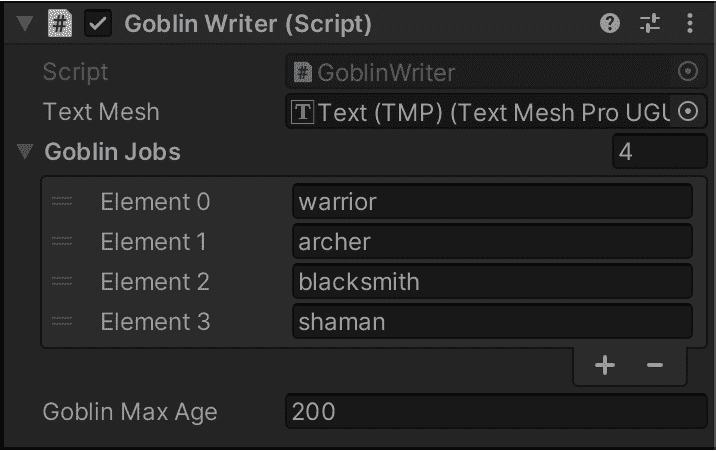
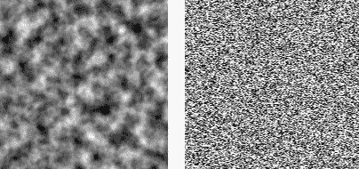
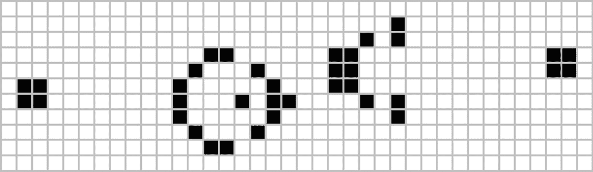
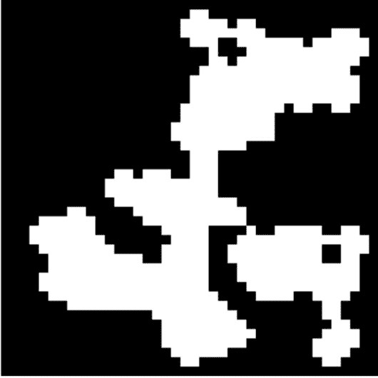
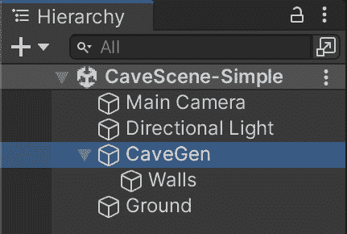

# *第十章*：程序内容生成

游戏人工智能不仅用于告诉 NPC 去哪里或做什么。我们还可以使用游戏 AI 来创建我们游戏的部分，生成资产或音乐，像电影导演一样调整游戏故事以适应玩家的行动，甚至完全生成叙事弧和角色背景故事。在通用人工智能领域，这是**计算创造力**的主题，它是关注设计算法以增强人类创造力或完全自动化需要人类水平创造力的任务的 AI 的一个分支。

计算机创造力的范围广泛且处于前沿。它始于 1952 年，当时艾伦·图灵编写了第一个能够生成情书的算法。今天，它继续发展，强大的机器学习算法试图写诗、创作交响乐或制作惊人的视觉艺术作品。

幸运的是，对于游戏来说，我们感兴趣的只是这个学科的一个更小的子集。我们并不感兴趣于产生具有人类水平创造力的算法（与此努力相关的所有哲学问题）。相反，我们只想编写能够自动扩展我们游戏内容的算法，无论是通过生成成千上万的随机地下城、数百种新武器、外星植物和动物的模型，还是其他任何内容。这被称为**程序内容生成**（**PCG**），它是视频游戏自动化的一个主要角色。

在本章中，我们将涵盖以下主题：

+   理解视频游戏中 PCG 的基本概念

+   通过实现 Goblin NPC 名称的随机生成器来尝试接触 PCG

+   实现简单的洞穴/地下城生成器

# 技术要求

对于本章，你只需要 Unity3D 2022。你可以在本书的仓库中的`第十章`文件夹中找到本章描述的示例项目：[`github.com/PacktPublishing/Unity-Artificial-Intelligence-Programming-Fifth-Edition/tree/main/Chapter10`](https://github.com/PacktPublishing/Unity-Artificial-Intelligence-Programming-Fifth-Edition/tree/main/Chapter10)。

# 理解游戏中的程序内容生成

如介绍中所述，我们指的是所有可以使用 PCG 算法在运行时生成游戏内容的算法。一个 PCG 算法可以创建关卡设计、武器、图形资产、音乐主题、敌人、NPC、角色的背景故事，以及你所能想到的任何其他内容。如果你思考任何游戏中的元素，都有可能至少有一个游戏尝试过以程序化的方式生成它。但为什么你应该这样做呢？

现在，对于公众来说，PCG（过程式内容生成）已经成为了*随机*的同义词。许多游戏通过宣传拥有*过程式生成的关卡*来表明它们提供了数千种不同的关卡，每次游玩都会发生变化。虽然 PCG*可能*表示某种因果关系的过程，但值得注意的是，这仅仅是 PCG 景观的一部分（即使，可能，最具市场价值的）。更确切地说，PCG 是随机性的对立面：它是一种非常确定性地从一个*种子*开始并产生一些内容的算法（但，当然，如果我们使用一个随机的种子，我们就会得到随机的输出）。

PCG 有两个主要的使用场景：

+   第一个场景是使用 PCG 来生成*在开发期间无法预先生成的持久内容*。如果内容太大无法存储在文件中，或者手动生成需要太多的努力，我们可能会有这种需求。例如，原始的太空模拟游戏*精英*（1985 年）使用 PCG 在仅 32 KB 的空间中存储了 8 个包含 256 颗星星的星系（除了游戏代码）。随着可用磁盘空间的增加，这种用法不再是最大的。然而，仍然可能找到用途。2014 年发布的精英新版本，称为*精英：危险*，使用了相同的方法来表示一个真实规模的银河系副本，拥有令人惊叹的 4000 亿个完全可探索的星系。请注意，这里没有随机性：星系是持久的，所有玩家在游戏中共享它。在磁盘上存储每个星系的单独数据将是不可能的。

    更多信息

    你可以在以下 URL 找到对原始精英游戏生成算法的启发性和令人兴奋的分析：[`www.gamedeveloper.com/design/algorithms-for-an-infinite-universe`](https://www.gamedeveloper.com/design/algorithms-for-an-infinite-universe)。

+   第二个是最常见的使用场景：*通过在每次游玩时随意生成内容，为游戏增加多样性和可玩性*。类似 Rogue 的游戏普及了这种 PCG 用法，但无疑，使用 PCG 在每次新运行时创建不同随机世界的最成功的电子游戏是 Minecraft。有了 PCG，你不需要手动制作每个关卡，也不需要设计数百个不同的关卡：你只需要指定*规则*，然后让软件自动生成各种关卡或武器。

现在我们已经了解了*为什么*，让我们探索一些不同的 PCG 算法类型。

## 过程式内容生成的种类

在游戏开发漫长的历史中，PCG 被用于各种各样的任务。因此，我们可以确定 PCG 的六个应用：

+   **运行时内容生成**：这是我们听到 PCG 时本能想到的类型。它包括在运行时生成游戏内容。在*Minecraft*中创建随机世界或在*Diablo*中创建随机地图和武器的例子是这一类别的典型示例。

+   **离线内容生成**：这是我们开发过程中使用的 PCG 类型。即使我们并不打算给玩家提供探索随机生成世界的功能，PCG 对于设计师和开发者来说仍然很有用。例如，如果我们创建了一片森林，我们可以使用 PCG 来创建不同形状的 3D 树木模型（**SpeedTree**是用于此目的的标准工具）。我们还可以使用 PCG 来启动级别的手动设计。假设我们想要设计一个岛屿。我们可能从生成一个简单的随机 PCG 岛屿开始，然后选择最让我们有灵感的那个，最后对其进行手动编辑和建模，以创建最终将在游戏中发布的岛屿。PCG 在设计工具中的其他应用很多，但这些都超出了本章的范围。

+   **玩家介导的内容生成**：这类 PCG 算法将玩家的输入作为随机性的来源。

+   **动态系统**：这种类型的 PCG 通过模拟动态系统来生成 NPC 的行为和叙事背景。一个显著的例子是游戏 *S.T.A.L.K.E.R.* 中的 A-Life 系统。在游戏中，A-Life 系统模拟了游戏世界中数千名居民的生命周期。因此，该系统提供了无限的非脚本化角色供玩家互动，以及无限的支线任务。

但现在就足够理论了。让我们开始编码。

# 实现一个简单的哥布林名字生成器

在上一节中，我们解释了 PCG 的主要目的是在提供多样性的同时，从开发者手中移除手动编写这种多样性的负担。所以，想象一下我们正在开发一款老式 RPG 游戏，我们希望玩家能够与哥布林营地中的 NPC 角色互动。

在营地中，有成百上千的哥布林，我们真的不想为每一个哥布林想出一个名字和职业。这不仅因为无聊且耗时，而且如果我们打算在游戏世界中与哥布林进行随机遭遇，我们需要有能力即时创建新的哥布林。

幸运的是，我们有一个更有趣（对我们来说）的解决方案：编写一个生成大量随机哥布林角色的算法。

## 生成哥布林名字

为了生成某些东西，我们需要找到某种类型的 *生成规则*。为了找到这样的规则，最好的办法是查看我们想要生成的不同示例，并试图找出是否有一些模式将它们联系起来。例如，对于哥布林名字，我们可以从《魔兽世界》中的一大堆哥布林名字中寻找灵感。

让我们来看看其中的一些：*Grizzle Gearslip*、*Hobart Grapplehammer*、*Helix Blackfuse*。继续这个列表，我们可能会发现一个共同的模式：

+   名字由两个或三个音节组成。

+   这些音节有相似的声音，例如 *Bax*、*Griz*、*Hel*、*Hob* 等等。

+   姓氏总是由一个物体或形容词（齿轮、钩爪、黑色、螺栓）加上一个动词组成。

+   姓氏的主题通常与机械工程相关。

这就足够开始了。我们创建一个新的场景，并创建一个名为 `GoblinNameGenerator` 的新脚本，并将以下代码粘贴进去：

```py
class GoblinNameGenerator {
    static string[] NameDatabase1 = { "Ba", "Bax", "Dan", 
      "Fi", "Fix", "Fiz", }; //... and more 
    static string[] NameDatabase2 = { "b", "ba", "be",
      "bi", "d", "da", "de","di", }; // ... and more 
    static string[] NameDatabase3 = { "ald", "ard", "art",
      "az", "azy", "bit","bles", "eek", "eka", "et",
      "ex", "ez", "gaz", "geez", "get", "giez",
      "iek", }; // ... and more
    static string[] SurnameDatabase1 = { "Bolt", "Boom",
      "Bot", "Cog", "Copper","Damp", "Dead", "Far", "Fast",
      "Fiz", "Fizz", "Fizzle", "Fuse", "Gear",
      "Giga", "Gold", "Grapple" }; // ... and more
    static string[] SurnameDatabase2 = { "basher", "blade",
      "blast", "blaster","bolt", "bomb", "boot", "bottom",
      "bub", "button", "buttons", "cash",
      "clamp", };  // ... and more
    private static string RandomInArray(string[] array) {
        return array[Random.Range(0, array.Length)];
    }
    public static string RandomGoblinName() {
        return RandomInArray(NameDatabase1) + 
          RandomInArray(NameDatabase2) +
            RandomInArray(NameDatabase3) + " " +
            RandomInArray(SurnameDatabase1) + 
            RandomInArray(SurnameDatabase2);
    }
}
```

这段代码直接将哥布林名字的规则转换为程序算法。`NameDatabase1`、`NameDatabase2` 和 `NameDatabase3` 数组包含名字的第一个、中间和最后一个音节。同样，`SurnameDatabase1` 和 `SurnameDatabase2` 包含哥布林姓氏的两个部分。为了生成名字，我们从每个列表中随机选择一个片段，并将所有内容组合在一起。

## 完成哥布林描述

现在我们有了名字，我们只需要其他一些小细节。所以，让我们创建一个空对象，并将其一个名为 `GoblinWriter` 的新 `MonoBehavior` 实例附加到它上。

这个新脚本包含以下代码：

```py
using System.Collections;
using System.Collections.Generic;
using UnityEngine;
public class GoblinWriter : MonoBehaviour {
    public TMPro.TextMeshProUGUI textMesh;
    public List<string> goblinJobs;
    public int goblinMaxAge = 200;
    void Start() {
        UpdateString();
    }
    void Update() {
        if (Input.GetKeyDown(KeyCode.Space)) {
            UpdateString();
        }
    }
    void UpdateString() {
        string goblinName =
          GoblinNameGenerator.RandomGoblinName();
        string goblinAge = Random.Range(20,
          goblinMaxAge).ToString();
        string goblinJob = goblinJobs[Random.Range(0, 
          goblinJobs.Count)];
        textMesh.text = $"{goblinName} is a {goblinAge} 
          years old goblin {goblinJob}.";
    }
}
```

脚本有三个公开属性。第一个，`textMesh`，是对将在屏幕上显示文本的 TextMesh 元素的引用（你可以通过访问 `goblinJobs` 创建一个，它存储了我们想要分配给哥布林的作业列表。正如你在 *图 10.1* 中所看到的，我添加了四个作业：`goblinMaxAge`，代表我的哥布林的最高年龄。

![图 10.1 – 检查器中的哥布林作家脚本]



图 10.1 – 检查器中的哥布林作家脚本

每当我们调用 `UpdateString`（即在游戏开始时以及每次我们按下 *空格键* 时），我们只需从年龄、职业和名字的可能值集中提取一个值，并构建一个字符串。一旦我们设置好了一切，我们就可以运行演示，每次我们按下 *空格键* 时（*图 10.2*），我们都应该看到一个新哥布林的描述。

![图 10.2 – 我们可以生成的许多随机哥布林之一]


图 10.2 – 我们可以生成的许多随机哥布林之一

这个例子很简单，但它是为任何游戏增加多样性的有效方法。

信息

《地下城与龙》第五版的地下城主手册包含了许多这类 *组合和随机驱动的程序生成* 的例子。在里面，你可以找到许多用于生成宝藏、武器、支线任务、角色等等的表格。当然，它是为了与笔和骰子一起使用而设计的，但没有什么阻止你将纸面算法转换为计算机算法！

现在我们已经对程序生成有了品味，让我们提高游戏水平。让我们介绍另一个对 PCG 开发者很有用的工具：Perlin 噪声。

# 学习如何使用 Perlin 噪声

**Perlin 噪声** 是由 Ken Perlin 在 1983 年开发的一种用于定义数字噪声的算法。它很快成为在大量程序内容生成算法中生成自然外观图案的事实上的算法。例如，Perlin 噪声用于创建 3D 地形、2D 纹理、程序动画等等。

![图 10.3 – Perlin 噪声（左）与白噪声（右）之间的区别]



图 10.3 – Perlin 噪声（左）与白噪声（右）之间的区别

但是什么让 Perlin 噪声与其他噪声不同？简短的答案是它看起来更 *自然*。然而，这个答案只是将问题转化为 *更自然是什么意思？* 让我们想象标准的非 Perlin 噪声，例如，0 到 1 之间的随机数字序列。序列可能如下所示：0、0.9、0.2、0.3、0.95 等。

如您所见，这些数字可以毫无标准地上下跳跃。如果这些数字代表游戏中的角色位置，角色看起来会疯狂地左右传送。这不是现实生活中物体的移动方式。

Perlin 噪声不同之处在于，在数字序列中，两个连续的数字总是彼此靠近。例如，在 0.9 之后，我们可能会有 0.91、0.92 或 0.88，但绝不会是 0.1。这种效果就像一个浮标在海面上漂浮：它可以不可预测地左右移动，上下移动，但具有一定的平滑性——一定的自然性。

这看起来很完美。然而，我们如何在 Unity 中使用 Perlin 噪声？幸运的是，Unity 将 Perlin 噪声算法作为内置工具提供。

## 内置的 Unity Perlin 噪声

Unity 提供了一个简单的函数来访问 Perlin 噪声：

```py
Mathf.PerlinNoise(xCoord, yCoord);
```

Unity 将 Perlin 噪声实现为一个无限的 2D 平面，您可以使用 `Mathf.PerlinNoise` 函数在代码中随机采样。您可以简单地采样一个随机坐标，以获取 Perlin 噪声平面上 *随机* 的值。

信息

注意，Unity 只提供了 2D Perlin 噪声。然而，Perlin 噪声可以轻松扩展到 3D（例如，用于创建体积烟雾）或甚至更多维度。如果您需要 3D Perlin 噪声，您需要自己开发算法或在网上寻找许多开源实现（例如，[`gist.github.com/tntmeijs/6a3b4587ff7d38a6fa63e13f9d0ac46d`](https://gist.github.com/tntmeijs/6a3b4587ff7d38a6fa63e13f9d0ac46d))。

假设您想使用 Unity 内置的 Perlin 噪声创建一个随机的 2D 纹理。您可以通过从任意点（`xStart` 和 `yStart`）开始，然后将周围每个点的值复制到纹理中来实现这一点，如下面的示例所示（完整的 `PerlinTexture.cs` 文件包含在 GitHub 仓库中）：

```py
    void CalculateNoise() {
        for (float y = 0.0f; y < noiseTex.height; y++) {
            for (float x = 0.0f; x < noiseTex.width; x++) {
                float xCoord = 
                  xOrg + x / noiseTex.width * scale;
                float yCoord = 
                  yOrg + y / noiseTex.height * scale;
                float value = 
                  Mathf.PerlinNoise(xCoord, yCoord);
                pix[(int)y * noiseTex.width + (int)x] = 
                  new Color(value, value, value);
            }
        }
        // Copy the pixel data to the texture and load it 
        // into the GPU.
        noiseTex.SetPixels(pix);
        noiseTex.Apply();
    }
```

然而，我们也可以使用 2D Perlin 噪声来生成 1D Perlin 噪声。在这种情况下，我们固定一个坐标（`x` 或 `y`），然后让另一个坐标沿直线移动。

假设我们想要动画化一个上下摆动的球体，像气球一样轻轻上下浮动。我们可以通过将其 *y* 坐标（经典地表示上下方向）设置为 Perlin 噪声的值来实现这一点：

```py
using UnityEngine;
public class Bobbling : MonoBehaviour {
    // Range over which height varies.
    public float heightScale = 1.0f;
    // Distance covered per second along X axis of Perlin
    // plane.
    public float xScale = 1.0f;
    void Update() {
        float height = heightScale *
          Mathf.PerlinNoise(Time.time * xScale, 0.0f);
        Vector3 pos = transform.position;
        pos.y = height;
        transform.position = pos;
    }
}  
```

如果您将这个小脚本附加到任何对象上，您将看到对象随机上下移动。

这只是 Perlin 噪声应用的冰山一角，但我希望它能帮助你入门。然而，是时候我们继续我们的 PCG 之旅了。在下一节中，我们将使用一种称为**细胞自动机**的新技术来生成一个随机洞穴。

# 生成随机地图和洞穴

PCG 的另一个广泛应用是地图和地牢的生成。例如，在**roguelike**类型（一种从 20 世纪 80 年代的游戏*Rogue*中取名的游戏类型）中，玩家每次开始游戏时都会面对一个随机生成的地牢。同样，在*Minecraft*中，玩家通过生成一个随机世界来开始游戏，并在其中探索和生存。例子很多——多到无法在此列出。

有许多算法可以创建游戏世界。一些使用分形噪声来生成随机的地形图。另一些通过创建随机房间并将它们通过走廊连接起来来创建类似地牢的结构。还有一些通过将预先制作好的房间随机排列成无数不同的组合来构建地图，就像拼图一样（如果你玩过 20 世纪 80 年代的桌面游戏*Carcassonne*，你就知道我在说什么了）。

本演示将探索一种非常适合生成洞穴或自然外观场景的简单技术，称为**细胞自动机**。

## 细胞自动机

**细胞自动机**（**CA**）不仅是一个 PCG 算法。自 1950 年以来，CA 作为一种抽象的计算模型被研究。然而，它们的普及直到 20 世纪 70 年代康威的**生命游戏**发布后才爆发。

细胞自动机（CA）的基本思想是模拟二维网格中细胞的**行为**。网格中的每个细胞有两种状态：死亡或存活。每个细胞将根据仅取决于其邻居的规则死亡或存活。



图 10.4 – 生命游戏中的细胞配置

细胞自动机算法的行为仅取决于这些进化规则。因此，我们从初始的存活和死亡细胞配置开始，然后让系统独立进化。例如，在**生命游戏**中，我们有四个简单的规则：

+   拥有少于两个存活邻居的存活细胞人口不足，因此它们会死亡。

+   拥有两个或三个存活邻居的存活细胞将在下一代中继续存活。

+   拥有超过三个存活邻居的存活细胞人口过多，因此它们会死亡。

+   拥有恰好三个存活邻居的死亡细胞会因**繁殖**而复活。

结果表明，这四条简单的规则足以使算法本身成为图灵完备的。这意味着可以编写一个活细胞和死细胞的配置，在应用上述四条规则之后，能够像普通计算机一样进行任何计算，例如乘法或下棋。如果你对此感兴趣，保罗·伦德尔在他的网页上对这种模式有详细的描述（[`rendell-attic.org/gol/tm.htm`](http://rendell-attic.org/gol/tm.htm)）。

但让我们回到我们的目标。幸运的是，我们不需要做比用我们的 CA 实现 CPU 更复杂的事情。在 PCG 中，CA 是一个很好的选择，因为它们易于实现，并且生成的地图看起来像自然环境，如沙漠、洞穴、群岛等。

## 实现洞穴生成器

为了实现我们的洞穴生成器，我们需要两个组件：

+   一个抽象地生成和存储地图的组件（例如，作为一个整数的数组）

+   一个将抽象地图渲染成游戏中的可见 3D 对象的组件

因此，让我们先实现第一个组件。我们将称之为`CaveGenerator`：

```py
using UnityEngine;
using System;
public class CaveGenerator : MonoBehaviour {
    [SerializeField]
    private int width;
    [SerializeField]
    private int height;
    [SerializeField]
    private int seed;
    [SerializeField]
    private bool useRandomSeed;
    private int[,] map;
    void Start() {
        InitializeRandomGrid();
        DrawCaveMesh();
    }
    void Update() {
        if (Input.GetKeyDown(KeyCode.G)) {
            CellularAutomata(false);
            DrawCaveMesh();
        } else if (Input.GetKeyDown(KeyCode.Space)) {
            CellularAutomata(true);
            DrawCaveMesh();
        } else if (Input.GetKeyDown(KeyCode.N)) {
            InitializeRandomGrid();
            DrawCaveMesh();
        }
    }
```

该组件向检查器公开了四个属性。前两个属性简单地是地图的`weight`和`height`，以*单元格数量*表示。然后我们有随机生成器的`seed`，以防我们想要创建特定的地图（这在调试目的上特别有用）。然而，通常情况下，我们希望在每次开始游戏时都有一个随机的地图；这就是为什么我们有`useRandomSeed`属性：如果它是`true`，我们初始化一个随机种子。最后，我们有一个私有的二维数组来存储`map`表示。

在属性指定之后，我们需要初始化`Start`和`Update`回调函数。这些函数将简单地调用我们接下来定义的其他函数。在`Update`中，我们还可以看到我们用来控制演示的键：每次我们按下*空格键*，我们就会运行 CA 模拟的另一个步骤；当我们按下*N*键时，我们初始化一个新的地图。

当我们按下*G*键时，我们为 CA 运行不同的规则（我们将在设置 CA 规则时详细介绍这一点）。

我们现在将实现`InitializeRandomGrid`函数。这个函数使用随机的死细胞和活细胞初始化地图。然而，还有两个额外的提示。首先，该函数在地图周围创建了一个墙的边界（活细胞）。这是因为地图通常是有限的，我们不希望玩家跳出地图。这个墙的边界将确保最终地图不会有通向地图边缘的洞穴：

```py
    void InitializeRandomGrid() {
        map = new int[width, height];
        if (useRandomSeed) {
            seed = (int)DateTime.Now.Ticks;
        }
        System.Random randomGen =
          new System.Random(seed.GetHashCode());
        int mapMiddle = (height / 2);
        for (int c = 0; c < width; c++) {
            for (int r = 0; r < height; r++) {
                if (c == 0 || c == width - 1 || r == 0 || r
                     == height - 1) {
                    map[c, r] = 1;
                } else {
                    if (c == mapMiddle) {
                        map[c, r] = 0;
                    } else {
                        map[c, r] = (randomGen.Next(0, 100)
                          < 50) ? 1 : 0;
                    }
                }
            }
        }
    }
```

第二个技巧是保持一列空的空间（死细胞）。这就是检查`mapMiddle`变量的目的。留出这行空白的原因很简单：它通过生成贯穿整个地图的主连接洞穴，经验上给出了更好的结果。你可以移除它以获得多个孤立的小洞穴，或者找到一个不同的起始模式，根据你的口味和用例提供更好的结果。`InitializeRandomGrid`函数初始化类似于*图 10.5*中的图像。


图 10.5 – 地图的初始状态

现在，我们将查看一个小的实用函数，我们用它来计算特定地图单元格周围的墙壁数量：

```py
    int GetSurroundingWallCount(int c, int r, int size) {
        int wallCount = 0;
        for (int iX = c - size; iX <= c + size; iX ++) {
            for (int iY = r - size; iY <= r + size; iY ++)
            {
                if (iX != c || iY != r) {
                    wallCount += isWall(iX, iY) ? 1 : 0;
                }
            }
        }
        return wallCount;
    }
    bool isWall(int c, int r) {
        if (c < 0 || r < 0) {
            return true;
        }
        if (c > width - 1 || r > height - 1) {
            return true;
        }
        return map[c, r] == 1;
    }
```

第一个函数很简单。它查看目标坐标周围的单元格，并计算墙壁的数量。它还接受一个`size`参数，表示目标坐标周围的*半径*。如果`size`等于`1`，我们检查目标坐标周围的八个单元格（想象一个 3x3 的正方形）。如果`size`等于`2`，我们还会检查邻居的邻居（想象一个 5x5 的正方形）。

`isWall`函数用于检查特定坐标是否代表墙壁。你可能会问：我们为什么不直接检查`(c,r)`处的`map`值？因为我们可能进入数组外的坐标（例如，`(-1,-1)`）。在这种情况下，我们假设地图外的每个单元格都是墙壁（并且它将保持为墙壁）。这简化了`GetSurroundingWallCount`的逻辑。

现在是时候进入重点 – CA 规则：

```py
    void CellularAutomata(bool clean = false) {
        int[,] newmap = new int[width, height];
        for (int c = 0; c < width; c ++) {
            for (int r = 0; r < height; r ++) {
                int numWalls = 
                  GetSurroundingWallCount(c, r, 1);
                int numWalls2 = 
                  GetSurroundingWallCount(c, r, 2);
                if (isWall(c,r)) {
                    if (numWalls > 3) {
                        newmap[c, r] = 1;
                    } else {
                        newmap[c, r] = 0;
                    }
                } else {
                    if (!clean) {
                        if (numWalls >= 5 || numWalls2 <= 
                            2) {
                            newmap[c, r] = 1;
                        } else {
                            newmap[c, r] = 0;
                        }
                    } else {
                        if (numWalls >= 5) {
                            newmap[c, r] = 1;
                        } else {
                            newmap[c, r] = 0;
                        }
                    }
                }
            }
        }
        map = newmap;
    }
```

对于洞穴生成器，我们使用两组规则。第一组（当`clean`等于`true`时获得）描述如下：

+   如果一个单元格是墙壁，只要它周围有超过三个墙壁，它就会保持为墙壁。否则，它变成空空间。

+   如果一个单元格为空，只要它周围有少于五个墙壁，它就会保持为空。否则，它变成墙壁。

第二组规则与第一组相同，但它还检查半径为`2`的邻居。如果围绕一个空单元格的空空间太多，那么它就会变成墙壁。这种可选行为可以消除大空隙，促进更狭窄的通道。然而，这也可能留下像噪声一样的孤立 1x1 墙壁（这就是为什么这组规则使用`clean`参数等于`false`来启用）。

通过运行这些规则，我们得到如图 10.6 所示的地图。



图 10.6 – 由我们的算法生成的随机洞穴

我们现在有一个完全工作的算法，但没有方法在游戏中展示它。为此，我们有`DrawCaveMesh`函数：

```py
    void DrawCaveMesh() {
        MeshGenerator meshGen =
          GetComponent<MeshGenerator>();
        meshGen.GenerateMesh(map, 1);
    }
```

这个函数简单地调用一个网格生成器。我们将在下一节实现`MeshGenerator`。

## 渲染生成的洞穴

给定抽象地图表示（存储在`map`中的二维数组），我们需要将其转换为屏幕上渲染的网格。我们可以通过多种方式实现。为了提供灵活性，我们首先定义一个抽象组件：

```py
using UnityEngine;
public abstract class MeshGenerator : MonoBehaviour {
    abstract public void GenerateMesh(int[,] map, float
                                      squareSize);
}
```

这个简单的抽象类告诉 Unity，每个有效的`MeshGenerator`都应该包含一个`GenerateMesh`函数。这个函数接受数组地图和每个单元格的大小作为输入，大小以 Unity 单位表示。

这很酷，但显然现在并不太有用。我们仍然无法渲染任何东西。不要担心；我们现在将实现一个简单的网格渲染器。

### 基本网格渲染器

这个渲染器的想法是为每个墙壁单元生成一个 1x1 的立方体。我们将这个渲染器称为`WallGenerator`：

```py
public class WallGenerator : MeshGenerator {
    public GameObject wallCube;
    public override void GenerateMesh(int[,] map, 
      float squareSize) {
        foreach (Transform t in transform) {
            Destroy(t.gameObject);
        }
        int width = map.GetLength(0);
        int height = map.GetLength(1);
        for (int c = 0; c < width; c++) {
            for (int r = 0; r < height; r++) {
                if (map[c, r] == 1) {
                    GameObject obj = Instantiate(wallCube,
                      new Vector3(c * squareSize, 0, r *
                      squareSize), Quaternion.identity);
                    obj.transform.parent = transform;
                }
            }
        }
        transform.position = 
          new Vector3(-width / 2.0f, 0, -height / 2.0f);
        MergeCubes();
    }
```

首先，请注意，这个类扩展了我们的抽象`MeshGenerator`类。其次，这个组件公开了一个名为`wallCube`的单个参数。这个参数包含一个墙壁预制体的引用（基本上是一个彩色的 3D 立方体）。

然后，我们实现`GenerateMesh`函数。实现方法再次简单直接：

1.  我们销毁所有现有的墙壁（存储为子元素）。

1.  然后，我们遍历抽象地图中的每个单元格，并在适当的位置生成一个`wallCube`对象。

1.  我们将地图平移一半的大小（用于可视化目的）。

然而，存在问题。Unity 不适合生成成千上万的 GameObject。所以，如果我们的地图是 200x200，这个函数将可能生成 40,000 个 GameObject 仅用于渲染地图。结果将是一个相当慢的游戏（我们甚至还没有生成角色）。

幸运的是，有一个快速解决方案：

```py
    private void MergeCubes() {
        transform.GetComponent<MeshFilter>().mesh = 
          new Mesh();
        MeshFilter[] meshFilters =
          GetComponentsInChildren<MeshFilter>();
        CombineInstance[] combine = 
          new CombineInstance[meshFilters.Length];
        int i = 0;
        while (i < meshFilters.Length) {
            combine[i].mesh = meshFilters[i].sharedMesh;
            combine[i].transform =
              meshFilters[i].transform.localToWorldMatrix;
            meshFilters[i].gameObject.SetActive(false);
            i++;
        }
        transform.GetComponent<MeshFilter>().mesh = 
          new Mesh();
        transform.GetComponent<MeshFilter>()
          .mesh.indexFormat = 
          UnityEngine.Rendering.IndexFormat.UInt32;
        transform.GetComponent<MeshFilter>()
          .mesh.CombineMeshes(combine, true);
        transform.gameObject.SetActive(true);
        foreach (Transform t in ransform) {
            Destroy(t.gameObject);
        }
    }
```

`MergeCubes`函数接受我们刚刚生成的所有立方体子元素，并将它们组合成一个具有单个网格的单个游戏对象。我们通过利用内置的`CombineMeshes`工具来实现这一点。

如您在前面的代码中看到的，我们首先获取所有子元素（所有单独的墙壁）。然后，对于它们中的每一个，我们创建`CombineInstance`。唯一需要记住的棘手之处是存储网格的坐标为世界坐标（Unity 通过调用`.transform.localToWorldMatrix`来实现这一点）。

一旦我们有了所有的`CombineInstance`对象，我们就用组合所有墙壁得到的网格替换地图的网格。

信息

根据地图的大小，默认的`IndexFormat`可能无法容纳组合网格的所有顶点。我们可以通过使用 32 位索引来解决这个问题，即`transform.GetComponent<MeshFilter>().mesh.indexFormat = UnityEngine.Rendering.IndexFormat.UInt32;`。

最后，我们销毁所有子元素。

现在，我们可以设置场景。最终结果在下面的屏幕截图中显示。



图 10.7 – CaveGen 层级结构

首先，让我们创建一个大的平面用于地面层，然后创建一个名为`CaveGen`的对象。`CaveGen`对象包含一个`MeshRenderer`和一个`MeshFilter`组件（但没有网格）。

现在将`CaveGenerator`和`WallRenderer`组件附加到这个对象上，并按照以下截图进行配置。

![图 10.8 – CaveGenerator 和 WallGenerator 组件

![图片 B17984_10_8.jpg]

图 10.8 – CaveGenerator 和 WallGenerator 组件

最后一步是将**Wall**预制体添加到**Wall Cube**中。然后，最终我们可以点击**Play**，应该会看到类似于*图 10.9*的类似效果。

![图 10.9 – 初始随机配置

![图片 B17984_10_9.jpg]

图 10.9 – 初始随机配置

我们现在可以通过按*Spacebar*（或如果我们想应用第二套 CA 规则，则按*G*）继续地图生成。经过一段时间，您可能会注意到地图稳定到一个类似于*图 10.10*的地图。到那时，您的地图就准备好了（但您可以通过按*N*重新开始）。

![图 10.10 – 完全演化的地图

![图片 B17984_10_10.jpg]

图 10.10 – 完全演化的地图

对于我们用不到 130 行代码编写的 PCG 算法来说，这已经很不错了。

### 高级网格渲染器

`WallGenerator`快速且有效；然而，它并不最优。最终的网格包含大量冗余顶点，我们仍然有这种像素化的外观。我们可以使用许多其他不同的算法来生成网格。一个标准的解决方案是使用**Marching Squares**算法（如果应用于 3D，也称为**Marching Cubes**）。

这个算法有点复杂，详细的讨论会远远超出本书的范围。然而，在这个演示的代码中，我包含了一个`MarchingCubesGenerator`组件供您使用和探索。该算法来自官方 Unity 教程([`www.youtube.com/watch?v=yOgIncKp0BE`](https://www.youtube.com/watch?v=yOgIncKp0BE))，我已经为这个演示进行了适配。

要使用它，您只需将`WallGenerator`组件替换为`MarchingCubesGenerator`。如果您现在运行游戏并运行几代 CA，您应该会看到类似于*图 10.11*的效果。

![图 10.11 – 使用 MarchingCubesGenerator 渲染的地图

![图片 B17984_10_11.jpg]

图 10.11 – 使用 MarchingCubesGenerator 渲染的地图

如您所见，我们得到了更平滑的墙壁和更少的顶点（性能得到提升）。如果您喜欢这个洞穴生成器并想深入了解，我鼓励您通过访问[`learn.unity.com/tutorial/generating-content`](https://learn.unity.com/tutorial/generating-content)的官方教程。

# 摘要

在本章中，我们仅仅触及了 PCG（程序生成内容）的表面。首先，我们从一个简单的算法开始，用于创建随机的哥布林传记。然后，我们利用 CA（细胞自动机）的力量开发了一个复杂的洞穴系统，并发现了两种在 3D 地图中渲染抽象网格的技术。

然而，正如我所说的，这只是一个开始。PCG 代表了一类庞大的算法，它融合了编程与艺术的边界。PCG 本身就是一个值得探索的编程领域，本章的目的是给你一个微小的尝试。

现在，我们已没有更多时间来探讨 PCG 了。是时候进入下一章，学习机器学习了。

# 进一步阅读

如果你想要对 Unity 中的 PCG 进行更深入的探索，Ryan Watkins 为此主题撰写了一整本书，书名为*《Unity 游戏开发中的程序内容生成》*，由*Packt*出版。
