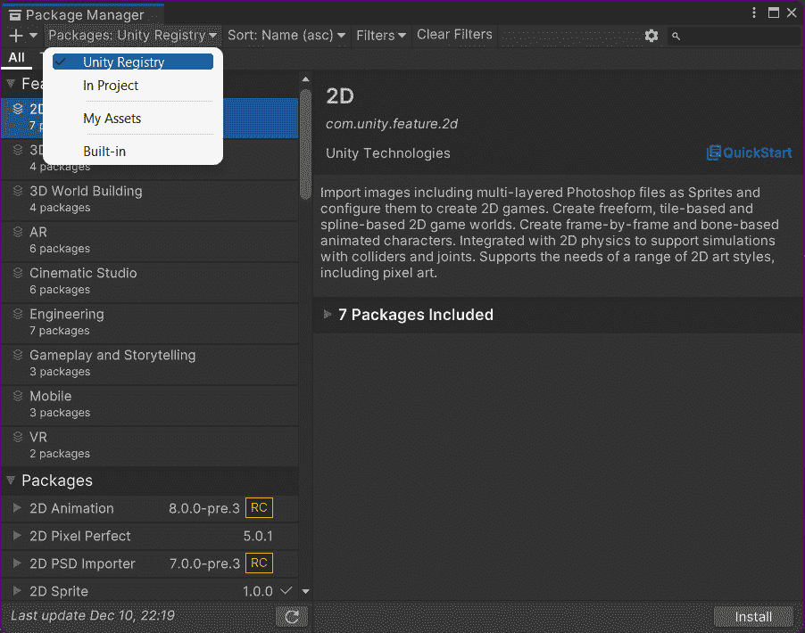
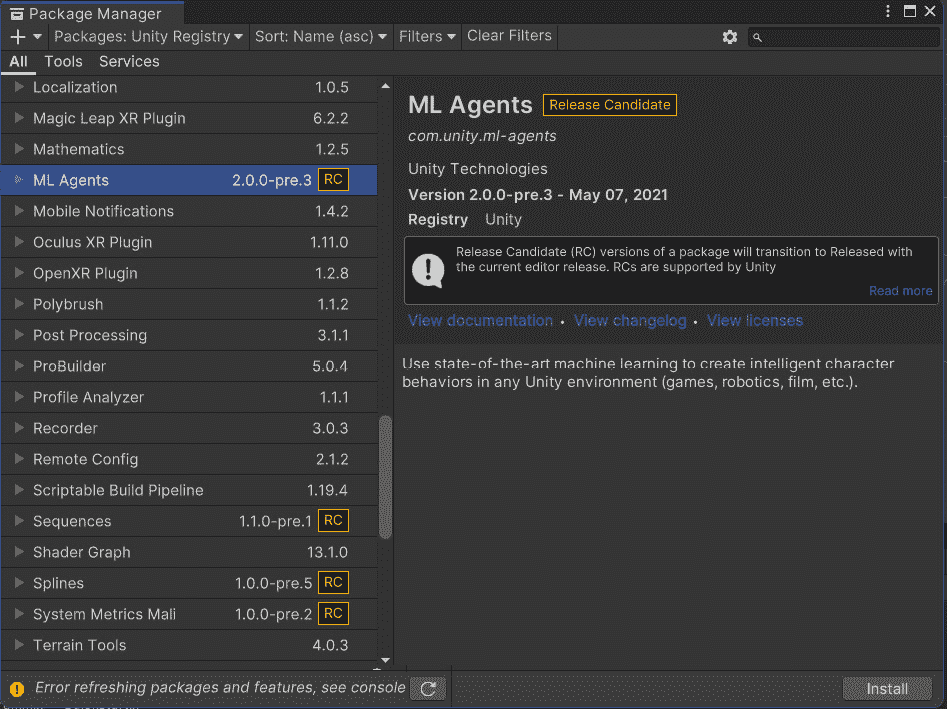
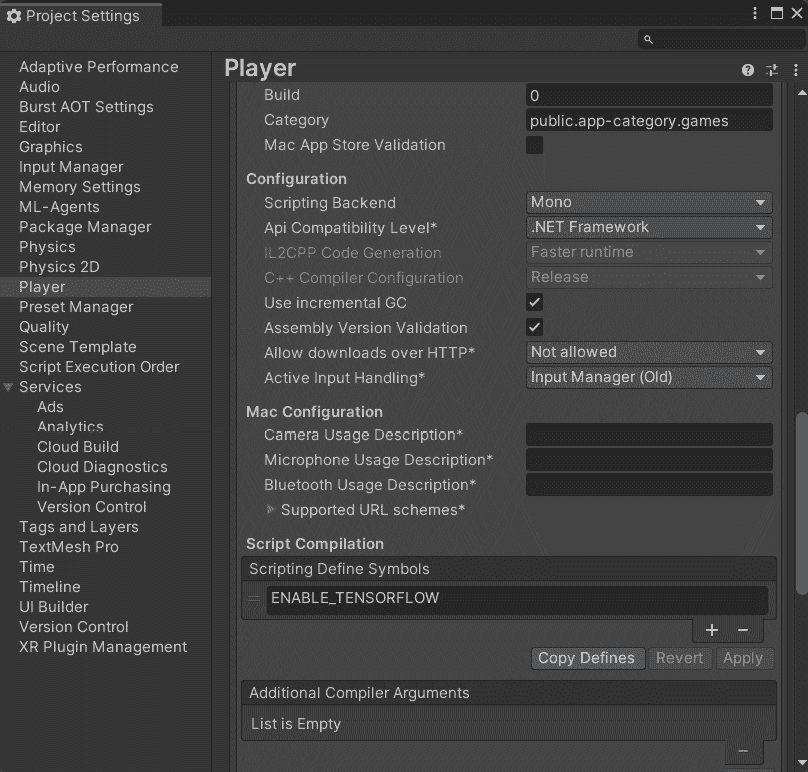
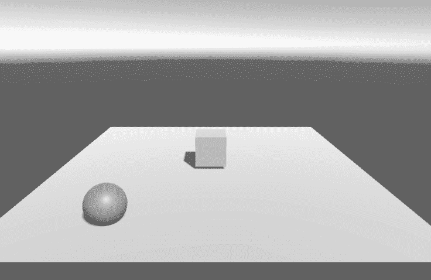
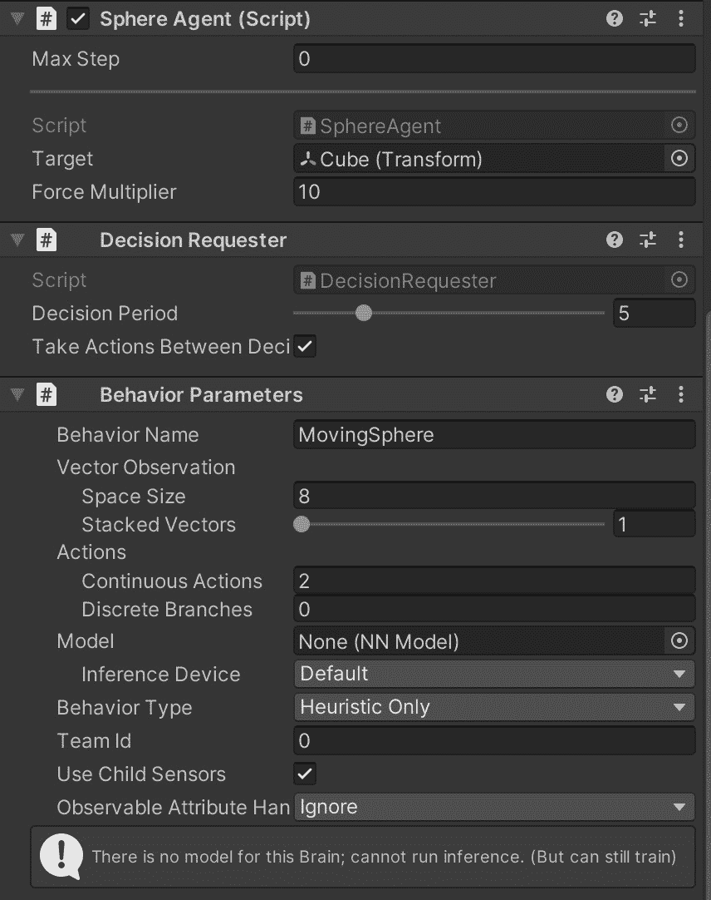

# *第十一章*：Unity 中的机器学习

机器学习是**人工智能**（**AI**）中最热门的术语。如今，几乎所有东西都包含（或声称包含）一些由机器学习驱动的 AI，旨在改善我们的生活：日历、待办事项应用、照片管理软件、每部智能手机等等。然而，尽管“机器学习”这个短语大多数时候只是一个营销噱头，但毫无疑问的是，机器学习在近年来已经取得了显著的进步。最重要的是，现在有大量的工具允许每个人在没有先前的学术级 AI 知识的情况下实现学习算法。

目前，机器学习在游戏开发中并未得到广泛应用（除了用于程序内容生成的应用）。这有很多原因。但主要原因是设计师无法控制机器学习代理的输出，而在游戏设计中，不可控的结果通常与不有趣的游戏相关。因此，游戏 AI 开发者更倾向于使用更可预测和直接的技术，例如行为树。

另一方面，能够在 Unity 中使用机器学习算法对于非游戏用途非常有用，例如模拟、AI 研究和*一些严肃的*游戏应用。无论原因如何，Unity 提供了一个完整的机器学习工具包，使我们免于将游戏引擎与外部机器学习框架接口的复杂性。

在本章中，我们将探讨以下主题：

+   Unity 机器学习工具包简介

+   设置 Unity 机器学习代理工具包

+   看看如何运行一个简单的示例

机器学习是一个广泛的话题；因此，我们并不期望涵盖它的每一个方面。相反，您可以查看工具包文档以及本章末尾链接的附加资源以获取进一步参考。

# 技术要求

对于本章，您需要在您的系统上安装 Unity3D 2022、Python 3.7、PyTorch 和 ML-Agents 工具包。如果您还没有安装，请不要担心；我们将介绍安装步骤。您可以在本书的仓库中的`第十一章`文件夹中找到本章描述的示例项目：[`github.com/PacktPublishing/Unity-Artificial-Intelligence-Programming-Fifth-Edition/tree/main/Chapter11`](https://github.com/PacktPublishing/Unity-Artificial-Intelligence-Programming-Fifth-Edition/tree/main/Chapter11)

# Unity 机器学习代理工具包

**Unity 机器学习代理工具包**（**ML-Agents Toolkit**）是一组软件和插件，帮助开发者编写由机器学习算法驱动的自主游戏代理。您可以在 GitHub 仓库[`github.com/Unity-Technologies/ml-agents`](https://github.com/Unity-Technologies/ml-agents)中探索和下载源代码。

ML-Agents 工具包基于强化学习算法。简单来说，强化学习是训练狗的算法等价物。例如，如果您想教狗一些技巧，您给他一个命令，然后，当狗按照您的期望行事时，您就奖励它。奖励告诉您的狗它正确地响应了命令，因此，下次它听到相同的命令时，它会做同样的事情以获得新的奖励。

注意

在强化学习中，您也可以在智能体做错事情时惩罚它，但在狗训练的例子中，我可以向您保证惩罚是完全不必要的。只需给他们奖励即可！

对于使用强化学习训练的 AI 智能体，我们执行类似的循环：

1.  当智能体采取行动时，该行动会影响世界（例如改变智能体的位置、移动物体、收集硬币、获得分数点等等）。

1.  算法随后将新的世界状态和奖励（或惩罚）发送回智能体。

1.  当智能体决定其后续行动时，它将选择最大化预期奖励（或最小化预期惩罚）的行动。

因此，很明显，训练一个强化学习智能体需要模拟智能体采取行动、接收奖励、更新其决策值、执行另一个行动等场景的多次模拟。这项工作通过 PyTorch 从 Unity 卸载。**Torch** 是一个流行的开源机器学习库，Facebook 和 IBM 等科技巨头也在使用它。

有关强化学习的更多信息，请参阅章节末尾的*进一步阅读*部分。

让我们看看如何安装这个工具包。

# 安装 ML-Agents 工具包

作为第一步，我们需要下载这个工具包。我们可以通过以下命令克隆仓库来完成：

```py
git clone --branch release_19 https://github.com/Unity-Technologies/ml-agents.git
```

此命令会在您的当前文件夹中创建一个`ml-agents`文件夹。ML-Agents 工具包由两个主要组件组成：

+   包含 Unity 和 PyTorch 训练器的 Python 接口的 Python 包（存储在`ml-agents`文件夹中）

+   包含与 OpenAI Gym（[`gym.openai.com/`](https://gym.openai.com/)）接口的 Python 包，OpenAI Gym 是一个用于训练强化学习智能体的工具包（存储在`gym-unity`文件夹中）。

    信息

    **Git** 是世界上最著名的版本控制应用程序。它用于存储您的源代码，跟踪不同版本，与他人协作，等等。如果您还没有使用 Git，您真的应该试试看。您可以从[`git-scm.com/`](https://git-scm.com/)下载它。

现在，是时候安装所需的依赖项了。

## 在 Windows 上安装 Python 和 PyTorch

ML-Agents 工具包建议的 Python 版本是 3.7。你可以通过多种方式安装它，其中最快的方式是在 Microsoft Store 中搜索 Python 3.7（或点击此链接：[`www.microsoft.com/en-us/p/python-37/9nj46sx7x90p`](https://www.microsoft.com/en-us/p/python-37/9nj46sx7x90p))。

在 Windows 上，在安装 `mlagents` 包之前，你需要手动安装 PyTorch。为此，你可以在终端中简单地运行以下命令：

```py
pip3 install torch~=1.7.1 -f https://download.pytorch.org/whl/torch_stable.html
```

信息

如果你安装 PyTorch 时遇到任何困难，可以参考官方安装指南：[`pytorch.org/get-started/locally/`](https://pytorch.org/get-started/locally/)。

在这一步之后，你应该能够遵循与 macOS 和 Unix-like 系统相同的安装步骤。

## 在 macOS 和 Unix-like 系统上安装 Python 和 PyTorch

要在 macOS 或 Linux 上安装 ML-Agents 工具包，你首先需要安装 Python 3.6 或 Python 3.7（目前，ML-Agents 工具包只推荐这两个 Python 版本）。

然后，你可以运行以下命令：

```py
python -m pip install mlagents==0.28.0
```

在 macOS 和 Linux 上，此命令会自动安装正确的 PyTorch 版本。

安装完成后，如果一切正常，你应该能够在系统中的任何位置运行 `mlagents-learn --help` 命令而不会出现任何错误。

注意

Pip3 会自动与任何 Python 3.x 分发一起安装。如果你没有安装 `pip3`，请尝试按照官方指南操作：[`pip.pypa.io/en/latest/installing/`](https://pip.pypa.io/en/latest/installing/)。

# 使用 ML-Agents 工具包 – 一个基本示例

现在一切都已经安装完毕，我们可以开始使用 ML-Agents 工具包。首先，让我们解释一下 ML-Agents 场景的基本架构。

ML-Agents 场景被称为 **学习环境**。学习环境是一个标准的 Unity 场景，包含两个主要元素：

+   编写 `Agent` 类的行为。例如，如果 Agent 是一辆车，我们需要编写如何通过输入来控制车辆，以及我们如何奖励和惩罚车辆（例如，我们可以奖励车辆以超过一定速度行驶，当它驶离道路时进行惩罚）。一个学习环境可以包含你想要的任意数量的 Agent。

+   对场景中的每个 `Agent` 调用 `OnEpisodeBegin()`。

+   对场景中的每个 `Agent` 调用 `CollectObservations(VectorSensor sensor)`。此函数用于收集环境信息，以便每个 `Agent` 可以更新其内部模型。

+   对场景中的每个 `Agent` 调用 `OnActionReceived()`。此函数执行每个 `Agent` 选择的动作并收集奖励（或惩罚）。

+   如果一个 Agent 完成了其剧集，学院会为 Agent 调用 `OnEpisodeBegin()`。此函数负责将 Agent 重置到起始配置。

要开始使用 ML-Agents 工具包，我们需要做以下几步：

1.  打开 Unity 并创建一个空项目。

1.  前往 **Windows** | **软件包管理器**。

1.  在右上角菜单中，选择 **Unity 注册表**：



图 11.1 – Unity 包管理器

1.  查找 **ML Agents** 包并安装它：



图 11.2 – 包管理器中的 ML Agents 包

我们需要确保我们使用的是正确的运行时。

1.  要这样做，请转到 **编辑** | **项目设置** | **玩家**，并为每个平台（PC、Mac、Android 等），进入 **其他设置** 并确保 **API 兼容性级别** 设置为 **.NET Framework**。如果不是，调整这些设置以满足我们的需求，然后保存，如下所示：



图 11.3 – 包含正确设置的“项目设置”窗口

## 创建场景

创建学习环境很简单。让我们创建一个简单的 3D 场景，包含一个平面、一个球体和一个立方体，如下截图所示：



图 11.4 – 基本演示场景

我们将立方体放在平面的中心，并给球体添加一个 `Rigidbody` 组件。这个场景的目的是训练一个滚动的球体到达目标（立方体）而不从平面上掉落。

## 实现代码

现在，我们需要实现描述代理行为和 ML-Agent 学院的代码。代理的行为脚本描述了代理在模拟中如何执行动作、代理收到的奖励以及我们如何将其重置以开始新的模拟：

1.  选择球体。让我们给它添加一个新的脚本，命名为 `SphereAgent`，内容如下：

    ```py
    using System.Collections.Generic;
    using UnityEngine;
    using Unity.MLAgents;
    using Unity.MLAgents.Sensors;
    using Unity.MLAgents.Actuators;
    public class SphereAgent : Agent {
        Rigidbody rBody;
        public Transform Target;
        public float forceMultiplier = 10;
        void Start () {
            rBody = GetComponent<Rigidbody>();
        }

        override public void OnEpisodeBegin() {
            if (transform.position.y < -1.0) {
                // The agent fell
                transform.position = Vector3.zero;
                rBody.angularVelocity = Vector3.zero;
                rBody.velocity = Vector3.zero;
            } else {
                // Move the target to a new spot
                Target.position = new Vector3(Random.value *
                  8 - 4, 0.5f, Random.value * 8 - 4);
            }
        }
    }
    ```

这是我们的演示的基础代理。`OnEpisodeBegin` 是系统在每次我们想要重置训练场景时调用的函数。在我们的例子中，我们检查球体是否从平面上掉落，并将其带回零；否则，我们将其移动到随机位置。

1.  我们需要将 `CollectObservations` 方法添加到 `SphereAgent` 中。代理使用此方法从游戏世界中获取信息，然后使用它来做出决策：

    ```py
        override public void CollectObservations(
          VectorSensor sensor) {
            // Calculate relative position
            Vector3 relativePosition = 
              Target.position - transform.position;
            // Relative position
            sensor.AddObservation(relativePosition.x/5);
            sensor.AddObservation(relativePosition.z / 5);
            // Distance to edges of platform
            sensor.AddObservation(
             (transform.position.x + 5) / 5);
            sensor.AddObservation(
              (transform.position.x - 5) / 5);
            sensor.AddObservation(
              (transform.position.z + 5) / 5);
            sensor.AddObservation(
              (transform.position.z - 5) / 5);
            // agent velocity
            sensor.AddObservation(rBody.velocity.x / 5);
            sensor.AddObservation(rBody.velocity.z / 5);    }
    ```

在这个例子中，我们感兴趣的是以下内容：

+   球体代理相对于立方体（目标）的相对位置。我们只对 `x` 和 `z` 值感兴趣，因为球体只在平面上移动（注意，我们通过除以 `5`（默认平面大小的一半）来归一化这些值）。

+   平面边缘的距离。

+   球体的速度。

1.  我们需要实现 `OnActionReceived` 方法。每当代理需要采取行动时，都会调用此方法。该方法接受一个 `ActionBuffer` 类型的单个参数。`ActionBuffer` 对象包含对球体控制输入的描述。在我们的例子中，我们只需要两个连续的动作，对应于沿游戏 *x* 和 *z* 轴施加的力。

1.  我们还需要定义奖励。如前所述，当我们达到目标时，通过调用`SetReward`，我们给代理奖励一分。如果代理从飞机上掉落，我们通过调用`EndEpisode`以零分结束这一轮。代码的最终版本如下：

    ```py
        public override void OnActionReceived(
          ActionBuffers actionBuffers) {
            // Actions, size = 2
            Vector3 controlSignal = Vector3.zero;
            controlSignal.x = 
              actionBuffers.ContinuousActions[0];
            controlSignal.z = 
              actionBuffers.ContinuousActions[1];
            rBody.AddForce(controlSignal * forceMultiplier);
            // Rewards
            float distanceToTarget = Vector3.Distance(this.
              transform.localPosition, Target.localPosition);
            // Reached target
            if (distanceToTarget < 1.42f) {
                SetReward(1.0f);
                EndEpisode();
            }
            // Fell off platform
            else if (this.transform.localPosition.y < 0) {
                EndEpisode();
            }
        }}
    ```

现在，是时候将这个`SphereAgent`脚本连接到我们的球体上了。

## 添加最终细节

现在，我们需要连接所有部件，使演示工作：

1.  首先，我们将`SphereAgent`脚本附加到球体上。

1.  我们将立方体拖放到**Sphere Agent**组件的**目标**字段中。

1.  通过点击**添加组件**，我们添加一个**决策请求器**组件。我们可以保留默认设置。

1.  在`MovingSphere`中。

1.  我们将`8`设置为对应我们在`CollectObservations`方法中添加的观察数量。

1.  最后，我们将`2`设置为。此时，球体脚本应该看起来像以下截图：



图 11.5 – 球体代理的检查器视图

现在是测试我们的环境的时候了。

# 测试学习环境

在我们开始学习之前，我们希望通过手动输入控制代理来测试环境。在不浪费数小时训练过程的情况下调试学习环境非常有用。

幸运的是，ML-Agents Toolkit 使得使用实时输入控制代理变得非常方便。我们只需要两个步骤：

1.  我们将`Heuristic`方法添加到`SphereAgent`组件中。这个函数允许我们手动指定`ActionBuffer`对象的值。在我们的情况下，我们想要将两个连续动作添加到控制器的输入轴上：

    ```py
        public override void Heuristic(
          in ActionBuffers actionsOut) {
            var continuousActionsOut = 
              actionsOut.ContinuousActions;
            continuousActionsOut[0] = 
              Input.GetAxis("Horizontal");
            continuousActionsOut[1] = 
              Input.GetAxis("Vertical");
        }
    ```

1.  现在，我们转到检查器，并将**行为类型**参数设置为**仅启发式**：


图 11.6 – 行为类型配置

到目前为止，你可以按**播放**在 Unity 中，你应该能够使用箭头键（或游戏控制器摇杆）控制球体。你可以通过检查这一轮的行为来测试环境。如果你到达目标立方体，它应该消失并在另一个随机位置重新生成。如果你从飞机上掉落，你应该在飞机上重生。

如果一切看起来正常，那么是时候自动训练代理了。

# 训练代理

在我们开始训练之前，我们需要编写一个训练配置文件。打开您的终端并进入任何空文件夹。然后，创建一个`sphere.yaml`文件，包含以下代码：

```py
behaviors:
  MovingSphere:
    trainer_type: ppo
    hyperparameters:
      batch_size: 10
      buffer_size: 100
      learning_rate: 3.0e-4
      beta: 5.0e-4
      epsilon: 0.2
      lambd: 0.99
      num_epoch: 3
      learning_rate_schedule: linear
      beta_schedule: constant
      epsilon_schedule: linear
    network_settings:
      normalize: false
      hidden_units: 128
      num_layers: 2
    reward_signals:
      extrinsic:
        gamma: 0.99
        strength: 1.0
    max_steps: 500000
    time_horizon: 64
    summary_freq: 10000
```

然后，我们需要确保将球体对象中的**行为类型**参数更改为**默认**。

现在，从同一个文件夹中，我们应该能够运行以下命令：

```py
mlagents-learn sphere.yaml --run-id=myMovingSphere
```

`run-id`是你运行会话的唯一 ID。如果一切按计划进行，你应该在某个时候在终端窗口中看到**通过在 Unity 编辑器中按播放按钮开始训练**的消息。现在，你可以按照消息所说的，在 Unity 中按**播放**。

训练完成后，您将在`results/myMovingSphere/MovingSphere.onnx`文件中找到训练好的模型（在运行`mlagents-learn`命令的文件夹内的`results`文件夹中）。

将此文件复制到您的 Unity 项目中，然后将其放入球体组件的**模型**占位符中：


](img/B17981_11_7.jpg)

图 11.7 – 行为参数中的训练好的 MovingSphere 模型

现在，如果您按下**播放**，球体将根据训练模型自主移动。这并不是什么大而复杂的事情，但无论如何，它是自动化学习。

# 摘要

在本章中，我们只是刚刚触及了机器学习的表面以及如何用它来训练 Unity 代理。我们学习了如何安装 Unity 的官方 ML-Agents 工具包，设置学习环境，并训练了模型。然而，这仅仅是 ML-Agents 工具包的基本介绍，还有许多未探索的方向等待您去发现。我鼓励您查看 ML-Agents 官方仓库；它包括许多有趣的演示项目。

在下一章中，我们将通过将一个 AI 代理开发成一个更复杂的游戏演示来总结一切。

# 进一步阅读

+   如需更多信息，我鼓励您查看官方仓库中 ML-Agents 的详细文档（[`github.com/Unity-Technologies/ml-agents/tree/master/docs`](https://github.com/Unity-Technologies/ml-agents/tree/master/docs)）。

+   对于一个更深入（但仍然非常易于理解）的强化学习介绍，freeCodeCamp 上有一篇很好的文章（[`medium.freecodecamp.org/an-introduction-to-reinforcement-learning-4339519de419`](https://medium.freecodecamp.org/an-introduction-to-reinforcement-learning-4339519de419)）。

+   如果您愿意更深入地了解强化学习，一个完美的下一步是*《深度强化学习实战，第二版》，*Maxim* *Lapan*，*Packt Publishing*。
