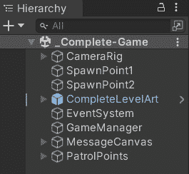
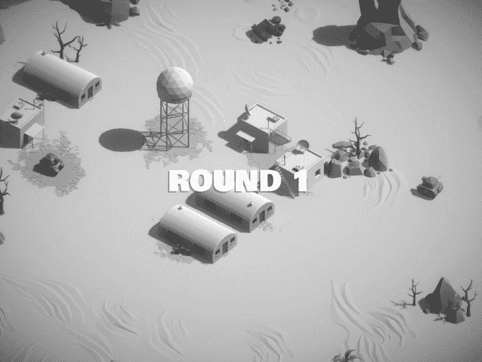
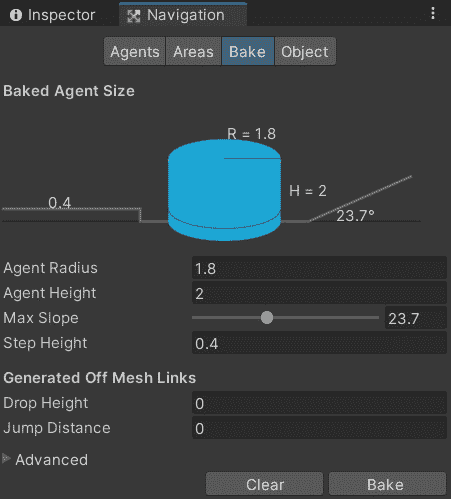
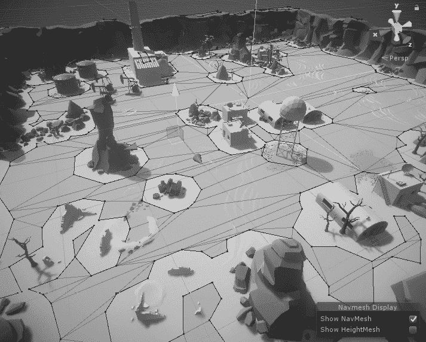
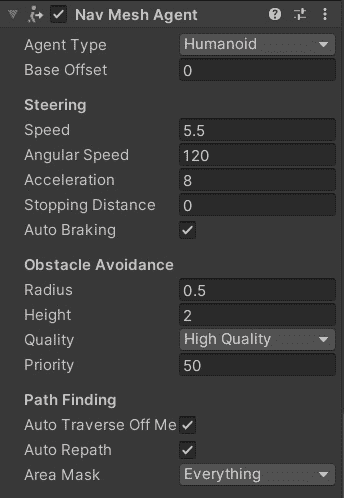
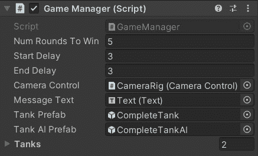
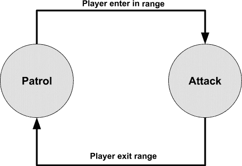
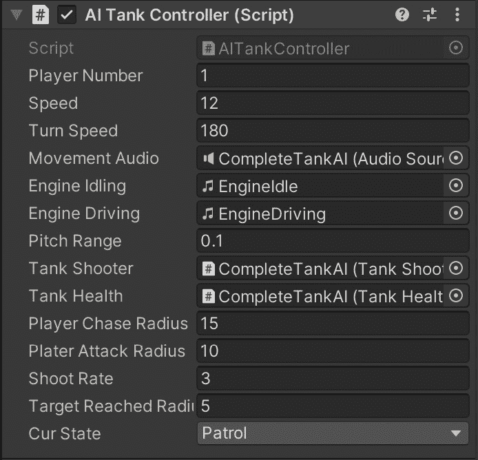

# *第十二章*：整合一切

在前十一章中，我们探讨了各种人工智能方法，并使用 Unity3D 构建了一些简单的演示应用程序。在本章中，我们将使用之前章节中探索的一些技术来开发一个更复杂的游戏示例。本章我们将使用的技术包括导航网格和**有限状态机**（**FSMs**），但更重要的是，我们将学习如何导航并添加人工智能到一个现有的复杂游戏中。因此，与之前的章节不同，这个示例更像是一个真实世界的场景。

在本章中，我们将为名为 *TANKS!* 的简单坦克战斗游戏添加人工智能，该游戏包含在官方 Unity 教程中，而该教程又受到了历史坦克游戏 *Combat*（Atari 2600 上的游戏）的启发。在默认版本中，TANKS! 是一个双人游戏。每个玩家控制一辆坦克，目标是摧毁对方。为了使事情更加复杂，玩家可以通过按住 *空格键* 的时间长短来决定射击的强度（以及因此的距离）。

然而，因为我们作为人工智能开发者，我们希望为敌方坦克构建一个可以在单人模式中游玩的人工智能。所以，这就是本章我们将要做的。

在本章中，我们将涵盖以下主题：

+   开发基本游戏结构

+   添加自动化导航

+   使用 FSM 创建决策人工智能

# 技术要求

对于本章，你只需要 Unity3D 2022。你可以在这个章节的 GitHub 仓库中的`Chapter 12`文件夹中找到本章描述的示例项目：[`github.com/PacktPublishing/Unity-Artificial-Intelligence-Programming-Fifth-Edition/tree/main/Chapter12`](https://github.com/PacktPublishing/Unity-Artificial-Intelligence-Programming-Fifth-Edition/tree/main/Chapter12)。

# 开发基本游戏结构

对于这个演示，我们将为免费教程游戏 *TANKS!* 编写人工智能。你可以从 Unity Asset Store（`https://assetstore.unity.com/packages/essentials/tutorial-projects/tanks-tutorial-46209`）下载基础游戏，或者跟随本书 GitHub 仓库中`Chapter 12`文件夹中的版本。本书附带版本的优势是已经针对 Unity 2022 进行了测试。

在任何情况下，游戏都是一样的。当我们开始游戏时，我们看到一个愉快的沙漠场景，有岩石、结构、棕榈树等等。使用键盘，我们应该能够控制蓝色坦克（坦克通过 *W*、*A*、*S* 和 *D* 移动，并通过 *空格键* 射击）。

以下截图显示了游戏的基本结构：



图 12.1 – 游戏的基本层次结构

第一次使用现有项目时，尽可能多地花时间熟悉游戏结构、基本脚本和组件。你必须知道如何在不知道的项目中轻松操作。为此，运行游戏几次，尝试对代码进行一些小的修改以查看效果，并添加调试信息以了解信息在游戏中的流动。以下图片将给你一个我们运行游戏时游戏外观的印象：



图 12.2 – TANKS!游戏中的实际操作

信息

遵循完整的 Unity 教程可能会有所帮助，该教程可在[`unity3d.com/learn/tutorials/s/tanks-tutorial`](https://unity3d.com/learn/tutorials/s/tanks-tutorial)找到。即使它不涉及 AI 并且相当陈旧（教程是在 2015 年录制的），你仍然可以找到许多对游戏开发非常重要的指导，例如如何设计游戏管理器、基本控制和音频。

# 添加自动导航

第一步是修改关卡以支持自动导航。在原始游戏中，玩家控制所有移动对象（坦克），因此路径查找是不必要的。现在我们想要添加 AI，我们需要有一个世界表示，通过这个表示 AI 可以移动。幸运的是，这个过程很简单，多亏了导航网格。

## 创建导航网格

要完成这个任务，请执行以下步骤：

1.  打开导航窗口（**窗口** | **AI** | **导航**）并查看导航网格生成参数。在这种情况下，导航网格生成相对简单：我们只对在地面上移动感兴趣，所以没有跳跃、没有链接，也没有需要关心的斜坡。

1.  我们需要调整默认导航网格参数的唯一调整是烘焙代理大小（即 Unity 用于验证位置是否足够大以允许代理通过的虚拟代理的尺寸）。

1.  游戏中使用的坦克大约有三单位大，因此我们需要指示生成器移除坦克无法通过的区域。以下截图显示了导航网格的烘焙设置：



图 12.3 – 导航网格烘焙选项

为了确保安全，我们使用`1.8`并减少`20`（毕竟，我们对斜坡不感兴趣：游戏是完全平坦的）。

1.  之后，按**烘焙**。你应该会得到一个很好的导航网格，就像以下截图所示：



图 12.4 – 地图中的烘焙导航网格

1.  现在，我们想要添加一些巡逻点，AI 坦克可以跟随。为此，我们创建一个空的 GameObject；你可以随意创建尽可能多的其他 GameObject 实例。

1.  然后，我们创建一个`PatrolPoint`标签，并将所有巡逻点都标记为该标签。


图 12.5 – 在编辑器视图中标记为 PPoint 的巡逻点

现在我们有一个世界表示和一组我们可以用来四处游荡的点，我们需要创建一个由 AI 控制的代理。

## 设置代理

不幸的是，游戏不支持 AI，因此我们需要自己添加代理。为此，执行以下步骤：

1.  我们必须识别玩家坦克。正如您从游戏层次结构中看到的那样，场景中没有坦克。正如您在初步探索中应该知道的那样，`GameManager`负责生成坦克。我们将使用的坦克模型是一个名为**CompleteTank**的预制件。

1.  让我们复制预制件并将其命名为`CompleteTankAI`。

1.  然后我们需要添加**Nav Mesh Agent**组件，以便我们可以在新的 NavMesh 上移动它。



图 12.6 – Nav Mesh Agent 组件的检查器

但这还不够。首先，我们将重用**TANKS!**演示中的`TankShooting`脚本，因此如果此脚本附加到 AI 上，我们需要禁用射击（否则玩家可以为 AI 代理射击）。

1.  为了这个，我们创建一个名为`m_IsAI`的公共布尔变量。请注意，对于这个演示，我们使用原始教程的变量命名约定。这是为了避免让从 Asset Store 工作的人感到困惑。此外，始终采用现有项目的编码约定是明智的，而不是在整个代码库上强加我们的偏好。无论如何，让我们将以下行添加到`Update`脚本中：

    ```py
    private void Update () {
        if (m_IsAI) {
            return;
        }
        …
    ```

这些行只是停止 AI 代理的`Update`脚本，从而禁用 AI 角色的玩家输入。在 AI 坦克预制件中启用此变量很重要。我们还需要添加另一个补丁；实际上，如果我们禁用输入，我们也会禁用射击强度。

1.  因此，我们需要将以下内容添加回`Fire`函数：

    ```py
    // We need to make Fire public.
    public void Fire (){
        // Set the fired flag so only Fire is only called
        // once. 
        m_Fired = true;
        // Create an instance of the shell and store a
        // reference to its rigidbody.
        Rigidbody shellInstance = Instantiate (m_Shell, 
          m_FireTransform.position,
          m_FireTransform.rotation) as Rigidbody;
    // New lines: if AI, we shoot with average force. 
        if (m_IsAI) {
    m_CurrentLaunchForce = 
              m_MaxLaunchForce / 2.0f;
        }
        // Set the shell's velocity to the launch force in
        // the fire position's forward direction.
        shellInstance.velocity = 
          m_CurrentLaunchForce * m_FireTransform.forward;
        // Change the clip to the firing clip and play it. 
        m_ShootingAudio.clip = m_FireClip;
        m_ShootingAudio.Play ();
        // Reset the launch force. This is a precaution in
        // case of missing button events.
        m_CurrentLaunchForce = m_MinLaunchForce;
    }
    ```

我们用恒定射击力替换了射击力变量，以简化操作。

信息

作为练习，您可以将`m_CurrentLaunchForce`作为`Fire()`函数的参数。我们还使`Fire()`函数公开：实际上，我们需要从稍后要实现的 FSM 中调用此函数。

最后，我们可以从坦克 AI 预制件中移除`TankMovement`组件。现在，是时候更新`GameManager`脚本以启用*玩家对计算机*模式了。

## 修复 GameManager 脚本

作为最后一步，我们需要指示`GameManager`脚本生成一个玩家坦克和一个 AI 坦克：

1.  打开`GameManager`脚本，并添加一个新的公共变量，我们将在这个变量中存储新的 AI 坦克预制件：

    ```py
    // Reference to the prefab the players will control.
    public GameObject m_TankPrefab;
    // Reference to the prefab the AI will control.
    public GameObject m_TankAIPrefab;
    ```

1.  然后，以这种方式修改`SpawnAllTanks`函数：

    ```py
    private void SpawnAllTanks(){
        // Spaw the Player
        m_Tanks[0].m_Instance = Instantiate(m_TankPrefab,
           m_Tanks[0].m_SpawnPoint.position,
           m_Tanks[0].m_SpawnPoint.rotation);
        m_Tanks[0].m_PlayerNumber = 01;
        m_Tanks[0].Setup();
        // Spawn the AI Tanks
        for (int i = 1; i < m_Tanks.Length; i++) {
            m_Tanks[i].m_Instance =
              Instantiate(m_TankAIPrefab,
              m_Tanks[i].m_SpawnPoint.position,
              m_Tanks[i].m_SpawnPoint.rotation);
            m_Tanks[i].m_PlayerNumber = i + 1;
            m_Tanks[i].Setup();
        }
    }
    ```

现在这个游戏是单人游戏，我们假设第一个坦克总是玩家（我们生成`m_TankPrefab`模型），任何其他坦克都是 AI 控制的（我们生成`m_TankAIPrefab`模型）。

1.  最后，只需按照以下方式将预制件添加到检查器中。请记住，在`CompleteTankAI`预制件中启用`m_IsAI`变量，并将其层从**玩家**更改为**AI**。



图 12.7 – 检查器中的游戏管理器脚本

现在我们已经设置了基础知识，现在是时候编写敌方坦克的 AI 了。

# 使用 FSM 创建决策 AI

在*第二章*，“有限状态机”中，我们看到了如何实现一个简单的有限状态机（FSM）。在本节中，我们使用相同的技巧，但将应用于本演示的更复杂场景。

首先，我们需要一个 FSM 计划。我们只对将 FSM 连接到现有游戏的本演示感兴趣，所以我们将保持简单。我们的坦克 FSM 由两个状态组成——巡逻和射击。

计划很棒且直接：

1.  人工智能坦克从“巡逻”状态开始，在之前定义的巡逻点周围徘徊。

1.  然后，如果玩家进入范围，坦克将切换到“攻击”状态。

1.  在“攻击”状态下，坦克转向玩家并开始对其射击。

1.  最后，如果我们处于“攻击”状态，而玩家离开 AI 的范围，坦克将返回到“巡逻”状态。



图 12.8 – 敌方坦克的简单 FSM

对于实现，执行以下步骤：

1.  让我们从 FSM 类开始：

    ```py
    using UnityEngine;
    using System.Collections;
    public class FSM : Complete.TankMovement {
        // Next destination position of the NPC Tank
        protected Vector3 destPos;
        // List of points for patrolling
        protected GameObject[] pointList;
        protected virtual void Initialize() { } 
        protected virtual void FSMUpdate() { } 
        protected virtual void FSMFixedUpdate() { }
        // Use this for initialization
        void Start() {
            Initialize();
        }
        // Update is called once per frame 
        void Update() {
            FSMUpdate();
        }
        void FixedUpdate() {
            FSMFixedUpdate();
        }
    }
    ```

如您所见，这个类扩展了`Complete.TankMovement`脚本。这样，我们可以重用现有的`TankMovement`代码，用于引擎声音和其他外观方面。

如*第二章*，“有限状态机”中所述，FSM 类存储了我们需要的决策 AI 数据。此外，它包含实际的`Update`、`FixedUpdate`和`Start`方法。在 FSM 类中，我们希望存储所有巡逻点和目的地点（坦克正在寻找的当前巡逻点）。

1.  现在是时候创建完整的控制器了。我们创建一个新的`AITankController`脚本，其初始内容如下：

    ```py
    using UnityEngine;
    using System;
    using UnityEngine.AI;
    public class AITankController : FSM {
        public Complete.TankShooting tankShooter;
        public Complete.TankHealth tankHealth;
        public float playerChaseRadius = 15.0f;
        public float platerAttackRadius = 10.0f;
        public float shootRate = 3.0f;
        public float targetReachedRadius = 5.0f;
        private bool isDead = false;
        private float elapsedTime = 0.0f;
        private GameObject player = null;
        private NavMeshAgent navMeshAgent;
        public enum FSMState {
            None, Patrol, Attack, Dead,
        }
        // Current state that the NPC is reaching
        public FSMState curState;
    …
    ```

在前面的代码中，类首先扩展了 FSM 并定义了状态。如您在`FSMState`枚举中看到的，我们有“巡逻”和“攻击”，一个空状态（`None`），以及一个最终状态（`Dead`）。然后我们添加了一些类属性来存储我们需要的资料。

前两个属性是对坦克中`TankShooter`和`TankHealth`脚本的引用。我们将使用它们来检查健康状况并发射子弹。然后有一个`isDead`布尔值来停止 FSM 执行。然后有`elapsedTime`和`shootRate`来控制坦克射击的频率，接着是两个私有属性，用于存储对玩家（如果在其范围内）和对`NavMeshAgent`的引用。最后，我们有一个变量用于存储 FSM 中的当前状态。

1.  `Initialize`函数用于初始化，当然，是 FSM：

    ```py
        //Initialize the Finite state machine for the NPC tank
        protected override void Initialize() {
            navMeshAgent = GetComponent<NavMeshAgent>();
            // Get the list of points 
            pointList = GameObject.FindGameObjectsWithTag(
              "PatrolPoint");
            int rndIndex = UnityEngine.Random.Range(0,
              pointList.Length);
            destPos =
              pointList[rndIndex].transform.position;
        }
    ```

在这个函数中，我们做了三件事：

+   我们获取`NavMeshAgent`的引用。

+   我们获取场景中所有`PatrolPoint`的列表

+   我们随机选择一个巡逻点作为代理的当前目的地。

1.  然后是`Update`函数。然而，在此之前，我们需要公开坦克的当前健康值。让我们向`TankHealth`组件添加以下行：

    ```py
        // ...
        private AudioSource m_ExplosionAudio 
        private ParticleSystem m_ExplosionParticles
        private float m_CurrentHealth;
        private bool m_Dead;
        public float CurrentHealth { get; }
        // ...
    ```

我们添加了`CurrentHealth`属性，以便我们可以获取只读公共访问权限到私有成员`m_CurrentHealth`。

1.  我们现在准备好实现 FSM 的`FSMUpdate`方法：

    ```py
        protected override void FSMUpdate() {
            switch (curState) {
                case FSMState.Patrol: 
                    UpdatePatrolState();
                    break; 
                case FSMState.Attack: 
                    UpdateAttackState(); 
                    break;
                case FSMState.Dead: 
                    UpdateDeadState();
                    break;
            }
            elapsedTime += Time.deltaTime;
            // Go to dead state is no health left
            if (tankHealth.CurrentHealth <= 0) {
                curState = FSMState.Dead;
            }
        }
    ```

正如我们之前解释的，`Update`函数的主要任务是调用适当的函数，取决于当前状态。除了那之外，`FSMUpdate`还更新了`elapsedTime`计时器，如果坦克没有健康值，则将代理设置为`死亡`状态。

1.  `死亡`状态非常简单：坦克什么都不做，并在控制台上写上它已经死亡：

    ```py
        private void UpdateDeadState() {
            if (!isDead) {
                Debug.Log("Dead");
            }
        }
    ```

1.  `攻击`状态更有趣：

    ```py
        private void UpdateAttackState() {
            Collider[] players = Physics.OverlapSphere(
              Transform.position, playerChaseRadius,
              LayerMask.GetMask("Players"));
            if (players.Length == 0) {
                curState = FSMState.Patrol;
                player = null;
                navMeshAgent.enabled = true; 
                return;
            }
            player = players[0].gameObject;
            Vector3 _direction = 
              (player.transform.position – 
               transform.position).normalized;
            Quaternion _lookRotation =
              Quaternion.LookRotation(_direction);
            transform.rotation = 
              Quaternion.Slerp(transform.rotation,
              _lookRotation, Time.deltaTime * 3);
            if (elapsedTime > shootRate) {
                tankShooter.Fire(); 
                elapsedTime = 0;
            }
        }
    ```

在前面代码的第一部分，我们使用 Unity 的物理引擎投射一个球体来*查看*半径为`15`单位的所有*玩家*。然后，如果没有玩家（意味着玩家在范围之外），我们切换到`巡逻`状态，移除玩家引用，启用`NavMeshAgent`组件，并终止状态。否则，我们继续攻击：获取玩家引用，将坦克旋转到其方向，并射击（以正确的速率）。

幸运的是，原始游戏已经实现了`Fire`函数！这就是为什么良好的类设计是至关重要的：如果一个类是功能性的，你可以很好地重用它，即使是为了你最初没有考虑的事情！

1.  最后，我们有`巡逻`状态函数：

    ```py
        private void UpdatePatrolState() {
            Collider[] players = Physics.OverlapSphere(
              transform.position, playerAttackRadius,
              LayerMask.GetMask("Players")"));
            if (players.Length > 0) {
                curState = FSMState.Attack;
                player = players[0].gameObject;
                navMeshAgent.enabled = false;
                return;
            }
            if (IsInCurrentRange(destPos)) {
                int rndIndex = UnityEngine.Random.Range(0,
                  pointList.Length);
                destPos =
                  pointList[rndIndex].transform.position;
            }
            navMeshAgent.destination = destPos;
        }
    ```

如果没有玩家在范围内，那么我们就开始四处游荡。首先，我们检查是否已经到达当前目的地。如果是这样，我们需要选择一个新的目的地。然后，我们将巡逻点设置为`navMeshAgent`组件的目标（如*第八章*，*导航网格*）中所述）。

1.  `IsInCurrentRange`函数只是一个简单的比较，如下面的代码所示：

    ```py
        protected bool IsInCurrentRange(Vector3 pos) {
            float xPos = 
              Mathf.Abs(pos.x - transform.position.x);
            float zPos = 
              Mathf.Abs(pos.z - transform.position.z);
            if (xPos <= targetReachedRadius  && zPos <=
                targetReachedRadius ) return true;
            return false;
        }
    ```

1.  就这些。将`AITankController`脚本添加到`CompleteAITank`预制件中，并连接所有必需的元素。您可以在以下屏幕截图中看到`AITankController`组件应该看起来是什么样子：



图 12.9 – 检查器中的 AI 坦克控制器脚本

记得也将预制件的层设置为**AI**。


图 12.10 – CompleteTankAI 预制件的层配置

到目前为止，一切准备就绪。所以运行游戏，享受你的简单坦克四处移动，向你射击。

# 摘要

在本章中，我们将之前学到的某些人工智能技术应用于我们的简单坦克战斗游戏。当然，我们将在更大游戏范围内使用更多技术。然而，在本章简短的内容中，我们重用了在*第二章*“有限状态机”中构建的简单 FSM 框架，以及 Unity 内置的导航网格功能。

这个示例项目是探索本书中介绍的人工智能技术的完美起点。你可以对演示中的 AI 进行更多改进，我鼓励你多玩一会儿。有几个显而易见的机会，所以这里是我的建议：

作为第一个练习，你可以增加状态的数量，例如，通过添加一个*追逐*状态，在这个状态下，坦克将积极寻找玩家。这种结构与*攻击*状态类似，但半径更大。然后，作为一个更重要的步骤，尝试用行为树替换 FSM。我们在行为树演示中实现的行为树非常适合这种场景。最后，你需要修改脚本以调用坦克游戏的正确函数，但这是一个极好的练习。

我们希望你在与游戏和 Unity3D 相关的 AI 领域学到了一些新东西。我们只是触及了游戏 AI 编程的表面，但如果你能读到这本书的结尾，你将适合未来可能遇到的任何挑战。祝你好运，玩得开心！
