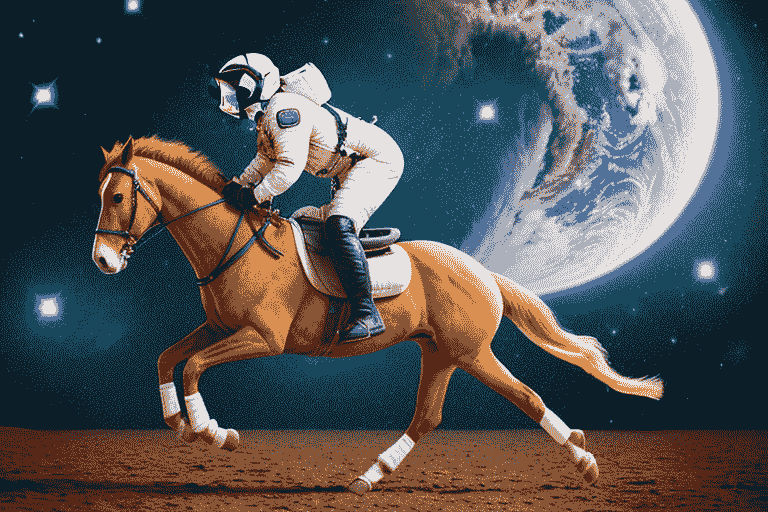
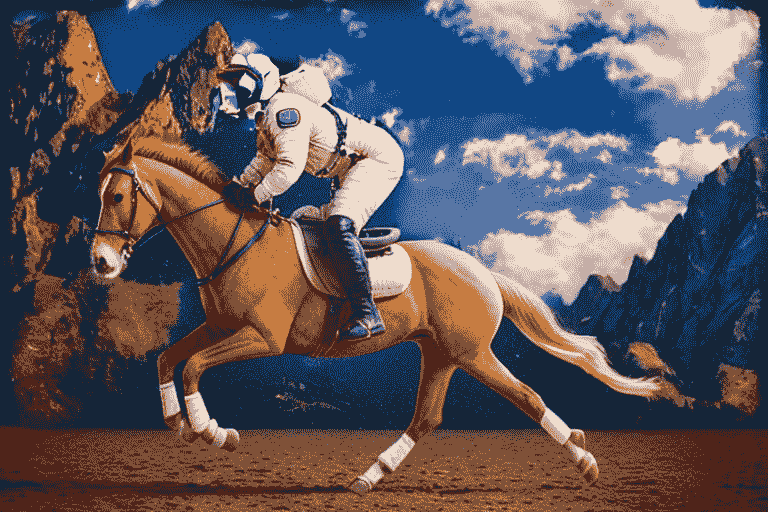

# 1

# 介绍 Stable Diffusion

Stable Diffusion 是一个深度学习模型，它利用扩散过程从引导指令和图像中生成高质量的美术作品。

在本章中，我们将向您介绍 AI 图像生成技术，即 Stable Diffusion，并了解它是如何发展到现在的。

与其他深度学习图像生成模型不同，例如 OpenAI 的 DALL-E 2，Stable Diffusion 通过从随机的噪声潜在张量开始，然后逐渐向其中添加详细信息来工作。添加的细节量由一个扩散过程决定，该过程受数学方程式控制（我们将在[*第五章*](B21263_05.xhtml#_idTextAnchor097)中深入探讨细节）。在最终阶段，模型将潜在张量解码成像素图像。

自 2022 年创建以来，Stable Diffusion 已被广泛用于生成令人印象深刻的图像。例如，它可以生成与真实照片难以区分的人物、动物、物体和场景的图像。图像是通过特定的指令生成的，例如 *“在月球表面奔跑的猫”* 或 *“一位宇航员骑马的照片”。*

这里是一个用于与 Stable Diffusion 一起生成图像的提示示例：

`"一位宇航员骑马的照片"。`

Stable Diffusion 将生成以下图像：

图 1.1：由 Stable Diffusion 生成的宇航员骑马的图片

在我按下 *Enter* 按钮之前，这张图片并不存在。它是通过我和 Stable Diffusion 的协作创建的。Stable Diffusion 不仅理解我们给出的描述，还会为图像添加更多细节。

除了文本到图像的生成之外，Stable Diffusion 还通过自然语言促进照片的编辑。为了说明这一点，再次考虑前面的图像。我们可以使用自动生成的蒙版和提示将太空背景替换为蓝天和山脉。

可以使用 `background` 提示生成背景蒙版，而 `blue sky and mountains` 提示用于指导 Stable Diffusion 将初始图像转换为以下形式：

图 1.2：将背景替换为蓝天和山脉

无需鼠标点击或拖动，也不需要额外的付费软件，如 Photoshop。您可以使用纯 Python 和 Stable Diffusion 实现这一点。Stable Diffusion 可以仅使用 Python 代码执行许多其他任务，这些内容将在本书的后续章节中介绍。

稳定扩散是一个强大的工具，有可能彻底改变我们创建和交互图像的方式。它可以用于创建电影、视频游戏和其他应用中的逼真图像。它还可以用于生成用于营销、广告和装饰的个性化图像。

这里是稳定扩散的一些关键特性：

+   它可以从文本描述中生成高质量的图像

+   它基于扩散过程，这是一种比其他方法更稳定、更可靠的生成图像的方式

+   现在有大量可公开访问的预训练模型（10,000+），并且还在不断增长

+   新的研究和应用正在建立在稳定扩散的基础上

+   它是开源的，任何人都可以使用

在我们继续之前，让我简要介绍一下近年来扩散模型的演变。

# 扩散模型的演变

扩散模型并非一直可用，正如罗马不是一天建成的。为了从高层次上了解这项技术，在本节中，我们将讨论近年来扩散模型的整体演变。

## 在Transformer和Attention之前

不久前，**卷积神经网络**（**CNNs**）和**残差神经网络**（**ResNets**）主导了机器学习中的计算机视觉领域。

卷积神经网络（CNNs）和残差网络（ResNets）在引导对象检测和面部识别等任务中已被证明是非常有效的。这些模型已在各个行业得到广泛应用，包括自动驾驶汽车和人工智能驱动的农业。

然而，CNNs和ResNets存在一个显著的缺点：它们只能识别其训练集中的对象。要检测一个完全新的对象，必须将新的类别标签添加到训练数据集中，然后重新训练或微调预训练模型。

这种限制源于模型本身，以及当时硬件的限制和训练数据的可用性。

## Transformer改变了机器学习

由谷歌开发的Transformer模型彻底改变了计算机视觉领域，其影响始于对**自然语言处理**（**NLP**）的影响。

与依赖于预定义标签来计算损失并通过反向传播更新神经网络权重的传统方法不同，Transformer模型以及注意力机制引入了一个开创性的概念。它们利用训练数据本身进行训练和标记。

让我们以下面的句子为例：

*“稳定扩散可以使用文本来生成图像”*

假设我们将单词序列输入到神经网络中，但不包括最后一个单词 *text*：

*“稳定扩散可以使用* *来生成图像”*

使用这个提示，模型可以根据其当前权重预测下一个单词。比如说它预测了 *apple*。单词 *apple* 的编码嵌入在向量空间中与 *text* 有显著差异，就像两个之间有很大差距的数字一样。这个差距值可以用作损失值，然后通过反向传播更新权重。

通过在训练和更新过程中重复这个过程数百万次甚至数十亿次，模型的权重逐渐学会在句子中产生下一个合理的单词。

机器学习模型现在可以通过设计适当的损失函数学习各种任务。

## OpenAI 的 CLIP 发生了重大变化

研究人员和工程师迅速认识到 Transformer 模型的潜力，正如著名机器学习论文《Attention Is All You Need》的结论部分所提到的。作者陈述如下：

*我们对基于注意力的模型未来的发展感到兴奋，并计划将其应用于其他任务。我们计划将 Transformer 扩展到涉及除文本之外的其他输入和输出模态的问题，并研究局部、受限的注意力机制，以有效地处理图像、音频、*以及视频*等大型输入和输出。

如果你已经阅读了这篇论文并掌握了基于 Transformer 和注意力机制的模型的卓越能力，你可能会受到启发，重新构想自己的工作并利用这种非凡的力量。

OpenAI 的研究人员抓住了这种力量，创建了一个名为 CLIP [1] 的模型，该模型使用注意力机制和 Transformer 模型架构来训练图像分类模型。该模型能够无需标记数据对广泛的图像进行分类。它是第一个在从互联网上提取的 4 亿个图像-文本对上训练的大型规模图像分类模型。

尽管在 OpenAI 的 CLIP 模型之前已有类似的研究，但根据 CLIP 论文作者 [1] 的观点，这些结果并不令人满意：

*这些弱监督模型与最近直接从自然语言学习图像表示的探索之间的一个关键区别是规模。*

事实上，规模在解锁通用图像识别的非凡超级能力中起着关键作用。当其他模型使用了 20 万张图像时，CLIP 团队使用令人敬畏的 4 亿张图像与来自公共互联网的文本数据一起训练了他们的模型。

结果令人震惊。CLIP 使图像识别和分割摆脱了预定义标签的限制。它可以检测到先前模型难以处理的对象。CLIP 通过其大规模模型带来了重大变革。鉴于 CLIP 的巨大影响力，研究人员在思考它是否也可以用于从文本生成图像。

## 生成图像

仅使用CLIP，我们仍然无法根据文本描述生成逼真的图像。例如，如果我们要求CLIP画一个苹果，模型会合并各种类型的苹果，不同的形状、颜色、背景等等。CLIP可能会生成一个一半绿色一半红色的苹果，这可能不是我们想要的。

你可能熟悉**生成对抗网络**（**GANs**），它能够生成高度逼真的图像。然而，在生成过程中无法使用文本提示。GANs已经成为图像处理任务（如人脸修复和图像上采样）的复杂解决方案。尽管如此，仍需要一种新的创新方法来利用基于引导描述或提示的图像生成模型。

2020年6月，Jonathan Ho等人发表了一篇题为《基于扩散的概率模型去噪》的论文[3]，介绍了一种基于扩散的图像生成概率模型。术语**扩散**借自热力学。扩散的原始含义是粒子从高浓度区域向低浓度区域的运动。这种扩散的想法启发了机器学习研究人员将其应用于去噪和采样过程。换句话说，我们可以从一个噪声图像开始，通过去除噪声逐渐细化它。去噪过程逐渐将高噪声水平的图像转换成原始图像的更清晰版本。因此，这种生成模型被称为**去噪扩散****概率模型**。

这种方法背后的想法是巧妙的。对于任何给定的图像，我们向原始图像添加有限数量的正态分布的噪声图像，有效地将其转换为一个完全噪声的图像。如果我们训练一个模型，该模型可以在CLIP模型的引导下逆转这种扩散过程，会怎样呢？令人惊讶的是，这种方法是有效的[4]。

## DALL-E 2和Stable Diffusion

2022年4月，OpenAI发布了DALL-E 2，并附带了一篇题为《基于CLIP潜力的分层文本条件图像生成》的论文[4]。DALL-E 2在全球范围内引起了广泛关注。它生成了一大批令人惊叹的图像，在社交网络和主流媒体中广泛传播。人们不仅对生成的图像质量感到惊讶，也对它能够创造从未存在过的图像的能力感到惊讶。DALL-E 2实际上在创作艺术作品。

可能是巧合，2022年4月，CompVis发表了一篇题为《基于潜在扩散模型的超高分辨率图像合成》的论文[5]，介绍了一种基于扩散的文本引导图像生成模型。在CompVis的工作基础上，CompVis、Stability AI和LAION的研究人员和工程师合作，于2022年8月发布了DALL-E 2的开源版本，名为Stable Diffusion。

# 为什么选择Stable Diffusion

虽然 DALL-E 2 和其他商业图像生成模型如Midjourney可以在不要求复杂的环境设置或硬件准备的情况下生成令人瞩目的图像，但这些模型是闭源的。因此，用户对生成过程有限制，无法使用自己的定制模型，也无法向平台添加自定义功能。

另一方面，Stable Diffusion是一个在CreativeML Open RAIL-M许可下发布的开源模型。用户不仅有权使用该模型，还可以阅读源代码，添加功能，并从社区共享的无数自定义模型中受益。

# 使用哪个Stable Diffusion

当我们说Stable Diffusion时，我们真正指的是哪个Stable Diffusion？以下是一个不同Stable Diffusion工具及其差异的列表：

+   **Stable Diffusion GitHub仓库** ([https://github.com/CompVis/stable-diffusion](https://github.com/CompVis/stable-diffusion)): 这是CompVis提供的Stable Diffusion的原始实现，由许多杰出的工程师和研究人员贡献。这是一个PyTorch实现，可用于训练和生成图像、文本和其他创意内容。截至2023年写作时，该库的活跃度较低。其README页面还建议用户使用Hugging Face的Diffusers来使用和训练扩散模型。

+   **Hugging Face的Diffusers**: Diffusers是由Hugging Face开发的用于训练和使用扩散模型的库。它是生成图像、音频甚至分子3D结构的最新、预训练扩散模型的首选库。截至写作时，该库得到了良好的维护，并正在积极开发。几乎每天都有新代码添加到其GitHub仓库中。

+   **AUTOMATIC1111的Stable Diffusion WebUI**: 这可能是目前最受欢迎的基于Web的应用程序，允许用户使用Stable Diffusion生成图像和文本。它提供了一个GUI界面，使得用户可以轻松地实验不同的设置和参数。

+   **InvokeAI**: InvokeAI最初是作为Stable Diffusion项目的分支开发的，但后来已经发展成为一个独特的平台。InvokeAI提供了一系列功能，使其成为创意人士的强大工具。

+   **ComfyUI**: ComfyUI是一个基于节点的UI，利用Stable Diffusion。它允许用户构建定制的流程，包括图像后处理和转换。它是一个强大且灵活的图形用户界面，用于Stable Diffusion，以其基于节点的设计为特点。

在这本书中，当我提到Stable Diffusion时，我指的是Stable Diffusion模型，而不是刚刚列出的GUI工具。本书的重点将集中在使用纯Python的Stable Diffusion。我们的示例代码将使用Diffusers的管道，并利用来自Stable Diffusion WebUI和学术论文开源代码等。

# 为什么选择这本书

尽管Stable Diffusion GUI工具可以由扩散模型驱动生成令人惊叹的图像，但其可用性有限。存在数十个调节旋钮（正在添加更多滑块和按钮）和特定术语，有时使得生成高质量图像变成了一场猜谜游戏。另一方面，来自Hugging Face的开源Diffusers包使用Python让用户对Stable Diffusion拥有完全控制权。然而，它缺少许多关键特性，如加载自定义LoRA和文本反转，利用社区共享的模型/检查点，调度，加权提示，无限提示令牌，以及高分辨率图像修复和放大（然而，Diffusers包仍在不断改进）。

本书旨在帮助您从扩散模型的内部视角理解所有复杂的术语和调节旋钮。本书还将协助您克服扩散器的局限性，实现缺失的功能和高级特性，以创建一个完全定制的Stable Diffusion应用程序。

考虑到人工智能技术发展的快速步伐，本书还旨在使您能够快速适应即将到来的变化。

到本书结束时，您不仅能够使用Python生成和编辑图像，还能利用本书中提供的解决方案构建适合您业务和用户的Stable Diffusion应用程序。

让我们开始这段旅程。

# 参考文献

1.  *从自然语言监督学习可迁移的视觉模型*：[https://arxiv.org/abs/2103.00020](https://arxiv.org/abs/2103.00020)

1.  *注意力即所需*：[https://arxiv.org/abs/1706.03762](https://arxiv.org/abs/1706.03762)

1.  *去噪扩散概率模型*：[https://arxiv.org/abs/2006.11239](https://arxiv.org/abs/2006.11239)

1.  *使用CLIP潜变量进行分层文本条件图像生成*：[https://arxiv.org/abs/2204.06125v1](https://arxiv.org/abs/2204.06125v1)

1.  *使用潜在扩散模型进行高分辨率图像合成*：[https://arxiv.org/abs/2112.10752](https://arxiv.org/abs/2112.10752)

1.  DALL-E 2：[https://openai.com/dall-e-2](https://openai.com/dall-e-2)
