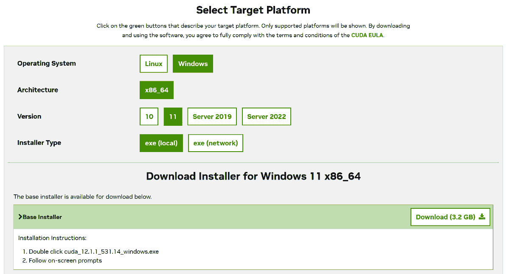
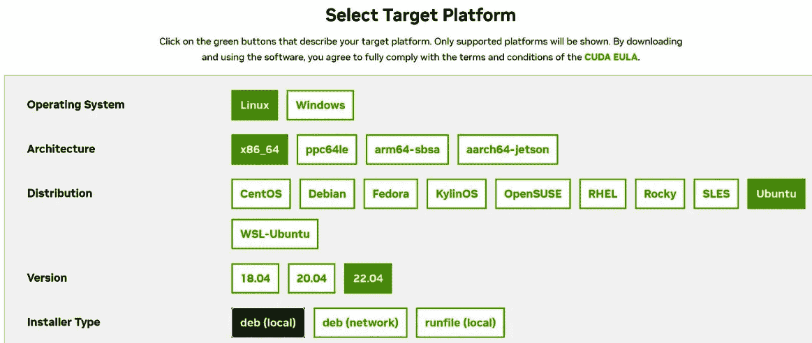
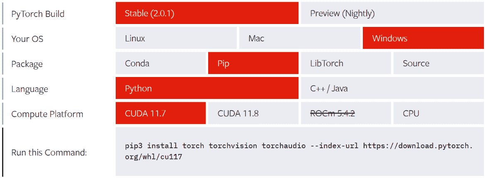
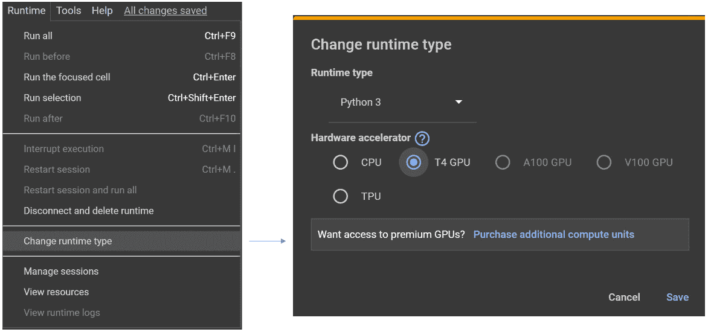
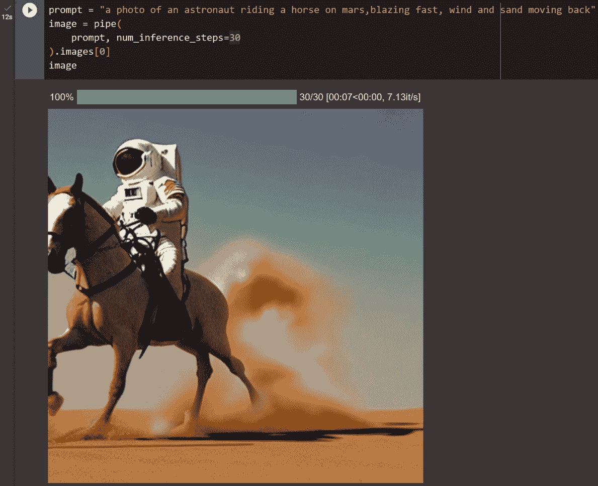

# 第二章：设置稳定扩散的环境

欢迎来到[*第二章*](B21263_02.xhtml#_idTextAnchor037)。在本章中，我们将专注于设置运行稳定扩散的环境。我们将涵盖所有必要的步骤和方面，以确保与稳定扩散模型一起工作时体验顺畅。我们的主要目标是帮助您了解每个组件的重要性以及它们如何对整个过程做出贡献。

本章内容如下：

+   稳定扩散运行所需的硬件要求介绍

+   安装所需软件依赖项的详细步骤：NVIDIA 的 CUDA、Python、Python 虚拟环境（可选但推荐），以及 PyTorch

+   没有 GPU 的用户的其他替代选项，例如 Google Colab 和配备硅 CPU（M 系列的）的 Apple MacBook

+   设置过程中常见问题的故障排除

+   维护稳定环境的技巧和最佳实践

我们将首先概述稳定扩散（Stable Diffusion）的概念、其重要性以及在各个领域的应用。这将帮助您更好地理解核心概念及其重要性。

接下来，我们将详细介绍每个依赖项的安装步骤，包括 CUDA、Python 和 PyTorch。我们还将讨论使用 Python 虚拟环境的优点，并指导您如何设置一个。

对于没有访问带有 GPU 的机器的用户，我们将探讨替代选项，例如 Google Colab。我们将提供使用这些服务的全面指南，并讨论与之相关的权衡。

最后，我们将解决在设置过程中可能出现的常见问题，并提供故障排除技巧。此外，我们将分享维护稳定环境的最佳实践，以确保与稳定扩散模型一起工作时体验顺畅。

到本章结束时，您将拥有为稳定扩散设置和维护定制的环境的基础，让您能够高效地构建和实验您的模型。

# 运行稳定扩散所需的硬件要求

本节将讨论运行稳定扩散模型所需的硬件要求。本书将涵盖**稳定扩散 v1.5**和**稳定扩散 XL（SDXL**）版本。这两个版本也是本书撰写时最常用的模型。

2022 年 10 月发布的稳定扩散 v1.5 被视为通用模型，可以与 v1.4 互换使用。另一方面，2023 年 7 月发布的 SDXL 以其更有效地处理更高分辨率的能力而闻名，与稳定扩散 v1.5 相比。它可以在不牺牲质量的情况下生成更大尺寸的图像。

实质上，稳定扩散是一组包括以下内容的模型：

+   **标记器（Tokenizer）**：将文本提示转换为一系列标记。

+   **文本编码器**：Stable Diffusion文本编码器是一个特殊的Transformer语言模型——具体来说，是CLIP模型的文本编码器。在SDXL中，还使用了更大尺寸的OpenCLIP [6] 文本编码器，将标记编码成文本嵌入。

+   **变分自编码器**（**VAE**）：这会将图像编码到潜在空间，并将其解码回图像。

+   **UNet**：这是去噪过程发生的地方。UNet结构被用来理解噪声/去噪循环中的步骤。它接受某些元素，如噪声、时间步数据和一个条件信号（例如，文本描述的表示），并预测可用于去噪过程的噪声残差。

Stable Diffusion的组件提供神经网络权重数据，除了分词器。虽然理论上CPU可以处理训练和推理，但带有GPU或并行计算设备的物理机器可以提供学习并运行Stable Diffusion模型的最佳体验。

## GPU

理论上，Stable Diffusion模型可以在GPU和CPU上运行。实际上，基于PyTorch的模型在NVIDIA GPU上使用CUDA运行效果最佳。

Stable Diffusion需要至少4 GB VRAM的GPU。根据我的经验，4 GB VRAM的GPU只能让你生成512x512的图像，但生成它们可能需要很长时间。至少8 GB VRAM的GPU可以提供相对愉悦的学习和使用体验。VRAM的大小越大越好。

本书中的代码在8 GB VRAM的NVIDIA RTX 3070Ti和24 GB VRAM的RTX 3090上进行了测试。

## 系统内存

GPU和CPU之间将进行大量的数据传输，一些Stable Diffusion模型可能会轻松占用高达6 GB的RAM。请至少准备16 GB的系统RAM；32 GB RAM会更好——越多越好，尤其是对于多个模型。

## 存储

请准备一个大硬盘。默认情况下，Hugging Face包会将模型数据下载到系统驱动器中的缓存文件夹。如果你只有256 GB或512 GB的存储空间，你会发现它很快就会用完。建议准备1 TB的NVME SSD，尽管2 TB或更多会更好。

# 软件需求

现在我们已经准备好了硬件，Stable Diffusion需要额外的软件来支持其执行并提供使用Python的更好控制。本节将为你提供准备软件环境的步骤。

## CUDA安装

如果你使用的是Microsoft Windows，请首先安装Microsoft **Visual Studio** (**VS**) [5]。VS将安装CUDA所需的所有其他依赖包和二进制文件。你可以简单地选择VS的最新社区版本，这是免费的。

现在，前往NVIDIA CUDA下载页面 [1] 下载CUDA安装文件。以下截图显示了选择Windows 11的CUDA示例：



图2.1：选择Windows的CUDA安装下载文件

下载CUDA安装文件，然后双击此文件，就像安装任何其他Windows应用程序一样安装CUDA。

如果您使用的是Linux操作系统，安装CUDA的过程略有不同。您可以执行NVIDIA提供的Bash脚本来自动化安装。以下是详细步骤：

1.  为了确保最小化错误，最好首先卸载所有NVIDIA驱动程序，所以如果您已经安装了NVIDIA的驱动程序，请使用以下命令来卸载它：

    ```py
    sudo apt-get purge nvidia*
    ```

    ```py
    sudo apt-get autoremove
    ```

    然后，重新启动您的系统：

    ```py
    sudo reboot
    ```

1.  安装GCC。**GNU编译器集合**（**GCC**）是一组用于各种编程语言的编译器，如C、C++、Objective-C、Fortran、Ada等。它是由GNU项目开发的开源项目，并且在Unix-like操作系统（包括Linux）上广泛用于编译和构建软件。如果没有安装GCC，我们在CUDA安装过程中会遇到错误。使用以下命令安装它：

    ```py
    sudo apt install gcc
    ```

1.  在CUDA下载页面[2]上为您的系统选择正确的CUDA版本。以下截图显示了为Ubuntu 22.04选择CUDA的示例：



图2.2：选择Linux的CUDA安装下载文件

在您选择之后，页面将显示处理整个安装过程的命令脚本。以下是一个示例：

```py
wget https://developer.download.nvidia.com/compute/cuda/repos/ubuntu2204/x86_64/cuda-ubuntu2204.pin
sudo mv cuda-ubuntu2204.pin /etc/apt/preferences.d/cuda-repository-pin-600
wget https://developer.download.nvidia.com/compute/cuda/12.1.1/local_installers/cuda-repo-ubuntu2204-12-1-local_12.1.1-530.30.02-1_amd64.deb
sudo dpkg -i cuda-repo-ubuntu2204-12-1-local_12.1.1-530.30.02-1_amd64.deb
sudo cp /var/cuda-repo-ubuntu2204-12-1-local/cuda-*-keyring.gpg /usr/share/keyrings/
sudo apt-get update
sudo apt-get -y install cuda
```

注意

在您阅读这本书的时候，脚本可能已经被更新。为了避免错误和潜在的安装失败，我建议打开页面并使用反映您选择的脚本。

## 安装Windows、Linux和macOS上的Python

我们首先将为Windows安装Python。

### 安装Windows上的Python

您可以访问[https://www.python.org/](https://www.python.org/)并下载Python 3.9或Python 3.10进行安装。

经过多年的手动下载和点击安装过程后，我发现使用包管理器来自动化安装非常有用。使用包管理器，您只需编写一次脚本，保存它，然后下次需要安装软件时，您只需在终端窗口中运行相同的脚本即可。Windows上最好的包管理器之一是Chocolatey ([https://chocolatey.org/](https://chocolatey.org/))。

一旦您安装了Chocolatey，可以使用以下命令安装Python 3.10.6：

```py
choco install python --version=3.10.6
```

创建Python虚拟环境：

```py
pip install --upgrade --user pip
pip install virtualenv
python -m virtualenv venv_win_p310
venv_win_p310\Scripts\activate
python -m ensurepip
python -m pip install --upgrade pip
```

我们将继续安装Linux上Python的步骤。

### 安装Linux上的Python

现在我们将为Linux（Ubuntu）安装Python。按照以下步骤操作：

1.  安装所需的软件包：

    ```py
    sudo apt-get install software-properties-common
    ```

    ```py
    sudo add-apt-repository ppa:deadsnakes/ppa
    ```

    ```py
    sudo apt-get update
    ```

    ```py
    sudo apt-get install python3.10
    ```

    ```py
    sudo apt-get install python3.10-dev
    ```

    ```py
    sudo apt-get install python3.10-distutils
    ```

1.  安装`pip`：

    ```py
    curl https://bootstrap.pypa.io/get-pip.py -o get-pip.py
    ```

    ```py
    python3.10 get-pip.py
    ```

1.  创建Python虚拟环境：

    ```py
    python3.10 -m pip install --user virtualenv
    ```

    ```py
    python3.10 -m virtualenv venv_ubuntu_p310
    ```

    ```py
    . venv_ubuntu_p310/bin/activate
    ```

### 安装macOS上的Python

如果您使用的是内置硅芯片的Mac（带有Apple Mx CPU），您很可能已经安装了Python。您可以使用以下命令测试您的Mac上是否已安装Python：

```py
python3 --version
```

如果您的机器还没有 Python 解释器，您可以使用 Homebrew [7] 通过一条简单的命令来安装它，如下所示：

```py
brew install python
```

请记住，Python 版本通常会定期更新，通常每年更新一次。您可以通过更改版本号来安装特定的 Python 版本。例如，您可以将 `python3.10` 更改为 `python3.11`。

## 安装 PyTorch

Hugging Face Diffusers 包依赖于 PyTorch 包，因此我们需要安装 PyTorch 包。访问 PyTorch **入门**页面 ([https://pytorch.org/get-started/locally/](https://pytorch.org/get-started/locally/)) 并选择适合您系统的适当 PyTorch 版本。以下是在 Windows 上的 PyTorch 截图：



图 2.3：安装 PyTorch

接下来，使用动态生成的命令来安装 PyTorch：

```py
pip3 install torch torchvision torchaudio --index-url https://download.pytorch.org/whl/cu117
```

除了 CUDA 11.7 之外，还有 CUDA 11.8。版本的选择将取决于您机器上安装的 CUDA 版本。

您可以使用以下命令来查找您的 CUDA 版本：

```py
nvcc --version
```

您也可以使用以下命令：

```py
nvidia-smi
```

您机器的 CUDA 版本可能高于列出的 11.7 或 11.8 版本，例如 12.1。通常，某些模型或包需要特定的版本。对于 Stable Diffusion，只需安装最新版本即可。

如果您正在使用 Mac，请选择 **Mac** 选项来安装适用于 macOS 的 PyTorch。

如果您正在使用 Python 虚拟环境，请确保在激活的虚拟环境中安装 PyTorch。否则，如果您意外地在虚拟环境外安装 PyTorch，然后在虚拟环境中运行 Python 代码，您可能会遇到 PyTorch 没有正确安装的问题。

# 运行 Stable Diffusion 管道

现在您已经安装了所有依赖项，是时候运行一个 Stable Diffusion 管道来测试环境是否正确设置了。您可以使用任何 Python 编辑工具，例如 VS Code 或 Jupyter Notebook，来编辑和执行 Python 代码。按照以下步骤操作：

1.  安装 Hugging Face Diffusers 的包：

    ```py
    pip install diffusers
    ```

    ```py
    pip install transformers scipy ftfy accelerate
    ```

1.  启动 Stable Diffusion 管道：

    ```py
    import torch
    ```

    ```py
    from diffusers import StableDiffusionPipeline
    ```

    ```py
    pipe = StableDiffusionPipeline.from_pretrained(
    ```

    ```py
        "runwayml/stable-diffusion-v1-5",
    ```

    ```py
        torch_dtype=torch.float16)
    ```

    ```py
    pipe.to("cuda") # mps for mac
    ```

    如果您正在使用 Mac，将 `cuda` 更改为 `mps`。尽管 macOS 受支持并且可以使用 Diffusers 包生成图像，但其性能相对较慢。作为比较，使用 Stable Diffusion V1.5 生成一个 512x512 的图像，NVIDIA RTX 3090 可以达到大约每秒 20 次迭代，而 M3 Max CPU 在默认设置下只能达到大约每秒 5 次迭代。

1.  生成图像：

    ```py
    prompt = "a photo of an astronaut riding a horse on mars,blazing fast, wind and sand moving back"
    ```

    ```py
    image = pipe(
    ```

    ```py
        prompt, num_inference_steps=30
    ```

    ```py
    ).images[0]
    ```

    ```py
    image
    ```

如果您看到一位宇航员骑马的图像，那么您在物理机器上已经正确设置了所有环境。

# 使用 Google Colaboratory

**Google Colaboratory**（或 **Google Colab**）是 Google 提供的在线计算服务。本质上，Google Colab 是一个具有 GPU/CUDA 功能的在线 Jupyter Notebook。

它的免费笔记本可以提供与NVIDIA RTX 3050或RTX 3060相当的15 GB VRAM的CUDA计算。如果你没有现成的独立GPU，性能还算不错。

让我们来看看使用Google Colab的优缺点：

+   `pip` 和资源下载都很快速

+   **缺点**：

    +   每个笔记本都有一个磁盘限制

    +   你无法完全控制后端服务器；终端访问需要Colab Pro订阅

    +   性能无法保证，因此在高峰时段你可能会遇到慢速GPU推理，并且可能会因为长时间计算而被断开连接。

    +   每次重启笔记本时，Colab笔记本的计算环境都会被重置；换句话说，每次启动笔记本时，你都需要重新安装所有包和下载模型文件。

# 使用Google Colab运行稳定扩散管道

下面是开始使用Google Colab的详细步骤：

1.  从 [https://colab.research.google.com/](https://colab.research.google.com/) 创建一个新的实例。

1.  点击 **运行** | **更改运行时类型** 并选择 **T4 GPU**，如图 *图2.4* 所示：



图2.4：在Google Colab笔记本中选择GPU

1.  创建一个新的单元格，并使用以下命令检查GPU和CUDA是否工作：

    ```py
    !nvidia-smi
    ```

1.  安装Hugging Face Diffusers的包：

    ```py
    !pip install diffusers
    ```

    ```py
    !pip install transformers scipy ftfy accelerate ipywidgets
    ```

1.  开始启动稳定的扩散管道：

    ```py
    import torch
    ```

    ```py
    from diffusers import StableDiffusionPipeline
    ```

    ```py
    pipe = StableDiffusionPipeline.from_pretrained(
    ```

    ```py
        "runwayml/stable-diffusion-v1-5",
    ```

    ```py
         torch_dtype=torch.float16)
    ```

    ```py
    pipe.to("cuda")
    ```

1.  生成图像：

    ```py
    prompt = "a photo of an astronaut riding a horse on mars,blazing fast, wind and sand moving back"
    ```

    ```py
    image = pipe(
    ```

    ```py
        prompt, num_inference_steps=30
    ```

    ```py
    ).images[0]
    ```

    ```py
    image
    ```

几秒钟后，你应该能看到如图 *图2.5* 所示的结果：



图2.5：在Google Colab中运行稳定扩散管道

如果你看到生成的图像如图 *图2.5* 所示，那么你已经成功设置了Diffusers包，在Google Colab中运行稳定扩散模型。

# 摘要

有人说，开始训练机器学习模型最具挑战性的部分不是数学或其内部逻辑。通常，最大的障碍是设置一个合适的运行环境来运行模型。工程师和教授们花整个周末试图在他们的实验室机器上安装CUDA的情况并不少见。这可能是由于缺少依赖项、跳过的步骤或版本不兼容造成的。

我专门用了一章来介绍安装过程，希望这些详细的步骤能帮助你避免常见的陷阱。通过遵循这些步骤，你将能够深入了解稳定扩散模型，并开始图像生成，障碍最小化。

此外，你安装的软件和包也将适用于基于Transformer的大型语言模型。

在下一章中，我们将开始使用稳定扩散来生成图像。

# 参考文献

1.  *Microsoft Windows的CUDA安装指南*：[https://docs.nvidia.com/cuda/cuda-installation-guide-microsoft-windows/index.html](https://docs.nvidia.com/cuda/cuda-installation-guide-microsoft-windows/index.html)

1.  *NVIDIA CUDA* *下载*: [https://developer.nvidia.com/cuda-downloads](https://developer.nvidia.com/cuda-downloads)

1.  *Google* *Colab*: [https://colab.research.google.com/](https://colab.research.google.com/)

1.  *Hugging Face Diffusers* *安装*: [https://huggingface.co/docs/diffusers/installation](https://huggingface.co/docs/diffusers/installation)

1.  *Visual Studio Community* *下载*: [https://visualstudio.microsoft.com/vs/community/](https://visualstudio.microsoft.com/vs/community/)

1.  *OpenCLIP GitHub* *仓库*: [https://github.com/mlfoundations/open_clip](https://github.com/mlfoundations/open_clip)

1.  *Homebrew*: [https://brew.sh/](https://brew.sh/)
