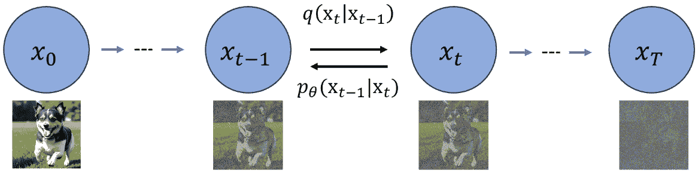
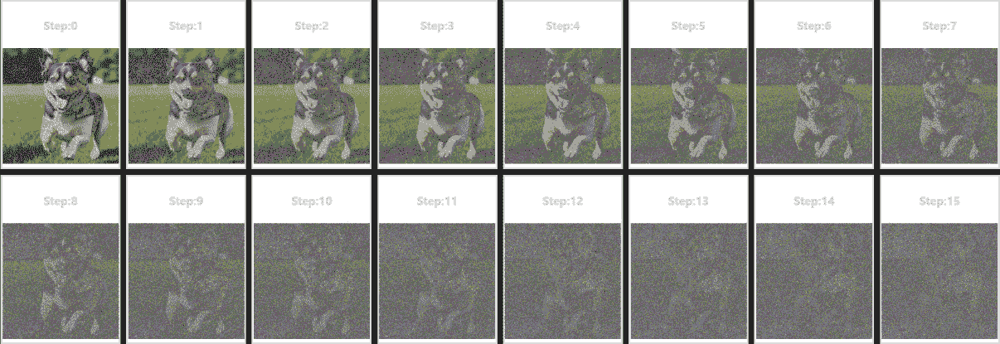
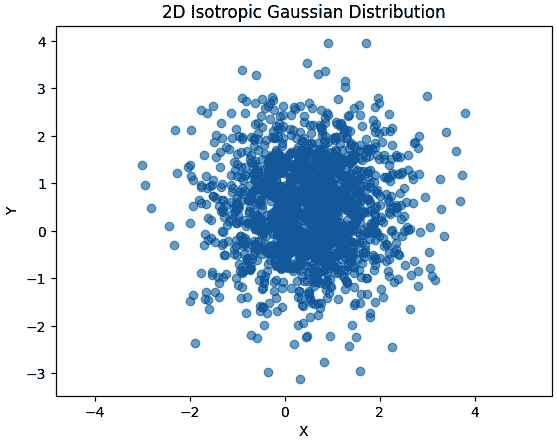
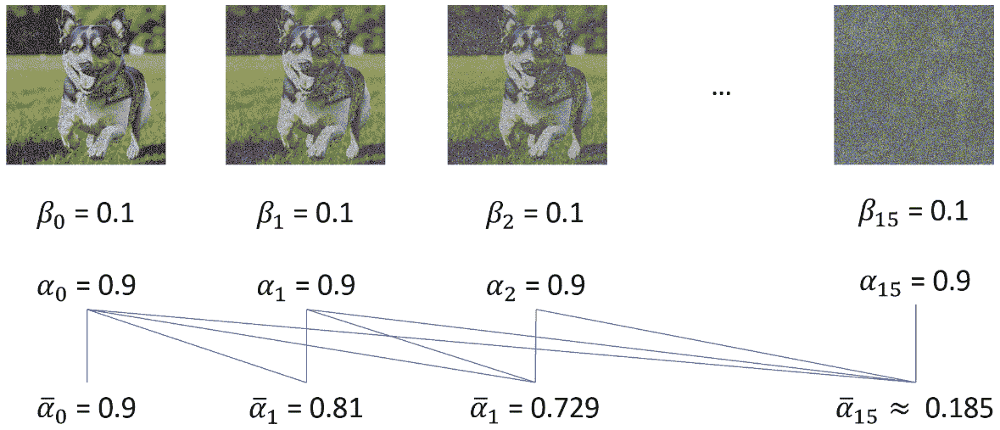
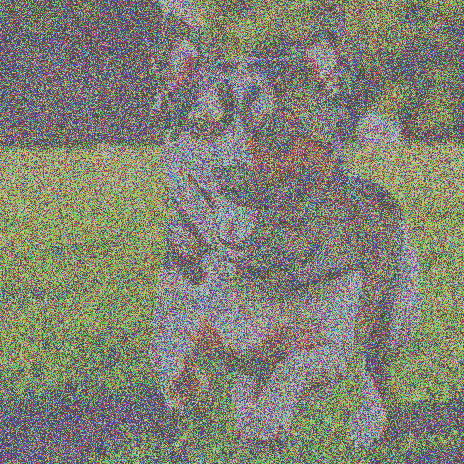
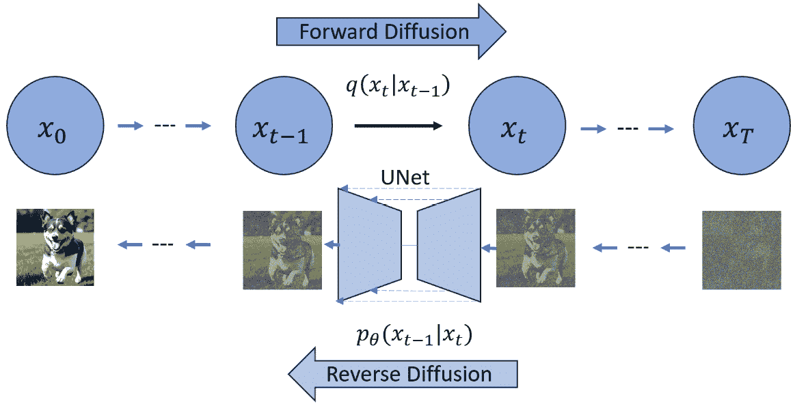
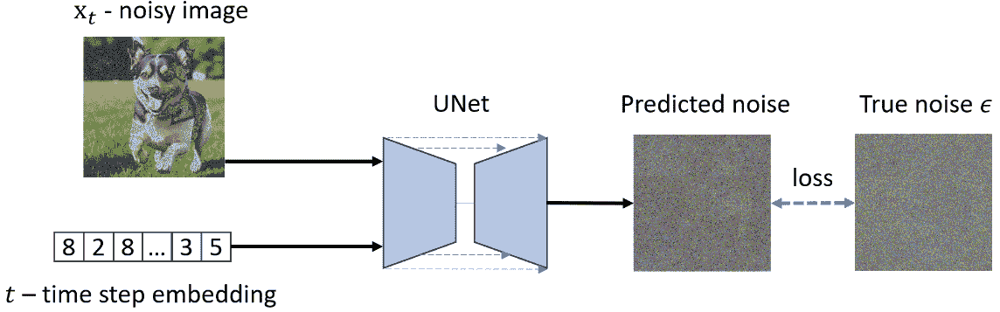
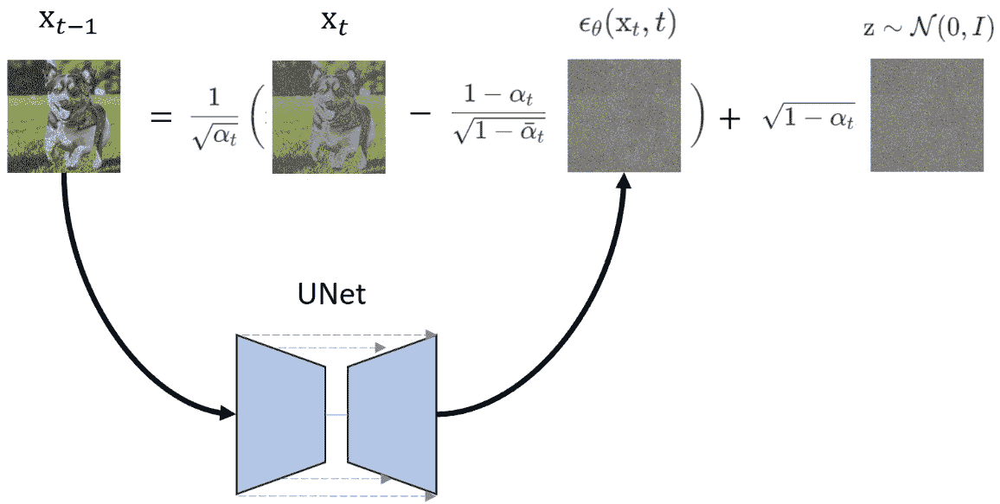
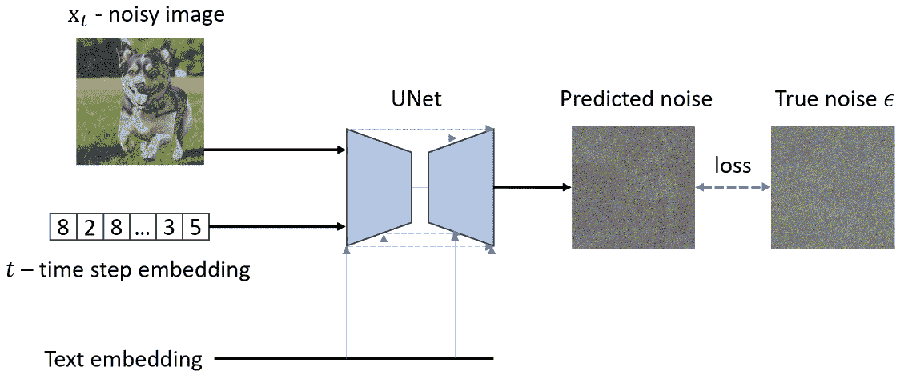

# 理解扩散模型背后的理论

本章将深入探讨驱动**扩散模型**的理论，并了解系统的内部工作原理。神经网络模型是如何生成如此逼真的图像的呢？好奇心强的人想要揭开面纱，看看内部的工作机制。

我们将触及扩散模型的基础，旨在弄清楚其内部工作原理，并为下一章实现可行的流程奠定基础。

通过理解扩散模型的复杂性，我们不仅增强了我们对高级**稳定扩散**（也称为**潜在扩散模型**（**LDMs**））的理解，而且还能更有效地导航Diffusers包的源代码。

这项知识将使我们能够根据新兴需求扩展包的功能。

具体来说，我们将探讨以下主题：

+   理解图像到噪声的过程

+   更高效的**正向****扩散过程**

+   噪声到图像的训练过程

+   噪声到图像的采样过程

+   理解分类器引导去噪

到本章结束时，我们将深入探讨由Jonathan Ho等人最初提出的扩散模型的内部工作原理。我们将理解扩散模型的基础理念，并学习**正向扩散过程**。我们将了解扩散模型训练和采样的反向扩散过程，并学会启用文本引导的扩散模型。

让我们开始吧。

# 理解图像到噪声的过程

扩散模型的想法受到了热力学中扩散概念的启发。将一张图像视为一杯水，并向图像（水）中添加足够的噪声（墨水），最终将图像（水）变成完整的噪声图像（墨水水）。

如*图4**.1*所示，图像x 0可以被转换为一个几乎高斯（正态分布）的噪声图像x T。



图4.1：正向扩散和反向去噪

我们采用一个预定的正向扩散过程，表示为q，该过程系统地给图像引入高斯噪声，直到最终变成纯噪声。这个过程表示为q(x t | x t-1)。请注意，反向过程p θ(x t-1 | x t)仍然未知。

正向扩散过程的一步可以表示如下：

q(x t | x t-1) ≔ 𝒩(x t; √ _ 1 − β t x t-1 , β t I)

让我从左到右一点一点解释这个公式：

+   符号q(x t | x t-1)用来表示条件概率分布。在这种情况下，分布q表示在给定先前图像x t−1的情况下观察到噪声图像x t的概率。

+   公式中使用定义符号 := 而不是波浪符号 (∼) 是因为扩散前向过程是一个确定性过程。波浪符号 (∼) 通常用于表示分布。在这种情况下，如果我们使用波浪符号，公式将表示噪声图像是一个完整的高斯分布。然而，情况并非如此。t 步的噪声图像是由前一个图像和添加的噪声的确定性函数定义的。

+   那么为什么这里使用 𝒩 符号呢？𝒩 符号用于表示高斯分布。然而，在这种情况下，𝒩 符号被用来表示噪声图像的函数形式。

+   在右侧，分号之前，x_t 是我们希望在正态分布中的东西。分号之后，那些是分布的参数。分号通常用于分隔输出和参数。

+   βt 是第 t 步的噪声方差。√_1 − βt x_t−1 是新分布的均值。

+   为什么公式中使用大写的 I 呢？因为 RGB 图像可以有多个通道，而单位矩阵可以将噪声方差独立地应用于不同的通道。

使用 Python 添加高斯噪声到图像相当简单：

```py
import numpy as np
import matplotlib.pyplot as plt
import ipyplot
from PIL import Image
# Load an image
img_path = r"dog.png"
image = plt.imread(img_path)
# Parameters
num_iterations = 16
beta = 0.1              # noise_variance
images = []
steps = ["Step:"+str(i) for i in range(num_iterations)]
# Forward diffusion process
for i in range(num_iterations):
    mean = np.sqrt(1 - beta) * image
    image = np.random.normal(mean, beta, image.shape)
    # convert image to PIL image object
    pil_image = Image.fromarray((image * 255).astype('uint8'), 'RGB')
    # add to image list
    images.append(pil_image)
ipyplot.plot_images(images, labels=steps, img_width=120)
```

要执行前面的代码，您还需要通过 `pip install ipyplot` 安装 `ipyplot` 包。提供的代码在图像上执行前向扩散过程的模拟，然后可视化这个过程在多次迭代中的进展。以下是代码每个部分所做操作的逐步解释：

1.  导入库：

    +   `ipyplot` 是一个库，用于以更交互的方式在 Jupyter 笔记本中绘制图像。

    +   `PIL`（代表 `Image` 模块，用于图像处理）。

1.  加载图像：

    +   `img_path` 被定义为 `image` 文件 `dog.png` 的路径。

    +   使用 `plt.imread(img_path)` 加载 `image`。

1.  设置参数：

    +   `num_iterations` 定义了扩散过程将被模拟的次数。

    +   `beta` 是一个参数，用于模拟扩散过程中的噪声方差。

1.  初始化列表：

    +   `images` 被初始化为一个空列表，它将随后保存扩散过程每次迭代产生的 PIL 图像对象。

    +   `steps` 是一个字符串列表，当图像被绘制时将作为标签使用，指示每个图像的步骤编号。

1.  前向扩散过程：

    +   一个 `for` 循环运行 `num_iterations` 次，每次执行一个扩散步骤。`mean` 通过将图像乘以 `sqrt(1 - beta)` 的因子来计算。

    +   通过向均值添加高斯噪声生成新的图像，其中噪声的标准差为 `beta`。这是通过 `np.random.normal` 实现的。

    +   结果的图像数组值被缩放到 0-255 范围，并转换为 8 位无符号整数格式，这是图像的常见格式。

    +   `pil_image` 通过将图像数组转换为 RGB 模式的 PIL 图像对象来创建。

1.  使用 `ipyplot` 在网格中绘制图像，如图 *图 4.2* 所示。



图 4.2：向图像添加噪声

从结果中，我们可以看到，尽管每个图像都来自正态分布函数，但并非每个图像都是完整的高斯分布，或者更严格地说，是 `1000`，后来在稳定扩散中，步骤数减少到 `20` 到 `50` 之间。

如果 *图 4.2* 的最后一幅图像是各向同性的高斯分布，其 2D 分布可视化将呈现为一个圆圈；它以所有维度具有相等的方差为特征。换句话说，分布的扩散或宽度沿所有轴都是相同的。

让我们在添加 16 倍高斯噪声后绘制图像像素分布：

```py
sample_img = image  # take the last image from the diffusion process
plt.scatter(sample_img[:, 0], sample_img[:, 1], alpha=0.5)
plt.title("2D Isotropic Gaussian Distribution")
plt.xlabel("X")
plt.ylabel("Y")
plt.axis("equal")
plt.show()
```

结果如图 *图 4.3* 所示。



图 4.3：几乎各向同性的正态分布噪声图像

该图显示了代码如何仅用 16 步高效地将图像转换为几乎各向同性的正态分布噪声图像，如图 *图 4.2* 的最后一幅图像所示。

# 更高效的正向扩散过程

如果我们使用链式过程在 t 步计算一个噪声图像，它首先需要计算从 1 到 t - 1 步的噪声图像，这并不高效。我们可以利用一种称为**重参数化**[10]的技巧将原始链式过程转换为一步过程。这个技巧看起来是这样的。

如果我们有一个以 μ 为均值、σ² 为方差的高斯分布 z：

z ∼ 𝒩(μ, σ²)

然后，我们可以将分布重写如下：

ϵ ∼ 𝒩(0,1)

z = μ + σϵ

这个技巧带来的好处是，我们现在可以一步计算计算任何步骤的图像，这将大大提高训练性能：

x_t = √(1 − β_t) x_{t−1} + √(β_t) ϵ_{t−1}

现在，假设我们定义以下内容：

α_t = 1 − β_t

现在我们有以下内容：

_α_t = ∏(i=1 to t) α_i

这里没有魔法；定义 α_t 和 α_‾_t 只是为了方便，这样我们就可以在 t 步计算一个噪声图像，并使用以下方程从源未噪声图像 x_0 生成 x_t：

x_t = √(1 − β_t) x_{t−1} + √(β_t) ϵ_{t−1}

α_t 和 α_‾_t 看起来是什么样子？这里是一个简化的示例 (*图 4.4*)。



图 4.4：重参数化实现

在 *图 4.4* 中，我们所有的 α - 0.1 和 β - 0.9 都是相同的。现在，每当我们需要生成一个噪声图像 x_t 时，我们可以快速从已知数字中计算出 α_‾_t；线条显示了用于计算 α_‾_t 的数字。

以下代码可以在任何步骤生成一个噪声图像：

```py
import numpy as np
import matplotlib.pyplot as plt
from PIL import Image
from itertools import accumulate
def get_product_accumulate(numbers):
    product_list = list(accumulate(numbers, lambda x, y: x * y))
    return product_list
# Load an image
img_path = r"dog.png"
image = plt.imread(img_path)
image = image * 2 - 1                   # [0,1] to [-1,1]
# Parameters
num_iterations = 16
beta = 0.05                             # noise_variance
betas = [beta]*num_iterations
alpha_list = [1 - beta for beta in betas]
alpha_bar_list = get_product_accumulate(alpha_list)
target_index = 5
x_target = (
    np.sqrt(alpha_bar_list[target_index]) * image
    + np.sqrt(1 - alpha_bar_list[target_index]) * 
    np.random.normal(0,1,image.shape)
)
x_target = (x_target+1)/2
x_target = Image.fromarray((x_target * 255).astype('uint8'), 'RGB')
display(x_target)
```

这段代码是之前展示的数学公式的实现。我在这里展示代码是为了帮助大家建立数学公式与实际实现之间的关联理解。如果你熟悉 Python，可能会发现这段代码使得底层细节更容易理解。该代码可以生成如图 *图 4.5* 所示的带噪声的图像。



图 4.5：重参数化实现

现在，让我们思考如何利用神经网络恢复图像。

# 噪声到图像的训练过程

我们已经有了向图像添加噪声的解决方案，这被称为正向扩散，如图 *图 4.6* 所示。要从噪声中恢复图像，或进行**反向扩散**，如图 *图 4.6* 所示，我们需要找到一种方法来实现反向步骤 pθ(xt−1|xt)。然而，没有额外的帮助，这一步是无法处理的或无法计算的。

考虑到我们已经有最终的高斯噪声数据，以及所有噪声步骤数据在手。如果我们能够训练一个能够逆转过程的神经网络会怎样？我们可以使用神经网络来提供噪声图像的均值和方差，然后从之前图像数据中移除生成的噪声。通过这样做，我们应该能够使用这一步来表示 pθ(xt−1|xt)，从而恢复图像。



图 4.6：正向扩散和反向过程

你可能会问我们应该如何计算损失并更新权重。最终图像 (xT) 移除了之前添加的噪声，并将提供真实数据。毕竟，我们可以在正向扩散过程中实时生成噪声数据。接下来，将其与神经网络（通常是 UNet）的输出数据进行比较。我们得到损失数据，可用于计算梯度下降数据并更新神经网络权重。

DDPM 论文 [4] 提供了一种简化的损失计算方法：

Lsimple(θ) := 𝔼t, x0∈[||∈ − ∈θ(√αt xt0 + √1 − αt ϵ, t) ||²]

由于 xt = √αt xt0 + √1 − αt，我们可以进一步简化公式为以下形式：

Lsimple(θ) ≔ 𝔼t,x0,ϵ[||ϵ − ϵθ(xt, t) ||²]

UNet 将以带噪声的图像数据 x_t 和时间步数据 t 作为输入，如图 *图 4.7* 所示。为什么以 t 作为输入？因为所有去噪过程都共享相同的神经网络权重，输入 t 将帮助训练一个考虑时间步的 UNet。



图 4.7：UNet 训练输入和损失计算

当我们说训练一个神经网络来预测将被从图像中移除的噪声分布，从而得到更清晰的图像时，神经网络预测的是什么？在DDPM论文[4]中，原始的扩散模型使用一个固定的方差θ，并将高斯分布的均值- μ作为唯一需要通过神经网络学习的参数。

在PyTorch实现中，损失数据可以计算如下：

```py
import torch
import torch.nn as nn
# code prepare the model object, image and timestep
# ...
# noise is the Ɛ ~ N(0,1) with the shape of the image x_t.
noise = torch.randn_like(x_t)
# x_t is the noised image at step "t", together with the time_step value
predicted_noise = model(x_t, time_step)
loss = nn.MSELoss(noise, predicted_noise)
# backward weight propagation
# ...
```

现在，我们应该能够训练一个扩散模型，并且该模型应该能够从随机高斯分布的噪声中恢复图像。接下来，让我们看看推理或采样的工作原理。

# 噪声到图像的采样过程

这里是从模型中采样图像的步骤，或者换句话说，通过反向扩散过程生成图像：

1.  生成一个均值为0，方差为1的完整高斯噪声：

x T ∼ 𝒩(0,1)

我们将使用这个噪声作为起始图像。

2. 从t = T循环到t = 1。在每一步中，如果t > 1，则生成另一个高斯噪声图像z：

z ∼ 𝒩(0,1)

如果t = 1，则以下情况发生：

z = 0

然后，从UNet模型生成噪声，并从输入的噪声图像x t中移除生成的噪声：

x t-1 =  1 _ √ _ α t (x t −  1 − α t _ √ _ 1 − _ α t  ϵ θ(x t, t)) + √ _ 1 − α t  z

如果我们看一下前面的方程，所有的α t和α ‾  t都是来自β t的已知数字。我们唯一需要从UNet得到的是ϵ θ(x t, t)，这是UNet产生的噪声，如*图4**.8*所示。8*。



图4.8：从UNet采样

在这里添加的√ _ 1 − α t  z看起来有点神秘。为什么要添加这个过程？原始论文没有解释这个添加的噪声，但研究人员发现，在去噪过程中添加的噪声将显著提高生成的图像质量！

3. 循环结束，返回最终生成的图像x 0。

现在，让我们谈谈图像生成引导。

# 理解分类器引导去噪

到目前为止，我们还没有讨论文本引导。图像生成过程将以随机高斯噪声作为唯一输入，然后根据训练数据集随机生成图像。但我们需要一个引导的图像生成；例如，输入“dog”来要求扩散模型生成包含“dog”的图像。

在2021年，来自OpenAI的Dhariwal和Nichol在他们题为*扩散模型在图像* *合成* [12]的论文中提出了分类器引导。

根据提出的方法，我们可以在训练阶段提供分类标签来实现分类器引导去噪。除了图像或时间步长嵌入之外，我们还提供了文本描述嵌入，如*图4**.9*所示。



图4.9：使用条件文本训练扩散模型

在*图4**.7*中，有两个输入，而在*图4**.9*中，有一个额外的输入 – **文本嵌入**；这是由OpenAI的CLIP模型生成的嵌入数据。我们将在下一章讨论更强大的CLIP模型引导的扩散模型。

# 摘要

在本章中，我们深入探讨了由约翰逊·霍等最初提出的扩散模型的内部工作原理。[4]。我们了解了扩散模型的基础思想，并学习了正向扩散过程。我们还了解了扩散模型训练和采样的反向扩散过程，并探讨了如何实现文本引导的扩散模型。

通过本章，我们旨在解释扩散模型的核心思想。如果你想自己实现扩散模型，我建议直接阅读原始DDPM论文。

DDPM扩散模型可以生成逼真的图像，但其中一个问题是其性能。不仅训练模型速度慢，图像采样也慢。在下一章中，我们将讨论Stable Diffusion模型，它将以天才的方式提高速度。

# 参考文献

1.  *注释过的扩散模型* – [https://colab.research.google.com/github/huggingface/notebooks/blob/main/examples/annotated_diffusion.ipynb#scrollTo=c5a94671](https://colab.research.google.com/github/huggingface/notebooks/blob/main/examples/annotated_diffusion.ipynb#scrollTo=c5a94671)

)

1.  *使用扩散器进行训练* – [https://colab.research.google.com/gist/anton-l/f3a8206dae4125b93f05b1f5f703191d/diffusers_training_example.ipynb](https://colab.research.google.com/gist/anton-l/f3a8206dae4125b93f05b1f5f703191d/diffusers_training_example.ipynb)

1.  *扩散器* – [https://colab.research.google.com/github/huggingface/notebooks/blob/main/diffusers/diffusers_intro.ipynb#scrollTo=PzW5ublpBuUt](https://colab.research.google.com/github/huggingface/notebooks/blob/main/diffusers/diffusers_intro.ipynb#scrollTo=PzW5ublpBuUt)

)

1.  约翰逊·霍等，*去噪扩散概率模型* – [https://arxiv.org/abs/2006.11239](https://arxiv.org/abs/2006.11239)

1.  斯蒂恩斯，*扩散模型清晰解释!* – [https://medium.com/@steinsfu/diffusion-model-clearly-explained-cd331bd41166](https://medium.com/@steinsfu/diffusion-model-clearly-explained-cd331bd41166)

1.  斯蒂恩斯，*Stable Diffusion清晰解释!* – [https://medium.com/@steinsfu/stable-diffusion-clearly-explained-ed008044e07e](https://medium.com/@steinsfu/stable-diffusion-clearly-explained-ed008044e07e)

1.  DeepFindr，*从零开始使用PyTorch构建扩散模型* – [https://www.youtube.com/watch?v=a4Yfz2FxXiY&t=5s&ab_channel=DeepFindr](https://www.youtube.com/watch?v=a4Yfz2FxXiY&t=5s&ab_channel=DeepFindr)

)

1.  阿里·塞夫，*什么是扩散模型？* – [https://www.youtube.com/watch?v=fbLgFrlTnGU&ab_channel=AriSeff](https://www.youtube.com/watch?v=fbLgFrlTnGU&ab_channel=AriSeff)

)

1.  Prafulla Dhariwal, Alex Nichol*，**扩散模型在图像合成上击败了GANs** – [https://arxiv.org/abs/2105.05233](https://arxiv.org/abs/2105.05233)

1.  Diederik P Kingma, Max Welling，**自动编码变分贝叶斯** – [https://arxiv.org/abs/1312.6114](https://arxiv.org/abs/1312.6114)

1.  Lilian Weng，**什么是扩散模型？** – [https://lilianweng.github.io/posts/2021-07-11-diffusion-models/](https://lilianweng.github.io/posts/2021-07-11-diffusion-models/)

1.  Prafulla Dhariwal, Alex Nichol，**扩散模型在图像合成上击败了GANs** – [https://arxiv.org/abs/2105.05233](https://arxiv.org/abs/2105.05233)
