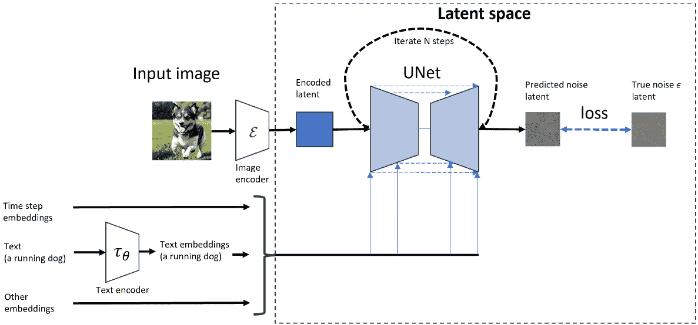
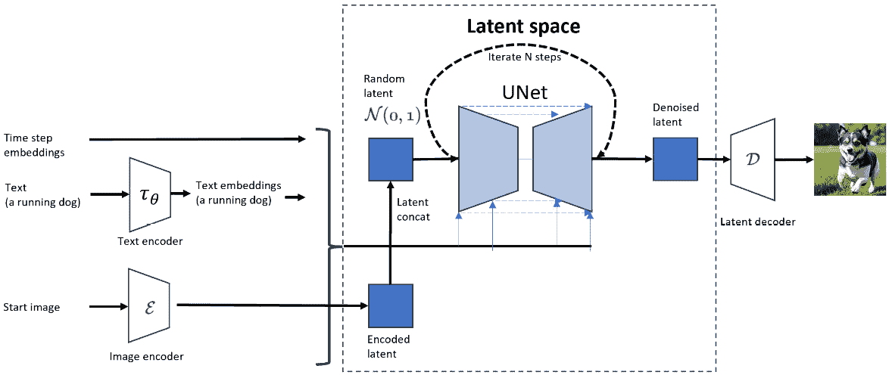
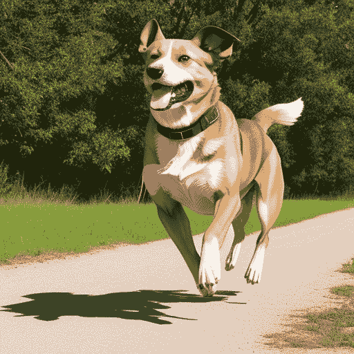
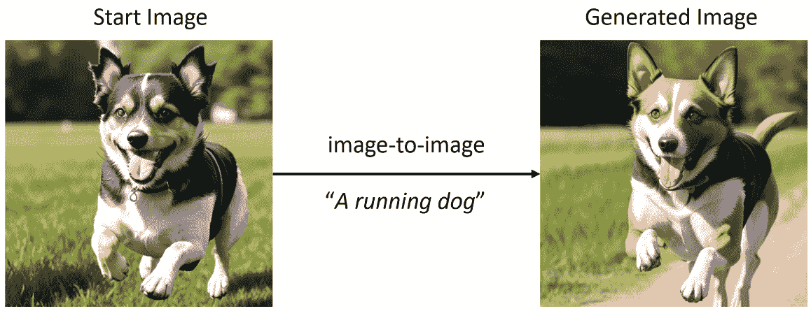

# 5

# 理解Stable Diffusion的工作原理

在[*第4章*](B21263_04.xhtml#_idTextAnchor081)中，我们通过一些数学公式深入了解了扩散模型的内部工作原理。如果你不习惯每天阅读公式，可能会感到害怕，但一旦你熟悉了那些符号和希腊字母，完全理解这些公式的益处是巨大的。数学公式和方程不仅以精确和简洁的形式帮助我们理解过程的本质，而且使我们能够阅读更多他人的论文和作品。

虽然原始的扩散模型更像是一个概念证明，但它展示了多步扩散模型与单次传递神经网络相比的巨大潜力。然而，原始扩散模型（**去噪扩散概率模型**（**DDPM**）[1]）和一些后续的分类器指导去噪存在一些缺点。让我列举两个：

+   要使用分类器指导训练扩散模型，需要训练一个新的分类器，而且我们不能重用预训练的分类器。此外，在扩散模型训练中，训练一个包含1,000个类别的分类器已经很不容易了。

+   在像素空间中使用预训练模型进行推理计算成本很高，更不用说训练模型了。在没有内存优化的情况下，使用预训练模型在具有8 GB VRAM的家用电脑上生成512x512像素的图像是不可能的。

在2022年，研究人员提出了**潜在扩散模型**，由Robin等人[2]提出。该模型很好地解决了分类问题和性能问题。后来，这种潜在扩散模型被称为Stable Diffusion。

在本章中，我们将探讨Stable Diffusion如何解决前面的问题，并引领图像生成领域的最先进发展。我们将具体涵盖以下主题：

+   潜在空间中的Stable Diffusion

+   使用Diffusers生成潜在向量

+   使用CLIP生成文本嵌入

+   生成时间步嵌入

+   初始化Stable Diffusion UNet

+   实现文本到图像的Stable Diffusion推理管道

+   实现文本引导的图像到图像的Stable Diffusion推理管道

+   将所有代码合并在一起

让我们深入探讨Stable Diffusion的核心。

本章的示例代码使用Diffusers包的0.20.0版本进行测试。为确保代码运行顺畅，请使用Diffusers v0.20.0。你可以使用以下命令进行安装：

```py
pip install diffusers==0.20.0
```

# 潜在空间中的Stable Diffusion

与在像素空间中处理扩散不同，Stable Diffusion使用潜在空间来表示图像。什么是潜在空间？简而言之，潜在空间是对象的向量表示。为了打个比方，在你去参加相亲之前，媒人可以以向量的形式提供给你对方的身高、体重、年龄、爱好等信息：

```py
[height, weight, age, hobbies,...]
```

你可以将这个向量视为你盲约对象的潜在空间。一个真实人的真实属性维度几乎是无限的（你可以为一个人写一篇传记）。潜在空间可以用来表示一个真实的人，只需要有限数量的特征，如身高、体重和年龄。

在Stable Diffusion训练阶段，使用一个训练好的编码器模型，通常表示为ℇ *(E)*，将输入图像编码为潜在向量表示。在反向扩散过程之后，潜在空间由像素空间的解码器解码。解码器通常表示为D *(D)*。

训练和采样都在潜在空间中进行。训练过程在*图5.1*中展示：



图5.1：在潜在空间中训练Stable Diffusion模型

*图5.1*展示了Stable Diffusion模型的训练过程。它展示了模型是如何被训练的概述。

下面是这个过程的一步一步分解：

1.  **输入**: 模型使用图像、标题文本和时间步嵌入（指定去噪发生的步骤）进行训练。

1.  **图像编码器**: 输入图像通过编码器传递。编码器是一个神经网络，它处理输入图像并将其转换为更抽象和压缩的表示。这种表示通常被称为“潜在空间”，因为它捕捉了图像的基本特征，但不是像素级细节。

1.  **潜在空间**: 编码器输出一个向量，代表潜在空间中的输入图像。潜在空间通常比输入空间（图像的像素空间）低维，这使得处理更快，并且更有效地表示输入数据。整个训练过程都在潜在空间中进行。

1.  **迭代N步**: 训练过程涉及在潜在空间中多次迭代（*N*步）。这个迭代过程是模型学习细化潜在空间表示并做出小调整以匹配期望输出图像的地方。

1.  **UNet**: 在每次迭代后，模型使用UNet根据当前的潜在空间向量生成输出图像。UNet生成预测的噪声，并整合输入文本嵌入、步骤信息以及可能的其他嵌入。

1.  **损失函数**: 模型的训练过程还涉及一个损失函数。这个函数衡量输出图像与期望输出图像之间的差异。随着模型的迭代，损失不断计算，模型通过调整其权重来最小化这个损失。这就是模型如何从错误中学习并随着时间的推移而改进。

请参考[*第21章*](B21263_21.xhtml#_idTextAnchor405)获取更多关于模型训练的详细步骤。

从UNet进行推理的过程在*图5.2*中展示：



图5.2：稳定扩散在潜在空间中的推理

稳定扩散不仅支持文本引导的图像生成；它还支持图像引导的生成。

在*图5.2*中，从左侧开始，我们可以看到文本和图像都被用来引导图像生成。

当我们提供文本输入时，稳定扩散使用 CLIP [3] 生成嵌入向量，该向量将被输入到 UNet 中，并使用注意力机制。

当我们提供一个图像作为引导信号时，输入图像将被编码到潜在空间，然后与随机生成的高斯噪声进行拼接。

一切都取决于我们提供的指导；我们可以提供文本、图像或两者兼而有之。我们甚至可以在不提供任何图像的情况下生成图像；在这种情况下，“空”的引导案例中，UNet模型将根据随机初始化的噪声决定生成什么。

提供了两个基本输入文本嵌入和初始图像潜在噪声（是否包含初始图像在潜在空间中的编码向量），UNet开始从潜在空间中的初始图像中去除噪声。经过几个去噪步骤后，在解码器的帮助下，稳定扩散可以在像素空间中输出一个生动的图像。

该过程与训练过程类似，但不需要将损失值发送回更新权重。相反，在经过几个去噪步骤（*N*步骤）后，潜在解码器（**变分自动编码器**（**VAE**）[4]）将图像从潜在空间转换为可见像素空间。

接下来，让我们看看那些组件（文本编码器、图像编码器、UNet和图像解码器）的样子，然后我们将一步一步地构建我们自己的稳定扩散管道。

# 使用 diffusers 生成潜在向量

在本节中，我们将使用预训练的稳定扩散模型将图像编码到潜在空间，以便我们有一个关于潜在向量看起来和感觉如何的具体印象。然后，我们将潜在向量解码回图像。此操作还将为构建图像到图像的定制管道奠定基础：

1.  `load_image` 函数从 `diffusers` 中加载图像，从本地存储或URL加载图像。在下面的代码中，我们从当前程序的同一目录中加载了一个名为 `dog.png` 的图像：

    ```py
    from diffusers.utils import load_image
    ```

    ```py
    image = load_image("dog.png")
    ```

    ```py
    display(image)
    ```

1.  **预处理图像**：加载的每个像素都由一个介于0到255之间的数字表示。稳定扩散过程中的图像编码器处理介于-1.0到1.0之间的图像数据。因此，我们首先需要进行数据范围转换：

    ```py
    import numpy as np
    ```

    ```py
    # convert image object to array and 
    ```

    ```py
    # convert pixel data from 0 ~ 255 to 0 ~ 1
    ```

    ```py
    image_array = np.array(image).astype(np.float32)/255.0
    ```

    ```py
    # convert the number from 0 ~ 1 to -1 ~ 1
    ```

    ```py
    image_array = image_array * 2.0 - 1.0
    ```

    现在，如果我们使用 Python 代码 `image_array.shape` 来检查 `image_array` 数据形状，我们将看到图像数据的形状为 – `(512,512,3)`，排列为 `(width, height, channel)`，而不是常用的 `(channel, width, height)`。在这里，我们需要使用 `transpose()` 函数将图像数据形状转换为 `(channel, width, height)` 或 `(3,512,512)`：

    ```py
    # transform the image array from width,height,
    ```

    ```py
    # channel to channel,width,height
    ```

    ```py
    image_array_cwh = image_array.transpose(2,0,1)
    ```

    `2` 位于 `2, 0, 1` 的第一个位置，这意味着将原始的第三维度（索引为 `2`）移动到第一个维度。相同的逻辑适用于 `0` 和 `1`。原始的 `0` 维度现在转换为第二个位置，原始的 `1` 现在位于第三个维度。

    通过这个转置操作，NumPy 数组 `image_array_cwh` 现在具有 `(``3,512,512)` 的形状。

    稳定扩散图像编码器以批处理方式处理图像数据，在这个例子中是具有四个维度的数据，批处理维度位于第一个位置；我们需要在这里添加批处理维度：

    ```py
    # add batch dimension
    ```

    ```py
    image_array_cwh = np.expand_dims(image_array_cwh, axis = 0)
    ```

1.  `torch` **并移动到 CUDA**：我们将使用 CUDA 将图像数据转换为潜在空间。为了实现这一点，我们需要在将其传递给下一步模型之前将数据加载到 CUDA VRAM 中：

    ```py
    # load image with torch
    ```

    ```py
    import torch
    ```

    ```py
    image_array_cwh = torch.from_numpy(image_array_cwh)
    ```

    ```py
    image_array_cwh_cuda = image_array_cwh.to(
    ```

    ```py
        "cuda",
    ```

    ```py
        dtype=torch.float16
    ```

    ```py
    )
    ```

1.  **加载稳定扩散图像编码器 VAE**：这个 VAE 模型用于将图像从像素空间转换为潜在空间：

    ```py
    # Initialize VAE model
    ```

    ```py
    import torch
    ```

    ```py
    from diffusers import AutoencoderKL
    ```

    ```py
    vae_model = AutoencoderKL.from_pretrained(
    ```

    ```py
        "runwayml/stable-diffusion-v1-5",
    ```

    ```py
        subfolder = "vae",
    ```

    ```py
        torch_dtype=torch.float16
    ```

    ```py
    ).to("cuda")
    ```

1.  **将图像编码为潜在向量**：现在一切准备就绪，我们可以将任何图像编码为潜在向量，作为 PyTorch 张量：

    ```py
    latents = vae_model.encode(
    ```

    ```py
        image_array_cwh_cuda).latent_dist.sample()
    ```

    检查潜在数据的数据和形状：

    ```py
    print(latents[0])
    ```

    ```py
    print(latents[0].shape)
    ```

    我们可以看到潜在数据具有 `(4, 64, 64)` 的形状，每个元素的范围在 `-1.0` 到 `1.0` 之间。

    稳定扩散对所有去噪步骤都在一个 64x64 张量上进行，该张量具有 4 个通道，用于生成 512x512 的图像。数据大小远小于其原始图像大小，512x512 的三个颜色通道。

1.  **将潜在数据解码为图像（可选）**：你可能想知道，我能将潜在数据转换回像素图像吗？是的，我们可以通过以下代码行来实现：

    ```py
    import numpy as np
    ```

    ```py
    from PIL import Image
    ```

    ```py
    def latent_to_img(latents_input, scale_rate = 1):
    ```

    ```py
        latents_2 = (1 / scale_rate) * latents_input
    ```

    ```py
        # decode image
    ```

    ```py
        with torch.no_grad():
    ```

    ```py
            decode_image = vae_model.decode(
    ```

    ```py
            latents_input, 
    ```

    ```py
            return_dict = False
    ```

    ```py
            )[0][0]
    ```

    ```py
        decode_image =  (decode_image / 2 + 0.5).clamp(0, 1)
    ```

    ```py
        # move latent data from cuda to cpu
    ```

    ```py
        decode_image = decode_image.to("cpu")
    ```

    ```py
        # convert torch tensor to numpy array
    ```

    ```py
        numpy_img = decode_image.detach().numpy()
    ```

    ```py
        # covert image array from (width, height, channel) 
    ```

    ```py
        # to (channel, width, height)
    ```

    ```py
        numpy_img_t = numpy_img.transpose(1,2,0)
    ```

    ```py
        # map image data to 0, 255, and convert to int number
    ```

    ```py
        numpy_img_t_01_255 = \ 
    ```

    ```py
            (numpy_img_t*255).round().astype("uint8")
    ```

    ```py
        # shape the pillow image object from the numpy array
    ```

    ```py
        return Image.fromarray(numpy_img_t_01_255)
    ```

    ```py
    pil_img = latent_to_img(latents_input)
    ```

    ```py
    pil_img
    ```

`diffusers` 稳定扩散管道最终将生成一个潜在张量。我们将遵循类似的步骤，在本章的后半部分恢复图像的降噪潜在。

# 使用 CLIP 生成文本嵌入

要生成文本嵌入（嵌入包含图像特征），我们首先需要标记输入文本或提示，然后将标记 ID 编码为嵌入。以下是实现此目的的步骤：

1.  **获取提示标记 ID**：

    ```py
    input_prompt = "a running dog"
    ```

    ```py
    # input tokenizer and clip embedding model
    ```

    ```py
    import torch
    ```

    ```py
    from transformers import CLIPTokenizer,CLIPTextModel
    ```

    ```py
    # initialize tokenizer
    ```

    ```py
    clip_tokenizer = CLIPTokenizer.from_pretrained(
    ```

    ```py
        "runwayml/stable-diffusion-v1-5",
    ```

    ```py
        subfolder = "tokenizer",
    ```

    ```py
        dtype     = torch.float16
    ```

    ```py
    )
    ```

    ```py
    input_tokens = clip_tokenizer(
    ```

    ```py
        input_prompt,
    ```

    ```py
        return_tensors = "pt"
    ```

    ```py
    )["input_ids"]
    ```

    ```py
    input_tokens
    ```

    上述代码将 `a running dog` 文本提示转换为标记 ID 列表，作为一个 `torch` 张量对象 – `tensor([[49406, 320, 2761, 1929, 49407]])`。

1.  **将标记 ID 编码为嵌入**：

    ```py
    # initialize CLIP text encoder model
    ```

    ```py
    clip_text_encoder = CLIPTextModel.from_pretrained(
    ```

    ```py
        "runwayml/stable-diffusion-v1-5",
    ```

    ```py
        subfolder="text_encoder",
    ```

    ```py
        # dtype=torch.float16
    ```

    ```py
    ).to("cuda")
    ```

    ```py
    # encode token ids to embeddings
    ```

    ```py
    prompt_embeds = clip_text_encoder(
    ```

    ```py
        input_tokens.to("cuda")
    ```

    ```py
    )[0]
    ```

1.  **检查嵌入数据**：

    ```py
    print(prompt_embeds)
    ```

    ```py
    print(prompt_embeds.shape)
    ```

    现在，我们可以看到 `prompt_embeds` 的数据如下：

    ```py
    tensor([[[-0.3884,0.0229, -0.0522,..., -0.4899, -0.3066,0.0675],
    ```

    ```py
        [ 0.0290, -1.3258,  0.3085,..., -0.5257,0.9768,0.6652],
    ```

    ```py
        [ 1.4642,0.2696,0.7703,..., -1.7454, -0.3677,0.5046],
    ```

    ```py
        [-1.2369,0.4149,1.6844,..., -2.8617, -1.3217,0.3220],
    ```

    ```py
        [-1.0182,0.7156,0.4969,..., -1.4992, -1.1128, -0.2895]]],
    ```

    ```py
        device='cuda:0', grad_fn=<NativeLayerNormBackward0>)
    ```

    其形状为 `torch.Size([1, 5, 768])`。每个标记 ID 被编码为一个 768 维向量。

1.  `prompt` 和 `prompt`/`negative` `prompt` 情况：

    ```py
    # prepare neg prompt embeddings
    ```

    ```py
    uncond_tokens = "blur"
    ```

    ```py
    # get the prompt embedding length
    ```

    ```py
    max_length = prompt_embeds.shape[1]
    ```

    ```py
    # generate negative prompt tokens with the same length of prompt
    ```

    ```py
    uncond_input_tokens = clip_tokenizer(
    ```

    ```py
        uncond_tokens,
    ```

    ```py
        padding = "max_length",
    ```

    ```py
        max_length = max_length,
    ```

    ```py
        truncation = True,
    ```

    ```py
        return_tensors = "pt"
    ```

    ```py
    )["input_ids"]
    ```

    ```py
    # generate the negative embeddings
    ```

    ```py
    with torch.no_grad():
    ```

    ```py
        negative_prompt_embeds = clip_text_encoder(
    ```

    ```py
            uncond_input_tokens.to("cuda")
    ```

    ```py
        )[0]
    ```

1.  `torch` 向量：

    ```py
    prompt_embeds = torch.cat([negative_prompt_embeds, 
    ```

    ```py
        prompt_embeds])
    ```

接下来，我们将初始化时间步数据。

# 初始化时间步嵌入

我们在[*第3章*](B21263_03.xhtml#_idTextAnchor064)中介绍了调度器。通过使用调度器，我们可以为图像生成采样关键步骤。与在原始扩散模型（DDPM）中通过去噪1,000步来生成图像相比，使用调度器我们只需20步就能生成图像。

在本节中，我们将使用欧拉调度器生成时间步嵌入，然后我们将看看时间步嵌入看起来是什么样子。不管试图绘制过程的图表有多好，我们只能通过阅读实际数据和代码来理解它的工作原理：

1.  **从模型调度器配置初始化一个调度器**：

    ```py
    from diffusers import EulerDiscreteScheduler as Euler
    ```

    ```py
    # initialize scheduler from a pretrained checkpoint
    ```

    ```py
    scheduler = Euler.from_pretrained(
    ```

    ```py
        "runwayml/stable-diffusion-v1-5",
    ```

    ```py
        subfolder = "scheduler"
    ```

    ```py
    )
    ```

    上述代码将从检查点的调度器配置文件初始化一个调度器。请注意，你还可以创建一个调度器，正如我们在[*第3章*](B21263_03.xhtml#_idTextAnchor064)中讨论的那样，如下所示：

    ```py
    import torch
    ```

    ```py
    from diffusers import StableDiffusionPipeline
    ```

    ```py
    from diffusers import EulerDiscreteScheduler as Euler
    ```

    ```py
    text2img_pipe = StableDiffusionPipeline.from_pretrained(
    ```

    ```py
        "runwayml/stable-diffusion-v1-5",
    ```

    ```py
        torch_dtype = torch.float16
    ```

    ```py
    ).to("cuda:0")
    ```

    ```py
    scheduler = Euler.from_config(text2img_pipe.scheduler.config)
    ```

    然而，这需要你首先加载一个模型，这不仅速度慢，而且不必要；我们需要的只是模型的调度器。

1.  **为图像扩散过程采样步骤**：

    ```py
    inference_steps = 20
    ```

    ```py
    scheduler.set_timesteps(inference_steps, device = "cuda")
    ```

    ```py
    timesteps = scheduler.timesteps
    ```

    ```py
    for t in timesteps:
    ```

    ```py
        print(t)
    ```

    我们将看到20步的值如下：

    ```py
    ...
    ```

    ```py
    tensor(999., device='cuda:0', dtype=torch.float64)
    ```

    ```py
    tensor(946.4211, device='cuda:0', dtype=torch.float64)
    ```

    ```py
    tensor(893.8421, device='cuda:0', dtype=torch.float64)
    ```

    ```py
    tensor(841.2632, device='cuda:0', dtype=torch.float64)
    ```

    ```py
    tensor(788.6842, device='cuda:0', dtype=torch.float64)
    ```

    ```py
    tensor(736.1053, device='cuda:0', dtype=torch.float64)
    ```

    ```py
    tensor(683.5263, device='cuda:0', dtype=torch.float64)
    ```

    ```py
    tensor(630.9474, device='cuda:0', dtype=torch.float64)
    ```

    ```py
    tensor(578.3684, device='cuda:0', dtype=torch.float64)
    ```

    ```py
    tensor(525.7895, device='cuda:0', dtype=torch.float64)
    ```

    ```py
    tensor(473.2105, device='cuda:0', dtype=torch.float64)
    ```

    ```py
    tensor(420.6316, device='cuda:0', dtype=torch.float64)
    ```

    ```py
    tensor(368.0526, device='cuda:0', dtype=torch.float64)
    ```

    ```py
    tensor(315.4737, device='cuda:0', dtype=torch.float64)
    ```

    ```py
    tensor(262.8947, device='cuda:0', dtype=torch.float64)
    ```

    ```py
    tensor(210.3158, device='cuda:0', dtype=torch.float64)
    ```

    ```py
    tensor(157.7368, device='cuda:0', dtype=torch.float64)
    ```

    ```py
    tensor(105.1579, device='cuda:0', dtype=torch.float64)
    ```

    ```py
    tensor(52.5789, device='cuda:0', dtype=torch.float64)
    ```

    ```py
    tensor(0., device='cuda:0', dtype=torch.float64)
    ```

在这里，调度器从1,000步中抽取了20步，这20步可能足以对图像生成中的完整高斯分布进行去噪。这种步骤采样技术也有助于提高Stable Diffusion的性能。

# 初始化Stable Diffusion UNet

UNet架构[5]由Ronneberger等人为了生物医学图像分割目的而引入。在UNet架构之前，卷积网络通常用于图像分类任务。当使用卷积网络时，输出是一个单一类别的标签。然而，在许多视觉任务中，所需的输出还应包括定位信息，而UNet模型解决了这个问题。

UNet的U形架构使得在不同尺度上高效学习特征成为可能。UNet的跳过连接直接将不同阶段的特征图结合起来，使模型能够有效地在不同尺度间传播信息。这对于去噪至关重要，因为它确保模型在去噪过程中既保留了精细的细节，也保留了全局上下文。这些特性使UNet成为去噪模型的良好候选。

在`Diffuser`库中，有一个名为`UNet2DconditionalModel`的类；这是一个用于图像生成和相关任务的2D条件UNet模型。它是扩散模型的关键组件，在图像生成过程中发挥着至关重要的作用。我们只需几行代码就可以加载一个UNet模型，如下所示：

```py
import torch
from diffusers import UNet2DConditionModel
unet = UNet2DConditionModel.from_pretrained(
    "runwayml/stable-diffusion-v1-5",
    subfolder ="unet",
    torch_dtype = torch.float16
).to("cuda")
```

与我们刚刚加载的UNet模型一起，我们拥有了Stable Diffusion所需的所有组件。这并不难，对吧？接下来，我们将使用这些构建块来构建两个Stable Diffusion管道——一个文本到图像和一个图像到图像。

# 实现文本到图像的Stable Diffusion推理管道

到目前为止，我们已经初始化并加载了所有文本编码器、图像VAE和去噪UNet模型到CUDA VRAM中。以下步骤将它们链接在一起，形成最简单且可工作的Stable Diffusion文本到图像管道：

1.  **初始化潜在噪声**：在*图5**.2中，推理的起点是随机初始化的高斯潜在噪声。我们可以使用以下代码创建一个潜在噪声：

    ```py
    # prepare noise latents
    ```

    ```py
    shape = torch.Size([1, 4, 64, 64])
    ```

    ```py
    device = "cuda"
    ```

    ```py
    noise_tensor = torch.randn(
    ```

    ```py
        shape,
    ```

    ```py
        generator = None,
    ```

    ```py
        dtype     = torch.float16
    ```

    ```py
    ).to("cuda")
    ```

    在训练阶段，使用初始噪声sigma来帮助防止扩散过程陷入局部最小值。当扩散过程开始时，它很可能处于一个非常接近局部最小值的状态。`init_noise_sigma = 14.6146`用于帮助避免这种情况。因此，在推理过程中，我们也将使用`init_noise_sigma`来塑造初始潜在表示。

    ```py
    # scale the initial noise by the standard deviation required by 
    ```

    ```py
    # the scheduler
    ```

    ```py
    latents = noise_tensor * scheduler.init_noise_sigma
    ```

1.  **遍历UNet**：在准备所有这些组件后，我们最终到达将初始潜在表示输入UNet以生成我们想要的目标潜在表示的阶段：

    ```py
    guidance_scale = 7.5
    ```

    ```py
    latents_sd = torch.clone(latents)
    ```

    ```py
    for i,t in enumerate(timesteps):
    ```

    ```py
        # expand the latents if we are doing classifier free guidance
    ```

    ```py
        latent_model_input = torch.cat([latents_sd] * 2)
    ```

    ```py
        latent_model_input = scheduler.scale_model_input(
    ```

    ```py
            latent_model_input, t)
    ```

    ```py
        # predict the noise residual
    ```

    ```py
        with torch.no_grad():
    ```

    ```py
            noise_pred = unet(
    ```

    ```py
                latent_model_input,
    ```

    ```py
                t,
    ```

    ```py
                encoder_hidden_states=prompt_embeds,
    ```

    ```py
                return_dict = False,
    ```

    ```py
            )[0]
    ```

    ```py
        # perform guidance
    ```

    ```py
        noise_pred_uncond, noise_pred_text = noise_pred.chunk(2)
    ```

    ```py
        noise_pred = noise_pred_uncond + guidance_scale *
    ```

    ```py
            (noise_pred_text - noise_pred_uncond)
    ```

    ```py
        # compute the previous noisy sample x_t -> x_t-1
    ```

    ```py
        latents_sd = scheduler.step(noise_pred, t,
    ```

    ```py
            latents_sd, return_dict=False)[0]
    ```

    前面的代码是`diffusers`包中`DiffusionPipeline`的简化去噪循环，移除了所有边缘情况，仅保留了推理的核心。

    该算法通过迭代地向图像的潜在表示中添加噪声来工作。在每次迭代中，噪声由文本提示引导，这有助于模型生成与提示更相似的图像。

    前面的代码首先定义了一些变量：

    +   `guidance_scale`变量控制应用于噪声的引导程度。

    +   `latents_sd`变量存储生成的图像的潜在表示。时间步变量存储一个列表，其中包含添加噪声的时间步。

    代码的主循环遍历时间步。在每次迭代中，代码首先将潜在表示扩展以包含其自身的两份副本。这是因为在Stable Diffusion算法中，使用的是无分类器引导机制，它需要两个潜在表示的副本。

    然后代码调用`unet`函数来预测当前时间步的噪声残差。

    然后代码对噪声残差进行引导。这涉及到将文本条件噪声残差的缩放版本添加到无条件噪声残差中。应用引导的程度由`guidance_scale`变量控制。

    最后，代码调用`scheduler`函数来更新图像的潜在表示。`scheduler`函数是一个函数，它控制在每个时间步添加到潜在表示中的噪声量。

    如前所述，前面的代码是Stable Diffusion算法的简化版本。在实际应用中，该算法要复杂得多，并融合了多种其他技术来提高生成图像的质量。

1.  使用`latent_to_img`函数从潜在空间恢复图像：

    ```py
    import numpy as np
    ```

    ```py
    from PIL import Image
    ```

    ```py
    def latent_to_img(latents_input):
    ```

    ```py
        # decode image
    ```

    ```py
        with torch.no_grad():
    ```

    ```py
            decode_image = vae_model.decode(
    ```

    ```py
                latents_input,
    ```

    ```py
                return_dict = False
    ```

    ```py
            )[0][0]
    ```

    ```py
        decode_image =  (decode_image / 2 + 0.5).clamp(0, 1)
    ```

    ```py
        # move latent data from cuda to cpu
    ```

    ```py
        decode_image = decode_image.to("cpu")
    ```

    ```py
        # convert torch tensor to numpy array
    ```

    ```py
        numpy_img = decode_image.detach().numpy()
    ```

    ```py
        # covert image array from (channel, width, height) 
    ```

    ```py
        # to (width, height, channel)
    ```

    ```py
        numpy_img_t = numpy_img.transpose(1,2,0)
    ```

    ```py
        # map image data to 0, 255, and convert to int number
    ```

    ```py
        numpy_img_t_01_255 = \ 
    ```

    ```py
            (numpy_img_t*255).round().astype("uint8")
    ```

    ```py
        # shape the pillow image object from the numpy array
    ```

    ```py
        return Image.fromarray(numpy_img_t_01_255)
    ```

    ```py
    latents_2 = (1 / 0.18215) * latents_sd
    ```

    ```py
    pil_img = latent_to_img(latents_2)
    ```

    `latent_to_img`函数按照以下顺序执行操作：

    1.  它调用`vae_model.decode`函数将潜在向量解码为图像。`vae_model.decode`函数是在图像数据集上训练的函数。它可以用来生成与数据集中图像相似的新图像。

    1.  将图像数据归一化到`0`到`1`的范围内。这样做是因为`Image.fromarray`函数期望图像数据处于这个范围内。

    1.  将图像数据从GPU移动到CPU。然后，它将图像数据从torch张量转换为NumPy数组。这样做是因为`Image.fromarray`函数只接受NumPy数组作为输入。

    1.  将图像数组的维度翻转，使其处于（宽度，高度，通道）格式，这是`Image.fromarray`函数期望的格式。

    1.  将图像数据映射到`0`到`255`的范围内，并将其转换为整型。

    1.  调用`Image.fromarray`函数从图像数据创建Python图像库（PIL）图像对象。

    在解码潜在图像时，需要使用`latents_2 = (1 / 0.18215) * latents_sd`这一行代码，因为在训练过程中潜在被`0.18215`这个因子缩放。这种缩放是为了确保潜在空间具有单位方差。在解码时，需要将潜在缩放回其原始尺度以重建原始图像。

    如果一切顺利，你应该能看到类似以下内容：



图5.3：一只正在奔跑的狗，由定制的Stable Diffusion管道生成

在下一节中，我们将实现一个图像到图像的Stable Diffusion管道。

# 实现文本引导的图像到图像Stable Diffusion推理管道

现在我们需要做的只是将起始图像与起始潜在噪声连接起来。`latents_input` Torch张量是我们在本章早期从狗图像中编码的潜在：

```py
strength = 0.7
# scale the initial noise by the standard deviation required by the 
# scheduler
latents = latents_input*(1-strength) + 
    noise_tensor*scheduler.init_noise_sigma
```

这就是所有必要的步骤；使用与文本到图像管道相同的代码，你应该会生成类似*图5.4*的内容：



图5.4：一只正在奔跑的狗，由定制的图像到图像Stable Diffusion管道生成

注意，前面的代码使用`strength = 0.7`；强度表示原始潜在噪声的权重。如果你想得到与初始图像（你提供给图像到图像管道的图像）更相似的图像，请使用较小的强度数字；否则，增加它。

# 摘要

在本章中，我们从原始扩散模型DDPM过渡到，并解释了什么是Stable Diffusion以及为什么它比DDPM模型更快、更好。

如论文《使用潜在扩散模型进行高分辨率图像合成》[6] 所建议的，稳定扩散与其前辈最大的区别特征是“*潜在*”。本章解释了潜在空间是什么以及稳定扩散的训练和推理是如何在内部工作的。

为了全面理解，我们使用了诸如将初始图像编码为潜在数据、将输入提示转换为令牌 ID 并使用 CLIP 文本模型将其嵌入到文本嵌入中、使用稳定扩散调度器采样推理的详细步骤、创建初始噪声潜在值、将初始噪声潜在值与初始图像潜在值连接、将所有组件组合起来构建自定义文本到图像稳定扩散管道，以及扩展管道以启用文本引导的图像到图像稳定扩散管道等方法创建了组件。我们逐一创建了这些组件，最终构建了两个稳定扩散管道——一个文本到图像管道和一个扩展的文本引导图像到图像管道。

通过完成本章，你应该不仅对稳定扩散有一个一般性的理解，而且能够自由地构建自己的管道以满足特定需求。

在下一章中，我们将介绍加载稳定扩散模型的方法。

# 参考文献

1.  Jonathan Ho，Ajay Jain，Pieter Abbeel，去噪扩散概率模型：[https://arxiv.org/abs/2006.11239](https://arxiv.org/abs/2006.11239)

1.  Robin 等人，使用潜在扩散模型进行高分辨率图像合成：[https://arxiv.org/abs/2112.10752](https://arxiv.org/abs/2112.10752)

1.  Alec 等人，从自然语言监督中学习可迁移的视觉模型：[https://arxiv.org/abs/2103.00020](https://arxiv.org/abs/2103.00020)

1.  VAEs：[https://en.wikipedia.org/wiki/Variational_autoencoder](https://en.wikipedia.org/wiki/Variational_autoencoder)

1.  Hugging Face 的 UNet2DConditionModel 文档：[https://huggingface.co/docs/diffusers/api/models/unet2d-cond](https://huggingface.co/docs/diffusers/api/models/unet2d-cond)

1.  Robin 等人，使用潜在扩散模型进行高分辨率图像合成：[https://arxiv.org/abs/2112.10752](https://arxiv.org/abs/2112.10752)

# 阅读材料

Jonathan Ho，Tim Salimans，无分类器扩散引导：[https://arxiv.org/abs/2207.12598](https://arxiv.org/abs/2207.12598)

使用 Diffusers 的稳定扩散：[https://huggingface.co/blog/stable_diffusion](https://huggingface.co/blog/stable_diffusion)

Olaf Ronneberger，Philipp Fischer，Thomas Brox，UNet：用于生物医学图像分割的卷积网络：[https://arxiv.org/abs/1505.04597](https://arxiv.org/abs/1505.04597)
