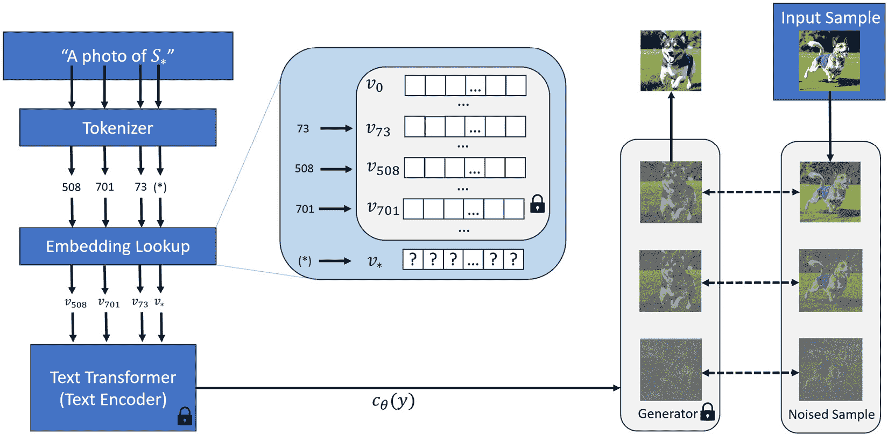

# 使用文本反转

**文本反转**（**TI**）是向预训练模型提供额外功能的一种方式。与在[*第8章*](B21263_08.xhtml#_idTextAnchor153)中讨论的**低秩自适应**（**LoRA**）不同，LoRA是一种应用于文本编码器和UNet注意力权重的微调技术，TI是一种基于训练数据添加新**嵌入**空间的技术。

在Stable Diffusion的上下文中，**文本嵌入**指的是将文本数据表示为高维空间中的数值向量，以便通过机器学习算法进行操作和处理。具体来说，在Stable Diffusion的情况下，文本嵌入通常使用**对比语言-图像预训练**（**CLIP**）[6]模型创建。

要训练一个TI模型，你只需要三到五张最小图像集，结果是一个紧凑的`pt`或`bin`文件，通常只有几KB大小。这使得TI成为将新元素、概念或风格融入预训练检查点模型的同时保持卓越便携性的高效方法。

在本章中，我们将首先使用来自`diffusers`包的TI加载器使用TI，然后深入TI的核心以揭示其内部工作原理，最后构建一个自定义TI加载器以将TI权重应用于图像生成。

下面是我们将要讨论的主题：

+   使用TI进行扩散器推理

+   TI是如何工作的

+   构建自定义TI加载器

到本章结束时，你将能够开始使用社区共享的任何类型的TI，并构建你的应用程序以加载TI。

让我们开始利用Stable Diffusion TI的力量。

# 使用TI进行扩散器推理

在深入了解TI内部工作原理之前，让我们看看如何使用Diffusers来使用TI。

在Hugging Face的Stable Diffusion概念库[3]和CIVITAI[4]中共享了无数预训练的TI。例如，从Stable Diffusion概念库中最受欢迎的TI之一是`sd-concepts-library/midjourney-style`[5]。我们可以通过在代码中简单地引用此名称来开始使用它；Diffusers将自动下载模型数据：

1.  让我们初始化一个Stable Diffusion管道：

    ```py
    # initialize model
    ```

    ```py
    from diffusers import StableDiffusionPipeline
    ```

    ```py
    import torch
    ```

    ```py
    model_id = "stablediffusionapi/deliberate-v2"
    ```

    ```py
    pipe = StableDiffusionPipeline.from_pretrained(
    ```

    ```py
        model_id,
    ```

    ```py
        torch_dtype=torch.float16
    ```

    ```py
    ).to("cuda")
    ```

1.  不使用TI生成图像：

    ```py
    # without using TI
    ```

    ```py
    prompt = "a high quality photo of a futuristic city in deep \ 
    ```

    ```py
    space, midjourney-style"
    ```

    ```py
    image = pipe(
    ```

    ```py
        prompt,
    ```

    ```py
        num_inference_steps = 50,
    ```

    ```py
        generator = torch.Generator("cuda").manual_seed(1)
    ```

    ```py
    ).images[0]
    ```

    ```py
    image
    ```

    在提示中，使用了`midjourney-style`，这将是TI的名称。如果没有应用名称，我们将看到生成的图像，如图*图9.1*所示：


图9.1：没有TI的深空未来城市

1.  使用TI生成图像。

    现在，让我们将TI加载到Stable Diffusion管道中，并给它命名为`midjourney-style`，以表示新添加的嵌入：

    ```py
    pipe.load_textual_inversion(
    ```

    ```py
        "sd-concepts-library/midjourney-style",
    ```

    ```py
        token = "midjourney-style"
    ```

    ```py
    )
    ```

    上述代码将自动下载TI并将其添加到管道模型中。再次执行相同的提示和管道，我们将得到一个全新的图像，如图*图9.2*所示：


图9.2：深空中带有TI的未来城市

是的，它看起来和感觉就像Midjourney生成的图像，但实际上是由Stable Diffusion生成的。TI名称中的“*反转*”表示我们可以将任何新名称逆转换为新嵌入，例如，如果我们给一个新标记命名为`colorful-magic-style`：

```py
pipe.load_textual_inversion(
    "sd-concepts-library/midjourney-style",
    token = "colorful-magic-style"
)
```

由于我们使用 `midjourney-style` 作为TI的名称，我们将得到相同的图像。这次，我们将 `colorful-magic-style` “反转”到新嵌入中。然而，Diffusers提供的 `load_textual_inversion` 函数没有为用户提供 `weight` 参数来加载具有特定权重的TI。我们将在本章后面添加加权TI到我们自己的TI加载器中。

在此之前，让我们深入TI的核心，看看它是如何内部工作的。

# TI是如何工作的

简而言之，训练TI就是找到一个与目标图像最佳匹配的文本嵌入，例如其风格、物体或面部。关键是找到一个在当前文本编码器中从未存在的新嵌入。正如*图9**.3*，从其原始论文[1]所示：



图9.3：文本嵌入和反转过程的概述

训练的唯一任务是找到一个由 v * 表示的新嵌入，并使用 S * 作为标记字符串占位符；字符串可以替换为任何在分词器中不存在的字符串。一旦找到新的对应嵌入向量，训练就完成了。训练的输出通常是一个包含768个数字的向量。这就是为什么TI文件如此小巧；它只是几千字节。

就像预训练的UNet是一堆矩阵魔法盒子，一个密钥（嵌入）可以解锁一个盒子，以获得一个图案、一种风格或一个物体。盒子的数量远远多于文本编码器提供的有限密钥。TI的训练是通过提供一个新密钥来解锁未知的魔法盒子来完成的。在整个训练和推理过程中，原始检查点模型保持不变。

精确地说，新嵌入的寻找可以定义为以下：

v * = arg v min E z∼E(x),y,ϵ∼N(0,1),t[||ϵ − ϵ θ(z t, t, c θ(y))|| 2 2]

让我们逐个从左到右解释公式：

+   v * 表示我们正在寻找的新嵌入。

+   arg min 符号常用于统计学和优化，表示最小化一个函数的值集合。这是一个有用的符号，因为它允许我们讨论函数的最小值，而无需指定最小值的实际值。

+   (E) 是损失期望。

+   z ∼ E(x) 表示输入图像将被编码到潜在空间。

+   y 是输入文本。

+   e ∼ N(0,1) 表示初始噪声潜在值是一个具有 `0` 均值和 `1` 方差的严格高斯分布。

+   c θ(y) 代表一个将输入文本字符串 y 映射到嵌入向量的文本编码器模型。

+   ϵ θ(z t, t, c θ(y))表示我们在t步骤提供带噪声的潜在图像z，t本身和文本嵌入c θ(y)，然后从UNet模型生成噪声向量。

+   2在|| 2中表示欧几里得距离的平方。2在|| 2中表示数据在2维。

一起，公式显示了我们可以如何使用Stable Diffusion的训练过程来近似一个新嵌入v *，它生成最小损失。

接下来，让我们构建一个自定义TI加载器函数。

# 构建自定义TI加载器

在本节中，我们将通过将前面的理解转化为代码，并为加载函数提供一个TI权重参数来构建一个TI加载器。

在编写函数代码之前，我们先来了解一下TI的内部结构。在运行以下代码之前，您需要先将TI文件下载到您的存储设备中。

## pt文件格式的TI

以`pt`文件格式加载TI：

```py
# load a pt TI
import torch
loaded_learned_embeds = torch.load("badhandsv5-neg.pt",
    map_location="cpu")
keys = list(loaded_learned_embeds.keys())
for key in keys:
    print(key,":",loaded_learned_embeds[key])
```

我们可以清楚地看到TI文件中的键和配对值：

```py
string_to_token : {'*': 265}
string_to_param : {'*': tensor([[ 0.0399, -0.2473,  0.1252,  ...,  0.0455,  0.0845, -0.1463],
        [-0.1385, -0.0922, -0.0481,  ...,  0.1766, -0.1868,  0.3851]],
       requires_grad=True)}
name : bad-hands-5
step : 1364
sd_checkpoint : 7ab762a7
sd_checkpoint_name : blossom-extract
```

最重要的值是具有`string_to_param`键的`tensor`对象。我们可以使用以下代码从中提取张量值：

```py
string_to_token = loaded_learned_embeds['string_to_token']
string_to_param = loaded_learned_embeds['string_to_param']
# separate token and the embeds
trained_token = list(string_to_token.keys())[0]
embeds = string_to_param[trained_token]
```

## bin文件格式的TI

Hugging Face概念库中的大多数TI都是`bin`格式。`bin`结构比`pt`结构更简单：

```py
import torch
loaded_learned_embeds = torch.load("midjourney_style.bin",
    map_location="cpu")
keys = list(loaded_learned_embeds.keys())
for key in keys:
    print(key,":",loaded_learned_embeds[key])
```

我们将看到这个——只有一个键和一个值的字典：

```py
<midjourney-style> : tensor([-5.9785e-02, -3.8523e-02,  5.1913e-02,  8.0925e-03, -6.2018e-02,
         1.3361e-01,  1.3679e-01,  8.2224e-02, -2.0598e-01,  1.8543e-02,
         1.9180e-01, -1.5537e-01, -1.5216e-01, -1.2607e-01, -1.9420e-01,
         1.0445e-01,  1.6942e-01,  4.2150e-02, -2.7406e-01,  1.8115e-01,
...
])
```

提取张量对象就像执行以下操作一样简单：

```py
keys = list(loaded_learned_embeds.keys())
embeds =  loaded_learned_embeds[keys[0]] * weight
```

## 构建TI加载器的详细步骤

这里是加载带有权重的TI的详细步骤：

1.  `emb_params`键用于存储嵌入张量。

    使用此函数在模型初始化阶段或图像生成阶段加载TI：

    ```py
    def load_textual_inversion(
    ```

    ```py
        learned_embeds_path,
    ```

    ```py
        token,
    ```

    ```py
        text_encoder,
    ```

    ```py
        tokenizer,
    ```

    ```py
        weight = 0.5,
    ```

    ```py
        device = "cpu"
    ```

    ```py
    ):
    ```

    ```py
        loaded_learned_embeds = \
    ```

    ```py
            torch.load(learned_embeds_path, map_location=device)
    ```

    ```py
        if "string_to_token" in loaded_learned_embeds:
    ```

    ```py
            string_to_token = \
    ```

    ```py
                loaded_learned_embeds['string_to_token']
    ```

    ```py
            string_to_param = \
    ```

    ```py
                loaded_learned_embeds['string_to_param']
    ```

    ```py
            # separate token and the embeds
    ```

    ```py
            trained_token = list(string_to_token.keys())[0]
    ```

    ```py
            embeds = string_to_param[trained_token]
    ```

    ```py
            embeds = embeds[0] * weight
    ```

    ```py
        elif "emb_params" in loaded_learned_embeds:
    ```

    ```py
            embeds = loaded_learned_embeds["emb_params"][0] * weight
    ```

    ```py
        else:
    ```

    ```py
            keys = list(loaded_learned_embeds.keys())
    ```

    ```py
            embeds =  loaded_learned_embeds[keys[0]] * weight
    ```

    ```py
        # ...
    ```

    让我们分析前面的代码：

    +   `torch.load(learned_embeds_path, map_location=device)`使用PyTorch的`torch.load`函数从指定的文件加载学习嵌入

    +   `if "string_to_token" in loaded_learned_embeds`检查一个特定的文件结构，其中嵌入存储在一个具有`string_to_token`和`string_to_param`键的字典中，并从这个结构中提取令牌和嵌入

    +   `elif "emb_params" in loaded_learned_embeds`则处理一个不同的结构，其中嵌入直接存储在`emb_params`键下

    +   `else:`处理一个通用结构，假设嵌入存储在字典的第一个键下

    实质上，权重作为嵌入向量的每个元素的乘数，微调TI效果强度。例如，权重值为`1.0`将应用TI的全强度，而值为`0.5`将应用半强度。

1.  将数据转换为与Stable Diffusion文本编码器相同的类型：

    ```py
    dtype = text_encoder.get_input_embeddings().weight.dtype
    ```

    ```py
    embeds.to(dtype)
    ```

1.  将令牌添加到分词器中：

    ```py
    token = token if token is not None else trained_token
    ```

    ```py
    num_added_tokens = tokenizer.add_tokens(token)
    ```

    ```py
    if num_added_tokens == 0:
    ```

    ```py
        raise ValueError(
    ```

    ```py
            f"""The tokenizer already contains the token {token}.
    ```

    ```py
            Please pass a different `token` that is not already in 
    ```

    ```py
            the tokenizer."""
    ```

    ```py
        )
    ```

    如果添加的令牌已存在，代码将引发异常以防止覆盖现有令牌。

1.  获取令牌ID并将新的嵌入添加到文本编码器中：

```py
# resize the token embeddings
text_encoder.resize_token_embeddings(len(tokenizer))
# get the id for the token and assign the embeds
token_id = tokenizer.convert_tokens_to_ids(token)
text_encoder.get_input_embeddings().weight.data[token_id] = embeds
```

这就是加载大多数现有TI（来自Hugging Face和Civitai）所需的全部代码。

## 将所有代码放在一起

让我们把所有的代码块合并到一个函数中——`load_textual_inversion`：

```py
def load_textual_inversion(
    learned_embeds_path,
    token,
    text_encoder,
    tokenizer,
    weight = 0.5,
    device = "cpu"
):
    loaded_learned_embeds = torch.load(learned_embeds_path, 
        map_location=device)
    if "string_to_token" in loaded_learned_embeds:
        string_to_token = loaded_learned_embeds['string_to_token']
        string_to_param = loaded_learned_embeds['string_to_param']
        # separate token and the embeds
        trained_token = list(string_to_token.keys())[0]
        embeds = string_to_param[trained_token]
        embeds = embeds[0] * weight
    elif "emb_params" in loaded_learned_embeds:
        embeds = loaded_learned_embeds["emb_params"][0] * weight
    else:
        keys = list(loaded_learned_embeds.keys())
        embeds =  loaded_learned_embeds[keys[0]] * weight
    # cast to dtype of text_encoder
    dtype = text_encoder.get_input_embeddings().weight.dtype
    embeds.to(dtype)
    # add the token in tokenizer
    token = token if token is not None else trained_token
    num_added_tokens = tokenizer.add_tokens(token)
    if num_added_tokens == 0:
        raise ValueError(
            f"""The tokenizer already contains the token {token}.
            Please pass a different `token` that is not already in the 
            tokenizer."""
        )
    # resize the token embeddings
    text_encoder.resize_token_embeddings(len(tokenizer))
    # get the id for the token and assign the embeds
    token_id = tokenizer.convert_tokens_to_ids(token)
    text_encoder.get_input_embeddings().weight.data[token_id] = embeds
    return (tokenizer,text_encoder)
```

要使用它，我们需要从管道对象中获取`tokenizer`和`text_encoder`：

```py
text_encoder = pipe.text_encoder
tokenizer = pipe.tokenizer
```

然后通过调用新创建的函数来加载它：

```py
load_textual_inversion(
    learned_embeds_path = "learned_embeds.bin",
    token = "colorful-magic-style",
    text_encoder = text_encoder,
    tokenizer = tokenizer,
    weight = 0.5,
    device = "cuda"
)
```

现在，使用相同的推理代码生成图像。请注意，这次我们使用的是权重为`0.5`的TI，让我们看看与原始权重为`1.0`的图像相比是否有任何不同：

```py
prompt = "a high quality photo of a futuristic city in deep space, colorful-magic-style"
image = pipe(
    prompt,
    num_inference_steps = 50,
    generator = torch.Generator("cuda").manual_seed(1)
).images[0]
image
```

结果看起来相当不错（见图9**.4**）：


图9.4：通过自定义函数加载TI的深空未来城市

结果似乎比使用Diffusers的单行TI加载器更好。我们自定义加载器的另一个优点是，我们现在可以自由地为加载的模型分配权重。

# 摘要

本章讨论了稳定扩散TI是什么以及它与LoRA之间的区别。然后，我们介绍了一种快速将任何TI加载到Diffusers中的方法，以便在生成管道中应用新的图案、风格或对象。

然后，我们深入TI的核心，了解了它是如何训练和工作的。基于对它工作原理的理解，我们进一步实现了一个具有接受TI权重的TI加载器。

最后，我们提供了一段示例代码，用于调用自定义TI加载器，然后以`0.5`的权重生成图像。

在下一章中，我们将探讨如何最大化提示词的力量并解锁它们的全部潜力。

# 参考文献

1.  Rinon 等人，*一张图片胜过千言万语：使用文本反转个性化文本到图像生成*：[https://arxiv.org/abs/2208.01618](https://arxiv.org/abs/2208.01618) 和 [https://textual-inversion.github.io/](https://textual-inversion.github.io/)

)

1.  Hugging Face，*文本反转*：[https://huggingface.co/docs/diffusers/main/en/training/text_inversion#how-it-works](https://huggingface.co/docs/diffusers/main/en/training/text_inversion#how-it-works)

1.  **稳定扩散概念库**：[https://huggingface.co/sd-concepts-library](https://huggingface.co/sd-concepts-library)

1.  Civitai：[https://civitai.com](https://civitai.com

)

1.  *在稳定扩散上应用Midjourney风格*：[https://huggingface.co/sd-concepts-library/midjourney-style](https://huggingface.co/sd-concepts-library/midjourney-style

)

1.  OpenAI的CLIP：[https://github.com/openai/CLIP](https://github.com/openai/CLIP)
