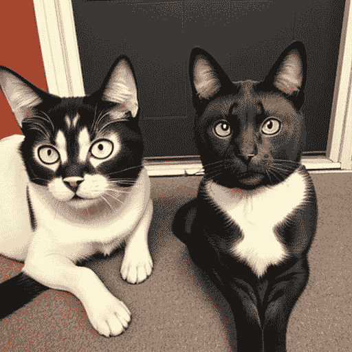
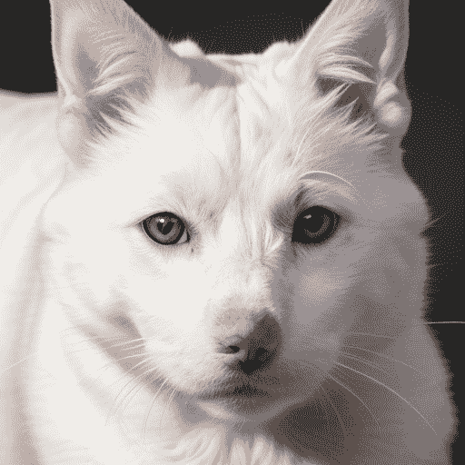

# 12

# 定时提示解析

在[*第10章*](B21263_10.xhtml#_idTextAnchor197)中，我们讨论了如何解锁77个令牌的提示限制以及启用提示权重的解决方案，这为本章铺平了道路。凭借[*第10章*](B21263_10.xhtml#_idTextAnchor197)中的知识，我们可以利用自然语言和权重格式生成各种类型的图像。然而，Hugging Face Diffusers包的现成代码中存在一些固有的限制。

例如，我们不能编写一个提示来要求Stable Diffusion在前五步生成一只猫，然后在接下来的五步生成一只狗。同样，我们也不能编写一个提示来要求Stable Diffusion通过交替去噪两个概念来实现两个概念的混合。

在本章中，我们将探讨以下主题中的两种解决方案：

+   使用Compel包

+   构建自定义定时提示管道

# 技术要求

要开始本章中的代码，您需要安装运行Stable Diffusion所需的必要包。有关如何设置这些包的详细说明，请参阅[*第2章*](B21263_02.xhtml#_idTextAnchor037)。

除了Stable Diffusion所需的包之外，您还需要为*使用Compel包*部分安装`Compel`包，以及为*构建自定义定时提示* *管道*部分安装`lark`包。

我将提供在每个部分中安装和使用这些包的逐步说明。

# 使用Compel包

Compel [1] 是由Damian Stewart开发和维护的一个开源文本提示权重和混合库。它是使Diffusers中的提示混合变得最容易的方法之一。此包还具有对提示应用权重的功能，类似于我们在[*第10章*](B21263_10.xhtml#_idTextAnchor197)中实现的解决方案，但具有不同的权重语法。在本章中，我将介绍可以帮助我们编写生成具有两个或更多概念混合的图像的提示的混合功能。

假设我们想要创建一张半猫半狗的照片。我们如何使用提示来完成？让我们假设我们只是给Stable Diffusion以下提示：

```py
A photo with half cat and half dog
```

这里是Python代码行（不使用Compel）：

```py
import torch
from diffusers import StableDiffusionPipeline
pipeline = StableDiffusionPipeline.from_pretrained(
    "stablediffusionapi/deliberate-v2",
    torch_dtype = torch.float16,
    safety_checker = None
).to("cuda:0")
image = pipeline(
    prompt = "A photo with half cat and half dog",
    generator = torch.Generator("cuda:0").manual_seed(3)
).images[0]
image
```

您将看到*图12.1*所示的结果：



图12.1：半猫半狗照片提示的结果

单词`half`应该应用于照片本身，而不是图像。在这种情况下，我们可以使用Compel来帮助生成一个混合猫和狗的文本嵌入。

在导入`Compel`包之前，我们需要安装该包：

```py
pip install compel
```

注意，`Compel` 包之所以能与 Diffusers 一起使用，是因为该包使用 `tokenizer`（类型：`transformers.models.clip.tokenization_clip.CLIPTokenizer`）和 `text_encoder`（类型：`transformers.models.clip.modeling_clip.CLIPTextModel`）从 Stable Diffusion 模型文件生成文本嵌入。我们也应该在初始化 `Compel` 对象时意识到这一点：

```py
from comp
compel = Compel(
    tokenizer = pipeline.tokenizer,
    text_encoder = pipeline.text_encoder
)
```

`pipeline`（类型：`StableDiffusionPipeline`）是我们刚刚创建的 Stable Diffusion 管道。接下来，使用以下格式创建一个混合提示：

```py
prompt = '("A photo of cat", "A photo of dog").blend(0.5, 0.5)'
prompt_embeds = compel(prompt)
```

然后，通过 `prompt_embeds` 参数将文本嵌入输入到 Stable Diffusion 管道中：

```py
image = pipeline(
    prompt_embeds = prompt_embeds,
    generator = torch.Generator("cuda:0").manual_seed(1)
).images[0]
image
```

我们将看到一只看起来像猫也像狗的宠物，如图 *图 12*.2 所示：


图 12.2：使用 Compel 混合的图片 – 一半猫，一半狗

我们可以改变混合的命题数量，以获得更多 `猫` 或更多 `狗`。让我们将提示更改为以下内容：

```py
prompt = '("A photo of cat", "A photo of dog").blend(0.7, 0.3)'
```

我们将得到一张稍微更像猫的图片，如图 *图 12*.3 所示：


图 12.3：使用 Compel 混合猫和狗的图片 – 70% 猫，30% 狗

Compel 可以做的不仅仅是提示混合；它还可以提供 `加权` 和 `和` 连接提示。您可以在其语法功能 [2] 文档中探索更多使用示例和功能。

虽然使用 Compel 混合提示很容易，就像我们在前面的例子中看到的那样，但以下这种混合提示在日常使用中既奇怪又难以理解：

```py
prompt = '("A photo of cat", "A photo of dog").blend(0.7, 0.3)'
```

在我对 Compel 仓库中的示例代码进行初步审查时，我对以下行感到好奇：`("A photo of cat", "A photo of dog").blend(0.7, 0.3)`。这行代码引发了一些问题，例如 `blend()` 函数是如何调用的？然而，很明显，`blend()` 是提示字符串的一部分，而不是可以在 Python 代码中调用的函数。

相比之下，Stable Diffusion WebUI [3] 的提示混合或计划功能相对更易于用户使用。语法允许我们使用如下提示语法达到相同的混合效果：

```py
[A photo of cat:A photo of dog:0.5]
```

在 Stable Diffusion WebUI 中的此计划提示将在步骤的前 50% 生成一张猫的图片，在步骤的最后 50% 生成一张狗的图片。

或者，您可以使用 `|` 运算符来交替提示：

```py
[A photo of cat|A photo of dog]
```

上述计划提示将在渲染猫和狗的图片之间交替。换句话说，它将在一个步骤中渲染一张猫的图片，在下一个步骤中渲染一张狗的图片，并继续这种模式，直到整个渲染过程的结束。

这两个调度功能也可以通过 Diffusers 实现。在下一节中，我们将探讨如何为 Diffusers 实现这两个高级提示调度功能。

# 构建自定义计划提示管道

正如我们在 [*第五章*](B21263_05.xhtml#_idTextAnchor097) 中讨论的那样，生成过程利用输入提示嵌入在每个步骤中去噪图像。默认情况下，每个去噪步骤都使用完全相同的嵌入。然而，为了获得更精确的生成控制，我们可以修改管道代码以为每个去噪步骤提供唯一的嵌入。

以以下提示为例：

```py
[A photo of cat:A photo of dog:0.5]
```

在总共 10 个去噪步骤中，我们希望管道能在前 5 步去除噪声以揭示 `A photo of cat`，在接下来的 5 步去除噪声以揭示 `A photo of dog`。为了实现这一点，我们需要实现以下组件：

+   一个能够从提示中提取调度号的提示解析器

+   一种将提示嵌入并创建与步骤数量相匹配的提示嵌入列表的方法

+   一个从 Diffusers 管道派生的新 `pipeline` 类，使我们能够将我们的新功能集成到管道中，同时保留 Diffusers 管道的所有现有功能

接下来，让我们实现格式化的提示解析器。

## 一个计划好的提示解析器

开源 Stable Diffusion WebUI 项目的源代码显示，我们可以使用 `lark` [4] – 一个 Python 的解析工具包。我们还将使用 `lark` 包来解析我们自己的提示解析器的计划提示。

要安装 `lark`，请运行以下命令：

```py
pip install -U lark
```

与 Stable Diffusion WebUI 兼容的提示定义在以下代码中：

```py
import lark
schedule_parser = lark.Lark(r"""
!start: (prompt | /[][():]/+)*
prompt: (emphasized | scheduled | alternate | plain | WHITESPACE)*
!emphasized: "(" prompt ")"
        | "(" prompt ":" prompt ")"
        | "[" prompt "]"
scheduled: "[" [prompt ":"] prompt ":" [WHITESPACE] NUMBER "]"
alternate: "[" prompt ("|" prompt)+ "]"
WHITESPACE: /\s+/
plain: /([^\\\[\]():|]|\\.)+/
%import common.SIGNED_NUMBER -> NUMBER
""")
```

如果你决定深入语法沼泽，完全理解定义中的每一行，那么 `lark` 文档 [5] 是你该去的地方。

接下来，我们将使用来自 SD WebUI 代码库的 Python 函数。此函数使用 Lark `schedule_parser` 语法定义来解析输入提示：

```py
def get_learned_conditioning_prompt_schedules(prompts, steps):
    def collect_steps(steps, tree):
        l = [steps]
        class CollectSteps(lark.Visitor):
            def scheduled(self, tree):
                tree.children[-1] = float(tree.children[-1])
                if tree.children[-1] < 1:
                    tree.children[-1] *= steps
                tree.children[-1] = min(steps, int(tree.children[-1]))
                l.append(tree.children[-1])
            def alternate(self, tree):
                l.extend(range(1, steps+1))
        CollectSteps().visit(tree)
        return sorted(set(l))
    def at_step(step, tree):
        class AtStep(lark.Transformer):
            def scheduled(self, args):
                before, after, _, when = args
                yield before or () if step <= when else after
            def alternate(self, args):
                yield next(args[(step - 1)%len(args)])
            def start(self, args):
                def flatten(x):
                    if type(x) == str:
                        yield x
                    else:
                        for gen in x:
                            yield from flatten(gen)
                return ''.join(flatten(args))
            def plain(self, args):
                yield args[0].value
            def __default__(self, data, children, meta):
                for child in children:
                    yield child
        return AtStep().transform(tree)
    def get_schedule(prompt):
        try:
            tree = schedule_parser.parse(prompt)
        except lark.exceptions.LarkError as e:
            if 0:
                import traceback
                traceback.print_exc()
            return [[steps, prompt]]
        return [[t, at_step(t, tree)] for t in collect_steps(steps, 
            tree)]
    promptdict = {prompt: get_schedule(prompt) for prompt in 
        set(prompts)}
    return [promptdict[prompt] for prompt in prompts]
```

将总去噪步骤数设置为 10，并为该函数提供一个更短的名字，`g`：

```py
steps = 10
g = lambda p: get_learned_conditioning_prompt_schedules([p], steps)[0]
```

现在，让我们向函数投掷一些提示以查看解析结果：

+   测试 #1: `cat`：

    ```py
    g("cat")
    ```

    之前的代码将解析 `cat` 输入文本为以下字符串：

    ```py
    [[10, 'cat']]
    ```

    结果表明所有 10 个步骤都将使用 `cat` 生成图像。

+   测试 #2: `[cat:dog:0.5]`：

    将提示更改为 `[cat:dog:0.5]`：

    ```py
    g('[cat:dog:0.5]')
    ```

    函数将生成以下结果：

    ```py
    [[5, 'cat'], [10, 'dog']]
    ```

    结果意味着前 5 步使用 `cat`，最后 5 步使用 `dog`。

+   测试 #3: `[cat|dog]`：

    该函数还支持替代调度。将提示更改为 `[cat | dog]`，在两个名称中间有一个“或” `|` 操作符：

    ```py
    g('[cat|dog]')
    ```

    提示解析器将生成以下结果：

    ```py
    [[1, 'cat'],
    ```

    ```py
     [2, 'dog'],
    ```

    ```py
     [3, 'cat'],
    ```

    ```py
     [4, 'dog'],
    ```

    ```py
     [5, 'cat'],
    ```

    ```py
     [6, 'dog'],
    ```

    ```py
     [7, 'cat'],
    ```

    ```py
     [8, 'dog'],
    ```

    ```py
     [9, 'cat'],
    ```

    ```py
     [10, 'dog']]
    ```

换句话说，它为每个去噪步骤交替提示。

到目前为止，它在解析方面工作得很好。然而，在将其馈送到管道之前，还需要做一些额外的工作。

## 填补缺失的步骤

在 *测试 #2* 中，生成的结果只包含两个元素。我们需要扩展结果列表以涵盖每个步骤：

```py
def parse_scheduled_prompts(text, steps=10):
    text = text.strip()
    parse_result = None
    try:
        parse_result = get_learned_conditioning_prompt_schedules(
            [text],
            steps = steps
        )[0]
    except Exception as e:
        print(e)
    if len(parse_result) == 1:
        return parse_result
    prompts_list = []
    for i in range(steps):
        current_prompt_step, current_prompt_content = \
            parse_result[0][0],parse_result[0][1]
        step = i + 1
        if step < current_prompt_step:
            prompts_list.append(current_prompt_content)
            continue
        if step == current_prompt_step:
            prompts_list.append(current_prompt_content)
            parse_result.pop(0)
    return prompts_list
```

这个 Python 函数 `parse_scheduled_prompts` 接受两个参数：`text` 和 `steps`（默认值为 10）。该函数处理给定的文本，根据学习到的条件调度生成提示列表。

下面是对函数功能的逐步解释：

1.  使用 `try-except` 块调用 `get_learned_conditioning_prompt_schedules` 函数，传入处理后的文本和指定的步数。结果存储在 `parse_result` 中。如果有异常——比如语法错误，它将被捕获并打印。

1.  如果 `parse_result` 的长度为 1，则将 `parse_result` 作为最终输出返回。

1.  循环遍历步数的范围并执行以下操作：

    1.  从 `parse_result` 获取当前的提示步骤和内容。

    1.  将循环计数器 `i` 增加 `1` 并将其存储在变量 step 中。

    1.  如果 `step` 小于当前的提示步骤，则将当前提示内容添加到 `prompts_list` 并继续到下一个迭代。

    1.  如果 `step` 等于当前的提示步骤，则将当前提示内容添加到 `prompts_list` 并从 `parse_result` 中移除第一个元素。

1.  将 `prompts_list` 作为最终输出返回。

函数本质上基于学习到的条件调度生成提示列表，每个提示根据指定的步数添加到列表中。

让我们调用这个函数来测试它：

```py
prompt_list = parse_scheduled_prompts("[cat:dog:0.5]")
prompt_list
```

我们将得到如下所示的提示列表：

```py
['cat',
 'cat',
 'cat',
 'cat',
 'cat',
 'dog',
 'dog',
 'dog',
 'dog',
 'dog']
```

五个针对 `cat` 的提示和五个针对 `dog` 的提示——每个去噪步骤将使用其中一个提示。

## 支持计划提示的 Stable Diffusion 管道

到目前为止，所有提示都仍然是纯文本形式。我们需要使用自定义嵌入代码将无限和加权提示编码为嵌入，或者我们可以简单地使用 Diffusers 的默认编码器生成嵌入，但有一个 77 个标记的限制。

为了使逻辑更容易和更简洁地跟踪，我们将在此部分使用默认文本编码器。一旦我们弄清楚它是如何工作的，就很容易将其与我们在 [*第 10 章*](B21263_10.xhtml#_idTextAnchor197) 中构建的更强大的编码器交换。

由于我们将对原始 Diffusers Stable Diffusion 管道进行小手术以支持此嵌入列表，操作包括创建一个新的继承自 Diffusers 管道的管道类。我们可以通过以下代码直接重用初始化管道中的分词器和文本编码器：

```py
...
prompt_embeds = self._encode_prompt(
    prompt,
    device,
    num_images_per_prompt,
    do_classifier_free_guidance,
    negative_prompt,
    negative_prompt_embeds=negative_prompt_embeds,
)
...
```

我将在下一部分进一步解释前面的代码。我们将在 `scheduler_call` 函数中实现整个逻辑（类似于 `StableDiffusionPipeline` 的 `__call__` 函数）：

```py
from typing import List, Callable, Dict, Any
from torch import Generator,FloatTensor
from diffusers.pipelines.stable_diffusion import (
    StableDiffusionPipelineOutput)
from diffusers import (
    StableDiffusionPipeline,EulerDiscreteScheduler)
class StableDiffusionPipeline_EXT(StableDiffusionPipeline):
    @torch.no_grad()
    def scheduler_call(
        self,
        prompt: str | List[str] = None,
        height: int | None = 512,
        width: int | None = 512,
        num_inference_steps: int = 50,
        guidance_scale: float = 7.5,
        negative_prompt: str | List[str] | None = None,
        num_images_per_prompt: int | None = 1,
        eta: float = 0,
        generator: Generator | List[Generator] | None = None,
        latents: FloatTensor | None = None,
        prompt_embeds: FloatTensor | None = None,
        negative_prompt_embeds: FloatTensor | None = None,
        output_type: str | None = "pil",
        callback: Callable[[int, int, FloatTensor], None] | None = None,
        callback_steps: int = 1,
        cross_attention_kwargs: Dict[str, Any] | None = None,
    ):
        ...
        # 6\. Prepare extra step kwargs. TODO: Logic should ideally 
        # just be moved out of the pipeline
        extra_step_kwargs = self.prepare_extra_step_kwargs(
            generator, eta)
        # 7\. Denoising loop
        num_warmup_steps = len(timesteps) - num_inference_steps * \
            self.scheduler.order
        with self.progress_bar(total=num_inference_steps) as \
            progress_bar:
            for i, t in enumerate(timesteps):
                # AZ code to enable Prompt Scheduling, 
                # will only function when
                # when there is a prompt_embeds_l provided.
                prompt_embeds_l_len = len(embedding_list)
                if prompt_embeds_l_len > 0:
                    # ensure no None prompt will be used
                    pe_index = (i)%prompt_embeds_l_len
                    prompt_embeds = embedding_list[pe_index]
                # expand the latents if we are doing classifier 
                #free guidance
                latent_model_input = torch.cat([latents] * 2) \
                    if do_classifier_free_guidance else latents
                latent_model_input = self.scheduler. \ 
                    scale_model_input(latent_model_input, t)
                # predict the noise residual
                noise_pred = self.unet(
                    latent_model_input,
                    t,
                    encoder_hidden_states=prompt_embeds,
                    cross_attention_kwargs=cross_attention_kwargs,
                ).sample
                # perform guidance
                if do_classifier_free_guidance:
                    noise_pred_uncond, noise_pred_text = \
                        noise_pred.chunk(2)
                    noise_pred = noise_pred_uncond + guidance_scale * \
                        (noise_pred_text - noise_pred_uncond)
                # compute the previous noisy sample x_t -> x_t-1
                latents = self.scheduler.step(noise_pred, t, latents, 
                    **extra_step_kwargs).prev_sample
                # call the callback, if provided
                if i == len(timesteps) - 1 or ((i + 1) > \
                num_warmup_steps and (i + 1) % \
                self.scheduler.order == 0):
                    progress_bar.update()
                    if callback is not None and i % callback_steps== 0:
                        callback(i, t, latents)
        if output_type == "latent":
            image = latents
        elif output_type == "pil":
            # 8\. Post-processing
            image = self.decode_latents(latents)
            image = self.numpy_to_pil(image)
        else:
            # 8\. Post-processing
            image = self.decode_latents(latents)
        if hasattr(self, "final_offload_hook") and \
            self.final_offload_hook is not None:
            self.final_offload_hook.offload()
        return StableDiffusionPipelineOutput(images=image)
```

这个 Python 函数 `scheduler_call` 是 `StableDiffusionPipeline_EXT` 类的一个方法，该类是 `StableDiffusionPipeline` 的子类。

实现整个逻辑的步骤如下：

1.  将默认调度器设置为 `EulerDiscreteScheduler` 以获得更好的生成结果：

    ```py
    if self.scheduler._class_name == "PNDMScheduler":
    ```

    ```py
        self.scheduler = EulerDiscreteScheduler.from_config(
    ```

    ```py
            self.scheduler.config
    ```

    ```py
        )
    ```

1.  准备 `device` 和 `do_classifier_free_guidance` 参数：

    ```py
    device = self._execution_device
    ```

    ```py
    do_classifier_free_guidance = guidance_scale > 1.0
    ```

1.  调用`parse_scheduled_prompts`函数以获取`prompt_list`提示列表。这是我们在此章节前一部分构建的函数：

    ```py
    prompt_list = parse_scheduled_prompts(prompt)
    ```

1.  如果没有找到计划中的提示，则使用正常的单提示逻辑：

    ```py
    embedding_list = []
    ```

    ```py
    if len(prompt_list) == 1:
    ```

    ```py
        prompt_embeds = self._encode_prompt(
    ```

    ```py
            prompt,
    ```

    ```py
            device,
    ```

    ```py
            num_images_per_prompt,
    ```

    ```py
            do_classifier_free_guidance,
    ```

    ```py
            negative_prompt,
    ```

    ```py
            negative_prompt_embeds=negative_prompt_embeds,
    ```

    ```py
        )
    ```

    ```py
    else:
    ```

    ```py
        for prompt in prompt_list:
    ```

    ```py
            prompt_embeds = self._encode_prompt(
    ```

    ```py
                prompt,
    ```

    ```py
                device,
    ```

    ```py
                num_images_per_prompt,
    ```

    ```py
                do_classifier_free_guidance,
    ```

    ```py
                negative_prompt,
    ```

    ```py
                negative_prompt_embeds=negative_prompt_embeds,
    ```

    ```py
            )
    ```

    ```py
            embedding_list.append(prompt_embeds)
    ```

    在*步骤4*中，函数处理输入提示以生成提示嵌入。输入提示可以是一个字符串或字符串列表。函数首先将输入提示（s）解析为名为`prompt_list`的列表。如果列表中只有一个提示，则函数直接使用`_encode_prompt`方法编码提示并将其结果存储在`prompt_embeds`中。如果有多个提示，则函数遍历`prompt_list`并使用`_encode_prompt`方法分别编码每个提示。生成的嵌入存储在`embedding_list`中。

1.  准备扩散过程的timesteps：

    ```py
    self.scheduler.set_timesteps(num_inference_steps, device=device)
    ```

    ```py
    timesteps = self.scheduler.timesteps
    ```

1.  准备潜在变量以初始化`latents`张量（这是一个PyTorch张量）：

    ```py
    num_channels_latents = self.unet.in_channels
    ```

    ```py
    batch_size = 1
    ```

    ```py
    latents = self.prepare_latents(
    ```

    ```py
        batch_size * num_images_per_prompt,
    ```

    ```py
        num_channels_latents,
    ```

    ```py
        height,
    ```

    ```py
        width,
    ```

    ```py
        prompt_embeds.dtype,
    ```

    ```py
        device,
    ```

    ```py
        generator,
    ```

    ```py
        latents,
    ```

    ```py
    )
    ```

1.  实现去噪循环：

    ```py
    num_warmup_steps = len(timesteps) - num_inference_steps * \ 
    ```

    ```py
        self.scheduler.order
    ```

    ```py
    with self.progress_bar(total=num_inference_steps) as \ 
    ```

    ```py
        progress_bar:
    ```

    ```py
        for i, t in enumerate(timesteps):
    ```

    ```py
            # custom code to enable Prompt Scheduling, 
    ```

    ```py
            # will only function when
    ```

    ```py
            # when there is a prompt_embeds_l provided.
    ```

    ```py
            prompt_embeds_l_len = len(embedding_list)
    ```

    ```py
            if prompt_embeds_l_len > 0:
    ```

    ```py
                # ensure no None prompt will be used
    ```

    ```py
                pe_index = (i)%prompt_embeds_l_len
    ```

    ```py
                prompt_embeds = embedding_list[pe_index]
    ```

    ```py
            # expand the latents if we are doing 
    ```

    ```py
            # classifier free guidance
    ```

    ```py
            latent_model_input = torch.cat([latents] * 2) 
    ```

    ```py
                if do_classifier_free_guidance else latents
    ```

    ```py
            latent_model_input = 
    ```

    ```py
                self.scheduler.scale_model_input(
    ```

    ```py
                    latent_model_input, t)
    ```

    ```py
            # predict the noise residual
    ```

    ```py
            noise_pred = self.unet(
    ```

    ```py
                latent_model_input,
    ```

    ```py
                t,
    ```

    ```py
                encoder_hidden_states=prompt_embeds,
    ```

    ```py
                cross_attention_kwargs=cross_attention_kwargs,
    ```

    ```py
            ).sample
    ```

    ```py
            # perform guidance
    ```

    ```py
            if do_classifier_free_guidance:
    ```

    ```py
                noise_pred_uncond, noise_pred_text = \
    ```

    ```py
                    noise_pred.chunk(2)
    ```

    ```py
                noise_pred = noise_pred_uncond + guidance_scale * \
    ```

    ```py
                    (noise_pred_text - noise_pred_uncond)
    ```

    ```py
            # compute the previous noisy sample x_t -> x_t-1
    ```

    ```py
            latents = self.scheduler.step(noise_pred, t, 
    ```

    ```py
                latents).prev_sample
    ```

    ```py
            # call the callback, if provided
    ```

    ```py
            if i == len(timesteps) - 1 or ((i + 1) > 
    ```

    ```py
                num_warmup_steps and (i + 1) % 
    ```

    ```py
                self.scheduler.order == 0):
    ```

    ```py
                progress_bar.update()
    ```

    ```py
                if callback is not None and i % callback_steps == 0:
    ```

    ```py
                    callback(i, t, latents)
    ```

    在*步骤7*中，去噪循环遍历扩散过程的timesteps。如果启用了提示调度（即`embedding_list`中有多个提示嵌入），则函数选择当前timestep的适当提示嵌入。`embedding_list`的长度存储在`prompt_embeds_l_len`中。如果`prompt_embeds_l_len`大于`0`，则表示启用了提示调度。函数使用模运算符（`%`）计算当前timestep `i`的`pe_index`索引。这确保了索引在`embedding_list`的长度上循环，并选择当前timestep的适当提示嵌入。选定的提示嵌入随后分配给`prompt_embeds`。

1.  最后一步是去噪后处理：

    ```py
    image = self.decode_latents(latents)
    ```

    ```py
    image = self.numpy_to_pil(image)
    ```

    ```py
    return StableDiffusionPipelineOutput(images=image, 
    ```

    ```py
        nsfw_content_detected=None)
    ```

    在最后一步，我们通过调用`decode_latents()`函数将图像数据从潜在空间转换为像素空间。在这里使用`StableDiffusionPipelineOutput`类是为了在从管道返回输出时保持一致的结构。我们在这里使用它来使我们的管道与Diffusers管道兼容。你还可以在与此章节相关的代码文件中找到完整的代码。

    如果你还在这里，恭喜你！让我们执行它以见证结果：

    ```py
    pipeline = StableDiffusionPipeline_EXT.from_pretrained(
    ```

    ```py
        "stablediffusionapi/deliberate-v2",
    ```

    ```py
        torch_dtype = torch.float16,
    ```

    ```py
        safety_checker = None
    ```

    ```py
    ).to("cuda:0")
    ```

    ```py
    prompt = "high quality, 4k, details, A realistic photo of cute \ [cat:dog:0.6]"
    ```

    ```py
    neg_prompt = "paint, oil paint, animation, blur, low quality, \ bad glasses"
    ```

    ```py
    image = pipeline.scheduler_call(
    ```

    ```py
        prompt = prompt,
    ```

    ```py
        negative_prompt = neg_prompt,
    ```

    ```py
        generator = torch.Generator("cuda").manual_seed(1)
    ```

    ```py
    ).images[0]
    ```

    ```py
    image
    ```

我们应该看到*图12.4*中所示的照片：


图12.4：使用自定义计划提示管道混合了60%的猫和40%的狗的照片

这里还有一个例子，使用替代提示`[猫|狗]`：

```py
prompt = "high quality, 4k, details, A realistic photo of white \
[cat|dog]"
neg_prompt = "paint, oil paint, animation, blur, low quality, bad \
glasses"
image = pipeline.scheduler_call(
    prompt = prompt,
    negative_prompt = neg_prompt,
    generator = torch.Generator("cuda").manual_seed(3)
).images[0]
image
```

我们的替代提示给出了类似于*图12.5*的照片：



图12.5：使用我们自定义计划提示管道的替代提示调度混合猫和狗的照片

如果您看到了如*图12.4*和*图12.5*所示的半猫半狗的图像生成，那么您已经成功构建了您自定义的提示调度器。

# 摘要

在本章中，我们介绍了两种进行计划提示图像生成的解决方案。第一种解决方案，`Compel`包，是使用起来最简单的一个。只需安装该包，您就可以使用其提示混合功能在一个提示中混合两个或更多概念。

第二种解决方案是一个定制的管道，它首先解析提示字符串，并为每个去噪步骤准备一个提示列表。自定义管道遍历提示列表以创建一个嵌入列表。最后，`scheduler_call`函数使用嵌入列表中的提示嵌入来生成具有精确控制的图像。

如果您成功实现了自定义的计划管道，您就可以以更精确的方式控制生成。说到控制，在[*第13章*](B21263_13.xhtml#_idTextAnchor257)中，我们将探讨另一种控制图像生成的方法——ControlNet。

# 参考文献

1.  Compel：[https://github.com/damian0815/compel](https://github.com/damian0815/compel)

1.  Compel语法特性：[https://github.com/damian0815/compel/blob/main/doc/syntax.md](https://github.com/damian0815/compel/blob/main/doc/syntax.md)

1.  稳定扩散WebUI提示编辑：[https://github.com/AUTOMATIC1111/stable-diffusion-webui/wiki/Features#prompt-editing](https://github.com/AUTOMATIC1111/stable-diffusion-webui/wiki/Features#prompt-editing)

)

1.  Lark - Python的解析工具包：[https://github.com/lark-parser/lark](https://github.com/lark-parser/lark)

1.  Lark使用文档：[https://lark-parser.readthedocs.io/en/stable/](https://lark-parser.readthedocs.io/en/stable/)

# 第3部分 - 高级主题

在第1部分和第2部分中，我们为稳定扩散奠定了坚实的基础，涵盖了其基础知识、定制选项和优化技术。现在，是时候探索更高级的领域了，我们将探讨尖端应用、创新模型和专家级策略来生成卓越的视觉内容。

本部分中的章节将带您踏上一段激动人心的旅程，探索稳定扩散的最新发展。您将学习如何使用ControlNet以前所未有的控制力生成图像，使用AnimateDiff制作吸引人的视频，以及使用BLIP-2和LLaVA等强大的视觉语言模型从图像中提取有洞察力的描述。此外，您还将了解稳定扩散XL，这是稳定扩散模型的一个更新、更强大的迭代版本。

为了锦上添花，我们将深入探讨为稳定的扩散制作优化提示的艺术，包括编写有效提示的技术以及利用大型语言模型来自动化流程。在本部分结束时，你将具备处理复杂项目、拓展稳定的扩散边界和开启新的创意可能性的专业知识。准备好释放你的全部潜力，创造出令人叹为观止的结果！

本部分包含以下章节：

+   [*第13章*](B21263_13.xhtml#_idTextAnchor257)*，使用ControlNet生成图像*

+   [*第14章*](B21263_14.xhtml#_idTextAnchor277)*，使用稳定的扩散生成视频*

+   [*第15章*](B21263_15.xhtml#_idTextAnchor289)*，使用BLIP-2和LLaVA生成图像描述*

+   [*第16章*](B21263_16.xhtml#_idTextAnchor309)*，探索稳定的扩散XL*

+   [*第17章*](B21263_17.xhtml#_idTextAnchor335)*，构建针对稳定的扩散的优化提示*
