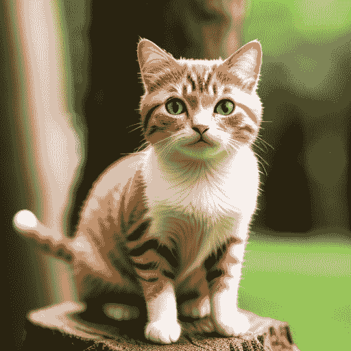
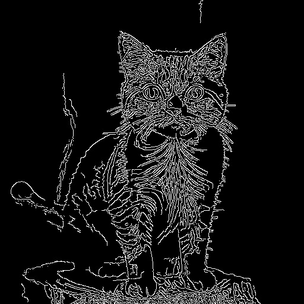
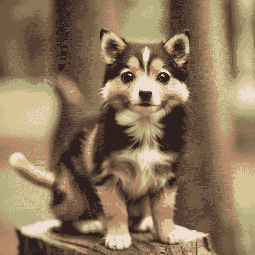
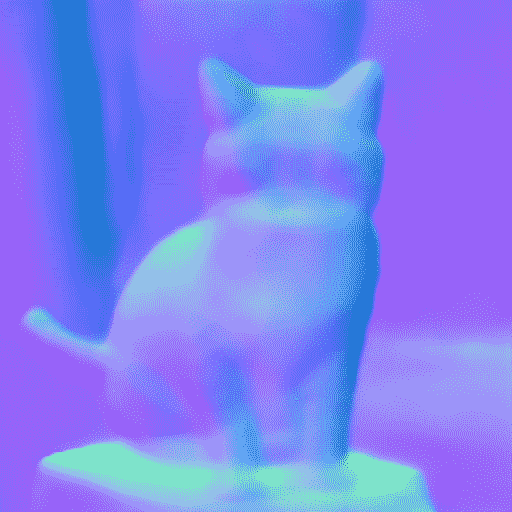
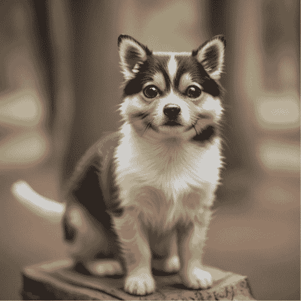
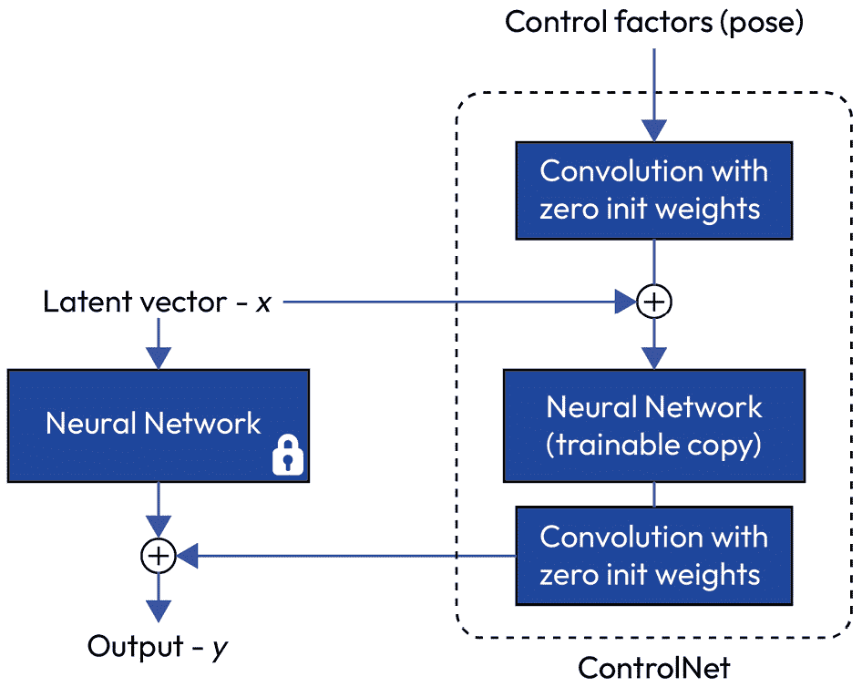
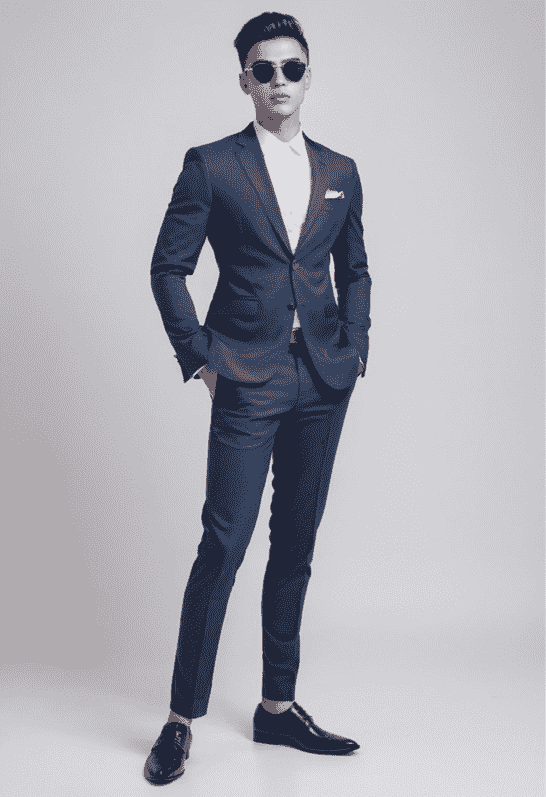
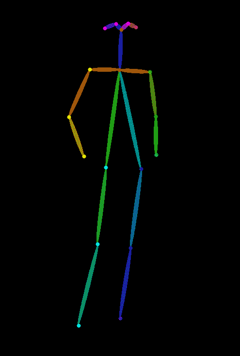
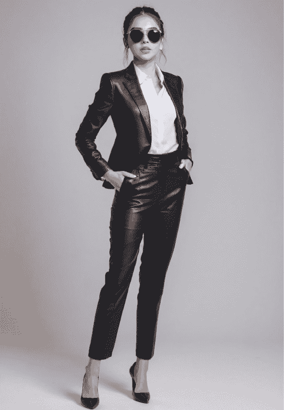

# 使用 ControlNet 生成图像

Stable Diffusion 的 ControlNet 是一个神经网络插件，允许你通过添加额外条件来控制扩散模型。它首次在 2023 年由 Zhang Lvmin 和 Maneesh Agrawala 发表的论文《Adding Conditional Control to Text-to-Image Diffusion Models [1]》中介绍。

本章将涵盖以下主题：

+   什么是 ControlNet 以及它与其他方法有何不同？

+   ControlNet 的使用方法

+   在一个管道中使用多个 ControlNet

+   ControlNet 的工作原理

+   更多 ControlNet 使用方法

到本章结束时，你将了解 ControlNet 的工作原理以及如何使用 Stable Diffusion V1.5 和 Stable Diffusion XL ControlNet 模型。

# 什么是 ControlNet 以及它与其他方法有何不同？

在“控制”方面，你可能还记得文本嵌入、LoRA 和图像到图像的扩散管道。但是什么让 ControlNet 不同且有用？

与其他解决方案不同，ControlNet 是一个直接在 UNet 扩散过程中工作的模型。我们在 *表 13.1* 中比较了这些解决方案：

| **控制方法** | **工作阶段** | **使用场景** |
| --- | --- | --- |
| 文本嵌入 | 文本编码器 | 添加新的风格、新的概念或新的面孔 |
| LoRA | 将 LoRA 权重合并到 UNet 模型（以及可选的 CLIP 文本编码器） | 添加一组风格、概念并生成内容 |
| 图像到图像 | 提供初始潜在图像 | 修复图像，或向图像添加风格和概念 |
| ControlNet | ControlNet 参与者与检查点模型 UNet 一起去噪 | 控制形状、姿势、内容细节 |

表 13.1：文本嵌入、LoRA、图像到图像和 ControlNet 的比较

在许多方面，ControlNet 与我们讨论过的图像到图像管道类似，如 [*第 11 章*](B21263_11.xhtml#_idTextAnchor214)。图像到图像和 ControlNet 都可以用来增强图像。

然而，ControlNet 可以以更精确的方式“控制”图像。想象一下，你想要生成一个使用另一张图像中的特定姿势或完美对齐场景中的物体到特定参考点的图像。这种精度是使用现成的 Stable Diffusion 模型无法实现的。ControlNet 是帮助你实现这些目标的工具。

此外，ControlNet 模型与其他所有开源检查点模型兼容，而一些其他解决方案仅与作者提供的单个基础模型兼容。创建 ControlNet 的团队不仅开源了模型，还开源了训练新模型的代码。换句话说，我们可以训练一个 ControlNet 模型，使其与其他任何模型一起工作。这正是原始论文 [1] 中所说的：

由于 Stable Diffusion 是一个典型的 UNet 结构，这种 ControlNet 架构可能适用于其他模型。

注意，ControlNet 模型只能与使用相同基础模型的模型一起工作。一个 **Stable Diffusion** (**SD**) v1.5 ControlNet 模型可以与所有其他 SD v1.5 模型一起工作。对于 **Stable Diffusion XL** (**SDXL**) 模型，我们需要一个经过 SDXL 训练的 ControlNet 模型。这是因为 SDXL 模型使用不同的架构，比 SD v1.5 的 UNet 更大。没有额外的工作，一个 ControlNet 模型只能与这种类型的模型一起工作。

我使用“*没有额外工作*”是因为在 2023 年 12 月，为了弥合这一差距，Lingmin Ran 等人发表了一篇名为 *X-Adapter: Adding Universal Compatibility of Plugins for Upgraded Diffusion Model* 的论文 [8]。这篇论文详细介绍了适配器，使我们能够在新 SDXL 模型中使用 SD V1.5 LoRA 和 ControlNet。

接下来，让我们开始使用 SD 模型结合 ControlNet。

# 使用 ControlNet 的方法

在深入探讨 ControlNet 的后端之前，在本节中，我们将开始使用 ControlNet 来帮助控制图像生成。

在以下示例中，我们将首先使用 SD 生成一个图像，获取对象的 Canny 形状，然后使用 Canny 形状在 ControlNet 的帮助下生成一个新的图像。

注意

Canny 图像指的是经过 Canny 边缘检测的图像，这是一种流行的边缘检测算法。它由 John F. Canny 在 1986 年开发。[7]

让我们使用以下代码使用 SD 生成一个图像：

1.  使用 SD 生成样本图像：

    ```py
    import torch
    ```

    ```py
    from diffusers import StableDiffusionPipeline
    ```

    ```py
    # load model
    ```

    ```py
    text2img_pipe = StableDiffusionPipeline.from_pretrained(
    ```

    ```py
        "stablediffusionapi/deliberate-v2",
    ```

    ```py
         torch_dtype = torch.float16
    ```

    ```py
    ).to("cuda:0")
    ```

    ```py
    # generate sample image
    ```

    ```py
    prompt = """
    ```

    ```py
    high resolution photo,best quality, masterpiece, 8k
    ```

    ```py
    A cute cat stand on the tree branch, depth of field, detailed body
    ```

    ```py
    """
    ```

    ```py
    neg_prompt = """
    ```

    ```py
    paintings,ketches, worst quality, low quality, normal quality, lowres,
    ```

    ```py
    monochrome, grayscale
    ```

    ```py
    """
    ```

    ```py
    image = text2img_pipe(
    ```

    ```py
        prompt = prompt,
    ```

    ```py
        negative_prompt = neg_prompt,
    ```

    ```py
        generator = torch.Generator("cuda").manual_seed(7)
    ```

    ```py
    ).images[0]
    ```

    ```py
    image
    ```

    我们将看到一只猫的图像，如图 *13*.1* 所示：



图 13.1：由 SD 生成的猫

1.  然后，我们将得到样本图像的 Canny 形状。

    我们需要另一个包，`controlnet_aux`，从图像创建 Canny 图像。只需执行以下两行 `pip` 命令来安装 `controlnet_aux`：

    ```py
    pip install opencv-contrib-python
    ```

    ```py
    pip install controlnet_aux
    ```

    我们可以用三行代码生成图像的 Canny 边缘形状：

    ```py
    from controlnet_aux import CannyDetector
    ```

    ```py
    canny = CannyDetector()
    ```

    ```py
    image_canny = canny(image, 30, 100)
    ```

    以下是代码的分解：

    +   `from controlnet_aux import CannyDetector`：这一行从 `controlnet_aux` 模块导入 `CannyDetector` 类。有许多其他检测器。

    +   `image_canny = canny(image, 30, 100)`：这一行调用 `CannyDetector` 类（实现为一个可调用对象）的 `__call__` 方法，并以下列参数：

        +   `image`：这是将要应用 Canny 边缘检测算法的输入图像。

        +   `30`：这是边缘的下限阈值值。任何强度梯度低于此值的边缘将被丢弃。

        +   `100`：这是边缘的上限阈值值。任何强度梯度高于此值的边缘将被视为强边缘。

    上述代码将生成如图 *13*.2* 所示的 Canny 图像：



图 13.2：猫的 Canny 图像

1.  现在，我们将使用 ControlNet 模型根据这个 Canny 图像生成一个新的图像。首先，让我们加载 ControlNet 模型：

    ```py
    from diffusers import ControlNetModel
    ```

    ```py
    canny_controlnet = ControlNetModel.from_pretrained(
    ```

    ```py
        'takuma104/control_v11',
    ```

    ```py
        subfolder='control_v11p_sd15_canny',
    ```

    ```py
        torch_dtype=torch.float16
    ```

    ```py
    )
    ```

    首次运行时，代码将自动从 Hugging Face 下载 ControlNet 模型。如果您存储中有 ControlNet `safetensors` 模型并想使用自己的模型，您首先需要将文件转换为 diffuser 格式。您可以在[*第 6 章*](B21263_06.xhtml#_idTextAnchor117)中找到转换代码。然后，将 `takuma104/control_v11` 替换为 ControlNet 模型的路径。

1.  初始化一个 ControlNet 管道：

    ```py
    from diffusers import StableDiffusionControlNetImg2ImgPipeline
    ```

    ```py
    cn_pipe = \
    ```

    ```py
        StableDiffusionControlNetImg2ImgPipeline.from_pretrained(
    ```

    ```py
        "stablediffusionapi/deliberate-v2",
    ```

    ```py
        torch_dtype = torch.float16,
    ```

    ```py
        controlnet = canny_controlnet
    ```

    ```py
    )
    ```

    注意，您可以自由地将 `stablediffusionapi/deliberate-v2` 与社区中的任何其他 SD v1.5 模型交换。

1.  使用 ControlNet 管道生成新的图像。在以下示例中，我们将用狗替换猫：

    ```py
    prompt = """
    ```

    ```py
    high resolution photo,best quality, masterpiece, 8k
    ```

    ```py
    A cute dog stand on the tree branch, depth of field, detailed body
    ```

    ```py
    """
    ```

    ```py
    neg_prompt = """
    ```

    ```py
    paintings,ketches, worst quality, low quality, normal quality, lowres,
    ```

    ```py
    monochrome, grayscale
    ```

    ```py
    """
    ```

    ```py
    image_from_canny = single_cn_pipe(
    ```

    ```py
        prompt = prompt,
    ```

    ```py
        negative_prompt = neg_prompt,
    ```

    ```py
        image = canny_image,
    ```

    ```py
        generator = torch.Generator("cuda").manual_seed(2),
    ```

    ```py
        num_inference_steps = 30,
    ```

    ```py
        guidance_scale = 6.0
    ```

    ```py
    ).images[0]
    ```

    ```py
    image_from_canny
    ```

    这些代码行将生成一个遵循 Canny 边缘的新图像，但现在小猫变成了一只狗，如图 *图 13.3* 所示：



图 13.3：使用猫的 Canny 图像和 ControlNet 生成的狗

猫的身体结构和形状得到了保留。您可以随意更改提示和设置，以探索模型的惊人能力。需要注意的是，如果您不向 ControlNet 管道提供提示，管道仍然会输出有意义的图像，可能是另一种风格的猫，这意味着 ControlNet 模型学会了某种 Canny 边缘的潜在含义。

在此示例中，我们只使用了一个 ControlNet 模型，但我们也可以向一个管道提供多个 ControlNet 模型。

# 在一个管道中使用多个 ControlNets

在本节中，我们将初始化另一个 ControlNet，NormalBAE，然后将 Canny 和 NormalBAE ControlNet 模型一起输入以形成一个管道。

让我们生成一个作为额外控制图像的正常 BAE。Normal BAE 是一个使用 Bae 等人提出的正常不确定性方法 [4] 估计正常图的模型：

```py
from controlnet_aux import NormalBaeDetector
normal_bae = \
    NormalBaeDetector.from_pretrained("lllyasviel/Annotators")
image_canny = normal_bae(image)
image_canny
```

此代码将生成原始图像的正常 BAE 映射，如图 *图 13.4* 所示：



图 13.4：生成的猫的正常 BAE 图像

现在，让我们为单个管道初始化两个 ControlNet 模型：一个 Canny ControlNet 模型，另一个 NormalBae ControlNet 模型：

```py
from diffusers import ControlNetModel
canny_controlnet = ControlNetModel.from_pretrained(
    'takuma104/control_v11',
    subfolder='control_v11p_sd15_canny',
    torch_dtype=torch.float16
)
bae_controlnet = ControlNetModel.from_pretrained(
    'takuma104/control_v11',
    subfolder='control_v11p_sd15_normalbae',
    torch_dtype=torch.float16
)
controlnets = [canny_controlnet, bae_controlnet]
```

从代码中，我们可以轻松地看出所有 ControlNet 模型都共享相同的架构。要加载不同的 ControlNet 模型，我们只需更改模型名称。此外，请注意，两个 ControlNet 模型位于 Python `controlnets` `列表` 中。我们可以直接将这些 ControlNet 模型提供给管道，如下所示：

```py
from diffusers import StableDiffusionControlNetPipeline
two_cn_pipe = StableDiffusionControlNetPipeline.from_pretrained(
    "stablediffusionapi/deliberate-v2",
    torch_dtype = torch.float16,
    controlnet = controlnets
).to("cuda")
```

在推理阶段，使用一个额外的参数，`controlnet_conditioning_scale`，来控制每个 ControlNet 的影响范围：

```py
prompt = """
high resolution photo,best quality, masterpiece, 8k
A cute dog on the tree branch, depth of field, detailed body,
"""
neg_prompt = """
paintings,ketches, worst quality, low quality, normal quality, lowres,
monochrome, grayscale
"""
image_from_2cn = two_cn_pipe(
    prompt = prompt,
    image = [canny_image,bae_image],
    controlnet_conditioning_scale = [0.5,0.5],
    generator = torch.Generator("cuda").manual_seed(2),
    num_inference_steps = 30,
    guidance_scale = 5.5
).images[0]
image_from_2cn
```

此代码将给我们另一张图像，如图 *图 13.5* 所示：



图 13.5：由 Canny ControlNet 和正常 BAE ControlNet 生成的狗

在 `controlnet_conditioning_scale = [0.5,0.5]` 中，我为每个 ControlNet 模型赋予一个 `0.5` 的缩放值。这两个缩放值加起来为 `1.0`。我们应该赋予的总权重不超过 `2`。过高的值会导致不期望的图像。例如，如果你给每个 ControlNet 模型赋予 `1.2` 和 `1.3` 的权重，如 `controlnet_conditioning_scale = [1.2,1.3]`，你可能会得到一个不期望的图像。

如果我们成功使用 ControlNet 模型生成图像，我们就共同见证了 ControlNet 的力量。在下一节中，我们将讨论 ControlNet 的工作原理。

# ControlNet 的工作原理

在本节中，我们将深入探讨 ControlNet 的结构，并了解 ControlNet 内部是如何工作的。

ControlNet 通过向神经网络块注入额外的条件来工作。如图 *图 13**.6* 所示，可训练的副本是添加额外指导到原始 SD UNet 块的 ControlNet 块：



图 13.6：添加 ControlNet 组件

在训练阶段，我们取目标层块的一个副本作为 ControlNet 块。在 *图 13**.6* 中，它被标记为 **可训练的副本**。与所有参数使用高斯分布进行典型神经网络初始化不同，ControlNet 使用来自稳定扩散基础模型的预训练权重。这些基础模型参数中的大多数都是冻结的（有选项在以后解冻它们），只有额外的 ControlNet 组件是从头开始训练的。

在训练和推理过程中，输入 x 通常是一个三维向量，x ∈ ℝ h×w×c，其中 h、w、c 分别是高度、宽度和通道数。c 是一个条件向量，我们将将其传递到 SD UNet 和 ControlNet 模型网络中。

**零卷积**在这个过程中起着关键作用。**零卷积**是权重和偏差初始化为零的 1D 卷积。零卷积的优势在于，即使没有进行单个训练步骤，从 ControlNet 注入的值也不会对图像生成产生影响。这确保了辅助网络在任何阶段都不会对图像生成产生负面影响。

你可能会想：如果卷积层的权重为零，梯度不也会为零吗？这难道不会使网络无法学习吗？然而，正如论文的作者解释[5]的那样，实际情况更为复杂。

让我们考虑一个简单的例子：

y = wx + b

然后，我们还有以下情况：

∂ y / ∂ w = x, ∂ y / ∂ x = w, ∂ y / ∂ b = 1

如果 w = 0 且 x ≠ 0，那么我们就有以下情况：

∂ y / ∂ w ≠ 0, ∂ y / ∂ x = 0, ∂ y / ∂ b ≠ 0

这意味着只要 x ≠ 0，一次梯度下降迭代就会使 w 非零。然后，我们有：

∂ y / ∂ x ≠ 0

因此，零卷积将逐渐变成具有非零权重的普通卷积层。多么天才的设计啊！

SD UNet仅在编码器块和中间块与ControlNet连接。可训练的蓝色块和白色零卷积层被添加来构建ControlNet。它简单而有效。

在原始论文——张吕民等人撰写的《向文本到图像扩散模型添加条件控制》[1]中——其作者还提供了一种消融研究，并讨论了许多不同的情况，例如将**零卷积**层替换为**传统卷积**层，并比较了差异。这是一篇优秀的论文，值得一读。

# 进一步使用

在本节中，我们将介绍更多关于ControlNet的使用，涵盖SD V1.5和SDXL。

## 更多带有SD的ControlNets

ControlNet-v1-1-nightly存储库[3]的作者列出了目前可用的所有V1.1 ControlNet模型。在我撰写这一章的时候，列表如下：

```py
control_v11p_sd15_canny
control_v11p_sd15_mlsd
control_v11f1p_sd15_depth
control_v11p_sd15_normalbae
control_v11p_sd15_seg
control_v11p_sd15_inpaint
control_v11p_sd15_lineart
control_v11p_sd15s2_lineart_anime
control_v11p_sd15_openpose
control_v11p_sd15_scribble
control_v11p_sd15_softedge
control_v11e_sd15_shuffle
control_v11e_sd15_ip2p
control_v11f1e_sd15_tile
```

您可以简单地用列表中的一个模型名称替换ControlNet模型名称，然后开始使用它。使用开源ControlNet辅助模型[6]中的一个注释器生成控制图像。

考虑到人工智能领域的发展速度，当你阅读这段内容时，版本可能已增加到v1.1+。然而，底层机制应该是相同的。

## SDXL ControlNets

当我撰写这一章时，SDXL刚刚发布，这个新模型生成的图像质量优秀，且比之前需要更短的提示词。Hugging Face Diffusers团队为XL模型训练并提供了几个ControlNet模型。其使用方法几乎与之前版本相同。在这里，我们将使用`controlnet-openpose-sdxl-1.0`开放姿态ControlNet为SDXL。

注意，您将需要一个具有超过15 GB VRAM的专用GPU来运行以下示例。

使用以下代码初始化一个SDXL管道：

```py
import torch
from diffusers import StableDiffusionXLPipeline
sdxl_pipe = StableDiffusionXLPipeline.from_pretrained(
    "RunDiffusion/RunDiffusion-XL-Beta",
    torch_dtype = torch.float16,
    load_safety_checker = False
)
sdxl_pipe.watermark = None
```

然后，生成一个包含男士的图像：

```py
from diffusers import EulerDiscreteScheduler
prompt = """
full body photo of young man, arms spread
white blank background,
glamour photography,
upper body wears shirt,
wears suit pants,
wears leather shoes
"""
neg_prompt = """
worst quality,low quality, paint, cg, spots, bad hands,
three hands, noise, blur, bad anatomy, low resolution, blur face, bad face
"""
sdxl_pipe.to("cuda")
sdxl_pipe.scheduler = EulerDiscreteScheduler.from_config(
    sdxl_pipe.scheduler.config)
image = sdxl_pipe(
    prompt = prompt,
    negative_prompt = neg_prompt,
    width = 832,
    height = 1216
).images[0]
sdxl_pipe.to("cpu")
torch.cuda.empty_cache()
image
```

代码将生成一个图像，如图*图13.7*所示：



图13.7：由SDXL生成的穿着西装的男士

我们可以使用`controlnet_aux`中的`OpenposeDetector`[6]来提取姿态：

```py
from controlnet_aux import OpenposeDetector
open_pose = \
    OpenposeDetector.from_pretrained("lllyasviel/Annotators")
pose = open_pose(image)
pose
```

我们将获得如图*图13.8*所示的姿态图像：



图13.8：穿着西装的男士姿态图像

现在，让我们使用SDXL ControlNet开放姿态模型启动SDXL管道：

```py
from diffusers import StableDiffusionXLControlNetPipeline
from diffusers import ControlNetModel
sdxl_pose_controlnet = ControlNetModel.from_pretrained(
    "thibaud/controlnet-openpose-sdxl-1.0",
    torch_dtype=torch.float16,
)
sdxl_cn_pipe = StableDiffusionXLControlNetPipeline.from_pretrained(
    "RunDiffusion/RunDiffusion-XL-Beta",
    torch_dtype = torch.float16,
    load_safety_checker = False,
    add_watermarker = False,
    controlnet = sdxl_pose_controlnet
)
sdxl_cn_pipe.watermark = None
```

现在，我们可以使用新的ControlNet管道从姿态图像生成具有相同风格的新的图像。我们将重用提示词，但将**man**替换为**woman**。我们的目标是生成一个穿着西装的女士的新图像，但与之前男士的图像具有相同的姿态：

```py
from diffusers import EulerDiscreteScheduler
prompt = """
full body photo of young woman, arms spread
white blank background,
glamour photography,
wear sunglass,
upper body wears shirt,
wears suit pants,
wears leather shoes
"""
neg_prompt = """
worst quality,low quality, paint, cg, spots, bad hands,
three hands, noise, blur, bad anatomy, low resolution,
blur face, bad face
"""
sdxl_cn_pipe.to("cuda")
sdxl_cn_pipe.scheduler = EulerDiscreteScheduler.from_config(
    sdxl_cn_pipe.scheduler.config)
generator = torch.Generator("cuda").manual_seed(2)
image = sdxl_cn_pipe(
    prompt = prompt,
    negative_prompt = neg_prompt,
    width = 832,
    height = 1216,
    image = pose,
    generator = generator,
    controlnet_conditioning_scale = 0.5,
    num_inference_steps = 30,
    guidance_scale = 6.0
).images[0]
sdxl_cn_pipe.to("cpu")
torch.cuda.empty_cache()
image
```

代码生成一个具有相同姿态的新图像，与预期完全匹配，如图*图13.9*所示：



图13.9：使用SDXL ControlNet生成的穿着西装的女士

我们将在[*第16章*](B21263_16.xhtml#_idTextAnchor309)中进一步讨论Stable Diffusion XL。

# 摘要

在本章中，我们介绍了一种使用SD ControlNets精确控制图像生成的方法。从我们提供的详细示例中，你可以开始使用一个或多个ControlNet模型与SD v1.5以及SDXL一起使用。

我们还深入探讨了ControlNet的内部机制，简要解释了它是如何工作的。

我们可以在许多应用中使用ControlNet，包括将风格应用于图像、将形状应用于图像、将两个图像合并为一个，以及使用摆姿势的图像生成人体。它在许多方面都非常强大且非常有用。我们的想象力是唯一的限制。

然而，还有一个限制：很难在两个生成（具有不同的种子）之间对齐背景和整体上下文。你可能想使用ControlNet从源视频提取的帧生成视频，但结果仍然不理想。

在下一章中，我们将介绍使用SD生成视频和动画的解决方案。

# 参考文献

1.  向文本到图像扩散模型添加条件控制: [https://arxiv.org/abs/2302.05543](https://arxiv.org/abs/2302.05543)

1.  ControlNet v1.0 GitHub仓库: [https://github.com/lllyasviel/ControlNet](https://github.com/lllyasviel/ControlNet)

1.  ControlNet v1.1 GitHub仓库: [https://github.com/lllyasviel/ControlNet-v1-1-nightly](https://github.com/lllyasviel/ControlNet-v1-1-nightly)

1.  `surface_normal_uncertainty`: [https://github.com/baegwangbin/surface_normal_uncertainty](https://github.com/baegwangbin/surface_normal_uncertainty)

1.  零卷积常见问题解答: [https://github.com/lllyasviel/ControlNet/blob/main/docs/faq.md](https://github.com/lllyasviel/ControlNet/blob/main/docs/faq.md)

1.  ControlNet AUX: [https://github.com/patrickvonplaten/controlnet_aux](https://github.com/patrickvonplaten/controlnet_aux)

1.  Canny边缘检测器: [https://en.wikipedia.org/wiki/Canny_edge_detector](https://en.wikipedia.org/wiki/Canny_edge_detector)

1.  X-Adapter：为升级的扩散模型添加插件通用兼容性: [https://showlab.github.io/X-Adapter/](https://showlab.github.io/X-Adapter/)
