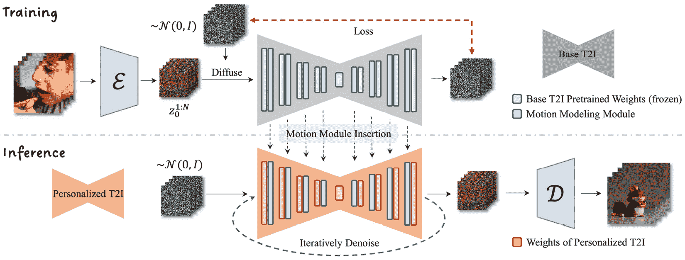

# 14

# 使用稳定扩散生成视频

利用稳定扩散模型的力量，我们可以通过LoRA、文本嵌入和控制网等技术生成高质量的图像。从静态图像的自然发展是动态内容，即视频。我们能否使用稳定扩散模型生成一致的视频？

稳定扩散模型的 UNet 架构虽然对单图处理有效，但在处理多图时缺乏上下文感知能力。因此，使用相同的提示和参数但不同的种子生成相同或持续相关的图像具有挑战性。由于模型本身的随机性引入，生成的图像在颜色、形状或风格上可能存在显著差异。

一个人可能会考虑图像到图像的管道或ControlNet方法，其中视频片段被分割成单个图像，每个图像依次处理。然而，在整个序列中保持一致性，尤其是在应用重大变化（如将真实视频转换为卡通）时，仍然是一个挑战。即使有姿态对齐，输出视频仍可能表现出明显的闪烁。

随着Yuwei Gao及其同事发表的 *AnimateDiff: Animating Your Personalized Text-to-Image Diffusion Models without Specific Tuning* [1] 的出版，取得了突破。这项工作为从文本生成一致图像铺平了道路，从而使得创建短视频成为可能。

本章将探讨以下内容：

+   文本到视频生成的原理

+   AnimateDiff 的实际应用

+   利用 Motion LoRA 控制动画运动

到本章结束时，你将理解视频生成的理论方面、AnimateDiff 的内部工作原理以及为什么这种方法在创建一致和连贯的图像方面是有效的。通过提供的示例代码，你将能够生成一个 16 帧的视频。然后你可以应用 Motion LoRA 来操纵动画的运动。

请注意，本章的结果无法在静态格式如论文或PDF中完全欣赏。为了获得最佳体验，我们鼓励你参与相关的示例代码，运行它，并观察生成的视频。

# 技术要求

本章中，我们将使用 `Diffusers` 库中可用的 `AnimateDiffPipeline` 生成视频。你不需要安装任何额外的工具或包，因为 Diffusers（从版本 0.23.0 开始）提供了所有必需的组件和类。在整个章节中，我将指导你使用这些功能。

要以 MP4 视频格式导出结果，你还需要安装 `opencv-python` 包：

```py
pip install opencv-python
```

此外，请注意，`AnimateDiffPipeline` 生成一个 16 帧 256x256 的视频片段至少需要 8 GB 的 VRAM。

# 文本到视频生成的原理

Stable Diffusion UNet虽然有效于生成单个图像，但由于其缺乏上下文意识，在生成一致图像方面存在不足。研究人员已经提出了克服这一局限性的解决方案，例如从前一或两个帧中结合时间信息。然而，这种方法仍然无法确保像素级一致性，导致连续图像之间存在明显差异，并在生成的视频中产生闪烁。

为了解决这个不一致性问题，AnimateDiff的作者训练了一个分离的运动模型——一个类似于ControlNet模型的零初始化卷积侧模型。进一步地，而不是控制一个图像，运动模型被应用于一系列连续的帧，如图*图14.1*所示：



图14.1：AnimatedDiff的架构

该过程涉及在视频数据集上训练运动建模模块以提取运动先验，同时保持基础Stable Diffusion模型冻结。运动先验是关于运动的知识，以便指导视频的生成或定制。在训练阶段，一个**运动模块**（也称为**运动UNet**）被添加到Stable Diffusion UNet中。与正常的Stable Diffusion V1.5 UNet训练类似，这个运动UNet将同时处理所有帧。我们可以将它们视为来自同一视频片段的一批图像。

例如，如果我们输入一个包含16帧的视频，带有注意力头的运动模块将被训练以考虑所有16帧。如果我们查看实现源代码，`TransformerTemporalModel` [4]是`MotionModules` [3]的核心组件。

在推理过程中，当我们想要生成视频时，将加载运动模块并将其权重合并到Stable Diffusion UNet中。当我们想要生成一个包含16帧的视频时，管道将首先使用高斯噪声——𝒩(0,1)初始化16个随机潜在值。如果没有运动模块，Stable Diffusion UNet将去除噪声并生成16个独立的图像。然而，借助内置的Transformer注意力头的运动模块的帮助，运动UNet试图创建16个相关的帧。你可能想知道，为什么这些图像是相关的？那是因为训练视频中的帧是相关的。在去噪阶段之后，VAE中的解码器D将把16个潜在值转换为像素图像。

运动UNet负责在生成的视频中引入连续帧之间的相关性。它类似于一个图像中不同区域的相关性。这是因为注意力头关注图像的不同部分，并且在训练阶段学习了这些知识。同样，在视频生成过程中，模型在训练阶段学习了帧之间的相关性。

在核心上，这种方法涉及设计一个在连续图像序列上操作的注意力机制。通过学习帧之间的关系，AnimateDiff可以从文本生成更一致和连贯的图像。此外，由于基础Stable Diffusion模型保持锁定状态，各种Stable Diffusion扩展技术，如LoRA、文本嵌入、ControlNet和图像到图像生成，也可以应用于AnimateDiff。

理论上，任何适用于标准Stable Diffusion的东西，也应该适用于AnimateDiff到AnimateDiff。

在进入下一节之前，请注意，AnimateDiff模型生成一个16帧、256x256的视频片段至少需要12 GB的VRAM。为了真正理解这个概念，编写代码来利用AnimateDiff是非常推荐的。现在，让我们使用AnimateDiff生成一个短视频（GIF和MP4格式）。

# AnimateDiff的实际应用

原始的AnimateDiff代码和模型作为一个独立的GitHub仓库[2]发布。虽然作者提供了示例代码和Google Colab来展示结果，但用户仍然需要手动拉取代码并下载模型文件来使用，同时要小心包的版本。

到2023年11月，Dhruv Nair [9] 将AnimateDiff Pipeline合并到Diffusers中，使用户能够在不离开`Diffusers`包的情况下，使用AnimateDiff持久化模型生成视频片段。以下是使用Diffusers中的AnimatedDiff管道的方法：

1.  使用集成的AnimateDiff代码安装这个特定的Diffusers版本：

    ```py
    pip install diffusers==0.23.0
    ```

    在撰写本章时，包含最新AnimateDiff代码的Diffusers版本是0.23.0。通过指定这个版本号，您可以确保示例代码能够顺利且无错误地运行，因为它已经针对这个特定版本进行了测试。

    您还可以尝试安装Diffusers的最新版本，因为到您阅读这篇文档的时候，它可能已经增加了更多功能：

    ```py
    pip install -U diffusers
    ```

1.  加载运动适配器。我们将使用原始论文作者的预训练运动适配器模型：

    ```py
    from diffusers import MotionAdapter
    ```

    ```py
    adapter = MotionAdapter.from_pretrained(
    ```

    ```py
        "guoyww/animatediff-motion-adapter-v1-5-2"
    ```

    ```py
    )
    ```

1.  从基于Stable Diffusion v1.5的检查点模型加载一个AnimateDiff管道：

    ```py
    from diffusers import AnimateDiffPipeline
    ```

    ```py
    pipe = AnimateDiffPipeline.from_pretrained(
    ```

    ```py
        "digiplay/majicMIX_realistic_v6",
    ```

    ```py
        motion_adapter    = adapterm,
    ```

    ```py
        safety_checker    = None
    ```

    ```py
    )
    ```

1.  使用合适的调度器。调度器在生成连贯图像的过程中扮演着重要的角色。作者进行的一项比较研究表明，不同的调度器可以导致不同的结果。实验表明，具有以下设置的`EulerAncestralDiscreteScheduler`调度器可以生成相对较好的结果：

    ```py
    from diffusers import EulerAncestralDiscreteScheduler
    ```

    ```py
    scheduler = EulerAncestralDiscreteScheduler.from_pretrained(
    ```

    ```py
        model_path,
    ```

    ```py
        subfolder         = "scheduler",
    ```

    ```py
        clip_sample       = False,
    ```

    ```py
        timestep_spacing  = "linspace",
    ```

    ```py
        steps_offset      = 1
    ```

    ```py
    )
    ```

    ```py
    pipe.scheduler = scheduler
    ```

    ```py
    pipe.enable_vae_slicing()
    ```

    ```py
    pipe.enable_model_cpu_offload()
    ```

    为了优化VRAM使用，您可以采用两种策略。首先，使用`pipe.enable_vae_slicing()`配置VAE一次解码一帧，从而减少内存消耗。此外，利用`pipe.enable_model_cpu_offload()`将空闲子模型卸载到CPU，进一步降低VRAM使用。

1.  生成连贯的图像：

    ```py
    import torch
    ```

    ```py
    from diffusers.utils import export_to_gif, export_to_video
    ```

    ```py
    prompt = """photorealistic, 1girl, dramatic lighting"""
    ```

    ```py
    neg_prompt = """worst quality, low quality, normal quality, lowres, bad anatomy, bad hands, monochrome, grayscale watermark, moles"""
    ```

    ```py
    #pipe.to("cuda:0")
    ```

    ```py
    output = pipe(
    ```

    ```py
        prompt = prompt,
    ```

    ```py
        negative_prompt = neg_prompt,
    ```

    ```py
        height = 256,
    ```

    ```py
        width = 256,
    ```

    ```py
        num_frames = 16,
    ```

    ```py
        num_inference_steps = 30,
    ```

    ```py
        guidance_scale= 8.5,
    ```

    ```py
        generator = torch.Generator("cuda").manual_seed(7)
    ```

    ```py
    )
    ```

    ```py
    frames = output.frames[0]
    ```

    ```py
    torch.cuda.empty_cache()
    ```

    ```py
    export_to_gif(frames, "animation_origin_256_wo_lora.gif")
    ```

    ```py
    export_to_video(frames, "animation_origin_256_wo_lora.mp4")
    ```

现在，你应该能够看到使用AnimateDiff生成的16帧产生的GIF文件。这个GIF使用了16张256x256的图像。你可以应用在[*第11章*](B21263_11.xhtml#_idTextAnchor214)中介绍的图像超分辨率技术来提升图像并创建一个512x512的GIF。我不会在本章中重复代码。强烈建议利用在[*第11章*](B21263_11.xhtml#_idTextAnchor214)中学到的技能来进一步提高视频生成的质量。

# 利用运动LoRA控制动画运动

除了运动适配器模型之外，论文的作者还介绍了运动LoRA来控制运动风格。运动LoRA与我们[*第8章*](B21263_08.xhtml#_idTextAnchor153)中介绍的相同的LoRA适配器。如前所述，AnimateDiff管道支持所有其他社区共享的LoRA。你可以在作者的Hugging Face仓库 [8] 中找到这些运动LoRA。

这些运动LoRA可以用来控制摄像机视角。在这里，我们将使用放大LoRA – `guoyww/animatediff-motion-lora-zoom-in` – 作为示例。放大将引导模型生成带有放大运动的视频。

使用方法简单，只需额外一行代码：

```py
pipe.load_lora_weights("guoyww/animatediff-motion-lora-zoom-in", 
    adapter_name="zoom-in")
```

这里是完整的生成代码。我们主要重用了上一节中的代码：

```py
import torch
from diffusers.utils import export_to_gif, export_to_video
prompt = """
photorealistic, 1girl, dramatic lighting
"""
neg_prompt = """
worst quality, low quality, normal quality, lowres, bad anatomy, bad hands
, monochrome, grayscale watermark, moles
"""
pipe.to("cuda:0")
pipe.load_lora_weights("guoyww/animatediff-motion-lora-zoom-in", adapter_name="zoom-in")
output = pipe(
    prompt = prompt,
    negative_prompt = neg_prompt,
    height = 256,
    width = 256,
    num_frames = 16,
    num_inference_steps = 40,
    guidance_scale = 8.5,
    generator = torch.Generator("cuda").manual_seed(123)
)
frames = output.frames[0]
pipe.to("cpu")
torch.cuda.empty_cache()
export_to_gif(frames, "animation_origin_256_w_lora_zoom_in.gif")
export_to_video(frames, "animation_origin_256_w_lora_zoom_in.mp4")
```

你应该在同一文件夹下看到一个名为`animation_origin_256_w_lora_zoom_in.gif`的放大GIF剪辑和一个名为`animation_origin_256_w_lora_zoom_in.mp4`的MP4视频剪辑被生成。

# 摘要

每天在社交网络上流传的文本到视频样本的质量和持续时间都在不断提高。很可能在你阅读这一章的时候，本章中提到的技术的功能已经超过了这里所描述的内容。然而，一个不变的是训练模型将注意力机制应用于一系列图像的概念。

在撰写本文时，OpenAI的Sora [9]刚刚发布。这项技术可以根据Transformer Diffusion架构生成高质量的视频。这与AnimatedDiff中使用的方法类似，它结合了Transformer和扩散模型。

AnimatedDiff与众不同的地方在于其开放性和适应性。它可以应用于任何具有相同基础检查点版本的社区模型，这是目前任何其他解决方案都没有提供的功能。此外，论文的作者已经完全开源了代码和模型。

本章主要讨论了文本到图像生成的挑战，然后介绍了AnimatedDiff，解释了它是如何以及为什么能工作的。我们还提供了一个示例代码，展示如何使用Diffusers包中的AnimatedDiff管道在自己的GPU上从16张连贯的图像生成GIF剪辑。

在下一章中，我们将探讨从图像生成文本描述的解决方案。

# 参考文献

1.  郭宇伟，杨策源，饶安毅，王耀辉，乔宇，林大华，戴博，*AnimateDiff：无需特定* *调整* *的个性化文本到图像扩散模型*：[https://arxiv.org/abs/2307.04725](https://arxiv.org/abs/2307.04725)

1.  原始 AnimateDiff 代码仓库：[https://github.com/guoyww/AnimateDiff](https://github.com/guoyww/AnimateDiff)

1.  Diffusers 动作模块实现：[https://github.com/huggingface/diffusers/blob/3dd4168d4c96c429d2b74c2baaee0678c57578da/src/diffusers/models/unets/unet_motion_model.py#L50](https://github.com/huggingface/diffusers/blob/3dd4168d4c96c429d2b74c2baaee0678c57578da/src/diffusers/models/unets/unet_motion_model.py#L50)

)

1.  Hugging Face Diffusers TransformerTemporalModel 实现：[https://github.com/huggingface/diffusers/blob/3dd4168d4c96c429d2b74c2baaee0678c57578da/src/diffusers/models/transformers/transformer_temporal.py#L41](https://github.com/huggingface/diffusers/blob/3dd4168d4c96c429d2b74c2baaee0678c57578da/src/diffusers/models/transformers/transformer_temporal.py#L41)

1.  [4] Dhruv Nair，[https://github.com/DN6](https://github.com/DN6)

1.  AnimateDiff 提案拉取请求：[https://github.com/huggingface/diffusers/pull/5413](https://github.com/huggingface/diffusers/pull/5413)

1.  animatediff-motion-adapter-v1-5-2：[https://huggingface.co/guoyww/animatediff-motion-adapter-v1-5-2](https://huggingface.co/guoyww/animatediff-motion-adapter-v1-5-2)

1.  郭宇伟的 Hugging Face 仓库：[https://huggingface.co/guoyww](https://huggingface.co/guoyww)

1.  视频生成模型作为世界模拟器：[https://openai.com/research/video-generation-models-as-world-simulators](https://openai.com/research/video-generation-models-as-world-simulators)
