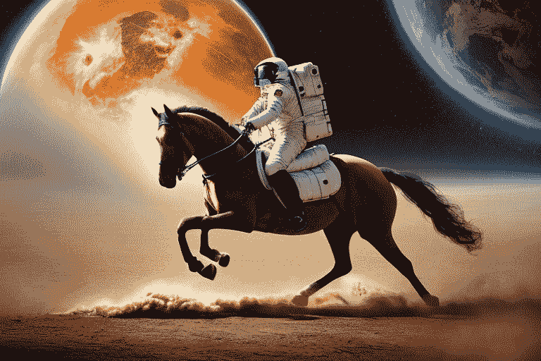
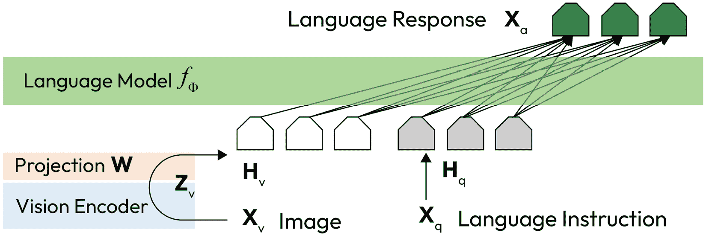

# 15

# 使用BLIP-2和LLaVA生成图像描述

想象一下，你手中有一张图像，需要将其放大或基于它生成新的图像，但你没有与之相关的提示或描述。你可能会说，“好吧，我可以为它编写一个新的提示。”对于一张图像来说，这是可以接受的，但如果有成千上万甚至数百万张没有描述的图像呢？手动编写它们是不可能的。

幸运的是，我们可以使用人工智能（AI）来帮助我们生成描述。有许多预训练模型可以实现这一目标，而且数量总是在增加。在本章中，我将介绍两种AI解决方案来生成图像的标题、描述或提示，全部自动化：

+   BLIP-2：使用冻结图像编码器和大型语言模型进行语言-图像预训练的引导 [1]

+   LLaVA：大型语言和视觉助手 [3]

BLIP-2 [1] 运行速度快，对硬件要求相对较低，而LLaVA [3]（其`llava-v1.5-13b`模型）在撰写本文时是最新的、功能最强大的模型。

到本章结束时，你将能够做到以下事情：

+   通常了解BLIP-2和LLaVA的工作原理

+   编写Python代码以使用BLIP-2和LLaVA从图像生成描述

# 技术要求

在深入探讨BLIP-2和LLaVA之前，让我们使用Stable Diffusion生成一张用于测试的图像。

首先，加载一个`deliberate-v2`模型，但不将其发送到CUDA：

```py
import torch
from diffusers import StableDiffusionPipeline
text2img_pipe = StableDiffusionPipeline.from_pretrained(
    "stablediffusionapi/deliberate-v2",
    torch_dtype = torch.float16
)
```

接下来，在以下代码中，我们首先将模型发送到CUDA并生成图像，然后我们将模型卸载到CPU RAM中，并从CUDA中清除模型：

```py
text2img_pipe.to("cuda:0")
prompt ="high resolution, a photograph of an astronaut riding a horse"
input_image = text2img_pipe(
    prompt = prompt,
    generator = torch.Generator("cuda:0").manual_seed(100),
    height = 512,
    width = 768
).images[0]
text2img_pipe.to("cpu")
torch.cuda.empty_cache()
input_image
```

上述代码将为我们生成与以下图中类似的图像，该图像将在以下章节中使用：



图15.1：由SD v1.5生成的宇航员骑马的图像

现在，让我们开始吧。

# BLIP-2 – 语言-图像预训练的引导

在*BLIP：为统一视觉-语言理解和生成进行语言-图像预训练的引导*论文[4]中，李俊南等人提出了一种弥合自然语言和视觉模态之间差距的解决方案。值得注意的是，BLIP模型在生成高质量图像描述方面表现出卓越的能力，在发布时超越了现有的基准。

其高质量背后的原因是李俊南等人使用了一种创新的技术，从他们的第一个预训练模型中构建了两个模型：

+   过滤模型

+   标题生成模型

过滤模型可以过滤掉低质量的文本-图像对，从而提高训练数据质量，同时其标题生成模型可以为图像生成令人惊讶的好、简短的描述。借助这两个模型，论文的作者不仅提高了训练数据质量，还自动扩大了其规模。然后，他们使用增强的训练数据重新训练 BLIP 模型，结果令人印象深刻。但这是 2022 年的故事。

到 2023 年 6 月，Salesforce 的同一团队推出了新的 BLIP-2。

## BLIP-2 的工作原理

在当时，BLIP 表现良好，但其模型的语言部分仍然相对较弱。**大型语言模型**（**LLMs**）如 OpenAI 的 GPT 和 Meta 的 LLaMA 强大，但训练成本极高。因此，BLIP 团队通过问自己提出了挑战：我们能否使用现成的、预训练的冻结图像编码器和冻结 LLM 进行视觉语言预训练，同时保留它们学习到的表示？

答案是肯定的。BLIP-2 通过引入查询转换器来解决这个问题，该转换器有助于生成与文本标题对应的视觉表示，然后将其输入到冻结的 LLM 中以解码文本描述。

查询转换器，通常被称为 Q-Former [2]，是 BLIP-2 模型的一个关键组件。它充当连接冻结图像编码器和冻结语言大模型（LLM）的桥梁。Q-Former 的主要功能是将一组“查询标记”映射到查询嵌入。这些查询嵌入有助于从图像编码器中提取与给定文本指令最相关的视觉特征。

在 BLIP-2 模型的训练过程中，图像编码器和 LLM 的权重保持冻结。同时，Q-Former 进行训练，使其能够根据特定任务要求进行适应和优化性能。通过使用一组可学习的查询向量，Q-Former 有效地从图像编码器中提炼出有价值的信息，使得语言大模型（LLM）能够基于视觉内容生成准确且上下文适当的响应。

类似的概念也应用于 LLaVA，我们将在后面讨论。BLIP 的核心思想是重用有效的视觉和语言组件，并且只训练一个中间模型来将它们连接起来。

接下来，让我们开始使用 BLIP-2。

## 使用 BLIP-2 生成描述

在 Hugging Face transformers [5] 包的帮助下，使用 BLIP-2 既简单又干净。如果您还没有安装该包，只需运行以下命令来安装或更新到最新版本：

```py
pip install -U transformer
```

然后使用以下代码加载 BLIP-2 模型数据：

```py
from transformers import AutoProcessor, Blip2ForConditionalGeneration
import torch
processor = AutoProcessor.from_pretrained("Salesforce/blip2-opt-2.7b")
# by default `from_pretrained` loads the weights in float32
# we load in float16 instead to save memory
device = "cuda" if torch.cuda.is_available() else "cpu"
model = Blip2ForConditionalGeneration.from_pretrained(
    "Salesforce/blip2-opt-2.7b",
    torch_dtype=torch.float16
).to(device)
```

您的第一次运行将自动从 Hugging Face 模型存储库下载模型权重数据。这可能需要一些时间，所以请耐心等待。下载完成后，运行以下代码以询问 BLIP-2 我们提供的图像：

```py
prompt = "describe the content of the image:"
inputs = processor(
    input_image,
    text=prompt,
    return_tensors="pt"
).to(device, torch.float16)
generated_ids = model.generate(**inputs, max_new_tokens=768)
generated_text = processor.batch_decode(
    generated_ids,
    skip_special_tokens=True
)[0].strip()
print(generated_text)
```

该代码返回描述“太空中的骑马宇航员”，这是好的且准确的。如果我们问背景中有多少颗行星呢？让我们将提示改为“背景中有多少颗行星：”。然后它返回“宇宙比你想象的要大”。这次不够好。

因此，BLIP-2擅长快速生成整个图像的简短描述。然而，要生成更详细的描述或甚至与图像交互，我们可以利用LLaVA的力量。

# LLaVA – 大型语言和视觉助手

如其名称**LLaVA**[3]所示，这个模型不仅在名称上，而且在内部结构上与LLaMA非常接近。LLaVA使用LLaMA作为其语言部分，这使得在需要时可以更换语言模型。这绝对是一个许多场景的杀手特性。Stable Diffusion的一个关键特性是其对模型更换和微调的开放性。与Stable Diffusion类似，LLaVA被设计为利用开源的LLM模型。

接下来，让我们看看LLaVA是如何工作的。

## LLaVA的工作原理

LLaVA的作者，刘浩天等人[3]，展示了一个精美、准确的图表，展示了该模型如何在架构中利用预训练的CLIP和LLaMA模型，如下所示：



图15.2：LLaVA的架构

让我们从下往上阅读这个图表。在推理过程中，我们提供一个表示为Xv的图像和一个表示为Xq的语言指令。视觉编码器是CLIP视觉编码器ViT-L/14[6]。与Stable Diffusion v1.5一样，CLIP也用作其文本编码器。

CLIP模型将图像编码为Zv，投影W是LLaVA提供的模型数据。投影模型将编码后的图像嵌入Zv投影到 Hv 如下：

Hv = W ⋅ Zv

在另一方面，语言指令被编码为CLIP的512维嵌入块。图像和语言嵌入具有相同的维度性。

以这种方式，语言模型fϕ既了解图像又了解语言！这种方法与Stable Diffusion的文本反转技术有一些相似之处，既轻量又强大。

接下来，让我们编写一些代码来指导LLaVA与图像交互。

## 安装LLaVA

为了获得最佳体验，强烈建议在Linux机器上使用LLaVA。在Windows上使用可能会导致意外缺失组件。还建议为使用LLaVA建立Python虚拟环境。在[*第2章*](B21263_02.xhtml#_idTextAnchor037)中提供了设置Python虚拟环境的详细步骤和命令。

将LLaVA仓库克隆到本地文件夹：

```py
git clone https://github.com/haotian-liu/LLaVA.git
cd LLaVA
```

然后通过运行以下命令安装LLaVA：

```py
pip install -U .
```

接下来，从Hugging Face模型仓库下载模型文件：

```py
# Make sure you have git-lfs installed (https://git-lfs.com)
git lfs install
git clone https://huggingface.co/liuhaotian/llava-v1.5-7b
```

请注意，模型文件很大，下载需要一些时间。在编写本章时，您也可以通过将前面代码片段中的 `7` 更改为 `13` 来下载 13B 模型，以使用 13B LLaVA 模型。

设置到此结束。现在，让我们继续编写 Python 代码。

## 使用 LLaVA 生成图像描述

由于我们刚刚安装了 LLaVA，我们可以参考以下相关模块：

```py
from llava.constants import (
    IMAGE_TOKEN_INDEX,
    DEFAULT_IMAGE_TOKEN,
    DEFAULT_IM_START_TOKEN,
    DEFAULT_IM_END_TOKEN
)
from llava.conversation import (
    conv_templates, SeparatorStyle
)
from llava.model.builder import load_pretrained_model
from llava.mm_utils import (
    process_images,
    tokenizer_image_token,
    get_model_name_from_path,
    KeywordsStoppingCriteria
)
```

加载 `tokenizer`、`image_processor` 和 `model` 组件。`tokenizer` 将文本转换为标记 ID，`image_processor` 将图像转换为张量，而 `model` 是我们将用于生成输出的管道：

```py
# load up tokenizer, model, image_processor
model_path = "/path/to/llava-v1.5-7b"
model_name = get_model_name_from_path(model_path)
conv_mode = "llava_v1"
tokenizer, model, image_processor, _ = load_pretrained_model(
    model_path = model_path,
    model_base = None,
    model_name = model_name,
    load_4bit = True,
    device = "cuda",
    device_map = {'':torch.cuda.current_device()}
)
```

以下是对前面代码的分解：

+   `model_path`：此路径指向存储预训练模型的文件夹。

+   `model_base`：此参数设置为 `None`，表示未指定特定的父架构。

+   `model_name`：预训练模型的名称（`llava-v1.5`）。

+   `load_4bit`：如果设置为 `True`，则在推理过程中启用 4 位量化。这可以减少内存使用并提高速度，但可能会略微影响结果的品质。

+   `device`：此参数指定 CUDA 作为计算发生的设备。

+   `device_map`：此参数用于将 GPU 设备映射到模型的各个部分，如果您想将工作负载分配到多个 GPU 上。由于此处只映射了一个设备，这意味着将执行单 GPU 运行。

现在，让我们创建图像描述：

1.  创建一个 `conv` 对象以保存对话历史：

    ```py
    # start a new conversation
    ```

    ```py
    user_input = """Analyze the image in a comprehensive and detailed manner"""
    ```

    ```py
    conv = conv_templates[conv_mode].copy()
    ```

1.  将图像转换为张量：

    ```py
    # process image to tensor
    ```

    ```py
    image_tensor = process_images(
    ```

    ```py
        [input_image],
    ```

    ```py
        image_processor,
    ```

    ```py
        {"image_aspect_ratio":"pad"}
    ```

    ```py
    ).to(model.device, dtype=torch.float16)
    ```

1.  将图像占位符添加到对话中：

    ```py
    if model.config.mm_use_im_start_end:
    ```

    ```py
        inp = DEFAULT_IM_START_TOKEN + DEFAULT_IMAGE_TOKEN + \
    ```

    ```py
            DEFAULT_IM_END_TOKEN + '\n' + user_input
    ```

    ```py
    else:
    ```

    ```py
        inp = DEFAULT_IMAGE_TOKEN + '\n' + user_input
    ```

    ```py
    conv.append_message(conv.roles[0], inp)
    ```

1.  获取提示并将其转换为推理的标记：

    ```py
    # get the prompt for inference
    ```

    ```py
    conv.append_message(conv.roles[1], None)
    ```

    ```py
    prompt = conv.get_prompt()
    ```

    ```py
    # convert prompt to token ids
    ```

    ```py
    input_ids = tokenizer_image_token(
    ```

    ```py
        prompt,
    ```

    ```py
        tokenizer,
    ```

    ```py
        IMAGE_TOKEN_INDEX,
    ```

    ```py
        return_tensors='pt'
    ```

    ```py
    ).unsqueeze(0).cuda()
    ```

1.  准备停止条件：

    ```py
    stop_str = conv.sep if conv.sep_style != \
    ```

    ```py
        SeparatorStyle.TWO else conv.sep2
    ```

    ```py
    keywords = [stop_str]
    ```

    ```py
    stopping_criteria = KeywordsStoppingCriteria(keywords,
    ```

    ```py
        tokenizer, input_ids)
    ```

1.  最后，从 LLaVA 获取输出：

    ```py
    # output the data
    ```

    ```py
    with torch.inference_mode():
    ```

    ```py
        output_ids = model.generate(
    ```

    ```py
            input_ids,
    ```

    ```py
            images =image_tensor,
    ```

    ```py
            do_sample = True,
    ```

    ```py
            temperature = 0.2,
    ```

    ```py
            max_new_tokens = 1024,
    ```

    ```py
            streamer = None,
    ```

    ```py
            use_cache = True,
    ```

    ```py
            stopping_criteria = [stopping_criteria]
    ```

    ```py
        )
    ```

    ```py
    outputs = tokenizer.decode(output_ids[0,
    ```

    ```py
        input_ids.shape[1]:]).strip()
    ```

    ```py
    # make sure the conv object holds all the output
    ```

    ```py
    conv.messages[-1][-1] = outputs
    ```

    ```py
    print(outputs)
    ```

    如以下输出所示，LLaVA 可以生成令人惊叹的描述：

    ```py
    The image features a man dressed in a white space suit, riding a horse in a desert-like environment. The man appears to be a space traveler, possibly on a mission or exploring the area. The horse is galloping, and the man is skillfully riding it.
    ```

    ```py
    In the background, there are two moons visible, adding to the sense of a space-themed setting. The combination of the man in a space suit, the horse, and the moons creates a captivating and imaginative scene.</s>
    ```

我已经尽可能地精简了代码，但它仍然很长。它需要仔细复制或转录到您的代码编辑器中。我建议复制粘贴此书附带的存储库中提供的代码。您可以在单个单元格中执行上述代码，以观察 LLaVA 从图像中生成描述的有效性。

# 摘要

在本章中，我们的主要重点是两种旨在生成图像描述的 AI 解决方案。第一个是 BLIP-2，这是一种生成图像简洁标题的有效且高效的解决方案。第二个是 LLaVA 解决方案，它能够从图像中生成更详细和准确的描述信息。

在 LLaVA 的帮助下，我们甚至可以与图像互动以从中提取更多信息。

视觉和语言能力的集成也为开发更强大的多模态模型奠定了基础，其潜力我们只能开始想象。

在下一章中，我们将开始使用 Stable Diffusion XL。

# 参考文献

1.  李俊南，李东旭，西尔维奥·萨瓦雷塞，何思婷，*BLIP-2：使用冻结图像编码器和大型语言模型进行语言-图像预训练的引导*：[https://arxiv.org/abs/2301.12597](https://arxiv.org/abs/2301.12597)

1.  BLIP-2 Hugging Face 文档：[https://huggingface.co/docs/transformers/main/model_doc/blip-2](https://huggingface.co/docs/transformers/main/model_doc/blip-2)

1.  刘浩天，李春远，吴庆阳，李庸宰，*LLaVA：大型语言和视觉* 助手：[https://llava-vl.github.io/](https://llava-vl.github.io/)

1.  李俊南，李东旭，熊才明，何思婷，*BLIP：为统一视觉语言理解和生成进行语言-图像预训练的引导*：[https://arxiv.org/abs/2201.12086](https://arxiv.org/abs/2201.12086)

1.  Hugging Face Transformers GitHub 仓库：[https://github.com/huggingface/transformers](https://github.com/huggingface/transformers)

1.  Alec Radford，金钟宇，克里斯·霍拉西，阿迪亚·拉梅什，加布里埃尔·高，桑迪尼·阿加瓦尔，吉里什·萨斯特里，阿曼达·阿斯凯尔，帕梅拉·米什金，杰克·克拉克，格雷琴·克鲁格，伊利亚·苏茨克维，*从自然语言监督中学习可迁移的视觉模型*：[https://arxiv.org/abs/2103.00020](https://arxiv.org/abs/2103.00020)

1.  LLaVA GitHub 仓库：[https://github.com/haotian-liu/LLaVA](https://github.com/haotian-liu/LLaVA)
