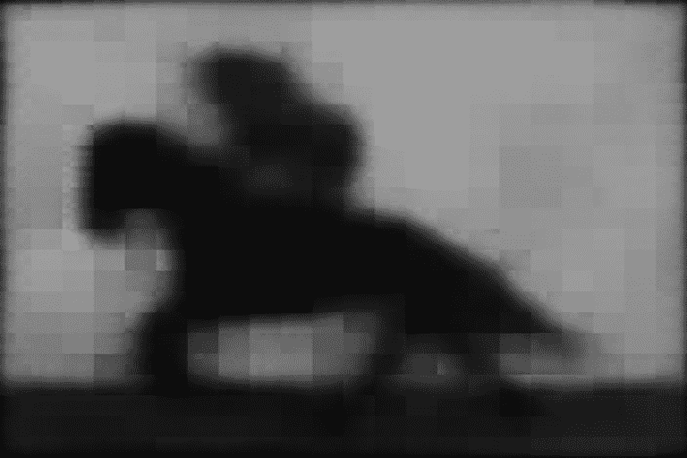
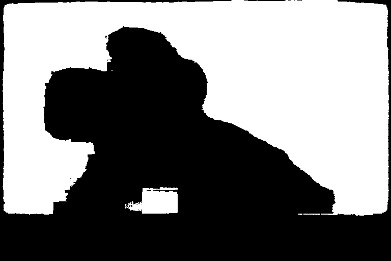
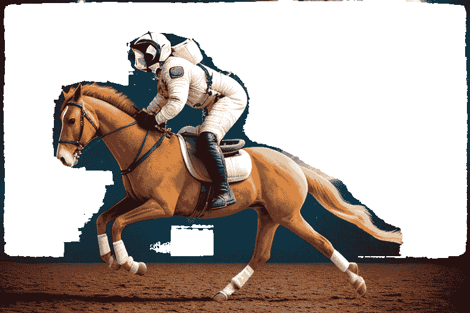
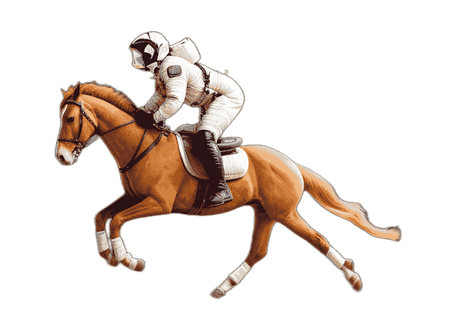
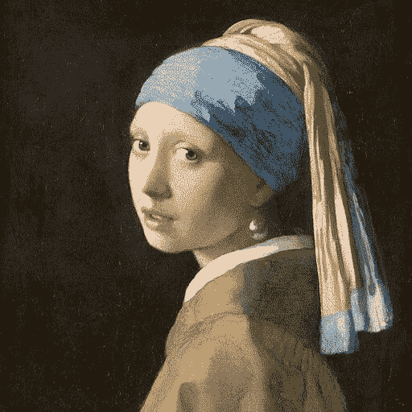
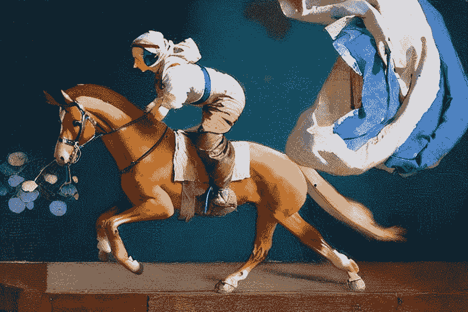

# 应用 - 对象编辑和风格迁移

**Stable Diffusion**（**SD**）不仅能够生成各种图像，还可以用于图像编辑和风格从一个图像到另一个图像的迁移。在本章中，我们将探讨图像编辑和风格迁移的解决方案。

在此过程中，我们还将介绍使我们能够实现这些目标的工具：**CLIPSeg**，用于检测图像内容；**Rembg**，这是一个能够完美去除图像背景的工具；以及 **IP-Adapter**，用于将风格从一个图像转移到另一个图像。

在本章中，我们将涵盖以下主题：

+   使用 Stable Diffusion 编辑图像

+   对象和风格迁移

让我们开始。

# 使用 Stable Diffusion 编辑图像

你还记得我们在 [*第 1 章*](B21263_01.xhtml#_idTextAnchor015) 中讨论的背景交换示例吗？在本节中，我们将介绍一个可以帮助您编辑图像内容的解决方案。

在我们能够编辑任何东西之前，我们需要识别我们想要编辑的对象的边界。在我们的例子中，为了获取背景掩码，我们将使用 CLIPSeg [1] 模型。**CLIPSeg**，代表**基于 CLIP 的图像分割**，是一个训练有素以基于文本提示或参考图像分割图像的模型。与需要大量标记数据的传统分割模型不同，CLIPSeg 可以在少量甚至没有训练数据的情况下实现令人印象深刻的结果。

CLIPSeg 建立在 CLIP 的成功之上，CLIP 是 SD 所使用的相同模型。CLIP 是一个强大的预训练模型，它学会了将文本和图像连接起来。CLIPSeg 模型在 CLIP 的基础上添加了一个小的解码器模块，使其能够将学习到的关系转换为像素级分割。这意味着我们可以向 CLIPSeg 提供一个简单的描述，例如“这张图片的背景”，CLIPSeg 将返回目标对象的掩码。

现在，让我们看看如何使用 CLIPSeg 完成一些任务。

## 替换图像背景内容

我们首先将加载 CLIPSeg 处理器和模型，然后向模型提供提示和图像以生成掩码数据，最后使用 SD 修复管道重新绘制背景。让我们一步一步来做：

1.  加载 CLIPSeg 模型。

    以下代码将加载 `CLIPSegProcessor` 处理器和 `CLIPSegForImageSegmentation` 模型：

    ```py
    from transformers import( 
    ```

    ```py
        CLIPSegProcessor,CLIPSegForImageSegmentation)
    ```

    ```py
    processor = CLIPSegProcessor.from_pretrained(
    ```

    ```py
        "CIDAS/clipseg-rd64-refined"
    ```

    ```py
    )
    ```

    ```py
    model = CLIPSegForImageSegmentation.from_pretrained(
    ```

    ```py
        "CIDAS/clipseg-rd64-refined"
    ```

    ```py
    )
    ```

    `processor` 将用于预处理提示和图像输入。`model` 将负责模型推理。

1.  生成灰度掩码。

    默认情况下，CLIPSeg 模型将返回其结果的 logits。通过应用 `torch.sigmoid()` 函数，我们就可以得到图像中目标对象的灰度掩码。灰度掩码可以让我们生成二值掩码，该掩码将在 SD 修复管道中使用：

    ```py
    from diffusers.utils import load_image
    ```

    ```py
    from diffusers.utils.pil_utils import numpy_to_pil
    ```

    ```py
    import torch
    ```

    ```py
    source_image = load_image("./images/clipseg_source_image.png")
    ```

    ```py
    prompts = ['the background']
    ```

    ```py
    inputs = processor(
    ```

    ```py
        text = prompts,
    ```

    ```py
        images = [source_image] * len(prompts),
    ```

    ```py
        padding = True,
    ```

    ```py
        return_tensors = "pt"
    ```

    ```py
    )
    ```

    ```py
    with torch.no_grad():
    ```

    ```py
        outputs = model(**inputs)
    ```

    ```py
    preds = outputs.logits
    ```

    ```py
    mask_data = torch.sigmoid(preds)
    ```

    ```py
    mask_data_numpy = mask_data.detach().unsqueeze(-1).numpy()
    ```

    ```py
    mask_pil = numpy_to_pil(
    ```

    ```py
        mask_data_numpy)[0].resize(source_image.size)
    ```

    上述代码将生成一个突出显示背景的灰度掩码图像，如图 *图 18**.1* 所示：



图 18.1：背景灰度掩码

这个掩码还不是我们想要的；我们需要一个二值掩码。为什么我们需要二值掩码？因为 SD v1.5 修复模型与二值掩码相比，与灰度掩码配合得更好。你也可以将灰度掩码添加到 SD 管道中查看结果；尝试不同的组合和输入不会有任何损失。

1.  生成二值掩码。

    我们将使用以下代码将灰度掩码转换为 0-1 二值掩码图像：

    ```py
    bw_thresh = 100
    ```

    ```py
    bw_fn = lambda x : 255 if x > bw_thresh else 0
    ```

    ```py
    bw_mask_pil = mask_pil.convert("L").point(bw_fn, mode="1")
    ```

    让我解释一下我们在前面的代码中展示的关键元素：

    +   `bw_thresh`：这定义了将像素视为黑色或白色的阈值。在前面代码中，任何大于 100 的灰度像素值将被视为白色高光。

    +   `mask_pil.convert("L")`：这一行将 `mask_pil` 图像转换为灰度模式。灰度图像只有一个通道，表示像素强度值从 0（黑色）到 255（白色）。

    +   `.point(bw_fn, mode="1")`：这一行将 `bw_fn` 阈值函数应用于灰度图像的每个像素。`mode="1"` 参数确保输出图像是一个 1 位二值图像（只有黑白）。

    我们将看到 *图 18.2* 中显示的结果：



图 18.2：背景二值掩码

1.  使用 SD 修复模型重新绘制背景：

    ```py
    from diffusers import(StableDiffusionInpaintPipeline, 
    ```

    ```py
        EulerDiscreteScheduler)
    ```

    ```py
    inpaint_pipe = StableDiffusionInpaintPipeline.from_pretrained(
    ```

    ```py
        "CompVis/stable-diffusion-v1-4",
    ```

    ```py
        torch_dtype = torch.float16,
    ```

    ```py
        safety_checker = None
    ```

    ```py
    ).to("cuda:0")
    ```

    ```py
    sd_prompt = "blue sky and mountains"
    ```

    ```py
    out_image = inpaint_pipe(
    ```

    ```py
        prompt = sd_prompt,
    ```

    ```py
        image = source_image,
    ```

    ```py
        mask_image = bw_mask_pil,
    ```

    ```py
        strength = 0.9,
    ```

    ```py
        generator = torch.Generator("cuda:0").manual_seed(7)
    ```

    ```py
    ).images[0]
    ```

    ```py
    out_image
    ```

在前面的代码中，我们使用 SD v1.4 模型作为修复模型，因为它生成的结果比 SD v1.5 模型更好。如果你执行它，你会看到我们在[*第一章*](B21263_01.xhtml#_idTextAnchor015)中展示的确切结果。现在背景不再是广阔的行星宇宙，而是蓝天和山脉。

同样的技术可以用于许多其他目的，例如编辑照片中的衣物和向照片中添加物品。

## 移除图像背景

许多时候，我们只想移除图像的背景。有了二值掩码在手，移除背景根本不难。我们可以使用以下代码来完成：

```py
from PIL import Image, ImageOps
output_image = Image.new("RGBA", source_image.size,
    (255,255,255,255))
inverse_bw_mask_pil = ImageOps.invert(bw_mask_pil)
r = Image.composite(source_image ,output_image,
    inverse_bw_mask_pil)
```

这里是每行所做事情的分解：

+   `from PIL import Image, ImageOps`：这一行从 PIL 导入了 `Image` 和 `ImageOps` 模块。`Image` 模块提供了一个同名的类，用于表示 PIL 图像。`ImageOps` 模块包含了许多“现成”的图像处理操作。

+   `output_image = Image.new("RGBA", source_image.size, (255,255,255,255))`：这一行创建了一个与 `source_image` 大小相同的新的图像。新的图像将以 RGBA 模式存在，这意味着它包括红色、绿色、蓝色和 alpha（透明度）通道。图像中所有像素的初始颜色被设置为白色 `(255,255,255)`，具有全不透明度 `(255)`。

+   `inverse_bw_mask_pil = ImageOps.invert(bw_mask_pil)`: 这行代码使用ImageOps中的`invert`函数反转`bw_mask_pil`图像的颜色。如果`bw_mask_pil`是一个黑白图像，则结果将是原始图像的负片，即黑色变成白色，白色变成黑色。

+   `r = Image.composite(source_image, output_image, inverse_bw_mask_pil)`: 这行代码通过`inverse_bw_mask_pil`掩码图像将`source_image`和`output_image`混合创建一个新的图像。其中掩码图像为白色（或灰色阴影），则使用`source_image`中的相应像素，而掩码图像为黑色，则使用`output_image`中的相应像素。结果被分配给`r`。

简单的四行代码就能实现将背景替换为纯白色，如图*图18*.3所示：



图18.3：使用CLIPSeg去除背景

但是，我们会看到锯齿边缘；这并不好，而且不能通过CLIPSeg完美解决。如果你打算再次将此图像输入到扩散管道中，SD将使用另一个图像到图像的管道来帮助修复锯齿边缘问题。根据扩散模型的本性，背景边缘将被模糊或用其他像素重新渲染。为了干净地去除背景，我们需要其他工具的帮助，例如，Rembg项目[2]。它的使用也很简单：

1.  安装包：

    ```py
    pip install rembg
    ```

1.  使用两行代码去除背景：

    ```py
    from rembg import remove
    ```

    ```py
    remove(source_image)
    ```

    我们可以看到背景被完全去除，如图*图18*.4所示：



图18.4：使用Rembg去除背景

要将背景设置为白色，使用以下三行代码，如下所示：

```py
from rembg import remove
from PIL import Image
white_bg = Image.new("RGBA", source_image.size, (255,255,255))
image_wo_bg = remove(source_image)
Image.alpha_composite(white_bg, image_wo_bg)
```

我们可以看到背景被完全替换成了白色背景。具有纯白色背景的物体在某些情况下可能很有用；例如，我们打算将这个物体用作指导嵌入。不，你没有看错；我们可以将图像作为输入提示。让我们在下一节中探讨这个问题。

# 物体和风格迁移

当我们在第4章和第5章中介绍SD的理论时，我们了解到在UNet扩散过程中只涉及文本嵌入。即使我们提供一个初始图像作为起点，初始图像也仅仅被用作起始噪声或与初始噪声连接。它对扩散过程的步骤没有任何影响。

直到IP-Adapter项目[3]的出现。IP-Adapter是一个工具，它允许您使用现有的图像作为文本提示的参考。换句话说，我们可以将图像作为另一份提示工作，与文本指导一起生成图像。与通常对某些概念或风格效果良好的文本反转不同，IP-Adapter可以与任何图像一起工作。

在IP-Adapter的帮助下，我们可以神奇地将一个物体从一个图像转移到另一个完全不同的图像中。

接下来，让我们开始使用 IP-Adapter 将一个对象从一个图像转移到另一个图像。

## 加载带有 IP-Adapter 的 Stable Diffusion 流程

在 Diffusers 中使用 IP-Adapter 简单到不需要安装任何额外的包或手动下载任何模型文件：

1.  加载图像编码器。正是这个专门图像编码器在将图像转换为引导提示嵌入中扮演了关键角色：

    ```py
    import torch
    ```

    ```py
    from transformers import CLIPVisionModelWithProjection
    ```

    ```py
    image_encoder = CLIPVisionModelWithProjection.from_pretrained(
    ```

    ```py
        "h94/IP-Adapter",
    ```

    ```py
        subfolder = "models/image_encoder",
    ```

    ```py
        torch_dtype = torch.float16,
    ```

    ```py
    ).to("cuda:0")
    ```

1.  加载一个普通的 SD 流程，但增加一个额外的 `image_encoder` 参数：

    ```py
    from diffusers import StableDiffusionImg2ImgPipeline
    ```

    ```py
    pipeline = StableDiffusionImg2ImgPipeline.from_pretrained(
    ```

    ```py
        "runwayml/stable-diffusion-v1-5",
    ```

    ```py
        image_encoder = image_encoder,
    ```

    ```py
        torch_dtype = torch.float16,
    ```

    ```py
        safety_checker = None
    ```

    ```py
    ).to("cuda:0")
    ```

注意

即使加载 SDXL 流程，我们也将使用 `models/image_encoder` 中的图像编码器模型，而不是 `sdxl_models/image_encoder`；否则，将抛出错误消息。您还可以用任何其他社区共享模型替换 SD v1.5 基础模型。

1.  将 IP-Adapter 应用到 UNet 流程：

    ```py
    pipeline.load_ip_adapter(
    ```

    ```py
        "h94/IP-Adapter",
    ```

    ```py
        Subfolder = "models",
    ```

    ```py
        weight_name = "ip-adapter_sd15.bin"
    ```

    ```py
    )
    ```

    如果您使用 SDXL 流程，请将 `models` 替换为 `sdxl_models`，并将 `ip-adapter_sd15.bin` 替换为 `ip-adapter_sdxl.bin`。

就这些了；现在我们可以像使用任何其他流程一样使用这个流程。如果不存在 IP-Adapter 模型，Diffusers 将帮助您自动下载模型文件。在下一节中，我们将使用 IP-Adapter 模型将一个图像的风格转移到另一个图像。

## 转移风格

在本节中，我们将编写代码将著名画家约翰内斯·维梅尔的 **《戴珍珠耳环的少女》**（见 *图 18**.5*）转移到 **宇航员骑马** 的图像：



图 18.5：约翰内斯·维梅尔的《戴珍珠耳环的少女》

这里，让我们启动流程以转换风格：

```py
from diffusers.utils import load_image
source_image = load_image("./images/clipseg_source_image.png")
ip_image = load_image("./images/vermeer.png")
pipeline.to("cuda:0")
image = pipeline(
    prompt = 'best quality, high quality',
    negative_prompt = "monochrome,lowres, bad anatomy,low quality" ,
    image = source_image,
    ip_adapter_image = ip_image ,
    num_images_per_prompt = 1 ,
    num_inference_steps = 50,
    strength = 0.5,
    generator = torch.Generator("cuda:0").manual_seed(1)
).images[0]
pipeline.to("cpu")
torch.cuda.empty_cache()
image
```

在前面的代码中，我们使用了原始宇航员图像 – `source_image` – 作为基础，并将油画图像作为 IP-Adapter 图像提示 – `ip_image`（我们想要其风格）。令人惊讶的是，我们得到了 *图 18**.6* 中所示的结果：



图 18.6：宇航员骑着一匹马的新风格

**《戴珍珠耳环的少女》** 图像的风格和感觉已成功应用于另一张图像。

IP-Adapter 的潜力巨大。我们甚至可以将一个图像中的服装和面部特征转移到另一个图像中。更多使用示例可以在原始 IP-Adapter 仓库 [3] 和 Diffusers PR 页面 [5] 中找到。

# 摘要

在本章中，重点是使用 SD 进行图像编辑和风格转换。本章介绍了 CLIPSeg 用于图像内容检测、Rembg 用于背景移除以及 IP-Adapter 用于在图像之间转移风格等工具。

第一部分涵盖了图像编辑，特别是替换或移除背景。CLIPSeg 用于生成背景的掩码，然后将其转换为二值掩码。背景要么使用 SD 替换，要么移除，后者会显示锯齿状边缘。Rembg 被介绍为更平滑的背景移除解决方案。

第二部分探讨了使用IP-Adapter进行对象和风格转换。这个过程包括加载图像编码器，将其集成到SD管道中，并将IP-Adapter应用于管道的UNet。章节以将维梅尔的*戴珍珠耳环的少女*的风格转移到骑马的宇航员图像上的一个示例结束。

在下一章中，我们将探讨如何保存和读取从生成的图像文件中保存和读取参数和提示信息的方法。

# 参考文献

1.  CLIPSeg GitHub仓库：[https://github.com/timojl/clipseg](https://github.com/timojl/clipseg)

1.  Timo Lüddecke 和 Alexander S. Ecker，*使用文本和图像提示进行图像分割*：[https://arxiv.org/abs/2112.10003](https://arxiv.org/abs/2112.10003)

1.  IP-Adapter GitHub仓库：[https://github.com/tencent-ailab/IP-Adapter](https://github.com/tencent-ailab/IP-Adapter)

1.  Rembg，一个用于去除图像背景的工具：[https://github.com/danielgatis/rembg](https://github.com/danielgatis/rembg)

1.  IP-Adapters原始样本：[https://github.com/huggingface/diffusers/pull/5713](https://github.com/huggingface/diffusers/pull/5713)
