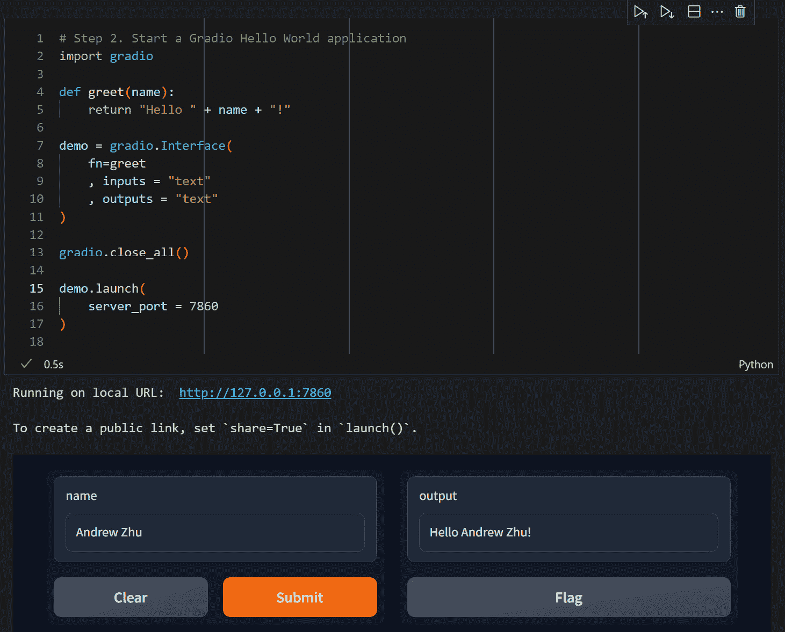
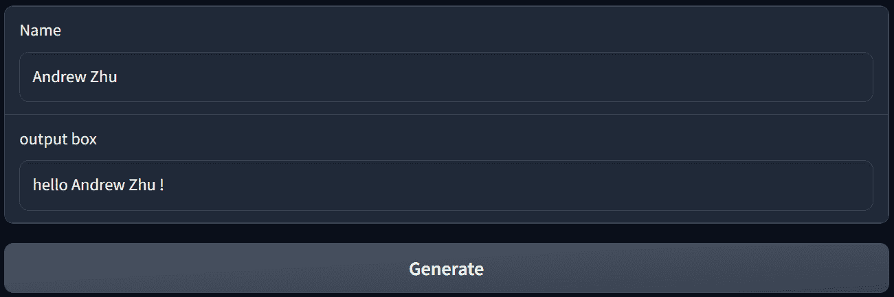
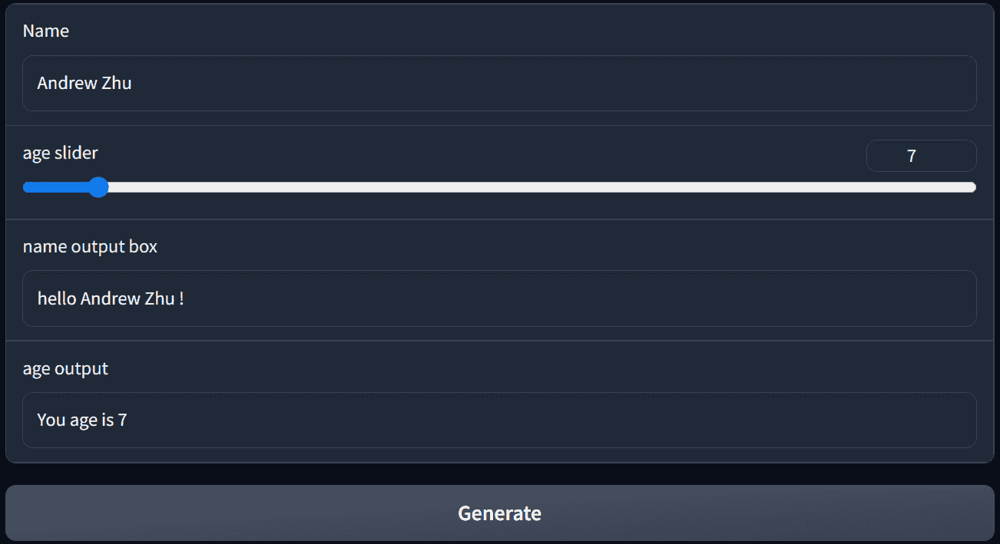
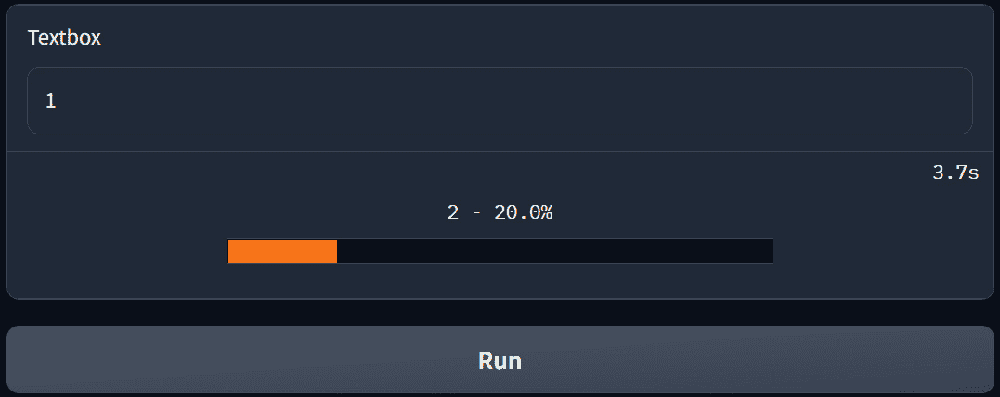

# 第二十章：创建交互式用户界面

在前面的章节中，我们仅使用 Python 代码和 Jupyter Notebook 实现了使用 Stable Diffusion 的各种任务。在某些场景中，我们不仅需要交互式用户界面以便更容易测试，还需要更好的用户体验。

假设我们已经使用 Stable Diffusion 构建了一个应用程序。我们如何将其发布给公众或非技术用户以尝试它？在本章中，我们将使用一个开源的交互式 UI 框架，Gradio [1]，来封装 diffusers 代码，并仅使用 Python 提供基于网络的 UI。

本章不会深入探讨 Gradio 的所有使用方面。相反，我们将专注于提供一个高级概述，介绍其基本构建块，所有这些都有特定的目标：展示如何使用 Gradio 构建一个 Stable Diffusion 文本到图像的管道。

在本章中，我们将涵盖以下主题：

+   介绍 Gradio

+   Gradio 基础知识

+   使用 Gradio 构建 Stable Diffusion 文本到图像管道

让我们开始。

# 介绍 Gradio

Gradio 是一个 Python 库，它使构建机器学习模型和数据科学工作流程的美丽、交互式网络界面变得容易。它是一个高级库，它抽象化了网络开发的细节，这样你就可以专注于构建你的模型和界面。

我们在前面几章中多次提到的 A1111 Stable Diffusion Web UI 使用 Gradio 作为用户界面，许多研究人员使用这个框架来快速展示他们最新的工作。以下是 Gradio 成为主流用户界面的几个原因：

+   **易于使用**：Gradio 的简单 API 使你只需几行代码就能创建交互式网络界面

+   **灵活**：Gradio 可以用来创建各种交互式网络界面，从简单的滑块到复杂的聊天机器人

+   **可扩展**：Gradio 是可扩展的，因此你可以自定义界面的外观和感觉或添加新功能

+   **开源**：Gradio 是开源的，因此你可以为项目做出贡献或在项目中使用它

Gradio 的另一个特性是其他类似框架中不存在的，即 Gradio 界面可以嵌入到 Python 笔记本中，或作为独立的网页展示（当你看到这个笔记本嵌入功能时，你会知道为什么这个特性很酷）。

如果你已经使用 diffusers 运行过 Stable Diffusion，你的 Python 环境应该已经为 Gradio 准备就绪。如果这是你阅读旅程的第一章，请确保你的机器上已安装 Python 3.8 或更高版本。

现在我们已经了解了 Gradio 是什么，让我们学习如何设置它。

# 开始使用 Gradio

在本节中，我们将了解启动 Gradio 应用程序所需的最小设置。

1.  使用 `pip` 安装 Gradio：

    ```py
    pip install gradio
    ```

    请确保您更新以下两个包到最新版本：`click` 和 `uvicorn`：

    ```py
    pip install -U click
    ```

    ```py
    pip install -U uvicorn
    ```

1.  在 Jupyter Notebook 单元中创建一个单元格，并在单元格中编写或复制以下代码：

    ```py
    import gradio
    ```

    ```py
    def greet(name):
    ```

    ```py
        return "Hello " + name + "!"
    ```

    ```py
    demo = gradio.Interface(
    ```

    ```py
        fn = greet,
    ```

    ```py
        inputs = "text",
    ```

    ```py
        outputs = "text"
    ```

    ```py
    )
    ```

    ```py
    demo.launch()
    ```

执行它不会弹出一个新的网络浏览器窗口。相反，UI 将嵌入到 Jupyter Notebook 的结果面板中。

当然，你可以复制并粘贴本地 URL – `http://127.0.0.1:7860` – 到任何本地浏览器中查看。

注意，下次你在另一个 Jupyter Notebook 的单元格中执行代码时，将分配一个新的服务器端口，例如 `7861`。Gradio 不会自动回收分配的服务器端口。我们可以使用一行额外的代码 – `gr.close_all()` – 来确保在启动之前释放所有活动端口。按照以下代码更新：

```py
import gradio
def greet(name):
    return "Hello " + name + "!"
demo = gradio.Interface(
    fn = greet,
    inputs = "text",
    outputs = "text"
)
gradio.close_all()
demo.launch(
    server_port = 7860
)
```

代码和嵌入的 Gradio 界面都将显示在 *图 20.1* 中：



图 20.1：Gradio UI 嵌入 Jupyter Notebook 单元格

注意，Jupyter Notebook 正在 Visual Studio Code 中运行。它也适用于 Google Colab 或独立安装的 Jupyter Notebook。

或者，我们可以从终端启动 Gradio 应用程序。

在 Jupyter Notebook 中启动网络应用程序对于测试和概念验证演示很有用。当部署应用程序时，我们最好从终端启动它。

创建一个名为 `gradio_app.py` 的新文件，并使用我们在 *步骤 2* 中使用的相同代码。使用一个新的端口号，例如 `7861`，以避免与已使用的 `7860` 冲突。然后从终端启动应用程序：

```py
python gradio_app.py
```

这样就设置好了。接下来，让我们熟悉一下 Gradio 的基本构建块。

# Gradio 基础知识

上述示例代码是从 Gradio 官方快速入门教程中改编的。当我们查看代码时，很多细节都被隐藏了。我们不知道 `Clear` 按钮在哪里，我们没有指定 `Submit` 按钮，也不知道 `Flag` 按钮是什么。

在使用 Gradio 进行任何严肃的应用之前，我们需要理解每一行代码，并确保每个元素都在控制之下。

与使用 `Interface` 函数自动提供布局不同，`Blocks` 可能为我们提供了更好的方法来使用显式声明添加界面元素。

## Gradio Blocks

`Interface` 函数提供了一个抽象层，可以轻松创建快速演示，但有一个抽象层。简单是有代价的。另一方面，`Blocks` 是一种低级方法，用于布局元素和定义数据流。借助 `Blocks`，我们可以精确控制以下内容：

+   组件的布局

+   触发动作的事件

+   数据流的方向

一个例子将更好地解释它：

```py
import gradio
gradio.close_all()
def greet(name):
    return f"hello {name} !"
with gradio.Blocks() as demo:
    name_input = gradio.Textbox(label = "Name")
    output = gradio.Textbox(label = "output box")
    diffusion_btn = gradio.Button("Generate")
    diffusion_btn.click(
        fn = greet,
        inputs = name_input,
        outputs = output
    )
demo.launch(server_port = 7860)
```

上一段代码将生成如图 *图 20.2* 所示的界面：



图 20.2：使用 Blocks 构建 Gradio UI

在 `Blocks` 下的所有元素都将显示在 UI 中。UI 元素的文本也是由我们定义的。在 `click` 事件中，我们定义了 `fn` 事件函数、`inputs` 和 `outputs`。最后，使用 `demo.launch(server_port = '7860')` 启动应用程序。

遵循 Python 的一个指导原则：“*明确优于隐晦*”，我们努力使代码清晰简洁。

## 输入和输出

在 *Gradio Blocks* 部分的代码中，只使用了一个输入和一个输出。我们可以提供多个输入和输出，如下面的代码所示：

```py
import gradio
gradio.close_all()
def greet(name, age):
    return f"hello {name} !", f"You age is {age}"
with gradio.Blocks() as demo:
    name_input = gradio.Textbox(label = "Name")
    age_input = gradio.Slider(minimum =0,maximum =100,
        label ="age slider")
    name_output = gradio.Textbox(label = "name output box")
    age_output = gradio.Textbox(label = "age output")
    diffusion_btn = gradio.Button("Generate")
    diffusion_btn.click(
        fn = greet,
        inputs = [name_input, age_input],
        outputs = [name_output, age_output]
    )
demo.launch(server_port = 7860)
```

结果显示在 *图 20**.3* 中：



图 20.3：带有多个输入和输出的 Gradio UI

简单地将元素堆叠在 `with gradio.Blocks() as demo:` 之下，并在 `list` 中提供输入和输出。Gradio 将自动从输入中获取值并将它们转发到 `greet` 绑定函数。输出将采用相关函数返回的元组值。

接下来，用提示和输出图像组件替换元素。这种方法可以应用于构建基于网页的 Stable Diffusion 管道。然而，在继续之前，我们需要探索如何将进度条集成到我们的界面中。

## 构建进度条

在 Gradio 中使用进度条，我们可以在相关的事件函数中添加一个 `progress` 参数。`Progress` 对象将用于跟踪函数的进度，并以进度条的形式显示给用户。

下面是 Gradio 中使用进度条的示例。

```py
import gradio, time
gradio.close_all()
def my_function(text, progress=gradio.Progress()):
    for i in range(10):
        time.sleep(1)
        progress(i/10, desc=f"{i}")
    return text
with gradio.Blocks() as demo:
    input = gradio.Textbox()
    output = gradio.Textbox()
    btn = gradio.Button()
    btn.click(
        fn = my_function,
        inputs = input,
        outputs = output
    )
demo.queue().launch(server_port=7860)
```

在前面的代码中，我们使用 `progress(i/10, desc=f"{i}")` 手动更新进度条。每次休眠后，进度条将前进 10%。

点击 **运行** 按钮后，进度条将出现在输出文本框的位置。我们将使用类似的方法在下一节中应用 Stable Diffusion 管道的进度条。

# 使用 Gradio 构建稳定的扩散文本到图像管道

准备就绪后，现在让我们使用 Gradio 构建一个稳定的扩散文本到图像管道。UI 界面将包括以下内容：

+   一个提示输入框

+   一个负提示输入框

+   一个带有 `Generate` 标签的按钮

+   点击 **生成** 按钮时的进度条

+   一个输出图像

下面是实现这五个元素的代码：

```py
import gradio
gradio.close_all(verbose = True)
import torch
from diffusers import StableDiffusionPipeline
text2img_pipe = StableDiffusionPipeline.from_pretrained(
    "stablediffusionapi/deliberate-v2",
    torch_dtype = torch.float16,
    safety_checker = None
).to("cuda:0")
def text2img(
    prompt:str,
    neg_prompt:str,
    progress_bar = gradio.Progress()
):
    return text2img_pipe(
        prompt = prompt,
        negative_prompt = neg_prompt,
        callback = (
            lambda step,
            timestep,
            latents: progress_bar(step/50,desc="denoising")
        )
    ).images[0]
with gradio.Blocks(
    theme = gradio.themes.Monochrome()
) as sd_app:
    gradio.Markdown("# Stable Diffusion in Gradio")
    prompt = gradio.Textbox(label="Prompt", lines = 4)
    neg_prompt = gradio.Textbox(label="Negative Prompt", lines = 2)
    sd_gen_btn = gradio.Button("Generate Image")
    output_image = gradio.Image()
    sd_gen_btn.click(
        fn = text2img,
        inputs = [prompt, neg_prompt],
        outputs = output_image
    )
sd_app.queue().launch(server_port = 7861)
```

在前面的代码中，我们首先启动 `text2img_pipe` 管道到 VRAM，然后创建一个 `text2img` 函数，该函数将由 Gradio 事件按钮调用。注意 `lambda` 表达式：

```py
callback = (
    lambda step, timestep, latents:
        progress_bar(step/50, desc="denoising")
)
```

我们将进度条传递到 diffusers 的去噪循环中。然后，每个去噪步骤将更新进度条。

代码的最后部分是 Gradio 元素 `Block` 堆栈。代码还给了 Gradio 一个新的主题：

```py
...
with gradio.Blocks(
    theme = gradio.themes.Monochrome()
) as sd_app:
...
```

现在，你应该能够在 Jupyter Notebook 和任何本地网页浏览器中运行代码并生成一些图像。

进度条和结果显示在 *图 20**.4* 中：



图 20.4：带有进度条的 Gradio UI

你可以向这个示例应用程序添加更多元素和功能。

# 概述

在撰写本章（2023年12月）时，关于使用 Gradio 与 diffusers 开始的信息或示例代码并不多。我们编写本章是为了帮助快速构建一个 Web UI 的 Stable Diffusion 应用程序，这样我们就可以在几分钟内与他人分享结果，而不需要接触一行 HTML、CSS 或 JavaScript，在整个构建过程中使用纯 Python。

本章介绍了 Gradio，它所能做到的事情以及它为何如此受欢迎。我们没有详细讨论 Gradio 的每一个功能；我们相信它的官方文档[1]在这方面做得更好。相反，我们用一个简单的例子来解释 Gradio 的核心以及构建一个使用 Gradio 的 Stable Diffusion Web UI 所需准备的内容。

最后，我们一次性介绍了 `Blocks`、`inputs`、`outputs`、进度条和事件绑定，并在 Gradio 中构建了一个虽小但功能齐全的 Stable Diffusion 管道。

在下一章中，我们将深入探讨一个相对复杂的话题：模型微调和 LoRA 训练。

# 参考文献

1.  Gradio：使用 Python 构建机器学习 Web 应用 — [https://github.com/gradio-app/gradio](https://github.com/gradio-app/gradio)

1.  Gradio 快速入门：[https://www.gradio.app/guides/quickstart](https://www.gradio.app/guides/quickstart)
