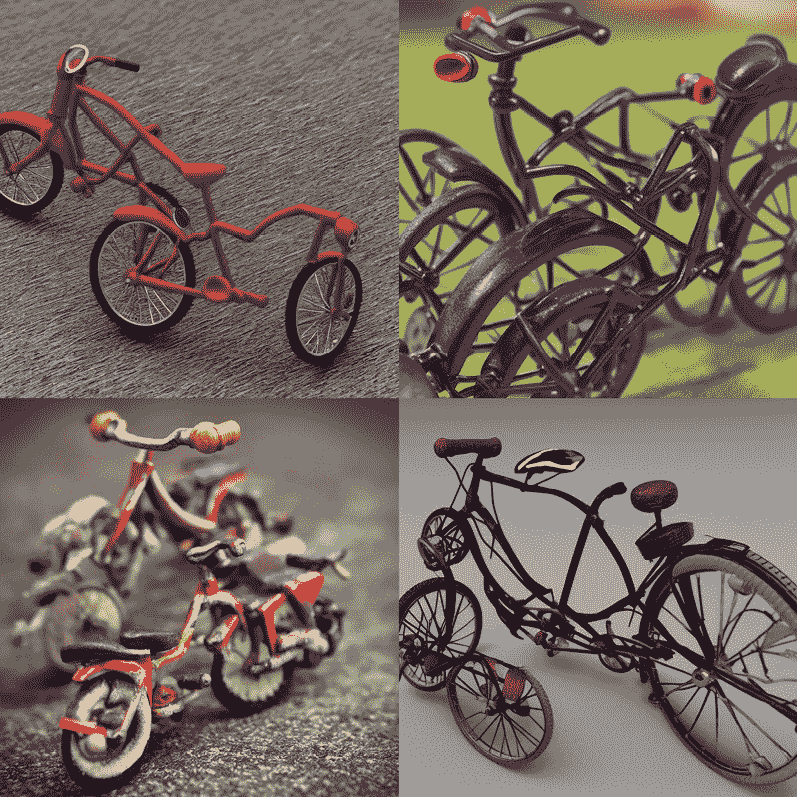
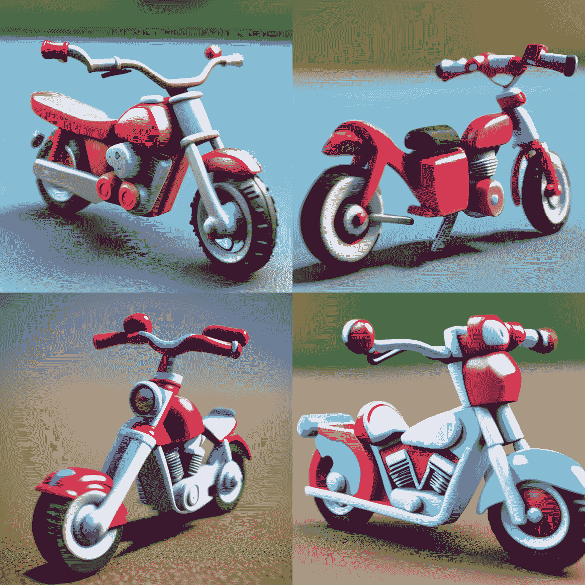

# 第二十一章：扩散模型迁移学习

本书主要关注使用Python进行Stable Diffusion，这样做时，我们需要针对我们的特定需求微调模型。正如我们在前面的章节中讨论的那样，有许多方法可以定制模型，例如以下方法：

+   解锁UNet以微调所有参数

+   训练一个文本反转以添加新的关键词嵌入

+   锁定UNet并训练一个LoRA模型以定制样式

+   训练一个ControlNet模型以使用控制引导来指导图像生成

+   训练一个适配器，将图像作为指导嵌入之一

在一个简单的章节中涵盖所有模型训练主题是不可能的。需要另一本书来讨论模型训练的细节。

尽管如此，我们仍然希望利用本章深入探讨模型训练的核心概念。我们不想列出如何微调扩散模型的示例代码，或者使用`Diffusers`软件包中的脚本，而是想介绍训练的核心概念，以便你完全理解常见的训练过程。在本章中，我们将涵盖以下主题：

+   通过使用PyTorch从头开始训练线性模型来介绍模型训练的基础知识

+   介绍Hugging Face Accelerate软件包以在多个GPU上训练模型

+   逐步构建使用PyTorch和Accelerator训练Stable Diffusion V1.5 LoRA模型的代码

到本章结束时，你将熟悉整体训练过程和关键概念，并且能够阅读来自其他存储库的示例代码，构建自己的训练代码以从预训练模型定制模型。

编写训练一个模型的代码是学习如何训练模型的最佳方式。让我们开始工作吧。

# 技术要求

训练模型比模型推理需要更多的GPU功率和VRAM。准备一个至少有8GB VRAM的GPU – 越多越好。你也可以使用多个GPU来训练模型。

建议安装以下软件包的最新版本：

```py
pip install torch torchvision torchaudio
pip install bitsandbytes
pip install transformers
pip install accelerate
pip install diffusers
pip install peft
pip install datasets
```

这里列出了我编写代码示例时使用的指定软件包及其版本：

```py
pip install torch==2.1.2 torchvision==0.16.1 torchaudio==2.1.1
pip install bitsandbytes==0.41.0
pip install transformers==4.36.1
pip install accelerate==0.24.1
pip install diffusers==0.26.0
pip install peft==0.6.2
pip install datasets==2.16.0
```

训练代码在Ubuntu 22.04 x64版本上进行了测试。

# 使用PyTorch训练神经网络模型

本节的目标是使用PyTorch构建和训练一个简单的神经网络模型。这个模型将是一个单层模型，没有额外的复杂层。它很简单，但包含了训练Stable Diffusion LoRA所需的所有元素，正如我们将在本章后面看到的那样。

如果你熟悉PyTorch模型训练，可以跳过这一节。如果你是第一次开始训练模型，这个简单的模型训练将帮助你彻底理解模型训练的过程。

在开始之前，请确保你已经安装了*技术要求*部分中提到的所有必需的软件包。

## 准备训练数据

假设我们想要训练一个具有四个权重并输出一个数字结果的模型，如下所示：

y = w1 × x1 + w2 × x2 + w3 × x3 + w4 × x4

四个权重w1、w2、w3、w4是我们希望从训练数据中获得的模型权重（将这些权重视为Stable Diffusion模型的权重）。由于我们需要一些真实数据来训练模型，我将使用权重`[2,3,4,7]`来生成一些样本数据：

```py
import numpy as np
w_list = np.array([2,3,4,7])
```

让我们创建10组输入样本数据`x_sample`；每个`x_sample`是一个包含四个元素的数组，与权重的长度相同：

```py
import random
x_list = []
for _ in range(10):
    x_sample = np.array([random.randint(1,100) for _ in range(
        len(w_list))])
    x_list.append(x_sample)
```

在以下部分，我们将使用神经网络模型来预测一系列权重；为了训练的目的，让我们假设在生成训练数据后，真实的权重是未知的。

在前面的代码片段中，我们利用`numpy`利用其点积运算符`@`来计算输出`y`。现在，让我们生成包含`10`个元素的`y_list`：

```py
y_list = []
for x_sample in x_list:
    y_temp = x_sample@w_list
    y_list.append(y_temp)
```

您可以打印`x_list`和`y_list`来查看训练数据。

我们的训练数据已经准备好了；不需要下载其他任何东西。接下来，让我们定义模型本身并准备训练。

## 准备训练

我们的模式可能是世界上最简单的模型，一个简单的线性点积，如下面的代码所示：

```py
import torch
import torch.nn as nn
class MyLinear(nn.Module):
    def __init__(self):
        super().__init__()
        self.w = nn.Parameter(torch.randn(4))
    def forward(self, x:torch.Tensor):
        return self.w @ x
```

`torch.randn(4)`代码是用来生成一个包含四个权重数字的张量。不需要其他代码；我们的NN模型现在准备好了，命名为`MyLinear`。

要训练一个模型，我们需要初始化它，类似于在LLM或扩散模型中初始化随机权重：

```py
model = MyLinear()
```

几乎所有神经网络模型训练都遵循以下步骤：

1.  前向传递以预测结果。

1.  计算预测结果和真实结果之间的差异，即损失值。

1.  执行反向传播以计算梯度损失值。

1.  更新模型参数。

在开始训练之前，定义一个损失函数和一个优化器。损失函数`loss_fn`将帮助根据预测结果和真实结果计算损失值。`optimizer`将用于更新权重。

```py
loss_fn = nn.MSELoss()
optimizer = torch.optim.SGD(model.parameters(), lr = 0.00001)
```

`lr`代表学习率，这是一个关键的超参数需要设置。确定最佳**学习率**（**lr**）通常涉及试错，这取决于您模型的特性、数据集和问题。为了找到一个合理的学习率，您需要执行以下操作：

+   **从较小的学习率开始**：一种常见的做法是从较小的学习率开始，例如0.001，并根据观察到的收敛行为逐渐增加或减少它。

+   **使用学习率调度器**：您可以在训练过程中动态调整学习率。一种常见的方法是步长衰减，即在固定数量的epoch后学习率降低。另一种流行的方法是指数衰减，其中学习率随时间指数下降。（我们不会在世界上最简单的模型中使用它。）

此外，别忘了将输入和输出转换为torch Tensor对象：

```py
x_input = torch.tensor(x_list, dtype=torch.float32)
y_output = torch.tensor(y_list, dtype=torch.float32)
```

所有准备工作都已完成，让我们开始训练一个模型。

## 训练模型

我们将设置迭代次数为100，这意味着将训练数据循环100次：

```py
# start train model
num_epochs = 100
for epoch in range(num_epochs):
    for i, x in enumerate(x_input):
        # forward
        y_pred = model(x)
        # calculate loss
        loss = loss_fn(y_pred,y_output[i])
        # zero out the cached parameter.
        optimizer.zero_grad()
        # backward
        loss.backward()
        # update paramters
        optimizer.step()
    if (epoch+1) % 10 == 0:
        print('Epoch [{}/{}], Loss: {:.4f}'.format(epoch+1, 
            num_epochs, loss.item()))
print("train done")
```

让我们分解前面的代码：

+   `y_pred = model(x)`: 这一行将模型应用于当前输入数据样本`x`，生成预测`y_pred`。

+   `loss = loss_fn(y_pred,y_output[i])`: 这一行通过比较预测输出`y_pred`与实际输出`y_output[i]`，使用指定的损失函数`loss_fn`来计算损失（也称为误差或成本）。

+   `optimizer.zero_grad()`: 这一行将反向传播期间计算的梯度重置为零。这很重要，因为它防止梯度值在不同样本之间传递。

+   `loss.backward()`: 这一行执行反向传播算法，计算所有参数相对于损失的梯度。

+   `optimizer.step()`: 这一行根据计算出的梯度和选择的优化方法更新模型的参数。

将所有代码合并并运行，我们将看到以下输出：

```py
Epoch [10/100], Loss: 201.5572
Epoch [20/100], Loss: 10.8380
Epoch [30/100], Loss: 3.5255
Epoch [40/100], Loss: 1.7397
Epoch [50/100], Loss: 0.9160
Epoch [60/100], Loss: 0.4882
Epoch [70/100], Loss: 0.2607
Epoch [80/100], Loss: 0.1393
Epoch [90/100], Loss: 0.0745
Epoch [100/100], Loss: 0.0398
train done
```

损失值快速收敛并接近`0`，经过`100`个迭代周期后。执行以下代码以查看当前权重：

```py
model.w
```

你可以看到权重更新如下：

```py
Parameter containing:
tensor([1.9761, 3.0063, 4.0219, 6.9869], requires_grad=True)
```

这非常接近 `[2,3,4,7]`！模型成功训练以找到正确的权重数字。

在Stable Diffusion和多GPU训练的情况下，我们可以从Hugging Face Accelerate包[4]中获得帮助。让我们开始使用`Accelerate`。

# 使用Hugging Face的Accelerate训练模型

Hugging Face的`Accelerate`是一个库，它提供了对不同的PyTorch分布式框架的高级API，旨在简化分布式和混合精度训练的过程。它旨在将训练循环中的更改保持在最低限度，并允许相同的函数适用于任何分布式设置。让我们看看`Accelerate`能带来什么。

## 应用Hugging Face的Accelerate

让我们将`Accelerate`应用于我们简单但有效的模型。Accelerate旨在与PyTorch一起使用，因此我们不需要更改太多代码。以下是使用`Accelerate`训练模型的步骤：

1.  生成默认配置文件：

    ```py
    from accelerate import utils
    ```

    ```py
    utils.write_basic_config()
    ```

1.  初始化一个`Accelerate`实例，并将模型实例和数据发送到Accelerate管理的设备：

    ```py
    from accelerate import Accelerator
    ```

    ```py
    accelerator = Accelerator()
    ```

    ```py
    device = accelerator.device
    ```

    ```py
    x_input.to(device)
    ```

    ```py
    y_output.to(device)
    ```

    ```py
    model.to(device)
    ```

1.  将`loss.backward`替换为`accelerator.backward(loss)`：

    ```py
    # loss.backward
    ```

    ```py
    accelerator.backward(loss)
    ```

接下来，我们将使用Accelerate更新训练代码。

## 合并代码

我们将保持所有其他代码不变；以下是完整的训练代码，除了数据准备和模型初始化：

```py
# start train model using Accelerate
from accelerate import utils
utils.write_basic_config()
from accelerate import Accelerator
accelerator = Accelerator()
device = accelerator.device
x_input.to(device)
y_output.to(device)
model.to(device)
model, optimizer = accelerator.prepare(
    model, optimizer
)
num_epochs = 100
for epoch in range(num_epochs):
    for i, x in enumerate(x_input):
        # forward
        y_pred = model(x)
        # calculate loss
        loss = loss_fn(y_pred,y_output[i])
        # zero out the cached parameter.
        optimizer.zero_grad()
        # backward
        #loss.backward()
        accelerator.backward(loss)
        # update paramters
        optimizer.step()
    if (epoch+1) % 10 == 0:
        print('Epoch [{}/{}], Loss: {:.4f}'.format(epoch+1,
            num_epochs, loss.item()))
print("train done")
```

运行前面的代码，我们应该得到与运行不带Hugging Face `Accelerate`库的训练模型相同的输出。并且损失值也会收敛。

## 使用Accelerate在多个GPU上训练模型

有许多种多 GPU 训练的方式；在我们的案例中，我们将使用数据并行风格 [1]。简单来说，我们将整个模型数据加载到每个 GPU 中，并将训练数据分配到多个 GPU 上。

在 PyTorch 中，我们可以使用以下代码实现：

```py
import torch.nn as nn
from torch.nn.parallel import DistributedDataParallel
model = MyLinear()
ddp_model = DistributedDataParallel(model)
# Hugging Face Accelerate wraps this operation automatically using the prepare() function like this:
from accelerate import Accelerator
accelerator = Accelerator()
model = MyLinear()
model = accelerator.prepare(model)
```

对于世界上最简单的模型，我们将整个模型加载到每个 GPU 中，并将 10 组训练数据分成每组 5 组。每个 GPU 将同时处理五组数据。在每一步之后，所有损失梯度数值将通过 `allreduce` 操作合并。`allreduce` 操作简单地将所有 GPU 的损失数据相加，然后将其发送回每个 GPU 以更新权重，如下面的 Python 代码所示：

```py
def allreduce(data):
    for i in range(1, len(data)):
        data[0][:] += data[i].to(data[0].device)
    for i in range(1, len(data)):
        data[i][:] = data[0].to(data[i].device)
```

Accelerate 将启动两个独立的过程来训练。为了避免创建两个训练数据集，让我们生成一个数据集，并使用 `pickle` 包将其保存到本地存储：

```py
import numpy as np
w_list = np.array([2,3,4,7])
import random
x_list = []
for _ in range(10):
    x_sample = np.array([random.randint(1,100)
        for _ in range(len(w_list))]
    )
    x_list.append(x_sample)
y_list = []
for x_sample in x_list:
    y_temp = x_sample@w_list
    y_list.append(y_temp)
train_obj = {
    'w_list':w_list.tolist(),
    'input':x_list,
    'output':y_list
}
import pickle
with open('train_data.pkl','wb') as f:
    pickle.dump(train_obj,f)
```

然后，将整个模型和训练代码包裹在一个 `main` 函数中，并将其保存到一个名为 `train_model_in_2gpus.py` 的新 Python 文件中：

```py
import torch
import torch.nn as nn
from accelerate import utils
from accelerate import Accelerator
# start a accelerate instance
utils.write_basic_config()
accelerator = Accelerator()
device = accelerator.device
def main():
    # define the model
    class MyLinear(nn.Module):
        def __init__(self):
            super().__init__()
            self.w = nn.Parameter(torch.randn(len(w_list)))
        def forward(self, x:torch.Tensor):
            return self.w @ x
    # load training data
    import pickle
    with open("train_data.pkl",'rb') as f:
        loaded_object = pickle.load(f)
    w_list = loaded_object['w_list']
    x_list = loaded_object['input']
    y_list = loaded_object['output']
    # convert data to torch tensor
    x_input = torch.tensor(x_list, dtype=torch.float32).to(device)
    y_output = torch.tensor(y_list, dtype=torch.float32).to(device)
    # initialize model, loss function, and optimizer
    Model = MyLinear().to(device)
    loss_fn = nn.MSELoss()
    optimizer = torch.optim.SGD(model.parameters(), lr = 0.00001)
    # wrap model and optimizer using accelerate
    model, optimizer = accelerator.prepare(
        model, optimizer
    )
    num_epochs = 100
    for epoch in range(num_epochs):
        for i, x in enumerate(x_input):
            # forward
            y_pred = model(x)
            # calculate loss
            loss = loss_fn(y_pred,y_output[i])
            # zero out the cached parameter.
            optimizer.zero_grad()
            # backward
            #loss.backward()
            accelerator.backward(loss)
            # update paramters
            optimizer.step()
        if (epoch+1) % 10 == 0:
            print('Epoch [{}/{}], Loss: {:.4f}'.format(epoch+1, 
                num_epochs, loss.item()))
    # take a look at the model weights after trainning
    model = accelerator.unwrap_model(model)
    print(model.w)
if __name__ == "__main__":
    main()
```

然后，使用以下命令开始训练：

```py
accelerate launch --num_processes=2 train_model_in_2gpus.py
```

你应该看到类似这样的内容：

```py
Parameter containing:
tensor([1.9875, 3.0020, 4.0159, 6.9961], device='cuda:0', requires_grad=True)
```

如果是这样，恭喜你！你刚刚在两个 GPU 上成功训练了一个 AI 模型。现在，让我们利用你所学到的知识开始训练一个稳定的扩散 V1.5 LoRA。

# 训练一个稳定的扩散 V1.5 LoRA

Hugging Face 文档提供了通过调用 Diffusers 提供的预定义脚本 [2] 来训练 LoRA 的完整指导。然而，我们不想仅仅停留在“使用”脚本上。Diffusers 的训练代码中包含了许多边缘情况处理和难以阅读和学习的额外代码。在本节中，我们将逐行编写训练代码，以全面了解每个步骤中发生的情况。

在下面的示例中，我们将使用八张带有相关标题的图片来训练一个 LoRA。图片和图片标题包含在本章代码的 `train_data` 文件夹中。

我们的训练代码结构将如下所示：

```py
# import packages
import torch
from accelerate import utils
from accelerate import Accelerator
from diffusers import DDPMScheduler,StableDiffusionPipeline
from peft import LoraConfig
from peft.utils import get_peft_model_state_dict
from datasets import load_dataset
from torchvision import transforms
import math
from diffusers.optimization import get_scheduler
from tqdm.auto import tqdm
import torch.nn.functional as F
from diffusers.utils import convert_state_dict_to_diffusers
# train code
def main():
    accelerator = Accelerator(
        gradient_accumulation_steps = gradient_accumulation_steps,
        mixed_precision = "fp16"
    )
    Device = accelerator.device
    ...
    # almost all training code will be land inside of this main function.
if __name__ == "__main__":
    main()
```

在 `main()` 函数下方，我们初始化 `accelerate` 实例。`Accelerator` 实例使用两个超参数进行初始化：

+   `gradient_accumulation_steps`：这是在更新模型参数之前要累积梯度的训练步数。梯度累积允许你使用比单个 GPU 可能实现的更大的批大小进行有效训练，同时仍然将模型参数拟合到内存中。

+   `mixed_precision`：这指定了训练期间要使用的精度。`"fp16"` 值表示将使用半精度浮点值进行中间计算，这可以导致更快的训练时间和更低的内存使用。

`Accelerator` 实例还有一个属性 device，它是在模型将要训练的设备（GPU 或 CPU）。device 属性可以在训练之前将模型和张量移动到适当的设备。

现在，让我们开始定义超参数。

## 定义训练超参数

超参数是那些不是从数据中学习，而是在学习过程开始之前设置的参数。它们是用户定义的设置，用于控制机器学习算法的训练过程。在我们的 LoRA 训练案例中，我们将有以下设置：

```py
# hyperparameters
output_dir = "."
pretrained_model_name_or_path   = "runwayml/stable-diffusion-v1-5"
lora_rank = 4
lora_alpha = 4
learning_rate = 1e-4
adam_beta1, adam_beta2 = 0.9, 0.999
adam_weight_decay = 1e-2
adam_epsilon = 1e-08
dataset_name = None
train_data_dir = "./train_data"
top_rows = 4
output_dir = "output_dir"
resolution = 768
center_crop = True
random_flip = True
train_batch_size = 4
gradient_accumulation_steps = 1
num_train_epochs = 200
# The scheduler type to use. Choose between ["linear", "cosine", # "cosine_with_restarts", "polynomial","constant", "constant_with_ 
# warmup"]
lr_scheduler_name = "constant" #"cosine"#
max_grad_norm = 1.0
diffusion_scheduler = DDPMScheduler
```

让我们分解前面的设置：

+   `output_dir`：这是模型输出将被保存的目录。

+   `pretrained_model_name_or_path`：这是用作训练起始点的预训练模型的名称或路径。

+   `lora_rank`：这是 `32` 层可能不足以有效，而高于 `256` 的 Rank 对于大多数任务可能过于冗余。在我们的案例中，因为我们只使用八个图像来训练 LoRA，将 Rank 设置为 `4` 就足够了。

+   `lora_alpha`：相反，这控制了在微调过程中对预训练模型权重进行的更新强度。具体来说，微调期间生成的权重变化乘以一个缩放因子，该因子等于 Alpha 除以 Rank，然后将其添加回原始模型权重。因此，相对于 Rank 增加Alpha。将 Alpha 设置为 Rank 是一个常见的起始实践。

+   `learning_rate`：此参数控制模型在训练过程中从错误中学习的速度。具体来说，它设置了每次迭代的步长，决定了模型调整其参数以最小化 `loss` 函数的积极性。

+   `adam_beta1` 和 `adam_beta2`：这些是在 Adam 优化器中使用的参数，分别用于控制梯度移动平均和平方梯度的衰减率。

+   `adam_weight_decay`：这是 Adam 优化器中使用的权重衰减，用于防止过拟合。

+   `adam_epsilon`：这是在 Adam 优化器中添加到分母的小值，以增加数值稳定性。

+   `dataset_name`：这是用于训练的数据集的名称。特别是，这是 Hugging Face 数据集 ID，例如 `lambdalabs/pokemon-blip-captions`。

+   `train_data_dir`：这是存储训练数据的目录。

+   `top_rows`：这是用于训练的行数。它用于选择训练的顶部行；如果你有一个包含 1,000 行的数据集，将其设置为 8 以训练顶部 8 行的训练代码。

+   `output_dir`：这是在训练过程中保存输出的目录。

+   `resolution`：这是输入图像的分辨率。

+   `center_crop`：这是一个布尔标志，表示是否对输入图像执行中心裁剪。

+   `random_flip`：这是一个布尔标志，表示是否对输入图像执行随机水平翻转。

+   `train_batch_size`：这是训练过程中使用的批量大小。

+   `gradient_accumulation_steps`：这是在更新模型参数之前需要累积梯度的训练步数。

+   `num_train_epochs`：这是要执行的训练轮数。

+   `lr_scheduler_name`：这是要使用的学习率调度器的名称。

+   `max_grad_norm`：这是要剪裁以防止梯度爆炸的最大梯度范数。

+   `diffusion_scheduler`：这是要使用的扩散调度器的名称。

## 准备 Stable Diffusion 组件

当训练 LoRA 时，涉及推理、添加损失值和反向传播的过程——这是一个类似于推理过程的过程。为了便于此，让我们使用来自 `Diffusers` 包的 `StableDiffusionPipeline` 来获取 `tokenizer`、`text_encoder`、`vae` 和 `unet`：

```py
noise_scheduler = DDPMScheduler.from_pretrained(
    pretrained_model_name_or_path, subfolder="scheduler")
weight_dtype = torch.float16
pipe = StableDiffusionPipeline.from_pretrained(
    pretrained_model_name_or_path,
    torch_dtype = weight_dtype
).to(device)
tokenizer, text_encoder = pipe.tokenizer, pipe.text_encoder
vae, unet = pipe.vae, pipe.unet
```

在 LoRA 训练期间，这些组件将促进前向传递，但它们的权重在反向传播期间不会更新，因此我们需要将 `requires_grad_` 设置为 `False`，如下所示：

```py
# freeze parameters of models, we just want to train a LoRA only
unet.requires_grad_(False)
vae.requires_grad_(False)
text_encoder.requires_grad_(False)
```

LoRA 权重是我们想要训练的部分；让我们使用 PEFT 的 [3] `LoraConfig` 来初始化 LoRA 配置。

`PEFT` 是由 Hugging Face 开发的库，它提供了参数高效的途径来适应大型预训练模型到特定的下游应用。PEFT 背后的关键思想是只微调模型参数的一小部分，而不是全部微调，从而在计算和内存使用方面节省了大量资源。这使得即使在资源有限的消费级硬件上也能微调非常大的模型。

LoRA 是 PEFT 库支持的 PEFT 方法之一。使用 LoRA，在微调过程中，不是更新给定层的所有权重，而是学习权重更新的低秩近似，从而减少了每层所需的额外参数数量。这种方法允许你仅微调模型总参数的 0.16%，同时实现与完全微调相似的性能。

要使用 LoRA 与预训练的 Transformer 模型，你需要实例化一个 `LoraConfig` 对象并将其传递到模型适当的组件中。`LoraConfig` 类有几个属性来控制其行为，包括分解的维度/秩、dropout 率和其他超参数。一旦配置完成，你就可以使用标准技术，如梯度下降来训练你的模型。以下是创建 LoRA 配置对象的代码：

```py
# configure LoRA parameters use PEFT
unet_lora_config = LoraConfig(
    r = lora_rank,
    lora_alpha = lora_alpha,
    init_lora_weights = "gaussian",
    target_modules = ["to_k", "to_q", "to_v", "to_out.0"]
)
```

接下来，让我们使用 `unet_lora_config` 配置将 LoRA 适配器添加到 UNet 模型中：

```py
# Add adapter and make sure the trainable params are in float32.
unet.add_adapter(unet_lora_config)
for param in unet.parameters():
    # only upcast trainable parameters (LoRA) into fp32
    if param.requires_grad:
        param.data = param.to(torch.float32)
```

在 `for` 循环内部，如果参数需要梯度（即它们是可训练的），它们的数据类型将被显式转换为 `torch.float32`。这确保了只有可训练的参数以 `float32` 格式存在，以便于高效训练。

## 加载训练数据

让我们使用以下代码加载数据：

```py
if dataset_name:
    # Downloading and loading a dataset from the hub. data will be 
    # saved to ~/.cache/huggingface/datasets by default
    dataset = load_dataset(dataset_name)
else:
    dataset = load_dataset(
        "imagefolder",
        data_dir = train_data_dir
    )
train_data = dataset["train"]
dataset["train"] = train_data.select(range(top_rows))
# Preprocessing the datasets. We need to tokenize inputs and targets.
dataset_columns = list(dataset["train"].features.keys())
image_column, caption_column = dataset_columns[0],dataset_columns[1]
```

让我们分解前面的代码：

+   `if dataset_name:`：如果提供了 `dataset_name`，代码将尝试使用 `load_dataset` 函数从 Hugging Face 的数据集库中加载数据集。如果没有提供 `dataset_name`，它假定数据集是本地存储的，并使用 `imagefolder` 数据集类型来加载它。

+   `train_data = dataset["train"]`: 将数据集的训练部分分配给`train_data`变量。

+   `dataset["train"] = train_data.select(range(top_rows))`: 选择训练数据集的前top行并将其分配回数据集的训练部分。当需要快速实验时，与数据集的小子集一起使用时很有用。

+   `dataset_columns = list(dataset["train"].features.keys())`: 从`dataset["train"]`特征字典中提取键并将其分配给`dataset_columns`变量。这些键代表数据集中的图像和标题列。

+   `image_column, caption_column = dataset_columns[0], dataset_columns[1]`: 将第一列和第二列分别分配给`image_column`和`caption_column`变量。这假设数据集恰好有两列——第一列用于图像，第二列用于标题。

我们需要一个函数将输入文本转换为token ID；我们定义这个函数如下：

```py
def tokenize_captions(examples, is_train=True):
    '''Preprocessing the datasets.We need to tokenize input captions and transform the images.'''
    captions = []
    for caption in examples[caption_column]:
        if isinstance(caption, str):
            captions.append(caption)
    inputs = tokenizer(
        captions,
        max_length = tokenizer.model_max_length,
        padding = "max_length",
        truncation = True,
        return_tensors = "pt"
    )
    return inputs.input_ids
```

然后，我们训练数据转换管道：

```py
# Preprocessing the datasets.
train_transforms = transforms.Compose(
    [
        transforms.Resize(
            resolution,
            interpolation=transforms.InterpolationMode.BILINEAR
        ),
        transforms.CenterCrop(resolution) if center_crop else 
            transforms.RandomCrop(resolution),
        transforms.RandomHorizontalFlip() if random_flip else 
            transforms.Lambda(lambda x: x),
        transforms.ToTensor(),
        transforms.Normalize([0.5], [0.5]) # [0,1] -> [-1,1]
    ]
)
```

上述代码定义了一组图像转换，这些转换将在训练机器学习或深度学习模型时应用于训练数据集。这些转换是通过`PyTorch`库中的`transforms`模块定义的。

下面是每行代码的作用说明：

+   `transforms.Compose()`: 这是一个将多个转换“链式连接”起来的函数。它接受一个转换函数列表作为输入，并按顺序应用它们。

+   `transforms.Resize(resolution, interpolation=transforms.InterpolationMode.BILINEAR)`: 这行代码将图像调整到指定的分辨率像素，同时保持宽高比。使用的插值方法是双线性插值。

+   `transforms.CenterCrop(resolution) if center_crop else transforms.RandomCrop(resolution)`: 这行代码将图像裁剪为分辨率x分辨率的正方形。如果`center_crop`为`True`，则从图像中心进行裁剪。如果`center_crop`为`False`，则随机裁剪。

+   `transforms.RandomHorizontalFlip() if random_flip else transforms.Lambda(lambda x: x)`: 这行代码以0.5的概率随机水平翻转图像。如果`random_flip`为`False`，则保持图像不变。

+   `transforms.ToTensor()`: 这行代码将图像从PIL图像或NumPy数组转换为PyTorch张量。

+   `transforms.Normalize([0.5], [0.5])`: 这行代码将图像的像素值缩放到-1和1之间。在将图像数据传递给神经网络之前，通常用于归一化图像数据。

通过使用`transforms.Compose`将这些转换链式连接起来，你可以轻松地预处理图像数据并对数据集应用多个转换。

我们需要以下代码来使用链式转换对象：

```py
def preprocess_train(examples):
    '''prepare the train data'''
    images = [image.convert("RGB") for image in examples[
        image_column]]
    examples["pixel_values"] = [train_transforms(image) 
        for image in images]
    examples["input_ids"] = tokenize_captions(examples)
    return examples
# only do this in the main process
with accelerator.main_process_first():
    # Set the training transforms
    train_dataset = dataset["train"].with_transform(preprocess_train)
def collate_fn(examples):
    pixel_values = torch.stack([example["pixel_values"] 
        for example in examples])
    pixel_values = pixel_values.to(memory_format = \
        torch.contiguous_format).float()
    input_ids = torch.stack([example["input_ids"] 
        for example in examples])
    return {"pixel_values": pixel_values, "input_ids": input_ids}
# DataLoaders creation:
train_dataloader = torch.utils.data.DataLoader(
    train_dataset,
    shuffle = True
    collate_fn = collate_fn
    batch_size = train_batch_size
)
```

之前的代码首先定义了一个名为 `preprocess_train` 的函数，该函数用于预处理训练数据。它首先将图像转换为 RGB 格式，然后使用 `train_transforms` 对象对这些图像应用一系列图像变换（调整大小、居中/随机裁剪、随机水平翻转和归一化）。接着，使用 `tokenize_captions` 函数对输入的标题进行标记化。处理后的预训练数据被添加到 `examples` 字典中，作为 `pixel_values` 和 `input_ids` 键。

使用 `accelerator.main_process_first()` 行是为了确保代码块内的代码仅在主进程中执行。在这种情况下，它设置了 `train_dataset` 的训练变换。

`collate_fn` 函数用于将数据集示例收集到一个批次中，以便输入模型。它接受一个示例列表，并将 `pixel_values` 和 `input_ids` 堆叠在一起。然后，得到的张量被转换为 `float32` 格式，并作为字典返回。

最后，使用 `torch.utils.data.DataLoader` 类创建了 `train_dataloader`，它以指定的批量大小、打乱和收集函数加载 `train_dataset`。

在 PyTorch 中，DataLoader 是一个实用类，它抽象了在训练或评估时批量加载数据的过程。它用于批量加载数据，这些数据点是用于训练机器学习模型的序列数据点。

在提供的代码中，`train_dataloader` 是 PyTorch 的 `DataLoader` 类的一个实例。它用于批量加载数据。更具体地说，它以预定义的批量大小从 `train_dataset` 中批量加载数据，在每个训练周期中打乱数据，并在将数据输入模型之前应用用户定义的 `collate_fn` 函数来预处理数据。

`train_dataloader` 对于模型的效率训练是必要的。通过批量加载数据，它允许模型并行处理多个数据点，这可以显著减少训练时间。此外，在每个训练周期中打乱数据有助于通过确保模型在每个周期中看到不同的数据点来防止过拟合。

在提供的代码中，`collate_fn` 函数用于在将数据输入模型之前对其进行预处理。它接受一个示例列表，并返回一个包含每个示例的像素值和输入 ID 的字典。`collate_fn` 函数在 `DataLoader` 将数据输入模型之前应用于每个数据批次。这允许通过将相同的预处理步骤应用于每个数据批次来更有效地处理数据。

## 定义训练组件

为了准备和定义训练组件，我们首先初始化一个 `AdamW` 优化器。`AdamW` 是一种用于训练机器学习模型的优化算法。它是流行的 `Adam` 优化器的一个变体，为每个模型参数使用自适应学习率。`AdamW` 优化器与 `Adam` 优化器类似，但在梯度更新步骤中包含一个额外的权重衰减项。这个权重衰减项在优化过程中添加到损失函数的梯度中，通过向损失函数添加正则化项来帮助防止过拟合。

我们可以使用以下代码初始化一个 `AdamW` 优化器：

```py
# initialize optimizer
lora_layers = filter(lambda p: p.requires_grad, unet.parameters())
optimizer = torch.optim.AdamW(
    lora_layers,
    lr = learning_rate,
    betas = (adam_beta1, adam_beta2),
    weight_decay = adam_weight_decay,
    eps = adam_epsilon
)
```

`filter` 函数用于遍历 `unet` 模型的所有参数，并仅选择那些需要梯度计算的参数。`filter` 函数返回一个包含需要梯度计算参数的生成器对象。这个生成器对象被分配给 `lora_layers` 变量，该变量将在训练过程中用于优化模型参数。

`AdamW` 优化器使用以下超参数初始化：

+   `lr`：学习率，它控制每次迭代中向损失函数最小值移动的步长

+   `betas`：一个包含梯度移动平均的指数衰减率（β1）和平方梯度的指数衰减率（β2）的元组

+   `weight_decay`：在优化过程中添加到损失函数梯度的权重衰减项

+   `eps`：添加到分母中的一个小值，以提高数值稳定性

其次，我们定义一个学习率调度器 - `lr_scheduler`。我们不必手动定义，可以使用 `Diffusers` 包提供的 `get_scheduler` 函数（`from diffusers.optimization import get_scheduler`）：

```py
# learn rate scheduler from diffusers's get_scheduler
lr_scheduler = get_scheduler(
    lr_scheduler_name,
    optimizer = optimizer
)
```

此代码使用 `Diffusers` 库中的 `get_scheduler` 函数创建一个学习率调度器对象。学习率调度器确定学习率（即梯度下降中的步长）在训练期间如何变化。

`get_scheduler` 函数接受两个参数：

+   `lr_scheduler_name`：要使用的学习率调度器算法的名称。在我们的示例中，名称是 `constant`，在代码开头定义。

+   `optimizer`：学习率调度器将应用到的 PyTorch 优化器对象。这是我们刚刚初始化的 `AdamW` 优化器。

我们已经准备好了启动训练的所有元素，并且已经编写了大量代码来准备数据集，尽管实际的训练代码并不长。接下来，让我们编写训练代码。

## 训练 Stable Diffusion V1.5 LoRA

训练 LoRA 通常需要一段时间，我们最好创建一个进度条来跟踪训练进度：

```py
# set step count and progress bar
max_train_steps = num_train_epochs*len(train_dataloader)
progress_bar = tqdm(
    range(0, max_train_steps),
    initial = 0,
    desc = "Steps",
    # Only show the progress bar once on each machine.
    Disable = not accelerator.is_local_main_process,
)
```

下面是核心训练代码：

```py
# start train
for epoch in range(num_train_epochs):
    unet.train()
    train_loss = 0.0
    for step, batch in enumerate(train_dataloader):
        # step 1\. Convert images to latent space
        # latents = vae.encode(batch["pixel_values"].to(
            dtype=weight_dtype)).latent_dist.sample()
        latents = latents * vae.config.scaling_factor
        # step 2\. Sample noise that we'll add to the latents, 
        latents provide the shape info.
        noise = torch.randn_like(latents)
        # step 3\. Sample a random timestep for each image
        batch_size = latents.shape[0]
        timesteps = torch.randint(
            low = 0,
            high = noise_scheduler.config.num_train_timesteps,
            size = (batch_size,),
            device = latents.device
        )
        timesteps = timesteps.long()
        # step 4\. Get the text embedding for conditioning
        encoder_hidden_states = text_encoder(batch["input_ids"])[0]
        # step 5\. Add noise to the latents according to the noise 
        # magnitude at each timestep
        # (this is the forward diffusion process), 
        # provide to unet to get the prediction result
        noisy_latents = noise_scheduler.add_noise(
            latents, noise, timesteps)
        # step 6\. Get the target for loss depend on the prediction 
        # type
        if noise_scheduler.config.prediction_type == "epsilon":
            target = noise
        elif noise_scheduler.config.prediction_type == "v_prediction":
            target = noise_scheduler.get_velocity(
                latents, noise, timesteps)
        else:
            raise ValueError(f"Unknown prediction type {
                noise_scheduler.config.prediction_type}")
        # step 7\. Predict the noise residual and compute loss
        model_pred = unet(noisy_latents, timesteps, 
            encoder_hidden_states).sample
        # step 8\. Calculate loss
        loss = F.mse_loss(model_pred.float(), target.float(), 
            reduction="mean")
        # step 9\. Gather the losses across all processes for logging 
        # (if we use distributed training).
        avg_loss = accelerator.gather(loss.repeat(
            train_batch_size)).mean()
        train_loss += avg_loss.item() / gradient_accumulation_steps
        # step 10\. Backpropagate
        accelerator.backward(loss)
        if accelerator.sync_gradients:
            params_to_clip = lora_layers
            accelerator.clip_grad_norm_(params_to_clip, max_grad_norm)
        optimizer.step()
        lr_scheduler.step()
        optimizer.zero_grad()
        # step 11\. check optimization step and update progress bar
        if accelerator.sync_gradients:
            progress_bar.update(1)
            train_loss = 0.0
        logs = {"epoch": epoch,"step_loss": loss.detach().item(), 
            "lr": lr_scheduler.get_last_lr()[0]}
        progress_bar.set_postfix(**logs)
```

上述代码是 Stable Diffusion 模型训练的典型训练循环。以下是代码各部分功能的分解：

+   外层循环（`for epoch in range(num_train_epochs)`）遍历训练的轮数。一个轮次是对整个训练数据集的一次完整遍历。

+   `unet.train()`将模型设置为训练模式。这很重要，因为一些层，如dropout和批归一化，在训练和测试期间表现不同。在训练阶段，这些层的表现与评估阶段不同。例如，dropout层在训练期间将以一定概率丢弃节点以防止过拟合，但在评估期间不会丢弃任何节点。同样，`BatchNorm`层在训练期间将使用批统计信息，但在评估期间将使用累积统计信息。因此，如果您不调用`unet.train()`，这些层在训练阶段将不会正确表现，这可能导致结果不正确。

+   内层循环（`for step, batch in enumerate(train_dataloader)`）遍历训练数据。`train_dataloader`是一个`DataLoader`对象，它提供训练数据的批次。

+   在*步骤 1*中，模型使用`latents`将输入图像编码到潜在空间中，这些潜在变量通过一个因子进行缩放。

+   在*步骤 2*中，向潜在向量添加随机噪声。这种噪声是从标准正态分布中采样的，并且与潜在向量的形状相同。

+   在*步骤 3*中，为批处理中的每个图像随机采样时间步长。这是时间相关噪声添加过程的一部分。

+   在*步骤 4*中，使用文本编码器获取用于条件的文本嵌入。

+   在*步骤 5*中，根据每个时间步长的噪声幅度向潜在向量添加噪声。

+   在*步骤 6*中，根据预测类型确定损失计算的目标。它可以是噪声或噪声的速度。

+   在*步骤 7*和*步骤 8*中，模型使用带噪声的潜在向量、时间步长和文本嵌入进行预测。然后计算损失作为模型预测与目标之间的均方误差。

+   在*步骤 9*中，收集所有进程中的损失以进行日志记录。在分布式训练的情况下，这是必要的，其中模型在多个GPU上训练。这样我们可以在训练过程中看到损失值的变化。

+   在*步骤 10*中，计算损失相对于模型参数的梯度（`accelerator.backward(loss)`），如果需要，则对梯度进行裁剪。这是为了防止梯度变得过大，这可能导致数值不稳定性。优化器根据梯度更新模型参数（`optimizer.step()`），学习率调度器更新学习率（`lr_scheduler.step()`）。然后梯度被重置为零（`optimizer.zero_grad()`）。

+   在*步骤 11*中，如果梯度已同步，则将训练损失重置为零，并更新进度条。

+   最后，训练损失、学习率和当前epoch 被记录下来以监控训练过程。进度条会根据这些日志更新。

一旦你理解了前面的步骤，你不仅可以训练 Stable Diffusion LoRA，还可以训练任何其他模型。

最后，我们需要保存我们刚刚训练的 LoRA：

```py
# Save the lora layers
accelerator.wait_for_everyone()
if accelerator.is_main_process:
    unet = unet.to(torch.float32)
    unwrapped_unet = accelerator.unwrap_model(unet)
    unet_lora_state_dict = convert_state_dict_to_diffusers(
        get_peft_model_state_dict(unwrapped_unet))
    weight_name = f"""lora_{pretrained_model_name_or_path.split('/')[-1]}_rank{lora_rank}_s{max_train_steps}_r{resolution}_{diffusion_scheduler.__name__}_{formatted_date}.safetensors"""
    StableDiffusionPipeline.save_lora_weights(
        save_directory = output_dir,
        unet_lora_layers = unet_lora_state_dict,
        safe_serialization = True,
        weight_name = weight_name
    )
accelerator.end_training()
```

让我们分解前面的代码：

+   `accelerator.wait_for_everyone()`：这一行用于分布式训练，以确保所有进程都已达到代码中的这一点。这是一个同步点。

+   `if accelerator.is_main_process:`：这一行检查当前进程是否为主进程。在分布式训练中，你通常只想保存一次模型，而不是为每个进程保存一次。

+   `unet = unet.to(torch.float32)`：这一行将模型权重的数据类型转换为 `float32`。这通常是为了节省内存，因为 `float32` 比使用 `float64` 使用更少的内存，但仍然为大多数深度学习任务提供足够的精度。

+   `unwrapped_unet = accelerator.unwrap_model(unet)`：这一行将模型从加速器中解包，加速器是一个用于分布式训练的包装器。

+   `unet_lora_state_dict = convert_state_dict_to_diffusers(get_peft_model_state_dict(unwrapped_unet))`：这一行获取模型的权重状态字典，其中包含模型的权重，并将其转换为适合 Diffusers 的格式。

+   `weight_name = f"lora_{pretrained_model_name_or_path.split('/')[-1]}_rank{lora_rank}_s{max_train_steps}_r{resolution}_{diffusion_scheduler.__name__}_{formatted_date}.safetensors"`：这一行创建了一个用于保存权重的文件名。该名称包含了关于训练过程的各种详细信息。

+   `StableDiffusionPipeline.save_lora_weights(...)`：这一行将模型的权重保存到文件中。`save_directory` 参数指定了文件将保存的目录，`unet_lora_layers` 是模型的权重状态字典，`safe_serialization` 表示权重应以安全的方式保存，以便以后加载，`weight_name` 是文件的名称。

+   `accelerator.end_training()`：这一行表示训练过程的结束。这通常用于清理训练过程中使用的资源。

我们在本章的关联代码文件夹中提供了完整的训练代码，文件名为 `train_sd16_lora.py`。我们还没有完成；我们仍然需要使用 `accelerator` 命令来启动训练，而不是直接输入 `python py_file.py`。

## 启动训练

如果你只有一个 GPU，只需运行以下命令：

```py
accelerate launch --num_processes=1 ./train_sd16_lora.py
```

对于两个 GPU，将 `--num_processes` 增加到 `2`，如下所示：

```py
accelerate launch --num_processes=2 ./train_sd16_lora.py
```

如果你有多于两个 GPU，并且想在指定的 GPU 上进行训练（例如，你有三个 GPU，并且想让训练代码在第二个和第三个 GPU 上运行），请使用以下命令：

```py
CUDA_VISIBLE_DEVICES=1,2 accelerate launch --num_processes=2 ./train_sd16_lora.py
```

要使用第一个和第三个 GPU，只需更新 `CUDA_VISIBLE_DEVICES` 设置为 `0,2`，如下所示：

```py
CUDA_VISIBLE_DEVICES=0,2 accelerate launch --num_processes=2 ./train_sd16_lora.py
```

## 验证结果

这是见证模型训练力量的最激动人心的时刻。首先，让我们加载LoRA，但将其权重设置为`0.0`，使用`adapter_weights = [0.0]`：

```py
from diffusers import StableDiffusionPipeline
import torch
from diffusers.utils import make_image_grid
from diffusers import EulerDiscreteScheduler
lora_name = "lora_file_name.safetensors"
lora_model_path = f"./output_dir/{lora_name}"
device = "cuda:0"
pipe = StableDiffusionPipeline.from_pretrained(
    "runwayml/stable-diffusion-v1-5",
    torch_dtype = torch.bfloat16
).to(device)
pipe.load_lora_weights(
    pretrained_model_name_or_path_or_dict=lora_model_path,
    adapter_name = "az_lora"
)
prompt = "a toy bike. macro photo. 3d game asset"
nagtive_prompt = "low quality, blur, watermark, words, name"
pipe.set_adapters(
    ["az_lora"],
    adapter_weights = [0.0]
)
pipe.scheduler = EulerDiscreteScheduler.from_config(
    pipe.scheduler.config)
images = pipe(
    prompt = prompt,
    nagtive_prompt = nagtive_prompt,
    num_images_per_prompt = 4,
    generator = torch.Generator(device).manual_seed(12),
    width = 768,
    height = 768,
    guidance_scale = 8.5
).images
pipe.to("cpu")
torch.cuda.empty_cache()
make_image_grid(images, cols = 2, rows = 2)
```

运行前面的代码，我们将得到*图21.1*中显示的图像：



图21.1：玩具自行车、宏观照片、3D游戏资产以及未使用LoRA生成的图像

结果并不那么好。现在，让我们启用训练好的LoRA，使用`adapter_weights = [1.0]`。再次运行代码，你应该会看到*图21.2*中显示的图像：



图21.2：玩具自行车、宏观照片、3D游戏资产以及使用八张图像进行LoRA训练生成的图像

结果比未使用LoRA的图像好得多！如果你看到类似的结果，恭喜你！

# 摘要

这是一章内容丰富的章节，但了解模型训练的强大功能是值得这一长度的。一旦我们掌握了训练技能，我们就可以根据我们的需求训练任何模型。整个训练过程并不容易，因为有太多细节和琐碎的事情要处理。然而，编写训练代码是全面理解模型训练工作原理的唯一方法；考虑到丰硕的成果，花时间从底层弄清楚它是值得的。

由于章节长度的限制，我只能说整个LoRA训练过程，但一旦你在LoRA训练中取得成功，你可以在Diffusers中找到更多的训练样本，根据你的具体需求更改代码，或者简单地编写你的训练代码，尤其是如果你正在开发一个新模型的架构。

在本章中，我们首先训练了一个简单的模型；模型本身并不那么有趣，但它帮助你理解了使用PyTorch进行模型训练的核心步骤。然后，我们转向利用Accelerator包在多个GPU上训练模型。最后，我们触及了真实的Stable Diffusion模型，并使用仅八张图像训练了一个全功能的LoRA。

在下一章和最后一章中，我们将讨论一些不那么技术性的内容，即人工智能及其与我们、隐私的关系，以及如何跟上其快速变化的进步。

# 参考文献

1.  什么是**分布式数据并行**（**DDP**）：[https://pytorch.org/tutorials/beginner/ddp_series_theory.html](https://pytorch.org/tutorials/beginner/ddp_series_theory.html)

1.  启动LoRA训练脚本：[https://huggingface.co/docs/diffusers/en/training/lora#launch-the-script](https://huggingface.co/docs/diffusers/en/training/lora#launch-the-script)

)

1.  Hugging Face PEFT：[https://huggingface.co/docs/peft/en/index](https://huggingface.co/docs/peft/en/index)

1.  Hugging Face Accelerate：[https://huggingface.co/docs/accelerate/en/index](https://huggingface.co/docs/accelerate/en/index)

)
