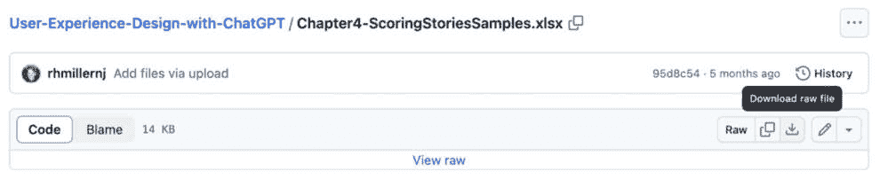
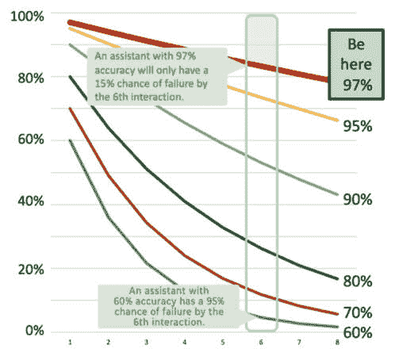
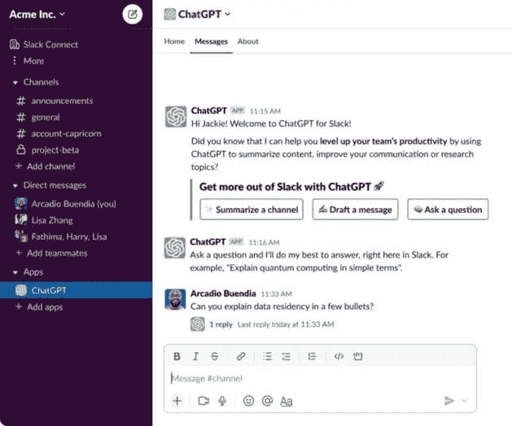
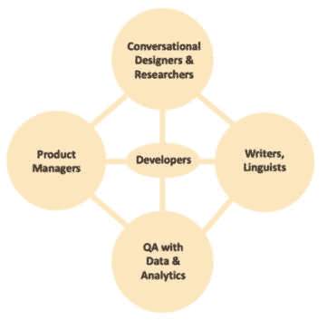

# 1

# 认识到设计在ChatGPT中的力量

如果你只想玩玩ChatGPT，这本书可能不适合你。继续阅读，通过结合ChatGPT或各种替代语言模型（涵盖成本、质量和专业知识范围）来为客户创造优质的用户体验。每一种新技术都有太多的人盲目跟风，最终以失败告终。这是普遍现象。为什么？因为他们不知道自己不知道什么。但我们知道如何为企业成功创建ChatGPT解决方案。我们将带你从零开始，成为你组织中的英雄。你想要的是低质量的互动，还是与客户产生共鸣的精准、智能的结果？他们是否应该感到赋权，并能够有信心进一步探索，因为他们知道自己是被理解的？如果是后者，这本书将专注于用户体验设计方法、实践和工具，帮助你决定做什么，设计最有效的解决方案，并验证它们是否按预期工作。我们可以将用户界面实践应用于ChatGPT的生命周期，让你有信心创造出高质量的解决方案。

这本书旨在为设计师或与设计相关的专业人士，如产品经理、产品所有者、作家、语言学家或开发者，提供如何将设计原则和实践应用于改善客户和员工的生成式人工智能体验的指导。对于那些接触过设计方法论的人来说，这些内容可能并不新颖，但它们的运用将是。对于那些对用户体验设计（UX）的科学（或UXD）了解有限的人来说，我们将提供足够的学习内容，让你能够胜任并帮助企业级ChatGPT解决方案的创建。

你可能还没有在生产环境中使用过像ChatGPT这样的生成式人工智能产品，也许只是在家或工作中使用了一些这些工具。在我们先介绍一些基础知识之前，我们只会涉及到一些关于ChatGPT工作原理的解释，比如在[*第6章*](B21964_06_split_000.xhtml#_idTextAnchor134)，“数据收集 – 内容为王”。这本书遵循典型的设计流程。首先，我们帮助确定要做什么，优先考虑这项工作，然后是如何去做，最后是如何解释和改进所做的工作。我们发现这本书中的设计技巧和提示适用于广泛的设计挑战，并且通过我们过去七年与人工智能解决方案的经验以及30年的用户体验设计（UXD）经验，我们将这些见解应用于生成式人工智能解决方案的创建。遵循设计流程将帮助人们创造出由ChatGPT驱动的优质解决方案。

在本章中，我们将涵盖以下主要内容：

+   探索对话式人工智能的历史

+   重视用户体验设计的重要性

+   理解用户体验设计（UX）的科学和艺术

+   设置自定义模型

# 技术要求

与这本书一起工作的有两种方式：跟随学习原则和实践，并使用OpenAI的游乐场之一，这通常是一种*无代码*方法，或者使用ChatGPT提供的API。

我们在书籍的GitHub仓库中有示例。如果您是第一次使用GitHub，这是一个我们将存储所有需要下载以完成书中示例的材料的地方。它是一个在线资源文件夹。

GitHub: [书籍材料仓库](https://github.com/PacktPublishing/UX-for-Enterprise-ChatGPT-Solutions/) ([https://github.com/PacktPublishing/UX-for-Enterprise-ChatGPT-Solutions/](https://github.com/PacktPublishing/UX-for-Enterprise-ChatGPT-Solutions/))

GitHub是书中所有文件的仓库。点击*图1.1*中突出显示的下载按钮，将文件下载到桌面。GitHub仓库中的大多数文件都没有查看器。



图1.1 – 如何从GitHub下载文件

确保您有ChatGPT账户。

网站：[OpenAI聊天](https://chat.openai.com/) ([https://chat.openai.com/](https://chat.openai.com/))

这很简单；每个人都应该有。我们将逐步尝试一些材料。这将使我们能够使用Playground，这对于一些演示是必不可少的。我们每个章节的末尾都有一个二维码，因此我们提供的所有参考，如前面的链接，都可以在线上更容易地访问。

## 方法1 – 无代码方法

您可以通过阅读了解80%的内容，但有些人通过实践效果更好。如果您选择这条路，请专注于设计实践和方法，并学习如何将这些应用到任何生成式AI解决方案中。我们将提供无需编码的演示和示例。尝试这些示例；理解LLM的反应方式至关重要。

## 方法2 – 使用Node.JS、Python或curl编写代码

如果您还没有ChatGPT账户，请设置一个账户。然后，前往快速入门指南以确保Node.js（curl或Python）正常工作。该URL有逐步说明，用于设置您的环境并运行。

网站：[开发人员快速入门指南](https://platform.openai.com/docs/quickstart?context=node) ([https://platform.openai.com/docs/quickstart?context=node](https://platform.openai.com/docs/quickstart?context=node))

注意

这本书不需要编写代码。对于更技术性的读者，可以使用代码版本来模拟一些无代码方法，但我们不会讨论这条路径。

要使用API，请遵循链接上的说明：

1.  安装必要的软件（Node.js、Python或curl都在同一页面上有文档说明；选择适合您的选项卡）。

1.  安装OpenAI库包。

1.  设置您的API密钥。

尝试一下！如果你使用过其他**大型语言模型**（**LLMs**）或者从未使用过，尝试一下并提问任何问题；我们称用户的这种输入为提示。*这本书中的内容可以不进行任何编码就能快速学习*。一些模型没有最新的数据，所以询问今天的天气或体育比分可能不会起作用，但如果要求给出五种清理堵塞马桶的方法，它就有答案。我们想要展示的力量是这种强大的体验和UX设计实践的组合，以创造高质量、以客户为中心的体验。现在我们有一些东西可以讨论了！

我们应该在对话式人工智能的基本历史问题上达成共识。鉴于所有的新闻，ChatGPT应该很为人所知，因此我们可以简要地回顾一下基础知识几分钟。

# 横跨对话式人工智能的历史

交互设计与人工智能在LLM革命之前就已经很好地结合在一起了。了解这段历史有助于我们应用设计原则到最新的对话体验中。任何关于人工智能的讨论至少会提到艾伦·图灵以及他在《心灵》杂志（一本同行评审的学术期刊）上发表的文章提出的问题。

文章：[《计算机与智能》（1950）](https://redirect.cs.umbc.edu/courses/471/papers/turing.pdf) ([https://redirect.cs.umbc.edu/courses/471/papers/turing.pdf](https://redirect.cs.umbc.edu/courses/471/papers/turing.pdf))

这通常被称为**图灵测试**。机器看起来智能并且与人类无法区分的能力。

文章：[维基百科上的图灵测试](https://en.wikipedia.org/wiki/Turing_test) ([https://en.wikipedia.org/wiki/Turing_test](https://en.wikipedia.org/wiki/Turing_test))

当这篇文章在1950年发表时，我们离一台计算机在纯文本交互中与人类无法区分还相去甚远。我们必须跳到20世纪60年代中期，才能看到一些似乎在参与对话的东西。

如果我们尝试使用1964年至1967年间的ELIZA的对话界面，我们会很快看到其基于识别关键词或短语时的*自然*响应的限制。

文章：[维基百科上的ELIZA](https://en.wikipedia.org/wiki/ELIZA) ([https://en.wikipedia.org/wiki/ELIZA](https://en.wikipedia.org/wiki/ELIZA))

其中一个著名的版本被称为DOCTOR。它将向其提出的书面问题转回到患者身上。尝试与心理治疗聊天机器人互动看看。

演示：[ELIZA](https://web.njit.edu/~ronkowit/eliza.html) – 心理治疗聊天机器人 ([https://web.njit.edu/~ronkowit/eliza.html](https://web.njit.edu/~ronkowit/eliza.html))

ELIZA被认为是最早尝试通过图灵测试的尝试之一。通过简单的心理治疗师对话来模拟医生（“你为什么会有这种感觉？”），它被认为具有人类特征。不过不深入探讨，关于其设计的讨论关注了关键词的重要性，并包括了*转换*规则，这些规则决定了它如何处理用户输入的内容。也许LLMs是在向这一点致敬，因为它们基于**转换器**。我们将在后面的章节中解释转换器和LLMs中常见的术语。ELIZA表面上看像是一场对话，但不能偏离主题，甚至无法提供答案。对话互动的心理学是这一体验的基础。但它并不能解决任何人的心理问题。然而，随着聊天机器人的出现，情况确实有所改善；这仅仅花了几十年。访问维基百科了解聊天机器人的简要历史。

文章：[维基百科上的聊天机器人历史](https://en.wikipedia.org/wiki/Chatbot) ([https://en.wikipedia.org/wiki/Chatbot](https://en.wikipedia.org/wiki/Chatbot))

从20世纪60年代到2000年代，研究界并没有失去对*自然语言*体验的想法。然而，随着大约2016年左右出现的对话助手或聊天机器人的出现，进化中的下一步才到来。尽管大多数聊天机器人不值得任何人花费时间，但交互设计在这里产生了重大影响。在Facebook Messenger支持的第一年，就创建了大约10万个聊天机器人。我建议其中99%很快就失败了。非常少数的聊天机器人能够存活下来，这主要是因为我们很快就会解释的原因。但是，当团队愿意使解决方案成熟时，一些聊天机器人仍然存活下来。例如，在航空公司的支持案例中（“第二个行李箱要多少钱？”或“我可以为取消的机票退款吗？”），它们可以提供具体的答案来回答具体的问题。虽然这似乎很明显，与电话相比，这可以为企业节省大量的支持成本，但这对消费者也有价值。对他们来说，时间同样宝贵。如果客户能在几秒钟内得到可靠的答案，他们很乐意为此放弃10分钟的电话等待时间。这是一个双赢的局面。此外，这种体验还可以作为与人类进行必要交互的前端。在支持案例中，它可以在与人类接触之前可靠地收集详细信息，这使得更有可能与正确的人类建立联系，并为他们提供帮助所需的详细信息。

想象一个孩子在上学之前。如果没有人与他们互动、教他们或者和他们玩耍，当他们上一年级的时候，他们可能缺乏基本的语言能力和人际交往技能，甚至可能还没有学会使用马桶。即使是伟大的喜剧演员史蒂夫·马丁也理解这一点。请花一分钟时间欣赏他的小段表演。

视频：[史蒂夫·马丁为第一天上学的孩子授课](https://www.youtube.com/watch?v=40K6rApRnhQ) ([https://www.youtube.com/watch?v=40K6rApRnhQ](https://www.youtube.com/watch?v=40K6rApRnhQ))

然而，通过投资孩子的成长和照顾，以及身体和心理健康，可以带来显著的变化。这种成熟度正是我们在聊天机器人中可以看到的。它们通常不会成为博士，但可以通过指导变得比五年级学生更聪明。我们可以利用设计技能使聊天机器人（或任何基于LLM的解决方案）变得知识渊博、可靠和表达清晰。我们将把所学应用到用ChatGPT构建的下一代对话助手上。我们将批判性地探索ChatGPT以形成稳健的解决方案，你将学会注意何时可能还有其他工具可以与ChatGPT一起使用。

值得一提的还有一个与之相关的领域。每个人在给企业打电话时都有过使用电话树的体验。我们之前已经提到了这个例子。最终，“按1获取服务，按2获取销售……”这样的选项被更注重倾听的体验所取代。但有多少人曾经为此感到困扰呢？可能我们所有人都有过。为什么？因为这种体验设计得并不好，而且技术可能也存在缺陷。这些领域也将从ChatGPT中受益。所以，如果你来自创建语音体验（可能使用Voice XML，多年来建模交互的事实标准）或来自Alexa、Siri、Google或其他数十家供应商的聊天机器人，那么制作出色体验的学习和实践经验也适用于ChatGPT。我们将在本书中详细探讨这一点。

维基百科：[维基百科的Voice XML背景](https://en.wikipedia.org/wiki/VoiceXML) ([https://en.wikipedia.org/wiki/VoiceXML](https://en.wikipedia.org/wiki/VoiceXML))

然而，许多这样的聊天机器人、电话树或对话体验未能帮助主要用户完成他们的任务。为什么？以下是一些关键原因：

+   聊天机器人的功能或服务与用户的需求不匹配

+   模型不支持用户语言的复杂性

+   用户的主要口语可能不受支持，需要他们用次要语言理解，或者根本无法理解

+   聊天机器人只知道他们所知道的信息，因此会返回看似随机的结果，这会令人沮丧

+   聊天机器人不会以客户期望的语气或语调回应

+   聊天机器人应该被监控和改进以解决这些问题

你的目标应该是设定一个比人类执行相同任务时预期的质量标准更高的标准。听起来疯狂吗？其实不然。一个典型的支持人员可能只能帮助解决一个狭窄的话题（比如，网站密码重置）。另一个代理需要解决账单问题或找到缺失的付款。因此，平均支持人员的帮助将不如未来经过良好训练、能够访问所有机构数据和流程的ChatGPT顾问。

这带我们来到了像OpenAI这样的公司的创立。机器学习模型的长久历史和计算能力的提升使得这个非常大的语言模型能够工作。OpenAI并不是在2022年12月ChatGPT 3.5发布时进入世界视野的，该公司早在七年前的非营利性基础上成立。从能够生成类似人类文本的GPT-2版本到引起全球关注的3.5版本，花了超过三年时间。对于那些喜欢科技历史的人来说，可以深入了解OpenAI的简要背景。

文章：[OpenAI的起源](https://www.britannica.com/money/OpenAI) ([https://www.britannica.com/money/OpenAI](https://www.britannica.com/money/OpenAI))

就像许多硅谷公司一样，来自Google Brain（以及与Google合并的DeepMind）、Facebook和其他AI的工程师聚集在OpenAI。然后，大约在2021年初，11位OpenAI员工离开，成立了Anthropic。这一切都不是一夜之间发生的，因此我们需要提醒自己，这项新技术将需要数年才能融入我们的日常生活。电话、汽车、计算机和移动电话都已经成为当今现代社会的基石。这将比所有这些之前的发明对我们所有人产生更大的影响，但这需要时间。在这个过程中会有很多失败。

想象一下，一个解决方案在每次交互中都有60%的准确性。对于一个计算机来说，60%的时间正确似乎很高吗？在ChatGPT之前，有些人并不认为这很糟糕。我经常在我的课堂上（通常每班有20到100人）提出这个问题，关于对话式人工智能。许多人认为50-80%的成功率是“相当不错的”。

通过一些简单的假设，我们可以理解这些系统为什么会失败。每次提问时，失败的可能性都会增加，正如*图1.2*所示。为了保持简单，我们基于每次轮转独立失败概率相同的原则。系统不知道它已经失败了，如果用户信任它，他们甚至可能不会注意到失败，从而造成更多的失败。



图1.2 – 每次轮转失败的可能性增加

当以60%的成功率提出六个问题时，有95%的可能性其中一个答案是错误的。如果你的下一个问题依赖于前一个答案呢？交互将偏离轨道。我一次又一次地看到这种情况。如果用户信任（错误的）答案，他们就会基于那个（不正确）的答案做出下一个决定。失败是可以保证的。这种关系会恶化。如果客户看到这些失败（可能是一个更昂贵的渠道）来满足他们的需求，或者更糟糕的是，他们会转向另一个供应商。

我们可以考虑改进这些曲线的策略，以便每个转折点更有可能成功。第6章、第7章和第8章解释了使用多个生成式AI组件进行不同形式验证的策略。是的，AI可以监管另一个AI。虽然传统的LLM，如ChatGPT已经改进并将继续改进，但我们希望提供工具和测量技能，以确保成功。但再次看看*图1*。2。看看将标准提高到97%准确性的情况。在相同的转折次数后，有很高的可能性（85%）所有交互都是成功的。所以，提高对期望的标准。

实现这些质量水平是可能的。我们还将展示如何衡量和扩大改进的范围，以获得最大的投资回报。

聊天机器人失败

要了解“坏”可以有多糟糕，请阅读这篇关于聊天机器人失败的文章。我们的目标是教授足够的设计方法，以避免陷入这些耻辱的黑洞。

文章：[聊天机器人失败](https://research.aimultiple.com/chatbot-fail/) ([https://research.aimultiple.com/chatbot-fail/](https://research.aimultiple.com/chatbot-fail/))

例如，通过专门设计的体验，专注于提交业务费用或回答关于内部业务流程的常见问题，用户在尝试打破聊天体验或提出离谱的问题上花费的精力更少。这种行为在广泛可用的公共ChatGPT和聊天机器人体验中是预期的，但在构建定制的ChatGPT工具时，这种情况可能不到1%。它仍然会遇到它可能无法回答的问题，但更有可能的是，这些问题最终应该能够回答。我们将展示如何优先处理这些积压的问题，以保持持续改进的业务。

这将我们引向ChatGPT和新的LLM类别，它们在许多方面与人类无法区分。谷歌的LaMDA、Meta的Llama、Anthropic的Claude和OpenAI的GPT模型都属于同一类软件。

+   文章：[LLM的维基百科调查](https://en.wikipedia.org/wiki/Large_language_model) ([https://en.wikipedia.org/wiki/Large_language_model](https://en.wikipedia.org/wiki/Large_language_model))

+   文章：[谷歌的LaMDA](https://en.wikipedia.org/wiki/LaMDA) ([https://en.wikipedia.org/wiki/LaMDA](https://en.wikipedia.org/wiki/LaMDA))

+   文章：[Meta的Llama](https://llama.meta.com) ([https://llama.meta.com](https://llama.meta.com))

+   文章：[Anthropic的Claude](https://www.anthropic.com/claude) ([https://www.anthropic.com/claude](https://www.anthropic.com/claude))

+   文章：[OpenAI的GPT模型](https://platform.openai.com/docs/models) ([https://platform.openai.com/docs/models](https://platform.openai.com/docs/models))

即使它们像人类一样，我们也必须问它们模仿的是企业空间中的哪类人类。这代表我的公司吗？它是否拥有解决我客户问题的所需知识？我的客户将如何处理错误的答案？大型语言模型（LLMs）具有很大的潜力，并将迅速发展。我们的目标是为您提供工具，以评估LLM解决方案是否适合您发展的每个阶段。

# ChatGPT用户体验设计的重要性

到现在为止，ChatGPT还需要介绍吗？OpenAI开发的创新模型属于一类新的LLMs，这些模型在互联网上大量文章、书籍和知识的数据元素上进行训练。它在大约两个月内达到了超过一亿用户。它可以在多种语言中生成类似人类的文本或语音对话，并在广泛的信息上进行交流。而且它做得非常快。

ChatGPT无疑是一场火热的浪潮。独特、有趣、快速、智能？然而，当为您的企业或企业设计解决方案时，它们应该是准确的，拥有最新的与业务相关的信息，并且以企业期望的语气、风格和语调与客户沟通。那么，如何将这样一个快速移动的目标包裹成一个超出客户期望的产品呢？能否确保它不会给出随机的、不符合品牌形象的答案？您可以做到，但这需要设计。需要对其进行监控。最好有一个流程来改进它。为此，这里是正确的位置。

让我来定义一下“设计”，因为我看到很多非常糟糕的定义。设计是为用户清晰传达体验的过程和实践。好的软件用户体验设计通过应用科学方法来解决人类和机器界面问题，从而考虑到人类行为和局限性。这意味着我们可以利用我们对视觉、听觉和动觉系统的了解，结合对大脑工作方式的了解，来决定如何创建一个功能性强、易用、必要甚至引人入胜的体验。我们周围到处都是设计：视觉设计、图形设计、软件设计、对话设计、建筑设计和许多其他领域。我们利用用户研究专家的专长，根据客户的主观和客观反馈来指导我们的设计，使用正式和非正式方法更好地了解用户的需求。然后，我们将来自客户、初级研究和产品及公司目标的信息结合起来，加入一点魔法，创造出卓越的体验。

如果您只是在这些努力之外在屏幕上放置图标或编写对话性文案，您做的就是生产工作，而不是设计。我们希望每件事都有其目的。通过创造适合目的的更多工作，我们的客户体验将得到改善。我们并不总是做得正确。如果我们知道如何满足用户的需求，我们将得到一个质量更高的产品。这就是迭代设计概念发挥作用的地方。即使我们没有做得正确，我们也会从我们的设计中学习和改进。

用户体验设计、界面设计、人机工程学、用户研究、**人机交互**（**HCI**）或任何形式的交互设计和科学艺术集合，是一系列专家和专业知识，可以帮助塑造这个功能性强、引人入胜、易于使用且有趣的体验。我们可以通过直接将这些学科从“聊天”体验中吸取的丰富知识应用到“聊天”解决方案中，或者通过将我们从对话人工智能和图形用户界面设计中学习到的知识适应到这个新世界中，来构建成功的基于聊天的解决方案。用文字与计算机进行交流并不新鲜；它只是得到了改进。

这就是您学习如何根据公司知识和业务需求为客户设计ChatGPT解决方案的地方。企业ChatGPT涵盖了广泛的经验。这可以包括创建一个支持网站，一个虚拟助手以帮助员工或求职者，一个为销售电话个性化电子邮件的销售参与服务，一个培训应用，一个产品搜索或推荐工具，一个用于分析法律文件不一致性的工具，或者为律师的专家证人工具。代码审查（评估用Java或其他数十种流行语言编写的软件并识别问题或错误）是技术领域的另一个热门话题。本书将避开这个用例，专注于更常见的经验，这些经验将影响大多数人，大多数时间，对他们的生活作为企业客户来说非常重要。开发者生产力工具是必不可少的，但这个话题在其他地方已经得到了很好的覆盖。这些学习也适用于那个领域；我们不会使用来自开发者生产力工具的任何例子或案例研究。我们将从讨论下一节中良好的设计和科学艺术开始。

# 理解用户体验设计的科学和艺术

每枚硬币都有两面（好吧，加上边缘！）。通常，我们看待用户体验设计有两个方面：那些有视觉背景的人和那些从科学角度出发的人。现在，学校几乎都在大量培养视觉和图形艺术家以满足需求，而随着对话式人工智能的出现，用户体验中确实有一些*艺术*元素，但并非总是视觉元素。生成式人工智能的引入影响了交互设计的各个方面。设计角色将适应或消亡。适应是更好的选择。随着**图形用户界面**（**GUIs**）适应并包含对话元素，视觉设计师的角色仍然相关，即使只是创建正确的提示来帮助他们生成与组织目标相符的外观和感觉。设计科学的这一方面对于需求、理解和沟通仍然至关重要。即使在撰写这本书的时候，ChatGPT也提供了一些关于用户体验的良好答案。但本书所涵盖的内容并不是ChatGPT或任何生成式解决方案可以迅速回答的。它们像所有工具一样帮助我们推动设计文化的发展，但它们不知道何时出错，仍然需要我们决定在哪里应用解决方案，收集正确的数据以帮助它们形成答案，并理解和改进结果。

## 设计科学

“*任何人都可以设计*”，“*只需把按钮放在那里*”，“*我可以写这个文案*。”设计和制作某物之间是有区别的。任何人都可以制作某物。它可能或可能不起作用；它可能对某些人有效，对其他人无效，“*我为自己设计了它，我没有任何问题*”，或者它可能很好。我们希望使用工具、专业知识、智慧和领域知识来确保*设计决策*产生最高质量的产品。有大量研究通常支撑着高质量的交互，我们希望避免陷阱。

当我们提到研究时，我们包括有受试者的人类主体的控制研究，其中团队已经经历了严格的过程，以返回可靠、可重复和有效的结果。然后我们将这些结果应用到我们的情况中。有些人会说，“*这不适合这个，因为它不同*。”好吧，它可能不同，这就是为什么我们与交互设计师分享这些结果，以指导我们什么是有用的。随着ChatGPT的成长和与其他产品及功能的集成，它将与视觉元素、形式、交互图表和可视化以及典型的GUI（带有按钮、表格、过滤器、标签以及我们在任何移动、桌面、网页或嵌入式体验中看到的所有组件）更加紧密地结合。这将使用户体验设计的科学和历史专业知识变得更加关键。

让我们以 Hick 的法则为例；设计师们都知道并经常使用 Hick 的法则。“*决策所需的时间随着可选方案数量的增加而增加*。”这就是为什么我们将菜单分成小段，为复杂流程提供向导，以及讨论对话框中应该有多少按钮。在对话流程中，我们保持决策简单，以减轻用户的负担。

Hick-Hyman 法则

这个法则于1952年发表在《实验心理学季刊》上。它是一个方程式，，其中反应时间（*RT*）是决策中不包括的时间（*a*）加上一个常数（大约0.155秒）乘以可供选择的选项数量（*n*）的对数函数。

文章：[维基百科对 Hick-Hyman 法则的解释](https://en.wikipedia.org/wiki/Hick%27s_law) ([https://en.wikipedia.org/wiki/Hick%27s_law](https://en.wikipedia.org/wiki/Hick%27s_law))

我们不期望你知道或记住这些，但这只是 UX 设计决策背后的科学的一个例子。有时，了解指南、法则和科学可以帮助你做出更好的决策，避免别人的错误，你必须学会纠正这些错误。

在这种情况下，我们知道长列表的选项对用户来说很复杂，当生成式 AI 返回10到15个选项时，做出决定所需的努力会显著增加。通过这个例子，我们可以将这些选项分组到更小的逻辑段中，并将它们减少为一系列中两个更简单的决策。这就是为什么我们有**文件**、**编辑**、**查看**、**窗口**和**帮助**菜单。通过分组菜单项，选择动作是一个更简单的决策。这也是为什么当有太多选项且对这些选项的组织没有明确理解时，菜单会失败。让我们告诉 ChatGPT 返回更逻辑和组织的大决策树。我们将在[*第7章*](B21964_07.xhtml#_idTextAnchor150)，*提示工程*中介绍这一点，以给 ChatGPT 指示我们希望我们的响应如何构建。

再举一个经典的例子如何？给一个企业打很多电话，可能会听到有5-6-7-8甚至9个选项的语音提示；打电话的人如何跟踪正确的选项？你是否需要再次听提示？也许你分心了，无法回忆起前几个选项。你是否曾经用几个手指代表一个数字来提醒自己，当有多个可行的选项时，哪个答案可能最好？这是一个人类工作记忆问题，一个经典的设计问题。

文章：[维基百科解释工作记忆](https://en.wikipedia.org/wiki/Working_memory) ([https://en.wikipedia.org/wiki/Working_memory](https://en.wikipedia.org/wiki/Working_memory))

这些人类因素影响了许多体验的设计——尤其是基于大量文本的体验。我们不会在这本书中计算Hick定律或测试工作记忆。然而，应该认识到，应用设计原则将是帮助创建成功的ChatGPT体验的基石。在没有指导的情况下，没有人应该在第一个菜单上被提示35个选项。这是一个不可接受的用户体验。因此，我们可以使用现有的、组织良好的树状结构，让ChatGPT（语音到文本）确定客户请求，一步跳过几个级别。

设计书籍愿望清单

如果你刚开始学习设计并想学习基础知识，有许多丰富的资源。我建议阅读一些非技术性的入门书籍，例如Don Norman的《日常事物的设计》或Steve Krug的《别让我思考》。

熟悉这些作品的人可能会想要更深入、更复杂的书籍。我建议阅读Jeff Johnson的书籍《以心为本的设计》，这本书能帮助你理解心理学的基本原理是如何被用来推导出许多这些指南，并帮助你应用这些原则。《设计原理的通用原则》由Lidwell、Holden和Butler所著，是一本优秀的参考书。更多资源可以在我们的书单中找到。

网站：[推荐书单](https://uxdforai.com/references#C13) ([https://uxdforai.com/references#C13](https://uxdforai.com/references#C13))

要使这些体验成功，要像设计师一样思考。考虑用户将如何互动，利用他们的期望、偏见和假设，以及他们的独特经历将如何塑造他们的未来互动。设计思维的力量在于学习如何确保使用你产品的人能够成功。

为了明确起见，这与“当我看到它时我会知道”大不相同。你希望将艺术和风格应用于产品，并理解成功的科学基础。其中一些来自心理学和相关学科。在计算机时代的过去50年里，人类的认知和身体能力并没有改变。我们仍然使用相同的感官来处理信息。我们的反应和响应能力没有改变；只是我们的经验在进化。我们可能现在知道如何用两只手指打字，但处理信息、点击小目标、做决定或学习复杂模式的能力是有限的。例如，尽管今天的汽车马力是20世纪60年代的二到五倍，但这并不意味着我们在事故中能更快地做出反应。当ChatGPT提供见解或理解时，我们可以通过良好的UX实践来克服一些认知或身体的人类限制。

## 设计的艺术

我敢打赌你们一直在等待我们在这里讨论视觉设计。这将在某些地方适用，但不会成为本书的基石。我们本可以涵盖如何设计聊天窗口或哪种视觉处理效果最好，但我怀疑这些信息在许多资源中都是独立的，而不仅仅是关于ChatGPT的书籍。品牌身份有其主观标准，以及其科学和专业知识。现在，将生成式AI和传统用户界面结合起来的经验将会出现，并且可以应用视觉风格和专业知识到这种经验中，但这对于企业来说是独特的。我们希望涵盖可以跨越任何企业的设计艺术，并将这与其他支持设计的科学相结合。所有这些努力都是为了创造对观众来说既预期又舒适的东西。

在会议中，我们经常听到，“*戴上你的设计师帽子*。”这意味着要成为客户的代言人，通过他们与产品的互动来满足客户的需求。这属于以用户为中心的设计的基本原则。我们让客户参与到过程中，因为我们有时需要学习得更好。倾听客户意味着比客户说的“正确”更有意义。它不是，也不会是。很多时候，客户所要求的东西和他们真正需要的东西是不同的。他们想要绕过问题，但也许解决方案是首先消除问题。这就是为什么这也是一门艺术。你必须知道在哪里寻找值得解决的问题。

将用户融入设计过程中将帮助我们理解他们的期望，并看到设计如何影响他们的行为。我们知道生成式AI有时才会给出预期的结果。设计师的工作之一是改进这种交互，可能通过书中将要讨论的工具间接地实现，例如数据清洗、提示工程、微调、用户研究、用户测试和监控。在生成AI生成响应的过程中，我们还需要控制并完善一些艺术技巧。正如凯文·穆尔特在为本书的一次对话中解释的那样，“*科学描述了事情应该如何做，而生成式AI描述的（理想情况下）是它们今天通常是如何做的。设计师的任务（始终如此）是将这些不同的输入整合成一个单一的、连贯的解决方案，最好地映射到用户的需求和愿望*。”因此，我们需要运用我们的技能深度来确保我们的ChatGPT解决方案准确无误。

为了公正地对待这个过程，只有一些决策可以基于逻辑或研究方法，特别是关于你希望ChatGPT如何响应的问题。让我们将艺术概念分解，以应用于产品声音、风格和语调中使用的词汇。

让我们以一家销售冲浪服装、冲浪板和海滩设备的的大型公司为例。网站或风格应与古板、老式的银行区分开来。对吧，伙计，还有**姑娘们**？同样，银行旨在给人一种可靠、安全、可信赖和值得信赖的印象，顾客女士。因此，网站应以符合顾客对品牌期望的方式与顾客沟通。

你对话的整体**语气**应反映品牌形象。

互动的**风格**应与用户的需求、愿望和期望相匹配。

对话的**语调**可以根据当前情况调整或变化。

我们将详细讨论这些问题，以确定何时以及如何在一个风格中调整语调，以适应ChatGPT助手的整体语气。

没有一种正确的方式来写。语气、风格和语调在概念上可以重叠。同样的事情可以用许多方式表达，仍然可以被理解：

```py
Your appointment is now scheduled for this coming Monday.
I have scheduled you to see the doctor on Monday.
Confirmed. I have a Monday appointment in the books.
```

我们将讨论如何确保回复清晰、简洁，并包含正确的细节水平（也许顾客想知道约会的时间？或者是在哪个办公室？）。或者也许他们期望一个日历（`.ical`或类似格式）附件，以便更容易地将这次约会添加到日历中：

```py
Got it. Monday at 3:00 pm at the Palo Alto office. Here is the calendar entry.
```

如果一位经理在我们提到的冲浪店安排了这次约会，他们会使用适合顾客的语言和语调，让顾客感觉自己是其中一员：

```py
Akaw! We got you, grom. Swing by for your intro lesson on Mondo at 3 at the Santa Monica beach shop.
```

一个聪明的设计师会知道，即使受众不知道*Akaw*（棒或酷）和*grom*（新冲浪者），他们仍然可以理解信息，并对开始冲浪感到一丝兴奋。

### 本书的应用场景

这就是艺术与科学在设计中的交汇点。在我们旅途中，我们会看到很多这样的例子。我们将要求我们的ChatGPT实例清晰、完整、具有对话性（当需要时）。使用ChatGPT在非对话用户界面中创建答案也是完全合理的。ChatGPT可以在后端系统中处理和生成数据。UI可以使用ChatGPT补充的警报、按钮或警告对话框。我们称之为混合用户体验。这是传统UI元素和生成式AI的结合。在撰写电子邮件时，语法或风格建议可以在建议窗口中提出，而不必是对话式的。我们将把这些称为推荐者。它们提供推荐以帮助内容生成或影响流程，例如销售线索。

让我们用图片来阐述这些概念。每张图片都能传达书中示例中涵盖的体验感。如果你的用例不同，但仍然是一个用户界面，那么我们讨论的大部分内容可能都适用。

#### 消息传递

**简单文本消息**（**SMS**），语音体验或简单聊天是只能使用文本或语音的双向用户体验。这些体验在SMS中的交互有限：文本、图片、文件上传和链接。*图1.3*展示了通过短信与我的费用助手在电话中交互的例子。它易于访问且简单，但其在支持的交互类型上存在限制。


图1.3 – 在手机上通过SMS进行简单消息的例子

如果这是一个语音体验，比如在汽车里，或者在亚马逊Alexa中的技能，那么创建高质量的纯语音解决方案比使用SMS更具挑战性。我们将在书中讨论语音体验，但我们应该接下来讨论混合用户界面，因为那是未来。

#### 混合用户界面

Slack、Teams和Web界面可以结合对话文本的用户界面元素。简单的体验可以包含链接、按钮、图表、图形或表单。这种混合体验结合了LLMs和GUIs，允许处理仅由生成文本或GUI组件单独处理的问题的复杂性。在*图1.4*中，我展示了一个来自Slack的简单例子，其中按钮鼓励探索任务。

文章：[ChatGPT AI for Slack](https://www.cityam.com/slack-to-offer-users-a-chatgpt-ai-tool-which-will-write-messages-for-them-in-seconds/) ([https://www.cityam.com/slack-to-offer-users-a-chatgpt-ai-tool-which-will-write-messages-for-them-in-seconds/](https://www.cityam.com/slack-to-offer-users-a-chatgpt-ai-tool-which-will-write-messages-for-them-in-seconds/))



图1.4 – 混合用户体验的例子

总体而言，在更健壮的渠道中的体验可以利用更多创意元素。例如，Web渠道可能支持交互式图表或可视化、购物车项目、信息、工具和企业产品。生成式对话可以细化结果或改变视角或过滤器，而UI组件也控制视图的某些方面。这是迄今为止最健壮和最具创造性的生成式解决方案空间。

### 推荐器用户界面

通常，推荐器是一种作为文本提示的建议，以鼓励特定的行为。它可以通过操作按钮来实现，但用户不会与系统进行交互或对话。总结或写作建议工具通常是这种体验。即使它有“生成电子邮件”的按钮，如果用户没有与生成代理进行对话式交互，它更像是一个推荐器。在*图1.5*的Salesforce例子中，Einstein为销售流程提供了上下文。

文章：[Salesforce中的AI](https://www.salesforce.com/products/ai-for-sales/) ([https://www.salesforce.com/products/ai-for-sales/](https://www.salesforce.com/products/ai-for-sales/))


图1.5 – 推荐用户界面的例子

### ChatGPT的后端使用

生成式AI解决方案的一个隐藏用途是处理信息，并向用户提供数据、信息或智慧，然后这些信息被传递到不同的用户体验中。用户并不直接与生成式AI互动，因此不存在UI。可能会有管理UI或使用处理结果的UI。在*图1.6*中，我们看不到用户界面。我们看到的是将被摄取、处理并分析以返回干净、规范化的数据。我们将在从[*第6章*](B21964_06_split_000.xhtml#_idTextAnchor134)开始的案例研究中探讨这个例子，*收集数据 – 内容为王*。只是要意识到，我们不必有UI就能从ChatGPT和生成式解决方案中获得很多价值；我们可能将其作为更大流程中的一个工具。


图1.6 – 在后端ChatGPT解决方案中处理的电子表格

我怀疑这四个概念几乎涵盖了文本生成式AI的所有应用。对我们来说，最有意思的是那些具有更丰富或更稳健的用户体验的例子，而像纯后端解决方案这样的东西，留给改善用户体验的讨论空间很小。但我们也确实有例子！有时候，工作开始时是一个后端解决方案，然后，随着控制和反馈机制的需求，这些体验才走到前台。这些工作不能孤立完成。这需要一支团队。

## 创建卓越的用户体验需要整个村庄

如果你认真对待创建世界级体验（我希望每位读者都是这样！），考虑一下那些能帮助你在设计方面获得最大价值的资源。如图*图1.7*所示，你所需要的专家集合超出了典型软件团队的范畴。让我们简要探讨他们的贡献，因为这并不是传统软件开发中常见的团队组织。



图1.7 – 建立解决方案需要整个村庄

写作之所以至关重要，是因为在企业设计领域，我们有一个假设，即存在材料、常见问题解答、文章、手册、帮助文档、安装流程和错误修复等内容，这些内容可能不容易在互联网上获得。这些材料将被添加到私有的ChatGPT实例中，以便付费客户能够获得价值。我们希望业务雇佣作家和编辑来创建高质量的内容。内容是如何撰写、吸收并在ChatGPT中呈现的，将强烈反映出其原始写作的质量（输入的质量有助于输出的质量）。设计师必须帮助理解目标、设计工具甚至可能优化用户体验的集成。客户是应该单独回答15个问题，还是使用表格来上下文性地查看问题答案的块？我们必须设计出与我们需要解决的问题（用例）相匹配的体验。在复杂环境中，当预期会有技术语言甚至多种书面或口头语言时，语言学家将成为团队的一部分，以帮助培训和改进沟通。作家和语言学家在设定对话的风格和语气方面也至关重要。我们将在稍后更详细地探讨这一点。

最后，我们不要忽略*用户研究*。除了审查日志和分析产品的使用情况外，研究人员可以与客户合作，了解他们希望如何使用助手，他们可能在何时何地需要它，以及他们将如何与之互动。这些见解对于规划战略方向和帮助解决战术问题非常有价值。我们将提供一套启发式方法，可以帮助你戴上研究帽，理解问题可能出现在哪里以及如何分类它们。

这只是设计方面的一个方面。我们知道工程师团队、产品经理、质量工程师和其他人将参与这一过程。他们也可以从这本书中受益。请分享它。好主意可能来自任何地方，所以总是要不断学习。保持学习的最佳方式不是重新学习我们从对话式人工智能的历史中已经知道的东西。

因此，我们现在知道谁应该参与这个过程，我们理解OpenAI的ChatGPT是基础性的，但仍然缺少一个部分。为什么需要一个定制的ChatGPT版本？因为在世界范围内训练的ChatGPT实例中，专有数据和定制答案不可用。让我们探讨如何通过设置个性化的ChatGPT实例来添加独特的内容。

# 设置定制模型

因此，我们现在对所需的人员和工具有了概念。拼图中的另一块是使ChatGPT解决方案具有价值的内容。在LLM（大型语言模型）中包含内容有许多方式，例如ChatGPT。然而，我们假设重点在于隐藏在安全付费墙后面或仅对认证用户可用的独特、专有内容。如果公司的答案已经在世界上，并且由基本的ChatGPT回答，问问自己，**我的定制版ChatGPT将如何提供价值**？我们可以通过将内容讨论集中在构建私有模型和包含公司数据（而不与世界分享）来帮助找到这个答案。

“企业”助手的概念正是如此。确保公司数据仅对客户可见，并且将数据添加到ChatGPT实例中不会将其暴露于世界。当ChatGPT首次推出时，只有少数人如此小心。不要将敏感数据添加到竞争对手使用的模型中，或者作为一名医生，不小心泄露患者机密。企业市场需要安全性。阅读这篇文章可以深入了解：

文章：[向ChatGPT提供敏感数据](https://web.archive.org/web/20240119052608/https:/www.darkreading.com/cyber-risk/employees-feeding-sensitive-business-data-chatgpt-raising-security-fears) ([https://web.archive.org/web/20240119052608/https:/www.darkreading.com/cyber-risk/employees-feeding-sensitive-business-data-chatgpt-raising-security-fears](https://web.archive.org/web/20240119052608/https:/www.darkreading.com/cyber-risk/employees-feeding-sensitive-business-data-chatgpt-raising-security-fears)))

让我们提出一个简单的请求，看看添加数据如何显著改变答案的格局。我将为这个例子在游乐场中设置一个ChatGPT助手。我选择gpt-3.5-turbo-1106模型，因为它支持“检索”并允许我上传我的文件。检索意味着我可以与AI分享内容，使其能够根据我提供的信息进行回答。这使得企业解决方案与我们对公共对话助手的日常使用区分开来。企业解决方案知道特定于企业的内容。在这个例子中，所有操作都可以从游乐场用户界面完成。我们不需要设置或运行任何代码。你需要一个免费账户来运行它。不要上传你不舒服分享的内容。

新的模型，如Chat GPT 40-mini，总是不断推出；在你的游乐场中使用最新的模型。在我的例子中，我包含了一份200页的文档（我关于界面设计的硕士学位论文草稿）。这些材料在网上不容易获取，因此我们可以看到其包含如何改变结果。

上传此文档仅用了几秒钟，模型就准备好回答了。当然，添加数千或数百万个文件是非常不同的。不过，我还是想分享这种力量感以及ChatGPT优先考虑上传内容而非基础模型的天生能力。请按照我的示例内容进行操作，如图*图1.8*所示。

|  |
| --- |

1.  注册账户。

1.  网站：OpenAI https://chat.openai.com/

1.  前往游乐场。

1.  网站：OpenAI游乐场 https://platform.openai.com/playground

1.  从顶部菜单中选择**助手**。

1.  选择支持检索的模型。

1.  在上传文档之前测试模型，提出问题。

1.  创建**指令**（这是提示工程）来要求它“只关注从文档中收集的答案”。

1.  上传文档并重新测试 – 提出仅文档内已知的问题。

|

图1.8 – 设置游乐场进行简单测试

我们可以将基础模型提供的答案与添加`Full Thesis.pdf`文件（近200页的草稿）后对同一问题的答案进行比较。

GitHub：[Chapter1-Full_Thesis.pdf](https://github.com/PacktPublishing/UX-for-Enterprise-ChatGPT-Solutions/blob/main/Chapter1-Full_Thesis.pdf) ([https://github.com/PacktPublishing/UX-for-Enterprise-ChatGPT-Solutions/blob/main/Chapter1-Full_Thesis.pdf](https://github.com/PacktPublishing/UX-for-Enterprise-ChatGPT-Solutions/blob/main/Chapter1-Full_Thesis.pdf))

如*表1.1*所示，我们比较了通用模型与附加文档的模型的结果。结果非常不同。我们可以深入分析这些差异。

| **UI设计中存在哪些类型的不一致性？** |
| --- |
| **通用模型** | **带有检索和** **一个文件** **的模型** |
| --- | --- |

| UI（用户界面）设计中的不一致性可能以各种方式出现。一些常见的不一致性类型包括：

1.  视觉不一致性：这些涉及UI视觉元素的不一致性，如字体样式、颜色、布局和间距。例如，大小不同或间距不一致的按钮或图标可能会创建视觉不一致性。

1.  交互不一致性：这些发生在UI元素（如按钮、链接或菜单）的行为在不同应用部分不一致时。例如，不一致的悬停效果或在不同屏幕之间导航的不同方式可能会使用户感到困惑。

1.  命名和标签不一致性：（为简洁起见已删除） …

1.  功能不一致性：（为简洁起见已删除）

1.  平台特定的不一致性：（为简洁起见已删除）

1.  在UI设计中努力追求一致性，以向用户提供熟悉且直观的体验至关重要。一致的UI设计可以提高可用性、减少认知负荷并提升整体用户体验。

| 在一项关于用户界面（UI）设计不一致性的研究中，确定了各种类型的不一致性，包括物理位置不一致性、句法不一致性、语义不一致性和反馈不一致性。研究发现，受试者在界面中识别物理位置不一致性更容易，而且在不同版本的应用程序中播种的物理位置不一致性的数量高于其他类型的不一致性。此外，观察到不同组别的受试者在他们版本的界面中发现了不同数量的一致性，即使在不同组别中播种的不一致性数量几乎相同[1]。这表明，UI设计的不一致性可以以不同的方式表现出来，包括视觉、交互、命名和标签、功能和平台特定的不一致性，如前所述，但该研究进一步突出了在研究环境中确定的具体类型的不一致性。如果您需要更多详细的信息或其他特定类型的不一致性，请随时提问！ |
| --- |

表1.1 – 添加自定义数据后的答案比较

现在，即使没有阅读200页的文档，这也相当不错。在我们讨论的早期阶段，这里有一些亮点：

+   它优先考虑文件中的答案，而不是通用的*互联网*答案。

+   它进行了某种程度的总结，包括将其作为一项*研究*进行引用。

+   尽管没有展示，但它展示表格和详细结果有困难。

+   将ChatGPT扩展到新颖内容很容易。

+   它可以*立即*提供。这应该表明，可以利用这些模型来为顾客定制和打造独特的产品。

+   注意，结果中包含了一个参考文献[1]，但没有提供参考文献。这有点像是幻觉。我们将在书中讨论这一点。

+   注意，第一个答案是编号列表，而第二个是段落。只有当我们指定我们想要的结果时，我们才能获得一致的结果（见[*第7章*](B21964_07.xhtml#_idTextAnchor150)，*提示工程*）。

我们做了这个示例，并鼓励您亲自尝试。这展示了如何让ChatGPT优先考虑企业数据而不是它在基础训练模型中知道的内容。在接下来的章节中，我们将进一步深入探讨这一点。

OpenAI支持基本检索

在他们的知识页面（2023年12月），OpenAI表示，“*在这个示例中，通过将所有内容添加到模型调用中，对内容检索进行了优化，以提高质量。未来，ChatGPT将引入其他策略来帮助优化质量和成本之间的权衡*”

这里有一个这样的策略：

文章：[OpenAI的文件搜索](https://platform.openai.com/docs/assistants/tools/file-search) ([https://platform.openai.com/docs/assistants/tools/file-search](https://platform.openai.com/docs/assistants/tools/file-search))

如果你阅读有关 OpenAI 检索的内容，它存在显著的局限性和成本，可能会阻碍企业解决方案的实施。生成式 AI 解决方案的其他部分可以解决规模问题。这一点在[*第 6 章*](B21964_06_split_000.xhtml#_idTextAnchor134)，“数据收集 – 内容为王”中有详细说明。

# 摘要

到目前为止，这仅仅触及了表面。我们将深入探讨如何制定用户研究计划，并将标准研究方法应用于对话世界，然后深入探讨用户界面模式、指南和启发式方法，以帮助指导和提高企业 ChatGPT 解决方案的质量。一旦我们有所成果，就是时候应用我们的关怀和培养方法来监控和改进客户体验的质量，将其进一步扩展到更多客户用例中，以满足他们期望的质量。我们将把所有这些成果打包成一个漂亮的礼物，这样新发现的专长就可以与开发人员和产品管理的朋友分享。没有人是一座孤岛。确实需要团队。

接下来，让我们探讨基本研究工具，我们可以使用这些工具来了解我们的用户以及我们如何了解客户的需求。一些合适的研究方法可以大大缩小未知未知之间的差距...

“那些说某件事没有发生的报道总是让我感到很有趣，因为我们知道，有已知已知；有我们知道我们知道的事情。我们也知道有已知未知；也就是说，我们知道有一些我们不知道的事情。但还有未知未知——那些我们不知道我们不知道的事情。如果我们回顾我们国家和其他自由国家的历史，后者往往更难。”

– 唐纳德·拉姆斯菲尔德（国防.gov 新闻稿：国防部新闻发布会 – 拉姆斯菲尔德部长和迈尔斯将军。美国国防部。2002 年 2 月 12 日）

让我们开始吧！

# 参考文献

|  | 本章中的链接、书籍推荐和 GitHub 文件已发布在参考文献页面上：网页：[第 1 章 参考文献](https://uxdforai.com/references#C1) ([https://uxdforai.com/references#C1](https://uxdforai.com/references#C1)) |
| --- | --- |
