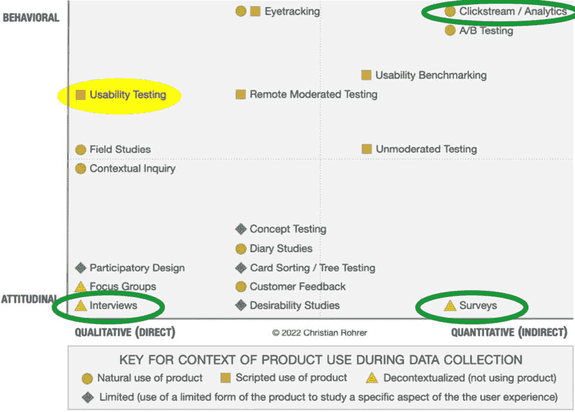
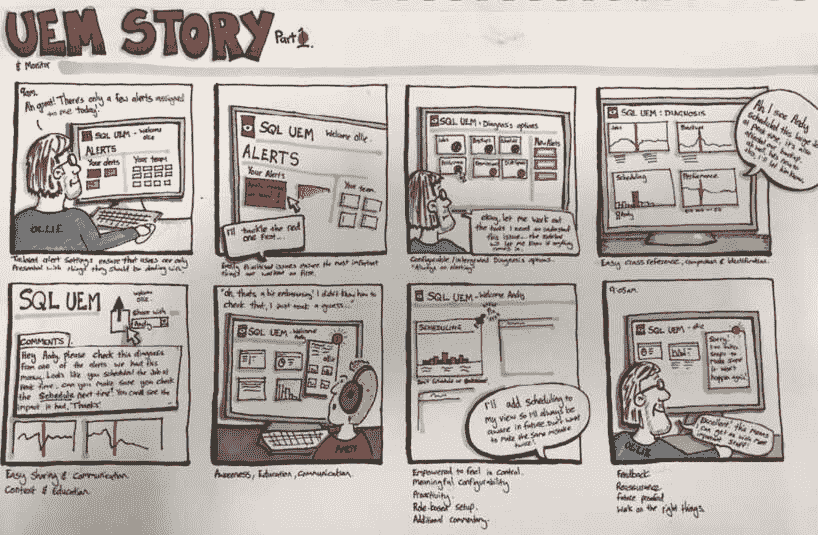
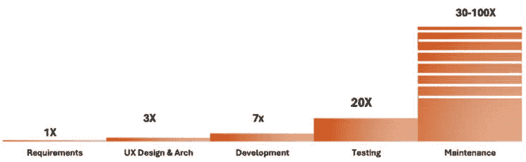
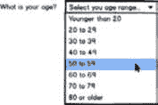
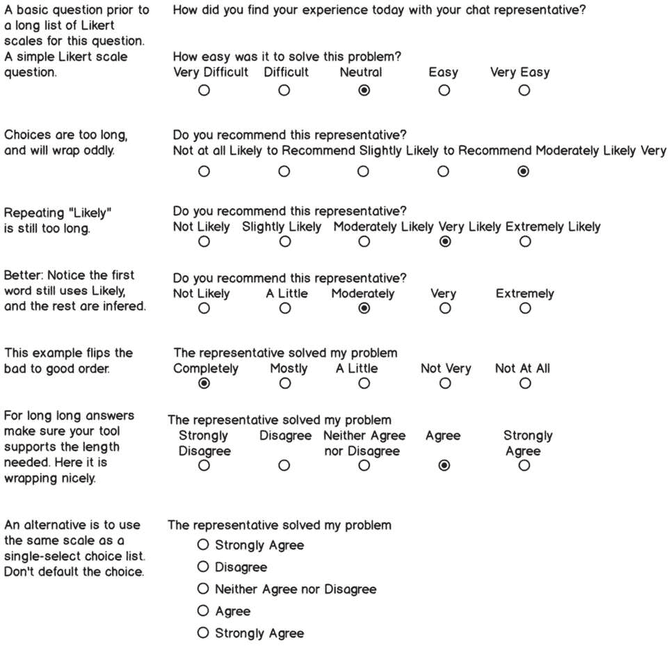
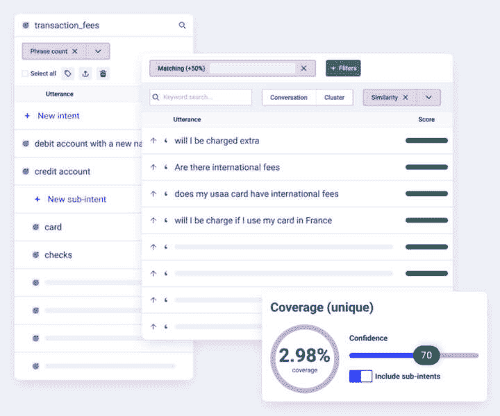
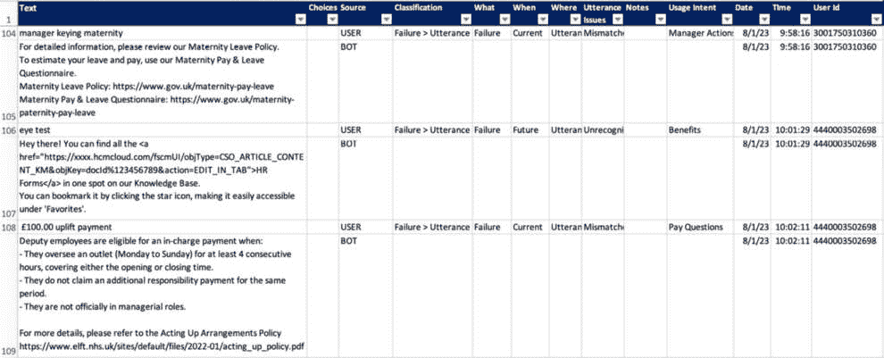
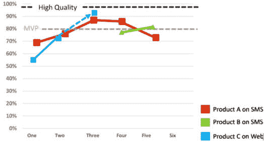

# 进行有效的用户研究

我们都想要立即深入工作——这是人的本性。有计划的努力会更有价值。如果这个计划包括对用户有深入的理解，那么任何努力的价值都会得到回报。这就是用户研究发挥作用的地方。让我们利用这个领域的专业知识来理解用户的需求，倾听问题，然后推动解决方案。探索一些基本方法，了解ChatGPT项目该往哪里走。在开发圈子中有一个众所周知的谚语，即改变在开发过程的每一步都会呈指数级增加成本。所以，为什么不采取适当的初步步骤，以减少后续的昂贵变更呢？这并不意味着你不能适应和改进。

*LLM的世界完全关于精炼和渐进式改进*。让我们从正确的起点开始，以减少复杂性和成本。我们可以通过更多地了解客户将如何使用产品，哪些需求将是关键的，以及解决方案需要深入到什么程度来实现这一点。

我们不会对所有可能存在的用户研究方法进行概述。但我们总是鼓励进行更深入的探索。让我们探讨一些主要话题，这些话题对于研究投资的价值最大：

+   调查用户体验研究方法

+   理解用户需求分析

+   创建有效的调查问卷

+   设计有洞察力的访谈

+   尝试对话分析

# 调查用户体验研究方法

本节将重点关注一些流行的用户体验研究方法。

我希望尊重所有可能的方法。我们倾向于选择技术来解决特定问题，但并不是所有方法都适用于所有情况。但提醒自己有选择是好的。这里所涵盖的只是冰山一角。

文章：[研究方法概述](https://www.nngroup.com/articles/which-ux-research-methods/) ([https://www.nngroup.com/articles/which-ux-research-methods/](https://www.nngroup.com/articles/which-ux-research-methods/))

从那篇文章中得到的启示是要注意我们的审查方法在尼尔森·诺曼集团文章的克里斯蒂安景观图上的位置，如图*2.1*所示。

我画出了我们将要讨论的三种方法，并突出了**可用性测试**。我们将在本章中讨论的方法，对于决定要构建什么以及开始构建一个随着时间的推移与客户互动的集合提供了最大的价值。可用性测试也是至关重要的；当我们有东西可以测试时，它将发挥作用。一旦我们有了产品，我们将讨论方法和工具来帮助评估LLM解决方案的质量。



图2.1 – 用户体验研究方法的广泛景观

更多关于用户体验研究方法的内容

尝试一些研究方法书籍，以进行更深入的探索，这有助于设计生成式AI解决方案。

书籍：[深入探讨用户体验研究方法](https://amzn.to/3zYtzN1) ([https://amzn.to/3zYtzN1](https://amzn.to/3zYtzN1))

我们投入精力进行研究，以了解用户的需求。我们不问他们想要什么；我们学习他们的需求，并利用这些需求来推动设计和功能决策。这就是需求分析，我们将在下一节中讨论。

# 理解用户需求分析

让我们回顾一下**需求分析**的基础知识。需求分析帮助我们识别、评估和优先排序用户的需求和需求。我们希望了解用户的成果，并确保我们能够应对他们将要面临的挑战。产品经理通常领导这一产品定义，但一个由设计师和研究人员组成的跨学科团队有助于提高成果。

我们希望通过将ChatGPT引入我们公司的资源库中，实现一些重大的成就。让我们确保我们知道这将如何解决用户旅程中正确客户在正确时间面临的**真实**问题。在本书的后面部分，我们将深入探讨确保我们为那些经常使用我们的服务并解决重大问题的正确客户提供服务。现在，让我们了解需要什么，并收集一些关于ChatGPT解决方案可能解决我们产品中差距的知识：

1.  **定义目的**：通过引入LLM解决方案，我们想要实现什么目标？一个服务示例可能是通过引入聊天助手来解决简单问题或收集信息，然后再将其转交给人工客服，从而降低成本。但这并不是用户的目标。用户的目标是以尽可能快和准确的方式解决问题。而且不是通过解决错误的问题或使事情变得更糟来使事情变得更糟。这是他们从老板的角度来看的。销售的需求分析可能表明，达成交易的时间比行业平均水平长30%。那些佣金基于达成交易的销售人员应该希望推动他们的流程，因此缩短交易时间的目标有助于他们和公司。

1.  **识别利益相关者**：识别并涉及利益相关者，包括最终用户、客户、决策者以及其他对产品或服务感兴趣的人。这很重要，因为我们所讨论的方法可以应用于客户和内部决策者。

1.  **用户画像**：创建代表不同目标受众群体的用户画像或角色。注意不要将客户描绘成漫画化的人物。避免那些会分散用户与系统之间联系的描述。例如，如果角色或画像包括他们在上班途中在当地的咖啡馆喝咖啡，让我们确保这与用例相关。稍后，当我们想要根据经验水平、工具的先前使用或技术理解来调整信息以适应用户的个别需求时，我们应该能够利用这种知识在画像中调整对话风格和语调。如果喝咖啡只是因为你认为这很酷，那就去掉它。

1.  **进行调查和访谈**：通过调查、访谈或焦点小组讨论直接从用户那里收集信息。提出开放式问题以了解他们的目标、挑战、偏好和期望。提出具体问题以轻松地细分和量化结果。这对客户和内部利益相关者都很有用。

1.  **观察用户行为**：进行可用性测试或观察用户与*现有*系统或原型交互。分析他们完成任务的方式，识别痛点，并遵循他们行为中的任何模式。我们将在日志分析讨论中看到一些这方面的内容。生成式 AI 解决方案不一定已经运行起来，因此请使用其他渠道来分析用户行为并收集这些数据。

1.  **分析反馈和支持数据**：审查客户支持渠道、用户评论、博客文章以及任何其他可以提供对用户问题、关注点或建议洞察的信息来源。这是一项耗时且难以量化的任务。分析现有的日志文件也是耗时的工作，但更容易量化。我们将深入挖掘像聊天日志文件这样的数据源。

1.  **定义用户故事**：**用户故事**是描述用户与系统交互的叙述，侧重于期望的结果和用户目标发生的背景。让我们简要探讨这一点，并将大部分内容留到下一章。使用案例或以案例驱动的开发和设计在以客户为中心的公司中很普遍。这被鼓励作为一种比上述第三项中讨论的配置文件方法更系统化和战术性的方法。有些人会制作卡通或像漫画书一样视觉化地编写故事。这些非常受欢迎，并允许广泛的受众快速掌握目标。Chris Spalton 的这个例子提醒我们，我们不必总是从规格开始。我们也可以使用我们的创造力和视觉方面来解释我们的故事。*图 2.2* 展示了 Chris 将 UX 概念表达为故事板的例子。

    文章：[使用漫画条展示 UX 概念](https://uxdesign.cc/using-comic-strips-and-storyboards-to-test-your-ux-concepts-cccad7ac7f71) by Chris Spalton ([https://uxdesign.cc/using-comic-strips-and-storyboards-to-test-your-ux-concepts-cccad7ac7f71](https://uxdesign.cc/using-comic-strips-and-storyboards-to-test-your-ux-concepts-cccad7ac7f71)):



图 2.2 – 作为漫画条的 UX 故事示例

1.  **优先考虑用户需求**：根据其重要性和对用户体验的影响，优先考虑已确定的需求。这可以在设计和开发过程中“驱动关注”。我们将通过提供一个可重复使用的工具来解决这个重大问题来深入探讨这一点。

1.  **创建用例**：开发描述用户与系统之间逐步交互的用例。这有助于可视化用户如何完成特定任务。Alistair Cockburn的《编写有效的用例》是教授用例设计的权威指南([*第3章*](B21964_03.xhtml#_idTextAnchor058)，*为ChatGPT*识别最佳用例)。

    书籍：[Writing Effective Use Cases](https://amzn.to/3YnbGSp) ([https://amzn.to/3YnbGSp](https://amzn.to/3YnbGSp))

1.  **文档研究**：整理并记录用户需求分析的结果。这份文档为设计和开发团队提供了参考。

1.  **迭代过程**：用户需求可能会演变，因此分析应被视为一个迭代过程。定期回顾和更新用户需求，以适应不断变化的需求和用户期望。

注意

无论如何实施，ChatGPT解决方案在可预见的未来仍需要精心照料和培养，因此在生产中应计划定期进行交互。这可能是一周或更快。这在本章的[*第11章*](B21964_11.xhtml#_idTextAnchor236)中进行了回顾，*过程*。

通过彻底理解用户需求，您可以调整产品或服务以满足目标受众的期望，提高用户满意度和整体成功。不太可能有人会使用或需要列出的所有步骤。*这就是为什么我们可以将设计思维应用于我们的问题。不要为每个项目重新发明轮子。选择和选择工具来解决团队理解中最重大的差距*。

记住，这是进行更改的时候。一旦产品建成并发货，提高质量的成本就会呈指数级增长。对问题的早期理解越好，决策就会越好，对组织的成本就越低。这并不是说我们不会在发货后继续改进解决方案，但后期阶段的增量更改成本更高。

*图2**.3* 展示了在从一步开发到下一步开发的过程中如何考虑变更成本。我们在需求上不可能全部做对，使用ChatGPT解决方案，我们期望通过迭代来达到正确，但它提醒我们每一步的学习都有价值，因为学习和修复的成本会迅速增长。



图2.3 – 变更成本在每一阶段都会上升

我更喜欢专注于少数几个基本方法，并在研究生成式AI解决方案时提供一些额外的技巧和窍门，使它们更有效。让我们深入了解我们工具包中的第一个工具，它有时帮助我们细化需求分析：一份调查。

创建有效的调查

在所有可用的方法中，为什么选择**调查**？构建调查存在挑战，但当一个新项目开始时，有时几乎没有数据来帮助围绕用户需求形成设计**空间**。与其仅仅依赖客户反馈，有远见的领导者和设计创新者预测需求并创造客户可能没有想象到的解决方案。苹果公司的联合创始人史蒂夫·乔布斯曾说过：“人们不知道自己想要什么，直到你把它展示给他们。”但对我们中的一些人来说，当我们开始时，我们需要一个线索知道该去哪里，要解决什么问题，或者帮助决定哪些问题解决最有价值。我们不建议询问客户他们想要什么；我们想要提出问题，帮助我们了解他们的需求，以及当前的产品和服务在哪里未能满足他们的需求。我们不问他们如何解决问题。让我举一个如何提出错误问题的例子。

吉姆正在厨房里做饭，这时凯莉从跑步回来。他们俩都伸手去拿柜子上的橙子。他们都想要那个橙子。吉姆建议把它切成两半。凯莉说这样不行。凯莉问：“你打算怎么用这个橙子？”吉姆回答说：“我在做饭，需要橙皮。”凯莉说：“太好了，你可以拿整个橙皮，而我将吃橙子内部，因为我刚从健身房回来。”

这不仅仅是关于谈判和冲突解决；理解用例是至关重要的。如果设计团队知道某人想要如何使用一个产品，你可以帮助设计一个更好的产品。我们不会在调查中问“你需要什么”。我们专注于理解意图。一旦我们有一些可以分享的生成性输出，我们可能会调整风格和语气，使其更好地引起共鸣。在发布软件（或通过在软件或服务中嵌入调查）后进行一项调查，并征求他们对体验的反馈是很常见的。在任何情况下，都要提出质量高、无偏见的、你知道如何分析结果的问题。

编写调查是一项科学，也是一项专业知识。即使是专家也能从该领域的科学中受益。我们为此提供了资源。

书籍：[问卷设计](https://amzn.to/3AemWWY) 由 Bolton 和 Bolton 著（第5版，2022年）([https://amzn.to/3AemWWY](https://amzn.to/3AemWWY))。

## 对话式人工智能的调查

调查非常适合扩大对新或新颖领域客户的理解。我们只能提供通用的问题和睿智的建议。特定于您领域的问题必须由您提供。但有一些问题我们不应该问。我们在清单中涵盖了一些内容。例如，不要问，“你想使用对话式人工智能来回答问题吗？”或者“我可以基于算法或生成式人工智能分析提供推荐吗？”。这些问题让我们回到了我们询问客户是否想要一匹更快的马的时代。马不是答案；一辆他们无法想象的车，才是解决方案。

将焦点问题放在客户的问题上，他们解决这些问题的挫败感，或者他们用来与公司互动的工具和技术。这是一种深入了解他们如何体验品牌以及深入探究为什么和如何的方法。通过推荐用户界面，你可以在调查中探索风格、语气和内容。调查用户对不同推荐的可能反应，以及哪些推荐更有价值（通过给出多个例子并要求他们选择最有用的一项），推荐何时最有帮助，甚至如何分享它（当我们知道时，我们应该通过电子邮件发送给用户，还是只在他们到达交易页面时在用户界面中显示？）。这是一个询问为什么的绝佳机会。让他们填写为什么他们做出选择的详细信息，并花时间组织和评估这些反馈。在做出推荐之前进行这项研究，因为如果我们的目标准确，用户可能只会接受未来的改进。从坚实的基础开始。这项研究将决定如何形成提示，收集分析所需的数据，并生成结果。我们可以深入研究在开发调查时需要注意的问题。

## 调查清单

我们直接进入调查技巧，假设有一定的调查专业知识；如有需要，请获取我们的资源。如果您有基础知识，请继续，因为这是一些我们在构建有效调查时有时需要记住的课程集合。一个设计不良的调查可能比没有调查更糟。它可能会给人一种虚假的希望感，并引导团队做出错误的假设。构建解决方案所需的所有人都会在调查中处于极佳的位置做出贡献。对话式作家、设计师、研究人员、产品所有者和经理都将从一项精心完成的研究结果中获得价值。因此，请确保他们参与帮助创建问题。以下是一些确保有效调查的清单项。

+   **只问你知道如何分析的问题**：计划分析每一个问题。这迫使每个问题都有一个目的，当需要裁剪时，判断其价值就更容易了。

+   **不要提出引导性问题**：让用户形成自己的观点。问，“你对今天早些时候的支持体验满意吗？”不要问，“考虑到我们的优秀支持流程和员工在处理问题方面的改进，你对最近的互动满意吗？”

+   **问题越简单，用户回答起来就越容易**：多项选择（a, b, c, d）和简单选择（a或b）问题更容易、更快地分析。尽可能使用它们，并在可能的情况下重新设计开放式问题。

    简单的选择性问题应该是直接的。尽量避免使用是/否问题。

    我们在UI中避免使用是/否问题，因为它们需要更多的认知努力。这里有一个来自银行业的例子：

    ```py
    Do you wish to cancel your transfer? [ Yes ]  [ No ]
    ```

    而我们应该使用这个：

    ```py
    Do you wish to cancel your transfer? 
    [ Cancel Transfer ]   [Continue Transfer ]
    Were you happy with your support call today?  [ Yes ]  [ No ]
    ```

    而应该使用这个：

    ```py
    Were you satisfied with your support call today? 
    [ Satisfied ]  [ Not Satisfied ]
    ```

    这比引导性问题更直接。决定调查需要什么样的结果。

+   **选择性问题应该是文氏图完整的**：这是我幽默的说法，意思是确保问题选项覆盖所有可能的后果。这可以避免有人尝试回答问题，却看不到与他们的用例相匹配的响应。看看这个：

    ```py
    What is your current age?
        Younger than 20
        20 to 50
        Older than 70
    ```

    哎呀！问题遗漏了一组用户。这是一个明显的例子，但不要惊讶这种情况发生的频率。当有一个长列表（比如，5到10个选项）覆盖90%以上的答案时，包括一个“其他”选项，他们可以可选地填写一个文本答案来详细说明其他答案。手动输入确实需要更多的分析工作。

    结果有时需要归一化。如果你问了一个关于客户最喜欢的流媒体服务的问题，例如没有包括迪士尼，他们可能会选择“其他”，然后输入答案，如“迪士尼”、“迪士尼+”、“Disney+”、“华特迪士尼频道”。结果必须汇总成一个答案。尽量在答案选项中做到完整，以避免这个问题。

+   **当需要完成可能的用例时，包括一个“不适用”选项**：这将通过不强迫用户选择错误答案来确保更好的结果。

+   **考虑需要哪些问题**：大多数问题通常需要用户不能意外地跳过整个部分。

+   **在选择题列表中创建平衡（单选）**：

    让我们用一个例子来询问年龄范围：

    ```py
    What is your current age?
        < 20
        20 to 30
        30 to 50
        50 to 60
        60 to 70
        > 70
    ```

    几个问题值得关注。首先，我们可能试图排除某个特定群体（可能只需要20岁以上的成年人），因此该群体包含20年，这可能没问题。因为我们对老年群体感兴趣，所以我们把这些部分分解成10年一个段，但年轻群体我们使用20年作为一个组。请注意这些决定。使用一致的组，特别是在范围的中间，并且用这些一致的组超出范围。让我们使用70-80岁组，然后是80岁以上组。这样，当数据被图表化时，它会被更好地分割。然后，图表不会在30-50岁组显示出显著的峰值，这可能是由于该组是其他组大小的两倍。最后，预期要对这类数据进行交叉表分析（例如，比较年龄范围与收入以验证是否针对正确的受众群体，然后绘制图表）。因此，一致的组大小会使该图表更具吸引力。但如果客户是30岁，他们应该选择哪个选项？我们不希望有重叠的值。假设这些较大的组是数据边缘的小、不重要的组（几个百分比或更少）。

    我会这样修改：

    ```py
    What is your age?
        Younger than 20
        20 to 29
        30 to 39
        40 to 49
        50 to 59
        60 to 69
        70 to 79
        80 or older
    ```

    这作为一个下拉菜单是好的。每个人都知道自己的年龄。他们不需要在屏幕上比较答案，可以快速从列表中选择。我们没有询问他们的年龄，所以我改变了提示。它占用的空间更少，用户体验更干净。我移除了那些大于和小于的箭头，并使用了英文。没有必要让他们努力理解像<或>这样的符号来选择一个简单的答案。我选择了20到29岁这样的范围，而不是21到30岁。这与我们的说话方式一致（20多或30多岁的人）。



+   **如果下拉菜单默认选择一个答案，那么用户就不需要选择一个选项，这可能会影响结果**：因此，在这些情况下，确保你使用的软件默认为未选择状态，如上图所示。

+   **在询问特定问题（如年龄）时，数据总是可以在之后合并。如果问题使用分组，之后就不能更改分组**：分组在你想要关联数据时很有用。例如，对于技术支持客户，人们想知道他们拥有多少产品。如果从他们的账户信息中已知，就不需要询问这个问题。它可以与他们在网站上使用的次数或每个产品论坛上的帖子数量相关联。这些信息可能有助于解释他们的专业知识水平。使用这些信息来调整生成答案的详细程度、风格或语气。在GUI中，系统可以提供专家建议而不是新手UI。它还可以进一步适应，只为用户的新产品提供新手生成建议，并为已知他们经常使用的产品提供更高级的建议。然后根据他们对这些建议的使用进行调整。

+   **显示所有多选选项，并保持整个列表在屏幕上可见**：在有众多选项的情况下，特别是如果对选择数量有限制，所有选项都应该可见。如果不这样做，用户可能会达到最大选择数，然后看到其他答案，这会导致他们需要重新调整选择，他们可能不会费心去做。因此，通过确保所有选项都可见，他们可以扫描并决定选择哪些。

+   **使调查简短**：在完全设计后，尝试将其减少30%。寻找不需要再次提出相同问题的地方，或者询问不需要的问题。在某些情况下，以稍微不同的方式再次提出相同的问题，以验证第一次回答。

+   **在调查中使用分支，以将特定用户集中在特定问题上**：如果用户的回答走向一个方向，我们就不需要让他们在另一个方向上回答额外的问题。这是不必要的。例如，只向iPhone用户提出有关iPhone的问题。请不要向他们提出不适用的问题，如Android问题。

+   **抵制收集不必要的人口统计信息（年龄、位置、也许性别）的冲动**：如果它不会增加分析的价值，就别问。

+   **查看是否存在调查机制，例如季度客户调查**：在这种情况下，向现有流程中添加问题，并获取结果，而无需运行新的调查的开销。当然，这将在他们的日程安排上，并且在某些方面会受到限制，但它可能是一个选择。

+   **使用带有中间值的锚定利克特量表进行评分**：可以使用多点量表询问意见、感知和行为，通常为每个或某些值提供标签（锚点）。我建议使用1到5的范围，最多1到7（除了净推荐者得分之外，不要更多）。锚点是量表两端的标签（差到好，以及如果合理定义，则为常见UX问题周围的易用性问题：非常困难，困难，中立，容易，非常容易）。我们在使用后的一题调查中看到这些，例如：“请对我们的聊天助手今天的使用体验进行评分。”

    SurveyMonkey的入门指南对于一些基本内容来说很容易理解。

    文章：[SurveyMonkey的利克特量表入门](https://www.surveymonkey.com/mp/likert-scale/) ([https://www.surveymonkey.com/mp/likert-scale/](https://www.surveymonkey.com/mp/likert-scale/))

+   **利克特量表的强力技巧**：在一组量表中改变1的含义。一些1可以代表不良或较差的概念（非常困难，从未，不推荐），而一些可以代表正面或好的选项（非常容易，总是，强烈同意）。这迫使用户阅读并审查每个量表。如果没有注意到，数据无效，但同样，如果他们阅读并使用相同的选项标记所有内容，那么也没有价值。

+   **用试点用户（友好用户）测试调查**：验证措辞、语法和流程。检查所有分支并审查结果以确认它们是有效的。鼓励他们坦率地反馈。

+   **考虑为顾客和内部利益相关者设计不同的调查**。利益相关者可能深刻理解顾客的需求，收集利益相关者的反馈，并将这些数据与顾客结果分开。

+   **考虑添加一个关于参与未来用户研究活动的最终问题**：这可以为访谈、用户测试或参与式设计会议生成额外的客户来源。

+   **不要打扰顾客**：公司有规定。发送一封电子邮件和一次跟进可能是可以的。但我们不建议发送更多。如果顾客没有时间回复第二次请求，就放弃。此外，跟踪用户响应（许多工具允许这样做），只向尚未参与的人发送跟进。

+   **不要期望调查的回复率超过10-20%**：如果公司允许，可以激励顾客。给每个参与者发送礼品卡既昂贵又耗时。将顾客登记在抽奖活动中并仅分发少量重要激励措施（我过去曾赠送过iPod；根据调查的复杂性，100美元的礼品卡或更多是合理的）可能更节省时间和费用。这可以稍微提高回复率（但也要求调查包括姓名和联系信息）。如果通过给100名参与者发送电子邮件，只有5%的回复率，将没有足够的主语来获得有价值的结果。我们将在稍后讨论参与者的数量。

+   **没有关于需要多少受访者才能获得可靠数据的良好规则**。由于一些调查问题是主观的和定性的，一个特定项目可能需要30到200个答案。然而，一个更广泛的调查，包括分支和多个受众群体，可能需要1000个或更多的受访者以在每个分支上获得足够的结果。对于统计上具有显著性的定量结果，需要使用统计学书籍中的数学来计算所需的受访者样本量。

+   **一些调查示例**：*图2.4*展示了问题和用户界面如何交互。学习如何使用调查工具的功能以获得最佳结果。我强烈建议使用一些已经存在了一段时间的强大第三方工具。大型公司的内部调查工具可能缺乏部署高质量调查所需的鲁棒性和灵活性。



图2.4 – 利克特调查问题的示例

+   **如果需要清晰度，请咨询ChatGPT**：它拥有大量关于创建调查的知识。用它来了解如何设置调查流程以及如何编辑问题使其清晰简洁。然而，正如我们将在本书中看到的，生成式AI的结果也可能偏离目标，所以请确保你理解其结果。这里有一个尝试的例子。

    ```py
    I want to ask in a survey how the agent performed in a support session. How would I ask this question and use an anchored Likert scale to collect responses?
    ```

现在，让我们应用这些知识来学习如何制定一个有效的调查。

# 有效的调查案例研究

我根据一封关于我使用的产品的电子邮件在我的手机上完成了一份调查。他们给了我大约20个李克特量表。我不想截图供应商，因为没有理由让他们难堪。我可以设定场景。这是一份一页的调查，专注于我使用他们的在线服务。页面上没有问题，只有像国际化、报告和审计、性能、记录集成系统和Web界面这样的标签，从1（较少）到7（优秀）。我们不会提及公司，但许多人使用他们的产品。我们将它们称为CircleRize。

让我们讨论从这个案例研究中学到的积极和消极方面。

积极方面包括以下内容：

+   在这个页面之前，他们问了一个净推荐值问题（1到10的刻度）。我们将在[*第10章*](B21964_10_split_000.xhtml#_idTextAnchor216)“监控与评估”中更详细地介绍净推荐值。这个单一的市场研究问题决定了客户是否会推荐一个公司或产品。

+   他们对问题使用了1到7的合理范围。

+   他们标记了1和7的锚点。了解它们的含义是好的。

+   他们为项目提供了标题。

消极方面如下：

+   那些锚点？他们使用了“较少”和“优秀”标签。这些不是对立的。它们需要平衡和清晰。我不知道“较少”作为与“优秀”一词的锚点意味着什么。他们是指“差”吗？

+   问题没有“不适用”选项。我被迫回答我不理解的问题，例如关于记录集成系统的问题。他们可以通过将20个问题分成组并根据产品使用问题进行分支来消除混淆。他们还应该使用我能理解的语言。

+   在实际的调查页面上没有问题。它是一个标记为“功能排名”的页面。我需要通过查看页面标签来获得澄清。我最初以为他们想让我按重要性对每个项目进行排名（Web UI比国际化更重要）。然后我意识到他们是在询问个人评分。需要更好的措辞来使其清晰。

+   我不知道如何回答没有上下文的问题，例如“国际化”。他们是否想看看我是否使用它、需要它，甚至注意到它被支持？没有实际的问题被问及，只有像“国际化”这样的通用标签。我完全不知道他们想要什么。

+   除非他们计划定期提问，否则他们期望从这次调查中学到的东西不清楚。例如，调查可以询问性能以衡量改进或退化。这些问题必须在随后的调查中重复，以查看时间上的差异。

+   本次调查的电子邮件主题为“审查您的CircleRize计划，获得25美元礼品卡！”。我最初将其理解为“检查您与我们CircleRize订阅的详细信息是否正确”，而不是他们原本意图的“提供您使用CircleRize计划的体验反馈”。我建议用词要明确。他们应该清楚地标记电子邮件，以减少混淆并提高参与度。

抛出一些简单问题，其背后远不止表面看起来那么简单。这个调查的结果，可能发送给了像我这样的正在查看各种计划的客户，是毫无价值的。比花费时间和精力进行这项调查以及浪费客户时间更糟糕的是，他们不知道更好的做法，很可能会用这些数据来做决策。用户测试或更有经验的人可能会捕捉到这些问题。很难说为什么这些问题会出现。利用您的资源创建有效的调查。如果每个人都点击四分（中间值）因为不理解问题，那么这将是一大笔努力，却不会带来很多回报。

我们已经讨论了要问什么和不要问什么，但具体的例子更有帮助。我们不知道您的用例，但我们可以提供如何使用ChatGPT解决客户问题的建议。

在调查中通常会提出的一些问题以及它们可能的分析方式。

+   人口统计信息：

    +   **示例**：年龄、性别、教育水平、产品使用年数、专业知识

    +   **分析**：风格或语气可以与对支持的期望、专业知识水平、年龄和其他人口统计信息相关联

+   多选题：

    +   **示例**：对您来说，服务最重要的三个属性是什么？

    哪些产品给您带来最多的麻烦？

    他们已经使用的竞争对手产品列表。

    +   **分析**：判断用户目标；准确性可能是其中之一，但在他们使用背景下的可用性比与其他服务的集成更重要。需要适当的选项，以免大量数据进入“其他”类别。调查可以探索客户使用并喜欢的其他产品，以了解竞争对手可能的优点。

+   李克特量表（1到5，1到7的量表，带有标记的锚点）：

    +   **示例**：您今天对客服电话的满意度如何？

    您对产品x的经验水平如何？

    向代理或机器人提供机密信息的舒适度。

    对服务水平、响应速度、可用性、准确性和成本的满意度。

    +   **分析**：寻找改进支持的机会，并在改进或变化发生时衡量整体质量。确定24/7支持和服务水平之间的权衡。

+   净推荐值：

    +   **示例**：在0到10的量表上，您有多可能向朋友或同事推荐[公司、产品或服务]？

    +   **分析**：这是一张快速的客户情绪快照，可以轻松地与其他公司或服务进行比较，或用作改进的基准。[*第10章*](B21964_10_split_000.xhtml#_idTextAnchor216)，*监控与评估*将更详细地介绍这一点。

+   开放式问题：

    +   **示例**：你最喜欢流媒体服务有什么特点？

    告诉我们您使用产品Y的最佳体验。

    告诉我们使用产品X时的任何恐怖故事。

    +   **分析**：这是一个与竞争对手进行基准测试的机会；开放式问题有助于深入了解一个感兴趣的领域。这可能是对探索他们使用的竞争性产品多项选择题的后续问题。向他们提出具体问题。这可以与上述人口统计问题相关联，以确定特定人口群体更有可能享受不同的服务。这些需要更多的努力来分析、分类和关联。

+   定量数据：

    +   **示例**：你每天在我们网站上花费多少小时？

    上个月你为流媒体服务支付了多少钱？

    您每月的汽车贷款是多少？

    你上次是什么时候给我们发邮件寻求支持的？

    在技术支持电话中，多长时间算太长了？

    +   **分析**：关于每天小时数的问题与表面看起来的不一样。可以对他们在网站上花费的时间进行数据分析；这更多是关于感知。如果他们报告的少于他们支付的，或者报告的比实际多，比较实际使用数据可能会有所帮助。这也可以与他们在网站上进行的各种活动信息交叉对比。这可能揭示某些活动比其他活动耗时更长，并有助于了解如何投资资源以减少耗时活动。通过客户数据，你可以将感知时间、成本和使用与实际时间、价格和使用相关联。这可以解释客户的感知是否与期望相符。

+   趋势：

    +   **示例**：以下哪些在线支付服务您使用过？

    +   **分析**：调查可以捕捉竞争信息。这些数据可以用来研究合作伙伴机会或了解特定人口群体如何看待某些趋势。

+   行为：

    +   **示例**：访问我们网站的主要原因是？

    如果你今天要告诉朋友你对客户支持的经验，你会说什么？

    你在社交媒体上发布关于产品Y的可能性有多大？

    +   **分析**：希望这是一个简单的单选题列表，但它可以分支到更详细的细节（例如，他们是否遇到产品问题、寻找新产品、下载某些内容或提供评论）。

+   比较分析：

    +   **示例**：将这些五个服务按对您需求的价值排序。

    以下哪些销售信息最有价值？

    按从最理想到最不理想对以下属性进行排序。

    哪种表述方式让您感觉最自然？

    +   **分析**：让客户对功能进行排名比让他们对它们进行评分要好。排名只将功能按重要性排序。这并不能帮助你了解它们有多重要。排名问题对用户来说很难回答。将排名限制为五个项目，但如果某些项目被认为是相同的，强迫排名可能会引起挫败感。这类问题可以用来尝试不同的风格和语气。看看是否有与人口统计或其他信息的关联，以创建适合对话风格的定制角色。在有效写作中有很多心理学。

哇！希望这没有太多需要处理而没有提供成为调查专家所需的所有培训。增长专业知识，利用资源，与其他专家合作，并做你需要做的事情！当是时候进行调查时，请返回此处并勾选项目以确保得到一个可靠的研究结果，团队可以信赖。

正如提到的，调查是遇到值得采访的人的好地方。这真是一个很好的过渡，让我们讨论下一个用户研究方法：访谈。

# 设计有洞察力的访谈

**访谈**可能不是你的首选，但我们鼓励探索访谈作为理解用例的有价值工具。使用调查收集一般信息，并进行点击分析（或日志分析）以获取实际行为。访谈对于获得对客户的整体感觉至关重要。它有其缺点：难以扩展，结果更容易被解释，有时很难获得正确的客户组合。优点是你在客户身上获得的感觉，以及在设计过程中作为客户倡导者所体现的同情心。这将丰富项目。在调查中，考虑以关于参与未来用户研究的问题结束。尽管这是自我选择的，但几乎总是有益的。

可能会有时间进行五到十次访谈，但大多数团队不太可能投资超过20次。针对正确的受众是有价值的。设置访谈的成本可能比进行访谈所需的时间（典型会议持续30到60分钟）更为显著。客户很忙，与现有客户合作时，激励可能不是一种选择。他们往往需要重新安排，因为这对他们来说是一个低优先级。尽管有缺点，我仍然推荐访谈过程。

在处理对话解决方案时，不要期望通过共享演示或视觉内容来获取反馈。请他们在面试期间准备好现有产品或网站支持站点。通过介绍一些用例可以围绕增强机会进行讨论（关注他们的需求，而不是他们的解决方案）。不要将他们限制在被认为是AI问题的事情上；如果他们去其他地方，请接受他们的反馈，转交给团队（或代表他们提交错误报告或增强请求），然后将他们的讨论重新聚焦。建立一个关系，让他们信任您正在努力帮助公司帮助他们完成工作或任务。

构建一个支持收集所需信息的面试框架。如果您正在尝试构建一个围绕支持方面的对话助手，那么重点在于理解他们在试图获取答案时遇到的复杂性。如果您正在构建一个推荐引擎，那么寻找讨论他们目前获取推荐的地方、谁提供这些推荐以及他们信任这些信息的程度。也许的想法是替换或改进现有提供销售信息（成交可能性、定制解决方案的发货时间表、促销捆绑优惠、产品推荐）的算法。然后，关注他们何时需要这些信息，哪些渠道有助于或令他们烦恼（短信、电子邮件、自动电话呼叫或网站），以及信息在流程中的位置或展示频率可能如何影响他们的观点。

有许多面试脚本示例。将这些模板适应到面试脚本中，注入适当的内容。

文章：[示例用户面试脚本](https://guides.18f.gov/ux-guide/interview-script/) ([https://guides.18f.gov/ux-guide/interview-script/](https://guides.18f.gov/ux-guide/interview-script/))

让我为您介绍一些面试的技巧和建议。

## 定义研究目标

明确说明面试的目标和目标。例如，通过调查，我们想知道为什么在事先提出这些问题。请保持面试专注于适合面试流程的结果。请不要将其变成现场调查。如果您需要人口统计信息，请提前获取。这种预面试允许根据结果调整面试。

面试可以使用样本、演示或视觉材料。但目标是让他们开口说话，并给出反馈、见解、知识和智慧。利用这个机会深入了解，并适应他们的说法和表达方式。他们回答的方式可能会有细微差别，这可能揭示隐藏的真相。探索现有的或之前的客户互动、竞争产品的使用和反馈、风格和语气讨论，以及大量的用例示例，如调查中所示。然而，与调查不同，要深入挖掘，轻松调整或深入追问问题，即兴登录网站，展示不同的示例，并尝试更深入地理解和同情客户。

## 选择参与者

根据研究目标定义目标参与者群体。确保所选参与者具有与研究主题相关的知识或经验。如果他们是现有客户，考虑客户档案（长期客户、新客户、拥有大量产品的客户、仅拥有特定产品的客户、提交大量故障报告的客户、技术型、非技术型、通过社区网站自助服务的客户等）。建立寻找和面试正确受众的流程。有时，调查可以解决这个问题。以下是一些有助于这一过程的提示：

+   为10到20名参与者的面试安排比所需时间多20-30%。如果有人取消，你不必重新开始招募过程，结果也不会延迟。如果幸运地每个人都到场，不要取消；这不尊重人。要么遵循流程，要么寻找机会通过不同的提问方式扩展理解。也许可以进一步深入到之前受访者没有时间探讨的领域。

+   如果贵公司有人负责招募和安排，那就太好了。预计招募所需时间将长于实际面试时间。因此，在安排中要考虑到这一点。还有外部公司可以协助招募。

+   不要将面试安排得过于紧密。中间留出一个小时。这样，如果客户同意，可以加班，同时也有时间在记忆清晰时写下额外的笔记。

+   我为一个项目进行的最多面试是20个。没有规则可以确定正确的数量；在广泛的主题领域或许多不同的客户档案中，需要更多的受访者。然而，与折扣可用性方法一样，重叠的反馈将开始占主导地位，你不想在面试进行到10%时，反复注意到相同的结果。如果这是一个用户测试，我们有数据表明，对于某些测试，五个受访者就足够了。然而，面试比使用软件产品要少一些结构，因此要考虑成本效益权衡。阅读这篇文章，了解如何应用折扣可用性方法，这是一种用于迭代小型研究的实践，即使在面试过程中也很有用。

    文章：[折扣可用性方法](https://www.nngroup.com/articles/discount-usability-20-years/) ([https://www.nngroup.com/articles/discount-usability-20-years/](https://www.nngroup.com/articles/discount-usability-20-years/))

高级技巧

为了提高出席率，在会议前一天打电话（实际电话），提醒他们会议时间。他们可能会欣赏这种个性化的确认方式，如果他们不能出席，他们可能会立即告诉你，这样你就不会坐着等待。到了时间，提前五分钟加入网络会议（我假设大多数会议都是通过网络会议进行的；如果他们是面对面的，那太好了！），并再次发送带有链接的消息。“我提前几分钟加入，以确保我准备好让你加入。我期待几分钟后的会议。”

## 制定结构化面试项目

创建一个**详细的面试项目**，包括标准问题和可选后续问题。问题应该是清晰、无偏见，并旨在获取必要的信息。请鼓励他们大声思考并扩展他们的推理。认识到有些客户可能对某个主题没有话可说。准备好跳过或转向感兴趣的话题。没有规则说每个人都必须回答每个问题或讨论的每一行。然而，在进行分析时，说“6位客户在没有提示的情况下对XYZ缺乏支持表示了相同的看法。”这是一个有力的声明。

在脚本中包含提示，提醒客户大声思考或扩展他们的思考。如果他们已经在做，那很好，但在“状态”中，你可能会忘记；这是一个很好的提醒。

将偏见留给自己。我们可以很容易地表达我们希望客户通过反馈去哪里。有时，提供诚实反馈存在文化问题。也就是说，有些人只会给出积极的建议。了解你的受众。给他们提示，以探查正面和负面的讨论。这将有助于调整方法，以从参与者那里获取最有价值的反馈。

## 领导面试流程和项目

与一小组参与者进行试点，以识别面试过程中可能存在的问题。这应包括技术、声音和质量检查，以及检查整个流程以测试时间和安排问题。按照预期提问。这将验证预定时间是否足够，以及问题在口头表达时是否自然。记录会议。注意需要更改或复查的地方。这是一个试点。现在犯错误并纠正。利用这些学习经验更新和编辑项目，然后再次尝试：

+   即使进行了一些访谈后，也可以调整程序。对于访谈转向的内容，你不会得到太多数据，但如果意识到需要不同的策略，就进行更改。关注更令人担忧的领域。

+   即使一个用户给出了很好的反馈，也不意味着它会被多个用户听到。如果过早地转变方向，请谨慎行事。

+   ChatGPT 可以编辑程序，使其更具自然和对话感。

## 进行结构化访谈

按照访谈程序进行，按照预定义的顺序提问。在语气上保持中立，避免提出可能引导回答的问题。通过笔记、录音、记录员或其他方法准确记录回答：

+   在开始访谈之前，确保参与者了解研究的目的，并同意自愿参与。通常，我们会阅读一份简短的声明，说明目的、信息的使用方式（视频或音频录音、引用和简介信息），以及如何尊重参与者的隐私。我们还告知他们可以随时停止并退出研究。用户研究员可能已经准备好了这些模板信息。如果你是设计师或产品人员，请使用研究员来运行研究。

+   如果你正在屏幕录制，请在开始录制之前帮助用户隐藏或删除机密或不相关的材料。这将有助于建立信任，并使录制更专注于项目。

+   如果你担任访谈者，让一个同谋做笔记。这可以让你在访谈时更加专注。有多种用户体验工具可以实现同步笔记。访谈者的口头提示，如“这是一个非常有趣的观点”、“我们应该记下这一点”和“感谢你的观察”，可以帮助记录员知道对你来说什么是最重要的，并让参与者参与进来。

+   允许其他内部人士、所有者或倡导者观看或加入通话。在访谈期间，要清楚他们只是沉默的观察者。

+   那些沉默的观察者可以在私人频道聊天。他们可能对你不知道的答案有见解，或者可以提供有助的后续问题提示。

+   寻求澄清并鼓励参与者详细阐述他们的回答。我们希望得到他们的见解，这比来自调查的简单答案更有价值。访谈是填补空白和理解他们的需求、为什么、何时、用什么、如何以及谁的时间。

+   确保提问和记录回答的方式保持一致。音频或屏幕共享录音非常适合回放。至少为审查预留录音时间的两倍。

+   回放录音以确保引用的内容正确且符合上下文。当客户说“这是最好的！”但完全脱离上下文（或讽刺地说）时引用客户的话是错误的。

+   这一点值得重复几次：避免在面试过程中引入个人偏见。强调特定的特征或任务是可以的，但要让客户发言。不要推动他们走向一个方向或另一个方向。相反，让他们感到轻松，以便解决复杂问题并给出真诚的反馈。如果面试官对解决方案投入太多，并想要为其辩护，受访者会感觉到这一点，并且不会完全分享。

+   避免偏见的一种方法是与一个对结果不感兴趣的研究员进行访谈。如果你是设计师或产品经理，让他们进行访谈，做笔记，并在幕后提供帮助。这是我们能够分享的最有价值的建议之一。

+   成为一名积极的倾听者。使用诸如“我理解”和“明白了”这样的口头中性插入语，并重复他们所说的话。使用非言语提示（点头和眼神交流）来表明你在倾听。

## 记录和记录发现

记录详细的笔记或转录访谈以进行分析。生成式AI工具是转录的绝佳资源。一些网络会议工具具有内置功能；打开它或事后进行转录。这可以使标记对话的关键要素变得容易。在访谈期间记录任何模式、趋势或显著的见解。一旦你有了这些注释数据，就可以进行分析了。一些工具允许带有时间戳的笔记。这是一种记录事件以便稍后返回的好方法。即使你一个人，没有时间做笔记，也可以键入占位符（如**）并返回录音以捕捉这个见解。笔记越多越好。稍后忽略与主题无关的内容。与跨学科团队合作评估可能对你来说不相关但对组织其他部分来说在范围内的项目。最好是捕捉并丢弃，而不是没有捕捉到然后在事后意识到可能有些信息是有用的。

## 数据分析

分析收集到的定量（针对封闭或人口统计问题）和定性（针对开放式问题）结果。将它们结合起来形成更稳健的结果。例如，如果四分之三的新手用户没有想到要求提供运输信息，而所有四位专家用户都明确表示需要运输信息？因为这个讨论线被探索，揭示了专家知道公司运输速度慢，这过去一直是个问题，而新手用户期待亚马逊式的运输，没有想过也没有足够的经验知道这不是事实。只有通过将数据按新手/专家角色进行细分，我们才能认识到如何解决这个问题：

+   预计至少需要三倍的访谈时间来记录发现（2倍）然后进行分析（1倍）。如果花了整整一周时间收集了10小时的访谈，那么接下来的一周将用于完成这项分析。

+   即使是小的结果（由一两个客户发现）也可能很有价值，所以务必捕捉所有数据。在[*第4章*](B21964_04.xhtml#_idTextAnchor085)，*评分故事*中，我们解释了如何根据可能受到影响客户的数量来优先排序。即使只有一两个客户报告了某些情况，这并不意味着只有少数人将从中受益。深刻的见解可能来自一个人；你必须认识到它。

## 报告研究结果

以清晰和有序的方式展示研究结果。使用用户需求评分方法（[*第4章*](B21964_04.xhtml#_idTextAnchor085)，*评分故事*）来优先排序结果。按照从最有价值到最无价值的结果顺序进行审查。这样，当讨论某个项目时，与会者的注意力就会集中在最有价值的反馈上：

+   包含参与者的引言和关键见解以支持结论。务必正确引用，并在参与者意图的上下文中引用。

+   将超出范围的发现与适当的团队分享。

+   将错误或增强功能提交到公司跟踪工具中。将它们分配给适当的人员以解决问题。

+   包含参与该过程的同事的反馈。

+   包含研究中出现的问题或小插曲，以便自己和团队进行后续跟进。

+   与团队进行回顾，学习并记录下次如何做得不同和更好。

## 面试流程总结

进行良好的面试是一项技能。它需要练习、专业知识和良好的人际交往技巧。特别是对于新晋面试官，在第一次正式面试之前进行几轮额外的练习。请一位设计研究员参与试点访谈并给出反馈。做好这件事既是一门艺术也是一门科学。Nielsen Norman Group的文章提供了一些有用的内容。他们甚至提供关于如何进行成功的用户访谈的课程。

文章：[用户访谈](https://www.nngroup.com/articles/user-interviews/) ([https://www.nngroup.com/articles/user-interviews/](https://www.nngroup.com/articles/user-interviews/))

此外，一旦我们运行起ChatGPT解决方案，就重新审视这个过程，对使用过该解决方案以及没有使用或故意不使用基于ChatGPT的解决方案的人进行访谈。这适用于任何实施，而不仅仅是对话解决方案。一旦解决方案可用，将会有不同的主题可以探索。

问卷调查和访谈只是两种方法。我们鼓励使用正确的方法来揭示用户的态度和期望。稍后，你可能需要进行用户测试或启发式评估。关于这些方法，在第[*第10章*](B21964_10_split_000.xhtml#_idTextAnchor216)，*监控和评估*中有更多介绍。然而，在这个研究阶段，我们有一些工作背景。因此，我们涵盖了两种直接与客户互动的方法，主要关注他们的态度，并产生主要是定性结果。现在，我们将转向基于点击流分析的行为和态度研究。

# 开始进行对话分析

我们想要涵盖的最后一类研究是**会话分析**。我们目前还没有ChatGPT解决方案，那我怎么能有所分析呢？也许没有，但让我们考虑其他来源。是否存在现有的故障报告或服务请求？也许有真人聊天或电话渠道。甚至审查论坛中的社区帖子也是一个很好的数据来源。也许现有的会话AI没有包含ChatGPT集成。这是一个现有数据的绝佳来源。会话分析对于后端解决方案甚至推荐系统来说都是有价值的。在其他地方使用其他研究和需求分析工具。

在一家公司，我们记录了支持电话的数量和类型。不出所料，密码重置请求和账户激活被单独列出。我们精确地知道这些服务的电话百分比，然后可以计算出改进该任务流程后的节省。例如，每个人都通过网页表单进行过密码重置。在提供一些额外的个人信息后，这些天，还需要提供一个电话号码来发送双因素认证码，然后发送一封包含重置密码链接的电子邮件。这并不总是这样。通过电话进行这项操作与通过网页表单相比，很容易计算出成本节省。按百分比分解的服务类型列表是用于用例分析的有价值工具，可以确定ChatGPT驱动解决方案的可能机会。正如我们将看到的，某些用例更适合生成式AI解决方案。

考虑所有客户互动的来源；可能会有值得调查的数据。是的，一旦运行了带有ChatGPT的会话AI，它就成为了继续关怀和喂养过程的主要学习来源。

审查日志以寻找支持、销售、服务或其他功能中的差距的线索有优点和缺点。

一些优点包括以下内容：

+   这是关于当前形势的准确信息

+   它可能已经被分组和细分，因为现有的人员和团队支持这些互动

+   现有的AI工具可以帮助对数据进行分类和组织（我们将在几分钟内分享HumanFirst的一个例子）

+   对于新进入这个领域的人来说，了解支持痛点是有帮助的

+   它可能是知识的一个很好的来源，可以用来丰富解决方案

也有一些缺点：

+   它并不代表解决方案应该走向何方

+   需要处理的数据量很大

+   这需要花费时间（一些部分可以自动化）

+   它可能会自我选择，并让用户只关注它所能做的，而不是用户来做什么

会话分析是一个有价值的工具。我们将努力解决一些缺点，但我还想要关注如何使用这些数据以及如何使用这个研究工具来确定组织的需求。让我们使用这些方法来推动需求、优先级和改进路线图。

分析最佳的日志应该是那些最接近新ChatGPT解决方案的日志。例如，现有的聊天机器人日志是寻找现有需求和了解当前解决方案失败情况的一个完美地点。次优的选择是带有真人客服的聊天日志。这些日志中包含更多的对话噪音，而且交互并不是针对解决问题（我们称之为闲聊）。分析这些日志需要更多的时间来过滤。其他位置包括社区社交互动或公共支持站点。它们解析起来更具挑战性。有时，支持人员会监控这些站点，将具有挑战性的交互转移到私人渠道，而一些社区成员则回答常见问题。

在这些情况下，需要正确的答案来分析日志。我们称之为**基线真实信息**：我们知道的事实准确的信息。有时，这很简单。用户得到答案，尝试它，然后报告。有时，你得不到那种反馈。了解空间或与专家合作可以帮助确定当前解决方案的效果如何。需要一个基准来了解改进后的解决方案表现如何。

有自动化工具可以帮助组织和解析日志以及使用信息。例如，humanfirst.ai（[https://www.humanfirst.ai/conversational-ai](https://www.humanfirst.ai/conversational-ai)）提供工具来管理数据。这比手动标记和标签要快。它通过示例然后提供类似短语的列表，如图*图2.5*所示。这适用于许多用例。我们将审查这些过程的手动版本，以便您了解如何标记和组织数据，并了解自动化是否表现良好。



图2.5 – HumanFirst工具将输入分类到集合中的示例

寻求必要的批准以访问和分析材料。有时，聊天日志可能包含**个人身份信息**（**PII**），这使得安全团队担心其分发。我们同意。因此，与他们合作屏蔽这些信息，因为我们不需要访问这些PII。在适当的时候，与他们合作防止这些信息最初就被存储。我们已经看到一些合理的解决方案，它们使用自动化系统进行支付、验证或屏蔽敏感数据，因此永远不会有人有机会接触到他们不应该接触的东西。

这里是我的建议，用于衡量和创建一个基准来评估未来的改进，以及一个用于识别当前流程中成为ChatGPT解决方案候选者的差距的工具。

1.  收集最近的日志文件，希望是一个聊天日志文件，如前所述。收集至少1,000次交互（一个问题和一个回答算作一次交互）。

1.  根据需要屏蔽任何个人身份信息（PII）。

1.  将每次交互标记为成功或失败。对交互进行子分类，以了解需要解决的问题。

1.  分析结果以寻找改进的机会（或ChatGPT解决方案可能解决现有问题的位置）。

1.  对1000次交互进行评分，并使用这个评分（成功率%）作为改进基准。

要完成所有这些，我们希望教授标记交互和分类改进机会的技能。一旦完成，分数应该很容易衡量。该领域的专家，即使是非常技术性的材料，也可以用大约99%的准确性判断每个回合的成功或失败。即使是新手也可以正确判断90%的交互。因此，在专家可用性有限的情况下，请他们帮助解决那10%的差距。随着时间的推移，新手将缩小这10%的差距。让我们从如何标记日志文件开始吧。

## 标记日志文件应专注于每个交互。

每次来回都是一次单独的交互。如果提出了一个问题，应该得到回答。如果多个问题在得到答案之前被提出（例如，来自社区论坛），我们可以分析每个问题。答案可能涵盖所有问题、部分问题或全部问题。每个答案可能是一次成功或失败，每个都单独计数。

*图2.6* 是我们将在我们的钻取分析中使用的对话日志的预览。我们将提供用于您数据的电子表格模板。



图2.6 – 分析中的对话日志快照

掩码技巧

有时，团队因为个人身份信息（PII）的原因对纯日志文件感到不舒服。如果这些数据仍然存在于文件中，一个建议是将其进行掩码处理。通常，需要掩码的数据是*数值型*的，例如社会保险号或信用卡号，或者人们的姓名和电子邮件。一些国家可能对PII有特定的规则，所以了解你的区域是很重要的。

希望你已经有了自动化的脚本用于掩码用户数据。来自IBM、Oracle、ServiceNow和Salesforce等供应商的工具具有数据掩码功能。第三方工具也随时可用。如果没有，我们将帮助您采用简单实用的方法。手动操作，然后将其转换为脚本：

1.  数值数据可以通过任何电子表格中的简单查找和替换功能进行替换或掩码。寻找数字的模式（社会保险号、电话、金额）并将它们替换为1。

1.  **@** 符号可以找到并用作标记，将电子邮件地址替换为电子邮件模式中的通用内容。我建议在文件中保留相同的模式，不要删除现在已掩码的数据。

1.  你可能有一些关于特定类型掩码数据的记录，这些数据在自动化或流程改进中可能很有用。例如，客户多久向人工客服提供一次PIN码或安全码？这可以给出问题的规模感，涉及多少工作量，以及是否有机会通过自动化或生成式AI解决方案来解决这个问题。

1.  日期可以被操纵。考虑是否必须保持数据的有效性顺序（例如，在绘制进度图时）。

1.  考虑是否应该使用随机值来掩盖，这样别人就不能快速逆向工程原始数据。

1.  我很少发现掩盖数据会影响理解。

    *表2.1* 展示了一些掩盖的示例。

| **类型** | **原始数据** | **掩盖数据** |
| --- | --- | --- |
| **社会保障号（****SSN）** | 123-45-6789 | *-*-6789 |
| **信用卡号码** | 1234-5678-9012-3456 | --****-3456 |
| **姓名** | John Doe | J*** D** |
| **电子邮件地址** | john.doe@company.ai | j***.d**@company.ai |
| **电话号码** | (555) 123-4567 | (***) ***-4567 |
| **地址** | 5622 Main St, City, Country | 5622 Main St, C*** |
| **IP地址** | 192.168.1.1 | 192.***.*.* |
| **用户名** | Johndoe123 | J******* |
| **员工ID** | EMP-00123 | EMP-***** |
| **出生日期** | 07/15/1975 | 01/01/1980 |

表2.1 – PII的典型掩盖示例

数据掩盖后，考虑外包或使用云分析工具。通过审查和分析日志，我们可以定义成功和失败。

## 定义成功和失败类别

在电子表格中代表响应（来自人工代理、机器人或社区网站上的某人）的每一行，要么是有帮助的，要么是没有帮助的。我们将交互分类为成功、失败、不可分类或忽略。然而，根据日志分析和可能需要解决的问题类型，更稳健的分类方式具有价值。问题可以被汇总并分配给不同的团队解决。*如果同一团队将解决类似的项目或如果收集的数据类型使它们变得不必要，可以考虑合并类别*。

考虑用户的意图，它应该与答案相匹配。展示的内容是用户的响应，并且以结构化的形式组织，例如项目符号列表或纯文本。我们可以判断我们是否给出了一个好的答案，一个需要一些改进的答案，或者由于各种原因未能击中目标的答案。这形成了分类系统。

分类目标不仅仅是看到问题所在，因为这种分类可以用来评估不同团队为提高整体质量所需付出的努力。选择类别应该在一个可管理的短时间内完成。日志文件中的时间被用来获得整体质量感，然后确定具体要解决的问题，并且它们还可以为未来的迭代创建新的测试案例。

不要将这些类别视为完美；根据分类的价值和团队将解决的问题，添加或删除一些，并对其他进行注释。一些可能由提示工程师完成，其他由微调团队完成，并且在使用语音界面的情况下，测试到语音团队将致力于改进。此外，确定知识库文章需要改进的地方。以下是详细的类别。

### 类别 – 成功

问题得到了回答。我们对它完整、正确和及时感到满意。将成功分类比处理任何问题都要成本低得多。以60%的成功率对前1000个响应进行分类将比以95%的成功率进行的后续迭代花费更长的时间。只需继续努力，并根据每个交互的优劣进行判断。

### 类别 – 合格的成功 > 响应 > 内容

合格的成功，但响应存在一个*内容*问题。

即使答案正确，但它包含了额外的内容，这可能会引起一些问题。内容可能包括无关或不重要的信息，或者内容过多或过少，这可能与知识库问题有关。例如，在要求地址时包含电话号码是合理的，但如果答案还包含了公司的使命声明，那么它就是不相关的。一个包含与无关内容引用的推荐器就是一个内容问题。这需要在数据和训练中解决。

### 类别 – 合格的成功 > 响应 > 结构

合格的成功，但系统或代理的响应存在一个*结构*问题。

结构包括那些结果顺序很重要的情况。答案可能会多次重复步骤，将某些内容放置错误顺序，或包含应该排除的结果。结构类别包含格式问题，例如应该使用表格或编号列表的地方。这可能是内容团队的问题，可以通过提示工程或更复杂的多个模型的使用来解决。

### 类别 – 合格的成功 > 响应 > 语法

合格的成功，但响应存在一个*语法*问题。

任何拼写、语法或编辑问题都符合条件。错误可能来自源文档，而格式，如正确使用冒号前不加空格，可能具有挑战性，因为这可能来自基本模型训练。如果它们可以被复制，请在与模型的训练会议中指出它们，并告诉模型这些是错误的以及应该如何修复。编辑团队可能会解决这个问题。

### 类别 – 合格的成功 > 响应 > 语气和语调

合格的成功，但响应存在一个*语气和* *语调*问题。

这包括正确的答案，但沟通应该采用更合适的语调。冗长的答案可以归类在这里。如果语气与上下文不一致（例如，在谈论悲伤的主题时感到高兴或处理轻松话题时过于严肃），请将其包括在内。语言学和设计应通过提示工程（[*第7章*](B21964_07.xhtml#_idTextAnchor150)，*提示工程*）来解决这个问题。审查文章以了解它们可能是如何编写的。文档至关重要，并在[*第6章*](B21964_06_split_000.xhtml#_idTextAnchor134)，*收集数据 – 内容* *为王*中进行了讨论。

### 类别 – 合格的成功 > 响应 > 临时处理

合格的成功，响应被*临时处理*。

这是一个专门用于处理答案的独特部分，其中计划在未来提供更好的答案。它允许您跟踪即将到来的事物。例如，助理将在Q3版本中处理实时天气报告。在这种情况下，在天气API可用之前暂时链接到天气服务是一种临时处理用例的方法。这是产品经理跟踪和优先处理这些问题的。

### 类别 – 失败 > 语句 > 不匹配

失败：输入与错误答案不匹配。

问题与答案之间存在不匹配。这就是我们问了一个问题（美洲豹有多快？），而AI对*错误*的问题提供了答案。用户是指动物还是汽车品牌？或者它没有给出明确的答案，给出了适当的指示，但对于不完整的问题。例如，它回答了如何重启手机的问题，但没有确认手机的型号，就给出了错误的指示。这些都是AI团队需要解决的关键重要问题。

### 类别 – 失败 > 语句 > 未知 > 当前

失败：输入未识别，但我们有一个*当前*的响应。

这意味着我们（人类或AI）没有理解这个问题，但如果以另一种方式提问，我们本可以理解。有时，这可能是由于模型没有针对这些额外细节进行微调（在[*第8章*](B21964_08.xhtml#_idTextAnchor172)，*微调*）时的自定义语言或公司特定的缩写词。如果这些通常未识别，请在此处记录；如果它针对特定的自定义单词或短语，请使用自定义类别。在生成式AI的前端，这种情况将很少见。AI是取悦人类的，所以它会尝试提供答案。但如果ChatGPT在另一个工具或流程中，输出可能会导致下游系统、响应或推荐系统失败。这可能是内容或AI问题。

### 类别 – 失败 > 语句 > 未知 > 未来发展

失败：输入未识别；我们应在*未来*支持此功能。

这些是增强或新功能的基本内容。如前所述，ChatGPT实例将想要回答任何问题，所以您的系统可能会返回不匹配的答案。根据数据，如果所有这些都被标记为不匹配，这是可以接受的。如果您正在运行传统的聊天解决方案或针对人类代理进行记录，请在系统或人类无法回答因为它不受支持时使用此功能。通常，这些条目是待办事项，由产品经理处理。此待办事项可以审查、评分和优先排序。这通常作为冲刺计划的一部分定期进行。我们将在[*第4章*](B21964_04.xhtml#_idTextAnchor085)，*评分故事*中介绍这些条目的流程。

### 类别 – 失败 > 语句 > 未知 > 客户独特 – 未来

失败：输入未识别，但未来应由*另一团队*处理。

与未来意图类似，如果这是另一个团队或姐妹组织（或者当多个ChatGPT实例合并在一起，而这个实例不支持这个意图，但另一个应该支持）的事情，请在这里记录问题。另一个团队的产品经理应该处理这些新要求。

### 类别 – 失败 > 话语 > 未识别（遗漏）实体

失败：需要识别的输入。需要一个*自定义*或公司特定的词来理解。

我们仅将此类问题单独列出，因为这通常是一个更直接的问题，更容易解决。通过微调或使用**检索增强生成**（**RAG**），我们将在[*第6章*](B21964_06_split_000.xhtml#_idTextAnchor134)“收集数据 – 内容为王”中解释，可以解决这个问题，但首先，尝试提示工程。如果公司有同义词库，请充分利用它。在Oracle，有许多针对命名产品的缩写和快捷方式（RDBMS、Oracle DB、Oracle Server Enterprise Edition、DB12、Oracle Server、Oracle SQL Database、OraDB以及其他名称都代表Oracle数据库）。系统应理解公司和文化特有的术语。这也是一个普遍的提醒。人类支持代理可能知道很多这方面的信息。AI也需要训练来学习这些材料。AI团队应该解决这个培训问题；团队中的作家应该有数据。

### 类别 – 失败 > 话语 > 假阳性

失败：*误解*（一个假阳性）。

答案是错误的，但有人或某物认为它是正确的。这对于人类答案也很重要。人类往往过于自信，因此识别他们的真相是否是真实真相至关重要。这有助于更好地理解解决方案的质量。这与*不匹配*之间有一条细微的界限。这可能是过于繁琐的，所以合并这两个分类是可以的。AI团队通常处理这些问题。我们包括这一点是为了完整性。

### 类别 – 失败 > 话语 > 不相关

失败：输入未被识别且*不相关*。

如果我们在实时日志中有客户响应，例如“你在吗？”或“你好？？？”，它们应该被编目，但从模型或用例的角度来看，它们主要是无关紧要的。我们在实时代理聊天日志中看到它们。代理可能同时处理四到五个聊天；因此，延迟是不可避免的。对话式的ChatGPT代理不会被数千个其他同时进行的交互所打扰。混乱或垃圾信息也将被放在这里。

### 类别 – 失败 > 交互

失败：失败是由于提供的用户体验类型或响应中的结构性问题。

答案可能是正确的内容，但可能需要UI组件根据产品的版本过滤选择。在这种情况下，该渠道不支持下拉菜单来做出选择。或者，在答案中渲染了一个按钮以启动一个过程（例如上传文件），但用户点击按钮时没有任何反应。我最近看到了这种情况，问题是特定于浏览器的。解决方案需要理解使用上下文。你需要知道它在一个具有交互元素的强大渠道上工作。如果相同的生成解决方案在不太强大的渠道上使用，对话式AI必须适应渠道的限制。工程师需要推动提示工程和开发工作。或者，可以为每个渠道提供独特的说明。说明是一种提示工程的形式，在[*第7章*](B21964_07.xhtml#_idTextAnchor150)，“提示工程”中进行了讨论。

### 类别 – 失败 > 响应 > 内容

失败：响应内容错误，或者内容正确但仍有不准确或不正确的细节。

有时候，这些需要时间来确定。我们是否返回了正确的文档或代理响应，但缺少一些额外的上下文来提供正确的细节？或者可能是文档本身是准确的，但事实是错误的。这与“不匹配”不同，其中文档可能是有效的，但匹配到了错误的问题。在这里，我们需要纠正我们写下的内容。内容团队应该更新文档。

### 类别 – 失败，无互动

失败：没有响应。

这在社交和社区帖子中更为常见，而在始终尝试提供答案的对话式AI中则较少见。对于某些系统，没有响应可能被分类为错误，但我们将其包括在内以保持完整性。产品经理可以决定是否应该考虑这些。

### 类别 – 失败 > 系统错误 > （如有需要，进一步分类）

失败：由于超时、错误消息、无限循环或无响应导致的*系统错误*。

通常，这是在与可能宕机的聊天解决方案或集成工作时发现的。当然，我们绝不想让我们的客户看到这些。它们并不常见，但它们在发生时值得记录和修复。一个设计良好的用户界面可能会抑制一些这些错误，因此扫描系统日志以查找错误。例如，如果知识库连接已断开，而ChatGPT解决方案忽略了它已断开的事实，那么问题的答案可能会错误，并且由于系统错误，这个问题在日志中可能不会明显。监控资源或设置警报，以便在检测到服务宕机时通知适当的管理员。开发和运维应处理这些故障。

### 类别 – 不可分类

有时，我们不知道客户试图做什么，而且很可能，他们在对话中只有很少的交互，我们无法拼凑出足够的信息来推断他们的目标。无法分类的表述可能不会得到处理。这只会在新分析师中频繁发生。提供有经验的专家支持，这些专家在分类此类数据方面有更多经验。

### 类别 – 忽略

这可能是闲聊、测试数据或垃圾交互。如果没有其他类别适合，而且你不想处理这些，请将其放入这个垃圾场以忽略。我发现，在企业日志中，这种情况非常罕见（不到1%的交互）。

我们正在寻找分类的组别，以便我们能够继续改进模型。其中一些可能直接作为ER或增强措施回到现有解决方案中，但也构成了对新解决方案所需内容的基础。如果新的ChatGPT解决方案取代或补充了这些工具，请使用这些基准来了解未来的迭代是否更好。将这些内容汇总为三个类别（成功、合格成功和失败）可以制作出优秀的图表，用于跟踪进度。

### 开发分析类别

在这个阶段，我们专注于了解哪些是有效的，哪些是无效的。我们使用这些信息来理解现有的内容来源，并将它们输入到我们的对话AI流程中。你可能在构建生成式解决方案的同时修复现有的系统。类别可能对这项工作有价值。当我们有生成式AI日志时，我们可以使用相同的过程，也许使用不同的类别，来分析我们的表现。通过将交互压缩到围绕特定问题的组中，我们可以确定有多少客户受到问题的影响。我们可以根据对严重性的理解，看到我们问题的优先级（以及解决方案）。我们将在[*第4章*](B21964_04.xhtml#_idTextAnchor085)“评分故事”中教授如何评分这些发现，以创建和维护问题清单。

一旦我们部署了ChatGPT解决方案，我们可以在其使用上重新运行此分析，并使用结果来推动进一步的改进。

高级技巧

使用对数据进行有意义的分类。这是一个权衡。分类越多，每个分类所需的时间就越长。分类越少，就需要更多的解释和细节来理解问题。

“*衡量过的东西才能管理*”——彼得·德鲁克（质量大师和世界著名管理顾问）。通过创建衡量标准，我们可以传达质量并提高它。随着时间的推移，改进变得越来越复杂。从67%到97%的成功率是一回事；而从97%到99%的成功率则要困难得多。

让我们看看我们如何在实践中做到这一点。

# 尝试对话分析

我已经在GitHub上放置了两个文件以供探索。第一个是一个针对人力资源工具的案例研究对话分析。可以想象一下公司人力资源部门会收到哪些问题。我的工资什么时候发放？我还有多少假期？我需要更改我的姓氏。我可以在公司商店享受折扣吗？在文件中，探索我们对数百个示例的分类理由，看看我们如何总结和汇总数据。以此为基础进行数据分析。

GitHub: [分析日志文件](https://github.com/PacktPublishing/UX-for-Enterprise-ChatGPT-Solutions/blob/main/Chapter2-ConversationalLogAnalysis-2024.xlsb) ([https://github.com/PacktPublishing/UX-for-Enterprise-ChatGPT-Solutions/blob/main/Chapter2-ConversationalLogAnalysis-2024.xlsb](https://github.com/PacktPublishing/UX-for-Enterprise-ChatGPT-Solutions/blob/main/Chapter2-ConversationalLogAnalysis-2024.xlsb))

这就带我们来到了第二个文件：

GitHub: [空白日志分析文件](https://github.com/PacktPublishing/UX-for-Enterprise-ChatGPT-Solutions/blob/main/Chapter2-ConversationalLogAnalysis-2024-empty.xlsx) ([https://github.com/PacktPublishing/UX-for-Enterprise-ChatGPT-Solutions/blob/main/Chapter2-ConversationalLogAnalysis-2024-empty.xlsx](https://github.com/PacktPublishing/UX-for-Enterprise-ChatGPT-Solutions/blob/main/Chapter2-ConversationalLogAnalysis-2024-empty.xlsx))

这是一个空白的案例研究文件，用于你的数据（来自我们之前讨论的其中一个来源），因此进行数据分析。*使用自动化此过程的工具不会给你带来对用户体验的良好感觉。进行一些这种手动分析迫使从顾客的角度思考他们的体验，并着眼于改进。文件包含各种电子表格技巧，如数据透视表，这些技巧可能难以维护、分析和生成摘要。网上有关于这些主题的视频和文档，可以用来开始使用数据透视表。我提供这些文件以展示使用标准工具可以实现的可能性。请使用它们开始或从其他工具中找到类似的支持。

## 探索案例研究中的示例

来自GitHub文件的示例帮助我们形成对如何分类交互的共同理解。认识到对被分类材料的专长对于做好这项工作至关重要。一个对分类材料完全陌生的人可能只能正确标注80%的回复。如果你是专家，这个数字可以上升到99%。

我从*表2.2*中的GitHub文件中选择示例作为成功示例，从*表2.3*中选择失败示例，因为它们应该对在大企业工作过的人都很熟悉。这是一个对话式AI日志中预期的文件。每个提示都会有一个响应。一次性提出多个问题可能不会得到所有答案，可能会发生系统错误，并且由于模型的原因，某些实体可能没有经过训练，因此会缺失。这种类型的日志文件将使我们接触到大多数解释的分类。其他文件，如社交媒体帖子，不会有这种多样性。

| **行号** | **用户提示** | **失败** | **原因** |
| --- | --- | --- | --- |
| **514** | 我找不到欺凌政策，该政策解释了我要采取哪些步骤来提出欺凌申诉（原话如此） | Qualified Success > Response > Content | 响应正确，但额外的内容和直接行动会比仅仅链接到政策更好。这是一个关键但不太常见的交互。它需要立即关注。 |
| **1113** | 2024年假日 | Qualified Success > Response > Grammar | 答案书写不佳，并要求他们说出“预订缺勤”以便系统知道该做什么，而不会这么做。 |
| **1546** | 我如何在HR Cloud上更改职位名称 | Qualified Success > Response > Structure | 用户在允许的情况下可以更改他们的自由标题。有很多链接和选项，响应的结构可以改进。 |
| **1588** | 提交服务请求 | Success | 开始了SR流程。 |
| * 在电子表格中按行号排序以查看正确的对话顺序。 |

表2.2 – 成功交互的示例和解释

按用户ID、日期和时间排序电子表格，以查看用户的完整线程。这样可以按顺序查看整个对话，而无需其他交互介入。要按原始顺序排序文件，请按行号排序。

日志文件遵循不同的格式。目前没有标准。关键信息是用户说了什么，系统以日期、时间和用户ID进行响应。像我们那样扩展标签信息。注意我在电子表格的**菜单**和**提示**标签页中构建分类菜单。然后，当我们把这一列包含在日志表中时，我们可以快速且可重复地从分类列表中进行选择。我们还根据用户的意图进一步对数据进行分类。由于这些意图大致分为不同的团队，我们可以与相应的团队分享与缺勤、HR细节、福利等相关的事项。

*表 2.3* 只是我们所看到的提示类型的一个样本。探索 GitHub 电子表格中的示例以获取更多内容。这是一项具有挑战性的科学。即使在审查这些数据时，我也看到了一个更适合重新分类话语的地方。你越成为专家，分类就越容易。分类越直接，就越能更好地判断问题。

| **行号** | **用户提示** | **失败** | **原因** |
| --- | --- | --- | --- |
| **141** | 平衡（sic） | 失败 > 交互 | 他们试图查找他们的假期余额。他们输入中的错误阻止了成功。返回了错误的响应。 |
| **219** | 动作晋升请求的服务水平是什么 | 失败 > 系统错误 > 无响应 | 系统没有响应。 |
| **604** | 加薪（sic）未显示在 HR Cloud 上 | 失败 > 话语 > 不匹配 | 应该查看当前的工资条详情以获取加薪。也可以考虑是否应该比较新旧工资以揭示是否有变化。 |
| **750** | 车费报销 | 失败 > 交互 | 应该开始一个费用，或者至少检查是否有正在进行的现有索赔。 |
| **915** | 如果我需要请病假，我该怎么办 | 失败 > 话语 > 不匹配 | 缺失的回答可能不正确。他们需要帮助才能实际请病假。 |
| **1341** | 我应该把我的 P45 发往何处 | 失败 > 话语 > 不匹配 | P45 是一份英国表格，显示本年度已缴纳的税款。我们返回了最终工资结果，这不仅不太可能，如果他们仍在公司工作，还会令人不安。 |
| **2578** | 我想要晋升 | 失败 > 响应 > 内容 | 系统响应用户没有权限。这很有趣，因为可能用户不是经理，或者我们需要更多的上下文。 |
| **3851** | 出生日期 | 失败 > 话语 > 识别失败 > 当前 | 只有通过查看线程，我们才知道他们实际上想要查看团队成员的出生日期，而不是编辑或确认他们自己的。我们没有识别这一点。 |

表 2.3 – 失败交互的示例和解释

电子表格显示的不仅仅是**日志数据**、**菜单**和**提示**标签。探索其他总结结果的标签。*表 2.4* 解释了其他标签：

| **Tab** | **目的** |
| --- | --- |
| **成功摘要** | 绘制和总结正在分析交互的整体质量。有助于比较结果以绘制改进趋势。 |
| **日志数据** | 这是原始数据标签。生成了一些额外的摘要和分析列。我们建议至少有 1,000 个交互。 |
| **话语计数** **vs 成功** | 这根据提示长度衡量交互的质量。LLMs 从较长的提示中受益。在传统的对话式 AI 中，较短的提示更准确。在这个例子中，返回了最高成功率的是三到四个单词。 |
| **每日用户** | 这对于观察较长时间段内的趋势是有用的。粘性是有价值的。人们越来越多地返回并使用这些技能。使用每日图表标记触发使用增加的事件，例如发薪日、合并或产品发布。 |
| **重复用户** | 如果相同的用户返回，这尤其有趣。这意味着他们正在获得价值，并继续看到价值。这取决于日志在一段时间内支持唯一标识符。具有认证用户的系统应始终有此标识符。这可以跟踪重复使用趋势。这个指标应该正在上升。 |
| **唯一用户** | 这涉及到营销和增长。消息是否传开了？是否有新的人参与？在此标记公告或电子邮件营销活动的日期以寻找相关性。 |
| **意图分类** | 这非常具体于数据。在示例的情况下，这些是日志覆盖的重要任务和区域。这是一张有价值的图表，可以帮助我们决定如何投资改进。使用使用频率最高的意图的失败率作为重要指标。对于常用意图的高失败率值得调查。 |
| **系统错误** | 这也特定于服务。希望没有错误。如果发生错误，将它们编目，并让正确的团队解决它们。 |
| **对话式按钮** | 这与数据相关。对话式AI有一系列可能根据流程出现的按钮。当它们出现时，用户是否点击了它们？哪些按钮没有被使用？这在移除没有价值的按钮和为有价值的按钮创建良好标签方面很有帮助。 |
| **菜单和提示** | 用于日志数据的下拉菜单。还包括一些分析建议和注释。下拉菜单可以根据分析的数据类型进行定制和缩减。 |

表2.4 – 对话日志分析电子表格中的选项卡

我们现在将专注于分组问题来管理这个问题的大量涌入。在这种情况下，我们假设有一个对话日志来解释这个过程。然而，如果日志来自论坛、人工代理日志或服务请求线程，可能需要更多时间或精力来生成错误。 |

## 从一系列问题生成增强功能和错误

因此，按特定问题分组通常是直接了当的，但需要一些时间。例如，在案例研究中，我们根据我们期望解决该问题线的功能和内容来标记用户交互。像“职业中断”和“休假”这样的表述应该分组形成一个要解决的问题。如果关于银行余额的问题中关于风格和语调的五个条目过于负面，那么最好有一个记录五个支持例子的一个问题。我们分组是为了了解特定主题的量级。这也很有帮助，因为没有人愿意看到1000次交互中的错误；可能只有80个问题值得报告，每个问题是一组2到50个类似的交互。

例如，在一次日志分析中，我们围绕系统如何处理直接存款（将工资直接存入银行账户的自动化）有19次交互。系统支持这个答案，但模型没有识别出直接存款交互中的间接词汇（纸质支票、储蓄、新账户、银行存款）。因此，一个针对直接存款问题的标签使我们能够收集所有相关示例并形成一个语料库来训练AI。

## 评分结果

当部署新解决方案时，有一个基准进行比较是好的。评分相当直接。取测量的总交互次数，可能有一些无法分类的，然后总结成功和失败。从数据中创建一个百分比。使用这个作为基准，并在每个重要迭代上对ChatGPT解决方案进行相同的分析。我们还将探索其他工具来绘制你的成功图表。但在所有情况下，始终衡量性能。现在，随着ChatGPT解决方案的成熟，有一个基准要超越。评分结果，并在每个里程碑进行比较。

目的是在组织内部分享进度，展示每个助手如何改进。它可以比较不同的助手或同一助手在不同渠道上的表现。使用这些信息来帮助实现质量目标。*图2.7*显示了三个助手的实际数据。**最小可行产品**（**MVP**）线是进行实时客户测试的地方，**高质量**条形图，在97%，是我们希望达到的地方。产品C的第三个版本当时正在开发中，因此有虚线。产品B晚些时候才进入市场，所以它显示了产品A从第四个版本开始的第一和第二次迭代。迭代不一定意味着发布。如果质量下降，就像产品A那样，不要发布那个版本。



图2.7 – 比较迭代间的助手评分

## 结果

通过一个简单的电子表格总结结果，可以回答一系列与质量相关的问题：

+   当前解决方案的成功和失败率是多少？

+   根据最高到最低的用户需求评分识别和排序问题

+   记录每个问题的交互次数

+   从外部事件或触发器中图表使用量的增长

+   识别和计算粘性 - 重复用户的可能性

识别和分割问题以确定要完成的工作：

+   在当前解决方案的范围内（应该工作）

+   当前解决方案中缺少的（应该添加）

+   这与当前解决方案无关（应该有其他解决方案来解决）

+   不相关（乱码，超出范围）

这项工作将形成一个设计愿景，说明ChatGPT解决方案应该如何工作，它需要回答的答案类型的目标，甚至如何建立适当的风格和语调。这种分析在数字和数据之外提供了丰富的学习资源。

# 摘要

因此，通过任何方法，我们都可以开始理解用户需求。调查和访谈过程相关但非常不同。结合日志分析，这是一个良好的开始。你可能会意识到，我们所有人最终都必须意识到，工作比时间多。那么，团队如何决定先做什么呢？显然，先做最重要的事情似乎是正确的，但这种情况并不总是如此。而且，有一些数学原理可以帮助你相信这一点。在第[*4章*](B21964_04.xhtml#_idTextAnchor085)的*评分故事*中，我们将探讨如何优先考虑研究和客户需求（用户需求）。这种方法适用于任何活动列表、项目、任务、升级、补丁或新功能。我怀疑为了构建一个有效的ChatGPT解决方案，你可能会专注于创建或编辑要包含在模型中的内容。你首先应该做什么？这就是**用户需求评分**和**加权最短作业优先**（**WSJF**），一种敏捷方法，派上用场的地方。我们需要将收集到的所有这些宝贵信息用于良好。我们专注于ChatGPT，但它并不总是能提供好的解决方案。当我们使用它时，它将在哪些用途中发挥作用？在探索评分之前，我们还需要确定企业ChatGPT解决方案的最佳用例。

在本章中，我们试图建立关于已经做了什么以及我们可以从客户那里学到什么来做什么的学习。在接下来的章节中，我们将专注于完成这些工作。为了使您作为用户体验或产品领导者的角色更加明确，我想再次引用彼得·德鲁克的话：“*管理是正确地做事；领导是做正确的事*。”因此，现在是时候利用来自内部和外部的研究和反馈来确定我们解决方案可以识别的使用案例了。

# 参考文献

|  | 本章中的链接、书籍推荐和GitHub文件已发布在参考页面上。网页：[第2章参考文献](https://uxdforai.com/references#C2) ([https://uxdforai.com/references#C2](https://uxdforai.com/references#C2))。 |
| --- | --- |
