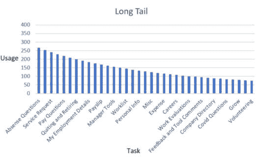

# 3

# 确定ChatGPT的最佳用例

用例是对讨论中的系统与其外部参与者之间可能交互序列的描述，与特定目标相关。

- Alistair Cockburn

关于编写用例的解释有很多。我怀疑我们每个人都创建过一些我们称之为**用例**的东西。我们首先将明确一个稳健的定义，以便从相同的角度理解。然后，我们可以进入用例中的示例，寻找将生成式AI融入其中的机会，同时考虑ChatGPT集成可能具有挑战性或可能出现问题的领域。到本章结束时，你将具备使用[*第2章*](B21964_02_split_000.xhtml#_idTextAnchor031)，“进行有效的用户研究”文档中的用例，并为[*第4章*](B21964_04.xhtml#_idTextAnchor085)，“评分故事”中的用例优先级做好准备。用例开发专家将从学习如何将ChatGPT应用于用例流程中受益。我鼓励所有读者了解用例开发，因为它不仅对设计师有用！

在本章中，我们将涵盖以下主题：

+   理解用例基础知识

+   将**大型语言模型**（**LLMs**）与用户目标对齐

+   避免ChatGPT的限制、偏见和不适当的响应

# 理解用例基础知识

这五个基本用例组件多年来一直保持一致：

+   **主要参与者**：谁将使用这个案例？

+   **前提条件**：为了使用此用例，必须发生什么？

+   **触发器**：为什么这个用例现在发生？

+   **路径**：过程中的步骤以及系统对这些步骤的响应。

+   **扩展**：应考虑并处理主要路径的例外和变体。

如何选择合适的用例

我在[*第2章*](B21964_02_split_000.xhtml#_idTextAnchor031)，“进行有效的用户研究”中建议Alistair Cockburn的书作为用例的最佳入门书籍，因为他解释了如何有效地编写它们。在选择合适的用例时，我们也应该保持敏感。有可能编写一个结构良好的用例，但它并不代表重大的商业价值。Cockburn的书涵盖了用例的正确构建并提供示例。考虑打印出[*第1章*](B21964_01.xhtml#_idTextAnchor016)，“认识到ChatGPT设计力量的重要性”中的一页摘要。它提供了许多有用的建议，有助于编写准确的使用案例。

书籍：[编写有效的用例](https://amzn.to/3YnbGSp) ([https://amzn.to/3YnbGSp](https://amzn.to/3YnbGSp))

书籍（PDF）：《编写有效的用例》[Writing Effective Use Cases](https://www-public.imtbs-tsp.eu/~gibson/Teaching/Teaching-ReadingMaterial/Cockburn00.pdf) ([https://www-public.imtbs-tsp.eu/~gibson/Teaching/Teaching-ReadingMaterial/Cockburn00.pdf](https://www-public.imtbs-tsp.eu/~gibson/Teaching/Teaching-ReadingMaterial/Cockburn00.pdf))

## 用例或用户故事

有些人听说过**用户故事**，与用例的重叠性很大。用户故事通常更通用，被视为一种叙事。正如我们在[*第二章*](B21964_02_split_000.xhtml#_idTextAnchor031)中解释的，*进行有效的用户研究*，我们通过故事板卡通讲述一个真实的故事。同时，用例更多地描述了交互。讲故事可以设定氛围并整合上下文和参与者，而用例则提前定义这些内容。从用例编写故事更容易，因为已知应该发生什么以及事件的顺序。从用户故事到用例的转换更复杂，因为需要处理每个步骤的细节。这里的重点是使用用例方法来提供细节，以估计和理解交互的价值以及解决该问题所需的工程工作量。要求ChatGPT从一个用例中创建故事，比从故事中创建用例要容易得多。

我们可以创建用例并使用该过程来识别适合ChatGPT的步骤。我们还可以了解何时不应用ChatGPT。

这里有一个逐步指南：

1.  理解如何编写引人入胜的用例。

1.  识别用例和任何需要的用户故事。

1.  将用例分解为步骤。

1.  识别那些步骤中ChatGPT可以提供支持的地方（以及它不适合的地方）。

1.  与开发团队合作，探索ChatGPT在解决问题具体步骤中的价值。优先考虑价值最高、成本最低的用例（关于这一点，下一章将详细介绍）。

1.  忽略不适合ChatGPT的问题。

我们将使用一个示例用例来探索如何将ChatGPT纳入流程。首先，我们可以回顾ChatGPT在用例中可能如何被应用。

## 使用ChatGPT建立基线

考虑到客户所做的所有活动，甚至公司内部员工的活动，这可以累积成许多现有的用例。其中一些可以通过整合生成式解决方案（如ChatGPT）进行改进。相反，当ChatGPT的价值有限或没有价值时，应避免应用它。

在整本书中，我们介绍了理解ChatGPT擅长什么以及不擅长的不同方法。因为我们预计解决方案将合并企业数据与一个或多个生成模型（以及在第[*第六章*](B21964_06_split_000.xhtml#_idTextAnchor134)中讨论的一些特定模型，这些模型在特定任务上表现更好），了解它能做什么以及不能做什么是很好的。

在此背景下，可能会有聊天交互、推荐用户界面、企业工作流，甚至后端解决方案，但ChatGPT可能只应用了部分问题。ChatGPT被问及其擅长什么，并在*表3.1*中提供了结果。

| **擅长** | **不擅长** |
| --- | --- |

|

+   **通过** **逻辑流程** **进行指导**

+   **将复杂程序** **分解为步骤**

+   **提供解释** **和示例**

+   **根据** **用户查询** **调整响应**

+   **针对** **特定需求** **定制指导**

+   **构建和** **解释工作流程**

+   **协助** **故障排除** **和任务**

+   **提供** **个性化帮助**

|

+   实时交互

+   控制物理设备

+   高度专业化的知识

+   快速变化的信息

+   敏感或争议性话题

+   细腻的情感或人际动态

+   提供专业建议或判断

|

表3.1 – ChatGPT对其能力的看法

本书涵盖了*表3.1*中的一些这些项目。对于敏感、情感或关系建议等具有挑战性的领域，仅简要提及。大多数企业解决方案将需要通过使用可适应以支持企业知识的模型来处理专业知识的问题。我们将在后续章节中介绍这一点。即使ChatGPT也未能解释，在某个流程步骤中应用ChatGPT可能会获得更多价值，将其优化和调整以执行序列中的特定任务。ChatGPT不必做所有事情（正如我们所说，不要*大水漫灌*）。这就是创建用例将流程分解为一系列步骤的美丽之处。比较步骤细节与ChatGPT的能力更容易。

让我们举一个例子。客户通常为各种产品部署补丁或固件更新。手机会定期更新，企业软件也会打补丁，甚至在云中也是如此。在云中，消费者很少将其视为补丁，因为补丁通常在幕后进行，通常不会导致关键系统中断。有人在为我们解决这个问题。对于个人设备，如手机、电视，甚至烤面包机，用户管理这个过程：下载软件更新，安排稍后进行（可能是在睡觉时），或选择何时以及更新什么。对于企业来说，在部署之前可能需要测试数十个补丁和更新。这是更新手机的“大哥大”版本。

这里是一个简化企业系统的用例示例，该系统由步骤、意图和系统响应（由于定制、集成、法律或区域要求，补丁流程可能更加复杂）组成：

+   **主要操作者**：

    +   系统管理员、补丁管理员或由运维人员

+   **先决条件**:

    +   用户已登录系统

    +   软件补丁可用

+   **触发因素**:

    +   推荐的可用补丁详细信息通过电子邮件发送给操作者

下一个部分将通过对ChatGPT可以应用的地方进行识别来扩展这个基本的修补用例。这是一个头脑风暴：在用例中寻找存在的差距，并确定ChatGPT在每一步可以为客户做什么。

## ChatGPT实例的示例用途——软件修补

这个用例是针对传统的图形用户界面的。即使在单个用例中，也可能有多个生成增强的应用来适应**用户体验**（**UX**）。我们考虑这样的箴言：“最好的用户界面是没有用户界面”。虽然一个总的目标可能是自动化一切，但在这个例子中，我们假设一个复杂的场景，其中需要人工交互。但沿着这个旅程的步骤自动化是可能的。

我们可以扩展一个企业级软件修补示例的细节。大型企业经常管理他们的软件部署。即使将这项工作外包给云服务提供商，也只是将问题转移给了云服务提供商。对于这些供应商来说，问题仍然是相同的。这个软件比我们的个人更新复杂100倍，包含1,000到10,000个可能的修补程序，有数百个该软件的实例在不同的部门和多个开发、测试和预发布服务器上运行。精确地知道修补了什么以及这可能会如何影响计算机变得至关重要。这是一个复杂且耗时的过程。这也是为什么我们在新闻中看到这么多安全漏洞的部分原因。这不是因为软件不安全，而是因为流程复杂，充满了可能出错的风险。在大多数情况下，供应商已经提供了修补程序来修复安全问题，有时甚至是在几年前。公司由于修补的复杂性和有时涉及关闭软件的风险而不愿进行修补，这意味着他们的系统是脆弱的。

这里是这个复杂过程的简化版本，以帮助我们处理这个用例。注意*表3.2*中的每个步骤是如何转化为系统需要解决的问题或经验的。UI将从这个用例中设计，但我们*不是在用例中定义UI*。每个步骤的高级需求都有文档记录。确定确切的信息、布局和细节以与UI设计进行修补的时机更好。有一个专门的流程和细节仅用于修补详情视图；主要用例不涵盖这一点。对于在*步骤3*中引入的计划概念也是如此。计划是我们可以同时测试和部署的一组修补程序。计划不仅包括名称。一个单独的用例可以帮助定义计划（谁参与过、日期、内容、状态和部署细节）的元数据。审查用例中的步骤以了解我们可能在每个阶段需要处理的交互类型。这个用例是关于查看修补建议，决定哪些修补程序包含在计划中，然后安排和部署这些修补程序。根据我们对ChatGPT擅长什么的理解，我们可以思考它如何在这些步骤中帮助我们。

表格的最后一列标识了ChatGPT的机会。对于那些更熟悉用例的人来说，有一些扩展用例，它们处理的是每个步骤中不典型但预期出现的情况。我已经将用例的扩展移除并放置在*表3.3*中，以便更容易阅读。要知道，有许多方式来展示用例。这只是我们为了方便使用的一种方式。

| **步骤** | **描述** | **系统责任** | **ChatGPT机会** |
| --- | --- | --- | --- |
| **1** | 显示推荐修补程序。 | 显示为系统推荐的修补程序。 | 从现有修补程序和已知错误中提出更好的建议。 |
| **2** | 用户选择一个或多个建议。 | 显示有关修补程序和可用选项的详细信息。 | 推荐一组协同工作的修补程序集合。 |
| **3** | 用户审查并选择要添加到计划中的建议。 | 添加修补程序。任务完成情况得到通知。计划更新。 |  |
| **4** | 用户重复审查过程，直到所有修补程序决策完成。 | 显示详细信息、更新和计划中的修补程序数量。 |  |
| **5** | 用户启动计划。 | 将用户带到计划。 |  |
| **6** | 用户审查计划，检查冲突和问题。 | 显示计划内容和状态。运行冲突检查。 | 预测修补计划的结果，以及缺失或冲突修补程序的影响。 |
| **7** | 用户在测试实例上部署计划。 | 系统允许选择测试实例。 |  |
| **8** | 运行测试实例的评估。 | *(本例中不涉及结果和反馈。)* | 从现有案例生成测试。识别测试中的差距。 |
| **9** | 根据测试结果调整和评估计划。 | *(使用新计划循环通过之前的步骤并跟踪计划的版本。)* |  |
| **10** | 安排在生产实例上部署。 | 安排并通知用户成功或失败。 | 提出部署建议。 |
| **11** |  | *已部署补丁；系统在新补丁状态下可用。* | 生成测试用例。识别可能的问题。 |
| **12** | 安排和部署到其他实例。 | *(例如，添加更多实例到计划中，如生产实例。)* | 监控异常情况。 |

表3.2 – 补丁系统的示例用例

主要用例在多个地方有机会插入ChatGPT。如果有关已安装补丁及其版本和发布结果的大量数据，可以训练一个模型来建议一组协同工作效果更好的补丁。LLM可以提出补丁计划，或者至少找到可能导致冲突或解决冲突的补丁集合的问题。这个模型可以在过程之前、过程中和之后使用。这绝非微不足道。这只是ChatGPT适合的机会；它擅长提供示例和测试用例。事后，可以从监控软件性能的不同数据中训练ChatGPT来理解甚至预测异常情况。补丁、测试和监控可以使用不同的训练模型，具有不同的提示、API和结果。在这种情况下，表中确定了LLM的使用。我们将步骤分解到更详细的程度，以便更容易想象LLM解决方案。尽管实现它可能是一项重大工作，但问题已被限制。可以评估是否有有价值的数据，这将允许模型成功执行。

在[*第6章*](B21964_06_split_000.xhtml#_idTextAnchor134)的案例研究中，“数据收集——内容为王”展示了将一打调整好的模型部署到生命周期中执行特定任务的例子。过程中的每一步都使用不同的模型。在这种情况下，一些补丁推荐步骤可能不会直接向客户展示，而是由其他模型用来细化或支持对客户的建议。

补充过程或不是预期路径的附加序列被称为用例的**扩展**；一些扩展包含在*表3.3*中。通常，主要流程是**成功路径**，大多数人可能会遵循这条路径以实现成功。扩展通过其他必要功能补充成功路径。*成功路径并非唯一路径*。一个健壮的企业设计必须考虑边缘情况、错误条件、慢速连接和性能瓶颈、可访问性、国际化和其他问题。

在这个案例中，有一些扩展需要指出。向计划中添加是标准且典型的，但没有计划的情况下，首先发生的事情（即使自动化）是一个新的计划，这就像在桌面上创建一个新的文件夹一样。在计算机上，文件夹被创建为`untitled`。一个设计良好的系统会自动选择该文本，以便用户可以立即输入并命名它。用例没有描述这一级别的行为。这是好事，产品经理可以交付用例，设计师可以据此开发UX设计。基于主要流程和ChatGPT能力的一般理解，有一些地方ChatGPT可能被包含以提供整个计划或提出解决冲突的建议。

| **步骤** | **描述** | **系统责任** | **ChatGPT机会** |
| --- | --- | --- | --- |
| 3a | 创建并命名一个新计划。 | 创建一个新计划。将选定的补丁添加到新计划中。完成任务的消息响应和计划链接。 |  |
| 3b | 用户选择现有计划并添加推荐。 | 计划更新并显示新细节。 | 建议可能重叠的计划。 |
| 6a | 用户被通知存在冲突。 | 将用户引导至冲突解决步骤。 | 提供解决冲突的建议。 |
| 6a1 | 用户将计划保存为命名计划（适用于将同一计划应用于其他实例）。 | 保存一个唯一的命名计划。 |  |
| 10a |  | 警告用户有关已弃用的补丁；补丁无法部署。 | 提供建议。 |

表3.3 – 补丁用例的扩展

假设我们拥有关于在野外安装的补丁以及由此版本和发布版本产生的故障报告的数据。在这种情况下，可以训练一个模型来建议一组可以协同工作的补丁。该模型可以推荐一个补丁计划或建议一个替代补丁集合来解决冲突。冲突是指与其他补丁不兼容的补丁。这绝非微不足道。这正是一个适合ChatGPT的机会。

### 根据使用和价值优先级使用案例 - 人力资源示例

理解每个流程的重要性至关重要。如果10个或20个流程每个都有5%或10%的使用率，这些流程几乎代表了所有使用率。然而，如果主要流程只占交互的一小部分，这被称为**长尾效应**。如果某些流程和路径服务于少数人并且使用频率较低，这些流程将会有长尾分布。这意味着任何单个流程对用户社区的影响都将是微小的。当只有少数案例代表大多数交互时，对这些流程或任务的改进比那些使用率低的改进更有价值。长尾用例不会像使用率最高的用例那样显著提升客户体验。这些用例之间的价值差异是可以量化的。如果开发使用率最高和最低的用例的成本相同，那么选择是显而易见的。这将在[*第4章*](B21964_04.xhtml#_idTextAnchor085)“评分故事”中解释。

常见的分布（对于统计学家来说，这看起来类似于单尾正态分布；现实世界的数据并不总是看起来像正态曲线）通过将使用频率最高的用例排序到最不频繁的用例，看起来类似于*图3.1*。这个数据集来自一个人力资源（HR）系统，因此它不是一个完美的平滑分布。在这个例子中，少数顶级案例代表了最多的使用率（就像80/20规则一样）。在这种情况下，80%的使用率来自20%的功能或能力。


*图3.1* – 典型的单侧分布，少数案例具有最大的影响

在长尾分布中，较少的大宗用例出现，它进一步延伸到使用频率较低的应用场景，如*图3.2*所示。需要超过40%的用例才能达到80%的使用率。



*图3.2* – 长尾分布的一个示例 – 许多案例具有相似的使用率

### 根据80/20规则进行优先级排序 – 亚马逊购物

亚马逊网站上的功能是我们无需介绍就能解释的。这个购物网站的功能代表了80/20的分布。例如，搜索产品、将其添加到购物车和结账等功能构成了主要的使用。其余的小功能包括创建愿望清单、注册账户或添加新地址等。然而，如果你从产品的角度来切换视角，最畅销的产品可能只占销售额的一百分之一以下。即使是基于搜索流量的热门产品，如苹果手表、Crocs、AirPods、空气炸锅和iPad，它们的搜索量总和可能达到六百万次，但它们只是长尾产品搜索的顶端。与超过两亿的搜索量相比，即使是销量最高的产品也只占销售额的一百分之一以下。这是一个长尾。本文讨论了超过274,000个关键词搜索中的这五个搜索词，以使长尾问题看起来更加令人印象深刻。

[亚马逊上搜索量最高的100个商品](https://www.semrush.com/blog/most-searched-items-amazon/) ([https://www.semrush.com/blog/most-searched-items-amazon/](https://www.semrush.com/blog/most-searched-items-amazon/))

亚马逊的例子表明，最有价值的可能是少数几个功能（如添加到购物车功能）。同样，专注于内容（如亚马逊上要购买的商品）可能会产生长尾问题。在任何情况下，如果AI被用于曲线的*右侧*，它提供的价值将小于左侧的价值。

回到*图3.1和3.2*，我们可以将亚马逊的例子应用到人力资源数据上。注意，*缺勤余额*项目（关于员工的剩余休假时间）在*图3**.1*中几乎有350次交互。在长尾(*图3**.2*)中，这个数字只会超过250次。在长尾情况下，没有哪个用例突出。在长尾环境中对这一用例投入同样的努力，回报将不同。

了解使用的分布情况是有帮助的。更正常的分布意味着价值很可能会从改进几个关键用例中产生，而长尾则意味着在不涵盖更多用例的情况下，影响将更具挑战性。

但即使是小案例也可能相关。与注册后的使用相比，注册客户的使用频率较低。尽管如此，没有人会争论正确注册和减少注册过程中的摩擦不是至关重要的。现在我们已经涵盖了用例，我们仍然可以考虑用户故事的影响。

## 从用例创建用户故事

记住，用例和用户故事的概念是重叠的。形式不同。让我们回到打补丁的例子。它提供了一套健壮的步骤，为应用ChatGPT提供了各种机会。在*表3.1*的用户故事上运行ChatGPT产生了与用例相关的以下故事：

```py
I will give you a use case that includes the user's steps and the resulting system response. Please summarize this into a user story using storytelling techniques. Then, summarize the story into a book synopsis.
```

ChatGPT对这个用例的回应如下：

```py
In the magical kingdom of Systemia, the wise and diligent IT wizard, Merlin, sets out on a quest to secure the kingdom's digital fortress. Armed with the magical tool "PatchMaster," Merlin navigates through a series of enchanting chapters to review, select, and deploy patches across the kingdom's instances.
The story unfolds as Merlin discovers a captivating array of patch recommendations, meticulously builds a Patch Plan, and navigates through the patching odyssey, ensuring every decision is made with precision. The wizard crafts a masterpiece – the Plan – checking for conflicts and issues to guarantee a flawless defense against vulnerabilities.
Testing the waters, Merlin bravely deploys the Plan on a test instance, adjusting and evaluating based on results, showcasing the wisdom of iteration. A grand deployment ensues, scheduled and executed with magical finesse, fortifying the kingdom's defenses.
In a grand finale, Merlin expands the kingdom's shield by deploying the Plan on multiple production instances, declaring victory as the patches are deployed and the kingdom's instances stand secure at their new patch state.
The epilogue reflects on the enduring legend of PatchMaster, as Merlin's wisdom ensures the kingdom's digital realm remains resilient against the forces of vulnerabilities. "Patch Perfect" stands as a testament to the enduring power of thoughtful patch management in the ever-evolving landscape of technology and security.
```

这个从 ChatGPT 生成的故事没有进行任何编辑（包括语法错误）。我想用它来提出几个观点。首先，ChatGPT 在我们的设计过程中具有价值。这个故事富有创意和魅力，可以进一步定制，通过在提示中给出更多方向来匹配特定的风格和语气。其次，从用例到用户故事很容易转换，尽管可能需要编辑输出。这可以提供给卡通或素描艺术家来开发引人入胜的营销故事板。还可以对 ChatGPT 进行额外的细化，以完善故事，使其超越快乐路径。可以要求将其分解为八个故事板单元格，这将更容易作为故事板可视化。 

最好认识到，使用用例中的逐步方法比这种讲故事格式更容易识别 ChatGPT 的机会。用户故事的目标受众不同。用例包含开发团队需要的信息，但故事是为高层管理、其他团队和市场营销准备的。

## 从用例中优先考虑 ChatGPT 机会

这个补丁示例很有用，因为应用 ChatGPT 解决方案在每一步都有实际成本，包括设计和开发，以及运行生产、预演和测试 LLM 的实际成本。不要期望在所有这些机会中部署 ChatGPT，所以让我们在 *表 3.4* 中重新列出被确定为 ChatGPT 支持位置的步骤，并对每个步骤进行评分，以查看哪些可以为客户带来最大价值。然后团队可以将时间和金钱投入到最有价值的步骤中。

每个可能的故事都根据三个指标进行评分。[*第 4 章*](B21964_04.xhtml#_idTextAnchor085)，*评分故事* 教授 **用户需求评分**，这是三个评分的乘积。评分越高，对客户的价值就越大。在下一章中，我们还将考虑开发成本。从这个分析中，我们有三篇最有价值的故事。

| **为 ChatGPT 支持识别的步骤** | **影响客户** **（1 到 3）** | **B 需要频率** **（1 到 3）** | **C 问题严重性** **（1 到 4）** | **用户需求评分（****A*B*C）** |
| --- | --- | --- | --- | --- |
| **步骤 1：从现有补丁和客户错误中提出更好的建议** | 2 | 1 | 3 | 6 |
| **步骤 2：推荐能够良好协作的补丁集合** | 2 | 1 | 3 | 6 |
| **步骤 6：预测补丁计划的结果，以及缺失或冲突补丁的影响** | 2 | 1 | 4 | 8 |
| **步骤 8：从现有案例生成测试。识别测试中的差距** | 2 | 1 | 2 | 4 |
| **步骤 10：提出部署建议** | 2 | 1 | 1 | 2 |
| **步骤 11：从现有案例生成测试。识别测试中的差距** | 2 | 3 | 2 | 12 |
| **步骤 12：监控异常** | 2 | 1 | 4 | 8 |

表 3.4 – UX 中 ChatGPT 的机会（前两项加粗）

让我分解一下评分。所有这些故事都影响相同数量的客户。只有我们的一些客户会打补丁，所以我们在这个三点的尺度上将其评为2。3点是最高分，是为大多数客户执行的任务保留的。补丁很少执行并不奇怪。个人每年更新手机几次；企业客户更不愿意更新。每个步骤都大约执行相同次数，通常每季度执行一次，所以这种需求的频率是1（再次强调，在3点的尺度上，2代表大多数时候，3代表总是）。但是测试用例是不同的。这是一个持续的过程，所以在频率尺度上评分为3。这也是在客户遇到问题之前捕捉潜在问题的唯一地方。

用户评分中的显著差异源于严重程度。可以这样理解，这是bug严重程度的倒数。在大多数公司中，严重程度为1的bug是个大问题。每个人都应该同意这需要立即修复，并且应该得到最高的评分，所以是4分。3分代表一个重大问题，而2分则不那么严重，1分则是最轻微的问题（通常是严重程度为四的bug）。

我们记录了评分的解释，这样多人就可以学习这个过程，并能够对类似问题进行评分。由于评分范围从1到4分，这使得解释和评分变得简单。我们希望人们能够重复评分、分享并学习共同的方法。团队可能会发展出更复杂的过程，这也可能会造成阻碍。这一点将在下一章中进行讨论。

可以根据这些评分和值来优先排序这个列表。我们将深入解释如何评分故事，以及如何将工程成本纳入这些解决方案的开发中。我们知道至少有三个故事（在*步骤6、11*和*步骤12*中）具有显著的用户价值。我们将在*第4章*，*评分故事*中使用这些相同的故事来更详细地解释评分。

因此，我们从一个简单的例子开始。我是这个领域的专家，这使得这个例子很容易解释。商业专业知识对于解决LLM（大型语言模型）的问题至关重要。如果你不是专家，就组建一个团队，平衡客户同理心与商业专业知识。

这个修补案例是一组已知的任务，我们可以快速确定ChatGPT解决方案可能适合的位置。但是，当需要更多的工作时怎么办？你可能需要探索或进行研究来确定最佳匹配。用例从哪里来？我们试图实现的是谁的目标？你知道足够的信息来识别ChatGPT应该被考虑的地方吗？这是挑战性的问题。我建议成为你产品领域的专家。对产品或服务了解得越多，对用户目标的理解就越深入，对ChatGPT能力的理解就越透彻，识别机会和解决方案就越容易。ChatGPT的每个新版本都不同，可能会改变计划。正如我们将在[*第6章*](B21964_06_split_000.xhtml#_idTextAnchor134)中探讨的，“数据收集——内容为王”，不同的模型可以用于其他任务。我们无法说哪个模型更好；这每几个月就会变化。

让我们来探讨如何定义这些目标。记住，这些是用户的目标，而不是组织的需要。

# 将LLM与用户目标对齐

假设我们有一个客户或角色在心中，并希望定义他们的目标。这本书关注的是用户的目标，而不是营销、工程或销售。产品领导者负责找出有效的用户目标以及目标对整体产品的价值。可行性也是至关重要的，通常由工程提供。令人信服的用例可以来自任何地方；公司负责人可能有一个愿景，客户可能提出投诉，产品经理可能从客户那里得到一个想法，QA工程师可能识别出一个捷径，用户研究人员可能发现一个关键的解决方案，或者设计师可能想象出一个解决客户痛点的方法。不要过于关注是谁提出了解决方案，而应更多地关注它提供了多少价值。不要纠结于需要哪种LLM供应商。随着OpenAI和行业的演变，将会有各种具有特定功能和成本的模式可供选择。这种按需匹配允许在一个产品中构建一套LLM的解决方案。

## ChatGPT的应用

有一个等待被解决的解决方案世界。在企业解决方案的空间中，有一些ChatGPT可以帮助解决的问题。让我们抛出一个可以与ChatGPT结合使用来改进的用例集合。不要害羞；向ChatGPT寻求针对业务的特定建议。与它深入探讨细节。这个过程可能不会突出公司最重要的方面，但产生想法是开始这个过程的关键。拥有一个广泛的想法集合是可以的，但使用提供的技能根据价值进行优先排序。

如果你借鉴了其他人使用ChatGPT的经验，了解他们是否做得**好**是至关重要的。以下是一些ChatGPT可以处理的领域。有数千个值得探索的想法。利用这一点来激发一些思考。将这些例子重新思考到你们公司的业务和实践中。考虑以下想法以帮助进行头脑风暴会议：

+   在广泛的知识库中寻找关键信息，以解决特定版本产品的具体解决方案。

+   为销售人员提供有助于关闭客户交易的因素的建议。

+   诊断服务问题，引导客户完成解决问题的步骤，在所有其他方法都失败时派遣维修人员到现场，跟进服务预约的变更，并在完成后关闭请求。

+   考虑其他交互方式、基于视觉的分析、监测声音或传感器数据（温度、压力、空气质量、接近度、光、振动、光学、水平、运动或速度）是否支持一个过程、一个建议或一个指导机会。

+   根据之前的购买周期（直接与客户互动或在销售代表的支撑角度）推荐产品和解决方案。

+   为世界语言进行翻译，以拓宽支持渠道。

+   生成代码、任务自动完成和回归测试套件创建。

+   协助处理人力资源（HR）、财务、会计、服务、销售以及其他请求或表格。包括费用报告、月末资产负债表、服务票、销售订单、休假申请，或帮助匹配候选人到职位（这不会比今天的工具更糟）。

+   在使用区块链完成交易之前验证并确保满足合同条件。

+   与用户头脑风暴，探索和诊断问题的替代方案。

+   汇总、起草、撰写或编辑材料。

+   人力资源在安排面试、指导新员工、帮助撰写职位描述、分析离职面试以了解离职原因、确定最适合指导新员工的员工（注意偏见），以及在这些过程中检测偏见等方面有许多用例。人力资源总是进行可以由LLM分析的调查。

+   财务是一个热门领域——预测、市场趋势以及基于支出模式、目标和容忍度的建议。一些公司的财务报告、每日股价和波动评论已经自动生成。

许多这些工作可以由一个全天候的虚拟助手处理，该助手支持业务并补充或取代琐碎和简单的人机交互。

让我们从帽子里随机抽取一家公司，看看AI的可能性有多么丰富。我选择了世界上第2,000大的公司（这样我们就包括了各种规模的大型企业）。这次搜索结果落在The Gap，这是一个标志性的零售组织，通过许多品牌如Old Navy、The Gap、Athleta、Banana Republic和Intermix销售服装。它是福布斯全球2000强公司的末尾。让我举一个如何通过生成提示来与ChatGPT进行头脑风暴的例子

```py
Our company is called the Gap; it includes many brands that sell apparel in retail settings in stores worldwide. We deal with a very competitive and dynamic space, handling customers in stores, handling returns, promoting and advertising, designing clothes, manufacturing products worldwide, and dealing with logistics and over 70,000 employees while managing a significant web presence. Provide me with a numbered list of detailed important use cases that ChatGPT can inject into to give my customers a more effective customer experience.
```

我已经截断了描述，除了最后一个，以展示它是如何构建用户利益的。为您的业务运行这个练习，看看结果如何。

+   店内客户协助：实施由ChatGPT驱动的自助终端或移动应用…。

+   虚拟试衣间：开发虚拟试衣间（以）接收个性化的推荐…。

+   退换货协助：…对常见的退换货咨询提供回应…。

+   个性化产品推荐：…根据过去的购买、浏览历史和互动分析客户偏好，生成个性化的产品推荐…。

+   在线聊天支持：…对客户咨询提供即时回应…。

+   时尚建议和造型技巧：…客户可以输入他们的偏好、体型和场合，获得个性化的造型建议…。

+   供应链透明度：…向客户提供关于（订单）状态的实时更新…。

+   客户反馈和调查：（收集）客户反馈和进行调查…。

+   多语言支持：…为不同语言的客户提供支持和帮助…。

+   AI视觉搜索：使用图像搜索产品，使他们能够快速找到类似商品或完整的造型…。

+   定制忠诚度计划：利用ChatGPT分析客户数据和消费模式，创建针对个别客户的定制忠诚度计划和激励措施，奖励他们的参与和购买，并培养品牌忠诚度。

+   将ChatGPT整合到这些用例中不仅将简化您业务运营的各个方面，并将显著提升整体客户体验，推动客户满意度、留存率，并最终促进收入增长。

我们可以继续。它出色地探索了ChatGPT的机会。这些例子得益于ChatGPT擅长的地方。当优质的企业数据通过提示和安全性智能控制传递给一个LLM（大型语言模型）时，它可以在许多客户互动步骤中创造价值。[*第6章*](B21964_06_split_000.xhtml#_idTextAnchor134)，*数据收集 – 内容为王*探讨了将企业数据纳入其中。

在进行竞争研究时，可能会很清楚其他公司正在构建类似的LLM解决方案，这可能是一场追赶游戏。例如，服装推荐将成为常态。公司未来必须拥有这一点。在这些为服装推荐者部署的任何应用中，都可能会有失败。大多数失败将来自不关心和培养LLM；一些将失败是因为选择了错误的使用案例；少数将失败，很可能是因为LLM不完美。主动监控、迭代设计和微调是成功的关键，并将有助于避免失败。我们将讨论第9章，*指南和启发式方法*，以确保对成功和未来改进的理解。我们将借鉴这些早期章节来完善和改进。请保持关注。我希望我们灌输的理念是，不是*每个*问题都可以用ChatGPT来解决。专注于可以尽早交付的问题中最有价值的部分。

## 聊天以外的生成式AI示例

尝试跳出思维定势。伟大的想法总是可以来自非常不同的领域。我们有了Velcro®，因为一位工程师注意到他在和狗散步后衣服上粘着的芒刺（1941年），Post-it®便签是因为Spencer Silver尝试创造一种超级强力粘合剂失败（1968年），还有Dr. Harry Coover在Eastman Kodak（1942年）从尝试创造一种透明塑料的失败中得到了超级胶水®。所以，总是跳出思维定势思考是很好的。我总是建议从整个业务的角度来看待问题。有时，我们陷入了解决细节问题的困境，而需要抬头看看整个森林。正如我提到的补丁示例，有时解决方案是移除UX并自动化整个流程。这是最终的简化。ChatGPT可以解决的创新列表每天都在增长。然而，我把这些放出来，因为它们可能连接了经验和公司的需求。创新可以来自任何地方。这些广泛不同的空间中的任何一个能帮助我们在寻求解决方案的过程中吗？让我们看看：

+   **用于检测、分类、计数或分析的对象视觉分析**：是否存在库存、运输、处理或零售问题？亚马逊已经实施了商店，顾客可以在购物车中将物品放入购物袋（或改变主意时取出），商店计算费用，然后他们就可以出门。这里不需要结账。

+   **视觉艺术、市场营销或社交媒体中的图像创作**：尽管这个领域比示例大得多，但艺术家在提示下可以生成图像，而不会出现媒体许可问题。在LLMS训练未经许可的材料时可能会有问题。我们稍后会讨论这个问题。

+   **音乐创作**：我对ChatGPT如何调用Mathematica来创建逐音符旋律印象深刻。我无法评论这些旋律是否动听……

+   **系统模拟和测试**：创建流程或建筑物的虚拟模拟（我们听到“数字孪生”这个术语）非常流行，所以看看有哪些地方可以使用ChatGPT来模拟或测试条件。

+   **原型设计和用户界面设计**：这是我们本应该写的书，但我认为世界还没有准备好。将模型作为工具使用。外面有人会为我们写这本书。

+   **药物发现**：谷歌搜索一下。如果制药公司可以根据研究和结果搜索新的化合物，我敢打赌企业数据中就有一个金矿。去挖掘它。

+   **寻找解决古老问题的新方案**：有了合适的工具和框架，生成式解决方案可以解决具有未知答案的问题。

我们有很多ChatGPT的用途，但它并不总是最佳解决方案。以下是一些ChatGPT可能不是最佳匹配的地方。

# 避免ChatGPT的限制、偏见和不恰当的回应

一个拼图碎片可能不适合拼图，因为它来自不同的拼图。我们喜欢将新工具应用到每个解决方案中。锤子除了敲钉子还有很多用途，但这并不意味着它是完成这项工作的正确工具。ChatGPT预测接下来要说的话的独特能力并不总是完美地适合特定的用例。有很多空间可能没有好的匹配。或者，正如企业补丁示例所示，没有必要将ChatGPT应用到每个步骤以获得价值。不仅用例应该是最重要的，而且它们还应该是ChatGPT集成有意义的用例。以下是一些可能难以将ChatGPT应用于解决方案的领域，以及一些创造性思维，以帮助应对这些情况。

## 缺乏实时信息

基础模型有对新材料摄入的截止日期。一个新模型可能只有一年前或更早的数据。这个问题会随着时间的推移而改善；我们已经看到摄入的材料日期最近不到一年。然而，如果存在滞后，并且客户需要那个时间敏感的信息，它必须提供。如果公司发布2.0版本的小部件，新的文档可以在发布时更新带有该信息的自定义模型。然而，如果LLM解决方案依赖于保持第三方细节更新，也需要摄入最新的第三方数据。第三方在其网站上发布信息没关系，因为基础模型不会那么及时。由于模型更新有限，正如在第6章[*“收集数据 – 内容为王”*](B21964_06_split_000.xhtml#_idTextAnchor134)中解释的检索增强生成（RAG），可以摄入这些数据并保持更新。认识到随着模型的变化，需要新的测试和验证。

## 复杂或专业化的主题

法律和医疗建议是可能引起问题的两个领域。然而，在构建这些服务的企业版本时，存在许多机会。它们不必是法律或医疗问题的答案；它们可以帮助细化该领域或寻找可能对人类来说过于困难（例如，患有15种不同药物的患者可能的副作用或相互作用）的关联。法律领域的支持工具可以是审查大量法律文件，以突出与特定专业知识相关的信息。专家证人必须审查证词以形成他们的结论。然而，如果期望它知道一切，那么它缺乏实时数据。通过专家仔细监控结果质量，逐步改进、记录和精炼成功，创建高质量的解决方案。

## 长篇内容生成

对于企业用例来说，需要长篇内容是很常见的，比如撰写一本书。我们有许多知识和技术文档的需求，但这并不是ChatGPT的有效用途。ChatGPT可以帮助编辑材料、缩短测试、精炼语言，甚至进行基本的翻译，但有其局限性。不要期望在没有技术编辑的情况下发布如此长的材料。ChatGPT可能会偏离主题，引入无关内容，并重复措辞。甚至可能会重复主题。我见过很好的例子，一个十步指南中，有两个步骤被略微不同地标记，但与前面的步骤完全相同——在复杂且冗长的文档中创建和维护组织和层次结构，对生成式AI的长期记忆限制提出了挑战。此外，事实也不再像以前那样。特别是在技术文档中，我们总是需要额外的测试人员运行文档中的流程和任务，以验证解决方案是否有效。ChatGPT可能会首先识别并引导用户到正确的高质量文档片段。然后，如果用户认识到该文档适用于他们，他们可以信任结果准确无误。例如，当我们知道他们使用的是苹果Macintosh时，我们不想向他们展示适用于微软Windows的有效步骤指南。

## 长期记忆

ChatGPT虚拟助手可能在连续的评论之间表现良好，但不适合长时间。跨越一周的对话不太可能保持上下文或信息以继续该对话。然而，可以开发一些解决方案。考虑是否可以保存和长期属性或对话以提醒LLM之前的讨论。随着时间的推移，可以逐步建立一组上下文细节。甚至可以将对话的早期元素的历史列表存储起来。让LLM看起来有长期记忆是非常令人兴奋的。供应商正在努力提供更好的长期记忆的基础模型。例如，我们在ChatGPT 4o中看到了这一点。想象一下公司内部的目录服务：

+   目录应用提供人们的姓名、电话号码、电子邮件地址和头衔。

+   许多人多次询问该应用。它可以查看搜索历史以了解流行人物和人们姓名的缩写（例如，Ben代表本杰明）。

+   如果用户一个月后回来，他们不想滚动查看历史记录（或者可能是UI没有这些数据）。

+   因此，用户问道，“他的电话号码又是多少？”

+   一旦AI以名称回应，用户回应说，“不，是另一个人，”应用就会返回一个其他可能名称的简短列表。

+   通过存储人们的历史记录，它查找并提供了该上下文（或通过其他解决方案）。这重新创建了历史并呈现了长期记忆的外观。

+   关于此用户及其组织的背景信息可能允许LLM提供之前未使用但可能是正确答案的名称。“我之前没看到我们提到过本，但你可能指的是本杰明·巴顿。以下是他的详细信息……”

因此，长期记忆可以被构建来为新对话提供上下文。每次构建时，我们都可以确认用户有权访问这些信息。这是保护敏感信息的一种方法。在企业中，敏感信息有多种形式。

## 敏感信息

理解什么是私密的并保持该信息的机密性是一个真正的挑战。回想一下，LLM并不理解它在说什么；它擅长预测。我们一次又一次地看到聊天模型被迫泄露应该敏感的信息。一种解决方案是不直接在模型中使用该信息。例如，如果应用需要收集信用卡信息，开发一个安全的服务来在用户和信用卡后端之间传递这些信息。这不必在对话模型内完成。使用GUI元素这样做可能会支持建立与用户的更多信任。我们还可以在LLM的偏见思维方面建立信任并遇到问题。

## 偏见思维

模型的好坏取决于其训练数据。如果模型对某种思维方式有偏见，对用户群体有害，或包含冒犯性内容，它可能会对结果产生意想不到的后果。这可能是来自基础模型。对专有数据要谨慎。这可能不是个人或文化偏见，而是讨论产品或竞争对手产品的方式可能影响结果。如果基础模型有偏见，可能需要一些工程来通过向LLM提供指令来保护用户免受这些偏见的影响。但无论指令有多好，有些事情很难教授，比如情感和同理心。

## 情感和同理心

我们在[*第一章*](B21964_01.xhtml#_idTextAnchor016)，“认识ChatGPT中设计的力量”中讨论了原始聊天机器人**ELIZA**的历史；因此，使用AI进行心理支持是我们AI旅程的起点。但在这里要小心。它缺乏同理心和情感理解。可能有方法可以使用ChatGPT来支持心理健康社区，但AI尚未准备好回答911（或988心理健康）电话（这些是美国紧急电话号码）。使用护栏，进行广泛测试，并在人类可能处于敏感状态的地方监控结果。即使与大型语言模型（LLM）的对话可能被视为具有同理心，这也可能很快出错。它只是在做可能的事情，而不是基于同理心或情感的细微差别。在某种程度上，LLM听起来具有同理心是不道德的。

## 伦理和道德指导

大多数企业解决方案通常不会深入探讨伦理或道德困境。其中很大一部分问题源于在做出可能对双方产生不利影响的决策时，所面临的电车问题。这个问题基于一个情况，即一辆失控的电车即将在轨道附近杀害人们，或者它可以被转向并杀害在另一条轨道上的人们。你将如何做出这样的决定？

电车问题

本文描述了电车问题所描述的道德和伦理困境。

维基百科：[电车问题](https://www.britannica.com/topic/trolley-problem) ([https://www.britannica.com/topic/trolley-problem](https://www.britannica.com/topic/trolley-problem))

自动驾驶汽车必须考虑这些决策，因此已经商业部署的系统必须处理这些艰难的决策。ChatGPT不是用来做出伦理决定的；它将使用其预测模型来形成答案。传统的机器学习已经存在这个问题，LLM也不例外。大多数流行的模型避免回答伦理问题。需要深入探讨这些领域的企业解决方案可能会受到模型中内置的安全保障的影响。仔细应用最佳实践以防止这些情况。与伦理和道德问题相关的是如何处理具有重大后果的关键决策。

## 关键决策制定

我们已经讨论了道德、道德观、安全和同理心。在做出具有深远后果的时间敏感决策时，这些因素可能会发挥作用。根据基于模型的商业决策，并且模型是在多样化的互联网数据上训练的，它是否会给出与受信任的专家提供的相同结论？密切监控这种交互，用公司特定数据对其进行训练以避免偏见，并为推荐引擎提供指导和护栏是至关重要的。记住，它是基于它所看到的模式来得出结果的。[*第6章*](B21964_06_split_000.xhtml#_idTextAnchor134)，*收集数据 – 内容为王*介绍了ChatGPT如何与企业数据合作，使大型语言模型以业务知识作出响应。它不会用人类的道德指南针来回答，也不处于根据其人类用户的期望来决定其判断价值的位置。也许更具挑战性的是一些更极客的事情，比如编程。

## 编程和调试

这是一个正在获得大量关注领域。我认为这主要是因为极客们喜欢极客事物。此外，让ChatGPT完成工作非常出色。然而，如果你不知道你不知道的东西，对其回答要非常小心。生产级别的代码需要比ChatGPT能提供的更强大的鲁棒性。大型语言模型可以针对模型编写的代码编写测试用例。它可以轻松地敲出许多常见语言的简单脚本和模板。而这不仅仅局限于编程。不同的模型可以用来生成测试用例，并为回路中的人类提供支持。我怀疑这个领域在接下来的几年里会迅速成熟。它能学到更多关于良好模式和高质量代码示例的知识，这个领域就会变得越重要。只需知道并预期它并不完美。但有时这些编程语言比世界语言更好。

## 翻译准确性

大多数模型可以处理翻译，但在技术和科学领域有时并不成功。训练模型传统上非常以英语为中心。由于它们是在可用的网络资源上训练的，而互联网上55%到60%的内容是英语，因此翻译的复杂性根据可用的训练数据而有很大差异。

克服技术和公司特定词汇的显著障碍是一项挑战。测试并验证这些术语在其他语言中的处理方式或是否需要翻译。测试并验证在单一交互中使用多种语言的情况。此外，品牌名称只翻译到某些文化中。

使用用户的语言具有极大的价值。我们有一个用户体验原则，即*将工具带到用户面前，而不是让用户去找工具*。翻译语言也是如此。客户会欣赏在他们的母语环境中工作，而不是放弃支持或用另一种语言进行沟通。语言的质量反映了可用的培训。期待西班牙语、法语和德语的支持质量会更好，而在俄语、阿拉伯语和印地语中，尤其是在习惯用法、正式用语和技术语言方面可能会遇到挑战。再次强调，监控结果并投资于培训技术术语和独特的公司词汇。一些世界语言有较小的训练集、语法、句法和语音学的复杂性、与其他语言的重叠或混淆，以及有限的人类反馈循环。没有伟大的老师是无法替代的。

## 教育替代

人类训练师和培训或教育材料在各个领域有着长期的成功（和失败）历史。我上过最好的课程是在沙漠中100度高温下的三天实操课程。我们很少坐下，即使有十年的大学学历，我也每小时比在教室里学到的东西更多。不要期望ChatGPT能够有效地训练或教育学生。它不知道学生如何反应，并且将面临适应他们需求的挑战。实操技能培训很难，甚至更具有挑战性（但并非不可能）分析并分享给LLM。例如，一个培训应用程序可能会教授和指导如何更换飞机发动机上的故障传感器。LLM可以指导用户，而摄像头可以检测情况并指导用户按正确顺序执行步骤，指向正确的工具（使用激光笔），并确定应用工具的位置。辅助维护是一个广阔的领域，考虑到错误的成本，这个领域的投资将会很大。因此，它即将到来，但会很难，准确性将是关键。

## 不要强行匹配解决方案

认识到对于ChatGPT应用的每一个瓶颈，ChatGPT可能会提出如何避免或减轻问题的建议。然而，不要试图将ChatGPT强行纳入解决方案。似乎有丰富的机会将ChatGPT应用于几乎任何垂直市场。关注那些提供最大价值并匹配生成式AI解决方案独特能力的使用案例。

ChatGPT可能被用于本书未涵盖的领域。试着去询问它，审查它，并深入其回答：

```py
What problems would ChatGPT have with identifying legal challenges if I gave you a collection of depositions to review?
What issues would ChatGPT have with providing a summary of knowledge articles on resolving complex technical problems with airplane engine repair?
```

# 摘要

开发用户故事有时可能很简单。如果需求明显、直接，并且理想地适合ChatGPT，就将其写下来并开始工作。我们也意识到有些事情需要澄清。利用研究、与内部利益相关者的讨论以及你敏锐的问题解决能力来寻找LLM的机会。

开始思考在你的业务中哪些机会最适合采用生成式解决方案，并解释为什么某些问题不适合使用ChatGPT。

希望这一章能够激发大家对介绍我们下一个关于评分和优先级排序故事主题的兴趣。我们将直接进入下一个主题，因为我们只是简要地解释了用户需求评分。这将有助于我们优先考虑到目前为止我们已经探索过的待办事项功能和用例。当我们将ChatGPT解决方案运行起来并想要测试或监控它时，了解这一点也将非常有帮助。

一旦我们找到了解决方案，我们可以利用其中的一些技能来验证我们所做的工作，并持续关注和改进解决方案。这样，我们将拥有数据和一定的信心，相信我们正在做正确的事情。

# 参考文献

|  | 本章中提到的链接、书籍推荐和GitHub文件已发布在参考文献页面上。网页：[第3章参考文献](https://uxdforai.com/references#C3) ([https://uxdforai.com/references#C3](https://uxdforai.com/references#C3)) |
| --- | --- |
