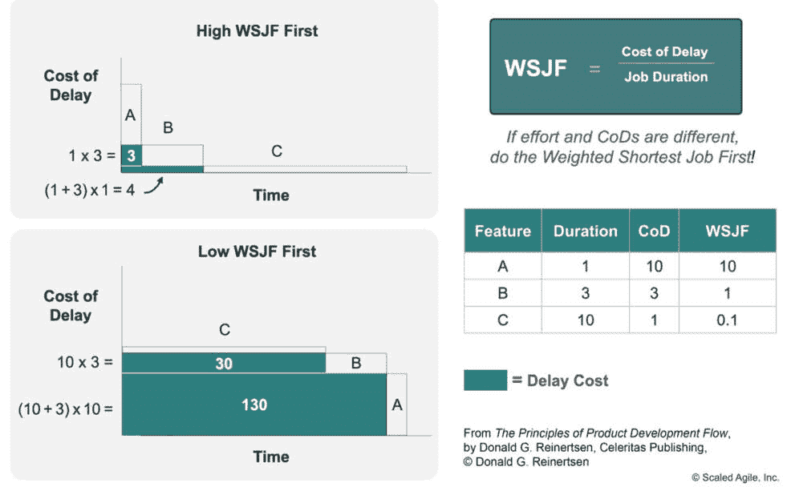
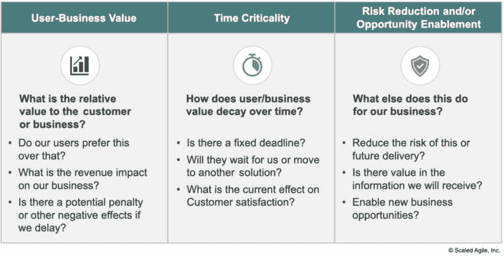
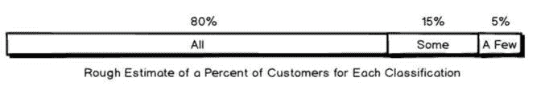
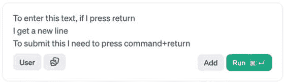
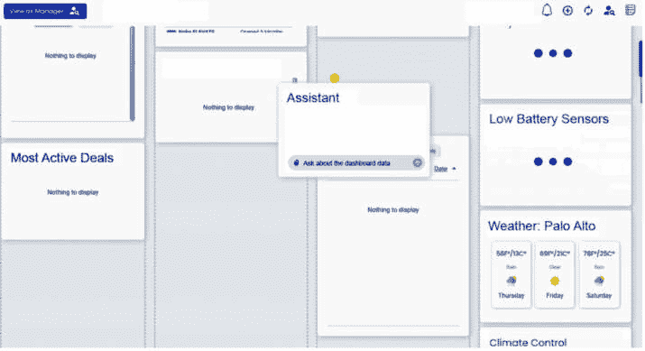
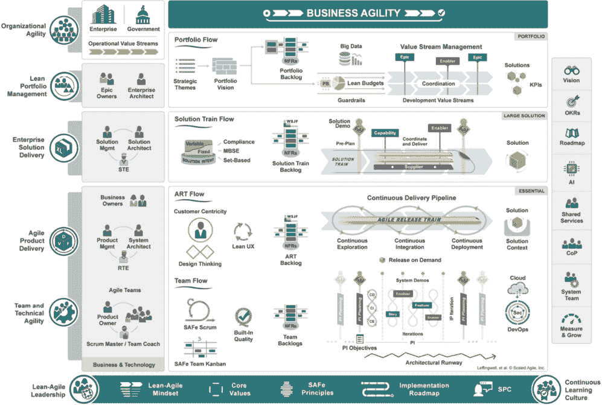

# 4

# 得分故事

成功开发工作的一个秘诀是专注于正确的工作。敏捷方法有助于将努力分解成可管理的部分，但一些概念，如估算扑克（我们将解释），关注的是工作的**成本**，而不是**价值**。我们希望分享一种系统性地分解故事的方法，以便可以根据对客户的价值来优先排序。ChatGPT解决方案需要大量的决策。我们需要优先考虑这些决策。添加或编辑知识、进行更多测试、添加新的集成、更改模型、改进微调或完善提示都必须优先考虑。这看起来可能很明显，但应尽快完成那些提供最大价值的工作。价值较小或只对一小部分客户有益的项目可以稍后处理。我们有一种方法可以将这份工作待办事项按照团队可以理解的方式排序。

我们将深入讨论“用户需求评分”的概念，并将其与开发成本联系起来。这将为[第5章](B21964_05_split_000.xhtml#_idTextAnchor108)“定义期望（用户）体验”奠定基础。

本章将涵盖以下主要内容：

+   优先处理待办事项

+   创建更复杂的评分方法

+   评分的实际情况

# 优先处理待办事项

首先，一些背景和历史。**待办事项**意味着团队需要评估的已知工作的集合。待办事项中的项目越接近被处理，就需要越多的细节来理解和界定它。这就是为什么我们有不同的方法来管理这份工作清单上的项目。有时，一个大型团队会有许多冲刺团队，每个团队管理自己的工作待办事项。然而，由于所有团队都朝着同一个目标前进，理解每个人都在用最有价值的方式处理待办事项是至关重要的。我们将更好地有一个可重复和一致的理解，知道哪些工作应该首先进行。**加权最短作业优先**（**WSJF**）是这些方法之一。

## WSJF

敏捷概念WSJF帮助人们决定哪些工作/任务/项目/特性/内容应该首先获得资源来完成。

我们了解到，最重要的任务并不总是最先完成的，因为它们的价值取决于开发成本。有时，对待办事项进行不同的处理可以为开发投资提供更好的价值（在美国，我们称之为“物有所值”——一美元是美元的另一种说法）。

我有一位优秀的敏捷教练，他对此解释得最好，我将尽力做到公正。WSJF根据**延迟成本**（**CoD**）对客户进行工作优先级排序。客户从未发布的特性中得不到任何价值。尽早发布最有价值的特性可以最小化延迟成本。然而，对于价值相等的两个特性，先交付成本较低的那个。为什么？因为客户可以更早地从产品中获得价值，而不是等待成本更高的特性。

让我们检查*图4.1*，来自**敏捷缩放框架**（**SAFe**）。

图4.1 – 解释CoD

文章：[WSJF](https://scaledagileframework.com/wsjf/) ([https://scaledagileframework.com/wsjf/](https://scaledagileframework.com/wsjf/))

在SAFe中，这个例子基于项目C具有较小的CoD。然而，由于其完成时间较长，其开发阻碍了从交付B和A中获得价值，这在*低WSJF优先*的图形中用它们的`1.0`和`0.1` WSJF值表示。考虑到CoD是一种无法恢复的未实现价值。相反，考虑*高WSJF优先*的例子，其中A首先完成，然后是B，接着是C。现在，由于A包含较高的CoD并且是首先完成的，剩余的CoD就较少。客户可以更早地获得价值。浪费的价值更少，就像在*低WSJF*的例子中，我们首先交付了C。

这允许比较生成式AI产品所需的后备功能。让我们尝试一个有两个功能的例子：密码重置支持和订购更换部件。假设它们对客户的价值相等（我们将在稍后深入探讨如何计算它们的价值）。哪一个应该先做？

密码重置功能开发需要45天，而更换部件功能需要90天。由于人员配置限制，团队只能专注于一个功能。如果密码重置功能发布，客户在更换部件功能发布之前将获得45天的价值。他们从第46天开始从这个功能中获得价值。经过135天，两个功能都完成之后，客户将从重置功能中获得90天的价值。如果他们首先完成更换部件功能，那么他们从这两个功能中总共只能获得45天的价值。通过改变开发顺序，客户实际上将价值翻倍。

我发现很难理解CoD中的负面词汇。CoD发生是因为工作延迟交付给客户，直到它发货之前无法为客户提供价值。这样做实际上假设了一个开发成本估计。我们都可以同意估计是困难的。所有开发团队都知道这一点。相对成本*是合理的*，可以与特征的一致成本进行比较。我们会犯估计错误。对于敏捷Scrum团队，在每个冲刺结束时使用回顾会来持续改进估计成本。

注意

CoD关注的是对消费者的成本。CoD的大小是客户获得价值延迟的函数。延迟一个更有价值的工作以交付一个不那么有价值的工作会产生更大的CoD。

*CoD是指因延迟或未在特定时间内完成工作而损失的钱。它是衡量工作随时间推移的经济价值的一种方法。* —— SAFe网站

Scaled Agile网站上的*图4.2*显示了CoD模型具有一些以用户为中心的元素。

图4.2 – CoD

在与 Scaled Agile 团队交谈后，我们采用了不同的方法，可以提供类似的价值。实施一个可重复、可培训的过程，提供一致的结果是最重要的考虑因素。一个 **评分标准**，一套标准，以及描述创建了一个一致的判断方法。这使得团队外的人更容易理解和欣赏，比传统的 CoD 更容易。

想要了解更多关于 WSJF 的详细信息，请访问 Scaled Agile 网站：

文章：[加权最短作业优先](https://scaledagileframework.com/wsjf/) ([https://scaledagileframework.com/wsjf/](https://scaledagileframework.com/wsjf/))

丽恩特森（Reinertsen）的书籍对于改进开发过程来说非常出色：

书籍：[产品开发流程原理](https://amzn.to/3A3u34C) 由唐纳德·丽恩特森（Donald Reinertsen）撰写 ([https://amzn.to/3A3u34C](https://amzn.to/3A3u34C))

对于那些想要了解 WSJF 之外的开发过程的人来说，这本书是宝贵的。在企业开发中，SAFe 是一个经过深思熟虑、稳健且成熟的模型，用于支持大型组织中的敏捷开发。我强烈建议探索和深入研究可用的内容。

在了解了 WSJF 的基础知识后，你会知道在更短的时间内提供等效价值是有价值的。然而，并非所有功能都是等效的。我们提出了一种新的方法来计算以用户为中心的 CoD 版本。它被称为 **用户需求得分**（**UNS**）。

## 用户需求评分

UNS 是一种以用户为中心的 CoD 方法，考虑了问题或功能的范围、频率和严重性。

UNS 是基于布鲁斯·托格尼奇尼（Bruce Tognazzini）的书籍 *Tog on Design*（1992 年）中发现的精细工作，这本书是菲尔·海恩（Phil Haine）在我担任顾问期间与我分享的。然后我将这项工作改编成了 WSJF 计算的分母。

托格（Tog）的书籍引用了罗宾·杰弗里斯（Robin Jeffries）等人的研究，评估了寻找可用性问题的不同技术，包括启发式评估和指南，我们将在 [*第 9 章*](B21964_09_split_000.xhtml#_idTextAnchor190) *指南和启发式* 可用性测试 ([*第 2 章*](B21964_02_split_000.xhtml#_idTextAnchor031) *进行有效的用户研究*) 和认知遍历（一种可靠的技术）中介绍。

文章：[现实世界中的用户界面评估：四种技术的比较](https://dl.acm.org/doi/pdf/10.1145/108844.108862) 由罗宾·杰弗里斯（Robin Jeffries）等人撰写 ([https://dl.acm.org/doi/pdf/10.1145/108844.108862](https://dl.acm.org/doi/pdf/10.1145/108844.108862))

在杰弗里斯（Jeffries）的研究中，参与者被要求分析问题，以“考虑问题的影響、遇到频率以及受影响的相对用户数量。”他们使用从 1（微不足道）到 9（关键）的指标。我们将以更可重复的方式来构建这个概念进行评分。

SAFe的官方CoD是用户业务价值 + 时间关键性 + 风险降低和/或机会参与，如图*图4**.2*所示。CoD的元素是有意义的；做对客户有益的工作（用户业务价值），尽早交付而不是晚些时候交付具有价值（时间关键性），并通过降低风险帮助改变竞争格局。

我们需要一个一致且可重复的指标，非专业人士可以轻松解释和重复。方法是遵循三个类似的指标，并提供可以一致应用的评分标准。

这里是用户需求评分模型。这个分数将用于功能/错误修复/增强，并将作为我们WSJF计算的分子：

+   **范围**：它影响了多少用户？（3 – 所有，2 – 一些，1 – 几个或有限角色）

+   **频率**：它有多频繁地被使用？（3 – 总是，2 – 有时，1 – 不常）

+   **严重性**：问题有多严重？（4 – 严重，3 – 临界，2 – 重要，1 – 次要重要性）

然后，我们将CoD建模为*范围*乘以*频率*乘以*严重性*。这意味着值从1（1*1*1）到36（3*3*4）。我们将通过许多示例解释每个值和如何评分，以便任何人都可以应用此模型。

对用户价值进行评分并将其除以成本，可以使讨论的双方都发挥作用。评分可以在团队之间进行比较，在SAFe中，它们可以用来将其他团队需要完成的故事以公平和可管理的顺序排列（或者至少进行讨论）。在WSJF中评分最高的*最重要*的事项应该首先完成。我们通过为每个项目评分来进行这种排序。这比在敏捷跟踪工具中*移动事物*直到看起来正确更可重复。

![<math xmlns="http://www.w3.org/1998/Math/MathML" display="block"><mrow><mrow><mi>W</mi><mi>S</mi><mi>F</mi><mi>J</mi><mo>=</mo><mfrac><mrow><mi>S</mi><mi>c</mi><mi>o</mi><mi>p</mi><mi>e</mi><mfenced open="(" close=")"><mrow><mn>1</mn><mi>t</mi><mi>o</mi><mn>3</mn></mrow></mfenced><mi mathvariant="normal">*</mi><mi>F</mi><mi>r</mi><mi>e</mi><mi>q</mi><mi>u</mi><mi>e</mi><mi>n</mi><mi>c</mi><mi>y</mi><mfenced open="(" close=")"><mrow><mn>1</mn><mi>t</mi><mi>o</mi><mn>3</mn></mrow></mfenced><mi mathvariant="normal">*</mi><mi>S</mi><mi>e</mi><mi>v</mi><mi>e</mi><mi>r</mi><mi>i</mi><mi>t</mi><mi>y</mi><mo>(</mo><mn>1</mn><mi>t</mi><mi>o</mi><mn>4</mn><mo>)</mo></mrow><mrow><mi>J</mi><mi>o</mi><mi>b</mi><mi>D</mi><mi>u</mi><mi>r</mi><mi>a</mi><mi>ti</mi><mi>o</mi><mi>n</mi></mrow></mfrac></mrow></mrow></math>](img/2.png)

我们可以采用敏捷团队用来评估这些UNS估算的方法，这些方法可能因团队成员而异。在敏捷中，有一个称为**估算扑克**的概念。想法是独立计算一个特性的成本，然后讨论当值不同时选择这些值的原因。这有助于揭示成员可能没有考虑到的未知元素。我们可以将相同的方法应用于估算用户需求，并继续为开发成本进行估算。

在估算扑克中，团队成员可以协作审查和讨论未完成故事（UNS），并揭示我们对理解和期望的差距。两到三个人必须比较估算以判断UNS。这将教会团队如何进行这种评分。一个人可以单独评分，但会错过其他人的观点价值。一个简单的一到三级的评分方法更有可能达成一致。然而，扑克方法旨在帮助沟通和澄清差异，并在出现分歧时达成共识。评分还将帮助决定是否在添加新功能之前修复错误。通过许多示例可以使这种方法更加直接。

估算扑克（也称为计划扑克）出现在本文的中间部分。请阅读它以了解更多信息。

文章：[故事估算文章中的估算扑克](https://scaledagileframework.com/story) ([https://scaledagileframework.com/story](https://scaledagileframework.com/story)/)

## 评分企业解决方案

学习如何创建评分方法最好的方式是尝试进行评分。我们提供规则，展示典型企业应用中的示例，并指导如何评分一些棘手的故事。然后，用你自己的故事进行练习。

### 如何评分项目

首先，优先处理待办事项的**错误方式**。

看一下列表，看看产品负责人认为应该先做哪些；考虑那些开发者可以快速完成的任务。另一个常见的错误来自最有意志力的团队成员，他们通过大声说话来让自己的工作上升到最前面。这是我们想要避免的。对故事进行无偏见的评分方法允许故事的价值驱动需求。故事的价值应该自我表达。故事可能与前一章中的用例相匹配或为软件错误。有时，用例会被分解成多个故事，以便在冲刺中完成一个故事。在我们的讨论中，故事是我们计划在开发期间交付的用例的一部分。

**正确的方法**是使用**无偏**的方法，通过三步评级系统对项目进行排序。任何了解故事的人都可以生成分数。希望产品负责人、设计师、工程师或其他相关团队成员可以这样做，然后讨论和解决所有各方都没有考虑过的问题。这是通过回答以下问题来完成的。我们将用许多示例和描述来支持这些标准和每个分数的性能水平：

1.  **范围**：它影响了多少用户？用3到1的分数回答。

1.  **频率**：它有多频繁地被使用？用3到1的分数回答。

1.  **严重性**：问题有多严重？用4到1的分数回答。

1.  通过将它们相乘来计算每个项目的得分（例如，3*2*2 = 12）。

1.  按得分对故事进行排序。随着新故事的到来，对它们进行评分。它们将自然地落入用户价值的正确顺序。

1.  开发团队估算这些故事的成本。

1.  将得分除以估计的成本。通常，从最重要的用户需求评分项开始工作。

1.  如果某件事物花费过高，它可能需要分解成更小的故事。

### 如何保持评分的一致性

通过学习一些简单的规则，具有对分数有共同理解的独立人员应该能够对相同的项进行类似的评分。然而，差异是存在的。让其他人评分相同的文章，如果他们给出了不同的分数，讨论原因。十有八九会达成共识。如果对问题范围有困惑，某人可能低估了它。范围很少随着时间的推移而缩小，所以保守一些。使用较大的值。我们将深入挖掘UN中的每个分数的评分标准。我见过团队在中间值上达成一致（他们无法决定是2还是3，所以评分2.5）。这是一个选项，但这种规避方法通常是不必要的。需要确保故事跟踪工具支持这一点。我开发了与Jira和Oracle内部缺陷系统的集成，使用下拉菜单来简化选择整数的操作。然而，我们欣赏不浪费时间，所以只在需要时进行。不要在意见不一致的情况下自动取中间值。讨论分数背后的原因。我们可以解释每个分数背后的评分标准。

备注

在评分功能时，隔离正在评分的维度至关重要。忽略其他两个因素。独立于其他两个因素对每个因素进行评分。

#### 范围 – 它影响了多少用户？

*3 – 所有，2 – 一些，1 – 几个或有限的* *用户角色*

当考虑为谁进行此更改时，请考虑该群体在产品总客户数中的背景。它不能仅基于使用特定功能的人。**每个人**都会登录到安全门户以访问企业ChatGPT或其他服务 - 因此，登录问题得分为3。同时，只有少数人自定义他们的主页。有人可能会将其评为1。不要改变范围，并说，“好吧，**在**自定义的人群中，**所有人**都会使用这个功能。”这不是那样工作的。分数需要与其他故事和不同团队进行比较。目标是确定通过应用资源可以获得最大好处的地方，因此作弊对产品没有帮助。只关注受影响的用户数量。在此步骤中忽略严重性和问题的严重程度。

事实上，无法登录与在手机上“登录”字样奇怪地环绕的情况不同。我们将在最后一个用户指标中处理这个问题。

企业解决方案可能位于聊天界面中；部分可能是混合UI中的对话结果或从ChatGPT后端渲染的数据。无论形式如何，每个都可以影响少数或许多用户。

这里有一些可以得3分的范围示例：

+   常见问题和答案（因为“每个人”都会这样做）

+   登录

+   阻止登录或注册的着陆页问题

+   设置账户

+   几乎在所有情况下都响应非常缓慢

+   缺失主要用例

这里有一些可以得2分的范围示例：

+   常见问题和答案

+   服务、门户或网站的注册

+   自定义用户资料

+   在某些条件下响应缓慢

+   导出聊天记录的能力（分数取决于用例）

+   缺失的次要用例

这里有一些1分的范围示例：

+   不常见的问题和答案

+   在他们的资料中添加头像

+   导出聊天记录的能力（分数取决于用例）

+   在特定条件下响应缓慢

+   在小众群体使用的功能中缺少帮助链接

+   缺失的支持用例

我们希望对**每个人**都保持灵活，就像在**图4**.3**中那样。把它想象成几乎每个人，或者大约80%或更多，2代表下一个15%，1将是5%或更少的用户。

图4.3 – 所有用户都是80%或更高，而一些和少数用户在尾部

讨论和辩论，但努力保持评分的一致性。有时，每个人这个词意味着非常接近每个人，比如登录在线银行的客户。然而，我们知道一些老年人可能会避免在线银行，而且其中一些登录的人是高价值客户。如果所有事情都平等，为所有用户做某事比为少数人做某事更有价值。一旦了解了受影响的用户数量，请考虑问题、任务或动作发生的频率。

#### 频率 - 使用频率如何

**3 – 总是，2 – 有时，1 – 不常**

如果每次用户来这里时问题都存在，那么很容易将其评为3级。如果只在特定的模式或状态下发生，那么它就是2级，那些偶尔出现的烦人错误就是1级。判断问题是否偶尔或很少发生，因为乘以1没有任何作用。考虑到间歇性错误难以重现。如果在日志分析或反复出现的错误中记录了错误，将其评为2级。有一定的灵活性，但总是意味着总是；使用一致的方法来判断2级和1级。如果不到5%到10%的时间，它就是1级。不要考虑所评分的重要性。这将在第三项评分中判断。

这里是一些3级频率的例子：

+   问题的答案总是错误的

+   每次打开对话框时，它都是空的

+   总是出现的拼写或语法错误

+   即便不需要或想要，滚动条总是会显示

+   对话的语气或风格需要调整

+   聊天不会回忆起在此会话中设置的上下文

这里是一些2级频率的例子：

+   问题的答案有时需要更正

+   如果你保存的名称太大，则会被截断

+   使用产品10分钟后出现超时错误，这太早了（如果通常超时是4小时）

+   有时对话框会出现在屏幕之外

+   在许多情况下，对话的风格或语气需要调整

+   聊天有时不会回忆起上下文

这里是一些1级频率的例子：

+   在特定的使用场景中，对话的风格或语气是错误的

+   错误很少出现，但无法理解原因。在那个会话中只发生了一次，但一切正常

+   在保存聊天会话时，偶尔会出现错误

+   有时在返回聊天窗口时，它会忘记我们处于哪个步骤，并显示已经确认的错误信息

在查看日志时，可能不明显地知道某事发生的频率。最好是查看更大范围的日志或测试实例来了解频率。但有时这更多是二或一的判断，因为数据很少。记住，这仅仅是频率；不要因为有些是严重问题而感到恐慌；我们应该在下一个环节捕捉到它们。

#### 严重性 – 问题有多严重？

*4 – 严重，3 – 严重，2 – 重要，1 – 不重要*

这是最容易评分的，或者不是吗？严重性有时是激烈争论的。与大多数组织的常见错误严重性（Sev）相比，我们的值是相反的。因为所有组织都有严重性，所以这似乎很容易做。但并不总是这样。我们的评分需要使用更大的数字来表示更高的价值。我们可以分解人们对严重性的看法以及我们分配给每个严重性的分数。

实际的**严重性1**问题只偶尔出现。严重性1意味着**服务中断 – 不可用**，没有解决方案。我们通常在开发中不常看到严重性1，因为代码尚未投入生产，因此生产系统没有被评估。但从可用性的角度来看，如果任务无法完成，那就是可用性严重性1，因此它是最重要的，所以我们将其分配为最大值，4。很可能这些只是错误。一个组织应该有一份定义列表来帮助优先处理错误；从那开始。如果没有，可以创建一个。我让我的办公桌上打印了一份，以提醒我错误的类别及其价值。在我之前的公司，我们有一个低于严重性1的类别，称为**严重性2** **Showstopper**。因为它们是阻止者，是一个阻碍进展的重大问题，所以我们也会将这些归类为4。从那里，我们进入严重性2，价值3分。它代表导致重大用户障碍的关键问题。严重性3价值2分。这些问题会导致一些问题，但可能不会让客户大声尖叫。最后，严重性4分配1分。这些都是小问题。大多数组织都有1到4的严重性等级，所以我们有4到1的值。

注意

在大多数组织中，严重性是很容易理解的；将定义扩展到包括LLM问题并反转值是一个好的开始。如果组织的评分模型扩展到4以上，考虑将其映射下来。应用五个或六个点的严重性等级将大大增加其在UN中的权重。这是一个选择，但我们将在本章后面讨论UN计算中加权的缺点。

对于错误，严重性是很容易理解的，但对于新特性的关键性或优先级可能就不适用了。就我们的目的而言，我们在这里使用一个衡量标准。以下是一些例子，考虑了问题、故事、特性或UI或ChatGPT启用解决方案中的交互。它们只是用来进一步讨论的例子。

严重性为4 – 严重（相当于严重性1）的例子：

+   **美国残疾人法案 (ADA) 和网络内容可访问性指南 (WCAG) 或一个国家的等效标准**：主要可访问性问题，包括缺少标签、非标准缩写、仅使用颜色来区分**UI**元素和聊天，以及不可导航或屏幕阅读器无法读取的建议。聊天或建议不可访问。

    文章：[网络内容可访问性指南](https://en.wikipedia.org/wiki/Web_Content_Accessibility_Guidelines) ([https://en.wikipedia.org/wiki/Web_Content_Accessibility_Guidelines](https://en.wikipedia.org/wiki/Web_Content_Accessibility_Guidelines))

+   **国家语言支持 (NLS)**: 缺少的消息文件导致页面无法渲染，错误信息混乱，无法翻译字符串，或在聊天或推荐中显示错误的语言。

    文章：[国际化与本地化](https://en.wikipedia.org/wiki/Internationalization_and_localization) ([https://en.wikipedia.org/wiki/Internationalization_and_localization](https://en.wikipedia.org/wiki/Internationalization_and_localization))

+   帮助信息未出现或引导用户走向错误路径。

+   **性能问题（超出服务水平）**：系统或产品需要更加响应。其响应时间显著低于任何设定的目标。

+   选择了错误的模型（即，当提示应该将用户引导到费用报告时，却将用户路由到时间报告）。

+   公司特定的语言被误解，启动了错误的流程或任务。

+   用户陷入循环，LLM不允许他们退出。

+   LLM误解了通道能力，导致任务失败。

严重程度示例 3 – 严重（通常是P2 bug）：

+   帮助信息错误，但不会导致用户进一步错误

+   大部分用户需要帮助才能完成任务

+   在工作流程中丢失上下文

+   错别字（影响或改变意义）

+   可扩展性问题（如具有数千个元素的穿梭组件）

+   用户没有被阻止犯下严重的错误（并且没有撤销功能）

+   多个实体不被理解

+   公司特定的语言不被理解

+   用户必须以不同的方式重复自己才能被理解

+   LLM误解了通道能力，导致任务问题

严重程度示例 2 – 重要（bug系统中的P3）：

+   帮助信息不明确、冗长或过于复杂，但事实上是正确的

+   大多数用户需要帮助才能完成任务

+   向客户展示的概念难以理解或过于技术性

+   布局需要更加明确

+   错误的页面标题或部分标签

+   错误的导航路径（如果用户失去上下文则向上提升）

+   不正确的时间格式导致用户错误（如安排会议）

+   语法错误

+   大多数实体集合被理解，但有一个被遗漏

+   解决方案没有有效地利用特定渠道的优势

+   重大不一致性（如按钮顺序）导致用户错误或缺少单位，可能会让用户困惑

+   用户没有被阻止犯下严重的错误（但可以撤销）

严重程度示例 1 – 次要（bug的P4）：

+   小型不一致性（按钮顺序、使用“删除”代替“移除”、使用“确定”代替“继续”或数字后缺少单位，但仍然可以理解）

+   空白表格单元格的不正确使用与“N/A”或不可用

+   缺少正确的分页或分段

+   过于冗长或过于简略

+   不同的布局、表格、格式或UI元素可以改善LLM的响应。

并非所有这些问题都像我们可能预期的那样简单明了。不要担心；决定对客户来说什么是重要的。我们不期望每位读者都同意所有前面的例子。根据问题决定它们属于哪个类别，与团队分享例子以减少混淆，为评分标准建立一个共同的理解，并根据它们的评分来解决问题。

## 评分示例

练习学习这种方法。为了评分，我们使用 UNS 值并将它们相乘。然后，包括开发成本估算工作，以优先级和解决这些问题。

开发团队通常从T恤尺码开始。他们使用**超小**（**XS**）、**小**（**S**）、**中**（**M**）、**大**（**L**）、**超大**（**XL**）等来估算开发成本。他们必须在某个时候做数学运算，将这些转换为故事点，这是敏捷开发或开发天数的标准度量单位。在使用数字时，斐波那契数列通常用于这种估算。数字（1，2，3，5，8，13，21，34）随着每个间隔的增长来传达衡量大型项目的复杂性。估计值越大，间隔就越大，因为更大的努力在估算时具有更大的变异性。它们通常用于估算开发成本。一旦有数字，将 UNS 除以开发成本。这只有在故事足够接近开发，理解足够清晰，可以超出 T恤尺码进行成本估算时才做。开发可以使用团队同意的代理，如 T恤尺码（1-XS，2-S，5-M，8-L，13-XL 等）。然而，进行实际的成本估算练习，以更好地了解正在构建的内容。*表 4.1* 包含了一些 GUI 设计示例。这些例子包括对话问题。一旦理解了这些问题，开发就可以更准确地估算它们的成本。

| **来自 ChatGPT** **Web 体验** **的样本** | **范围** | **频率** | **严重性** | **UNS** | **开发成本** |
| --- | --- | --- | --- | --- | --- |
| **1. 浏览器后退功能不会** **返回** | 3 | 3 | 4 | 36 | XL |
| **2. 文本：“运行”应在** **工具栏** **中称为“搜索”** | 3 | 3 | 2 | 18 | XS |
| **3. 在** **字段** **中按回车键无法提交提示** | 3 | 3 | 2 | 18 | L |
| **4. 对话式用户界面** **缺少垂直滚动条** | 2 | 3 | 3 | 18 | M |
| **5. “企业支持建议”是一个** **令人困惑的术语** | 2 | 3 | 2 | 12 | XS |
| **6. 栏目化的答案需要** **正确排序** | 2 | 3 | 2 | 12 | M |
| **7. 默认用户界面语言与** **网站** **不匹配** | 2 | 3 | 2 | 12 | M |
| **8. 文本和格式化数字应** **正确对齐** | 3 | 3 | 1 | 9 | XS |
| **9. 图片** **没有标签** | 2 | 2 | 2 | 8 | L |
| **10. 任务区域不能被拖动或移动到** **屏幕上** | 1 | 3 | 2 | 6 | M |

表 4.1 – 用户需求评分问题

让团队决定成本计算方法是一项挑战；这个焦点在于价值方法。为了了解为什么使用斐波那契数而不是小时或天的时间，了解故事点。在开始这个简单的解释之后，做一些搜索。如果你对故事点表示赞同，可以跳过这篇文章。

文章：[为什么我们使用故事点进行估算？](https://www.scrum.org/resources/blog/why-do-we-use-story-points-estimating) ([https://www.scrum.org/resources/blog/why-do-we-use-story-points-estimating](https://www.scrum.org/resources/blog/why-do-we-use-story-points-estimating))

在*表4.1*中每个项目的UNS值背后都有一定的理由。因为你对应用程序不熟悉，所以每个项目都提供了上下文。我们将把这些例子与生成式AI应用中典型的LLM问题联系起来：

1.  浏览器的后退按钮不会“后退”：

    +   **背景**：在构建Web应用时，过程可能从一个网页跳转到另一个网页；用户偶尔想要返回上一步是很自然的。因此，他们会点击浏览器的后退按钮。如果没有为此进行编码，应用将无法正确导航。

    +   **原因**：因为用户感到迷茫且无法返回主UI，所以这个问题需要立即解决。技术栈在支持后退功能时存在问题，这也是开发成本高的原因。这意味着需要重新设计浏览器会话的创建方式，因此成为一个挑战。如果成本低于第二项的两倍（因为其分数是第二项的一半），那么在解决第二项之前先解决第一项仍然更有价值。当LLM聊天集成到现有应用中时，会出现各种问题：在同一个网站上打开新标签页或窗口时，对话是否会从上次结束的地方继续？浏览器中的后退按钮如何影响对话线程？当客户在多个窗口中交互时，对话是否会与多个打开的窗口混淆？

1.  **文本**：“运行”在工具栏中应称为“搜索”：

    +   **背景**：在设计用于搜索数据库的UI时，我们通常会看到一个搜索字段。除了“搜索”之外的其他术语可能会令人困惑。

    +   **原因**：除非是动态的（根据用户资料或其他因素变化的文本），否则UI上的文本将始终对所有用户可见；它总是对受影响的用户数量得分为三。每个人都在这个应用中搜索。如果“运行”标签基于用户资料生成，它可能只针对部分受众，并在某些条件下出现。在这个例子中，它始终在屏幕上，并且始终被使用，因此频率也是三。在评估严重性时，如果它导致错误的交互，得分为三；如果文本只是令人困惑，得分为二。

    +   **替代UI考虑因素**：如果这是一个来自聊天提示的对话式搜索，我们将训练我们的模型理解搜索功能的多种名称（例如，**帮我找到所有具有…的手机型号**，**有哪些手机型号具有…**，**列出手机型号…**）。默认模型应该很快就能捕捉到这种细微差别，但在企业特定任务中，需要训练模型理解任务以及询问这些任务的各种方式。这需要提示工程和微调，我们将在[*第7章*](B21964_07.xhtml#_idTextAnchor150)，*提示工程*中开始介绍。

1.  在字段中按回车键无法提交提示：

    +   **背景**：ChatGPT游乐场中也有类似的问题。他们决定键盘上的*回车*键应该用于在文本输入字段中创建换行符。要提交文本，请按*command* + *回车*（在Mac上），如图*图4.4*所示。

图4.4 – 使用不自然的键盘输入提交示例

+   **推理**：我们理解人们在移动或桌面设备上如何自然地按键盘上的回车键来提交表单。他们必须停下来处理屏幕上的按钮点击，当这种情况没有发生时。在ChatGPT的*图4.4*中，他们必须同时按下两个键盘按钮。这很烦人，也不自然。因此，它在严重性量表上得分为2。用户可能*永远不会*习惯这种交互，因为它与他们已经做的99%的交互不同。OpenAI的交互设计师可能在这场战斗中失败了，但他们确实在按钮标签中包含了*command* + *回车*命令。这最多算是一个折衷方案，但至少是一个可见的提醒。这是一个[*第9章*](B21964_09_split_000.xhtml#_idTextAnchor190)，*指南和启发式方法*中涵盖的视觉提示的例子。

1.  对话式UI中缺少垂直滚动条：

    +   **背景**：如果存在滚动文本但没有滚动条，用户将难以获取他们的结果。

    +   **推理**：在这种情况下，滚动条缺失了。这不仅仅是因为操作系统设置而隐藏，但它并不是所有用户都会遇到（得分为2）。它只会在文本很多且不是所有答案都很长的情况下发生。然而，如果用户想阅读整个答案，滚动条没有出现或不受支持将是一个大问题（得分为3）。这个案例有一些解决方案，但我们仍然可以看到这个关键问题的得分很高（严重性得分为3）。

1.  *企业支持建议*是一个需要澄清的术语：

    +   **背景**：如果术语对用户群体来说不熟悉，他们可能会错过关于他们任务的重要信息。

    +   **理由**：客户反馈表明这个术语需要澄清。我们理解结果可以写得更加以用户为中心，而不是那么技术化。有些人会理解这个术语，所以它只评分为2。它将始终被使用；每个人都会看到它，所以在频率尺度上它是3。但是有帮助的，这个术语包括诸如*支持*和*推荐*等关键词，所以额外的词“企业”并没有增加任何价值；它不是关键的。正如预期的那样，编辑一个词并不难，所以成本是极小的。对话风格、语气和语言可能会引起问题。审查知识和帮助的编写方式，并努力通过提示工程来解决LLM如何响应的问题。

1.  列表结果需要正确排序：

    +   **背景**：列表的逻辑顺序应该是默认的。如果存在多个逻辑顺序，应允许用户控制，并且可以使用客户历史记录来决定默认顺序。

    +   **理由**：在文档和表格中的数据挑战在于保留表格特征。这样，一些信息得到了保持和清晰。例如，按字母顺序显示国家前25名大学橄榄球队并不有用。它们应该按当前大学排名排序。表格应包括最后排名的日历日期（以便旧数据明显）。然而，只有一些用户要求这种数据，如果表格可排序，那么请求数据排序的解决方案就很简单。在这个例子中，我们预计不会对足球前25名球队进行排序。在第5章[定义期望体验](B21964_05_split_000.xhtml#_idTextAnchor108)中，我们将详细介绍在小型聊天窗口中使用表格。表格的空间有时非常紧张。在桌面网页体验中可接受的表格在移动聊天体验中可能不起作用。在这种情况下，并非所有用户都受到表格的影响（评分为2），但它始终是一个问题，因为它附带了糟糕的排序选择（评分为3）。由于数据类型的原因，这不是一个大问题（评分为2）。关键数据，如本月份可能关闭的交易，需要良好的排序顺序（交易规模、关闭的可能性）以及使用GUI或通过对话更改顺序的能力。

        按离我最近的潜水距离排序交易

        按数量显示订单

        显示需要最多关注且能给我带来最多佣金的交易

1.  默认UI语言与网站不匹配：

    +   **背景**：[第9章](B21964_09_split_000.xhtml#_idTextAnchor190)，*指南和启发式方法*将讨论匹配客户的语言和理解。如果存在不同的术语表示相同的意思（在企业中很常见），用户可能只理解在适当语境中的术语。这适用于口语和书面语言。

    +   **推理**：在国际用户界面中尊重客户的愿望。如果他们已将界面设置为西班牙语，则应提供西班牙语的对话聊天或AI结果。如果他们必须用西班牙语请求，*“西班牙语，请”，* 这是一种失败。如果并非所有信息都是西班牙语，那么失败更为严重。如果LLM支持多种语言，它将如何对两种语言的组合做出反应？关于词语选择、国际化或文化问题的问题应评估是否需要修复或重做。我们将在下一章中讨论一些这些问题。在这个例子中，大多数客户使用英语工作，因此每个主要语言对受影响的客户得分为2。他们总是会遇到这个问题（得分为3）。根据语言和用户，严重性通常为2。如果用户只能用他们的母语工作，而网站不支持，则得分为4。

1.  文本和格式化数字应正确对齐：

    +   **背景**：货币、表格数据和**名称：值**对必须以特定的方式对齐。

    +   **推理**：只要标签和对齐不影响理解，即使它们总是出现，这些得分也会较小。决定风格和干净体验对公司来说有多重要。然而，正如所示，这些是低（XS）成本，因此通过一些工作，它们将相应地被优先考虑并修复。通常，格式化可以是LLM的问题。在聊天体验中，客户可能能够指导LLM更改格式（例如，**以表格形式显示**）或以不同的方式呈现结果。可能需要对LLM给出的指令进行改进。

1.  图像没有标签：

    +   **背景**：当UI包含图像时，例如在搜索结果中，它们必须用文字进行标记。使用LLM比人类更详细地标记这些图像是可能的。例如，我们可能在服装网站上展示鞋子。“鞋子”不是一个不常见的标签，屏幕阅读器可以为视觉障碍者读取。图像分析LLM可能提供更准确的“带有皮革上部的耐克网球鞋，底部有红色、绿色和黄色的面板，以及带有粘扣带的透明鞋底。”

    +   **原因**: 根据上下文，没有标签的图片可能比仅仅是一个可访问性问题更重要。在这种情况下，这些照片更多的是装饰性的，并且由对话中的文本支持。但要注意这一点：确保体验是可访问的，并且如果标签是由AI生成的，它们应代表对目的的清晰理解。重要的图片必须为视觉障碍者描述。GPT 4o可以理解和呈现图片的细节。因此，用户可以听到描述并做出购买决定。这些描述不一定会在屏幕上显示。屏幕阅读器将从HTML元数据中提取描述并朗读。这可以通过批量处理请求描述并将其存储在数据库中来以较低的成本完成。ChatGPT中的批量处理可以节省金钱。这些健壮的标签也可以输入到搜索中，以实现无需额外LLM成本的健壮搜索。

1.  任务区域不能拖动或移动到屏幕上：

    +   **背景**: 企业用户有仪表盘。由于LLM的存在，仪表盘将变得更加智能。先来预览一下：[*第12章*](B21964_12.xhtml#_idTextAnchor259)，*结论*将讨论智慧的价值，这是每个仪表盘都应该具备的。用户尝试添加默认未显示的区域。如果他们去自定义页面，却无法添加或移动某些区域，他们会认为这是一个错误。*图4.5*展示了通过拖动将聊天区域添加到仪表盘的过程。如果不起作用，那就是这个问题。

图4.5 – 将区域拖动到仪表盘上

+   **原因**: 这与一个UI功能有关，该功能允许自定义区域以及ChatGPT体验。然而，只有少数人这样做（得分为1）；他们让它在页面上保持原样。尽管问题始终存在，但大多数人不会注意到它。

即使在ChatGPT聊天窗口中，我们也可以展示表格，在结果中包含图片（如产品图片、示意图或图表），使用不正确的术语，甚至有滚动问题。ChatGPT不是企业中的独立解决方案；它是更广泛解决方案的一部分，因此不仅可能包含LLM特有的问题，还可能包含GUI问题。

## 对待办事项进行排序

现在我们来完成我们的想法。我们已经用故事点替换了我们的开发成本。然后我们可以计算和优先处理我们的待办事项。在*表4.2*中，填入分数后，什么会浮出水面？

| **来自集成ChatGPT** **Web体验的样本** | **UNSs** | **开发成本** | **WSJF** |
| --- | --- | --- | --- |
| **2. 文本：“运行”应在** **工具栏中称为“搜索”** | 18 | 3 | 6 |
| **5. “企业支持建议”是一个** **令人困惑的术语** | 12 | 4 | 3 |
| **8. 文本和格式化数字应** **正确对齐** | 9 | 6 | 1.5 |
| **4. 对话式UI中缺少** **垂直滚动条** | 18 | 14 | 1.23 |
| **6. 列表答案需要** **正确排序** | 12 | 10 | 1.2 |
| **7. 默认UI语言** **不匹配** **网站** | 12 | 12 | 1 |
| **3. 在** **字段**中按回车键无法提交提示** | 18 | 20 | 0.9 |
| **1. 浏览器的后退按钮不会** **后退** | 36 | 43 | 0.84 |
| **9. 图片** **没有标签** | 8 | 16 | 0.5 |
| **10. 当任务区域为空时，无法将** **自定义区域** **拖放到屏幕上** | 6 | 24 | 0.25 |

表 4.2 – 按WSJF排序的故事（WSJF较大的应优先开发）

行号从上一张表显示，以显示顺序如何变化。以下是一些评分结果观察：

+   前三项都是低成本，也称为*低垂的果实*。它们容易摘取和完成，但它们不更令人兴奋吗？

+   表格中的第八项（1. 浏览器的后退按钮不会“后退”）具有最大的成本，但我们注意到它具有最高的UNSA。再次审查并评估是否有一个更简单的解决方案可以在较低的成本下带来大部分价值。如果属实，那个新解决方案可能跃升至列表的第三位。有时，简单的解决方案可以解决复杂问题的一部分。

+   有多个项目具有相同的UNSA，但一旦计算了WSJF，就没有两个项目具有相同的分数。这实际上是因为我们只评分了十个项目。在现实中，可能会有并列。这意味着做任何并列的项目都是可接受的。

## 修补案例研究回顾

在[*第 3 章*](B21964_03.xhtml#_idTextAnchor058)的修补示例中，*确定ChatGPT的最佳用例*，我们讨论了多个LLM机会。然而，现在我们有用户评分，我们应该重新审视这些交互。为了保持简单，我们将从*表 3.4*中选取前三项机会，重新介绍步骤，并添加WSJF评分，如*表 4.3*所示。

| **为ChatGPT支持确定的** **优先步骤** | **UNSA****(****A*B*C)** | **开发成本** | **WSJF** |
| --- | --- | --- | --- |
| **1) 步骤 11：从现有案例生成测试。识别测试中的** **差距** **。** | 12 | 8 | 1.5 |
| **2) 步骤 12：监控生产实例** **的异常情况**。 | 8 | 16 | 0.50 |
| **3) 步骤 6：预测修补计划的** **结果，以及缺失或** **冲突修补的影响**。 | 8 | 32 | 0.25 |

表 4.3 – 按WSJF优先级排序的ChatGPT用例

因此，我们现在有最关键的补丁问题需要解决。因为UNs非常接近（如[*第3章*](B21964_03.xhtml#_idTextAnchor058)，*识别ChatGPT的最佳用例)所述)，最终取决于哪个项目最易于实施。对*步骤11*进行LLM解决方案的成本估计较低，因为模型需要更少的移动部件来生成测试用例。我们需要了解软件的元信息、版本、平台、操作系统补丁级别、现有补丁列表，以及我们可以用来与现有错误信息结合以创建LLM顾问的信息。开发用于*步骤12*以监控异常的模型需要额外的数据源，因此需要更多的API工作来收集和提供数据。预测补丁计划成功的*步骤6*由于预测如何*数万亿*可能的补丁组合可能影响安装的复杂性，因此构建和维护成本最高。每个步骤都代表其自身的LLM模型，可能不止一个模型，在第[*第8章*](B21964_08.xhtml#_idTextAnchor172)，*微调*中进行了讨论。有很多重叠，但输入和输出将会有所不同。根据生产实例的客户数据了解哪些补丁集合是稳定的，比了解*应该*工作的情况更好。当我们试图包括理解什么可能使其更好或更差时，问题变得更加复杂，这就是为什么*步骤6*的估计值要大得多。您的用例将比我们尝试解释那些对该领域不熟悉的人的补丁过程更容易理解。还有关于LLM作为对话的一部分或来自推荐的响应质量的例子；我也想谈谈这一点。

我们知道LLM将会尝试进行幻觉并尝试做出回应。[*第7章*](B21964_07.xhtml#_idTextAnchor150)，*提示工程*，将讨论如何通过创建护栏和指令来控制LLM的输出。当LLM生成错误输出时，这成为一个评分问题。日志显示了哪些客户受到了问题的影响。监控输出将有助于识别问题的频率。根据评分标准判断问题的严重性。

对于评分没有统一的答案；这取决于。幻觉可能有害或不是那么糟糕。它们可能经常发生或很少发生，可能影响所有客户或仅影响特定受众。同样，这可能是缺乏或知识冲突、缺少API、LLM未考虑的来源、培训不当、提示不明确，或者只是超出应用程序的范围。通过日志分析，如[*第2章*](B21964_02_split_000.xhtml#_idTextAnchor031)，*进行有效的用户研究*中所述，加上评分和优先级排序的努力，团队拥有了处理重要工作的所需工具。将软件跟踪工具扩展到实施此过程。

## 通过评分扩展跟踪工具

大多数敏捷、产品或错误跟踪工具都可以展示额外的字段或列。例如，一个开发优先级下拉菜单（1到4是典型的）可能已经存在。UNS字段类似，但更多地基于以用户为中心的属性。

在公司的跟踪工具中展示所有四个字段（三个个人得分和最终可排序的得分）。这允许进行可见性和讨论来验证假设。正如提到的，可能会有轻微的分歧，展示得分将使其公开化。预期能够使用此方法来驱动故事的排序和错误排序，以便冲刺团队、发布管理和客户可以看到这种排序是如何以及为什么存在的。透明度在这里是最好的。在跟踪工具中评分，然后按得分排序。Jira非常受欢迎，支持自定义字段甚至计算。WSJF在Rally中得到支持，大多数工具都可以通过自定义处理这些得分。

## 尝试用户需求评分方法

这里有一个带有示例的电子表格，带有下拉菜单和计算。这可能有助于开始。带来一些示例，作为一个团队来理解这个方法，并填写故事和得分。

GitHub: [评分故事样本工作表](https://github.com/PacktPublishing/UX-for-Enterprise-ChatGPT-Solutions/blob/main/Chapter4-ScoringStoriesSamples.xlsx) ([https://github.com/PacktPublishing/UX-for-Enterprise-ChatGPT-Solutions/blob/main/Chapter4-ScoringStoriesSamples.xlsx](https://github.com/PacktPublishing/UX-for-Enterprise-ChatGPT-Solutions/blob/main/Chapter4-ScoringStoriesSamples.xlsx))

点击图4.6中突出显示的下载按钮，将文件下载到桌面。GitHub上没有这些文件的查看器。

图4.6 – 如何从GitHub下载文件

一张简单的纸和笔工作表可以在研讨会中分享，向团队介绍这个概念，并指导人们完成这个过程。

GitHub: [评分工作表](https://github.com/PacktPublishing/UX-for-Enterprise-ChatGPT-Solutions/blob/main/Chapter4-Scoring_Worksheet_for_Design%20WSJF.pdf) ([https://github.com/PacktPublishing/UX-for-Enterprise-ChatGPT-Solutions/blob/main/Chapter4-Scoring_Worksheet_for_Design%20WSJF.pdf](https://github.com/PacktPublishing/UX-for-Enterprise-ChatGPT-Solutions/blob/main/Chapter4-Scoring_Worksheet_for_Design%20WSJF.pdf))

当然，有时候过多并不是好事。抵制使用更多措施和能力来增强评分的需求。从小处着手。让我解释一下原因。

# 创建更复杂的评分方法

我们被提醒了**KISS（Keep it simple, silly）原则**。一个组织可以做到极致，创建一个如此复杂的评分系统，以至于没有人能理解得分2,032和2,840之间的区别。我了解一个系统，它有17个因素，根据谁升级了问题（如果是一个副总裁升级问题，那么它的价值比我做要高），问题提交时的年龄，以及其严重性，以及其他许多因素来加减分。每个人都想将自己的因素纳入评分中。抵制这种做法。

我发现（并且一些简单的调查可以证实）一个凡人几乎不可能通过基于17个因素的评分来获得对工作输出的良好感觉。确实，提出的简单评分方法不会区分20个故事，它们都有12分的评分。然而，当我们考虑到几个敏捷团队分配的成本和工作时，可能会有更大的差异。在敏捷待办事项中，项目等待轮到它们是完全可以接受的。考虑一下，如果包括对并列项目的排名规则会有所帮助。例如，对于所有客户的12分问题应该比来自更少客户的更糟糕的bug的12分问题有更高的优先级。然而，复杂性越高，理解和判断差异就越困难。确定这是否值得额外的复杂性、混淆和开销。至少，我们主张不排名故事和任意评分。使用一种可重复的方法，甚至可以跨团队一致应用。因此，在待办事项上汇总排名是一种苹果对苹果的比较。一旦故事根据成本划分，价值就会分散。此外，我们的目标不是分散。如果两个故事被判断为相同，那么完成任何一个故事的价值都是一样的。

从WSJF自上而下工作不是一种宗教。我们不一定将WSJF视为教条。它是一个指南。除了作为指南外，不同的团队有时有特定的专业知识（并非所有组织都能在敏捷团队做所有事情方面做到完美）。因此，这可能会影响团队从待办事项中选择的优先级。选择第三项，而将前两项留给另一个团队可能是最有效和最明智的方法。

## 在敏捷中处理多个待办事项

通常，在大型的企业开发环境中，我们会有不止一个待办事项列表。因此，这次讨论是为那些熟悉多个冲刺团队规划复杂性的朋友们准备的。冲刺的Scrum团队有一个待办事项列表，项目、可能还有项目组合和发布也都有。但事实上，这些都是虚拟的，为一个冲刺标记一个项目并不意味着忽略其他所有待办事项的上下文。如果做得恰当，一个单一的大待办事项列表有时有助于从中提取一些关键指标。在规模化的敏捷开发中，他们会查看不同级别的故事汇总。在项目组合层面，可以查看分解为故事的功能。如果一个功能得分为36分，并不意味着该功能中的所有故事都将具有相同的价值。随着分解的进行，有些故事比其他故事更重要。

项目或产品级别的待办事项列表可能跨越30个或更多团队，正如我的旧组织所做的那样。如果几个团队代表了50%的待办事项（现在考虑的是故事点或工作量，而不是项目数量），那么可能需要重新考虑团队分配的方式。如果团队使用不同的模型来估算故事成本，比较起来会很困难。然而，我们还想平衡团队的自主性。在规模化的敏捷开发中，当许多敏捷团队开发同一应用程序时，需要一个关于故事点的良好记录的方法。对于那些尚未信服的人来说，这是再次推销故事点的一个尝试。

文章：[什么是故事点](https://agilefaq.wordpress.com/2007/11/13/what-is-a-story-point/) ([https://agilefaq.wordpress.com/2007/11/13/what-is-a-story-point/](https://agilefaq.wordpress.com/2007/11/13/what-is-a-story-point/))

不要被按小时估算所束缚。抽象的故事点有其价值。然而，精确到小时会让人头疼，而且由于不同人的工作速度不同，会产生复杂情况。迈克·科恩（Mike Cohn）对此进行了论述。

文章：[不要将故事点等同于小时](https://www.mountaingoatsoftware.com/blog/dont-equate-story-points-to-hours) ([https://www.mountaingoatsoftware.com/blog/dont-equate-story-points-to-hours](https://www.mountaingoatsoftware.com/blog/dont-equate-story-points-to-hours))

如果有一个统一的待办事项列表和一致的故事点方法，基于**客户点**的交付可以进行比较。一个团队有五个故事，每个故事得分为12分，在该冲刺中有（5x12）60个客户点。与此同时，另一个团队可能只完成了三个故事，得分分别为36、24和12，从而向客户提供了大致相同的价值（62点）。一个团队处理15个故事，总分为30分，提供了1/2的价值。将团队重新分配到具有更多客户点的项目是有道理的。这不仅仅是一个单冲刺团队按列表自上而下工作的挑战，当进行规模化的敏捷开发时，必须考虑何时重新分配冲刺资源以实现最有效的效果。

文章：[Scaled Agile Framework](https://scaledagileframework.com) ([https://scaledagileframework.com](https://scaledagileframework.com)/)

我无法强调SAFe提供的价值。如图**图4.7**所示，SAFe的完整版本包括成熟模型、概念、精炼的过程以及广泛的文档、细节、培训和支援。请访问网站，因为这个概述是不断演变的。

图4.7 – SAFe地图

例如，一个典型的组织可能会按软件单元计算和报告错误。一个有50个编辑和排版错误的团队可能不如一个有三个性能错误的团队，以及他们修复这些错误的速度或是否值得花费时间和精力。拥有三个错误的团队可能在进行一些更有价值且成本更高的工作（开发成本），而拥有50个容易修复错误的团队则不然。对于设计，我们关注客户点。在敏捷开发中，我们可以关注故事点或努力程度。然后，我们可以根据分数查看这个基于单一虚拟待办事项列表，并从中获得有价值的信息。

**有序待办事项列表**不如带有评分的列表有帮助。在序数尺度上的排名（1比2高）不如评分（15比10多50%）有效。我们在入门统计学中学到了这一点。**区间尺度**（两个数字之间的差异是相等的区间）更强大，携带更多信息。用户评分10是5的两倍。将某物排名第五和第十并不传达这种重要性。第十项最多比第五项落后五个位置。也就是说，第6到第9项在价值上可能没有巨大差异。区间（或比例）尺度揭示了这一点。

注意

**分数**是一个区间尺度，而**排名**则不是。分数更强大。比例尺度与区间尺度类似，但有一个绝对零点。它们之间的区别对于这次讨论不是本质的。只需意识到知道两个分数（6到12和12到18）之间的差异代表相同的差异的价值。

这就是为什么他们会展示用于排名大学足球队所用的分数。足球迷们然后知道他们的最爱球队距离下一个位置有多远**落后**。

回到**表4.2**，我们可以看到原始列表上的第一个项目，得分为36，由于显著的开发成本而大幅降低优先级。仔细观察列表上前五项的成本；修复所有这些比修复排名第一的单一返回按钮项更有价值。这种价值只有在考虑开发成本和WSJF排名时才会显现。

注意

看起来，即使有长期的开发提前期，也不做这样有价值的事情，即使得分为36，这似乎是反直觉的，这将是有战略性的，因此会被优先考虑。然而，那些较小的项目提供了更多的价值。我们优化客户价值。

存在评分问题。意识到这可能具有挑战性。意识到可能出现的困难意味着它们可以在过程中得到解决。

# 评分的实际情况

当人们的意见介入时，没有评分方法是完美可重复的。我们尽最大努力尝试建立一个避免争论的系统。我已经使用这个系统很多年了，也有一些陷阱。太阳微系统公司的创始人之一斯科特·麦克尼利经常被引用泰迪·罗斯福的这句话的变体，“最好的决定是正确的决定，次好的决定是错误的决定，最坏的决定是没有决定。”所以，让我们在某个地方立下标志，做出决定，优先处理我们的待办事项，了解一些限制，然后继续前进。

## 我了解敏捷，但这不是WSJF

我倾向于参考SAFe网站或唐纳德·雷因特森的《**产品开发流程原理**》一书。用户需求评分是WSJF解决方案的一种变体，因为它可以在一个小时内进行指导并轻松重复。UNI是一个分子（它是用户+业务价值、时间紧迫性和风险降低的价值的组合，以及机会启用价值的评分）。实际的WSJF使用斐波那契类型的数字，使用这个尺度有更大的范围。再次强调，这是为了帮助*保持简单，愚蠢*。

WSJF在您的组织中部署了吗？如果是，做得很好。CoD指标可靠且可重复吗？如果不是，采用一个一致的准则，如所提出的准则。

## 使用简单的数字一到四

注意到SAFe支持评分的区间尺度概念。数字的斐波那契序列（1，2，3，5，8，13，21，34）传达了区间尺度。区间尺度通常用于成本开发。我们的直接评分也是区间尺度，但它们的范围不如斐波那契序列广泛，因为它们只从一到四。我们可以探讨为什么三点或四点尺度是有意义的。

SAFe的首席作者迪安·莱夫林韦尔建议，由于较大的数字不够精确，使用“*斐波那契使* *达成共识更容易*”。

文章：[带有WSJF的待办事项](https://web.archive.org/web/20220919164755/https://techbeacon.com/app-dev-testing/prioritize-your-backlog-use-weighted-shortest-job-first-wsjf-improved-roi?amp) ([https://web.archive.org/web/20220919164755/https://techbeacon.com/app-dev-testing/prioritize-your-backlog-use-weighted-shortest-job-first-wsjf-improved-roi?amp](https://web.archive.org/web/20220919164755/https://techbeacon.com/app-dev-testing/prioritize-your-backlog-use-weighted-shortest-job-first-wsjf-improved-roi?amp))

通过一组小数字可以快速达成共识，但很容易理解到更大的数字只是粗略估计，因此可能不值得争论。简单性使得整个过程更容易消化。如果你对使用斐波那契数列有强烈的感受，并且在使用故事估算方面有良好的经验，*继续使用它进行成本估算*。它是成本估算的一个优秀工具。对于用户需求评分，我们在分子之间的小数和无限大的数字之间的差距不起作用。它会压倒故事。从1到10的评分被评估过，但讨论四与六之间的时间似乎不值得。拥有十个评分标准非常困难。坚持在需求方面（分子）使用三或四个值。开发根据故事点或我们之前讨论的扑克估算来决定分母。另一个考虑因素是权衡用户评分中的每个因素。

## 加权因素

总是考虑值是否应该被加权更多是一个好主意。我们可以在不改变评分标准或尺度（一至三或四）的情况下引入加权。让我们以严重性评分为例。我们考虑过将评分与100分尺度对齐，但没有找到好的平衡。4分比3分更有价值，但我们是否需要它是100、50、25还是10？乘以或可能不使用最后一个值为1是否有区别？有人应该将其作为一个研究项目来处理。权衡每个因素会是什么样子？它使计算更加复杂。

我们用数字确定了底线。通过将值相乘，每个评分都值33%。如果某个评分更重要，可以引入加权。我不知道哪个更重要。它们似乎都同样重要。无论如何，按照文档中的方式尝试，或者做得更好，但不要做得更少。这些数字允许进行简单的数学运算。

![<math xmlns="http://www.w3.org/1998/Math/MathML" display="block"><mrow><mrow><mi>W</mi><mi>S</mi><mi>J</mi><mi>F</mi><mo>=</mo><mn>3</mn><mfrac><mrow><mo>(</mo><mi>M</mi><mi>a</mi><mi>n</mi><mi>y</mi><mi>S</mi><mi>c</mi><mi>o</mi><mi>r</mi><mi>e</mi><mi mathvariant="normal">*</mi><mn>0.33</mn><mo>)</mo><mi mathvariant="normal">*</mi><mo>(</mo><mi>O</mi><mi>f</mi><mi>t</mi><mi>e</mi><mi>n</mi><mi>S</mi><mi>c</mi><mi>o</mi><mi>r</mi><mi mathvariant="normal">*</mi><mn>0.33</mn><mo>)</mo><mi mathvariant="normal">*</mi><mi>B</mi><mi>a</mi><mi>d</mi><mi>S</mi><mi>c</mi><mi>o</mi><mi>r</mi><mi mathvariant="normal">*</mi><mn>0.33</mn><mo>)</mo></mrow><mrow><mi>J</mi><mi>o</mi><mi>b</mi><mi>D</mi><mi>u</mi><mi>r</mi><mi>a</mi><mi>ti</mi><mi>o</mi><mi>n</mi></mrow></mfrac></mrow></mrow></math>](img/4.png)

在经过几个周期后，什么是重要的变得更加明显。通常会发现12分或更高的分数被优先考虑。得分较低的项有时是低垂的果实——也就是说，它们容易修复，因此不会占用太多时间或精力，但通常不会引起兴奋。它们确实推动了一致性和质量。严重性值得额外的洞察。

## 严重性似乎很难判断

每个开发组织都有某种形式的错误严重性。通常，科技公司有四个级别的错误，但有些公司会达到五到六个级别。这里有一个GitHub文档，提供了大量严重性的示例。经过实践，判断变得更加容易。

深入研究

GitHub: [在ChatGPT用例中定义严重性](https://github.com/PacktPublishing/UX-for-Enterprise-ChatGPT-Solutions/blob/main/Chapter4-Deep_Dive_into_Severity.pdf)([https://github.com/PacktPublishing/UX-for-Enterprise-ChatGPT-Solutions/blob/main/Chapter4-Deep_Dive_into_Severity.pdf](https://github.com/PacktPublishing/UX-for-Enterprise-ChatGPT-Solutions/blob/main/Chapter4-Deep_Dive_into_Severity.pdf))

我们看到的情况是，Sev 2s获得了所有的努力。Sev 1s会立即处理，而Sev 4s，通常围绕适配和完成度，却从未被处理。同一功能上的Sev 4s集合会累积起来。有人会继续使用语法错误、拼写错误和布局混乱的生成式AI吗？每个问题可能看似微不足道，但一个元素中存在多个问题会迅速侵蚀信任。通常，我们在LLM输出中看到这些错误非常少；这将是关于幻觉、理解缺乏足够上下文的问题以及缺乏正确的企业知识，这将是一个问题。这些应该被评分在1到3之间。作为团队练习，随着团队判断严重性的提高，集体专业知识也会提高。不要被那些大问题吓倒；敏捷可以帮助将它们分解成可管理的部分。

## 成本如此之高，以至于我们永远无法完成工作

在敏捷中，对此有一个解决方案。如果成本很高，考虑如何将故事分解成更小的部分。我们不希望工作受阻，因此我们使用敏捷方法来获得正确大小的故事。交付故事的一部分仍然可以提供价值。有时，需要后端工作，这些工作不会直接返回用户价值。根据这些故事将来的用户价值来评判这些故事。独立于更大的故事或史诗来评判单个部分。有时，弄清楚如何将大型故事分解开来是一项创造性的工作。我们无法提供一个神奇的解决方案。头脑风暴，考虑用户价值从何而来，并寻找部分解决方案。

## 将问题分组为错误以保护质量

将类似的错误分组是有意义的。我们不需要为同一种基本变化提供十几个错误。

注意

我们在这里转换方向。这是关于企业缺陷系统记录的问题严重性。回想一下，分数会反转这些值。分组问题允许团队在缺陷或跟踪系统中管理更少的工作。当跟踪30个问题时，跟踪100多个缺陷会更有意义。

一个建议是查看问题集合，考虑它们是否都与同一个问题相关。也就是说，能否修复和解决三个不同的缺陷？另一个问题是范围。如果一组缺陷与同一材料相关或在单个ChatGPT实例（在进行RAG时）内，使用规则来聚合缺陷：

+   对于特定问题、交互、结果或元素的3个或更多严重程度2的缺陷集合相当于一个严重程度1的缺陷（“三振出局”规则）

+   对于一个概念的一组训练同义词或微调示例可以组合成一个严重程度2的缺陷

+   五个或更多严重程度3的问题应作为一个严重程度2的项目跟踪

备注

在对话式AI中缺失的意图或任务可能是一个严重程度2的“缺陷”（因为原始设计/规范定义了它）或一个严重程度3的ER（如果预计它不切实际）。

最后，考虑添加一个关卡来保护发布质量。我们无法知道您的问题规模，因此根据需要调整：

+   任何实例或模型都没有严重程度1的

+   每个实例或模型中最多不超过2个严重程度2的开放问题

需要一个缺陷和功能跟踪系统。将WSJF整合到该软件工具中。

## 如何将WSJF融入组织

这些都是简单的计算。任何电子表格都可以跟踪结果并用于排序和排列列表。然而，将此功能集成到跟踪工具如Jira、Rally或任何自建工具中会更好。为评分添加自定义字段和下拉菜单，然后使用计算字段将未完成故事点数（UNSF）除以开发成本。通常以故事点数（推荐）进行，但有些组织使用天数；任何一致的方法与随机相比都是可接受的。每次审查待办事项时，根据此排序选择工作。这种方法确保了最大的效益。

# 摘要

到目前为止的所有内容都是为了理解用例以及在哪里应用资源来评估和决定如何处理ChatGPT解决方案。本章是一个适用于ChatGPT交互、推荐体验、后端解决方案或任何软件开发项目的敏捷方法。我们需要一种方法来弥合定义用例和决定要解决哪些用例之间的差距。创建一个可重复的方法适用于任何开发项目。

利用本章中的学习成果做一些事情：

+   估算现有故事、用例、缺陷或功能的价值

+   与开发团队合作，解释故事并获取他们的成本估算

+   解决评分故事中的问题并优先处理待办事项

+   将WSJF整合到产品生命周期中

一旦解决方案运行起来，我们可以应用更复杂的方法来评估LLM的性能，但同样的评分概念也可以在那里使用。我们的预开发之旅即将结束——还有一站。下一章将专注于设计正确的体验。之后，一旦我们深入到ChatGPT技术，我们可以重新评估和验证所构建的内容以及如何改进，再次借鉴研究和评分讨论。

# 参考文献

|  | 本章中提到的链接、书籍推荐和GitHub文件都发布在参考文献页面上。网页：[第四章参考文献](https://uxdforai.com/references#C4) ([https://uxdforai.com/references#C4](https://uxdforai.com/references#C4)) |
| --- | --- |
