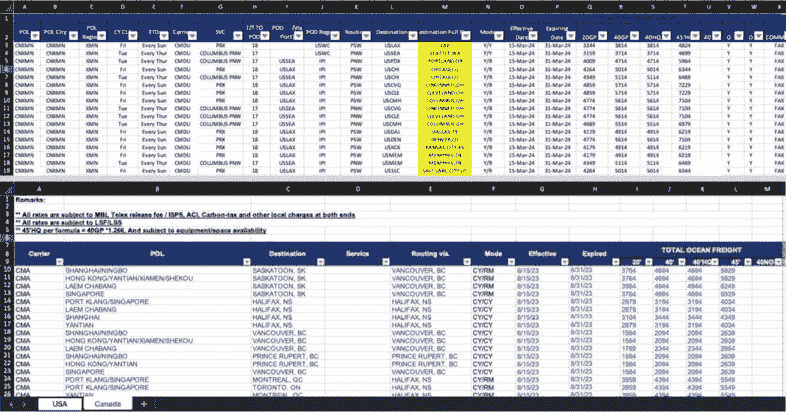

# 收集数据 – 内容为王

本书有一个假设：几乎在所有情况下都需要企业ChatGPT解决方案，因为公司有独特的东西可以提供给客户，并且它对其产品、服务和内容的理解非常出色。这些内容是私有的或独特的，因此不属于从网络抓取构建的**大型语言模型**（**LLMs**）。模型是在爬取超过20亿页的网页内容的基础上构建的，以教授模型。第三方，Commoncrawl.org，通常被引用为该材料的主要来源，用于主要模型（GPT-3、Llama）。这些模型是大量文本的集合，学习单词和概念之间的统计关系，可以用来预测和回答问题。创建一个模型可能需要数月时间；大多数模型都有数十亿个连接和单词。当客户来到企业寻求答案时，模型必须包括不属于这次爬取的企业内容，以使其独特、安全且更准确。这是基于预期解决方案将是最新的、优化以具有成本效益，并且不太可能产生幻觉或谎言，正如一些人所说的那样。

本章讨论了为LLM收集数据以及如何使用称为**检索增强生成**（**RAG**）的方法将企业数据源包含在LLM解决方案中。我们将讨论以下主题：

+   ChatGPT基础模型中包含什么

+   使用RAG整合企业数据

+   RAG资源

本章以及接下来的几章将更偏向技术性，对于那些已经达到这个水平并且专注于以用户为中心的设计概念的人来说。本章涵盖了所有这些想法，并提供了访问额外视频和在线资源的途径。本书不需要大多数这些外部资源；它们旨在提供更多细节。

# ChatGPT基础模型中包含什么

当构建LLM时，它是在互联网数据源上训练的。它了解关于公司和产品的公开信息。如果被问及典型的企业类问题，它可以给出稳健的答案——有时甚至比某些供应商网站上的信息更好。例如：

```py
What are the advantages of Hana for a database?
What is a good value for SGA for an Oracle 12.2 transactional database?
Can you easily replace the battery in an iPhone?
How do I return a product to Costco?
```

尝试这些问题并注意趋势。每个答案都比上一个答案稍微通用一些，而这种通用性正是问题的一部分。

以下适用于大多数基础模型，如ChatGPT 3.5或4o、Anthropic的Claude、Meta的Llama或Mistral7B：

+   不理解特定的业务或使用背景或复杂产品

+   没有客户历史或背景信息可供考虑

+   无法访问专有知识源

+   没有在服务请求或其他服务数据上训练，也不会知道正确的假设与错误的假设和不准确解决方案之间的区别

+   无法与数据库或API集成以进行检索和任务执行

+   无法进行扩展或调整以支持多租户

现在想象一下，如果这些问题是在丰富的商业知识背景下提出的：

```py
What are the advantages of Hana for a database connecting to my service application running ServiceNow on the Washington DC release?
What is a good value for SGA for an Oracle 12.2 transactional database when connecting to EBS 13.2 with 1200 concurrent users?
How do I replace the battery in the iPhone 15 Pro?
How do I return a product from my last order to Costco that was oversized and delivered?
```

将数据源与ChatGPT集成，以将解决方案与业务情境化，可以解决这些更丰富的问题。无论使用哪种设计模式，如聊天UI、混合体验或独立推荐器，企业数据都将使解决方案变得强大。基础模型通过检索增强生成或**RAG**获得访问知识。

# 使用RAG整合企业数据

还有其他方法可以将数据纳入LLM。可以构建一个基础模型，但如前所述，训练时间和努力是极端的。即使有RAG，也有不同的方法。一些技术资源是共享的，但本章将重点介绍RAG的理解，以及产品人员如何参与开发过程。首先，一个RAG的解释。

## 理解RAG

RAG通过企业数据补充LLM。RAG是一种从知识库等信息源检索信息的技术，并且可以从权威知识集合中生成连贯且上下文准确的答案。

这种方法使我们能够克服一些通用的模型问题：

+   材料总是最新的，因为它在需要时才会被评估。

+   工具可以引用文档源，因此更加可信。

+   基础模型已经训练好了，所以与从头开始构建模型相比，补充它是相对便宜的。

+   它允许一组强大的资源（API、SQL数据库以及各种文档和演示文件格式）继续独立管理（并且仍然可供其他解决方案使用）。

+   它将*不会*用于将*所有*数据投入LLM。将使用一种机制，在处理时及时将相关文档发送到LLM。

+   它允许为多个客户提供独特、安全的答案。

需要进行技术工作来创建一个RAG管道。即使这本书不是关于创建RAG管道的开发工作，但仍有理由认为，需要有一个基本理解，即数据如何成为ChatGPT解决方案有价值的部分。首先，考虑一下，如果所有企业数据都投入LLM会发生什么。它看起来可能像*图6.1*。


图6.1 – 我们直接将所有知识添加到LLM中的模型

*图6.1*中的模型假设它可以处理所有公司知识并将其包含在一个OpenAI模型中，从而形成一个定制的公司模型。这听起来很合理，但创建它的成本和*月数*非常高。需要有一种方法让LLM能够访问所有我们的资源，而无需承担成本和复杂性。让我们回顾一些限制，以找到解决这个问题的方法。

## ChatGPT和RAG的限制

为了明确起见，有两个值得讨论的限制类型。第一个是使用OpenAI模型或任何模型进行知识检索的限制。相比之下，第二个是RAG的限制，即使整合第三方解决方案构建企业RAG解决方案也是如此。

大多数企业解决方案都会发现 OpenAI 中的数据集成需求有限，并会寻找其他地方以实现可扩展性、成本和性能。使用 OpenAI 文件搜索，这是他们增强 LLM 知识的方式，存在一些技术限制：

+   最大文件大小为 512 MB

+   5M 个标记的限制（从 2024 年春季的 2M 个标记增加）

+   ChatGPT 企业版支持 128K 的上下文长度（从免费版本和第一个企业版中的 32K 增加）

+   对文件格式（**.pdf**、**.md**、**.docx**）的一些限制——完整列表在此：

    +   文档：[支持的文件格式](https://platform.openai.com/docs/assistants/tools/file-search/supported-files) ([https://platform.openai.com/docs/assistants/tools/file-search/supported-files](https://platform.openai.com/docs/assistants/tools/file-search/supported-files))

+   存储费用为每位助手每天 $0.20/GB。

这些限制（截至 2024 年 9 月）会频繁变化。这些限制意味着需要第三方解决方案。

还有一些质量限制：

+   模型数据对所有有权访问模型的人开放。安全屏障或限制不是隐含的。

+   它不会区分一般知识和内部知识。存在权重和优先级和强调材料的能力，但它仍然可以没有理由地产生幻觉。

+   当知识发生变化时，需要重新训练，这很昂贵。由于结果需要准确和及时，这成为了一个障碍。

+   OpenAI 的知识检索文件搜索处理了流程的一部分，并且没有 RAG 在可扩展性和数据输入类型方面的附加价值。

+   一次可以与 LLM 分享的内容有限。这被称为上下文窗口，本章将介绍如何分块信息以适应该上下文窗口。上下文窗口越大，一次可以与 LLM 分享的知识和企业管理数据就越多，以便制定答案。随着窗口变大，预取材料所需的 RAG 就越少。RAG 是一种更可扩展且成本效益更高的方法。

第三方解决方案有助于避免这些限制。为了演示和理解本书的空间，OpenAI 内置工具将适用于小型演示。然而，企业解决方案将与第三方应用程序一起用于生产实例。这些章节中获得的知识对任何 LLM 都相关。

使用游乐场以 OpenAI 内置功能开始是好的，这样就不需要编码。现在不需要查看文档，但仍然包含在内。这种方法使我们能够尝试自定义模型，而无需完整企业解决方案所需的额外开销。

文章：[OpenAI 文件搜索文档](https://platform.openai.com/docs/assistants/tools/file-search/quickstart) ([https://platform.openai.com/docs/assistants/tools/file-search/quickstart](https://platform.openai.com/docs/assistants/tools/file-search/quickstart))

从数据（本章）到[*第7章*](B21964_07.xhtml#_idTextAnchor150)，*提示工程*，再到[*第8章*](B21964_08.xhtml#_idTextAnchor172)，*微调*的下一步，需要做大量的工作，以便能够用[*第9章*](B21964_09_split_000.xhtml#_idTextAnchor190)，*指南和启发式方法*来审查解决方案，并在[*第10章*](B21964_10_split_000.xhtml#_idTextAnchor216)，*监控和评估*中进行分析，以确定成功。更多资源，请访问OpenAI食谱。它包含大量涵盖整个LLM生命周期的文章，提供了许多好的解释和定义，并概述了整个过程。这里有一篇很好的文章。

文章：[关于使用Qdrant进行RAG微调的OpenAI食谱文章](https://cookbook.openai.com/examples/fine-tuned_qa/ft_retrieval_augmented_generation_qdrant) ([https://cookbook.openai.com/examples/fine-tuned_qa/ft_retrieval_augmented_generation_qdrant](https://cookbook.openai.com/examples/fine-tuned_qa/ft_retrieval_augmented_generation_qdrant))

文章是技术性的，但概念强化了本书的学习内容。需要有一种方法向模型提供材料，而无需重新训练，并且能够处理企业问题的规模。这是通过实现一种基于知识索引的RAG形式来完成的，根据需要只向LLM提供相关材料。**索引**是一种组织信息以便快速检索和比较的方法。做这件事的方法不止一种，但我们将探讨基本方法，以形成对RAG的理解。其中一些步骤超出了本书的范围。阅读本书的人不太可能从头开始构建一个LLM。产品人员，尤其是那些负责知识库或数据库资源的人员，可以通过改进进入解决方案的数据来提高索引和LLM返回高质量结果的最佳机会。因此，引入了技术来处理所需的规模、性能和质量。参见*图6**.2*。这要求我们专注于将数据整理成适合索引的形式。在这种方法中，只有相关信息与LLM共享，以开发答案。


图6.2 – 介绍RAG解决方案以协助问答过程

这是对过程的一个极大的简化。显示的索引图标是一系列过程，这些过程会产生一个*有限*数量的文档，这些文档将与LLM一起作为问题的上下文（这个上下文在提示中共享——这个提示是与LLM共享的指令）。摄入过程包括清理数据、将其转换为文本以及创建向量表示，以便将问题的向量表示与索引资源进行匹配。这个索引过程将数据组织得像似。**向量化**是将文本转换为数字向量的过程。**嵌入**是基于向量的相似性确定相似性和语义关系的过程。所有的处理和匹配都是基于匹配这些向量。

为了简化概念，可以将向量视为具有方向的数字，例如向西走5英里与向北走12英里。在这个例子中，方向和大小是两个用于匹配结果的维度。然而，在LLMs的情况下，有数千个维度。嵌入过程会看到相似的向量代表具有相似意义和用法的单词，它们位于同一区域。然后，最佳匹配（西北方向4英里大致相当于向西走5英里）将被传递给LLM进行处理，与问题一起。这意味着*LLM被赋予了有限的信息来生成其答案*。这也意味着确保知识和资源为这一过程做好准备，并使用工具返回与所提出问题相关的知识是有价值的。这不需要数月时间来训练模型。所有这些工作都为我们完成了。然而，基础模型可以通过提示工程和微调来增强。**提示工程**是向模型提供指令以告诉它要做什么的过程，而**微调**则用于提供对生成输出期望的示例。这两者都在接下来的两个章节中进行了介绍。

产品负责人、设计师、作家以及那些关心内容质量的人可以为输入和输出增加价值。本章是关于输入，从数据源中获取高质量的内容。接下来的章节将专注于*输出*，以确保在回答问题时准确性。

进一步阅读RAG

有许多很好的资源可以更详细地解释RAG。以下是一些深入探讨该主题的资料。让我从亚马逊对RAG的介绍开始。

文章：[亚马逊的RAG解释](https://aws.amazon.com/what-is/retrieval-augmented-generation/) ([https://aws.amazon.com/what-is/retrieval-augmented-generation/](https://aws.amazon.com/what-is/retrieval-augmented-generation/))

这一章节更深入地探讨了完整解决方案的问题和技术细节。

文章: [在你的领域特定知识库中利用LLM](https://www.ml6.eu/blogpost/leveraging-llms-on-your-domain-specific-knowledge-base) ([https://www.ml6.eu/blogpost/leveraging-llms-on-your-domain-specific-knowledge-base](https://www.ml6.eu/blogpost/leveraging-llms-on-your-domain-specific-knowledge-base))

Databricks举办了一场精彩的一小时视频会议。它涵盖了提示工程和RAG。

视频: [加速你的生成式AI之旅](https://vimeo.com/891439013) ([https://vimeo.com/891439013](https://vimeo.com/891439013))

最后，为了更深入地了解，请回顾这份关于RAG技术和方法的出色调查，以了解更多关于如何实现RAG的信息。这是我解释不同方法的 favorite 参考，作者计划更新这篇文章，所以它应该是最新的。

文章: [LLM的RAG调查](https://arxiv.org/pdf/2312.10997.pdf) ([https://arxiv.org/pdf/2312.10997.pdf](https://arxiv.org/pdf/2312.10997.pdf))

通过排除法，只有少数地方可以让产品人员介入以帮助这个过程。很少有人能够从头开始构建一个LLM，基础模型中使用的训练数据来自数十亿互联网记录。在指导客户提出什么问题方面能力有限（良好的设计可能会鼓励良好的行为，而无需强迫用户本身进行适应）。同时，在推荐UI中，没有交互式UI。

因此，我们努力的最佳价值是针对合适的使用场景，创建高质量的知识，并支持对企业数据库和资源的稳健访问，这将允许一个大型语言模型（LLM）生成结果以实现客户目标。让我们构建一个简单的演示，其中包含数据源，以帮助理解在私有数据支持下LLM的限制和功能。

## 基于企业数据构建演示

这是一个简单的例子，旨在说明问题。我们将从一个几乎适用于所有网站和企业的常见问题解答（FAQs）集合开始。任何金融网站（如银行或经纪公司）上可能找到的数百个FAQ构成了演示的基础。我们称这家金融公司为Alligiance（All-i…不是一个e，以免与名为Allegiance的实际公司发生冲突）。助手可以称为“Alli”（发音为Ally）。让我们从一个包含原始HTML片段的文件开始，在表格中逐行回答每个问题。该文件位于GitHub上，所以请亲自尝试一下。

GitHub: [测试用的FAQ集合](https://github.com/PacktPublishing/UX-for-Enterprise-ChatGPT-Solutions/blob/main/Chapter6-Example_FAQs_for_Demo.docx) ([https://github.com/PacktPublishing/UX-for-Enterprise-ChatGPT-Solutions/blob/main/Chapter6-Example_FAQs_for_Demo.docx](https://github.com/PacktPublishing/UX-for-Enterprise-ChatGPT-Solutions/blob/main/Chapter6-Example_FAQs_for_Demo.docx))

要访问OpenAI的Playground，请遵循[*第1章*](B21964_01.xhtml#_idTextAnchor016)中关于**在ChatGPT中认识设计力量**的说明。

演示：[OpenAI Playground](https://platform.openai.com/playground) ([https://platform.openai.com/playground](https://platform.openai.com/playground))

演示从询问一个简单、具体的问题关于浏览器支持开始，这个问题可能对私人网站应用来说是常见的。基础模型不会期望它知道答案，因为这些常见问题解答可能只为认证客户提供。然后我们上传了如图*图6.3*所示的文件，并再次提问。你会一起玩吗？

小贴士

尝试并排比较：打开两个浏览器，分别运行带有和不带有上下文文档的LLM。在Playground中也有一个比较按钮。我们稍后会演示这个比较按钮。


图6.3 – OpenAI Playground展示了添加演示文件前后的答案

```py
was uploaded. It reworked the content into a presentable format. The output text is bolded for easier scanning (some irrelevant text is truncated):
```

```py
<a href="http://www.mozilla.com/en-us/firefox/ie.html" id="Link_1422297415937" name="Link_1422297415937" onclick="advancedlink('http://www.mozilla.com/en-us/firefox/ie.html','{truncated}','', 'Link_1422297415937')" target="_blank">Mozilla® Firefox</a></li><li><a href="http://www.apple.com/safari/download/" id="Link_1421770836208" name="Link_1421770836208" onclick="advancedlink('http://www.apple.com/safari/download/','{truncated}','', 'Link_1421770836208')" target="_blank">Apple® Safari®</a> (Mac operating systems only)</li></ul><p><strong> Note:</strong> Our latest site features will not work with older, unsupported browser versions, specifically Internet Explorer 8, Safari 4 and 5, and Netscape. Internet Explorer 9 and 10 may provide a less than optimal experience. The use of unsupported browsers may also lead to vulnerability because of viruses, spyware, malware, and other security issues.</p><p>
```

*表6.1* 比较了HTML源代码与提供的答案。

| **源答案（HTML** **格式化版本）** | **ChatGPT** **3.5答案** |
| --- | --- |

| **Alligiance的网站最好使用，并且最安全，请使用以下浏览器的最新版本。在此处获取免费** **升级**：|

+   **Microsoft® Internet Explorer（仅限Windows 7 & 8操作系统）**

+   **Google® Chrome**

+   **Mozilla® Firefox**

+   **Apple® Safari®（仅限Mac操作系统）**

**注意：** 我们最新的网站功能不支持较旧的浏览器版本，特别是Internet Explorer 8、Safari 4和5、以及Netscape。Internet Explorer 9和10可能提供低于最佳体验。使用不受支持的浏览器也可能因病毒、间谍软件、恶意软件和其他**安全问题**而导致漏洞。Safari不再支持Windows操作系统的升级。如果您正在使用Windows操作系统，请使用上述受支持的浏览器之一，而不是Apple® Safari，以获得**最佳体验**。如何升级Apple® Safari**如果您在Mac上使用较旧的Safari版本，您首先需要检查您的Apple**操作系统**：从Apple菜单中选择“关于**此Mac**”。这会继续到多页，请参阅GitHub上的**完整文本**。 | Alligiance.com最好使用以下浏览器的最新版本查看，并且最安全：

+   Microsoft® Internet Explorer（仅限Windows 7 & 8操作系统）

+   Google® Chrome

+   Mozilla® Firefox

+   Apple® Safari®（仅限Mac操作系统）

重要的是要注意，最新的网站功能不会与较旧的不再受支持的浏览器版本兼容，特别是Internet Explorer 8、Safari 4和5以及Netscape。Internet Explorer 9和10可能提供低于最佳体验，使用不受支持的浏览器可能导致由于病毒、间谍软件、恶意软件和其他安全问题而导致的漏洞[1]。此外，对于故障排除，如果页面上的图片不显示，用户可以尝试点击浏览器顶部的重新加载/刷新按钮或清除浏览器的缓存。还应注意，如果图片的链接不再活跃，它们将无法下载[2]。[1][2] |

表6.1 – 源文档文本与ChatGPT答案的比较

此示例使用gpt-3.5-turbo-1106运行。看起来相当不错。注意，它并不是源材料的直接引用。以下是一些可用性考虑因素：

+   以“此外，对于故障排除...”开头的段落来自不同的常见问题解答，对于这个答案是不必要的。对相同问题的后续运行没有包含这种虚假内容。

+   对于聊天来说，源答案应该更短，这在文档中很常见。[*第7章*](B21964_07.xhtml#_idTextAnchor150)“提示工程”，解释了如何控制这一点。

+   风格和语气很好。它们与商业语气保持一致。尽管内容是商业语气，但风格和语气可以通过提示工程和微调进行调整。[*第8章*](B21964_08.xhtml#_idTextAnchor172)“微调”，探讨了使用示例来训练模型。

+   浏览器列表以项目符号形式返回。对相同问题的后续运行有时只以项目符号列表返回。提示工程还可以帮助更一致地返回如项目符号列表这样的项目。

+   准确性在支持应用中至关重要。这个答案是事实正确的，但可能会发生错误。接下来的几章将讨论获取准确答案的技术。

希望这次分析有所帮助。可能还有其他你可以看到的项目。必须能够评估响应质量，以便关心并培养LLM。这是我们使命的核心。

### 质量问题

以下提示是与附加的常见问题解答文件一起提供给OpenAI模型的。这些说明为任何用户交互设定了场景。

```py
You are a helpful assistant named Alli, short for the name of our bank. Be courteous and professional. Prioritize information in any files first. Format output using lists when appropriate.
```

几个安全问题周围的结果很有趣。我们将展示一些对话。惯例是显示用户消息在右侧，模型的响应在左侧，类似于手机上消息的格式。提醒一下，对话永远不会因为错别字或错误而编辑。

```py
Is it safe to do all this via the web?
Yes, our conversation and any information you share are handled with the utmost care for privacy and security. The platform we are using employs robust security measures to ensure the safety of our communication and any data exchanged. If you have any specific concerns or requirements regarding security measures, please feel free to let me know, and I will do my best to address them.What security measures?
The platform we are using implements various security measures to safeguard our communication and any data involved. These measures typically include encryption of data transmission, secure data storage protocols, access controls, and regular security audits to ensure compliance with industry standards and best practices. Additionally, the platform is designed to comply with data protection and privacy regulations to further enhance security and confidentiality. If you have specific security concerns or would like more detailed information about the security measures in place, please let me know, and I can provide more details.
```

答案是完美合理的，甚至是有逻辑的。但是，**没有任何**这些内容来自上传的常见问题解答语料库。这是一个听起来很好的通用答案。这个答案不是我们从知识中训练出来的。这被归类为**幻觉**。幻觉是模型生成的文本，它是不正确的、不合逻辑的，或者在这种情况下，不是真实的。向客户撒谎可能会造成实际伤害，而不仅仅是明显的失败。鉴于人们的诉讼性质，避免因向客户撒谎而被起诉。美国的法院可以持有助手作为公司代表的责任。

由于文件中的数据没有表明Alligiance公司定期进行安全审计，因此响应没有提供更多细节，因为它只提到了“典型”措施，而不是具体细节。如果提示被调整为“只提供附件文档中的答案”，那么LLM的回答将与浏览器回答相似，因为它讨论了不受支持的浏览器可能存在的安全问题。在企业解决方案中，通常只限制知识在公司提供的企业知识范围内。这可以减少幻觉。提供了HTML文件，但它返回了干净、格式化的文本。并非每个系统和流程都会如此幸运。在扩展规模时，考虑企业数据清洗的含义。最终，所有这些系统都期望以文本作为输入。所以，某个地方，某个工具将进行这种转换。现在是时候围绕数据清洗提供一些背景信息了。

## 数据清洗

清洗数据很棘手，在企业规模上手动编辑文件是不合理的。首先，了解问题，要么与提供支持创建清洗管道工具的供应商合作，要么从小处着手，学习如何逐步编写工具。审查清洗数据所需的内容，并决定在哪里投资团队有限的资源。无论如何，大部分工作都需要自动化。现实是，有些工作需要手动完成，尤其是在流程的早期。

数据清洗也取决于资源的类型以及它们将如何被使用。处理大量常见问题解答、知识文章和营销材料所需的工具与处理数据库查询所需的工具不同。以下是需要注意的一些一般性问题。让我们从如何处理文档开始。

小贴士

寻找或构建工具以帮助自动化此过程，但对于许多用例来说，这是一项实际的工作。接下来的几节将提供详细信息，以帮助理解流程，以防企业数据出现问题时。某些数据类型可能需要更多努力。

### 数据增强

数据增强旨在解决数据是否充足的问题。是否对产品问题有足够的知识？是否有足够的数据资源和历史数据来形成推荐？是否有特定语言的示例（提示：翻译后再翻译回来）？或者是否需要各种形式的训练材料来理解更多样化的格式？**增强**通过人工生成这些数据来帮助使解决方案更加稳健。

并非所有数据都可以轻松增强。一个大型语言模型（LLM）无法生成解释它一无所知的过程的新颖知识文章。但是，假设你正在训练一个模型，用于处理特定信息，例如理解医疗诊断和治疗、实时数据（如天气）或可能需要比模型提供更近期的任何数据。在这种情况下，增强过程可以提供精确、最新和上下文相关的解释。

有一些技巧。例如，当使用LLM将材料翻译成另一种语言，在有限的语言数据下，然后再翻译回来时，可以帮助改进检索步骤。或者，在文本中包含产品名称的同义词以创建用于训练的变体。大部分情况下，要意识到这一点，并考虑是否有可用于训练或测试模型的数据。一旦了解了企业数据的状态，这可以成为一种资源。

使用LLM本身生成训练数据是一个选项。将其作为资源使用，然后运用常识来决定向模型提供哪些数据以用高质量数据增强基线数据。OpenAI建议，通过在增强数据上训练，模型可以处理多样性并学会在处理新数据时更好地处理系统中的噪声。需要进行实验和迭代以查看什么最能改善结果。

在ChatGPT中尝试这个提示以了解更多关于数据增强的信息。

```py
How can I do data augmentation using LLMs to generate training data based on a baseline?
What data augmentation should I use to train my LLM on the complexities of (insert enterprise details)?
```

### 数据标注

注释是一项工作。它可能很单调。**注释**是指用笔记标记内容以解释其过程。标签或标记的概念本质上是一样的。笔记或细节与内容相关联。这样做是为了帮助理解和标记段落、内容、表格或任何需要分类的东西。要注释的数据将取决于数据和结构。例如，在长段落中，可以针对相关性进行注释。对于表格，可以更好地标记标题，这对人类来说是显而易见的，但对计算机来说则不然。产品项目可以标记，这样模型就可以学习尺寸（S、M、L、XL）、类别（头等舱、商务舱、经济舱）、相关产品或其他有助于为材料提供背景的必要属性。对于大型文档，为数据块提供背景。例如，如果表格很长，标题会在每一页都重新出现吗？如果文档被分成更小的可管理部分，人类能否理解标题？这就是需要注释的一个例子。假设标题讨论了产品和产品版本，而这个标题在多页之前就已经出现。在这种情况下，如果某个数据块长度为单页，那么这个产品标题信息需要级联到每个正确的页面和数据块中。

注释过程需要高质量。产品专家是验证标签或注释是否与企业数据内容匹配的主要候选人。因此，设计师、作家和项目经理可以参与其中，利用他们的产品专业知识来创建有效的注释流程。这确保了采取步骤来质量检查工作（因为工作可能外包或众包）。创建指标来定义质量标准，并对其进行测试（抽查或全部检查）。我编写了一个指标来考虑我们输入可以容忍的错误类型和错误频率。该指标将众包材料的质量与专家的期望进行了比较。结果被分析以确定人群中特定的人类工作者是否显著优于、劣于或与平均水平相同。因此，考虑来源，并且*始终测试和验证*以验证你的质量假设。向ChatGPT询问在注释数据时可能发生的所有错误。

```py
What kinds of errors occur when annotating data for LLMs? Provide an example of each and explain the likelihood of the types of errors. This is important to my job.
```

使数据对LLM可用的另一部分是将它分割成块，以便在上下文窗口中共享最有价值和最优化细节。这被称为分块。

### 分块

如前所述，不仅大型文档需要标记，而且它们可能太大，不适合RAG过程。这导致了对**分块**的讨论。分块是指将大文本或数据集分成更小、更易于管理的块（块），这些块适合LLM的上下文窗口，从而使模型能够更有效地处理和理解信息。这并不是要成为分块专家；这只是为了能够识别不良分块的结果并帮助解决问题。

假设客户想要了解手机电池寿命的问题。手机公司在过去几年中发布了数百款手机型号，所有这些型号都有不同的规格。这些知识文章和细节必须被分解成可管理的、上下文相关的部分，以确保RAG可以准确处理和检索它们。这样，信息量对系统来说是可管理的，并会产生高质量的答案。将文本分割成逻辑部分——章节、段落，甚至句子——确保块具有连贯的意义单元。这样，RAG可以理解和检索最相关的信息。我们不希望有关Android手机内存卡的信息与没有卡槽的iPhone的信息混淆，因为这是一般关于内存卡的陈述。

存在着不同的分块策略。我们将介绍一些基础知识，其中语义分块是我们在本章后面案例研究中感兴趣的一个。请回到这些参考资料以进行更多探索。

文章：[RAG的语义分块](https://medium.com/the-ai-forum/semantic-chunking-for-rag-f4733025d5f5) ([https://medium.com/the-ai-forum/semantic-chunking-for-rag-f4733025d5f5](https://medium.com/the-ai-forum/semantic-chunking-for-rag-f4733025d5f5))

第二个学习机会是KDB.AI最佳实践视频。使用RAG时，需要一个向量数据库供应商。幸运的是，我们的经验主要是平台无关的。以下是视频中的几个要点，以提供对分块的一些见解：

+   块大小取决于所使用的模型。更改模型可能需要更改块大小。这也表明，分块应该在一个自动化过程中完成，以便快速适应。

+   对于少量内容，小块大小的内容将更准确，但不会包含很多上下文。大块，通常来自完整文档，粒度更少，但可能会影响性能。

+   提示、聊天历史和其他资源也可能包含在上下文窗口中，因此在决定可以分配给上下文窗口的块数量时，请考虑这种容量。

+   由于上下文窗口正在增长（截至2024年秋季，ChatGPT-4的窗口为128K个标记），这并不意味着它应该被填满。性能、成本和质量都是相关的。为了说明这一点，之前分享的FAQ文档有465K个字符和110K个标记。仅此文档就几乎与ChatGPT可以分享的内容一样多。与企业级所需的数据量相比，这是一个微不足道的数量。

+   在进行基于代码的块划分时，可以调整块重叠。这是从先前或未来的块中包含的块的数量，以便有上下文。然而，NLP块划分解决方案在将内容划分为更合理的断点（在句子中）方面将更加优雅。例如，**自然语言工具包**（**NLTK**）和spaCy，这是一个开源库。

+   块分割器每个月都在变得更智能。LangChain理解文档的结构，并在理解句子和段落方面做得非常出色。它试图根据文档结构来优化大小。

+   结构化块分割器理解标题和部分。它们可以用元数据标记块，以保持上下文。

+   可以使用不同的检索器来处理不同的数据库。例如，一个可以用于处理高级问题，另一个可以用于处理源块以处理具体详细的问题。

+   讨论的要点几乎在10分钟后开始。当Ryan Siegler开始讲话时开始观看。视频：[RAG应用的最佳块划分实践](https://www.youtube.com/watch?v=uhVMFZjUOJI) ([https://www.youtube.com/watch?v=uhVMFZjUOJI](https://www.youtube.com/watch?v=uhVMFZjUOJI))（KDB.AI）

我们为什么应该关心块的大小？块的大小会影响LLM解决方案的准确性、上下文和性能，这些是产品领导者希望监控和改进的基本因素。

注意

你可能不会是设置这些块的人，但你将参与监控性能和质量，以便向数据团队提供反馈。理解内容的小组成员可以帮助创建和管理测试用例，以探索例外情况并验证解决方案。

例如，模型是否理解在讨论到很久以后才引用的内容时，在文档开头解释的例外情况？例如，在Wove案例研究中，在章节的后面，他们想要摄取的电子表格的开始处出现了明确定义的注释，但这些信息适用于文档中更后面的材料；因此，这是与那个后期块相关的信息。

文档还可以包含图像、图表和表格。因此，需要使用额外的工具来总结并从这些图形中获取上下文。LayoutPDFReader和Unstructured等工具是两个可以帮助的例子。这个过程需要独立于文本提取所有这些内容，以便可以将块和总结应用于从图形中提取的信息。根据工具的不同，有时嵌入步骤可以直接处理图像。几乎所有文档中的图片和图形都不仅仅是装饰性的，因此将这些图像转换为有意义的、可搜索的内容是至关重要的。使用LLM从图片中提取上下文，然后使用这些知识来索引和搜索图像。例如，一个零售商在建立营销活动时可能需要一个图片，并询问：“给我展示穿着牛仔裤在海滩上玩耍的青少年。”这可以通过手动用这些关键词标注图像来找到。即使是我的iPhone（没有LLM）也允许我搜索“汽车”、“食物”、“飞机”、“人”或“伯灵厄姆”等地点的图片。随着LLM的加入，这个空间正在进入更多的智能和力量。在数据标注上进行迭代工作，以使内容处于良好状态。自从讨论了Wove对电子表格的使用以来，这个数据源值得提及。

### 电子表格清理（Excel, Google Sheets）

电子表格和数据库存在一些共同问题。数据有时需要转换成不同的格式，以便在不同的服务中保持一致的理解。有一些工具可以完成这些转换。注意这些问题，然后可以应用当天的工具来解决这些问题。在后台集成中，电子表格清理非常有意义。电子表格和表格可以出现在许多形式的文档中，如果需要由LLM理解，它们可能需要进行清理。我们的第二个案例研究广泛使用了电子表格，我们将探讨Wove为清理过程所做的努力。提示：这涉及到大量的手动工作和评估。首先，让我们定义现实，或者人们所说的“事实”。

### 源文件中的文档和事实

**事实真相**是企业解决方案所需的基础事实。如果文档包含相互矛盾或误导性信息，LLM（类似于试图阅读文档的客户）将会犯错误。这是常见问题解答、技术文章和营销沟通的基本问题。上下文必须精确，以阐明与哪些产品相关的信息。标签和注释可以帮助设定这个上下文。例如，如果说明是按住电源按钮3秒钟以重置设备，但旧型号需要不同的答案，那么这个上下文必须明确设定。有时，文章会指出受影响的文档中的产品或发布版本，但随后又给出排除或使用突出显示来给出例外。这些排除需要明确界定其搜索范围。这些例外是否适用于接下来的几段，还是仅限于首次引入的那段？编辑、标签和测试的迭代将解决这个问题。一些标签可能是高级别的，例如与金融或医疗保健相关的文章，而我上面的例子是针对产品发布或版本的。让我们从编写一个简单的文本常见问题解答案例研究开始。

### 常见问题解答案例研究

Alli案例研究使用了OpenAI的文件搜索功能，但使用相同数据在竞争性的LLM和RAG解决方案中会怎样呢？Cohere是一家提供企业级LLM解决方案的AI公司。为什么在关于ChatGPT的书里还要考虑另一个产品呢？随着模型的发展，专业化程度越来越高。企业级解决方案可能会使用一个模型来完成特定任务，而使用不同的模型来完成一般任务（就像我们在案例研究中做的Wove那样）。性能、成本和上下文大小也会发挥作用。专注于用例，不同的模型可能提供价值是合理的。Cohere还提供了一个上传文档并测试模型的游乐场功能。它还暴露了聊天UI中的一些设计元素，这些元素提供了值得分享的引人注目的UI元素。在这个例子中，上传的常见问题解答没有HTML，只是基本的清洁文本。

```py
Can I add files to Cohere to help answer FAQs?
```

1.  访问Coral网页([https://coral.cohere.com/](https://coral.cohere.com/))并选择**带有文档的Coral**选项（见*图6**.4*）。

注意：

当前cohere演示在处理文档方面采用了非常不同的设计，因此这些说明将不起作用。最新版本允许您复制粘贴信息以提供上下文，或者必须使用数据集工具上传文件。我们不要求读者这样做。我们将继续使用这个例子，因为结果中有些出色的功能，但你可以通过打开常见问题解答并复制粘贴来跟随。

Cohere的游乐场最新版本比OpenAI的更复杂、技术性更强、更杂乱。在创建解决方案时，请考虑UI元素对功能能力和可用性的影响。


图6.4 – 设置Cohere的Coral与文档

1.  使用 **文件** 功能上传 GitHub 上共享的 FAQ 文件。

    GitHub: [FAQ 示例文档](https://github.com/PacktPublishing/UX-for-Enterprise-ChatGPT-Solutions/blob/main/Chapter6-Example_FAQs_NoHTML_for_Demo.docx) ([https://github.com/PacktPublishing/UX-for-Enterprise-ChatGPT-Solutions/blob/main/Chapter6-Example_FAQs_NoHTML_for_Demo.docx](https://github.com/PacktPublishing/UX-for-Enterprise-ChatGPT-Solutions/blob/main/Chapter6-Example_FAQs_NoHTML_for_Demo.docx))

1.  关闭侧面板，使用消息窗口进行交互（*图 6.5*）。


图 6.5 – 显示引用使用的示例

1.  使用与 FAQ 相关的问题测试模型（*图 6.6*）。


图 6.6 – Cohere 中 FAQ 文档的示例

除了所述的原因外，这个竞争模型还有一些令人兴奋的结果：

+   这本书中的内容可以推广到其他模型。

+   一些 UX 元素，如显示参考面板，可能对用例很有价值。在这个演示中只有一个文档，所以查看一个链接没有帮助，因为它会随着每个匹配重复。链接到参考内容然后滚动并突出显示相关段落，使其易于理解和查看上下文。相关性突出显示的 UX 模式可能会变得流行，甚至成为标准。

+   这是一个并列模式展示补充信息的优秀示例。

+   它让我们对不同模型的质量有了感觉，并允许我们看到 ChatGPT 每个版本之间的差异。

让我们测试我们的 FAQ。使用 Cohere 示例提供一些上下文是有帮助的，这样我们就可以探索在 ChatGPT 中使用 FAQ。让我们看看结果是否符合我们的预期。

GitHub: [FAQS 唯一 PDF 压缩包](https://github.com/PacktPublishing/UX-for-Enterprise-ChatGPT-Solutions/blob/main/Chapter6-FAQ_PDFs.zip) ([https://github.com/PacktPublishing/UX-for-Enterprise-ChatGPT-Solutions/blob/main/Chapter6-FAQ_PDFs.zip](https://github.com/PacktPublishing/UX-for-Enterprise-ChatGPT-Solutions/blob/main/Chapter6-FAQ_PDFs.zip))

在这种情况下，压缩文件包含在单个 PDF 文档中的清洗数据。这使我们能够更好地将源作为参考并与结果相连接。返回到 ChatGPT 游乐场并创建与之前相同的助手，但尝试上传此文件。

然而，请记住，存在局限性；在 ChatGPT 3.5 中上传文件会导致一个神秘的用户错误（意味着上传了太多文件），如 *图 6.7* 所示。


图 6.7 – ChatGPT 有文件限制

这是一个小型数据集，只是还不够小。有一个解决方案允许它在免费游乐场中使用。PDF 被合并成 18 个文件，单个 PDF 可以用于其他测试和实验。

GitHub：[18个FAQ文件的压缩包](https://github.com/PacktPublishing/UX-for-Enterprise-ChatGPT-Solutions/blob/main/Chapter6-FAQS18files.zip) ([https://github.com/PacktPublishing/UX-for-Enterprise-ChatGPT-Solutions/blob/main/Chapter6-FAQS18files.zip](https://github.com/PacktPublishing/UX-for-Enterprise-ChatGPT-Solutions/blob/main/Chapter6-FAQS18files.zip))（每个包含大约25个FAQ）

GitHub：[包含所有441个FAQ的单一PDF](https://github.com/PacktPublishing/UX-for-Enterprise-ChatGPT-Solutions/blob/main/Chapter6-FAQ-ALL.pdf) ([https://github.com/PacktPublishing/UX-for-Enterprise-ChatGPT-Solutions/blob/main/Chapter6-FAQ-ALL.pdf](https://github.com/PacktPublishing/UX-for-Enterprise-ChatGPT-Solutions/blob/main/Chapter6-FAQ-ALL.pdf))

使用这18个文件，上传和扫描它们只需要几秒钟，Playground就会准备好。

一旦上传，尝试一些测试案例，如*表6.2和6.3*。它们是在不知道它们是否有效的情况下编写的（它们没有经过预测试）。在接下来的几章中，我们将更详细地介绍测试案例；让我们保持简单，手动进行测试。测试单个或多个文件对质量的影响，并从结果中学习。

注意

尝试不同的可用模型。不一定要是ChatGPT 3.5；尝试ChatGPT 4o-mini或与其他供应商的LLMs进行比较。

在这两种情况下，使用电子表格中的清洗数据列。测试案例中存在一些拼写错误和连锁问题（需要后续问题的提问）。现在，我们可以一起了解实际结果。


表6.2 – 第1-10题及两次测试结果


表6.3 – 第11-20题及两次测试结果

这里是一些对这些结果的初步分析：

+   拼写错误没有造成问题。

+   提供额外背景信息的后续操作返回了良好的结果。

+   对于一些问题，相同的模型返回了非常不同的结果。

+   像地址这样的具体信息非常具有挑战性。

+   它没有认为那是银行；它指的是“你的金融机构或经纪公司。”提示工程可以解决这个问题。

+   他们都需要帮助以句号结束句子。他们倾向于在句号前加空格，如下所示。

让我们为这两种方法创建一个简单的评分标准。对于出色的正确答案得5分，对于良好的正确答案得4分，对于接近正确答案得3分，如果后续返回的细节应该包含在第一个答案中，则得2分。评分显示，分别使用文件得47分，而使用单个文件模型得74分。认识到这两个起点之间的显著差异不必完美。如果你观看了上一章中的OpenAI视频（这本书我最喜欢的视频参考资料之一），他们有一些相似的经历，从较差的结果开始，通过微调和提示工程，他们改进了结果，如图*6.8*所示。

视频：[最大化LLM性能的技术综述](https://www.youtube.com/watch?v=ahnGLM-RC1Y) ([https://www.youtube.com/watch?v=ahnGLM-RC1Y](https://www.youtube.com/watch?v=ahnGLM-RC1Y))


图6.8 – OpenAI在用例中采用RAG的成功故事

并没有必要详细了解所有这些方法。在本章的结尾部分，有一个专门的部分来讨论其他技术。目前的关键是要展示如何通过持续改进你的生命周期来确定哪些变化能改善体验。即使使用这种基本的评分方法，结果差异也很大。我也对这种显著差异感到惊讶。两个结果的完整记录已经发布。

GitHub: [FAQ测试记录](https://github.com/PacktPublishing/UX-for-Enterprise-ChatGPT-Solutions/blob/main/Chapter6-Transcripts.docx) ([https://github.com/PacktPublishing/UX-for-Enterprise-ChatGPT-Solutions/blob/main/Chapter6-Transcripts.docx](https://github.com/PacktPublishing/UX-for-Enterprise-ChatGPT-Solutions/blob/main/Chapter6-Transcripts.docx))

通过RAG引入的数据需要清理，正如即将到来的Wove案例研究所示。像文件分割这样简单的事情可能会对性能产生深远影响。每一次改进都可能影响下一步。从74分开始继续细化，而不是从47分开始，会更好。找到处理日常工作的工具，以便将精力集中在实际数据和其质量上。在创建数据管道的完整生命周期时，还有其他问题需要考虑。接下来是一个来自一家使用多种模型使其LLM解决方案成功的令人兴奋公司的案例研究。

### 电子表格清理案例研究

这是一个很好的例子，展示了如何使用电子表格在幕后创建LLM的智能并提供来自[Wove.com](https://wove.com) ([https://wove.com](https://wove.com))的建议。Wove通过使用LLM解析和标准化来自费率表、海洋合同和其他电子表格的复杂表格数据，帮助货运代理公司优化费率管理操作。

货运代理作为中介，确保小型托运人可以从一个地点将货物运送到另一个地点——例如，从中国的工厂将10,000个小部件运送到内布拉斯加州的仓库。由于从A点到B点有数百种方式，因此基于供应商、距离、港口、运输类型、时间、货物类型、海关、重量和体积，存在复杂性。这种复杂性隐藏在每个供应商发布的电子表格、PDF和其他数据源中。这种复杂性增加了报价所需的时间，可能导致遗漏合理的费率。通过将这些费率表放入模型中，可以更准确、更高效地生成客户报价。这是一项艰巨的任务。要深入了解费率表用例，请查看在表格中可能会看到的所有标准术语。

文章：[费率表术语和简介](https://www.slideshare.net/logicalmsgh/understanding-the-freight-rate-sheet) ([https://www.slideshare.net/logicalmsgh/understanding-the-freight-rate-sheet](https://www.slideshare.net/logicalmsgh/understanding-the-freight-rate-sheet))

如BAR、BL费、滞期费、DDC、CYRC、滞留费等术语有很多需要消化。这对一个大型语言模型理解复杂的电子表格来说是一个挑战。这是我们从Wove的朋友那里得到的一个很好的例子，他们创建了一个幕后使用ChatGPT和其他模型，如Anthropic的Claude。他们专注于摄取数据以保持数据质量和完整性，并标准化广泛不同的电子表格。确实，在用户界面方面，可以使用这些数据来回答关于找到正确费率的问题。本案例研究将重点关注数据摄取。Wove案例研究将在在提示工程和微调章节中解释更多内容后完成。

这些术语需要理解，并且每个费率表在格式、标签、例外和其他因素上都有所不同。随着时间的推移，费率发生变化，必须理解正确的费率周期。*图6.9* 展示了费率表的一部分，以揭示这种复杂性。



图6.9 – 来自两个不同供应商的费率表样本

一个典型的货运代理可能需要处理数十个不同的费率表，其中一些长达*数百*页，手动规范化所有这些数据需要整个团队的努力。示例显示了数据列的多样性。标签、值、制表符的使用、如何用备注处理例外情况，以及标题都是不同的。然而，自动化或甚至半自动化可以减少这个过程超过90%。虽然应该在过程中测试和验证数据，但在手动生命周期中有许多地方人为错误会导致问题。让我们回顾Wove在摄取这些数据时必须执行的数据清洗步骤。此信息的预期流程如下：

1.  在获取新的费率表之前，他们训练和验证了创建高质量输出所需的各种模型。本案例研究将讨论所使用的不同模型。

1.  通常，他们会通过电子邮件收到一个费率表，并将其文件下载到Wove中。还有一个自动化路径，其中包含一个电子邮件监听器，它会拾取文件，监视新文件，并将其纳入流程。这些文件可能有多个标签和数千行数据，如*图6*所示。9*。一个典型的文件可能是之前处理过的文件的更新。

1.  他们的工具解析XLS文件并识别表格，并解析文档，将它们转换为模型可用的属性格式簇。存在上下文长度限制、检测表格、理解表格以及确定表格之间关系的问题。他们将这称为表格检测。如图所示，开发团队构建了十个模型来理解电子表格。整个专有流程并未公开，但这一点应该能让人了解每个模型的作用以及用于帮助清理和组织过程的软件。尽管这是一个技术过程，但结果却是普通人都能看到的东西。他们可以确定这些结果是否物有所值。这是一个商业决策和用户体验问题。

    +   **文档分段（单镜头GPT 4 Turbo）**：此功能将文档分段为连贯的章节/思想。

    +   **上下文构建器（多镜头克劳德3俳句）**：这是在文档分段之后应用的。它为理解当前文档构建阅读上下文。

    +   **表格检测（GPT 3.5 Turbo，微调）**：此功能检测电子表格、文档或合同中的表格。

    +   **表格标题范围检测（GPT 3.5 Turbo，微调）**：在检测到表格后，确定标题行范围和数据开始的位置。

    +   **表格结束检测（GPT 3.5 Turbo，微调）**：此功能检测表格数据的结束。

    +   **表格理解（GPT 3.5 Turbo，微调）**：此模型理解表格的列和数据，并确定其用途。

    +   **模式映射（GPT 3.5 Turbo，微调）**：在理解表格后应用此模型。它确定表格中的哪些列映射到数据库中的模式字段。

    +   **字段分割器（单镜头克劳德3俳句）**：分割器从组合字段中提取每个字段的详细信息。例如，如果有效日期和到期日期在同一字段中，则可以将它们提取到模式中的**effective_date**和**expiry_date**。

    +   **位置标准化器（多镜头GPT 3.5 Turbo）**：它将非结构化位置信息标准化，将每个检测到的位置转换为UN/LOCODE（如香港的HK这样的标准化国家代码）。

    +   **商品标准化器（GPT 3.5 Turbo + Ada）**：它将非结构化商品信息标准化，以便进行搜索/比较。

    +   这些模型在创建本案例研究的过程中多次更改，并且随着他们目前正在测试GPT 4o-mini的一些用例，它们仍在不断变化。适应和改进，有时还能节省一些费用。

1.  他们识别、标记并训练系统理解表格的位置、数据开始和结束的位置、标题标签等。挑战在于当LLMs主要用于文本时理解表格。电子表格变成了文本。注意，在此过程中使用的某些模型已经进行了微调。这些是需要通过提供定义表格的示例来增加理解和学习的模型。

深入研究表格检测有助于理解数据的分割。在*步骤3*的表格检测之后，他们进行语义块分割以获取正确的内容长度。通常，合适的内容长度可能从500到1000个标记开始。根据模型的不同，如果你想付费，更长的内容长度是可以接受的。Wove提示GPT-4将文件分割成*连贯的片段*。块是至关重要的，因为一次只能处理这么多信息。有效的块分割策略对于获得正确的块上下文是必要的。

他们的提示相当大——长达一页。它告诉ChatGPT 20条不同的规则来解析一个片段。他们的提示从简单开始…“你是文档解析的专家；你会得到一段文本。你的任务是将其分割成连贯的片段。”他们没有大量文本块，因此块大小不受LLMs的限制。每个模型可以有不同的标记限制，以允许提示和输出的尺寸。模型的输入和输出范围从4K到8K个标记。他们在下一步使用了一个更小、更快、更便宜的模型。如果你不确定你模型的限制，就问它。

```py
What makes a good context length when ingesting data into you to help provide context?
```

Wove覆盖了整个生命周期。**功能调用**，访问其他资源（如API）的方法，对于Wove的过程至关重要，对于企业应用也是基础。注意这个功能。记住，任何企业解决方案都将连接到各种资源以丰富LLM。

文档：[ChatGPT函数调用开发者文档](https://platform.openai.com/docs/guides/function-calling) ([https://platform.openai.com/docs/guides/function-calling](https://platform.openai.com/docs/guides/function-calling))

他们使用函数调用将部分生成到结构化的输出中。*图6.10*展示了这个函数的一部分。产品团队需要理解这一点以确保上下文完整。其中一些内容可能适用于任何电子表格，例如起始行、结束行、部分名称、标题和描述，但正确理解这一点是至关重要的。后来，他们检查了表格是否被正确处理，以确认正确的起始行、标题或副标题标签。

```py
"type": "function",
"function": {
    "name": "next_section",
    "description": "extracts the next section of the
    document",
    "parameters": {
        "type": "object",
        "properties": {
            "StartLine": {
                "type": "number",
                "description": "the line number where the
                section header or contents starts at,
                inclusive. This must exist."
            },
            "EndLine": {
                "type": "number",
                "description": "the line number where the
                section content ends at, inclusive. This
                must exist in the input."
            },
            "SectionName": {
                "type": "string",
                "description": "the name of the section,
                either the title/header if available, or a
                description of the column."
            },
            "SectionHeader": {
                "type": "string",
                "description": "the header of the section,
                if available"
            },
            "SectionType": {
                "type": "string",
                "description": "the type of the section"
            },
            "SectionDescription": {
                "type": "string",
                "description": "the description of the
                section – this is required"
            },
        },
        "required": ["StartLine", "EndLine", "SectionName",
        "SectionType", "SectionDescription"]
    }
```

图6.10 – 用于帮助结构化输出的函数调用片段

他们可以使用训练验证分割数据，测试模型对移除的数据，并使用他们在*图6.11*中显示的数据清理技术来定义表格。这种数据标记定义了表格中的“什么是什么”，并且随着时间的推移可以不断改进。脚本有助于从标记源生成新的训练数据。


图6.11 – 来自费率表的侧术语的小表格

看看这个“侧术语”的定义，它用于训练表格检测；它告诉LLM如何理解这些数据。

```py
1  "Side Terms": {
2      "min_row": 3,
3      "max_row": 21,
4      "tables": [
5          TableRangeV2(("B", "G"), 6, (7,20)),
6      ],
```

产品经理、设计师和团队必须监控表格定义以确保高质量。在这个例子中，他们从第3行（第2行）到第21行（第3行）识别了“`Side Terms`”的起始日期。在第5行，他们识别电子表格的列从`B`到`G`（列`A`是空白），然后第6行被定义为标题，并使用`(7,20)`为第7行到第20行定义表格的源数据。然而，在*图6.11*中，注意`备注`列（列`F`）延伸到第21行，因此这个过程涉及人工验证*以捕捉这个错误*并将`(7,20)`更改为`(7,21)`。

多个模型使用这个标记练习。这项工作支持表格端检测、标题和表格理解。

捕捉需要标记的内容至关重要。例如，一些带有星号的笔记显示在表格顶部的*图6.9*中。LLMs擅长理解文本以及从表格检测中提取的这段文本的引用，因此不需要额外的努力来收集这些信息。

数据必须对诸如费率和位置等项目进行归一化。因此，对于香港，港口HKHKG是一致的显示，并且数十个其他值在不同文件中正确映射。

存在一个数据审查流程，Wove有工具来完成这项工作。团队审查了如图6.12所示的数据，这个深入分析显示了香港和亚特兰大之间的费率以及一些进入这些费率的数据。


图6.12 – 现在可以以归一化视图查看数据，以便他们可以查看费率

现在他们已经摄取并归一化了数据，他们可以访问来自许多来源的费率。让我们进一步探讨这个工作流程的一些细节。

这并不是关于单个模型施展魔法；它需要一系列专业模型的集合。他们应用不同的模型来解决各种问题。预计随着时间的推移会进行适应和改变，尤其是对于使用微调的模型。把它看作是一种模块化方法。如果出现了一个新的或成本远低于之前的模型，可以逐个替换以改善拼图的一个部分。如果某个主题周围存在问题，例如数据质量差或缺失，并且模型需要帮助收敛到实际解决方案，那么就关注这个问题。每个部分都可能经历其版本的幻觉。

对于这些电子表格来说，数据清洗具有特定的含义，特别是确保行和异常得到处理。数据块必须正确分割，以便有一个良好的开始和结束，从而保持上下文。这为RAG提供了一个干净的环境，并更准确地检索相关片段。

在他们的清理和摄取过程中，以下是他们解决的前十大问题：

1.  将数据作为文本处理，即使数据来自电子表格。

1.  模型将大型文档分割成多个部分——一些费率表可能长达数百页——并将它们拆分。例如，海洋运输文件比公路卡车运输文件更复杂。

1.  挑战在于将表格作为文本来理解。要很好地理解表格、正确标记、查找错误并找到合适的模型（他们为了保护他们的专业知识而讨论了但没有详细说明）需要相当多的工作。这与直接阅读纯文本不同，但这可能会影响体验，即使团队控制着知识库或数据库。包含表格、图像、流程图和图表的文档都包含可能需要完全用文本表达的信息。

1.  根据Wove建立的提示，模型编写指令以从表格中提取所有数据。这个过程包含多个步骤，在[*第8章*](B21964_08.xhtml#_idTextAnchor172)“微调”中进行了详细探讨。

1.  在*步骤1*中，Wove运行GPT-4 Turbo版本，而在其他步骤中，它运行ChatGPT 3.5和其他模型。按顺序运行任务比一次性运行GPT-4快十倍。他们使用GPT-4 Turbo生成微调数据。通过使用多个模型，他们可以在性能和成本之间取得平衡。

1.  Wove省略了10%到20%的数据来测试模型。这是标准做法。他们从文档中取出不同的数据块来创建一个更广泛且可能更有效的测试集。提示：不要通过总是取每份文档的前20%来对模型产生偏见。他们使用随机种子来选择文档的片段，但每次都从同一文档中保持相同的块；这使他们能够创建一个可重复的集合。因此，他们的验证步骤不会因为测试数据而有所不同。

所有这些艰苦的工作都是为了数据清洗。首要目标是让负责确保数据正确性的相关人员接触到这些数据。正如之前提到的，这将有助于设置后续的对话体验，以帮助找到合适的比率。FAQ和Wove示例应该能提供一些关于数据问题的理解，但还有其他需要考虑的因素。

## 创建高质量数据管道的其他考虑因素

并非所有设计师和产品经理都会参与RAG过程的每个步骤。所有供应商都使用“管道”这个术语来表示从源头到客户的信息流。在模型被纳入管道之前、期间和之后都可能发生问题。请注意以下可能影响客户体验的问题区域。

### 计算资源

RAG有一些实际的工作要做。它必须从大量的文档和资源中创建类似于原始模型生成的向量数据。定期这样做可能会非常耗费计算资源。在扩展时注意任何性能问题。许多第三方解决方案会谈论毫秒级的响应时间。那很好；响应应该感觉自然。在某些情况下，结果可能需要几秒钟，但通常，聊天响应应在200-300毫秒（大约1/4秒）内开始。

同时，当数据发生变化时可能会触发推荐（如果总是重新计算且没有用户需要更新，这可能会变得昂贵）或当页面渲染时计算。即使是一个触发通过电子邮件或消息某人关于推荐的触发器，也需要有当前信息并按计划评估问题。每个事件都会产生成本。考虑如果没有人可以使用它，推荐的成本。

问题：*没有慢速但好的用户体验这回事.* 设计师和项目经理可以在几个地方帮助提高性能。

+   监控和验证解决方案的性能，并决定哪些能满足用户期望。产品负责人应设定性能期望。

+   监控发送给LLM的数据是否过多或过少。所有数据都应为LLM提供价值；如果不是，则删除它。

+   确定提示和上下文大小是否提供了与其大小相应的价值。

+   在LLM中，API请求需要付费，因此当可能时优化或缓存信息。了解客户是否使用推荐或可见的UI。

### 可扩展性

如果系统只处理数百份文档，这可以管理。然而，一些大型企业可能正在查看数百万份文档和庞大的SQL数据库。维护这样的大型语料库，以及改进这些数据库和文档的质量可能是一项重大投资。强调最有帮助和最常访问的材料。利用第三方管道解决方案。

问题：*你不可能同时出现在很多地方.* 可扩展性也适用于你的时间。考虑是否有值得你关注的地方，比如改进管理流程、监控质量、维护文档或改进编辑和更新文档所需的时间和流程。考虑个人版的80/20规则。如果项目C的20%的时间能带来80%的价值，那么就在那里投入资源。更好的是，使用用户需求评分。如果某些东西是所有客户都频繁使用的，并且是一个关键领域，那么这值得注意。

### 训练数据质量

填写以下谜题。

输入质量决定输出质量。

输入垃圾数据会导致输出垃圾。

如果你猜到是垃圾，那你就对了。训练材料的质量深刻影响着微调的能力。如果内容非常有限、有偏见或有很多可能导致客户误入歧途的误导性信息，那么将会有持续的问题。内容的关联性和质量是关键。本章讨论了清洁数据的重要性，但这个过程对质量的改进只能有限。也就是说，删除冗余或冲突的数据可能很容易做到。但在写这本书时很难做到。读者是否记得或甚至看到了在[*第一章*](B21964_01.xhtml#_idTextAnchor016)，*认识到ChatGPT中设计的力量*中现在重要的内容，在[*第五章*](B21964_05_split_000.xhtml#_idTextAnchor108)，*定义期望的体验*中？谁是能够确定内容正确性的内容专家？随着数据量的增长，这会变得更加具有挑战性。现在，想想一个模型如何处理150页之前学习的内容现在变得重要的情况。数据越技术性，个人知道内容是否高质量的可能性就越小。模型也会忘记，尤其是中间的信息。更不用说理解特定发布或产品组合的知识理解问题。依靠内容合作伙伴、作者和技术专家。这需要整个村庄。记得在[*第一章*](B21964_01.xhtml#_idTextAnchor016)，*认识到ChatGPT中设计的力量*中提到的这一点吗？

RAG非常适合针对大量内容回答特定问题。然而，数据必须以正确的格式存在，这在数据规模较大时可能是一项艰巨的任务。在分割文本时选择合适的块大小更多的是艺术而非科学。关于处理块分割和其他经验教训的CliffsNotes版本（美国流行书籍的学生学习指南），请观看Prolego的视频。本章节结束时将讨论此视频。

视频：[Prolego关于RAG开发的技巧](https://www.youtube.com/watch?v=Y9qn4XGH1TI) ([https://www.youtube.com/watch?v=Y9qn4XGH1TI](https://www.youtube.com/watch?v=Y9qn4XGH1TI))

问题：*不要让模型被垃圾数据淹没，从而降低准确性。* 监控并设定改进目标。

### 领域特定性

企业模型依赖于特定领域的内 容。

问题：*收集和注释数据以改进性能是昂贵的。* 注释可以有多种形式，但与数据质量一样，在公司内部或外部找到专家将这一过程提升到下一个层次。投资于建立个人专业知识。

### 响应一致性和连贯性

RAG解决方案将具有挑战性。企业解决方案重视确定性答案，而仅靠生成式解决方案是无法实现的。即使问相同的问题，答案也会有所不同。这可以通过提示工程、微调和在更大产品生态系统中谨慎使用生成模型来改进。

问题：*不要因噎废食*。对于提供可重复解决方案的现有聊天机器人，补充以生成式解决方案。将微调的重点放在一致性上。对于推荐引擎，寻找通过增量改进增加最大价值的领域。

### 隐私、安全和数据驻留

由于数据是专有的，包含在公司数据库、知识库和API中，因此在回答客户问题时可以管理其访问权限。由于ChatGPT的响应将基于从RAG解决方案传递给它的上下文，因此确保隐私和安全策略限制适当客户的可见性是有意义的。在聊天过程中出现或通过客户反馈出现的问题的前线进行监控。设计师可以在隐私讨论中增加价值的领域之一与审查交互期间看到的数据有关。

除了确保后端数据不会进入错误的对话之外，有时对**个人身份信息**（**PII**）进行屏蔽也是必要的。在[*第2章*](B21964_02_split_000.xhtml#_idTextAnchor031) *进行有效* *用户研究* 中，讨论了屏蔽PII的方法。这是在训练模型时需要考虑的因素。训练数据可能包含PII。一种方法是不对其进行屏蔽（用****替换文本），因为这会阻碍模型的理解，而是将数据*转换*成模型自身生成的假数据。例如，在数据清洗步骤中指导模型用它自己编造的客户姓名替换客户姓名。它在这方面很擅长，这种假数据被称为**合成数据**，可以替代实际数据。

```py
Give me a list of 5 customer names from various countries, ages, the typical amount they spend on car-sharing services, a column with a 9-digit number in the format 22-333-444, a fake cell phone number, and their favorite form of payment in a table.
```

ChatGPT在这方面非常出色。即使是ChatGPT也会拒绝提供假的社会安全号码，所以注意提示中要求在提示中输入九位数。它以*表6.4*中的结果进行了响应。

| **客户** **姓名** | **国家** | **年龄** | **汽车共享（每月）** | **标识符** **号码** | **手机** **号码** | **喜欢的** **支付方式** |
| --- | --- | --- | --- | --- | --- | --- |
| **Emma Smith** | 美国 | 29 | $150 | 22-333-444 | (555) 123-4567 | 信用卡 |
| **Hiroshi Tanaka** | 日本 | 35 | ¥18,000 | 22-333-445 | 090-1234-5678 | 移动支付 |
| **Maria Garcia** | 西班牙 | 41 | €120 | 22-333-446 | 612-345-678 | 借记卡 |
| **David Osei** | 加纳 | 26 | GHS 600 | 22-333-447 | 024-123-4567 | 移动货币 |
| **Anna Müller** | 德国 | 32 | €140 | 22-333-448 | 0151-1234567 | PayPal |

表6.4 – 使用合成数据替换PII的示例

注意名字的本地化感觉；县份各不相同，使用了当地货币和合理的金额，电话号码也进行了本地化。*移动货币*这个词我不认识，但在加纳很常见。移动货币是指通过手机运营商进行的支付。因此，甚至可以从合成数据中学习到一些东西。既然提到了其他国家的主题，还有其他特定国家的问题。

讨论特定国家限制时，有两个考虑因素可能会限制模型丰富。通常，这会落到产品经理身上。第一个是公司数据是否有出口限制。一些国家限制跨境出口客户或员工数据。他们有数据居住地要求，即在境内存储数据。这就是为什么许多供应商在特定地区提供数据中心。欧盟的**通用数据保护条例**（**GDPR**）和隐私盾框架就浮现在脑海中。在处理可能常见于人力资源聊天应用中的个人信息时，可能需要采取保护措施，并且可能需要同意。这可能会影响用户体验。我不得不设计需要用户权限的示例，或者需要在继续之前同意可以或不应共享的政策要求。

第二个问题更加以数据为中心，并且不受数据居住地问题的影响。处理规则可能仅适用于某些国家或国家内的某些群体。可能存在一个数据问题，即确保LLM知道这个人来自特定国家，因此，特定的文件、政策或API适用。例如，差旅报销政策因国家而异。美国人去法国出差并在回到美国时获得报销（适用美国政策）与法国人去欧盟外的某个地方（适用欧盟/法国政策）是两回事。设计师和项目经理必须认识到必要的属性，以过滤和支撑正确的数据和资源。这不仅仅针对LLM。在这些情况下，例如在GUI或现有的聊天机器人中，必须处理这些问题。

### 偏见和伦理问题

可能合理地认为企业数据没有偏见，但仍然要提防它。知识库中可能会有讽刺性的内容，但它被当作真理重复。这可能会在结果中引起问题。看看*图6**.13*。这是一个简单的交互，应该很容易辨别事实。指出这一点是公平的，这*并不是*ChatGPT。这是我们对Cohere示例的延续。记住，早些时候的示例扩展了一个基本的LLM以包括常见问题解答。除非有其他说明并设置了护栏，否则它仍然会尝试回答一般的模型问题。它并没有按计划进行。由于预计这些模型会迅速改进，因此对这一模型的不足之处进行评论是不公平的。所有模型都有不足之处。这是用来说明所有模型的一个例子。


图6.13 – 对话式幻觉可能产生偏见和错误

问题：*不要陷入做出（错误）道德决策的困境*。尽可能避免这些讨论。观察数据收集、模型训练和监控过程以发现潜在问题。让我们分析这一系列问题。汉克·格林伯格（他是犹太人）和汉克·阿伦（他不是）以某种方式被混淆了。也许这是一种幻觉。但像这样的简单问题很容易回答。让我指出几个问题。

+   即使模型纠正了我的错误并返回了正确的拼写，这也并没有让汉克·阿伦（可能是由于我的拼写错误）受到影响。

+   汉克·阿伦并非犹太人。

+   他的职业生涯持续了23年，而不是24年。

+   他从未在每个赛季接近209个本垒打（在他的整个23年职业生涯中，他总共击出了755个本垒打；我知道是因为我看过他打破记录）。

+   杰基·罗宾逊是1962年第一位被选入名人堂的非洲裔美国人。汉克·阿伦的入选比他晚了*20*年。

+   汉克·格林伯格众所周知是犹太人，并面临歧视。

我们尝试过用ChatGPT来做这个实验。即使他的名字拼写错误，它也假设了汉克·阿伦。它准确地解释说，他不是犹太人，打了23年球，知道他的755个本垒打记录，以及他在棒球名人堂中的位置。ChatGPT 3.5模型在事实上是正确的。而且公平地说，Cohere的新更新*完全*正确地处理了这一切。

企业数据不应该讨论著名棒球运动员的宗教信仰。只需认识到，对于众所周知的事实，答案仍然可能包含幻觉、谎言或无论它们应该被称为什么，组织可能会因传播虚假信息而负有责任。这并不意味着诉讼。这可能意味着未能满足服务水平协议，激怒或失去潜在客户，或者不得不赔偿客户。这并不像如果人类代理提供了错误信息会发生的情况。由于答案错误，可能会产生下游成本或服务中断。使用AI，我们已经看到了许多错误、错误或可能是缺乏训练，导致问题。

在汽车行业中，半自动驾驶汽车导致事故的情况值得考虑。这并不是说人类驾驶员更好（他们几乎好一个数量级）。然而，由训练模型问题引起的某些事故似乎很明显，可以通过人类驾驶员避免（在高反光情况下能够识别正在过路的18轮卡车）。同时，还有许多新闻中没有报道的情况，例如半自动驾驶汽车在没有导致悲剧的人类反应时间和可见性的情况下没有发生事故。最终，预计生成式AI将比人类更可靠、更一致、更准确。通过大量的努力，它可能在几年内达到这一点。始终意识到偏见和道德在模型中发挥作用。此外，在构建和测试模型所付出的努力方面要具有道德性。

将进行利益/风险分析；只是不要陷入错误的一边，就像福特在拒绝修复其Pinto车型的缺陷油箱时所做的那样。

维基百科：[福特Pinto油箱争议](https://en.wikibooks.org/wiki/Professionalism/The_Ford_Pinto_Gas_Tank_Controversy) ([https://en.wikibooks.org/wiki/Professionalism/The_Ford_Pinto_Gas_Tank_Controversy](https://en.wikibooks.org/wiki/Professionalism/The_Ford_Pinto_Gas_Tank_Controversy))

必须投资于创建良好的模型。这也将涉及相关的诉讼。花时间精力将质量放在首位。记录你的来源；在法律术语中，这被称为保管链。以符合企业理解的风险节奏检查工作，并改进和解决问题。它不会完美——人类代理也是如此。只需建立一个持续改进的流程。硅谷关于“快速行动，打破事物”的口号在初创公司听起来很棒，但在向高价值客户提供付费服务时，可能需要更加务实，投资于质量。

### 嵌入其他技术

如果你观看了OpenAI关于本章开头提到的技术的讨论，以了解一些额外的学习方法，视频在第15分钟讨论了优化技术。这种方法在基准测试质量和应用工具和技术方面是正确的。这是为典型的ChatGPT解决方案进行的，该方案涉及搜索知识库。他们尝试了一些没有达到预期改进的方法（**假设文档嵌入**（**HyDE**）检索和微调嵌入）。他们发现了一些值得投资的地方（块/嵌入重排序、分类、提示工程和查询扩展）。探索如何做这些事情会超出我们的能力范围。关键是设计师和项目经理与团队合作，建立基准，找到好的数据来训练模型，并在迭代过程中测试和验证结果。考虑目标，以便在达到目标时知道。认识到随着模型的变化和数据量的增长，需要适应。实际上，一个团队永远不会完成，但有了质量标准，组织可以更明智地分配资源。

### 评估指标

[*第10章*](B21964_10_split_000.xhtml#_idTextAnchor216)，*监控与评估*，将涵盖确定性能的方法。相关性、多样性和连贯性都是我们数据集的关键因素。重点将是从用户的角度以准确性和客户反馈来理解这一点。

尽管存在这些限制，但RAG通过允许对用户查询做出更具情境相关性和信息性的响应，为增强如ChatGPT等对话式AI系统的能力提供了希望。通过持续的研究和开发工作解决上述挑战，可以帮助释放RAG的全部潜力，以改善对话式AI应用中的用户参与度和满意度。

## RAG资源

一个好的RAG解决方案将使用一个专门用于管理数据流入、处理、存储和检索以与LLM共享的服务。自从RAG被发明以来，这个领域已经发生了巨大的变化，很难意识到这一切发生得如此之快。

由于大部分设计工作集中在数据质量而不是技术上，因此最好为那些想要探索谜团中更技术性部分的人提供资源。OpenAI资源是开始的最佳地点；它将随着技术的发展而演变和适应。GPT-4和更新的版本直接与RAG协同工作。

网络文章：[OpenAI RAG与定制RAG（Milvus）比较](https://thenewstack.io/openai-rag-vs-your-customized-rag-which-one-is-better) ([https://thenewstack.io/openai-rag-vs-your-customized-rag-which-one-is-better](https://thenewstack.io/openai-rag-vs-your-customized-rag-which-one-is-better))

不要假设链接到这些资源就意味着它们是同类中的最佳选择。它们都在快速发展，价值会分化，有些可能会消失。随着市场的发展，寻找能够以高质量自动化流程的工具。在企业中，访问数据库是知识访问之后最需要的工具。

### 数据库和SQL

数据库检索存在挑战。考虑数据库是如何考虑其内容的，以及如何请求结果。这通常用SQL（大多数数据库的结构化查询语言）来表示。有些数据库不使用SQL，被称为NoSQL数据库。由于大多数企业数据要注入任务和提示中，都是存储在SQL数据库中，我们将重点关注一个SQL示例。LLMs（大型语言模型）有一些编写SQL的能力，但这仍然是一个不断发展的领域。以下是一个突出显示与数据库工作复杂性的示例。

```py
Show me jobs near Burlingame
```

可能已经很明显，有一些问题需要解决：

1.  哪个Burlingame（我在旧金山湾区附近，圣地亚哥，堪萨斯，俄勒冈等……）？

1.  有哪些工作类型？这有没有对所需内容的上下文描述？

1.  是否需要更多的价格、公司类型和工作时间的过滤器？

1.  专注于第一步，深入理解第一个陈述。"附近"是什么意思？在旧金山湾区，10英里是合理的，而在俄勒冈州，25英里是合理的。如果这是纽约市，你想找一家披萨店，两个街区就太远了。

1.  如何将这个翻译成数据库中的城市？

我的观点是，这比提取像城市名称这样的实体要复杂得多，即使有SQL的魔力，也期望能够找到好的内容。这个请求需要预处理以生成一个合理的SQL语句。因此，管理输入以期望一个合理的输出。在房地产物业管理中，有一句话：“检查你所期望的”。这里也是同样的道理。输入必须被检查并分解成需要分析和扩展更多细节以获得预期输出的部分。有了输出，可能可以向LLM发送一组结果，就像发送文档或FAQ一样，这样ChatGPT就可以使用这些信息来形成一个更精确的答案。LLM必须了解模式以格式化一个好的查询。

另一种我一直在研究和逐渐流行起来的方法是文本到SQL。这是一种将LLM智能应用于创建逻辑SQL语句以返回有效结果的方法。这种方法有其优点，但取决于SQL是否支持查询。在先前的例子中，解决方案需要一个基于中心点范围或距离的城市或位置发现工具（中心点在确定人的位置和目的地方面可能非常不准确）。一个基本的LLM必须正确理解相关的城市。这些工具是可用的，并且必须集成以生成正确的城镇和位置列表，以便传递给SQL。LLM也可以获取这些信息并形成SQL查询。

```py
What cities are within5 miles of Hillsborough, CA,provide only the list
Within a 5-mile radius of Hillsborough,
CA, some nearby cities include:
1\. Burlingame, CA
2\. San Mateo, CA
3\. Millbrae, CA
```

当第一次提问时，距离3英里的 Foster City, CA 被包括在内，但 Belmont, CA 或 San Bruno, CA 从未包括。因此，如果这位客户在寻找工作，他们会错过很多机会。这个问题可以通过调整提示，专注于确切的城市并要求检查其工作来得到解决。例如，通过简单的调整和后续跟进可以看到结果。

```py
Can you show these with thedistances used and includethe next 3 closest cities
To provide more accurate information, I'll
calculate the distances between Hillsborough,
CA, and nearby cities using their geographic
coordinates. Here are the distances along with
the seven closest cities:
Burlingame, CA - Approximately 1.9 miles away
San Mateo, CA - Approximately 3.2 miles away
Millbrae, CA - Approximately 3.5 miles away
Foster City, CA - Approximately 4.3 miles away
Belmont, CA - Approximately 4.6 miles away
South San Francisco, CA - Approximately 4.8 miles away
San Carlos, CA - Approximately 5.1 miles away
Please note that these distances are
approximate and may vary slightly
depending on the specific locations
within each city.
```

当后来被问及南旧金山与希尔兹伯勒的距离时，它正确地回答了10英里——与它的第一个答案大不相同。*依靠一个知名的API来获取这些数据，而不是不断处理LLM的变异性*。当需要特定细节时，API资源提供了更准确和可靠的数据。考虑将这些资源纳入LLM响应中，以提供自然的交互。企业拥有丰富的数据库，其中包含事实集合。利用这一点作为竞争优势。不要期望LLM通过生成结果来完成所有工作。这就是为什么存在函数调用——为了在生成输出中获取特定数据的价值。

提示工程也可以帮助提高结果。但应该明确的是——SQL需要一些指导来创建有效的查询，并且需要一些预处理来给数据库一个返回有效结果的好机会。

在线建议主要关注直接查询，而不是探索用户如何提问。这比仅仅连接到数据库的问题更复杂。

数据库相关阅读材料

如果数据库连接对您来说是新的，请阅读这些参考资料

文章：[使用RAG和LLMS与数据库交谈](https://medium.com/@shivansh.kaushik/talk-to-your-database-using-rag-and-llms-42eb852d2a3c) ([https://medium.com/@shivansh.kaushik/talk-to-your-database-using-rag-and-llms-42eb852d2a3c](https://medium.com/@shivansh.kaushik/talk-to-your-database-using-rag-and-llms-42eb852d2a3c))

文章：[如何使用LlamaIndex将LLM连接到SQL数据库](https://medium.com/dataherald/how-to-connect-llm-to-sql-database-with-llamaindex-fae0e54de97c) ([https://medium.com/dataherald/how-to-connect-llm-to-sql-database-with-llamaindex-fae0e54de97c](https://medium.com/dataherald/how-to-connect-llm-to-sql-database-with-llamaindex-fae0e54de97c)))

我们将探索一个使用Oracle数字助手的例子。随着在形成适当的SQL查询之前解释用户需求所需的智能的提高，这个领域在接下来的几年中将看到显著的改进。获取正确结果所需的链接也将得到改善。链接问题是用户提出的问题、理解问题所需的假设以及返回答案所需的SQL的功能。链接是将一个答案连接到下一个问题和后续答案的过程。有时，将思想串联起来以解决问题是有意义的。让我用一个用例示例来结束，这个示例是对这篇Oracle博客示例的改写。

文章：[Oracle数字助手SQL集成](https://blogs.oracle.com/digitalassistant/post/introducing-the-new-oracle-digital-assistant-sql-dialog) ([https://blogs.oracle.com/digitalassistant/post/introducing-the-new-oracle-digital-assistant-sql-dialog](https://blogs.oracle.com/digitalassistant/post/introducing-the-new-oracle-digital-assistant-sql-dialog)))

```py
Show all employees in Michael's org.
```

让我们来解决这个流程链的问题：

1.  迈克尔——谁是迈克尔？在我的层级结构中四处看看，确定迈克尔是否为人所知。这是一个完整的过程，对于组织内的人进行搜索来说是基本的。

1.  如果需要，消除用户可能推断的迈克尔的不确定性。

1.  将员工映射到SQL字段（称为EMP）。员工的概念将以多种方式被请求——工人、团队、队友、下属、人们等。用户不太可能*永远*使用SQL字段名。

1.  确定迈克尔的部门。（使用SQL获取答案。它是23。）

1.  决定是否需要根据查询增强要返回的默认信息（在这种情况下，没有特别要求）。

1.  限制查询的安全影响（例如，不要显示薪资）。

1.  进行搜索，确定结果的大小，如果结果数量大于30，则返回结果或结果的一部分。

1.  最终查询应该看起来像这样：**SELECT EMPNO, ENAME, JOB, MGR FROM EMP WHERE DEPTNO = 23 FETCH FIRST 30 ROWS ONLY**。

1.  使用生成式回答返回答案，将数据库中的具体细节包装起来。

Oracle文章在讨论同义词方面做得非常出色。在他们给出的例子中，他们使用“大苹果”来指代纽约市。这很好地提醒我们，语言非常灵活，有许多情况下，如果没有这种智能，客户期望的自然语言感觉就不会发生。由于数据库字段与用户的语言不匹配，有一些工作可以帮助解决这个问题。LLM（大型语言模型）可能有助于理解术语和标记概念，但产品人员必须帮助它理解那些晦涩的字段标签。例如，它可能不理解PH2是一个手机字段。使用LLM扩展对手机同义词（如mobile、digits、contact info、wireless #、phone number、#）的理解。

### 服务请求和其他线程化来源

服务请求和其他对话来源，如社区讨论，是很好的数据，但其中的真相内核必须被揭示。如果没有标记和注释正确的答案而使用这些来源，将会产生较差的结果。它们充满了错误的答案、半真半假的信息和不准确的信息。这在技术答案中尤其如此，其中真实情况可能特定于产品的某个版本或子版本。因此，混淆11.1和11.1.2产品的区别可能导致错误的结果。答案中也可能存在误导性的信息。也就是说，可能存在误导或分散对问题注意力从而识别解决方案的信息。这有时会从“我不知道这有没有关系，但……”开始。

大多数服务请求系统会将已关闭的服务请求标记为已完成，并要求代理人为未来的处理或分析标记正确的答案。SRs（服务请求）的更正式结构将更有利于挖掘这些信息。SRs中包含的大量重要信息必须得到处理，并且有理由考虑这些来源：

+   客户语言是关于客户如何谈论产品、他们的问题以及他们在现实世界中的互动的丰富语料库。这种特定领域的语言和术语对于训练模型非常有价值。在传统培训、营销和技术文档中，这些来源比这些来源中更频繁地出现技术术语、俚语、首字母缩略词、缩写和快捷方式。

+   在LLM中，上下文有助于创建更准确的响应。当有问题时，通常会询问产品发布、补丁级别、软件安装和操作系统版本，这种上下文可能非常有价值。

+   共同性——常见问题的频率有助于模型理解这种类型的响应在未来可能是有用的可能性。

+   技术领域培训——可能没有其他地方可以找到正在讨论的情况。

尽管大多数公司试图避免在SRs和在线渠道中讨论某些问题，但仍需保持警惕，避免在模型中包含可能在这些论坛中泄露的PII。该过程应支持数据清洗和匿名化，如第[*第2章*](B21964_02_split_000.xhtml#_idTextAnchor031)中所述的*有效用户研究*，或如本章前面所述综合一些数据。在规模上手动完成这一切是不可能的。最终，这些只是与知识库有相同问题的文档。类似于数据库，可能还需要其他软件来访问相关信息。

### 通过API集成外部内容

准备好用正确的问题调用正确的服务。创建有效的交互以执行任务——填写费用报告、在日历上安排约会，或预订假日或假期——都需要后端服务。

分享了许多关于创建有效文档和资源检索的建议资源，但解决方案的成功仍然取决于所使用的服务和软件集合。在集成上花几分钟时间是合理的。

OpenAI可以通过API调用进行响应，而不仅仅是基于知识进行回复。模型可以更新支持票，请求运输信息，查找价格或产品，或执行业务依赖的其他交互。不出所料，ChatGPT有助于解释和编写代码以连接到几个知名的API，但这仅限于开发。产品人员必须知道有哪些可用内容以及*如何*构建这种交互。为了乐趣，可以尝试类似这样的东西。

```py
Can I set up a ChatGPT integration using an API to generate a Zoom conference?
```

企业API将大多是专有的，ChatGPT无法直接帮助。然而，由于大多数REST工作应该是相似的，它仍然可能有所帮助。有时，与Zoom、Teams、Slack、Jira、Confluence、Salesforce、HubSpot、ServiceNow、Oracle或其他供应商的集成被用于内部或作为企业产品的一部分。记住，所有这些工作都需要进行身份验证、创建安全层、处理幻觉、处理错误情况，并创建一致的用户体验。这是一项真实的工作。

更稳健的方法正在演变。本文在ToolLLM中描述了一种使用ChatGPT生成API指令的方法，然后探讨如何使用它们。

文章：[如何在LLMs中使用数千个API](https://arxiv.org/abs/2307.16789?utm_source=tldrai)（ToolLLM论文）([https://arxiv.org/abs/2307.16789?utm_source=tldrai](https://arxiv.org/abs/2307.16789?utm_source=tldrai))

视频：AI新闻：[一个学习如何与API一起工作的LLM](https://www.youtube.com/watch?v=lGxaE8FU2-Q)（ToolLLM论文）([https://www.youtube.com/watch?v=lGxaE8FU2-Q](https://www.youtube.com/watch?v=lGxaE8FU2-Q))

将我们的测试和验证流程应用于任何输入和输出测试。作为设计师、项目经理和关心可用性的人，尝试了解 API 是否提供了正确的服务水平。在集成后端服务时，以下是一些需要寻找的项目：

+   是否可以自动补充所需数据？用户不应需要提供每一条数据。例如，API 可能需要五条数据来提交一个有效的请求。其中一些可以来自上下文，并让用户专注于关键要素。

+   响应时间是否足够快，可以与响应集成？请以毫秒为单位思考（200 毫秒或更少会很好，50 毫秒或更少会非常棒，低于 10 秒是世界级的）。

+   是否可以调用单个 API 而不是两个或三个？优化的 API 调用有助于成本、性能和往返次数的数量。

+   数据格式是否与客户需求一致？如果不一致，考虑告诉 ChatGPT 如何格式化，或者提供正确格式的对话或翻译。例如，了解用户的时区，不要使用 GMT 或其他时区。

### 集成和操作

ChatGPT 经济正在飞速增长。有数十个流行的服务和集成，使流程更加无缝和实用。

开发团队可能支持其他工具来帮助创建完整的解决方案。最好参与其中，以确定如何应用设计思维和您的专业知识来支持更可持续的过程。

网上有很多库、工具和资源。比较和对比丰富的选项超出了范围，但一些与 OpenAI 发布的关于制作有效、设计良好的解决方案相关的例子可能值得您花时间：

文章：[OpenAI 烹饪书](https://cookbook.openai.com/articles/related_resources) ([https://cookbook.openai.com/articles/related_resources](https://cookbook.openai.com/articles/related_resources))

文章：[LangChain 主页](https://www.langchain.com/langsmith) ([https://www.langchain.com/langsmith](https://www.langchain.com/langsmith))

文章：[Milvus 向量数据库](https://zilliz.com/blog/customizing-openai-built-in-retrieval-using-milvus-vector-database) ([https://zilliz.com/blog/customizing-openai-built-in-retrieval-using-milvus-vector-database](https://zilliz.com/blog/customizing-openai-built-in-retrieval-using-milvus-vector-database))

大型语言模型（LLM）可以是整个生命周期或流程中的**一个**服务。这意味着错误可能发生在LLM之前或之后。在责怪模型之前仔细检查。它的好坏取决于提供的输入和指令。提高与模型共享的内容的质量。设计如何与LLM共享数据，然后测试和验证其工作情况。**要全身心投入到迭代的生命周期中，以制作成功的生成式AI解决方案**。质量完全关乎照顾和喂养过程。由于只有当我们衡量它们时，改进才算改进，因此这在[*第10章*](B21964_10_split_000.xhtml#_idTextAnchor216)*，监控和评估*中进行了探讨。Ragas是那些可以考虑使用的工具之一，用于衡量RAG解决方案的性能。如果您对此感兴趣，现在就试试看。

链接：[Ragas文档](https://docs.ragas.io/en/latest/) ([https://docs.ragas.io/en/latest/](https://docs.ragas.io/en/latest/))

ChatGPT有一个称为操作（以前称为插件）的概念。这些允许ChatGPT连接到互联网的其余部分。操作依赖于函数调用以执行这些操作。回想一下，Wove示例使用了函数调用。

文档：[GPTs中的操作（调用API）](https://platform.openai.com/docs/actions/introduction) ([https://platform.openai.com/docs/actions/introduction](https://platform.openai.com/docs/actions/introduction))

令人印象深刻的是，开发者不必手动编写这些API查询。ChatGPT有一个定制的LLM，专门调整以帮助开发者编写操作。

演示：[ActionsGPT聊天](https://chatgpt.com/g/g-TYEliDU6A-actionsgpt) ([https://chatgpt.com/g/g-TYEliDU6A-actionsgpt](https://chatgpt.com/g/g-TYEliDU6A-actionsgpt))

开发者可以向LLM发送消息以生成基础代码。例如，他们可以尝试类似以下的内容。

```py
Make a spec to call the endpoint at https://api.openai.com/v1 with a POST request. The request should have a body with model and prompt keys - both are strings.
```

将这些资源和视频与开发者分享，以帮助他们开始使用。

视频：[ChatGPT操作简介](https://www.youtube.com/watch?v=pq34V_V5j18) ([https://www.youtube.com/watch?v=pq34V_V5j18](https://www.youtube.com/watch?v=pq34V_V5j18))（操作从9:30开始）

确定这些联系是开发工作。作为产品领导者，要知道从企业来源到集成这些解决方案以支持结合智能的丰富服务都是可用的。要创建这些连接，需要ChatGPT的付费版本，如果不是企业版本。在ChatGPT视频中，Nick Turley将他的个人待办事项列表从asana.com连接到演示中的聊天实例。*图6**.14*显示了当前的操作设置。这是一个简单的UI，用于命名、描述和定义指令。


图6.14 – 在配置选项卡上设置操作

演示进一步通过嵌入知识来帮助总结。观看以获得对企业解决方案基本集成的良好感觉。在20分钟时，它通过情绪演示变得有些创意。他们在演示室中展示了与物理设备的集成，以及Spotify播放音乐。重点是，企业解决方案可以不仅仅是软件集成。制造、照明、HVAC（空调）、流程、路由、规划等等都可以通过智能集成得到改善。这让我们回到了我们的用例章节。那里有很多机会。

这本书旨在即使工具发生变化时也能保持实用性——它们肯定会发生变化——因此不要纠结于某个工具或方向。新服务和更强大的服务将频繁推出。构建一个支持适应和变化的精益流程。从LLM社区中学习。博客、帖子和学习机会的数量每天都在增加。

## 社区资源

资源丰富，包括在OpenAI社区中。探索这些资源，最新的视频和研究，以跟上进度。

文章：[RAG社区讨论](https://community.openai.com/t/rag-is-not-really-a-solution/599291/2) ([https://community.openai.com/t/rag-is-not-really-a-solution/599291/2](https://community.openai.com/t/rag-is-not-really-a-solution/599291/2))

在Ron Parker的帖子中，他讨论了RAG的脆弱性。

“到目前为止，我遇到的最大问题是某些查询响应不够全面。最终用户几乎总是可以通过思维链查询（少样本）获得完整的答案。但是，我一直在合作的最终用户希望对第一个问题（零样本）获得完整的答案。这可能会触及你的问题。”

我的解决方案：深入挖掘。让模型深入挖掘所有可能的响应，对这些进行分类和分析，然后返回最佳响应的完整列表。由于我构建了我的RAG系统，我必须开发这个功能。所以我在想，无论你说的这种技术是什么，你可能必须自己构建它。"

这证明了我们的观点。这是关于构建解决方案的，这个谜题有很多拼图。他还指出了一个很好的可用性问题。用户不想通过对话来获取答案，他们希望在第一次尝试就能得到完整的答案。即使在我们的Wove案例研究中，他们也努力返回最佳响应并迭代训练以获得正确答案。他们必须弄清楚模型并分割数据表，然后他们细化这些答案以提高模型。再次强调，这涉及到开发团队的辛勤工作；与他们合作，每一步都提高质量。

或者，查看一个展示Mayo Oshin（**@maywaoshin**）如何使用GPT-4将PDF文档的前端转换为数千页的精彩视频——在这种情况下，是特斯拉过去几年的年度报告。他介绍了他的架构。其中大部分内容可能过于复杂，但他谈论了如何将文档转换为文本和文档块。这次讨论与我们非常相关。

视频：[1000+ 页PDF的示例](https://www.youtube.com/watch?v=Ix9WIZpArm0) ([https://www.youtube.com/watch?v=Ix9WIZpArm0](https://www.youtube.com/watch?v=Ix9WIZpArm0))

我们讨论的最后一个资源是之前提到的关于RAG经验教训的视频。

视频：[LLM RAG 解决方案的经验教训](https://www.youtube.com/live/Y9qn4XGH1TI?si=iUs_x3yDL8BK7aUb56) ([https://www.youtube.com/live/Y9qn4XGH1TI?si=iUs_x3yDL8BK7aUb56](https://www.youtube.com/live/Y9qn4XGH1TI?si=iUs_x3yDL8BK7aUb56))

他们涵盖了关于文档管理的各种好处。以下是一个总结：

+   他们提醒每个人要做好“数据科学”，并确保输入的数据质量良好。同时，准确的数据可能很杂乱。不仅表格很棘手（本章中讨论过），不同的文档格式可能需要不同的库来帮助清理它们（或者手动清理的头痛）。

+   解释可能不会直接与信息相关联。关于否定（“没有”，“除了这个版本”，“不适用”）的注释或笔记可以否定一些甚至没有出现在相关块中的文档，可能只有通过额外的编辑或标记才能理解。

+   保持结构。在保留其意义的同时将文档转换为数据结构。例如，当PDF转换为文本时，模型可以决定如何解析PDF，识别标题，并构建和捕获信息，以便将其放入有意义的结构中。

+   如果文档是分层的，则需要一个扁平化的表示，因此尽量获取一个元素列表。元素的一部分的关键可以代表一个章节。这类讨论更多的是针对数据摄入团队，但在测试时寻找这些问题。这样，测试结果可以验证上下文是否得到保持。帮助数据科学家保持数据质量。

+   不同的方法会导致不同的质量。正如讨论的那样，逐句嵌入会丢失一些上下文。

+   正如讨论的那样，以块的形式获取适当的上文。它不应该太窄或太宽；应该是“恰到好处”。图6.15中的方法提醒我们本章开头讨论的内容。


图6.15 – Prolego的方法与本章早些时候的讨论类似

除了分享的之外，Prolego的几个视频易于消化，节奏适中。这只是众多视频和文章资源的一个例子，这些资源可以帮助你在RAG（Retrieval-Augmented Generation，检索增强生成）的旅程中。不要自己构建一切；LLM供应商只是更广泛解决方案的一部分，该解决方案包括工具、文档、数据库和API。

除了RAG之外，LinkedIn上关于LLMs（大型语言模型）的每个可想象的主题都有精彩的帖子，这些帖子在邮件列表中共享，发布在YouTube上，来自大学的课程，以及供应商网站上。

# 摘要

准备现有的知识库和数据源，使其在生成式AI解决方案中可用是一个巨大的步骤。这可能是最重要的步骤，因为创建ChatGPT模型的辛勤工作已经为你完成了。对于许多企业解决方案来说，这可能是一项艰巨的任务。只需从小处着手。从用例中学习，优先考虑那些以最低成本提供最大价值的解决方案（回想一下我们在[*第4章*](B21964_04.xhtml#_idTextAnchor085)，*评分故事*）中的评分讨论）。随着时间的推移，土地抢夺可以扩展到其他数据源，从而产生新的用例。所有这些都必须以质量为前提。衡量和监控至关重要。新不一定意味着更好。混合使用ChatGPT模型来执行特定任务，或者通过使用一个模型而不是另一个模型来优化成本或性能。使用第三方资源集合——甚至可能是针对特定问题空间调整的其他模型——来细化结果，使数据可供模型使用，或进行额外的集成。要意识到数据清洗的影响以及基础模型中的知识如何可能影响解决方案的决策能力。认识到偏见不仅仅是关于社会或政治立场；它可能只是关于对某一产品有太多数据，这导致模型错过了较小的产品。在企业数据中正确完成所有这些是一个挑战。

本章主要关注意识，并考虑了技术如何影响输入数据源的质量。在输出方面，测试和完成反馈循环是提高解决方案的绝佳方式。在进入提示工程和微调的下一步之前，应该有众多贡献的机会。

# 参考文献

|  | 本章中提到的链接、书籍推荐和GitHub文件都发布在参考文献页面上。网页：[第6章参考文献](https://uxdforai.com/references#C6) ([https://uxdforai.com/references#C6](https://uxdforai.com/references#C6)) |
| --- | --- |
