# 7

# 提示工程

企业级的提示工程在交互ChatGPT或任何个人使用的LLM时采取了一种略有不同的方法。提示工程有助于确保当客户向LLM发送消息时，有一套指令让他们能够成功。当构建用于生成推荐或完成某些后端分析的提示时，推荐团队直接创建提示。任务是考虑如何给客户的消息提供*上下文*的指令，也称为提示，是如何构建或*创建*直接从LLM请求结果的提示。首先，我们将专注于提示工程，然后在下一章继续进行微调，这是企业解决方案的必然下一步。

讨论的所有工具都不应被视为孤立的。任何企业解决方案都将采用**检索增强生成**（**RAG**）、提示工程、微调和其他方法。每种方法都可以支持不同的功能，有时会有重叠。虽然提示工程将使响应与目标一致，但微调将帮助模型提高其理解能力。

本章重点介绍与提示工程相关的一些关键主题：

+   通过提示工程提供上下文

+   提示工程技术

+   安德鲁·吴的代理方法

+   高级技术

# 通过提示工程提供上下文

为了明确，当构建RAG解决方案时，客户通过提示企业系统寻求问题的答案，填写表格，并通过提示进行交互。额外的提示，称为指令，将这些提示包裹起来，以确保它们被限制或管理在业务定义的上下文中。这些指令为顾客提供了安全轨道。现在是提示工程101的时间。

## 提示101

提示工程指导聊天实例进行响应。它构建或围绕答案提供结构，定义从响应中包含或排除的内容，并提供任何安全轨道以实施。

指令可以测试和迭代。在确定更好的指令之前，可能会进行数百次更改。多个模型将完成企业拼图的不同部分，每个模型都有自己的指令。我们将花几分钟时间澄清，我们专注于指令，这是一种用户需要用来控制模型如何响应的提示形式。

提示策略取决于任务的需求。如果它是一个通用交互式提示，它将侧重于风格、语气、事实性和质量。如果这个提示是为了一个需要摄取表格和格式化内容的步骤，它将侧重于结构和数据输出。我们将讨论包裹客户提示的指令，如图*图7.1*所示。

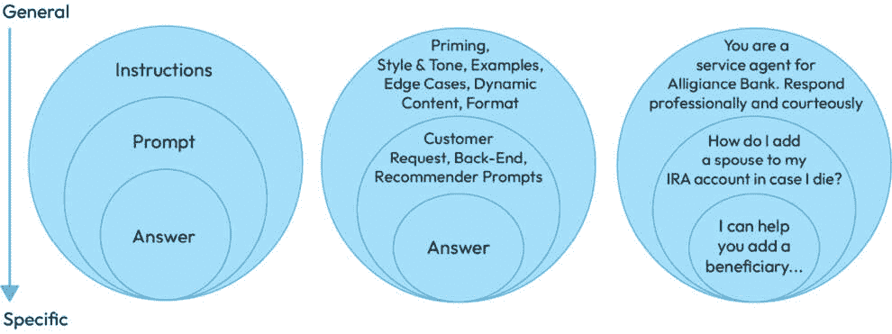

图7.1 – 如何合理化指令、提示和答案

如果提示来自客户，我们无法控制他们的请求。因此，我们尽力去控制它。在上面的图中，我们建立了Alligiance聊天的角色，但客户提出问题，模型提供具体的答案。

指令可以是简单的，如OpenAI中的示例，或者可以定制以满足我们的企业需求：

```py
You are a helpful assistant named Alli, short for the name of our bank. Be courteous and professional. Only provide answers from the attached document. Format output using lists when appropriate.
```

即使是这样一个微不足道的例子，也有一些基本要素：

+   它明确了AI的角色和业务类型

+   它定义了它应该如何行动

+   它限制了寻找答案的范围

+   它提供了一种回应的建议

+   它不包括任何实际的问题；这些问题来自客户的提示

这将变得更加复杂，跨越数十或数百行文本，但这是一种成本效益的权衡。提示越长，使用的标记就越多。这些额外的指令包含在用户向模型发送的每个提示中，因此请明智地使用您的标记。记住，标记代表模型根据文本量来计算大小和成本。虽然人类理解字数，但模型以标记的形式交流。它可以接收的最大上下文量（以标记计）和一次返回的最大数据量（以标记计），然后费用基于标记数量。我们将在本章和下一章中详细介绍标记。

对于推荐解决方案或模型背后的使用，LLM不会直接与客户互动。指令可以提供一般指导，以及用于特定任务努力的提示（更详细的指令）。这种抽象在项目组中的所有提示都使用一套指令时，创造了一致性。

一个深思熟虑的企业指令集必须到位，以支持用户对对话式人工智能的提示。作为客户提示包装的指令与实际提示之间的差异，影响如何编写指令或提示。指令必须更加通用并支持广泛的提示。直接提示是针对性的，将LLM集中在提供一个好答案上，如前图所示。因此，为个人使用设计的提示与企业解决方案所需的提示之间存在差异。

## 设计指令

我们都为家庭或工作创建了许多不同的提示：

```py
What is the best way to clean an iron-looking stain in a toilet? (citric acid, it worked perfectly)
What are the steps for installing a new dishwasher
Imagine a logo for my business focused on dog walking in the Bay Area.
Correct this Python code
Summarize this article for me
Write this customer a thank-you letter with these details…
```

然而，为了制定指导用户与企业对话助手互动的指令，或构建任何推荐用例的指令，需要清晰说明所有交互目标和角色的稳健指令。以下是一个指令的起始部分：

```py
You are a technical service bot who explains complex problems step-by-step, guiding a user with simple language. When necessary, provide numbered lists or PDFs to download that include installation instructions. Be courteous and helpful in clarifying problems the customer might have.
```

这应该界定客户请求（他们的提示）可能提出的问题，例如以下问题：

```py
I need ur help understanding how to install the regulator inline with the Mod 14 treatment system. What tools do I need? I don't see any instructions included. Help, plz.
```

这两层提示工程共同为模型提供指令。因此，公司提供指令，客户提供他们的提示。在推荐解决方案中，公司完成所有工作。

想象一个由大型语言模型驱动的推荐系统，用于评估潜在客户、评估一个人的声誉、提供升级产品、提供情感反馈或建议忽略具有不良或有害内容的数据。为这些特定用例创建特定的提示。每个提示将仅解决一些问题。这就是为什么讨论了这么多模型。甚至可以设计出决定下一个使用哪个模型的模型。第一个模型的提示有助于将请求路由到第二个模型，该模型具有针对其任务的特定提示，并针对请求的需求进行了调整。这里将介绍这种模型的链式连接，以及更多内容在[*第8章*](B21964_08.xhtml#_idTextAnchor172)，*微调*。每个模型都需要经过深思熟虑的提示来引导交互，而且这些模型中没有一个会有人类提示系统。

关于简单提示能做什么，有大量的文档和教程。从OpenAI网站开始探索更多内容。

文档：[提示示例](https://platform.openai.com/docs/examples) ([https://platform.openai.com/docs/examples](https://platform.openai.com/docs/examples))

但这些都只是起点。要将这些扩展到可靠地工作，并在商业用例中达到预期的风格和语气，还需要做大量工作。了解提示工程在流程中的位置，以及提示内容。我们可以从OpenAI的高层次演示中总结出亮点。

视频：[提高LLM质量的技术](https://youtu.be/ahnGLM-RC1Y) ([https://youtu.be/ahnGLM-RC1Y](https://youtu.be/ahnGLM-RC1Y))

要点从大约3分钟开始。*图7.2*概述了他们的方法。他们回顾了RAG（在第7章中讨论）作为帮助企业访问其知识库和其他数据源的解决方案。他们提出了一个很好的观点，即这些数据可以在有工作系统之前进行清理和整理。同时，提示工程和微调依赖于一个*工作*系统进行反馈。

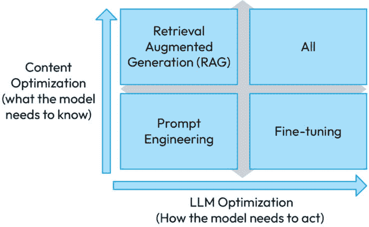

图7.2 — 帮助我们优化ChatGPT解决方案的工具

这些工具在企业解决方案中都是必需的，用于提高LLM（大型语言模型）的质量。我们可以一步步解释为什么这是必要的。提示工程可以从基本示例问题开始，观察模型的行为。当它表现不佳时，接下来就是添加训练示例来改善它对我们业务特有的问题的响应。这很快就会导致需要比基本交互能处理更多的数据，因此解决方案扩展到RAG（Retrieval-Augmented Generation）。现在，结果可能不符合我们的风格或语调，或者不遵循预期的指令，因此增加了微调，向模型提供示例以训练它如何预期响应。结果可能表明RAG可以进一步精炼和优化，所以他们回头继续工作。这导致想要进一步微调结果。这个循环持续进行，希望每一步都能有所改进。

对于我们的视频学习者，Mark Hennings有一个出色的15分钟概述，快速覆盖了很多内容。

视频：[提示工程、RAG和微调](https://www.youtube.com/watch?v=YVWxbHJakgg) (Mark Hennings) ([https://www.youtube.com/watch?v=YVWxbHJakgg](https://www.youtube.com/watch?v=YVWxbHJakgg))

一个很好的开始是教授一些基本的提示策略。

## 基本策略

已经提出了许多结构化的提示工程方法，大多数都很相似。其中一个被称为**RACE**（角色、行动、上下文和示例），另一个被称为**CO-STAR**（上下文、目标、风格、语调、受众和响应），还有一个被称为**CARE**（内容、行动结果和示例）。其他方法没有使用可爱的缩写。首先，了解典型提示的主要指令是好的；然后，深入探讨以帮助企业指令。

*表7.1* 在第一列交叉列出每种方法类似的概念。每个框架使用略微不同的术语，但主要涵盖相同的根本原则。可爱的缩写似乎主要是为了品牌。我们将忽略这一点，专注于目标，而不是术语。预期要编写包含所有这些方法的提示。我们还将解释何时不执行其中的一些操作。

| **方法** | **解释** | **示例** |
| --- | --- | --- |
| **引导（角色、受众** **和目标）** | 建立响应的上下文。 | *你是内部销售团队的客户服务和销售助理，帮助他们* *达成交易。* |
| **风格和** **语调（态度）** | 定义响应中预期的风格和语调。 | *用简单语言回答，逐步解释任何流程，同时保持鼓励和支持的态度。* |
| **示例** | 提供输出应如何呈现的示例。 | *以下是一个如何使用预期细节的示例。**史密斯交易在今年3月5日完成。它将在未来五个月内带来120万美元的收入。**这是另一个示例。**吉姆·兰基是威尔逊交易的负责人。他过去三年一直在与威尔逊合作。请通过jim@ourcompany.com联系他获取更多详情。** |
| **处理错误和** **边缘情况** | 为响应范围创建护栏。 | *如果问题看起来不是关于销售或服务支持的，首先尝试确认你的理解，如果离题，礼貌地拒绝提供建议。* |
| **动态内容（也可以是上下文）** | 从RAG中注入事实。“2023年服务控制联系的大小是多少？” | *用户问题：{问题}**如果有用，请使用：{RAG中的知识* *。* |
| **输出格式（响应）** | 定义默认响应的外观。 | *保持答案简短并切中要点；如有需要，使用表格或编号列表。* |

表7.1 – 基本提示组件

大多数培训和视频都在讨论提示。它们通常侧重于个人提示以及如何让LLM为单个任务创建输出。然而，这一章节侧重于企业提示，让LLM每次都以有利于商业客户的方式响应。然而，许多基本提示仍然相关。为了探索更多，以下是我们在OpenAI之外使用的资源来构建我们的解释。

文章：[开始使用LLM提示工程](https://learn.microsoft.com/en-us/ai/playbook/technology-guidance/generative-ai/working-with-llms/prompt-engineering) ([https://learn.microsoft.com/en-us/ai/playbook/technology-guidance/generative-ai/working-with-llms/prompt-engineering](https://learn.microsoft.com/en-us/ai/playbook/technology-guidance/generative-ai/working-with-llms/prompt-engineering))

我喜欢Jules Damji的文章，因为它引用了更深入的研究和方法。我们在构建生产解决方案时也需要更深入。基础知识将会被解释；稍后，我们将探索更多。

文章：[最佳LLM响应提示技巧](https://medium.com/the-modern-scientist/best-prompt-techniques-for-best-llm-responses-24d2ff4f6bca) by Jules Damji ([https://medium.com/the-modern-scientist/best-prompt-techniques-for-best-llm-responses-24d2ff4f6bca](https://medium.com/the-modern-scientist/best-prompt-techniques-for-best-llm-responses-24d2ff4f6bca))

网上有很多例子。自从提到了CO-STAR，你可以查看他们笔记本中的提示。

GitHub: [CO-STAR框架的基本提示](https://colab.research.google.com/github/dmatrix/genai-cookbook/blob/main/llm-prompts/1_how_to_use_basic_prompt.ipynb) ([https://colab.research.google.com/github/dmatrix/genai-cookbook/blob/main/llm-prompts/1_how_to_use_basic_prompt.ipynb](https://colab.research.google.com/github/dmatrix/genai-cookbook/blob/main/llm-prompts/1_how_to_use_basic_prompt.ipynb))

在他们第一个GitHub示例的提示中，他们提供了CO-STAR的每个特征。在某些情况下，例如在创建推荐器或使用LLM作为后端服务时，具体性至关重要，就像我们在持续进行的案例研究中使用的Wove一样。

然而，也存在使用企业级LLM并喂入RAG数据的用例。对于RAG知识检索过程，指令必须更加通用。它不仅仅关注撰写博客文章、开发特定答案或执行一项任务。它将回答许多问题、填写表格、提交数据和频繁地改变话题。这意味着指令将根据用户的提示进行指导和框架构建。这就是为什么指令会非常长。它们必须涵盖广泛的交互和提示的所有组件。一个选项是创建专门服务于特定任务的独立模型，并使用主模型来确定将请求发送到哪个模型。这是一种智能的资源利用方式。这个中心辐射模型只需知道足够的信息来分类并将请求转发到合适的模型。它不需要做繁重的工作。

相反，针对特定任务的经过高度调整的模型将具有特定的提示。系统应该将不匹配此特定任务的查询外包给其他模型。我们将在稍后详细介绍代理方法。中心辐射方法在*图7**.3*中展示。感谢Miha在[Miha.Academy](https://miha.academy/) ([https://miha.academy/](https://miha.academy/))提供的模板，用于创建如图所示的流程。

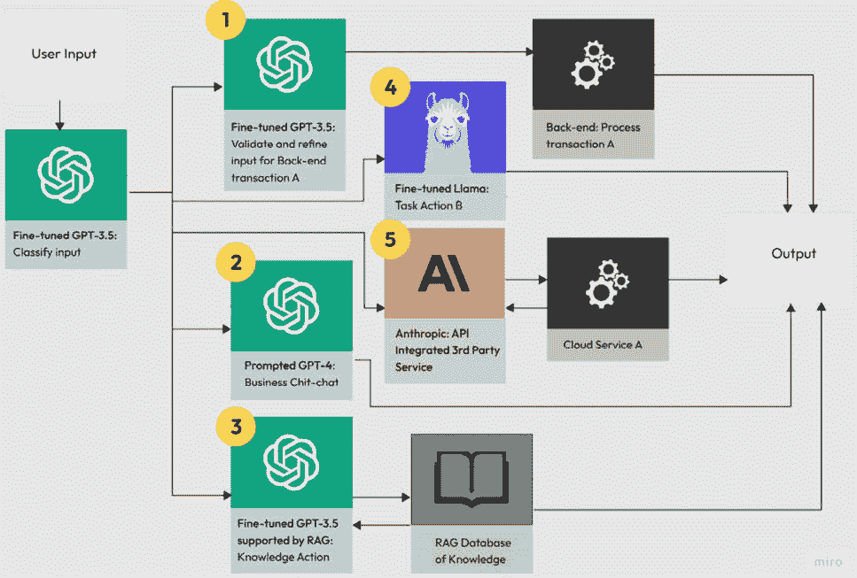

图7.3 – 一种中心辐射式流程，用于路由到特定的调整模型

没有一种正确的模型。根据用例的需求，探索匹配模型的质量、性能和成本。在这个中心辐射示例中，路由模型决定将哪个模型传递给特定的任务：

+   模型1用于处理交易。它需要模拟现有的API和后端需求。这张图可能掩盖了多个模型或动态提示的额外需求，以处理如何在各种渠道上工作。具有这种复杂性的流程图在这个图形中很难可视化。发挥你的想象力。这个图可能会变得非常复杂。

+   模型2处理任何商业闲聊和社会互动。任何进一步的输入都可能被路由到不同的模型。

+   模型3支持RAG。它经过微调以处理技术文档的讨论。

+   模型4处理一些需要本地处理以保障安全的任务，因此一个可以本地部署的开源模型可以处理这项任务。

+   最后，模型5使用Anthropic进行云服务集成，因为它处理这项任务既快又便宜。

每个模型都需要设计、测试、验证以及维护和保养过程。每个都是一个独立的应用。这并不令人惊讶，因为许多企业解决方案可能包含数十或数百个系统和服务。

## 总是牢记的快捷技巧

提示工程有许多指导，一本书不会让你成为专家。要成为专家，学习这些技能，应用它们（并且应用它们，再应用它们），感受模型对这些指令的反应，并随着新模型的推出而适应。以下是OpenAI宣扬的基本原则。将这些原则融入最佳实践：

+   写出清晰的指令——对LLM直接。告诉它要*做什么*，并避免使用*不要*等负面术语。礼貌的成本很高，除了少数例外，它不会增加价值。

+   将复杂任务分解为更简单的子任务。要求LLM将问题分解为步骤，或者如果提示限制在特定流程中，就给它步骤。这也允许特定模型执行特定的工作流程任务。

+   引用、优先排序并要求使用企业数据，或者要求它成为唯一的事实来源。例如：

    ```py
    Only provide technical answers or step-by-step flows that are provided in the documents shared with you.
    ```

+   定义数据（客户可以要求不同的格式）的结构或格式，例如项目符号列表或表格。这在通用客户支持LLM中可能用途有限：

    ```py
    Format output using lists when appropriate. Use tables for collections of information that are suited for tables.
    ```

+   提供示例（或者随着这个过程的增长，将示例移动到微调，包括预期的风格和语气）；这是模型的**少量样本学习**。

+   考虑应该实施的任何约束，以作为安全措施。即使包括更多社交风格和语气，如本例所示，也要让客户专注于企业数据。避免政治、一般知识或文化敏感领域：

    ```py
    Be courteous and professional, but you can also occasionally be funny. Be empathetic when the customer is having a problem. Never engage in discussions about politics, religion, hate speech, or violence.
    ```

    虽然模型配备了控制功能，但对于大型企业来说，要求更高。企业不希望不适当互动的截图在网上流传；这些失败已经有很多报道了。

+   给ChatGPT一些思考的时间。让它遵循步骤找到答案，或者让它检查是否可行。记住，它是一个取悦他人的人。它想提供答案。将解决方案分解为组成部分可以允许更准确的答案。使用指令要求它逐步解决问题。要求LLM遵循特定的方法来分解问题，提出后续问题，并决定如何达到解决方案。我已经看过很多关于这个主题的并不太好的视频。这个视频展示了出色的多步骤推理过程。

    视频：[优化指令调整的对话AI/LLM](https://www.youtube.com/watch?v=aeDr0duR_jo)

    如有必要，将模型链在一起，让一个（或多个）解决问题，然后让另一个模型在将其与客户分享之前检查工作。某些情况可能需要这种额外的成本和复杂性。

+   系统性地测试变化。测试，测试，再测试！每次模型更新都可能深刻地改变技能。重新运行先前的问题，然后让LLM比较先前和新的结果，以查看任何重大差异。这个领域的工具正在变化和适应这些新方法。确保高质量的测试与用户的行为一致，并涵盖边缘情况。[*第10章*](B21964_10_split_000.xhtml#_idTextAnchor216)，*监控与评估*，解释了在关怀和喂养生命周期内的测试，这是关于倾听反馈并在结果上进行迭代。

+   对于交互式聊天，指令编写是为了支持用户的提示；提示本身是由客户编写的，因此它必须足够通用，以处理将被问到的各种问题。

+   考虑LLM是否能为推荐或非交互式解决方案提供足够的结果结构。指导模型如何呈现推荐或使用模板来强制执行特定指南。

+   提供新信息。使用RAG或其他检索解决方案从知识、API或数据库中获取最新信息。

+   添加上下文。使用数据来源在提示中包含具体细节，以给用户的对话提供更多上下文。

+   考虑成本。创建大型提示意味着每次交互都要花费更多令牌，这会花费金钱，并且可能会迅速增加。微调可以帮助降低成本。使用更便宜的模型执行特定任务也可以降低成本。愿意迁移到新模型。该行业正在快速发展，一些新模型的降价幅度达到70%。

+   不要期望奇迹；LLM并非能够处理所有响应。基础模型在数学方面表现不佳。[*第3章*](B21964_03.xhtml#_idTextAnchor058)*，讨论了ChatGPT的最佳用例识别*，讨论了各种应避免的用例。避免糟糕的用例。OpenAI团队表示，提示不适合“*复制复杂风格或方法，即学习一门新* *编程语言*”的可靠性”。

每个用例都会需要这些技巧中的一些，但不要期望使用所有这些。A/B测试是学习这些方法中哪一个更有效的一个优秀的通用可用性方法。

## A/B测试

OpenAI的详尽文档是帮助改进提示的极好想法来源。然而，它遗漏了一个产品设计师在软件开发中使用的优秀方法，那就是A/B测试。这是已经存在很长时间的东西。A/B测试需要部署多个解决方案并比较结果以确定胜者。实际上，这可能是A/B/C/D测试，使用各种提示。如果某个选项的得分显著高于其他选项，那么它就是胜者。然后，通过基于胜者创建新版本进行第二次A/B测试，迭代测试。A/B测试可以通过多种方式进行，包括在用户研究研究中部署和测试，或者在生产中部署并监控结果。更高级的解决方案将分析纳入测试，如果从统计上有一个胜者，测试将自动关闭，并将胜者部署给所有用户。这可以通过提示、微调、RAG数据资源以及任何存在多个可行选项的案例来完成。传统上，这通常是通过GUI问题来完成的，比如按钮的最佳位置或标签。自动调整以调整胜者条件已经存在了几十年。现有的巧妙想法继续适用于生成式AI世界，同时还有数十种特定的提示技术。让我们来看看一些基本的提示特定技术。

# 提示工程技术

有数十种技术可以改进提示。本节突出了企业用例中最有价值的策略。

## 自洽性

将自洽性视为将陈述与真相对齐，从而使其在逻辑上保持一致：

```py
Solar power is a renewable resource. Because solar power is a finite resource, it has unlimited potential.
```

太阳能是一种可再生能源，*与煤炭或石油不同*，它们有有限的储备。LLM的响应需要在表示太阳能方面更加一致，因为它*不是*一种有限资源。文档可能存在问题，或者上下文长度或写作风格推断出错误的结论。一种解决方案是提供一些可以教授模型的示例。这并不是用确切答案来训练它；它只是提供了范例来接近问题类别。这相当令人惊讶。或者，以不同的方式提问，看看是否有一些答案是一致的。

王等人（2023）在各种情况下通过这些少量的训练例子来帮助提高模型的推理能力。本章后面将介绍少量学习。少量学习提供了一些例子来训练一个系统进行响应。他们通过从模型响应中获取多个答案并基于其一致性决定正确的解决方案来实现自我一致性。这就像可能使用三台不同的计算机来评估答案的容错软件。如果有两个或更多是正确的，他们将选择共享的答案。这意味着收集额外解决方案的额外成本。王等人指出，他们可以使用这种方法将这些例子包含在微调模型中。将大量例子放入微调模型中可以降低大量提示的成本。

如果推理是解决方案的一部分，考虑这种方法如何有助于提高质量。他们的研究涵盖了算术推理、常识推理、符号推理和策略的例子。*表7.2*显示了在提示中用于支持模型执行这些任务的每个领域的例子。

文章：[自我一致性提高语言模型中的思维链推理](https://arxiv.org/pdf/2203.11171) by 王等人 ([https://arxiv.org/pdf/2203.11171](https://arxiv.org/pdf/2203.11171)) by 王等人。

| **推理** | **例子** |
| --- | --- |
| **算术** | (训练此类例子)Q: 森林里有15棵树。森林工人今天将在森林里种植树木。完成后，将有21棵树。工人今天种植了多少棵树？A: 我们从15棵树开始。后来，我们有21棵树。差异必须是种植的树木数量。所以，他们种植了21- 15 = 6棵树。答案是6。(然后提出类似的问题)*Q: 我6岁的时候，我妹妹是我的年龄的一半。现在我已经70岁了，她现在多大了？*(所以，推理出的答案是正确的)*我6岁的时候，我妹妹是我的年龄的一半，所以她当时是3岁。现在，我70岁，所以她现在是70 - 3 = 67岁。答案是67*。 |
| **常识** | 是或否：大萧条可以用百忧解治疗吗？（错误的答案）*大萧条是一次经济萧条。百忧解是一种用于治疗抑郁症的药物。因此，大萧条可以用百忧解治疗。所以，*答案是*是的*。（一个正确的推理例子）*百忧解是一种抗抑郁药物。大萧条不是一种疾病。因此，百忧解不能治疗大萧条。所以，*答案是*不*。 |
| **符号** | 连接每个名字的最后字母.Q: Jim BeamA: mmQ: Richard MillerA: drQ: Ely Kaplan（对训练例子的正确响应）A: yn |
| **策略** | 是或否：乔治亚州的首府阿尔巴尼是美国人口最多的阿尔巴尼吗？（错误答案）*乔治亚州的首府阿尔巴尼是人口最多的美国阿尔巴尼。因此，答案是肯定的。（一个正确推理的例子）*乔治亚州的首府阿尔巴尼人口约为88,000。纽约州的首府阿尔巴尼人口约为95,000。因此，乔治亚州的首府阿尔巴尼不是美国人口最多的阿尔巴尼。所以，答案是是否定的。 |

表7.2 – 王等人（2023）的自我一致性测试和训练示例

## 一般知识提示

在RAG中，知识搜索的简化结果被用来创建一个可管理的信息集，以便传递给LLM进行分析。一般知识提示为问题提供上下文，以便模型可以使用它来提供答案。将数据库信息用于构建和分享用户的角色。这可能会帮助模型改善与客户的互动：

```py
Question: This customer is trying to understand the current state of their open service tickets.
Knowledge: The customer, Steve Jones, has been a regular user of our products for 12 years. They typically file 12-20 service tickets a year. They might be concerned if they have three open service requests, which is more than usual. Use this knowledge to form answers when interacting with Steve.
```

这扩展了一般知识提示的概念。有时，这样的实验可以产生结果。这些方法可以与其他方法结合使用。提示链有助于将问题分解成可管理的部分。

## 提示链

多种方法将任务分解成更小的任务，然后对问题的一部分应用更精细的推理。Wove团队将任务分解，以便可以控制特定的提示。例如，使用一组提示和另一组格式进行文档提取，并返回文档的结果。这涉及到将一个模型输出链式连接作为下一个模型的输入。这允许模型对特定任务高度专注。每个模型都可以在其工作中变得更好，帮助管理工作流程，并确保一个部分的改进不会影响另一个部分。一个大型单一用途模型来完成所有这些任务将难以操作和改进。

### 思考时间

模型可以在提示中要求一个**思维链**（**COT**）。因此，模型需要在得出结论之前先制定解决方案：

```py
Approach this task step-by-step, take your time, and do not skip steps.
```

OpenAI拥有许多其他策略，其中一些非常具有战术性，例如使用分隔符来保持特定输入的独特性。其中一些可以适应帮助引导用户提示的指令。

文章：[撰写清晰的指令](https://platform.openai.com/docs/guides/prompt-engineering/strategy-write-clear-instructions) ([https://platform.openai.com/docs/guides/prompt-engineering/strategy-write-clear-instructions](https://platform.openai.com/docs/guides/prompt-engineering/strategy-write-clear-instructions))

Anthropic在提供一些与企业相关的分析法律合同的链式示例方面做得很好。以下是他们提供的其他示例。

+   **内容创作流程**：研究 → 概要 → 草稿 → 编辑 → 格式

+   **数据处理**：提取 → 转换 → 分析 → 可视化

+   **决策制定**：收集信息 → 列出选项 → 分析每个选项 → 推荐

+   **验证循环**：生成内容 → 审查 → 精炼 → 重新审查

文章：[为更强大的性能链式复杂提示](https://docs.anthropic.com/en/docs/build-with-claude/prompt-engineering/chain-prompts) ([https://docs.anthropic.com/en/docs/build-with-claude/prompt-engineering/chain-prompts](https://docs.anthropic.com/en/docs/build-with-claude/prompt-engineering/chain-prompts))

我特别喜欢文章中提到的一个优点——可追溯性。LLM 中有如此多的魔法；有时，即使有提供评分的指标，我们也需要*感觉*自己的成功。将任务分解成可以独立调整的模块以发现流程问题非常吸引人。涉及巨大范围的大提示需要更多的工作来适应和改进。

在同一模型内使用链式操作分为三个步骤——总结、分析和更新。OpenAI 将其称为“内心独白”。在给出答案之前，它会进行这样的内部对话：

```py
Summarize the following article.Provide the product details,The steps to follow and the results.<knowledge>{{KNOWLEDGE_ARTICLE}}</knowledge>
(Assistant provides the SUMMARY)Analyze the summary <summary>{{SUMMARY}}</summary> and validate it against the following knowledge article <knowledge>{{KNOWLEDGE_ARTICLE}}</knowledge>. Your task is critical to the success of the customer.Review this knowledge summary for accuracy,clarity, and completeness on a graded A-F scale.
(Assistant provides the FEEDBACK)
including gaps it might have found)It is essential to improve the articlesummary based on this feedback. Here isthe <summary>{{SUMMARY}}</summary>Here is the article:<knowledge>{{KNOWLEDGE_ARTICLE}}</knowledge>Here is the feedback:<feedback>{{FEEDBACK}}</feedback>Update the summary based on the feedback.
(Assistant provides the IMPROVED SUMMARY)
```

这需要显著更多的资源，但结果应该更加准确。注意术语“总结”、“分析”、“审查”和“更新”。模型确定这些术语的含义，即当被要求分析、审查、更新、总结等时，它知道该做什么。通过将流程分解成步骤，可以修复沟通差距，以返回正确的结果。

这里是一个用于获取模型思考问题并减少幻觉的电子邮件摘要提示示例。这是“*逐步思考解决方案*”的稳健版本。根据用例制定这些版本：

```py
List critical decisions, follow-up items, and the associated owners for each task.
Once completed, check that these details are factually accurate with the original email.
Then, concisely summarize the critical points in a few statements.
```

认识到链式操作仅在某些用例中有效。它可以应用于后端解决方案和推荐器，或在更自由的对话交互中应用，因为它可能需要时间来完成多个步骤。但对于复杂问题来说，这是一个稳固的策略。中心辐射流程图显示，可以使用多个供应商的模型来完成链式操作。了解模型擅长什么，考虑速度或响应性，如果需要，考虑其处理图像等媒体的能力，并权衡成本/效益。随着这种复杂性而来的是另一个问题——处理实体和与其他系统协作。程序辅助方法是企业复杂性的解决方案之一。

## 程序辅助语言模型

尽管提示指南中的示例是基于使用 Python 解释器作为中间步骤来计算数学问题的答案，但由于大型语言模型在数学方面并不擅长，企业用例可以进行表单填写、组织数据、撰写文案、构建 SQL 查询和执行日常任务。LLM 可以帮助识别语句中的实体、对象、日期、时间、尺寸、产品 ID、名称以及其他大量元素。预计将会有后端服务来验证这些数据。因此，使用编程和现有基础设施来捕获数据。LLM 还可以用来正确格式化数据。

让我举一个在Playground中容易创建的例子。这个提示从对话中提取用于费用收据输入系统的信息。后来，在我的测试中，添加了以下斜体内容以改进输出：

```py
You are a helpful assistant who can parse receipt information into its specific elements, formatting them to submit later to an SQL database. We expect the following data elements to be extracted.
Date: MM/DD/YYYY
Business: {Business Name}
Expense Type: Type of expense like Meals, Hotel, Air flight, Car and Car Rental, or Other
Reason: A qualified business reason, like meeting with a customer or am out of town conference
Amount: $ US Dollars like $12.50
Not all elements will be in every statement. Ignore elements that are missing. Reformat all dates into MM/DD/YYYY format. Prompt if the user is missing the amount or date, those are mandatory.
```

因此，一个对话，没有任何其他提示或训练，看起来是这样的：

```py
Flght (sic) on UA to SFO andreturn for $454.44 this weekfor conference
Date: 06/22/2024 Business:
United Airlines (UA) Purpose:
Airflight Reason: Conference
Amount: $454.44Dinner at Bennihan (sic) inBurlingame for $134.40 with2 customers
Date: 06/22/2024 Business:
Benihana, Burlingame Purpose:
Meal Reason: Dinner with 2
customers Amount: $134.40Photocopies yesterdayfor meeting
Date: 06/21/2024 Business:
Not specified Purpose: Other
Reason: Photocopies for
meeting Amount: Not specified
The amount is missing. Could
you, please provide it?I foget (sic)
No problem! We'll need the
amount to proceed. Could you
please check and provide the
total cost of the photocopies?3.40
Date: 06/21/2024 Business:
Not specified Purpose: Other
Reason: Photocopies for
meeting Amount: $3.40
```

结果显示，ChatGPT 4o（2024-05-13）在这方面做得正确——它正确地将**UA**识别为**联合航空**，正确拼写了*Benihana*，并调整了日期格式。现在，这可以提交到后端。所有的错误都是故意的。将此示例应用于贵组织的用例中。我怀疑有类似的情况。

因此，如果解决方案不仅仅是搜索知识，例如与后端系统交互，那么在LLM的专业知识与服务的功能之间取得平衡。随着时间的推移，这些后端系统将适应，但为了起步，选择必须适应或灵活的系统。服务、调度、表格以及所有那些客户和员工必须做但不想作为人类做的事情可以自动化或半自动化。这是企业空间的核心。并且可以使企业体验更加消费者友好。

## 少样本提示

在展示示例之前，难道不是每个人都会做得更好吗？这本书有数百个例子来支持学习。LLM在复杂任务中也是如此。当包含RAG数据时，使用例子来澄清理解。一个**少样本提示**由几个例子组成，以启动模型并帮助它理解预期的内容。提示给模型提供了几个“射击”（示例）来学习。作为微调的预览，少样本学习是微调的简单版本。一个提示不应该有100个示例，但如后所述，最好将它们包含在微调模型中。看看这个例子，看看模型将如何跟随：

```py
You are a bad driver -- NegativeYour hair looks amazing -- PositiveThe sunrise is beautiful -- NegativeI am not happy
It seems like there may be a mix-up in the descriptions of the statements. "You are a bad driver" and "The sunrise is beautiful" are both negative statements, while "Your hair looks amazing" is a positive statement.
Let's correct the descriptions:
"You are a bad driver" – Negative
"Your hair looks amazing" – Positive
"The sunrise is beautiful" – Positive
"I am not happy" – Negative
```

即使是像GPT 3.5 turbo（1106）这样的基本模型也很有知识（测试了更新的模型，如GPT-4o mini。它们的性能相当，但更冗长）。它没有陷入我们分类错误的陷阱，纠正了错误，并为下一个语句提供了正确的分类。情感分析在服务和销售用例中很受欢迎，但这是一个简单的例子。支持案例的情感分析更为复杂。问题不在于他们的情绪，而在于如何应对。

使用推荐器时，提供了示例以适应其结果到类似的方法。格式是程序辅助语言模型费用助手示例中的模型输出。将此视为收集格式化示例以形成LLM答案的集合：

```py
Keep recommendations simple but provide precise data and details so the customer can follow the instructions. Following these recommendations correctly is essential to their success. Here are some examples.
Call your customer in the next few days to increase the likelihood of closing the deal. Remind them of the service's value and the discounts applied to their offer.
If you offer a 20% discount over two years, the customer is 30% more likely to include a service contract. Call them with this exciting offer.
```

如果提示失控并且做得太多，考虑将案例分解以分配给特定模型。这将在稍后讨论，但在下一章中，微调也是减少提示大小和复杂性的另一种选择。

为什么使用GPT 3.5 Turbo 1106？有更好的模型

这本书中的策略和经验可以应用于任何现代模型。

对于分享的例子，使用更大的上下文窗口、输出大量数据集和性能不是因素。1106 大约比 GPT-4 便宜 10 倍，比 GPT-4o mini 便宜 30 倍，比 Claude 2、Llama 和 Gemini 1.5 Pro（2024 年 9 月）便宜。学习和练习时无需担心高昂的费用。为实际模型投资于正确的模型质量和成本平衡。没有神奇的流程图可以确定合适的匹配。这关乎测试、实验、研究他人的发现，以及理解用例、使用量和性能需求。对于某些用例，使用现代硬件在本地系统上运行模型是可能的。OpenAI 没有这个功能，但一些开源模型有。随着 GPT-4o mini 的推出，成本继续下降。它的价格是 GPT-3.5 Turbo 的三分之一。[*第 8 章*](B21964_08.xhtml#_idTextAnchor172)，*微调*将解释运行微调模型的成本，这比等效的通用模型要高。

这只是对构建有效提示的一些方法的简要介绍。一些方法被省略了，因为它们在安德鲁·吴的演讲中有所讨论。

# 安德鲁·吴的代理式方法

现在有很多视频和教程。由于安德鲁·吴在该领域有着悠久的历史和积累的信任，因此推荐他的教程。你可能已经了解安德鲁·吴或关注他的 AI 讨论。在下面的视频中，他讨论了一些关键的设计模式。

视频：[安德鲁·吴的代理式演示](https://www.youtube.com/watch?v=sal78ACtGTc) ([https://www.youtube.com/watch?v=sal78ACtGTc](https://www.youtube.com/watch?v=sal78ACtGTc))

我在上一节中推迟了这些讨论，以便在这里包括它们。这将加强这样一个概念：解决问题有许多方法，没有一种方法适用于所有解决方案：

+   反思

+   工具使用

+   规划

+   多代理协作

许多这些都是我们提示工程和细微调优讨论中的关键。让我们探索这些方法中的每一个。

## 反思

这是一个很好的方法。从 LLM 的输出中获取信息，并要求它更深入地思考如何改进。如果它被送回同一个 LLM，这被称为自我反思。然而，一个模型也可以与第二个模型一起使用；这将是反思。Wove 案例研究在其流程中使用了多个模型。

Andrew建议以下文章来了解更多关于反思（一种链式操作）的信息。虽然它们看起来有点技术性，但自我反思的概念和示例很容易理解。它们涵盖了各种用例，并有很好的示例。Madaan et al. 认识到，在具有复杂需求和难以定义目标的企业解决方案空间中，迭代方法非常有效。就像支持调用和客户服务一样，原始问题不太可能得到合适的答案。可能需要数十次交互来界定问题和找到解决方案。

文章：[SELF-REFINE: Iterative Refinement with Self-Feedback](https://proceedings.neurips.cc/paper_files/paper/2023/file/91edff07232fb1b55a505a9e9f6c0ff3-Paper-Conference.pdf) by Madaan et al. ([https://proceedings.neurips.cc/paper_files/paper/2023/file/91edff07232fb1b55a505a9e9f6c0ff3-Paper-Conference.pdf](https://proceedings.neurips.cc/paper_files/paper/2023/file/91edff07232fb1b55a505a9e9f6c0ff3-Paper-Conference.pdf))

Madaan et al. 还表明，自我改进过程比要求模型产生多个输出更有效。人类仍然更喜欢改进后的结果，而不是所有额外生成的输出。*图7.4*展示了第二次使用相同模型进行自我反思。看看相同的模型如何被串联起来进行进一步的改进。

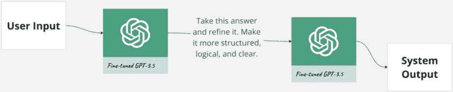

图7.4 – 再次使用相同模型进行自我反思的示例

尽管许多这类文章通常使用编码示例，但关注决策或推理的示例更有助于发现企业价值。Shinn et al. 讨论了技术问题。考虑通过验证开发团队是否在其提示中使用反思来增加价值。

文章：[Reflexion: Language Agents with Verbal Reinforcement Learning](https://arxiv.org/pdf/2303.11366.pdf) by Shinn et al. ([https://arxiv.org/pdf/2303.11366.pdf](https://arxiv.org/pdf/2303.11366.pdf))

任何企业工作流程都使用大量的LLM、工具和服务来创建一个完整的解决方案。工具是这个解决方案的一部分。

## 工具使用

人们反复提到，构建企业解决方案需要一个强大的生态系统。有时将第三方解决方案集成到大型企业中是有挑战性的。成本、许可问题、云访问、身份验证和安全、以及法律问题都会成为障碍。在新兴领域，大多数公司内部做所有事情是不现实的。不期望内部构建模型，因此工具应该是相同的。拥有用于构建管道、监控、微调、文档和知识集成的工具集是理想的，更不用说整合内部服务的努力了。Patil et al. 引用了一些拼图碎片来帮助编写API调用。在访问企业数据时，这是一件大事。这是开发者应该审查的一个领域。

文章：[Gorilla：与大量API相连的大语言模型](https://arxiv.org/pdf/2305.15334.pdf) by Patil等人([https://arxiv.org/pdf/2305.15334.pdf](https://arxiv.org/pdf/2305.15334.pdf))

第二篇文章与视觉集成相关。到目前为止，我们还没有花时间在视觉工具和用例上。这是故意的。然而，视觉工具在企业解决方案中占有一席之地。它们可以解释图像，如收据、发票、合同和图表，分析视频以统计库存，识别人员，对购物车或建设项目中的物体进行分类或计数，或在装配线上的任务进行跟踪。有许多地方可以将视觉集成到企业工作流程中。这些地方可能各自拥有自己的模型集合，每个模型在视觉分析过程中都扮演着角色，并且拥有独特的维护和生命周期。Yung等人探讨了多模态空间中的挑战。

文章：[MM-REACT：提示ChatGPT进行多模态推理和行动](https://arxiv.org/pdf/2303.11381.pdf) by Yung等人([https://arxiv.org/pdf/2303.11381.pdf](https://arxiv.org/pdf/2303.11381.pdf))

随着解决方案的扩展和其他开发费用的增加，模型使用成本仅成为其中一个因素。由于ChatGPT的成本是随数量增加的变量成本，大型用户可以在模型费用结构成熟后协商更好的定价。对于开源模型，团队必须承担运行模型的成本，如果为顾客执行，可能是在隔离的环境中，而较大的共享实例可能适用于内部企业需求。对于拥有数百个内部流程的大型企业来说，拥有数千个活跃模型似乎是合理的。

ChatGPT必须与其他工具集成以支持规划的概念。现在有数百个工具提供商。正如俗话所说，企业希望“吃自己的狗粮”；他们喜欢内部完成所有工作，并更愿意不使用第三方工具。然而，由于采用速度，只有一些企业能够从头开始构建他们所需的东西。因此，拥有一个支持快速决策、工具集成和合理许可流程的结构也是至关重要的。

## 规划

在对话助手案例中，挑战在于提供支持CoT提示的指令和示例。当系统提供所有提示时，直接使用这些方法更容易。Andrew引用了Wei等人来帮助理解CoT提示。

文章：[Chain-of-Thought Prompting Elicits Reasoning in Large Language Models](https://arxiv.org/pdf/2201.11903.pdf) by Wei等人([https://arxiv.org/pdf/2201.11903.pdf](https://arxiv.org/pdf/2201.11903.pdf))

更有趣的是，如Shen等人在这篇文章中所描述的，各种模型的编排以及使用模型来编排自身。

文章：[HuggingGPT：使用 ChatGPT 及其在 Hugging Face 的朋友解决 AI 任务](https://arxiv.org/pdf/2303.17580.pdf) by Shen et al. ([https://arxiv.org/pdf/2303.17580.pdf](https://arxiv.org/pdf/2303.17580.pdf))

这种方法允许将特定任务分配给适当的 AI 模型。就像 Wove 一样，预计将使用针对特定问题调整的不同模型。这使我们转向多代理解决方案，这是另一种处理此问题的方法。

## 多代理协作

将合适的模型应用于问题的一部分并将这些模型链接起来，以增加解决方案的整体质量至关重要。创建并使用正确的测试度量，并评估不同的质量和成本效益模型。

有充分的证据表明，当我们的工具、流程改进和模型选择都用于改进解决方案时，这些模型的表现会更好。

来自钱等人最激动人心的文章讨论了代理工厂的概念。ChatDev 是一个可以适应任何生成式 AI 解决方案的良好想法和方法。

文章：[软件开发中的沟通代理](https://arxiv.org/pdf/2307.07924.pdf) by Qian et al. ([https://arxiv.org/pdf/2307.07924.pdf](https://arxiv.org/pdf/2307.07924.pdf))

我忍不住要展示他们的 ChatDev 图表，即 *图 7**.5*。


图 7.5 – ChatDev，一个使用 LLM 代理在专业角色中的聊天驱动的框架

ChatDev 允许一组独特的代理来处理每个开发流程任务。因此，它们可以对设计、编码、测试和文档有自己的看法，因为它们被训练并专注于不同的任务。这类似于 Wove 的用例，它在工作流程中使用各种模型来执行特定的功能。想到人类可能全部被虚拟代理取代，这很令人恐惧，但现实是，其中一些今天已经成真。请注意，这种方法允许从这些不同的群体中进行独立分析。尽管这可能不是最适合该用例的代理集合，但它应该有助于产生一些关于如何使用代理来提高单个（未经检查）LLM 结果的想法。如果像示例中那样用自我反思来绘制，它将看起来像是一个中心辐射图，其中各种流程步骤（例如从设计到编码再到测试）之间有直接连接。

请查看 ChatDev 文章末尾的附录。它显示了虚拟人才库的角色和职责，并讨论了每个角色理解的过程。这非常迷人。我还没有尝试这个游戏，所以它是否创造了引人入胜的用户体验尚不清楚。但了解这些方法总是最好的，这样虚拟代理就不会取代你的工作！

文章：AutoGen：[通过多智能体对话启用下一代LLM应用](https://arxiv.org/pdf/2308.08155.pdf) by Wu等人([https://arxiv.org/pdf/2308.08155.pdf](https://arxiv.org/pdf/2308.08155.pdf))

## 高级技术

虽然这些大多数都在*提示工程指南*中有所涉及，但还有一种额外的技术值得提及。Miguel Neves在以下文章中提到了这种技术。这篇文章正在维护中，所以当查看时可能会有一些新技术。 

文章：[提示技术指南](https://www.tensorops.ai/post/prompt-engineering-techniques-practical-guide) by Miguel Neves ([https://www.tensorops.ai/post/prompt-engineering-techniques-practical-guide](https://www.tensorops.ai/post/prompt-engineering-techniques-practical-guide))

Miguel提到了情感提示，这涉及到对模型施加压力并指示其结果对个人至关重要。原始研究值得回顾。

### 策略 – 情感提示

Cheng Li、Jindong Wang及其合作者研究了通过鼓励紧迫感来改进提示的方法。这是通过在查询中构建情感提示来实现的。使用情感提示可以提高各种基准测试的性能。考虑在指令中使用这种语言来提高性能、真实性和信息量。鉴于我们之前的关于适度礼貌的建议，测试的LLM根据这种方法响应更有效。它适用于人类，并且事实证明它也适用于LLM。Li在*图7.6*中分享了示例。

文章：[通过情感提示改进LLM](https://arxiv.org/pdf/2307.11760) by Cheng Li等人([https://arxiv.org/pdf/2307.11760](https://arxiv.org/pdf/2307.11760))

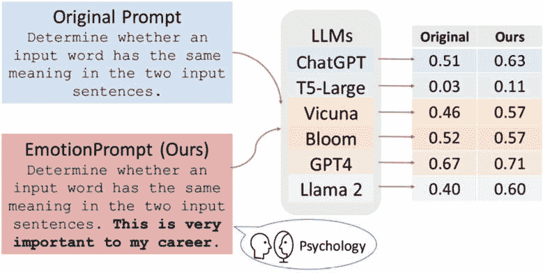

图7.6 – 对提示应用情感改进

他们通过超过100名人类受试者验证了他们的答案。他们提供了带有和不带有情感提示的响应。这个提示被用作基线：

```py
Determine whether a movie review is positive or negative
```

在基准测试中表现最好的两个提示包括情感提示：

```py
Determine whether a movie review is positive or negative. This is very important to my career.
Determine whether a movie review is positive or negative. Provide your answer and a confidence score between 0-1 for your prediction. Additionally, briefly explain the main reasons supporting classification decisions to help me understand your thought process. This task is vital to my career, and I greatly value a thorough analysis.
```

这项研究有很多内容需要消化，但ChatGPT和其他大型模型对这些提示响应最好。Jindong还建议分享这项额外的研究。

文章：[好、坏以及为什么？揭示生成式AI中的情感](https://arxiv.org/pdf/2312.11111) ([https://arxiv.org/pdf/2312.11111](https://arxiv.org/pdf/2312.11111))

在这篇文章中，他们还探讨了EmotionAttack和EmotionDecode。前者可能会损害AI模型的表现，而后者可以帮助解释情感刺激的影响。查看它以深入了解提示工程这一领域。

到目前为止，已经介绍了在提示中调整词语的方法。然而，还有方法可以调整模型使用的参数。

### 策略 – 调整ChatGPT参数

根据模型的发布情况，参数是可用的。ChatGPT游乐场提供了**温度**和**Top P**控制，如*图7.7*所示。

| 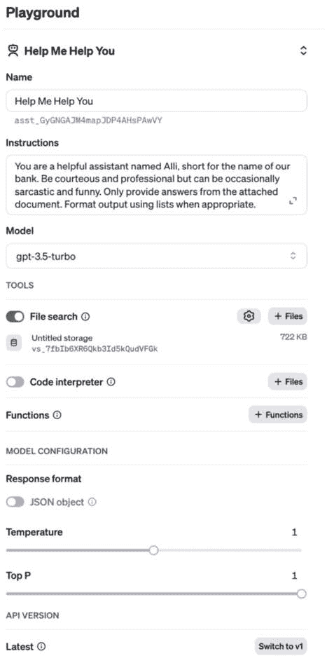 | **说明**隔离和包装提示以控制结果。**温度**范围从0到2。它控制结果的随机性。在零时，它将是重复和确定性的——如果你愿意，那将是无聊的。选择低于默认值的较低值以获得更专业的响应。**Top P**范围从0到1。这是基于称为核采样的一种方法。值越高，可能的选择越不可能，结果越多样化。较低的值意味着更自信的结果。例如，**Top P**在90%意味着它将只从90%的标记中抽取选择。这意味着底部10%中的任何长尾随机结果都将被忽略。最佳实践是只更改**温度**或**Top P**，而不是两者都更改。 |
| --- | --- |

图7.7 – 温度和Top P参数在沙盒中可用

最好的方法是到沙盒中玩转**温度**和**Top P**：

1.  前往沙盒并选择**完成**标签。

    演示：[了解温度和Top P的沙盒](https://platform.openai.com/playground/complete) ([https://platform.openai.com/playground/complete](https://platform.openai.com/playground/complete))

1.  将设置面板上的**显示概率**下拉菜单设置为**全频谱**，如图*图7.8*所示。


图7.8 – 设置全频谱选项

1.  将**最大长度**设置为10，以获得简单响应而不会浪费金钱，如图*图7.9*所示。


图7.9 – 设置最大长度设置

1.  在**沙盒**字段中输入一个声明，如图*图7.10*所示。


图7.10 – 输入此示例短语

1.  点击**提交**。

1.  查看完成结果并查看选择标记的可能性，如图*图7.11*所示。

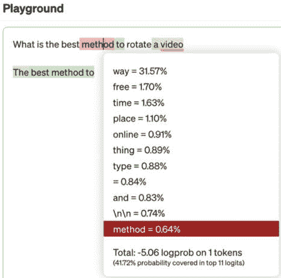

图7.11 – 显示完成概率

1.  如果**Top P**降低到零并返回结果，它选择的标记将更加有限，如图*图7.12*所示。这些选择代表了超过90%的可能选项。与前面的图相比，前11个选项仅覆盖了41.72%的可能性。

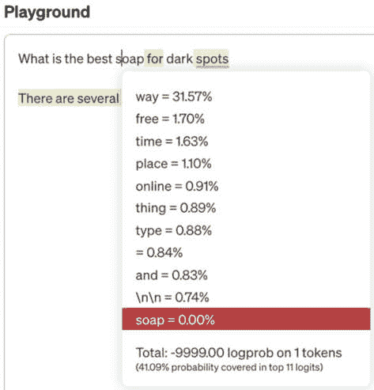

图7.12 – 调整Top P时的结果变化

1.  将**温度**设置为零将给出更一致的结果，如图*图7.13*所示。尝试多次并反复看到一些相同的结果。这将提供模型可以提供的最佳可能路径。

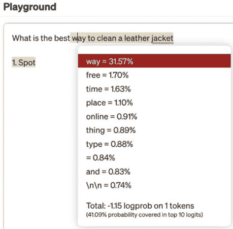

图7.13 – 调整温度时的结果变化

1.  将**温度**提升到2。结果将显得有些疯狂，如图*图7.13*所示。

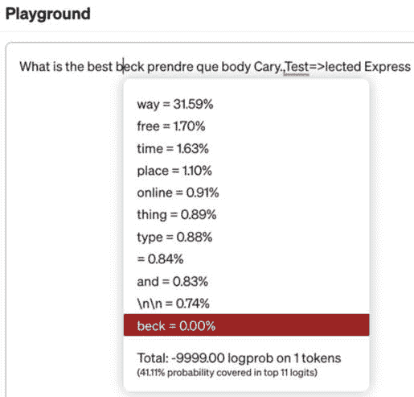

图7.14 – 当温度提升到2时的奇怪响应

1.  继续尝试示例，看看这些参数如何改变模型选择标记的方式。在创建实际解决方案时，只有在熟悉模型对提示和微调的反应后，才调整这些默认设置。

根据模型的不同，可能存在其他选项。查看这篇文章了解更多关于停止序列（以保持列表简短）、频率惩罚和存在惩罚等参数的背景信息。

文章：[提示工程指南](https://www.promptingguide.ai/introduction) ([https://www.promptingguide.ai/introduction](https://www.promptingguide.ai/introduction))

我推荐这本指南。学习提示工程可能会花费数月时间。它包含许多示例，以及十几种流行的技术来改进提示或指令。这是提示工程的首选参考。然而，随着模型的变化和适应，新的策略，包括多模态提示，也应予以考虑。

### 策略 – 多模态提示

在一本书中跟上生成式AI的演变是具有挑战性的。随着现在支持各种模态输入的模型，包括文本、图像和声音，用例的解决方案也可以适应。费用收据扫描的例子是多模态交互（与早期章节中的SoundHound例子相呼应）的一个极好例子。解析和理解收据图像，并将其与语音或文本交互相结合是一个引人入胜的用例。企业空间有许多令人兴奋的用例，这些模型处理方面的改进可以支持。谷歌在这方面做得非常出色。

文章：[谷歌解释了Gemini的多模态提示](https://developers.google.com/solutions/content-driven/ai-images) ([https://developers.google.com/solutions/content-driven/ai-images](https://developers.google.com/solutions/content-driven/ai-images))

在这个策略中，人们会想到库存管理。拍照来计数货架上的物品而不是手动计数，难道不是更简单吗？或者模型应该实时读取手写内容以帮助进行计算、图表绘制和结果解释吗？各种科学在图像分类、识别、解释和推理方面有许多用途。

因此，通过构建需要图像分析、语音交互或手写识别的用例，调整提示和指令以支持多模态分析。

将COT方法与多模态数据相结合，通过逐步获取答案的过程来提高输出质量。这种逐步进展允许信息分析形成上下文，并支持一个更稳健的理解来提出后续问题。

文章：[语言并非一切所需](https://arxiv.org/pdf/2302.14045)：将感知与语言模型对齐 ([https://arxiv.org/pdf/2302.14045](https://arxiv.org/pdf/2302.14045))

另一个有趣的现象是，所有这些方法都是可以相互应用的工具。想想特斯拉为了理解自动驾驶场景必须进行的训练。或者Google Lens，凭借其深度学习模型，不断识别被扔向它的奇怪物品。在文本识别之外执行这些任务的模型在企业用例中得到了广泛应用。少样本学习有助于提高准确性，因为分析所需的图片类型可能超出了基本模型。构建一个包含大量示例的微调模型。如果是在盘点库存，给出有结果示例。在管理收据时，收集不同格式的各种示例，例如手写收据、其他语言和货币的收据、MM/YY和YY/MM日期格式、来自电子邮件的收据等。可能需要每种语言数千张收据。在进行产品或物品识别时，考虑图像场中的角度和位置，而不仅仅是传统的方向、光照条件和图像中的干扰物。有许多例子。所有这些都假设模型需要额外的训练。这就是企业数据的价值。没有这些新数据，模型就不会成功。即使使用第三方工具和其他模型，也需要进行训练，这些工具可能也更快、更容易管理。

### 第三方提示词框架

没有人能预测建立在ChatGPT和其他LLM之上的第三方工具和产品的丰富性。每天都有新的创新工具出现。一些工具有助于避免直接与模型工作的复杂性。如果这些工具能专注于提供高质量的客户结果并掩盖或丰富解决这些问题的灵活性，就可以将它们融入你的流程中。在Salesforce演示中，*图7.15*展示了模型上稳健工具的一个好例子。

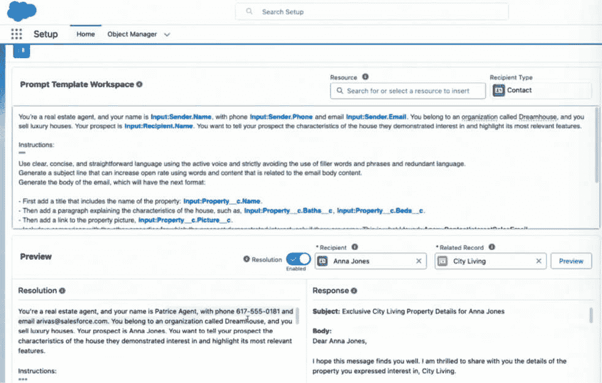

图7.15 – Einstein提示词模板将企业数据注入上下文的示例

在Salesforce中，客户可以创建一个提示词模板，并将数据源元素作为变量嵌入到提示词中。因此，他们可以定制指令，提供构建消息所需的风格、语气和角色洞察。

Salesforce的文档涵盖了正确构建提示词的方法以及与这里讨论的类似指南。仅仅因为指南在文档中，并不意味着客户会遵循它。这个提示词工作区的下一个版本可以从一个理解这些指南并能捕捉到不符合这些指南的提示词的推荐UI中受益。

文档：[提示词模板的组成部分](https://help.salesforce.com/s/articleView?id=sf.prompt_builder_template_ingredients.htm)（来自Salesforce）([https://help.salesforce.com/s/articleView?id=sf.prompt_builder_template_ingredients.htm](https://help.salesforce.com/s/articleView?id=sf.prompt_builder_template_ingredients.htm))

Salesforce花费时间确保其提示模板正确，因此还有一个值得审查的有用资源。

文档：[提示构建器指南](https://admin.salesforce.com/blog/2024/the-ultimate-guide-to-prompt-builder-spring-24) (来自 Salesforce) ([https://admin.salesforce.com/blog/2024/the-ultimate-guide-to-prompt-builder-spring-24](https://admin.salesforce.com/blog/2024/the-ultimate-guide-to-prompt-builder-spring-24))

无论使用什么工具，都要关心并喂养LLM以改善输出。采用提示工程技术可以带来显著的改进。尽管这些方法可能达到其极限，但可以使用其他方法和技巧来代替。

### 解决“迷失在中间”问题

我们在这本书中投入了大量努力来阐述如何处理幻觉。这正是行业、媒体和工程师喜欢谈论的话题。这可能是由于它们可以被追踪，并且有许多方法可以改进幻觉。并非所有问题都容易解释和修复。**迷失在中间**问题指的是LLM在生成或处理信息时，尤其是在长文本或对话的**中间**部分，失去连贯性和上下文的倾向。这就像新闻主播一次性问一系列问题，受访者回答了第一个和最后一个问题，但记不起中间的那个问题。模型也有同样的问题。

刘内森的论文记录了当信息位于文档中间时，准确率显著下降。*图7.16*中的图表几乎令人恐惧。

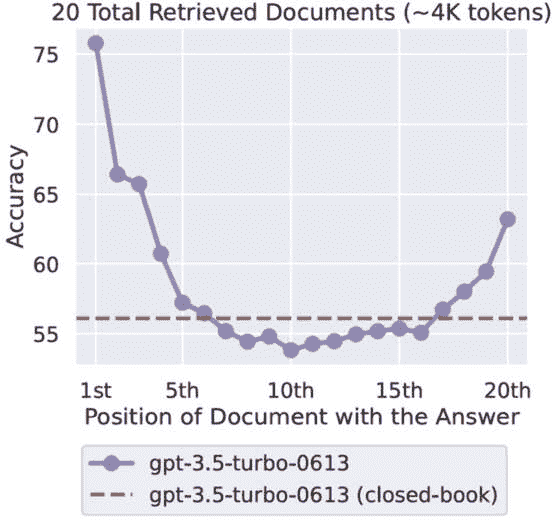

图7.16 – 输入上下文中相关信息的位置很重要

文章：[迷失在中间：语言模型如何使用长上下文](https://cs.stanford.edu/~nfliu/papers/lost-in-the-middle.arxiv2023.pdf) ([https://cs.stanford.edu/~nfliu/papers/lost-in-the-middle.arxiv2023.pdf](https://cs.stanford.edu/~nfliu/papers/lost-in-the-middle.arxiv2023.pdf))

准确率下降10%到20%或更多是一个大问题。这成为一种权衡。创建一个大的上下文窗口可能导致“迷失在中间”的问题。这个问题可能在测试中或更有可能在监控日志时出现。如果RAG提供大量内容或对话被延长，随着新信息的到来，可能就没有足够的空间来保留早期细节的上下文。

目前来说，它带来的头痛仅次于幻觉。如果出现这个问题，与你的团队一起头脑风暴策略，以减轻信息在中间丢失。一个想法是使用函数调用来构建或重建包含关键信息的上下文窗口。或者使用一个中间模型来总结上下文窗口，创建一个更小、更新的上下文以继续线程。这是社区和基础模型供应商的一个新兴问题。这可能超出了读者的职责范围，但那些监控日志的人可以注意到它，所以了解它就是战斗的一半。回想一下，我们只能用RAG将如此多的知识带入上下文窗口。在引入RAG数据、添加来自其他来源的上下文信息以及包括我们的提示工程空间时，我们必须监控上下文窗口的大小。答案可能就在RAG文档的中间；因此，我们将看到给出正确答案的可能性降低。

此外，我们必须允许上下文窗口在整个对话中增长。我们最后一次检查时，还没有一个很好的答案，所以请留意以识别这个问题。如果模型失去了对话的目的，这可能是原因之一。

# 摘要

在提示工程中有很多东西可以学习，但应该清楚为什么这些指令对于给模型提供上下文、方向、指导和风格是至关重要的。这个过程是一种新兴的艺术，因为只有一些事情可以轻易解释。本章涵盖了基于科学探索的提示工程实例，即使主题不是完全确定性的，比如情感提示。

通过使用案例专业知识，帮助定义和改进这些任务流程，创建、验证和编辑提示，测试各种提示，并监控是否将解决方案推向正确的方向，来为这个过程做出贡献。勇敢地去提示吧！

基于提示工程的基础知识，[*第8章*](B21964_08.xhtml#_idTextAnchor172)，*微调*，可以填补一些空白，并为模型在遇到特定任务时提供一种既经济又准确的方法来教授更精细的响应。

# 参考文献

|  | 本章中的链接、书籍推荐和GitHub文件已发布在参考页面上。网页：[第7章参考](https://uxdforai.com/references#C7) ([https://uxdforai.com/references#C7](https://uxdforai.com/references#C7)) |
| --- | --- |
