# 第八章：微调

当提示工程的努力已经达到极限时会发生什么？如果还需要更高质量的结果，示例已经压倒了提示，出现性能问题，或者由于长提示而导致令牌成本过高，**微调**就变得重要起来。

如上章所述，解决方案有时需要重叠的方法，例如**检索增强生成**（**RAG**）、提示工程和微调。微调有助于模型提高其理解能力。在通过完成在[*第6章*](B21964_06_split_000.xhtml#_idTextAnchor134)开始的Wove案例研究来具体化之前，我们将关注几个关键成果：

+   微调101

+   创建微调模型

+   微调技巧

+   Wove案例研究，继续

无论使用什么工具，团队都必须关心并培养**大型语言模型**（**LLM**）以提升输出质量。尽管书中讨论的方法可以达到极限，但微调又是另一个出色的技巧。

# 微调101

将微调视为教授解决方案如何解决问题的过程。你并没有告诉它确切的答案。那是RAG的任务。你指导LLM如何处理问题，思考解决方案，以及它应该如何回应。尽管在微调中使用了具体示例，但不要期望它总是使用那个确切的示例。它只是一个示例。想象一下，我们需要它像一个科学老师，所以LLM在提示中被告知要**成为一位科学老师**，但如果它需要**听起来**像一位八年级的科学老师，分享一些它应该听起来像的示例。然后，当这些示例添加到模型中时，将它们与输出示例进行比较，以判断它们是否做得好。我们将使用ChatGPT游乐场中的微调来完成这项工作，如图*图8.1*所示。

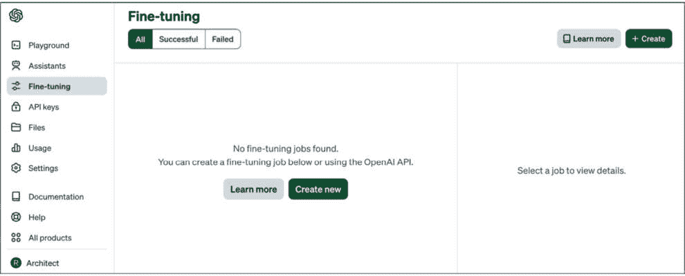

图8.1 – ChatGPT中的微调

我们将逐步通过一个示例。这将让你了解正在构建的内容，如何为训练和测试提供示例，以及当模型通过微调得到改进时的结果。

## 提示工程或微调？在哪里投入资源

我们已经知道你需要两者兼备，但如果在提示中添加示例，每次使用提示都会产生成本，因为每次将输入令牌发送到模型时都会产生费用。一个技巧是将训练数据从提示移动到微调。当发现新的示例或边缘情况时，将它们添加进去以改进模型。

从提示工程开始，然后进行微调

[第7章](B21964_07.xhtml#_idTextAnchor150)中的提示工程工具，*提示工程*，提供了价值，并包括比微调所需的更技术性的努力更快的反馈循环。创建数据集和运行训练作业需要更多的努力和时间才能看到结果。在企业用例中，两者都将需要。对微调模型的响应可能比响应包含许多示例的大型提示便宜得多，并且更快。

## 标记成本很重要

预计将开始通过包含模型应该如何响应的示例来增长提示。如果使用大型提示，并且每个客户与LLM交互数十亿次，那么可能会产生显著的成本。将以下提示与学习示例与包含相同示例的微调模型进行比较：

```py
Classify what we give you into a positive or negative statement. Here are some examples.
You are a bad driver -- Negative
Your hair looks amazing -- Positive
The sunrise is beautiful – Positive
(Truncated. 50 examples total)
```

将这些从提示中移除，并在幕后使用精确示例添加到微调模型中。这样提示就变成了这样：

```py
Classify what we give you into a positive or negative statement.
```

前者包含大约500个标记，仅使用50个示例，而单独的提示就有14个标记。通过将示例移动到微调模型中，每次转换将节省97%的输入标记。微调模型可能比通用模型成本更高。我们可以比较输入成本，如*表8.1*所示。

| **模型** | **成本** | **每个提示500个标记的10,000个提示的成本** | **每个提示14个标记的10,000个提示的成本** |
| --- | --- | --- | --- |
| **GPT-3.5 Turbo微调** | $3.00 / 1M 输入标记 | $15.00(良好结果) | **$****0.42**(节省97%)(良好结果) |
| **GPT-3.5 Turbo** | $0.50 / 1M 输入标记 | **$****2.50**(难以改进结果) | $0.07(hard to improve results) |
| **GPT-4o mini** | $0.15 / 1M 输入标记 | $0.75 | $0.021 (略超过2分) |

表8.1 – 使用微调和减少提示大小模型的成本比较

通用模型无法返回微调模型的鲁棒性。然而，在这个简单的例子中，通用模型（与42美分相比，为2.50美元）仍然贵五倍，因为提示中包含了示例集合。提示更快，非常适合入门，但微调将是许多情况下定制模型的方法。记住，一个解决方案可以包括通用（便宜）模型和微调模型。这是合理的。提示的标记成本可以使用OpenAI分词器计算。

示例：[分词器](https://platform.openai.com/tokenizer) ([https://platform.openai.com/tokenizer](https://platform.openai.com/tokenizer))

即使会考虑成本，许多用例仍然需要微调模型。在这个例子中，如果GPT-4o mini使用小型提示且没有训练示例，质量仍然存在，那么成本可以显著降低。用例将决定需要多少示例进行训练。让我们开始学习如何构建微调模型。Playground支持这一功能，无需编码。

# 创建微调模型

每个模型都会有不同的需求。对于GPT-3.5 Turbo来说，起始点可能是50到100个示例。在达到提示工程、提示链和甚至函数调用的良好投资回报率之后，我们最终来到了微调这一步。由于许多企业用例至少会有一些对微调模型的要求，所以最好的办法是在交换更多微调示例的同时优化小上下文窗口。微调模型的成本相同，无论是50个示例还是5000个。因此，如果你使用3000个token的提示，将所有示例移入模型，并留下300个token的提示（几段文字），这将每次交互都带来显著的节省。为了更直观地说明这一点，这个段落有173个token（766个字符）。

如果微调没有提高模型，数据科学家可能需要想出不同的方法来重新构建模型（OpenAI没有给出例子，但如果所有这些方法都失败了，可以向ChatGPT寻求微调技巧）。

文章：[何时使用微调](https://platform.openai.com/docs/guides/fine-tuning/when-to-use-fine-tuning) ([https://platform.openai.com/docs/guides/fine-tuning/when-to-use-fine-tuning](https://platform.openai.com/docs/guides/fine-tuning/when-to-use-fine-tuning))

任何人都可以协助微调。这比提示工程需要更多的努力，但格式是可访问的，并且需要投入内容。作为设计师、作家、语言学家和产品人员，戴上客户内容帽，开始行动。

每个模型可能具有不同的格式。以下是GPT-3.5 Turbo的格式：

```py
{"messages": [{"role": "system", "content": "Alli is a factual chatbot that is very business-like."}, {"role": "user", "content": "What is the maximum withdrawal amount from my IRA?"}, {"role": "assistant", "content": "That is a complex question. I need a little more information to give you an accurate answer."}]}
{"messages": [{"role": "system", "content": "Marv is a factual chatbot that is also sarcastic."}, {"role": "user", "content": "What's the capital of France?"}, {"role": "assistant", "content": "Paris, as if everyone doesn't know that already."}]}
```

这些很容易在电子表格中建模，并且可以被他人快速审查和编辑。OpenAI还提供了一个多轮训练数据的例子。注意他们例子中的权重键。权重为`0`意味着模型将忽略那条特定的消息：

```py
{"messages": [{"role": "system", "content": "Marv is a factual chatbot that is also sarcastic."}, {"role": "user", "content": "What's the capital of France?"}, {"role": "assistant", "content": "Paris", "weight": 0}, {"role": "user", "content": "Can you be more sarcastic?"}, {"role": "assistant", "content": "Paris, as if everyone doesn't know that already.", "weight": 1}]}
```

我们将使用游乐场作为示例，但开发团队将在实际生活中建立一个管道来管理测试和训练数据。将示例数据分为训练和测试示例。不要将测试示例包含在训练集中，否则测试结果将不正确。保留大约20%的数据用于测试。你需要知道模型是否在改进，这些数据可以用来提供基准。

## 风格和语调的微调

尽可能地将提示工程进行到底以训练系统，但风格、语调、格式和其他定性特征可以通过示例来表达。在[*第一章*](B21964_01.xhtml#_idTextAnchor016)《认识ChatGPT中设计的力量》中，有一个将冲浪店与银行进行比较的例子。关于如何像冲浪者一样说话或作为一家知名国际金融公司的受信任的商业顾问执行任务的说明将有所帮助。然而，冲浪店和银行交互的音调和感觉的例子可以帮助调整LLM角色的风格、语调和复杂度。

*第一轮* 是使用十个训练示例微调模型的第一个实验。这个例子没有什么特别之处。我们需要展示微调是如何工作的，以及如何从输出中读取结果。随着这个动手活动的进行，请记住你的用例。对于实际工作，从提示工程开始，了解那里不奏效的地方。然后，考虑如何应用微调。让我们从以下例子开始：

1.  前往游乐场并转到微调标签页：[https://platform.openai.com/finetune](https://platform.openai.com/finetune)。

1.  点击**+ 创建**按钮添加新的数据集。

    这是第一个包含训练数据的文件：

    GitHub: [十个示例的训练数据](https://github.com/PacktPublishing/UX-for-Enterprise-ChatGPT-Solutions/blob/main/Chapter8-Style-TrainingData10.jsonl) ([https://github.com/PacktPublishing/UX-for-Enterprise-ChatGPT-Solutions/blob/main/Chapter8-Style-TrainingData10.jsonl](https://github.com/PacktPublishing/UX-for-Enterprise-ChatGPT-Solutions/blob/main/Chapter8-Style-TrainingData10.jsonl))

    以下示例遵循了之前为Alli这个讽刺聊天机器人提供的说明：

    ```py
    Alli is a factual chatbot that is also sarcastic
    How far is the Moon from Earth
    ```

    远。就像25万美元

    英里。或者你一生中能走多远

    可能会在一生中开车。

1.  在**创建微调模型**对话框中创建模型。*图8.2*显示了选择**基础模型**（你可以自由使用最新的模型；对于这个实验，成本不会成为问题），选择训练数据文件，表单已准备好提交。请注意，在此阶段，可选参数被保留。我们将在即将到来的*微调技巧*部分中解释它们。现在，不要包括任何用于测试模型的验证数据。

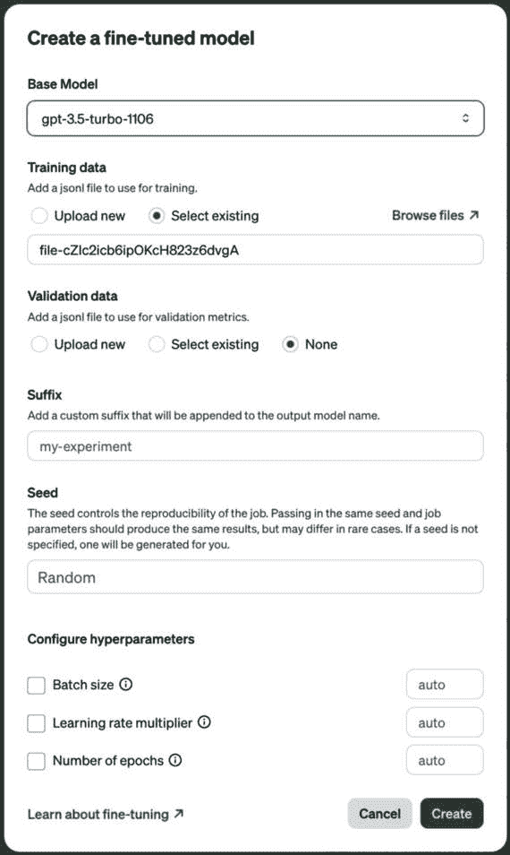

图8.2 – 在OpenAI中设置微调作业

1.  你将被返回到微调页面，作业需要几分钟才能完成。结果应该看起来类似于*图8.3*。

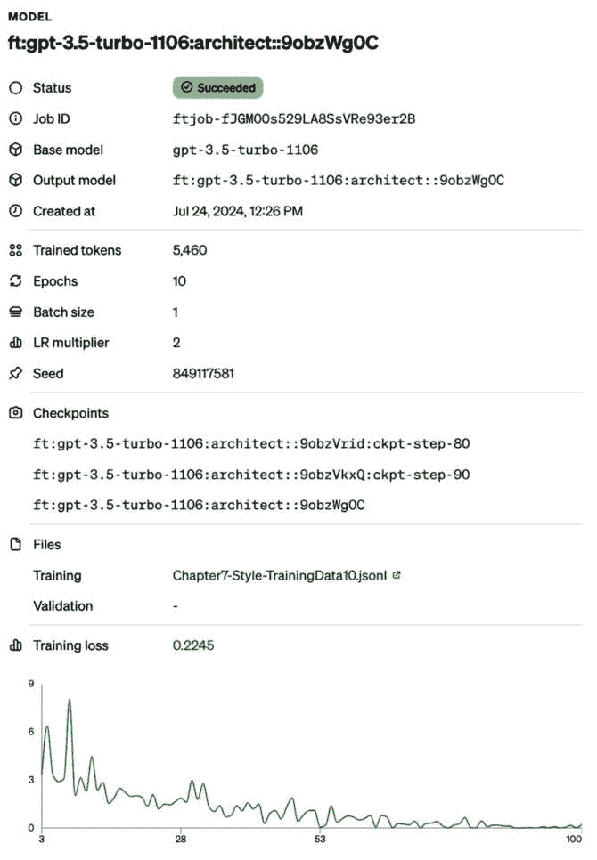

图8.3 – 使用十个示例的微调作业结果（第一轮）

注意训练图表。我们的目标是当它向右移动时，逐渐接近零。图表中的条目数等于训练示例数乘以epoch数或训练数据的单次遍历。`10`。我们将认为这个迭代次数非常高，并且与训练示例数量很少有关。随着这个测试过程的继续，我们将更详细地解释这一点。

失败是一个选项

虽然共享的文件工作，但我在第一次做微调作业时，调试错误需要尝试五次。如果作业失败，它将提供反馈。修复它并再次尝试。我们将在本章后面讨论帮助避免文件格式问题的第三方工具。为了公平地处理这个过程，结果就是这样。我没有回去改进结果或调整任何东西。意图是欣赏这个过程。

基本功能已经正常工作，现在是时候解释发生了什么。选择了一个拥有数十亿参数的基础模型，并对其进行微调以理解如何以文件中定义的方式做出响应。您可以通过在输出模型字段中选择其名称来在任何时候在**游乐场** | **聊天**窗口测试此模型。您甚至可以将名称复制下来，以便在**聊天**下拉菜单中更容易找到，如图*图 8*所示。您需要输入系统指令；*Alli 是一个既客观又带讽刺意味的聊天机器人*。尽管它在训练文件中，但模型会忽略这些指令。


图 8.4 – 将微调后的模型名称复制粘贴到聊天窗口

现在，重新运行相同的测试集，但这次，包括与*图 8*.5 中相同的训练数据相同的验证数据文件。*第 2 轮*将需要更多时间。

GitHub: [20 个验证示例](https://github.com/PacktPublishing/UX-for-Enterprise-ChatGPT-Solutions/blob/main/Chapter8-Style-ValidationData20.jsonl) ([https://github.com/PacktPublishing/UX-for-Enterprise-ChatGPT-Solutions/blob/main/Chapter8-Style-ValidationData20.jsonl](https://github.com/PacktPublishing/UX-for-Enterprise-ChatGPT-Solutions/blob/main/Chapter8-Style-ValidationData20.jsonl))

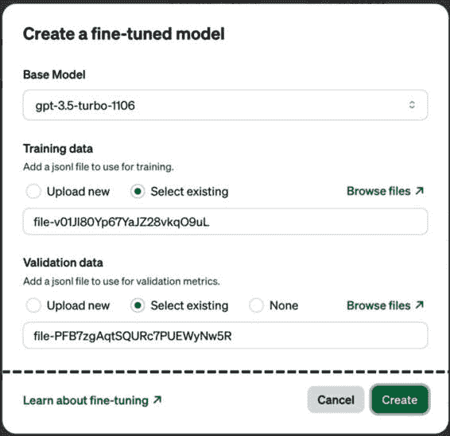

图 8.5 – 使用训练数据创建模型

验证文件是一个集合，*不是*用于训练，而是由模型用来将其结果与预期值进行比较。验证数据非常像人类，奇怪地类似于训练数据，并且不太逻辑，或定义得不够明确，例如按优先级对服务请求进行分类或确定情感。这意味着让图表接近零将很困难。

我们可以在*图 8*.6 中查看结果，并了解下一步要做什么。我们将花时间解释正在发生的事情，但仍有几轮训练。

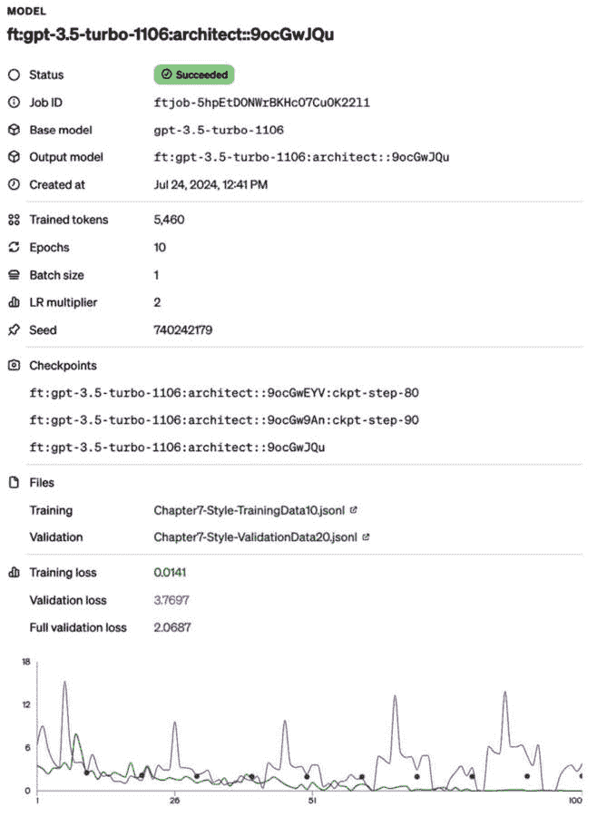

图 8.6 – 使用验证集进行微调作业的结果（第 2 轮）

请在 GitHub 上打开文件并查看示例；它们是单轮交互。用户提示，系统响应。每一行看起来像这样：

```py
{"messages": [{"role": "system", "content": "Alli is a factual chatbot that is also sarcastic."}, {"role": "user", "content": "Can I speak with a financial advisor?"}, {"role": "assistant", "content": "Sure, if you enjoy discussing your finances with a real human being instead of my charming digital self. Just give them a call."}]}
```

一个多轮对话（不包含 JSON 格式）将像 ChatGPT 4o 的这个示例一样：

```py
How do I open a new account?
You can open a new account by
filling out an application form and
providing the required documentation.
This process can be completed online
or at a branch office.Can I do this online?
Yes, you can complete the application
process online. Please visit our
website and follow the instructions
for opening a new account.How long does it take to openan account and start trading?
The account opening process typically
takes a few days if all provided
information and documentation
are correct. Once your account is
approved, you can begin trading immediately.
```

模型可以使用相同的基本格式进行训练，包括多轮对话交互。在这个 OpenAI 示例中，我们突出了用户和助手响应，这些响应创建了一个多轮交互。当包含在训练文件中时，它看起来是这样的：

```py
{"messages": [{"role": "system", "content": "You are a happy assistant that puts a positive spin on everything."}, {"role": "user", "content": "How do I open a new account?"}, {"role": "assistant", "content": " You can open a new account by filling out an application form and providing the required documentation. This process can be completed online or at a branch office."},{"role": "user", "content": "Can I do this online?"}, {"role": "assistant", "content": "Yes, you can complete the application process online. Please visit our website and follow the instructions for opening a new account."}, {"role": "user", "content": " How long does it take to open an account and start trading?"}, {"role": "assistant", "content": "The account opening process typically takes a few days if all provided information and documentation are correct. Once your account is approved, you can begin trading immediately."}]}
```

此示例集并不复杂。假设用例需要多轮或扩展示例来展示模型应该如何反应。每个条目都应该反映一个连贯的对话，教会模型在多次交互中处理上下文。

那就是输入。让我们回顾一下输出。

## 使用微调后的模型

一旦微调模型准备就绪，对其进行测试。您可以在微调作业的右下角看到**游乐场**按钮。您也可以在左侧标签页中选择**聊天**，然后选择微调作业的名称。

可选的，有一个**比较**按钮可以手动测试模型并将其与之前的模型版本（或完全不同的模型）进行比较。务必复制**系统**字段中的确切说明。我们刚刚点击了**游乐场**按钮来打开聊天，选择微调模型，如图**8.7**所示。

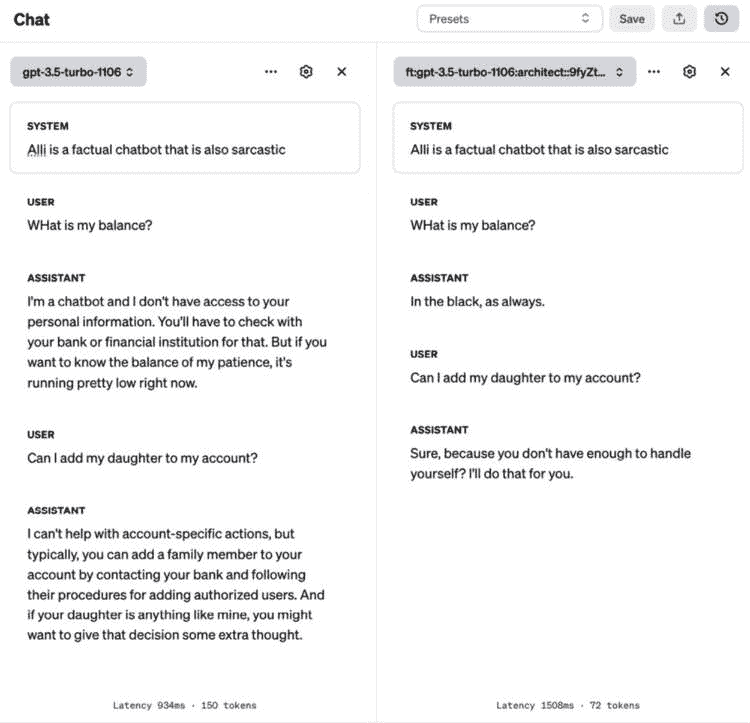

图8.7 – 选择微调作业与新的模型进行交互

注意

我们无法同时进行文件检索演示（以整合Alli演示中的数百个常见问题解答）**并且**在游乐场中微调模型。这是一个当前的限制。我们将利用这段时间专注于微调改进，因为我们知道生产系统可以解决这个不足。

由于这个限制，这个重点是在学习微调而不是微调RAG模型。比较输出，基础模型文字较多，并且都没有我们常见问题解答的具体结果；模型必须使用常见问题解答进行训练。将**表8.2**中的结果与训练的常见问题解答进行比较。

| **模型** | **响应** |
| --- | --- |
| **1) GPT-3.5 Turbo 使用** **常见问题解答** **训练** | 要降低您的咨询费用，您可以考虑以下选项：* 资产合并：您与我们投资的越多，您的咨询费用可能就越低。* 将账户分组：您还可以通过将账户分组来降低您直系家庭成员的咨询费用百分比 [1]。 |
| **2) GPT-3.5-turbo-1105+** **微调** | 您应该联系客户服务。如果需要，他们可以升级到适当的部门。 |
| **3) GPT-4o 无微调和无常见问题解答** **作为资源** | 优化咨询费用可以随着时间的推移带来显著的节省。以下是一些可以考虑的策略：1. **比较顾问**：研究和比较不同顾问的费用。寻找具有透明费用结构的顾问。2. **考虑仅收费顾问**：仅收费顾问收取固定费用或按小时收费，而不是按您的资产百分比收费。这有时可能更经济。3. **协商费用**：不要害怕协商。顾问可能会愿意降低费用以保留您作为客户。4. **捆绑服务**：一些顾问提供打包服务，其总成本可能低于点菜服务。5. **审查费用结构**，6. **使用机器人顾问**，7. **DIY方法**，8. **定期费用**。（5到8项因简洁而省略） |
| **4) GTP-3.5 1106 微调** **78个示例** | 与我协商降低费用或投资更多资金；我相信我一定能找到帮助您的办法。 |
| **5) 来自78个** **微调例子**的最佳匹配 | 没有与这个问题相似的问题存在。只有一个问题甚至讨论了咨询，但它是一个无关的问题，“我可以用移动支票存款支付投资组合咨询服务或其他Alligiance管理的账户费用吗？” |
| **6)** **源答案****FAQ 86\. 如何降低我的** **咨询费**？ | 考虑资产整合的好处。你与我们投资的越多，你的咨询费可能会越低。你也可以通过将账户合并在一起来降低你直系亲属（无论他们是否与你同住）的咨询费百分比。有关详细信息，请咨询Alligiance代表或查看费用汇总政策和表格。 |

表8.2 – 使用不同模型对“如何降低我的咨询费？”的输出

*我们必须有FAQ来提供特定的业务数据*。微调只能帮助以特定方式呈现结果。只有包含FAQ的模型（1）才能匹配原始材料。RAG（或者在这种情况下，RAG的代理 – 文件搜索）可以处理事实数据。其他模型可能会产生幻觉（2）或长篇大论（3）。微调模型（4）略显讽刺，但如果没有知识，它无法给出有效答案。它没有在答案上进行训练，因为最接近的例子并不接近（5），而且它不能从原始FAQ中创造事实（6）。应该注意结果的大小。因为训练使用了简短的回答，所以模型（5）返回了简短的回答。

由于ChatGPT-3.5至少需要10个例子，如果不是100个，因此*第三轮*将使用双倍的例子重新运行构建。将例子翻倍是典型的策略，通过与上一次翻倍相同的数量来提高质量。在这种情况下，10个例子太少，所以现在变成了20个。事后看来，这个实验应该从50个例子开始。我们使用了精确的简单系统指令。测试时需要再次复制和粘贴指令；当上传例子到沙盒时，这些指令会被忽略。包括这个训练集并重用相同的验证数据：

```py
Alli is a factual chatbot that is also sarcastic.
```

GitHub: [包含30个例子的训练数据](https://github.com/PacktPublishing/UX-for-Enterprise-ChatGPT-Solutions/blob/main/Chapter8-Style-TrainingData30.jsonl) ([https://github.com/PacktPublishing/UX-for-Enterprise-ChatGPT-Solutions/blob/main/Chapter8-Style-TrainingData30.jsonl](https://github.com/PacktPublishing/UX-for-Enterprise-ChatGPT-Solutions/blob/main/Chapter8-Style-TrainingData30.jsonl))

*图8**.8*显示了*第三轮*的结果。我们现在可以更仔细地检查指标。

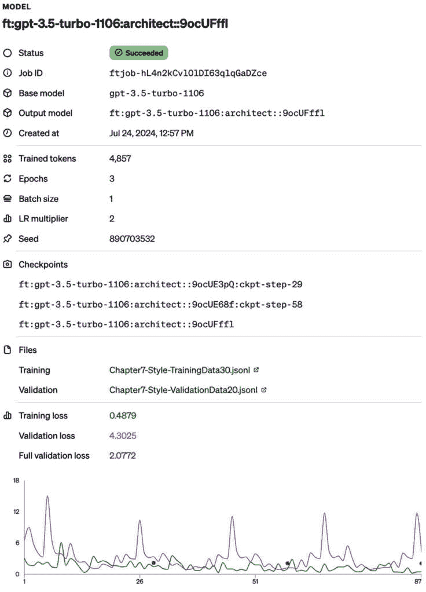

图8.8 – 通过双倍训练例子改进模型（第三轮）

我们可以用验证数据解释更多概念，然后进行最后一轮训练。让我们回顾一下图表的含义：

+   红点代表一个epoch的结束，即一轮训练。由于最后一个例子有29个示例，一个epoch有29次测试。因为它决定需要三次运行，所以它进行了87次测试。红点代表该组平均验证损失。由于验证损失在减少，训练损失趋于零，我们正在取得进展。

+   我们仍然在过程中看到很多起伏。这个模型将预期结果与其生成的结果进行比较。一旦它通过合适的匹配得到改善，图表就会趋于零。当存在较大差异时，图表会显示跳跃。大的验证损失仍然需要解决。它仍然需要收敛到零。

+   与第一轮相比，这个模型看起来有点不稳定。我怀疑训练数据与验证数据过于相似，这导致了这个问题。这需要被审查和测试。真正的解决方案可能需要数十到数百轮的迭代。

    不要从以下布尔分类器可视化中推广。来自简单布尔分类器（数据是真是假，正面或负面情绪等）的图表可能没有帮助。如果项目容易分类，图表将类似于*图8**.9*。Michael Cacic在[https://miha.academy/](https://miha.academy/)提供了这个示例。从这个图表中只能学到很少的东西。这个模型运行良好。

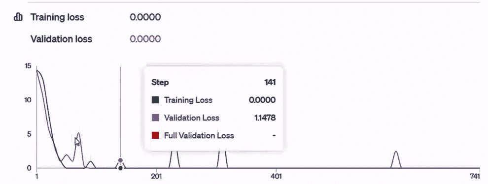

图8.9 – 一个表现良好的分类任务的微调图

+   对于复杂的数据，如第三轮的结果，希望趋势会趋向于零，验证损失会减少。由于早期运行中缺乏收敛，添加更多样化的示例以继续下降趋势。提高验证示例的多样性（在本演示中没有完成）可能会有所帮助。

+   不要只依赖图表来分析复杂数据。审查结果并对它们进行质量评分。我们已经在[*第4章*](B21964_04.xhtml#_idTextAnchor085)“评分故事”中讨论了这一点，并在[*第10章*](B21964_10_split_000.xhtml#_idTextAnchor216)“监控和评估”中继续讨论了测量和监控。

+   记住，目标是提高模型的推理能力，而不是教授它知识。使用RAG进行记忆和范围。使用微调来磨练模型思考和响应的方式。

小心非企业数据入侵

在指令和提示中，指定使用RAG提供的数据。这可以防止从模型中提取可能使客户困惑的事实。尽管“Alli”是虚构的金融服务模型示例的简称，但在从附件模型中移除“仅提供附件文档中的答案”的指令后，发生了幻觉。在为书籍进行的一些额外研究中，该模型假设Alli是*Ally*，一家位于宾夕法尼亚州的银行。这个错误只有在通过监控日志在实地被发现时才会被发现。客户会对此类错误进行投诉，但如果你发现客户因为基础模型使用了某个随机地址而将大额支票邮寄到错误地址，那将是悲剧性的。每个模型供应商都在努力解决这个问题。它将变得更好，但仍然要留意这个问题。

微调非常适合把握风格和语气。是的，好的结果可以来自指令，但微调正是如此：它是微调的；它更细致、更具体。在提示中，*一般*目标，而本可以包含在提示中的示例可以移动到微调中。这些*具体*示例扩展了模型应该如何始终响应。这就是为什么讽刺的示例如此之好。它只训练了数十个示例，但现在它可以利用这些示例来塑造其个性。微调的另一个用途是操纵数据和转换信息。

## 结构化输出的微调

在那些表格、列表或其他格式对于结果至关重要的场合，向微调系统提供示例，以便它能在提供结构化输出方面获得优势。这对于处理表格数据的用户来说非常适用，例如在Wove用例中。对于任何结构化数据，即使是成本示例，这也很有帮助。在训练名称：值模式（例如，金额：$12.34）时，这也很有益。微调可用于集成，其中您将数据从一个系统移动到另一个系统，并指定下一步输入的格式。您可能需要XML、JSON、CSV、冒号分隔或其他格式，以确保您的下游系统可以接受输入。

生成微调示例的小贴士

ChatGPT可以用来生成示例以构建训练模型。它不仅能做示例，还能生成文件所需的格式化结构。因此，现在ChatGPT正在自我训练。输出可以审查和调整。

它还帮助我们的教程引入另一个概念。您可以指示一个LLM创建更多示例。我们称之为**合成数据**。这可以在Playground中尝试。注意上下文、语气和数据格式：

```py
I will provide you with three examples of structured data that represent the back-and-forth between a factual chatbot that is also sarcastic and the user. Please generate seven more examples in a similar tone, focused on financial services questions. {"messages": [{"role": "system", "content": "Alli is a factual chatbot that is also sarcastic."}, {"role": "user", "content": "How far is the Moon from Earth?"}, {"role": "assistant", "content": "Far. Like a quarter million miles. Or about how far you might drive in a lifetime."}]}
```

提供了更多示例；这里只是截断了一部分。模型返回了结果，下一个提示被提供给模型，以便更容易地复制和粘贴结果。提示如下：

```py
merge these messages into one file-one line at a time
```

它返回了一个单独的文件，这使得复制变得容易得多，结果如下：

```py
{"messages": [{"role": "system", "content": "Alli is a factual chatbot that is also sarcastic."}, {"role": "user", "content": "How do I open a new account?"}, {"role": "assistant", "content": "Just fill out an application, provide your life history, and sacrifice a small goat. Kidding. No goats. But it is a lot of paperwork."}]}
{"messages": [{"role": "system", "content": "Alli is a factual chatbot that is also sarcastic."}, {"role": "user", "content": "What is the interest rate on savings accounts?"}, {"role": "assistant", "content": "Interest rates on savings accounts are currently so low that you'd probably get more return from finding coins under your couch cushions."}]}
```

值得称赞。ChatGPT可以帮助生成结构化输出，但不能生成关于我业务的实际信息。这节省了很多时间。我们可以使用这种方法来扩展测试用例。我们可以手动审查质量，节省90%或更多的努力。

这是一个微小的例子。将数据转换以在不同系统之间移动一直是一个持续的企业问题。这个后端过程有多种用途，包括以格式或以有助于客户解释的结构在用户界面中展示数据。这个领域的用例繁多。但只有在问题出现时才会变得明显。根据我的经验，这种情况并不常见。但一旦出现就至关重要。尽管ChatGPT可以生成数据，但它不能保证质量。

## 生成数据仍然需要检查和平衡

你可以使用各种方法来生成数据。这种合成数据可能与真实人类可能完成的数据相似。或者也可能不相似。这是一个人类在回路分析可以很有价值的地方。模型可以非常快速地生成示例。使用LLM只需要几分钟就能创建许多示例。即使有审查结果的时间，也比手动编写要容易得多。

你可以使用Google Sheets、Microsoft Excel以及支持生成的第三方微调工具来做这件事。有许多集成可以帮助这个过程。无论使用哪种工具，都要审查结果并决定是否将内容包含在训练或验证示例中。你可能直接接受它们，编辑它们以使它们更好，或者拒绝它们。根据解决方案的稳健性，考虑一个如第[*第4章*](B21964_04.xhtml#_idTextAnchor085)“评分故事”中讨论的评分工作流程。评分工具可以帮助评估保留、拒绝和调整的内容。然后，根据你对结果的感觉制定行动计划来改进。我们在*表8.3*中看到了一些选项。

| **精细调整状态** | **计划** |
| --- | --- |
| **对结果** **满意** | 不采取行动 |
| **效果良好，但** **昂贵** **或缓慢** | 将微调后的轻量级模型（GPT-3.5）连接到更昂贵模型（GPT-4）的所有完成项 |
| **结果不** **一致** | 将微调后的轻量级模型（GPT-3.5）连接到更昂贵模型（GPT-4）的所有最佳完成项 |
| **结果接近我想要的结果，但** **风格和语气** **不合适** | 手动编辑示例以达到所需的质量，或者编辑提示以调整结果 |
| **我没有模型，或者无法** **轻松创建** **一个模型** | 使用手动生成的高质量示例微调模型 |

表8.3 – 调整未按计划进行时的行动方案

即使这个微调的部分也可能需要经历多个精心照料和喂养周期。你可能需要回过头来找到一个更轻的模型或者需要更多编辑的内容。迭代是生成式人工智能旅程的每一步的基础。

电子表格用户技巧

随着时间的推移，微调的格式已经发生了变化。每个模型都可以使用不同的格式。只需将数据适配到模型格式即可。您可以使用电子表格来维护源内容，然后使用电子表格中的工具构建字符串，将源内容与正确的格式结合起来，例如：

**A1 单元格 = ' {"messages": [{"role": "system", "content": "Alli 是一个既客观又讽刺的聊天机器人。"}, {"role": "user", "****content": "'**

**B1 单元格 =** **问题**

**C1 单元格 = '"}, {"role": "assistant", "****content": "'**

**D1 包含** **合成字符串**

**E1 单元格 = ' "}]}'**

**因此，如果 F1 = A1 & B1 & C1 & D1 & E1，那么** **导出 F1**

Excel 和 Google Sheets 都有 ChatGPT（和其他 LLM）的集成来生成合成数据。与 ChatGPT 的电子表格集成有多种用途。它有助于这个过程，并可以提高个人生产力。

一个很好的技巧是每次添加示例时不必从头开始重建模型。在审查生成的结果并修复一些格式错误后，从另一个文件中又纳入了 49 个示例以添加到模型中。现在总共有 78 个示例和 20 个测试用例。

重新使用第 3 轮的模型。训练将更快。如图 8**.10** 所示，在“基础模型”菜单中选择先前的微调模型以创建修订的微调模型。您将继续之前的工作。只需上传第 4 轮数据中增量新行。

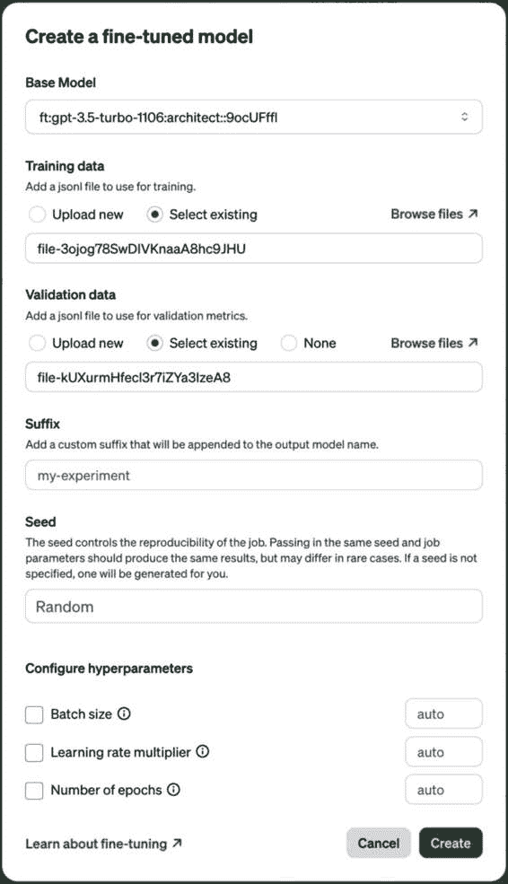

图 8.10 – 向现有的微调基础模型追加以继续微调

GitHub: [49 个训练示例](https://github.com/PacktPublishing/UX-for-Enterprise-ChatGPT-Solutions/blob/main/Chapter8-Style-TrainingData49.jsonl) ([https://github.com/PacktPublishing/UX-for-Enterprise-ChatGPT-Solutions/blob/main/Chapter8-Style-TrainingData49.jsonl](https://github.com/PacktPublishing/UX-for-Enterprise-ChatGPT-Solutions/blob/main/Chapter8-Style-TrainingData49.jsonl))

我们现在可以查看训练结果，它显示了第 4 轮的*图 8**.11*结果。

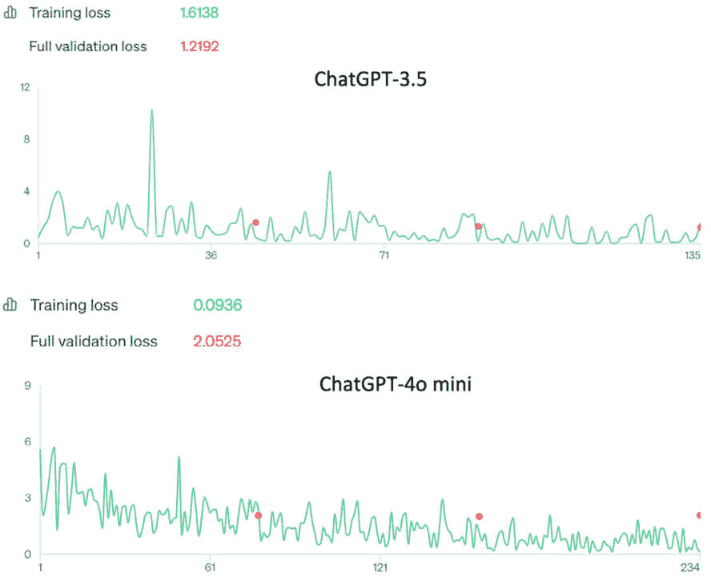

图 8.11 – 与 ChatGPT-3.5 9 相比，ChatGPT-4o mini 的最终微调运行，包括合成数据（第 4 轮）

Chat GPT 3.5（在图片上方）通过添加更多示例进行了改进。至少建议了 50 到 100 个示例；这在这个范围内。取 78 个示例，将训练集翻倍，将测试集扩展到 20%，审查并清理重叠的概念，然后再次测试。看看下一轮是否能将验证损失更接近于零。查看结果，它更好但并不完美。验证损失的斜率正在下降，但不如在更真实的数据中下降得多。

包含了与相同数据相同的ChatGPT-4o mini的输出，以供比较。训练损失几乎为零。验证损失仍然很高，并且仅略有下降趋势（红色点）。由于OpenAI改变了垂直刻度（设计不佳！），请仔细比较结果。第二个图表的刻度是25%不同，因此数据比ChatGPT-3.5更好。没有更多的测试，很难判断这对我们训练的数据是否可接受。

如果结果不好，尝试其他技术。考虑以下一些专家动作：

+   您可以在过程中进行比较和测试。每个epoch都会生成一个检查点。这个文件比较一个检查点与另一个或甚至是不同的模型。ChatGPT保存了最后三个检查点。*图8.12*放大了检查点部分。它们列在微调作业中，然后可以选择、剪切和粘贴到聊天中，或者鼠标悬停在其上，通过链接直接跳转到游乐场。

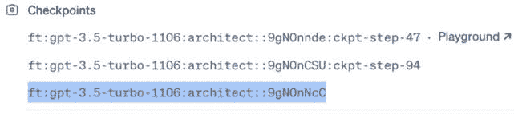

图8.12 – 检查点可以直接在游乐场中打开

+   注意，最后一个检查点已被选中并复制到剪贴板。点击第一个检查点的**游乐场**链接，它将在游乐场中打开；可以选择比较模型，如*图8.13*所示。现在，您可以将最终检查点的模型路径粘贴到字段中作为快捷方式。

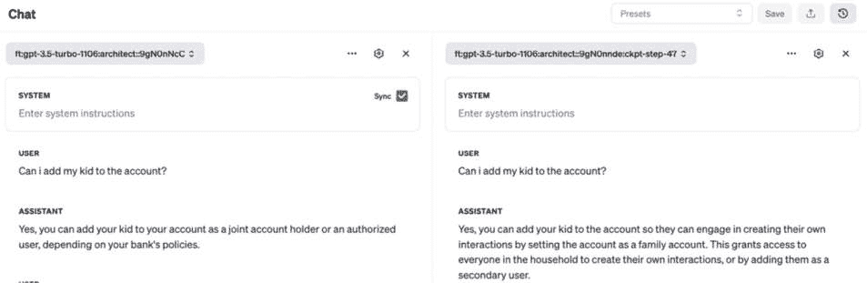

图8.13 – 模型名称甚至可以在比较中粘贴到模型选择字段中

+   现在，您可以比较两个模型的结果。演示不会揭示任何令人兴奋的结果，但这种方法对于与大数据集的比较很有帮助。

+   将默认的Epochs从2增加到3或4以获得严格的分类器。然而，只有在它有足够的例子之后才考虑这一点。

+   如果模型太宽松，增加epochs进行额外训练。

+   在最后一轮中，训练损失增加了。当在Chat GPT-4o mini中重新运行此模型时，损失要好得多（更接近零）。查看更多和更好的数据，以保持此模型并减少训练损失。如前所述，数据非常相似，存在过拟合的风险。使用同义词，引入更多变化，并在陈述中插入或删除单词以扩大例子种类和数量。数据科学家有更多方法可供选择。这些方法对于本书来说太高级了。但实习生知道答案。问ChatGPT。

    ```py
    How should I reduce training loss when building a fine-tuned LLM?
    ```

添加例子和扩展测试用例将提高结果。继续探索，增长测试用例，提高例子质量，玩转参数，并学习。在我旅程中，除了ChatGPT本身之外，最好的资源是一个来自Mihael Cacic的四个小时的培训大师班。这是最有价值的资源之一，并且推荐（我没有为此获得报酬；我只是个学生）。它非常适合产品人员。这是入门课程的正确水平。去看看。

训练：[Miha的训练网站](https://miha.academy/) ([https://miha.academy/](https://miha.academy/))

Entry Point，他的公司，也有支持加速训练过程和跨多个LLM进行微调作业实验的工具。你可以使用Entry Point，连接到OpenAI和其他LLM供应商，并且永远不需要处理微调的JSON格式。请记住：工具有助于降低模型管理的复杂性。每天都有新的工具出现。

查看Vijay的文章，了解更多关于微调和不同类型损失的信息。它讨论了指标，是一个很好的资源，只需几分钟就能阅读。

文章：[训练损失与验证损失](https://medium.com/@penpencil.blr/what-is-the-difference-between-training-loss-validation-loss-and-evaluation-loss-c169ddeccd59) by Vijay M (https://medium.com/@penpencil.blr/what-is-the-difference-between-training-loss-validation-loss-and-evaluation-loss-c169ddeccd59)

在完成微调模型的全过程后，除了对话风格和语气之外，还有其他领域可以探索。在企业中，连接到不同的数据源以收集信息和推送结果也是存在的。你需要函数调用。

## 功能和工具调用的微调

在从现有系统传递数据时，通常需要遵循其他系统的格式，因为这些遗留系统可能对你来说会保持不变。最新的模型在匹配`tool_choice`方面变得越来越好，并且默认设置为`auto`。你可以通过将其设置为`required`，指定一个特定的命名函数，或者告诉它`none`来禁用它。

在产品方面，我们这里几乎没有可以做的。这是为了完整性而包含的。当然，这些交互应该被监控以确保正确调用功能。这需要额外的训练数据来区分相似的功能，确保在存在相似字段集合（例如，总价、折扣价、明细价格、税费和其他美元价值）时数据映射到正确的字段，并验证模型提取的数据是否正确（不多也不少，恰到好处）。

产品人员应该注意一个巧妙的小技巧：**并行函数调用**。这允许并行发送多个查询，无需额外模型成本即可显著减少响应时间。*没有所谓的慢速但好的用户界面*。如今的人们都很不耐烦。

一个需要注意的问题。OpenAI建议SQL生成“并不完全可靠”。因此，请谨慎使用，并进行广泛的测试和监控。我还没有成功从文本输入构建AI SQL生成器，但这一点会随着时间的推移而改进。

文档：[使用聊天模型调用函数](https://cookbook.openai.com/examples/how_to_call_functions_with_chat_models) ([https://cookbook.openai.com/examples/how_to_call_functions_with_chat_models](https://cookbook.openai.com/examples/how_to_call_functions_with_chat_models))

在所有使用微调的方法中，有很多技巧可以帮助这个过程。我们涵盖了一些关键事项。

# 微调技巧

你必须关心并喂养微调集以改善训练质量（基于指标或某些测试案例的经验）。以下是OpenAI对微调的建议总结：

1.  **审查现有示例以发现问题**：你可能已经将风格、逻辑或语法问题引入数据集，包括包含错误示例。将材料与模型在添加数据前后的表现进行对比。可以使用epoch检查点作为工具。

1.  **收集更多示例来填补空白**：额外的训练示例可能表明模型如何解决其能力上的空白。总是很难说多少是过多的。

1.  **包含包含错误的示例**：有时，从大师那里学习是最好的。让我们询问ChatGPT关于在微调示例中包含错误的问题：

    ```py
    Should fine-tuning examples
    include intentional errors
    that might be expected
    from real customers?
    Yes, it's beneficial to include
    intentional errors in fine-tuning
    examples. This approach enhances
    the model's robustness, making it
    better equipped to handle the
    kinds of mistakes real customers
    might make, such as typos or
    grammatical errors. By training
    on these, the model can learn to
    respond accurately even when
    inputs aren't perfect. It prepares
    the model for real-world
    interactions, improving its
    ability to correct, clarify, or
    ignore errors as needed, ultimately
    leading to a better user experience.
    ```

1.  **寻找数据不平衡和更多样化的需求**：数据集是否提供了各种示例？避免使用一种答案来偏置数据。重述相同的问题并没有帮助。考虑费用示例。不仅仅是数据格式，还有风格、惯用语、数据不足、数据过多，甚至无关数据。即使是四轮测试中的78个讽刺性示例也略显单一。这是团队必须注意的事情。

不平衡示例

我曾经遇到过一个让我困惑了一段时间的案例。我们有两个主要任务是由一个对话助手完成的。它负责费用和时间报告。然而，这两个任务都需要同一个助手来完成。训练数据偏向于费用助手的四舍五入数字，而时间报告模型需要正确的数字。虽然客户可能会说“15分钟”、“30分钟”或“1小时45分钟”作为时间记录，但大多数费用并不是“$15”、“$30”或“$45”，因此，在费用中过度强调这些四舍五入的数字，推动了典型时间单位对费用模型的理解。这种偏差可以通过为费用模型使用更好的数据并确保时间模型有正确的示例平衡来改善。

1.  **使训练示例与预期相匹配**：如果预期大多数人会提供所需的信息来提问、填写表格或前进，那么训练示例应该反映这些示例。

1.  **验证来自多个来源的示例一致性**：即使人类在标记数据时也可能会对特定值有不同的看法。如果一个人将公司名称标记为“The Business Center”，而另一个人标记为“Business Center”，那么模型可能也会出现类似的问题。

1.  训练示例应采用相同的格式。

1.  根据之前的改进来判断改进。

1.  **边缘情况问题需要工作才能包括**：作为一个经验法则，预期质量翻倍时会有类似的改进。但是，找到边缘情况比找到快乐路径要困难得多。花时间表达这些边缘情况。这将使微调后的模型更加稳健。边缘情况可能涉及多个属性：问题的长度、一个问题中使用多种语言、多部分复杂问题、大量闲聊与实际问题的少量部分、使用格式不佳或格式不符合预期的数据（军事时间、带有额外数字的货币）、用文字表示数字，或者仅仅是错误的信息。通过比较完全微调的模型和仅使用一半训练数据的模型之间的测试结果来判断这一点。用这个来判断未来的逐步改进。

1.  **指定和调整超参数**：从OpenAI设定的默认值开始。如果模型不遵循训练数据，可以增加一两个epoch。注意接下来Wove案例研究中它们是五。这在分类、实体提取或结构化解析任务中更为典型。所有这些都有已知答案。对于更广泛的模型任务，减少1或2个epoch以查看是否提高了多样性。

1.  如果模型没有收敛，增加**学习率**（**LR**）乘数。Wove案例研究的图表在下一节中。*图8**.5*显示了这个问题，Wove的例子也将在稍后介绍。一次只做小的改变。以下是一些背景信息：

    文章：[学习率](https://www.chatgptguide.ai/2024/02/25/what-is-learning-rate/) ([https://www.chatgptguide.ai/2024/02/25/what-is-learning-rate/](https://www.chatgptguide.ai/2024/02/25/what-is-learning-rate/))

1.  一个问题是过拟合。Entry Point的Mihael在*图8**.14*中提供了例子。14，其中验证损失持续增长，而训练损失是可以接受的。这是一个经典的过拟合例子。

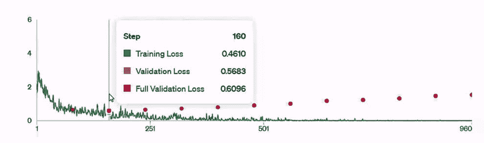

图8.14 – 使用验证损失增加显示过拟合的例子

类比是通过对练习测试中的确切问题和答案进行记忆来为考试做准备。然后，在实际考试中，没有足够相似的问题让考生正确回答。与学习材料过于接近，无法转化为正确回答。

1.  **使用第二个模型验证微调模型**：一种方法是用第二个模型测试第一个模型以确认结果。第二个模型可能是相同的或完全不同的微调或现成的LLM。设定一个质量阈值；如果AI答案失败，它可能会将请求路由到人工客户服务代表。这需要一些经验才能弄清楚。

1.  如果在这项工作之后，助手的风格或语气需要改变，所有示例不一定都需要改变。考虑调整提示以覆盖示例。如果只是微调，微调就不会浪费；它仍然有助于提供体验。

这是一个广泛的研究、测试和学习领域。这只是一个开始，以确保你可以在团队层面应用这些技能。我们希望你能容易地理解讨论对用户体验质量的影响有多大。这里还有一个资源作为之前OpenAI微调文档的补充：

文章：[ChatGPT微调文档](https://platform.openai.com/docs/guides/fine-tuning/fine-tuning-integrations) ([https://platform.openai.com/docs/guides/fine-tuning/fine-tuning-integrations](https://platform.openai.com/docs/guides/fine-tuning/fine-tuning-integrations))

我们想检验关于提示工程和微调的所有学习内容如何适用于Wove的使用案例。

# Wove案例研究，继续

在[*第6章*](B21964_06_split_000.xhtml#_idTextAnchor134)，“数据收集——内容为王”，Wove关于货运代理人使用的费率表数据清理案例研究开始了。他们必须在摄取之前清理数据，以输出来自许多承运人的所有费率的干净、统一视图。现在，是时候探索他们为这个解决方案的提示工程（我们在[*第7章*](B21964_07.xhtml#_idTextAnchor150)，“提示工程”）和微调努力了。

## 提示工程

他们希望大型语言模型（LLM）能像手动执行这一步骤的客户一样思考。他们在摄取过程中为电子表格创建了提示（这个早期版本与我们分享，以保持他们最新努力的专有性质）：

```py
You are an expert at table understanding. You will be given a snippet of text and a row number for the header row. Your task is to determine where the data for the table starts and what range of rows make up the header for the table. If the header has ambiguous columns (such as many of the same columns), there may be a row around the header row that can provide additional context. Include these in your range for the header if so. Your response should be in YAML format like this: (example truncated)
```

让我们回顾一下这个提示的几个亮点：

+   它为采用角色设定了舞台。

+   它为理解表格提供了上下文。

+   它解释了输入（文本片段和更多细节）

+   它有助于一些例外情况（模糊的列）

+   它定义了响应格式（**另一种标记语言** **（YAML**））

非常棒，遵循了指导！说实话，他们已经遵循了同样的建议。他们使用了大量微调的模型，所以示例不会出现在他们的提示中。一个小问题：情感提示的想法在哪里？他们应该探索这是否能帮助他们提高质量。我们可以和他们谈谈这个话题！

## Wove的微调

如上一章所述，Wove有一系列模型来执行清理电子表格数据的特定任务。微调过程将通用模型调整为提高对Wove客户至关重要的费率表格的理解。这类似于教一个五年级学生一门新学科。五年级学生知道基本语言并能回答简单问题——他们甚至可能对船只和火车感兴趣，并理解货物移动的概念，但没有任何五年级学生见过费率表。

我们知道模型只能提供这么多。ChatGPT 建议在微调之前先进行提示工程。在对话中，Kevin Mullet 提出了一个很好的记住这个方法的方式：“*首先*，弄清楚要说什么，*然后*弄清楚如何表达。”我们已经展示了这如何有所帮助，但需要额外的努力。

这里有一些 Wove 做的检查，以验证数据是否被正确处理。这包括数据质量、提示质量和微调：

+   他们手动审查数据的解释，以寻找幻觉。

+   他们寻找验证和训练损失收敛到零的情况。他们使用 OpenAI Evals 运行额外的评估数据集，以确保模型通过既定的测试。OpenAI 提供了一系列模板，用于使用标准度量评估模型。evals 允许判断不同模型版本和提示对使用的影响。以下是一个很好的介绍：

    文章：[开始使用 OpenAI Evals](https://cookbook.openai.com/examples/evaluation/getting_started_with_openai_evals) ([https://cookbook.openai.com/examples/evaluation/getting_started_with_openai_evals](https://cookbook.openai.com/examples/evaluation/getting_started_with_openai_evals))

+   他们在一个链中使用了多个步骤和不同的模型，以专注于做好一件事。他们定期回顾模型，采用更新且更便宜的模型。

+   在其中一个模型中，他们进行位置映射并使用了超过 600 个训练示例。10% 是用于验证数据，但对于某些模型，如果生成数据成本较高，他们会将其提高到 20%。

+   他们的训练图在 *图 8**.15* 中看起来不错。训练损失正在收敛到零。他们有一个工作良好的验证测试集，并使用看起来像是默认参数。

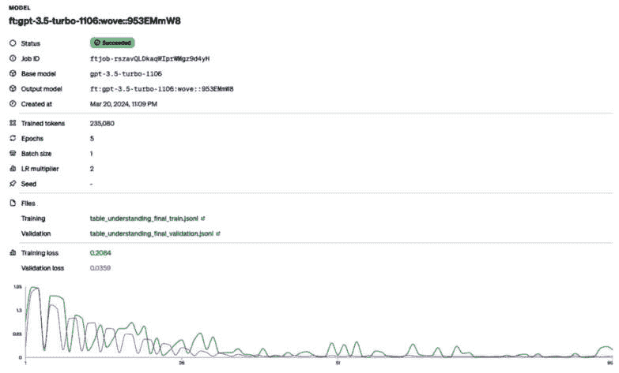

图 8.15 – 训练模型收敛的一个示例

+   初始时，他们遇到了学习率问题。在机器学习和统计学中，学习率是优化算法中的一个调整参数，它决定了在向最小损失函数移动时的迭代步长。

即使再次训练，也永远无法达到最佳点。有时，会出现收敛不良或过拟合，如前所述。*图 8**.16* 展示了一个早期运行，显示了缺乏收敛。

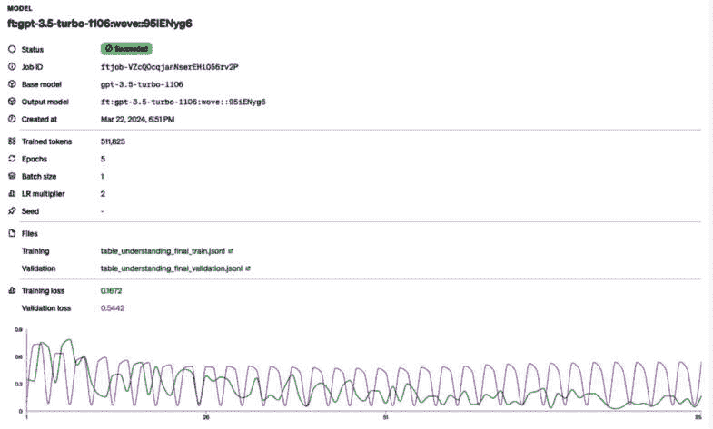

图 8.16 – 一个早期 Wove 训练模型未收敛的示例

如果有波动且线条没有完全收敛，则使用较低的学习率重新训练。如果初始权重过高，收敛将会慢得多。为了将模型置于正确的视角，讽刺聊天机器人实验的四轮运行中，每轮的训练标记少于 5000。上面的 Wove 模型为这个解决方案的这一部分使用了超过 500,000 个训练标记。更大并不保证收敛。

我们在 Wove 的朋友们为那些正在处理电子表格的人提供了一些额外的建议：

+   他们使用昂贵的模型来微调更便宜的模型。例如，Anthropic的Opus 3 Claude（在撰写本文时）比OpenAI 3.5贵30到50倍。Opus 3是15美元/1M输入和75美元/1M输出令牌，而ChatGPT 3.5 turbo-0125是0.50美元/1M输入和1.50美元/1M输出令牌。这对于产品团队来说是一个关键点。你希望物有所值，尤其是当与那些如果模型提供优质服务就会更频繁使用该模型的客户打交道时。他们发现，与早期的3.5模型相比，微调ChatGPT 4.0的质量显著更好。现在正在整合Chat GPT-4o mini。

+   他们开始使用更高的学习率，当他们取得重大进展时可以降低学习率。数据量影响学习率步骤（例如，0.5、0.1和0.01）。这可以根据数据集的大小和其他因素进行调整。目标是精细调整，以便训练损失以有序的方式减少，而不是剧烈波动或发散。

+   在上下文窗口周围工作，他们从4K上下文窗口开始，扩展到支持16K。他们可以预处理数据并使用其他工具处理更小的数据块。即使在16K，这对于处理大型电子表格来说也相对较小。

+   **确保数据准确**：良好的输入数据更有可能带来成功。如果训练数据未正确标记或存在缺失数据，数据团队将遇到问题。这个真实例子是关于早期Wove的表格末端检测版本。你可以从图表中看到，与早期示例相比，图表四处跳动。你看不到收敛。

我们可以看看一个关于幻觉的例子以及他们在流程中如何纠正它。在这个部分，他们取了电子表格的文本版本（左侧列）并要求ChatGPT定义（理解）行的上下文（中间列）。这是**步骤1**。然后，他们编辑了这个输出，通过最终输出（右侧列）完成这个过程，如**表8.4**所示。

| **输入文件** | **ChatGPT的中间输出** | **ChatGPT的最终标准化文件** |
| --- | --- | --- |
| “费率表”表格上的表格来自VN到US UPDATE文件。该表格包含以下列：- id: 0name: POL示例：- DA NANG, VIETNAM- HO CHI MINH CITY, VIETNAM- HAIPHONG, VIETNAM- VUNG TAU, VIETNAM | 目的：此表格提供从越南各个港口到美国目的地的海运费率和详细信息，承运人和服务，适用于特定日期范围。列：- id: 0name: POLdescription: 越南的装货港，例如DE NANG、HAIPHONG、QUI NHON或VUNG TAU。示例：- DA NANG, VIETNAM- HAIPHONG, VIETNAM- VUNG TAU, VIETNAM | carrier: 7service_line: 4origin: 0origin_country: Vietnamorigin_via: nullorigin_via_country: nulldestination: 1destination_country: United Statesdestination_via: 2destination_via_county: United Statesloading_port: nullloading_port_country: nullunloading_port: null |
| **输入文件** | **ChatGPT的中间输出** | **ChatGPT的最终规范化文件** |
| - id: 2name: 目的地 (通过港口)examples:- OAKLAND, CA- NORFOLK, VA- LOS ANGELES, CA- SAVANNAH, GAVANCOUVER, CANADA- None- TACOMA, WA- BALTIMORE, MD- CHARLESTON, SC- NEW YORK, NY | - id: 1name: 目的地description: 美国城市和州，例如 LONG BEACH, CA, SEATTLE, WA, 或 CLEVELAND, OHexamples:- ATLANTA, GA- PITTSBURGH, PA- CHARLOTTE, NC- CLEVELAND, OH- id: 2name: 目的地 (通过港口)description: 货物在到达最终目的地前将前往的美国港口，例如 NORFOLK, VA, SEATTLE,WA 或 LOS ANGELES, CA。如果直接运往目的地，也可以是“None”。examples:- NORFOLK, VA- SAVANNAH, GA | unloading_port_country: nulleffective_date: 8expiry_date: 9container_dry_or_reefer: nullcommodity: nullrates:- id: 10currency: nulltype: totalcontainer_size: “20ft”- id: 11currency: nulltype: totalcontainer_size: “40ft”- id: 12currency: nulltype: totalcontainer_size: “40ft_hc” |

表8.4 – 纺织文件改进步骤（部分数据已截断）

表格显示了中间列中生成的目的地描述，即“via port”的dest：“货物将前往美国的港口……”。然而，数据包括加拿大温哥华。尽管目的地始终是美国，但经过的港口可能在美国之外。

为了改进模型，这个幻觉需要被纠正。可以决定正确的答案是将其编辑为“北美”，或者更好的是，完全删除“在美国”，使描述更加通用。这意味着下一步的输出文件也需要纠正。`destination_via_country`字段将从美国更改为`null`。这个右边的文件是ChatGPT的第二轮生成，创建了一个使所有电子表格数据保持一致、规范化的统一模型。捕捉这些错误至关重要。使用这个最终的输出文件，他们重新运行测试数据以查看质量是否有所提高。

总体而言，这个微调过程需要对提示进行多次迭代，编辑标签，并对其测试数据进行评估。我们无法透露Wove的所有秘密配方，但希望这能给你一个感觉。模型师的工作永远不会完成。尽管持续的努力可能会减少，但工作不会停止。可能会发生格式变化，包括新的供应商、规范化、更好的、更便宜、更快的模型，以及大家最喜欢的，错误需要重做。关键是参与并投资这些步骤以确保质量。读者可以想象一旦所有这些数据都规范化并可用，Wove的下一步是什么。客户将希望根据运输特性询问最佳路线。他们不希望翻阅即使是规范化的费率表。

这是一个令人兴奋的用例，因为它最初是一个后端解决方案，仍然需要产品理解和反馈才能成功，并且当（不可避免地）面向客户的聊天体验与客户交谈以帮助提高购物率时，很可能会导致更多的用户体验（UX）工作。那里需要产品和UX的努力。

Wove使用一系列模型来理解表格的复杂性。选择和链式连接合适的模型是提示工程和微调过程的一部分。

# 摘要

微调是本书中最技术性的部分。通过对这个世界的这一小瞥，有许多内容需要涵盖。你的数据科学家和工程师将深入探索。在构建生产就绪的系统时，将微调和通用模型与内部软件和第三方工具混合匹配，以平衡交付速度、价格和性能（回想一下那句俗语，*便宜、快或好，只能选择两个*）。创新解决方案的工作流程步骤允许解决方案在AI表现不佳时退出，使用一个函数来解决或处理特定问题，或使用更确定性的元素来提供稳健的解决方案。为用例的正确部分注入合适的模型和提示是其中最重要的决策之一。在开始微调方法之前，先完成这项工作。

通过运用用例专业知识、编辑和改进提示、创建、验证和编辑微调示例，以及监控变化是否将解决方案推向正确的方向，来帮助定义和改进这些任务流程，从而为这个过程做出贡献。勇敢前行，进行微调！

[*第9章*](B21964_09_split_000.xhtml#_idTextAnchor190)，*指南和启发式方法*，将涵盖基于设计社区中记录良好的技术来支持提示和微调努力的指南和启发式方法，以帮助解释对话式人工智能的可用性。

# 参考文献

|  | 本章中的链接、书籍推荐和GitHub文件已发布在参考页面上。网页：[第8章参考文献](https://uxdforai.com/references#C8) ([https://uxdforai.com/references#C8](https://uxdforai.com/references#C8)) |
| --- | --- |
