# 第九章：指南与启发式方法

本章解释了什么构成了优秀的对话风格。其中一些内容可能看起来很明显，但在应用这些概念时，探索和理解为什么某些东西有效或无效是有价值的。

应用于新情况。ChatGPT的独特之处在于它不一定会以相同的方式再次回答相同的问题，这就是为什么**第7章**，*提示工程*，是至关重要的。本章将涵盖评估和改进您正在设计的体验的指南和启发式方法。我们并不挑剔我们如何称呼这些，但我们可以使用更好的定义。“**指南**”是特定的，通常基于用户研究。“**标准**”更为具体，而“**最佳实践**”是基于某些条件的建议。像苹果的**人类界面指南**（**HIG**）或谷歌的**材料设计**这样的供应商被广泛复制，并包括所有这些协议。组织或政府可以按照需要强制实施指南和标准。“**启发式方法**”是经验法则或策略，用于将问题分解为需要关注的元素。

```py
Guideline (Smith and Mosier, 1986): Design text editing logic so that any user action is immediately reversible.
Standard: A text header should be Bold Calibri 11-point typeface.
Best Practice (Apple Human Interface Guidelines): Use a chart to highlight important information about a dataset.
Material Design (Google): Consider making pointer targets at least 44 x 44 dp.
Heuristic: Titles should be readable and aesthetically pleasing.
```

重点是，有一些事情应该遵循（指南、标准、最佳实践和设计建议），有一些策略（启发式方法）可以帮助确定该做什么。一些适用于包含对话式人工智能的GUI，而另一些则适用于对话式文本。所有这些内容都在本章中涵盖：

+   将指南应用于设计

+   将启发式分析应用于对话式用户界面

+   构建对话指南

+   案例研究

所有这些都是在做之前要知道该做什么。如果我们知道什么有效，我们可以利用这些知识进行下一次交互。设计指南已经发展，但正如我们将看到的，一些已经存在了几十年，不仅仍然适用，而且可能比以前更加适用。

# 将指南应用于设计

本书遵循对话式人工智能设计生命周期的顺序。为什么指南和启发式方法会在“构建”体验和提示工程之后？这是一个“先有鸡还是先有蛋”的问题。许多团队第一次创建生成式人工智能体验。应用指南和启发式方法需要有一定的对之前构建内容的理解。在如图形用户界面（GUI）这样的视觉体验中，以往的项目经验有助于确定哪些指南和启发式方法将转化为新的设计。但在对话式人工智能中并非如此。这些建议旨在帮助您开始，并在您的旅程展开时提供支持。

软件测试可以被设计来评估是否满足某个指南。使用启发式方法进行测试更具挑战性。用于评估的启发式方法比软件测试用例的精确性质更广泛。以使用标准字体为标题中的粗体卡利布里为例，每个标题都需要一个单独的测试来评估这种条件下的用户体验。这是一个权衡。需要更多的专业知识来了解和内化启发式方法，与指南也是如此。另一个区别是，启发式方法能够经受时间的考验。它们足够通用，能够随着经验的演变而适应。因为它们是通用的，所以在代码中很难定义。如何衡量启发式标题“应该易于阅读”呢？因为指南更具体，可能只适用于特定的用户界面或用例。然而，它们仍然很有价值。此外，理解指南背后的科学原理可以帮助你更有效地将其应用于新的体验。

我曾经使用过的第一套指南是由史密斯和莫西尔（1986年）编写的。该文档包含了944条关于软件界面的指南。不要因为它们可能比你更老就放弃它们。它们基于对人类行为和能力的研究。人类行为并没有因为它们的使用新环境而变得无效，例如高分辨率显示器、语音界面和手持设备。其中有很多普遍真理。许多这些原始指南与基于文本的体验相关联，而且正如出人意料的那样，我们回到了基于文本的解决方案，比如聊天、对话和推荐体验。

文章：[史密斯和莫西尔设计用户界面软件的指南](https://hcibib.org/sam/) ([https://hcibib.org/sam/](https://hcibib.org/sam/))

然而，正如我提到的，这些指南是针对**用户界面**（**UIs**）的，启发式方法可能更适合评估对话体验。这些启发式方法的演变基于这些研究人员以及之前研究人员的坚实科学努力。在深入之前，这里还有一个例子。布鲁斯·托纳齐尼是一位著名的苹果设计师，也是尼尔森·诺曼集团的早期合作伙伴。多年来，他一直是行业尊重和欣赏的人。我邀请他成为弗吉尼亚州布莱克斯堡的一个会议的主讲嘉宾。当他要求酒店提供灭火器时，你知道他的演讲会有些疯狂。这让酒店管理层感到恐慌。有一点令人震惊也适用于指南。有些看起来可能有些疯狂，但通过深入了解它们的起源和科学基础，它们可以更有效地应用。然后，当它们应用于企业用例时，它们就不会显得疯狂，他想要灭火器的理由也是如此，一旦你理解了它的目的。以下是他的原则列表；看看它们如何轻松地应用于ChatGPT前沿。

文章：[交互设计的第一原理](https://asktog.com/atc/principles-of-interaction-design/) ([https://asktog.com/atc/principles-of-interaction-design/](https://asktog.com/atc/principles-of-interaction-design/))

# 将启发式分析应用于对话式用户界面

一套好的启发式方法可以找到广泛的可能问题。启发式评估可以从正式到非正式。更正式的方法是召集三到五名可用性专家作为评估者。一旦提供了背景和任务及用户的背景信息，他们可以独立地根据对启发式方法的理解评估体验。通过记录问题、评估其重要性并汇总每位评审员的结果，团队可以优先处理需要解决的问题。这种方法可以用来查看UI问题，而且其中很多也可以用来理解对话交互。

这些问题不会出现在提供评分的调查中，例如下一章中提到的**净推荐值**（**NPS**）或**软件可用性评分**（**SUS**）。NPS或SUS可以在客户接触产品后应用；对工作原型的启发式评估有一些优点：

+   它可以在设计过程的早期完成

+   它价格低廉

+   用户体验专业人士可以做到，其他人也可以参与其中

+   它们在传统的GUI评估中经过了实战检验

+   在这里，它们被调整为考虑对话体验

    +   带有独特的聊天和推荐用户界面

    +   对于在聊天中使用GUI组件的混合用户界面

    +   对于句子，当在模板中明确定义、具有确定性流程或通过提示抽象控制时

    +   作为提示的一部分，指导LLM重视启发式方法

也有一些问题需要解决：

+   它可能会根据评估者（这就是为什么只有少数评估者参与）产生偏见

+   这取决于评估者在评估和功能方面是否具有足够的专业知识来检测问题（评估者可以被培训，给予练习和探索的时间，并提供了样本用例，但所有这些都可能对审查产生偏见）

+   最好由三到五个评估者来完成，这可能很难找到

+   它可能会返回不重要的问题

为了平衡好与坏，以下是一些建议：

+   在评估之前审查启发式工具，并在一个单独的示例产品上指导人们，以加强方法和启发式原则

+   向评估者提供启发式原则的打印件

+   提醒评估者戴上客户的帽子

+   评估后，使用前面章节中讨论的评分工具来优先考虑和关注最有价值的发现

+   快速迭代，以便未来的评估可以揭示新的项目，不会被更大的、压倒性的问题所掩盖

+   在日常设计工作中使用启发式原则是合理的，以引导你找到在客户看到结果之前就已经很好的解决方案

我们需要一套启发式原则，以最小的成本提供最大的价值。一套已经浮现在脑海中。

我总是从雅各布·尼尔森的十个启发式原则开始和结束。它们足够广泛，可以应用于各种情况，已经经过修订，并且使用了超过30年，这给了它们一些街头信誉。它们涵盖了用户体验中发现的广泛问题。通常，但不仅限于GUI，它们需要放在对话式AI的背景下考虑。我引用的文章涵盖了启发式的基础知识，还有数百篇文章。有时，这些指南会非常准确——对于包括UI组件和对话的混合体验。UI启发式原则有很好的文档记录。需要展示的附加值是如何将这些应用到我们的对话体验中。这可以被称为对观看电视体育比赛的彩色评论。动作（启发式原则）被采取，并通过讨论来解释它，以便外行人可以理解它们在对话式UI中的应用。

文章：[启发式评估简介（HE）](https://www.interaction-design.org/literature/topics/heuristic-evaluation) ([https://www.interaction-design.org/literature/topics/heuristic-evaluation](https://www.interaction-design.org/literature/topics/heuristic-evaluation))

文章：[如何进行启发式评估](https://www.nngroup.com/articles/how-to-conduct-a-heuristic-evaluation/) ([https://www.nngroup.com/articles/how-to-conduct-a-heuristic-evaluation/](https://www.nngroup.com/articles/how-to-conduct-a-heuristic-evaluation/))

将使用支持对话流程和推荐UI的广泛示例。这一章不会对后端体验有益，因为启发式原则是关于评估用户体验的。

期望一个对话式人工智能返回精确的消息可能是一个挑战。这取决于输出由什么控制。如果ChatGPT控制输出，我们就必须依赖提示工程和微调来使其接近。假设一个传统的确定性聊天体验提供前端。在这种情况下，你可以精确指定所需的响应或从一系列响应中选择。你可以使用ChatGPT来理解实体，提出问题以填补空白，或执行其他语言任务以支持更高的目的。推荐用户界面有时使用文本模板。ChatGPT可以收集输入，填写值，转码细节，并提供翻译。记住这些，因为启发式方法可以以不同的方式应用于每个使用情境。

如果你想在ChatGPT聊天中直接看到以下任何示例，很难使其持续发生。这回到了指令。可以使用启发式中的定义来制定响应的指令。这将是一个伟大的研究项目。我们将使用一个新员工入职流程示例提示，结合关键启发式来引导讨论。启发式的影响以粗体突出。

```py
Instructions for the new hire onboarding skill
I have provided a document that outlines our company's onboarding process. I need you to create a set of detailed instructions from this document. As the user performs each step, reach out to the appropriate service to verify completion and provide the status of each step. Follow these guidelines:
1\. Format the instructions as a numbered list.
2\. Each step should be clear and concise, with no more than two sentences per step.
3\. Use formal language suitable for interacting with a new professional.
4\. Focus on key actions new employees must take and omit any unnecessary background information.
5\. The instructions should be easy to follow for someone new to the company.
6\. Do not ask the new employee to remember information. Provide details at each step and confirm any understanding of those steps as you proceed through the process.
7\. If there are errors, report them in clear, simple terms and explain how to fix them. If a step doesn't block progress, keep track of it so the user can complete it in any order.
8\. Keep it short and simple for questions that have well-known answers, like Age or Height. For less well-known questions, provide an example or details about what is needed.
For example:
1.**Sign into the company portal**: Use your assigned credentials from the welcome email to access the portal.
2\. **Complete the onboarding form**: Fill out all required fields, including your personal and emergency contact information. Let me know if any fields need clarification.
```

每个启发式将讨论在提供给LLM的指令中发现的启发式影响。以下是一些启发式。每个都将被定义和解释，以及它们如何应用的分析。

+   *系统状态的可见性*

+   *系统与* *现实世界之间的匹配*

+   *用户控制* *与自由*

+   *一致性* *与标准*

+   *错误预防*

+   *识别而非回忆*

+   *使用的* *灵活性与效率*

+   *美学与* *极简主义设计*

+   *帮助用户识别、诊断和从错误中恢复*

+   *帮助* *与文档*

每个启发式都遵循相同的模式。启发式的名称、确切定义、将其应用于对话式人工智能的分析，以及对新员工入职示例的分析的呼吁。

## 1 – 系统状态的可见性

*设计应始终通过在合理的时间内提供适当的反馈来让用户了解正在发生的事情。*

### 分析

在聊天体验中，通常通过文本响应来让用户了解情况。在流程中，一些信息会重复以提供上下文，当需要下一步操作时。用户期望在几秒钟内看到这些信息。等待10秒钟来收集后端数据会显得很奇怪。如果提供及时信息是一个问题，请提供反馈。有时，提供估计可能很困难。如果用户期望延迟，他们可能会对此感到更好。从这些例子中学习：

```py
I am gathering the results. I will get back to you in about 20 seconds.
I am gathering data from 35 systems for you. Some are slow. Give me about 15 more seconds.
The engine rebuild you requested will not be finished for 3 more hours. Can I email or text you when it is ready?
```

以这种可怕的用户体验开始这一部分，让用户永远等待，真是太疯狂了。我们将探讨一些更典型的系统状态示例。

这是一个适当的反馈级别，确认地址步骤已完成，并为用户提供了足够的信息，以便他们将来选择送货日期：

```py
I have your shipping address. We can deliver as soon as Friday. When would you like the delivery?
```

提供的反馈应该有限。如果地址已确认，不要在订单中重复它以及所有其他信息。等到有总结或用户请求地址时再提供。这是*适当的反馈*。以下是如何向LLM（大型语言模型）提供指令的示例。回想一下[*第7章*](B21964_07.xhtml#_idTextAnchor150) *– 指令工程*：指令是包裹客户对话的提示，以便客户提示有一些指导。如果意识到上下文是一个整体的提示，而不是用户输入的内容（也称为用户提示），那么将这些称为指令或提示是可以的。

```py
Instruction Tip:
Use a summary if you have already confirmed information and must let the user know you still have it.
For example:
If you confirmed the user's shipping address on the last step, refer to it as "your shipping address." Don't repeat the entire address unless requested.
```

如果日历上充满了不可用的送货日期，这将是一个挑战。用户将陷入无意识的挑选日期的游戏。例如，在纯语音解决方案中，可以围绕用户提供的日期提供三个送货或开放时间的建议。图形用户界面可以显示一个月的概览视图，显示可用的送货日期。它会显示下一个可用的日期，并提供编辑该日期的选项。这样，用户就能理解系统能做什么：

```py
I have your shipping address. Our first available delivery is on Friday, August 9th. We can also look for later dates.
```

如果用户体验只是推荐而不是交互式的，根据推荐明确信息仍然很好。如果他们在屏幕上更改了某些内容，推荐会更新吗？例如，如果推荐是本周给客户发电子邮件，它知道我今天已经给他们发过邮件了吗？即使这项信息与推荐没有直接关系，也应该有一个可点击的提示，比如一个**信息**按钮，来解释推荐的内容，在这个例子中，是否考虑了最后发送的电子邮件。以下是**信息**按钮可能包含的内容：

```py
This recommendation is based on a few factors:
  • Email was sent on Tuesday.
  • The customer visited a few weeks ago.
  • The analysis of this customer's
    willingness to buy compared to other customers.
```

提供时间信息（例如，最后更新三分钟前，或此推荐基于昨天更新的详细信息）可以帮助评估推荐的关联性。

关于系统状态还有最后一个想法，这也适用于后端服务或推荐。如果不可用的资源影响了数据，让人们知道。不要只是超时连接。集成应该支持并传达系统关闭的边缘情况。它应该反映服务的风格和语气，而不是一个神秘的错误信息：

```py
Oops! We can't access the recommendation system. It appears offline. If this persists, please report it to it@company.com.
```

这封电子邮件链接应该用技术信息填充主题和正文。为了达到下一个层次，在适当的条件下，这样做：

```py
Oops! We can't access the recommendation system. It appears offline. The IT department was notified, and a trouble ticket was filed.
```

根据受众，它可能链接到工单或抄送给客户。这条信息可以重复并保持一致。请勿将其留给LLM生成响应。这种情况应该非常罕见，以至于多样性无关紧要，我们希望对错误的开发非常具体。如果暴露过多细节会使用户困惑，请坚持使用通用信息。

这是第一个说明这个启发对新员工入职指导影响的突出显示。我们不会每次都介绍突出显示；它们将始终是每个启发中的最后。

新员工入职分析，系统状态可见性

启发式影响因素：*关注关键动作*，*在每个步骤提供细节*，*如果有错误*

有几个地方应该传达状态以指导用户。确认进度被跟踪，报告错误也将有助于新工作的压力时期。

## 2 – 系统与真实世界的匹配

*设计应该使用户的语言。使用用户熟悉的话语、短语和概念，而不是内部术语。遵循现实世界的惯例，使信息以自然和* *逻辑的顺序* *出现。*

### 分析

在对话式的交流中，风格和语调有很大的作用。在企业软件中会更复杂。如果用户提到排序系统，不要用* *订单录入和跟踪系统* *来回复。他们可能没有意识到这是同一个系统。积极反映客户语言和惯例，但要以与组织一致的风格来做。回想一下我们的冲浪店例子。为了确认订单，使用以下方式：

```py
Hang Ten! Your new board is hitting the waves via UPS. We will drop the tracking code by sunrise. Mahalo.
```

提示工程和微调使金融服务公司的回应更加简洁。回应将使用更正式的商业语言：

```py
Your new business checks for your Alligiance money market account will ship tomorrow via USPS.
```

这也是一个很好的启发，用于欣赏如何显示信息。考虑内容的格式，或者对于列表，提供信息的顺序。*表9.1*分享了显示信息的顺序和格式选项。*使用提示来设置顺序* *和格式。*

| **顺序（****用于列表）** | **格式（用于** **复杂内容）** |
| --- | --- |

|

+   按字母顺序排列

+   按时间顺序排列

+   分类

+   从高到低

+   位置或距离

+   逻辑

+   从最贵到最便宜

+   数字

+   流行度

+   优先级

+   随机

+   尺寸或尺寸

|

+   项目符号列表

+   日历

+   卡片/瓷砖（如名片）

+   图表或图形

+   文件格式（PDF、XLS或Doc）

+   图片或图形

+   地图

+   有序列表

+   电子表格（可下载）

+   表格

+   树状图

|

表9.1 – 显示信息的常见设计替代方案

新员工入职分析，系统与真实世界的匹配

启发式影响因素：*清晰、简单的术语*，*应该易于* *遵循*

目的是让他们加入，而不是教他们术语。提示强调这是一个新员工，所以清晰度是关键。

## 3 – 用户控制和自由

*用户经常因错误而执行操作。他们需要一个清晰标记的“紧急出口”，以便在不经过* *延长过程* *的情况下离开不想要的操作。*

### 分析

通常，如**取消**之类的按钮位于对话框中或在多步过程中；用户可以取消或离开流程，稍后再继续。太多的UI界面看起来令人恐惧，因为似乎可能会丢失工作。如果一个网站在填写长表五分钟后超时怎么办？如果你重新登录，你能从你离开的地方继续吗？如果用户意外关闭窗口或在浏览器上点击**后退**按钮，他们能否在不丢失工作的情况下返回？或者，弄清楚如何撤销动作可能具有挑战性。在线购物车就有这个问题。有时，找出如何退出购物车或删除商品可能（故意地）很困难。一些购物车有一个明显的删除按钮。其他的一些还包括保存到稍后按钮，以鼓励未来的购买。其他的一些则要求用户将数量设置为零（这既间接又不明显）。

在传统的UI设计中，要明确，例如，为对话框提供用户取消和接受按钮。文本界面或语音界面不会有视觉提示。如果用户需要澄清或指导，建议一个前进路径：

```py
(System provides a summary of a transaction)
If this looks correct, reply "submit." You can also give me changes or even cancel the order.
```

在这里，控制词“提交”在对话式人工智能中并不一定是必需的。这条信息鼓励用户继续前进；它不是用来强迫他们接受下一步的。许多单词/短语可能都受到支持，系统必须决定这些单词是否足以确认动作。我让ChatGPT对一组可能表示提交的术语进行分类。

```py
classify the examples as stronglyconfirming, sort of confirming,weakly confirming, or notconfirming the order.
Strongly Confirming:
Go ahead with it, Let's finalize this, Proceed with the order, Give it the green light, We're ready to move forward, Submit the order, Send order, Submit order
Sort of Confirming:
Let's get this rolling, Please confirm and execute, All set—place the order, Proceed as discussed, Order, Looks good, All good, All done, Send it, Go 4 it, Lez do it
Weakly Confirming:
Let's put this into action, Whatever, Okie dokie smokie
Not Confirming:
I don't not want this,Not soon enough
```

不仅围绕提交订单的对话需要理解这些，而且LLM的指令可能也告诉如果指令较弱，则确认提交。这种任务理解是LLM即使没有企业培训也会知道的任务。应该期望它能正常工作。但有一些**加粗**的术语分类不佳。一些应该更加积极，而一些则应该不那么有利。如果你有一个现有的聊天机器人，你很可能已经用这样的例子训练过它。这些将是可用于微调以帮助它克服LLM对否定（不够快是一个强烈的确认）的问题，并确保像*订单*这样的简单术语得到遵循的相同样本。不要强迫用户用结构化的商业语言交流。应用这个咒语：

*将体验带给用户；不要让用户去寻找体验。*

*用用户的语言交流；不要强迫他们学习公司的词汇。*

这种启发式方法也涵盖了用户在稍后返回对话并从上次离开的地方继续的自由。这对许多平台来说是一个重大挑战。如果用户在进行聊天对话几小时后返回，服务会允许他们继续，还是会超时，导致用户不得不重新开始？即使超时不可避免，用户的当前状态也应该在验证后得到维护和恢复。了解对话式AI中的典型暂停，并支持交互的继续。我已对交易式对话UI进行了数据分析，并看到了大量数据，其中对话交互甚至在24小时后再次被拾起。这类似于我们在消息平台上与他人互动的方式。预期是稍后返回并继续对话是可以接受的。

至于退出，在对话框或甚至向导中，有标记的退出，如取消或退出按钮，通常在平台上一致的位置。在对话式UI中，避免使用取消按钮。用户必须认识到他们可以通过说“停止这个订单；我不想它”或离开来优雅地退出。在交易过程中中间不会有视觉提示来停止。对于推荐UI，用户并不“在”UI中；它是一个辅助信息，用于辅助主要交互，因此不期望有退出。

在混合UI中，对于像上传文件或填写作为对话交互一部分的表单这样的长时间过程，可能有一个取消选项。为了明确，这意味着在对话中退出一个过程或任务。包含对话的窗口可能有一个退出或关闭按钮。这个按钮可能停止对话或关闭窗口，使用户可以在稍后继续。GUI组件**取消**应该对对话交互“我不想发送这个。”做出响应。这完全取决于用例。关于用户控制的这种启发式方法也支持撤销概念。

### 重做等同于撤销

用户会犯错误。一个错误是删除、移除或对一个表单、对象或内容进行意外的编辑。在一些传统的UI中，**撤销**可以救命。它在**编辑**菜单、Web应用、消息平台或iPhone上的摇动手势中。多年来，Adobe Photoshop有一个支持多级撤销的历史菜单。一些现代电子邮件UI允许在发送电子邮件时撤销。可能只有10秒钟的时间可以撤销发送的电子邮件，但在发送得太快时这样做是一种解脱。我讨厌发送应该有附件的电子邮件，却忘记了添加附件。撤销！撤销！考虑如何支持交易和体验的**撤销**。这适用于对话式体验，而不是推荐或后端解决方案。

这里有一个秘密提示，如何让开发者支持撤销

开发者可能会对撤销事务感到恐慌。一个替代方案是考虑程序性地重做任务——也就是说，在几乎所有情况下，用户都不关心数据库的状态；他们想要撤销他们所做的操作。一个创新的开发者可以提交一个事务，通过保留之前的内容的副本并重新提交它来有效地撤销它。重做充当撤销。客户对此一无所知，并且很高兴。在大多数用例中，一个撤销级别可能解决了95%的问题。在考虑多级撤销来解决其他5%的问题之前，先解决95%的问题。

撤销可以通过对话方式支持：

```py
I made a mistake. Can Ireturn to what I had before?
No problem. Your old appointment time
is still available. You are scheduled
for 2:00 PM tomorrow.
```

这不是关于生成式AI本身；这个过程处理函数调用并以对话方式与后端交互。因此，撤销错误可能需要后端支持来撤销或可能重做。在这种情况下，只要没有人预订那个时段，系统应该支持预订新位置然后取消旧位置。这样，如果旧时间被占用，用户就不会处于不确定状态。原始预订交互可能是在几个小时之前。也许他们有一个会议，在意识到错误后做出了回应。

新员工入职、用户控制和自由的分析

启发式影响：*解释如何修复它们*，*并按任何顺序完成*

观察到的影响确实给了用户解决问题的控制权，并且确实支持按任何顺序完成任务。

## 4 – 一致性和标准

*用户不应怀疑不同的单词、情况或操作是否意味着相同的事情。遵循平台和* *行业惯例*。

### 分析

这是对本章节和之前章节中涵盖的额外工作的总称。UX指南强调使用用户语言并学习如何处理语言的变化。即将到来的启发式方法*6 – 识别而非回忆*提供了一个很好的例子。注意输出端语言的使用；保持一致并使用对公司最合适的术语。然而，用户将使用他们所知道和回忆的。如果这些术语差异很大，鼓励而不是要求用户使用正确的术语。这允许他们连接到更现代的术语，同时不会忽略它们。这个启发式方法可以解释为与启发式方法*2 – 系统与真实世界的匹配*相矛盾，后者要求使用用户的语言。我们通过理解他们的语言来弥合这一差距，同时加强新术语。

例如，使用某种产品多年的客户可以按照其原始名称来称呼它。当另一家公司购买该产品并重新命名产品后，新名称在一段时间后将被独家使用。但客户仍然拥有带有旧名称的旧产品，运行良好。这可能是一个商店中的物理设备；旧名称直接印在侧面。当他们寻求支持时，他们仍然使用那个名称，名称的简称，甚至是一个缩写。

Oracle在2008年收购了BEA。BEA中间件被称为WebLogic Server。客户可能仍在运行此软件。他们可能将其称为WLS，服务器，WebLogic，BEA，Oracle WebLogic Server，BEA WebLogic应用程序服务器，应用程序服务器，或者更现代的术语Oracle Middleware或Fusion Middleware。对话式AI应该支持所有这些。

```py
Can you help me get asoftware patch for WLS?
I can help with patches for Fusion
Middleware. WebLogic Server (WLS)
has been rebranded to this new name.
What is the release and platform
information for the install of WLS?
```

这有助于他们从旧术语到新术语的连接，并在询问WLS的详细信息时使用他们的语言。这个例子使用了一个支持更随意语气的提示，结果使用了“安装”这个术语而不是更正式的“安装”。这个提示可能被使用：

```py
If you encounter an old term for a product, gently guide them to use the new term.
```

可能需要额外的微调示例来改进术语表。考虑使用清单来监控新任务和操作中的问题，例如在对话日志或推荐输出字符串中。使用所有工具——提示工程、数据清理和微调——来完善方法。

新员工入职分析，一致性和标准

启发式影响因素：*清晰，简单术语*

之前的提示涵盖了相同的一些概念。只要你能识别出一个问题，你就做得很好。一旦你找到了解决方案，考虑它是否会导致与其他启发式或指南的问题。

如上分析所述，使用微调来支持透明、简单和用户术语。此外，新员工可能不熟悉一些术语。第一次通过“SSO”设置他们的账户信息可能需要解释Single-Sign-On。应该有足够的细节来解释SSO，例如。不要假设他们有知识。

## 5 – 预防错误

*良好的错误信息很重要，但最好的设计是仔细防止问题首先发生。要么消除易出错的条件，要么检查它们，并在用户承诺* *采取行动之前向用户提供确认选项。*

### 分析

首先，让我们讨论如何从一开始就避免错误。在处理对话式用户界面时，这是一个相当大的挑战。它们可以说任何话；如果被误解，对话就会出错。这就是产品所有者和设计师需要考虑理解阈值的地方。如果一个系统对自己的方向没有信心，就介入并引导用户。在传统的对话式聊天体验中，消除歧义是标准的。使用提示工程来构建指令，以便生成式AI能够达到信心阈值。在[*第10章*](B21964_10_split_000.xhtml#_idTextAnchor216) *– 流程*中，我们将展示更多可以用来评估信心阈值并帮助获得更好答案的链式示例。如果需要更多的澄清或信心来理解用户的问题，请提示用户提供更多细节。提供有助于他们缩小问题范围并引导他们走上正确道路的选项，例如使用以下提示：

```py
Are you asking for expense reports, your team's billing report, or the latest sales report? Let me know.
```

解决问题越快，额外的错误就越少。我审查了许多聊天记录，其中用户没有意识到他们正在进行误导性的对话。用户没有注意到对话不成功的上下文线索。他们继续互动，好像他们知道自己在做什么，但他们并不了解。

重要提示

客户不会阅读；他们最多只是浏览。提供关键线索，并用指南来加强。对于需要修复的错误，使用冗余线索。

例如，在传统表单中修复错误有标准模式。一条消息可能会说存在错误。它应该解释哪个字段有问题，然后在该字段上应该有一个错误标签或图标，以及关于错误的详细信息。在撰写这一章时，我在提交表单时遇到了错误，但网站不会告诉我哪个字段有问题，甚至不会突出显示有错误的字段。我不得不尝试编辑每个字段，看看是否有什么变化。即使那样，在一种情况下，我无法提交表单。我从未弄清楚原因。

在对话式人工智能解决方案中，传递给其他系统的信息必须是有效的，尤其是在交易性用户界面（例如，搜索航班、填写费用报告或UI表单的对话版本）中。

对话式用户界面容易提交错误数据。AI不知道它是错误的，因此无法阻止它，即使是传统的UI通常也不会捕捉到用户输入`112,`而不是意图的`12`，如果该字段没有经过验证。这就是AI的魔力。尽管这可能无法预防，但AI可以确定某些东西看起来是否不正确，并理解什么是有理的数据。在您的指令中添加一个提示可能会捕捉到问题：

```py
Prompt: If you are given information that is not typical for the expected values, repeat it to the user to confirm that it is correct.
You entered $112.23 for coffee at Starbucks. That doesn't seem right. Can you confirm this is correct?
```

这种智能可以集成到对话式人工智能中。这是制作专用AI模型的一个很好的理由。专注于解决一个问题的灵活性。当被问及ChatGPT认为什么是不典型的时候，它回答道：

```py
A reasonable range might be 10% to 30% likelihood, depending on the context. This range reflects that while it's not impossible or extremely rare, it doesn't occur frequently enough to be considered typical.
  • Closer to 10% would indicate that it is quite uncommon.
  • Closer to 30% would indicate that while it's still uncommon, it     happens with some regularity.
```

有意使用语言。提示中的*典型*是含糊不清的；在这种情况下，ChatGPT可能会忽略被认为罕见的值，即低于10%的值。对于预期的值范围使用具体语言。如果用户第一次没有提交有效值，则提示用户熟悉的领域。可能没有必要提前提供确切指令。首先尝试解析为有效值，以避免用户交互中的混乱。这是一个权衡。对于对特定值有良好理解的提问，不要提供详细信息；对于没有已知值的提问，考虑询问用户更多信息，以避免在第一次尝试中得到糟糕的答案。

```py
(Obvious) What is your weight and height?
(Not Obvious) Provide the SysCode from the onboarding email. It looks like this: SC-12533-RHM.
```

或者，使用生成式AI错误检查器，创建一个单独的组件来在幕后验证表单值。如果数据库需要数字，而AI发送了文本“三”，数据库不会高兴。使用一个不同模型来处理这些情况，然后将验证后的结果传递给主模型。ChatGPT在理解函数需求方面非常出色（它检查一个称为函数签名的对象），通常都会做正确的事情，包括将数据转换为正确的格式。在上述情况下，如果它知道字段是整数，它将向函数发送“3”。这也为没有良好验证能力的函数提供了一个门控。LLM可以做到这一点。以下是一个在提示中手动完成这项工作的示例：

```py
Prompt: When working with dates, always convert the user's dates into MM/DD or MM/DD/YYYY format before submitting it to the calendar service. 
For example, if the user provides Jun 12, convert that to 06/12\. If the year is required, ask for it. If they say, "this year," include the year in MM/DD/YYYY format.
```

让我们回到费用示例。图像上传功能处理收据扫描以直接从上传的图像中收集费用详情。图像扫描模型必须经过训练，并且会出错，因此在图像扫描结果之前放置一个不同的模型验证器可以捕获一些自动化错误。在这些情况下，要求用户确认找到的内容。在对话式AI体验中具有容错性是一项挑战。监控并改进。寻找捕捉错误、从错误中恢复以及尽可能在幕后验证的机会。

新员工入职分析，错误预防

启发式影响：*如果存在错误，* *确认任何理解，* *在每个步骤提供详细信息，* *对于不太知名的问题*

上岗流程提供了大量出错的机会。用户、条款和流程都是全新的。

## 6 – 识别而非回忆

*通过使元素、动作和选项可见来最小化用户的记忆负担。用户不应需要在界面的一个部分记住信息，然后在另一个部分使用它。用于使用设计（例如，字段标签或菜单项）的信息应在需要时可见或易于检索* *。*

熟悉识别与回忆的区别。从选项（如菜单）中识别选择更容易，因为大脑可以识别这些值以知道哪个是正确的，而回忆则需要用户在记忆中寻找线索。“谁是美国的第16任总统？”比识别“*亚伯拉罕·林肯是美国的第16任总统*”是正确的要困难得多。这个科学的领域相当有趣。

文章：[用户界面中的记忆识别和回忆](https://www.nngroup.com/articles/recognition-and-recall/) ([https://www.nngroup.com/articles/recognition-and-recall/](https://www.nngroup.com/articles/recognition-and-recall/))

### 分析

这种启发式方法在对话式人工智能中至关重要，同时也具有挑战性。软件有菜单，这些菜单组织有序且具有一定的连贯性，这是有原因的。尽管每个软件产品不可能有相同的菜单项（例如，文字处理器不是照片编辑工具），但存在一套日常任务，并且常用的单词/功能以一致的位置使用。然而，当用户面对一个空白的字段时，表达自己可能会很困难。这可能是因为他们不善于言辞，有学习困难，不是在自己的母语环境中工作，找不到合适的词语来表达自己，或者被其他任务分心，无法确定如何请求系统执行他们的任务。有了菜单系统，用户可以四处看看，去一个可能的位置（例如，**编辑**菜单），看看他们想要的特性是否在那里。通过指向它来识别他们想要的东西的能力是一个普遍的真理：“*当我看到它时，我会知道它。*”此外，许多菜单可用性问题可能会阻碍性能——例如，当特征名称中的单词不符合用户的期望时。在对话式人工智能中，特别是聊天体验中，通过一些已经讨论过的启发式方法，微调系统以理解广泛的常见任务或特性的表达方式。然而，人类仍然需要回忆词语。

这也是为什么菜单出现在某些混合体验中的原因之一。它为用户提供标准锚点来驱动决策。如果系统能够展示用户始终会做的五件事，那么在对话式人工智能中将这些任务作为按钮或菜单上的按钮分享，可以帮助他们克服识别与回忆的问题。然而，随着对话式企业应用中功能数量的增加，现在接近数百个，为所有这些功能提供菜单是不合理的。当它能够做100件事时，只提供五个项目可能会限制客户看到解决方案更广泛的能力。

如前所述，在直接语音界面中，这个问题变得更加具有挑战性，因为人类需要帮助来跟踪他们头脑中的许多选择。这自从计算机诞生以来就已经为人所知（G.A. Miller，《神奇的数字七加减二：我们处理信息能力的某些限制》，《心理评论》，63(2)，81-97，1953年）。尽管我们的理解已经发展，但人类处理选择的能力还没有。在语音菜单中，有多少选项是有意义的有一个心理限制。这就是为什么电话树中的层级存在的原因；它们有助于将大量动作分解成易于理解的类别。首先让用户选择一个类别，然后在类别内部披露选项。Lotus 1-2-3，这个电子表格应用程序，著名地发明了软件中这种菜单的渐进式披露。1-2-3是20世纪80年代个人电脑的第一个杀手级应用程序。

当在电话中被告知一个电话号码时，记住它可能会很困难。这变成了一项挑战，即挂断电话足够快以回忆起号码（473-867-5309）并拨打它而不会忘记。人类记忆是UI的问题。

这在对话式AI中留下了一个困境。用户在识别选择方面比回忆它们要好得多，但在语音通道或聊天窗口中解决这种问题的能力有限。需要更多空间来构建对庞大功能集的稳健视图，即使在支持菜单和按钮的渠道上也是如此。一些技巧可以减轻这种UX问题：

+   微调以允许对术语的理解具有灵活性。理解知识如何指代产品、功能或服务。

+   监控并适应对现有功能或任务的新术语的支持。

+   当多个选项之间请求不明确时进行区分。

+   在下一步可能发生时提供提示和建议。

+   当可能且有价值且流行的任务或操作存在时，提供有限的菜单。

+   如果用户需要帮助确定他们可以做什么，请帮助他们引导。如果出现错误或多个错误，可能需要使用更明确的二级提示来引导用户（例如逐步或提供更详细的说明）。如果用户请求帮助，那么大型语言模型（LLM）可以以同样的方式提供更多支持。请参见在启发式方法 *5—错误预防* 中的此建议示例。

根据ChatGPT的实现，屏幕上可能没有太多可以做的事情。然而，团队无疑会关心并使解决方案通过提示工程、微调和知识精炼来提供更多理解。在没有上下文来决定走向哪个方向时，通过消除常见误解来缩小选项范围。

```py
I need 12G documentation.
Did you mean Oracle Middleware 
12G or the Oracle Database 12G?
```

在生成模型中，这比说起来容易做起来难，但在提示工程或使用ChatGPT在确定性体验背后时，请记住这一点。

回忆不同的人可能用来指代Oracle数据库（RDBMS、Oracle Server、企业版、DB 12等）的方式；在理解所有这些方面保持灵活性将使与客户的互动更容易。这意味着确保适当的训练数据。

此启发式方法的一个关键部分是从UI的一个部分记住信息到另一个部分。这可能意味着情境理解。这在对话式UI中非常重要。通过保持先前对话的上下文，继续了解客户是谁以及他们在做什么。当为产品支持拨打呼叫中心时，这是预期的。他们有早期通话的记录或交互、订单历史和账户信息。难道不应该期望对话式AI，无论UI包含什么，都能根据这些信息理解和适应交互吗？绝对应该。作为产品领导者，我们要求这种智能。因此，这个启发式方法的这一部分值得检查，以确保用户可以用更少的信息（任务）做更多的事情：

+   从他们离开的地方继续。每个大型语言模型（LLM）开始时对先前对话的了解很少或没有。LLMs正在增长其对先前对话的理解。如果没有足够的知识，考虑存储最后一次对话并在上下文窗口中提供它。

+   了解用户的历史、行为和先前需求，以帮助进行当前互动（退货、产品帮助、订单、购物行为等）。使用这些历史信息构建一个包含当前上下文的提示。

+   理解先前对话的情感。如果这次互动是对抗性的，则调整风格和语气。

新员工入职分析：重视认可而非回忆

启发式影响：*验证完成*，*提供每一步的状态*，*每一步应该清晰简洁*，*不要要求新员工记住信息*，*在每一步提供详细信息*，以及*常见问题*

存在着广泛的提示细节，可以帮助用户在他们面前直接做出决定。它明确指出，新员工不应被要求记住信息。这种做法在实际的入职体验中会如何展开，还需要观察。他们可以识别自己的位置，并看到自己的表现结果。在最坏的情况下，对话历史也可以用来帮助他们提醒步骤或状态。

## 7 – 使用灵活性和效率

*快捷方式——对新手用户隐藏——可以加快专家用户的互动速度，以便设计可以满足新手和经验丰富的用户。允许用户定制* *频繁的操作*。

### 分析

在聊天用户界面中，灵活性和效率可以被视为权衡。对话式人工智能聊天窗口提供了很多灵活性；可以说任何内容。然而，得到正确答案或完成任务可能不是最有效的方法。让我们以一个通过对话填写费用报告的例子来说明：

```py
Please put me down for $5 this morning fora cup of coffee at Starbucks when I visitmy customer, Alli Financial Group, in NYC.
I added your US 5$ expense
to your current report. You have
four expenses ready to submit.
```

然而，在没有上下文的情况下开始同样的对话可能会降低流程的效率。以下是一个冗长的版本来说明这一点：

```py
Expense, please
Please provide expense details,
such as "Gasoline for $36$ today
for a trip to the S3I customer."It was 5$
When was this?Today
What was the purpose of
the expense?Coffee
You bought coffee. What is
the reason?Visiting a customer
For our records, who was
the customer?Alli Financial Group
Got it. I have a 5$ expense
today for coffee while visiting
Alli Financial Group.
```

在互动中保持高效。本章稍后有一些很好的例子，展示了通过减少和合并有意义的提问来使对话变得可管理。所有这种通过对话完成的表格填写都需要思考。提出能够尽可能高效和智能地填写字段的问题。一次只处理一点信息进行对话互动是令人烦恼的。这又回到了使用适合工作的正确工具。

我看到了一个基于对话构建的COVID-19筛查器的例子。它可以更愉快。它问了14个问题，我需要等待每个问题出现，阅读它，然后用文本答案回答。如果以表单的形式完成同样的体验，将会快三倍，减少头痛和工作量。用户在阅读下一个问题之前查看书面表格和UI向导更容易。用户可以在查看下一个问题的时候勾选一个框。在设计良好的表格中，也有上下文，提供了关于已完成多少以及剩下要做什么的线索。在这些对话式用户界面中，有时会给人一种问题会无限进行下去的印象。要深思熟虑地设计问题，以便过程高效。注意通过更好的问题、消除步骤和使用默认值，同时允许用户编辑和调整响应的机会来改进。

新员工入职分析，使用灵活性和效率

启发式影响：*记录错误*，*用户可以以任何顺序完成步骤*

有理由怀疑对话式AI在入职过程中的效率。跟踪状态、提醒任务、在步骤中提醒问题、指导用户下一步，以及提供访问网站或链接似乎是合理的。特别是在用户已经拥有并监控的通信渠道上。但如果让我在聊天中填写求职申请表，那就错了。

## 8 – 美学和简约设计

*界面不应包含无关或很少需要的信息。界面中每增加一个信息单位都会与相关信息单位竞争，并降低它们的*相对可见性*。*

### 分析

我们在提供空白的文本框之外，能做的简约设计有限。在纯语音体验中，简约主义通过保持我们的表述简短来实现。同样的原则也适用于推荐体验。提供标题，并在需要时，让用户进一步探索。大多数时候只需要少量细节。在传统的用户界面中，展开区域、帮助气泡或钻取链接会展示更多信息。将同样的逻辑应用于推荐或甚至聊天体验。如果用户回复“*我不懂*”或“*请解释*”，请准备好利用产品帮助、知识和上下文来提供相关信息，以适应用户的需求。一种方法是退一步，成为一个更指导性的教练。指导模型改变其方法：

```py
If your interaction results in confusion or misunderstanding, interact with more explanation, reduce the complexity with more straightforward language, and proceed step by step with instructions.
```

我不是关于美学的信息来源。通常，这些体验是在一个更大的企业框架内，有既定的风格和视觉美学。只有在极少数情况下，这才会妨碍对话设计的可用性。很容易欣赏一个设计精美且视觉上吸引人的体验。最好是设计一个功能性的东西，而不是一个看起来很棒但缺乏基本可用性，让客户头撞墙的体验，正如其他九个启发式原则所描述的那样。

新员工入职分析，美学和简约设计

*每一步都应该清晰简洁，* *明确，* *简单易懂*

在聊天流程中，简约主义很重要，尤其是在需要接电话的情况下，比如在入职体验中。保持步骤和消息清晰、简洁将是最好的。

## 9 – 帮助用户识别、诊断和从错误中恢复

*错误信息应以普通语言（无错误代码）表达，精确地指出问题，并建设性地提出* *解决方案*。

### 分析

在下一节中，我们通过风格和语气指南的例子重申了这一点，从即将出现的带有 *图9**.2* 的例子开始。它指出，当事情出错时不要责怪用户。由于对话设计中的几乎所有内容都是关于文字的，因此可以合理地认为错误信息应遵循与整个交互相同的指南和风格。用户永远不应该看到 **错误 454-24 系统溢出缓冲区执行事务失败**。创建检查和平衡措施，以确保如果事情偏离轨道，有办法用通俗易懂的语言解释它，以及如何解决（为什么以及如何，如图 *图9**.3* 所示）。抱歉，我们不希望重复图片，请耐心等待；它们即将到来。

新员工入职分析，用户识别、诊断和从错误中恢复

启发式影响：*清晰简洁，* *跟踪错误，* *用户可以按任何顺序完成步骤，* *并解释如何* *修复它们*。

提示强调风格和语气，包括传达状态的重要性，尤其是当发生错误以及如何恢复。

## 10 – 帮助和文档

*如果系统不需要任何额外的解释就最好了。然而，可能有必要提供文档来帮助用户了解如何* *完成他们的任务*。

### 分析

你有多经常阅读手机应用的帮助和文档？我怀疑你们大多数人都会回答很少。对于具有自文档化任务或简单流程的功能，大多数用户会遵循快乐路径并顺利完成任务。然而，在企业解决方案中，需要许多路径，定制是典型的，复杂性普遍存在，导致用户困惑并需要帮助和文档，即使是最优质的经验也是如此。必须处理所有这些内容的对话式体验也可能很复杂。有时，我们采用80/20规则——80%的产品使用来自20%的用户界面。通过现代分析，我们可以了解更多关于使用情况的信息。首先，支持对话式AI中可能出现的流程（主要用例），并将更复杂的交互保留在传统的用户界面中。随着对话式AI的成熟和需要包括它们的用例，处理更复杂的流程。我们曾在[*第3章*](B21964_03.xhtml#_idTextAnchor058)*，为ChatGPT识别最佳用例*中讨论过这一点几次。这会比AI模型上线时的快速速度慢。

后端系统仍然具有限制性，并期望以某种方式接收数据。尽管生成式AI可以以多种方式使用（前端理解、中间翻译和后端数据映射），但要实现这一点需要大量的工作。这里没有魔法。但AI也可以擅长从强大而广泛的帮助套件中提供小型、精细的答案，将其翻译，甚至将其适应不同的风格或语调。

因此，ChatGPT可以通过采用文档并应用可能更易于目标用户理解的风格或语调来帮助解释复杂性，在大型帮助文档中找到深入见解，或提供用户母语的文档。在这里要考虑检查和平衡。ChatGPT最好不要打乱文档中的逐步过程并返回错误的步骤和程序。这就是从[*第8章*](B21964_08.xhtml#_idTextAnchor172)，*微调*中链式提示的作用。链式提示可以用来验证关键任务。

通过调整帮助和文档的方法，有许多机会提高解决方案的状态。这种帮助也可以在行内完成。下一节，*构建对话指南*，有很好的例子，从*图9**.1开始，其中语言根据用户的专长进行调整。新用户可以在过程中获得更多帮助和指导，而对于不需要这种帮助的专家来说，最好是更简洁直接。这与GUI类似，其中向导引导用户通过一个长过程的步骤，或提供具有较少上下文和步骤的高级体验。

新员工入职分析、帮助和文档

启发式影响：*在每个步骤提供详细信息*并*解释如何* *修复它们*

提示中植入了寻求帮助的呼吁。对话流程通常应该自我记录详细信息、解释和指导。如果不是，可以提供链接到传统文档。根据用户配置文件特征逐步增加帮助级别或调整内联帮助的细节的概念被称为自适应消息。此类示例将在即将到来的章节*构建* *对话指南*中开始。

这涵盖了雅各布的十个经验法则。将它们应用于UI元素有很好的记录，并且在UXD世界中根深蒂固。将它们用于为LLM建模行为是新的且未经检验的。ChatGPT 4o在类似这样的提示下表现良好，但需要真实世界的数据来验证这种方法的规模。从测试来看，在为模型编写企业指令时考虑这些经验法则似乎是值得投资的。

## 是否存在第11种可能的经验法则？

我想再次在我们的讨论中提到A18y。Jim Ekanem是独特可访问性经验法则的支持者。在十个经验法则中讨论的大部分内容都可以在A18y的背景下考虑。A18y应该在每一步都得到考虑。Jim提出遵循A18y指南的新经验法则。这不是一个经验法则，但为了公平起见，可访问性和包容性的概念仍然是有效的。包容性被讨论了几次，模型数据中的偏见可能会影响质量。

文章：[将可访问性作为第11种经验法则的提案](https://uxmag.com/articles/why-we-need-11-usability-heuristics) ([https://uxmag.com/articles/why-we-need-11-usability-heuristics](https://uxmag.com/articles/why-we-need-11-usability-heuristics))

*通过遵循指南和最佳实践来设计可访问性和包容性，以适应不同的认知和* *身体能力* *。*

*考虑社会身份，并解决系统性的障碍和偏见。反思设计决策对* *边缘化社区* *的影响。*

经验法则*4 - 一致性和标准*没有提及认知和身体能力。在前面章节中讨论的可访问性指南应该是评估对话式人工智能过程的一部分。它不会影响后端解决方案，对于推荐的价值有限，但它可以对语音通道产生重大影响，例如。对于仅语音的功能，那些不能说话或听的人有什么替代方案？系统是否可以通过**电信中继服务**（**TRS**）工作？请求选择或输入数字，比如信用卡号码，是否超时太快？如果中间人正在中继这种通信，导致响应延迟30秒，超时会导致问题吗？如果服务通过消息或语音提供，应包括可行的替代方案。这是一个适应性的例子；要广泛考虑包容性。

关于语言和文化对对话交互的支持的偏见在前面已经提到。即使在像费用报告这样的简单概念中，也有文化包容性的影响。例如，在美国旅行训练的费用记录包括出租车、优步、电梯、汽车服务和豪华轿车。然而，每个国家都有独特的服务，例如法国的拼车服务BlaBlaCar、西班牙的Cabify、中国的滴滴和印度的Ola。包容性意味着包括对这些汽车服务的理解。这不仅仅是关于文化意识，在那些国家部署工具；如果客户来自美国并访问那些国家，他们可能希望在基于美国的费用报告中报销“20欧元的BlaBlaCar”。包容性和考虑文化问题也可以使本国受益。然而，对于A18y讨论，确保那些通常被边缘化的人群有同样的机会成功使用LLM解决方案。

语言和方言支持可能是一个主要问题。例如，如果印度的农村村民通过基于电话的LLM访问政府服务，即使在廉价的翻盖手机上，他们的语言或方言得到支持的机会有多大？2011年印度人口普查报告称，至少有10,000人使用121种语言，有22种官方认可的语言和数千种方言。

如果在精神上遵循十项启发式，第11项就不需要了；它应该是隐含的。如果组织没有达到应有的先进水平，可访问性“启发式”可能有助于填补差距。

这些启发式方法可以用来评估任何经验，包括对话式人工智能。应该清楚，这些不是指南。然而，制定一套开发者可以快速遵循的指南是合理的。适应并采用公司范围内的对话指南集。

# 建立对话指南

可以将指南构建到测试用例中。它迫使人们遵循一个定义明确的解决方案。测试软件可以测试页面标题或按钮标签中的特定字体或大小，这些标签不使用组织禁止的术语（如*中止*、*杀死*或*执行*）。每次都做同样精确的事情并不太符合对话风格。可重复性和一致性对于不总是符合对话风格、语气和参与的企业解决方案至关重要。考虑到LLM可以理解一系列短语，而固定的传统测试套件几乎没有灵活性，尽管测试可以寻找选项集中的一句短语。我们在前几章中进行的测试是一种验证形式，可以用来检查模型是否在遵循十项启发式或遵守特定指南方面表现如预期。

通过利用现有资源制定指南，并考虑用例。虽然大多数指南适用于混合UI，其中一些适用于对话UI（文本或语音），但更少的指南适用于独立的AI驱动推荐器。这是有道理的；可能的经验越复杂，适用的指南就越多。

然后，还有让体验遵循指南的问题。仅仅因为提示告诉ChatGPT遵循特定的指令，并不意味着它会这样做。当使用确定性编码方法时，设计是被决定的。这对于LLM来说要困难得多。回想一下在[*第7章*](B21964_07.xhtml#_idTextAnchor150)“提示工程”中如何调整**温度**和**Top P**。从提示工程和微调中可以有一些控制，以使LLM专注于如何与客户交谈。

这里有三个从对话指南中获取价值的地方。本章前面提供了历史参考，例如Smith和Mosier（1986）的工作；让我们通过以下内容来获取更多最新的信息：

+   网络指南

+   混合UI的示例指南集

+   一些具体的风格和语气指南，附有示例

## 网络指南

对话指南将从几个来源调整产生。首先，大公司会将其现有的网络指南进行扩展，以包括更多生成式AI组件。苹果、谷歌、微软、亚马逊和其他公司都将有所发言，并且很可能会像过去一样相互借鉴。有时，指南不充分是因为某个团体不知道更好的方法，没有进行任何研究或测试来定义其指南。因此，当有人从错误中学习并改变其指导时，复制了它的人必须弄清楚为什么发生了变化，并决定是否采用新的模式。这种情况在亚马逊和谷歌的设计中已经多次发生，因此任何人都有可能遇到。

当AI玩家意识到设计很重要以及糟糕的交互如何影响整体体验时，他们将制定指南。他们将这样做以帮助客户制定成功的解决方案，因为他们的模型通常依赖于使用。如果客户停止使用模型，他们的底线将受到影响。

以今天可用的内容作为指南。注意：让买家小心。每个采用的指南都应该有理由和坚实的基础。苹果智能可能会制定指南，而微软的指南目前相当高级。目前市面上很少。

文章：[微软指南](https://learn.microsoft.com/en-us/training/modules/responsible-conversational-ai/)

([https://learn.microsoft.com/en-us/training/modules/responsible-conversational-ai/](https://learn.microsoft.com/en-us/training/modules/responsible-conversational-ai/))

培训：[Salesforce的对话设计](https://trailhead.salesforce.com/content/learn/modules/conversation-design)（免费，但需要注册）([https://trailhead.salesforce.com/content/learn/modules/conversation-design](https://trailhead.salesforce.com/content/learn/modules/conversation-design))

完成这本书后，你可以通过查看Dribbble上的对话式UI设计线程和示例来逆向工程一些指导方针。

示例：[Dribble对话式AI灵感目录](https://dribbble.com/tags/conversational-ui) ([https://dribbble.com/tags/conversational-ui](https://dribbble.com/tags/conversational-ui))

很少有指导方针存在，但现有的内容是坚实的，如果不是通用的，并且与我们讨论的内容一致。然而，大部分内容是为那些构建解决方案的人准备的，而不是为那些设计体验的人准备的。即使Coursera目前也提供不了什么。因此，这本书的必要性就显现出来了！所以，现在是时候自己动手，创建我们自己的指导方针集合了。

## 混合聊天/图形用户界面体验的样本指导方针集合

一个挑战是遵循现有的GUI指导方针并处理对话式指导方针。存在冲突，其中最常见的是与语言的冲突。传统的UX不使用缩写，而UI语言则更为正式，有时突然，无疑更缺乏对话性。我见过将指导方针内置到自动化软件测试检查中，这些检查在对话式文本中失败。

*除此之外，如果生成式用户界面直接创建文本，那么控制力会减弱。这就像告诉一个青少年晚上10点回家一样。他们可能会说他们会，但可能不会按时到达。这就是提示工程。护栏可能适合，但它们只被偶尔遵循。指导方针可以帮助进行提示工程。它们当然可以在推荐模板中遵循。

在GitHub上有一个GUI指导方针清单，大致按照十个启发式原则组织。这些最初是从MIT生成的一个列表中改编的，但原始列表已经失传。有两个表格——一个是简短版本，另一个是第二个工作表标签上的详细版本。大多数适用于传统的GUI或Web应用程序，而一些则跨越到对话式AI。以下是帮助用户识别、诊断和从错误中恢复的示例。

错误信息应以普通语言（无错误代码）表达，精确指出问题，并建设性地提出解决方案：

+   在可能的情况下支持撤销

+   指导清晰

+   对常见问题的非寻常答案得到验证或确认

+   如果选择在对话中过于复杂，如果可能的话，提供建议，如果任何选择不太可能，则提供例子。

GitHub: [GUI典型指南和支持对话体验的指南](https://github.com/PacktPublishing/UX-for-Enterprise-ChatGPT-Solutions/blob/main/Chapter9-HeuristicsChecklist.xls) ([https://github.com/PacktPublishing/UX-for-Enterprise-ChatGPT-Solutions/blob/main/Chapter9-HeuristicsChecklist.xls](https://github.com/PacktPublishing/UX-for-Enterprise-ChatGPT-Solutions/blob/main/Chapter9-HeuristicsChecklist.xls))

我怀疑每个企业都有类似的东西，如果没有，请随意修改。然后，考虑将用户评分方法应用于发现的问题。

这里是我硕士论文中的一个相关启示，*《图形用户界面不一致性对主观和客观可用性测量的影响》*。从屏幕到屏幕的一致性并不像满足用户需求与体验相匹配那么重要。有许多强制性的设计，其中UX必须使用特定的组件以“保持一致性”。这表面上是为了用户，但实际上是为了减轻开发团队的负担。如果组件不正确，用户将受到影响。因此，与用户的需求和期望保持一致。谷歌搜索和ChatGPT是你的朋友，在这里可以收集指南。所以，接下来，我们可以进一步深入到对话特定的指导。

## 一些具体的风格和语气指南示例

在对话式用户界面中，我们可以创建提示来控制风格和语气。在混合用户界面中，一些UI元素将具有静态文本。在语音界面中，只有*说话的文本*。至少在聊天用户界面屏幕上，很容易审查材料，复制粘贴，或将其与屏幕上的其他内容进行比较。将单词放入正确的形式非常重要。以下是我多年来分享的一些指南的简要介绍；根据需要使用或修改它们。在对话式AI中，我会将这些转换为提示。

技巧在于理解有多少控制权可用。在较老的聊天体验中，可以添加生成式AI在幕后执行特定任务，如实体检测或用于重定向或修复的情况。生成式AI并没有进行对话。对话是由Chat平台中设计的确定性流程控制的。在这种情况下，在任务流程的特定步骤中预期的确切措辞是在事先编写的。或者，使用推荐器，为响应创建特定的模板，AI填写细节。但如果前端是ChatGPT LLM，则需要提示工程和微调以使用适合用户的风格和语气进行沟通。

这些指南中的一些更接近启发式方法。每个例子都讲述了一个关于如何通过消息和沟通来改进的故事。认识到*信息是界面*，尤其是在语音通道上。正如你将在下面的图表中看到的，我已经为每一行着色。黄色表示可以接受，但并不那么令人兴奋；绿色是好的，而深绿色更好。红色表示不要这样做！

注意

一个LLM可以强制为任务流程指定特定的措辞。模板和传统的聊天解决方案可以通过特定的措辞以特定方式提示用户。LLM可以被*引导*来回答某些问题，但这不是一个可扩展的解决方案。对于每一条指南，考虑如何使用提示模板来定制LLM指令，以适应用例、上下文和用户。

### 使用自适应信息

随着人们对其他人越来越熟悉，他们会随着时间的推移调整他们的信息。如果你和某人很舒服，你会用简短的捷径来交谈。LLM可以以同样的方式工作。客户使用数据可以用来调整提示模板。对于一个新用户，提示他们提供更详细的指令，而对于已经多次完成这项任务的人来说，他们可能会与指示LLM“*简洁明了*”，“*只重复主要信息*”等指令进行交互。

如*图9.1*所示，随着用户经验的增加，信息可以适应以承认和与客户互动。信任必须通过努力获得，所以不要假设客户一开始就信任系统。

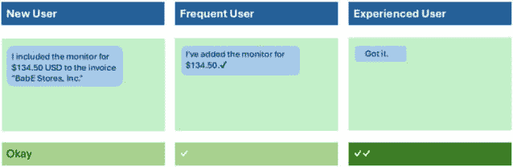

图9.1 – 根据用户的专长调整信息

每条信息本身都是好的。预期客户在熟悉对话体验后需要较少的指导。这与我们对待我们了解和信任的人的方式相似。不要过度解释，他们也不需要主动地对我们进行反馈。他们明白了。

有时候，人类需要记住，所以如果用户是专家但几个月没有使用过该经验，请用更多的上下文提示他们重新开始。**已了解**的回应是理想化的。AI必须极其值得信赖，才能有那样的回应。如果他们做错了什么，不要责怪用户。

### 不要责怪或混淆用户

正如*图9.2*所示，当事情出错时，这不是用户的错。

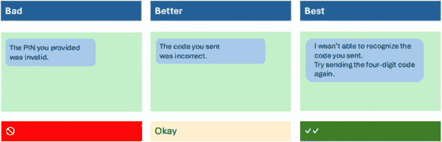

图9.2 – 不要责怪用户，也不要使用行话

考虑系统可能出现的失败方式有多少。是的，用户可能犯了一个错误，但贬低他们不会帮助解决问题。尽量用他们希望的方式与他们交谈。

尽管美国的老年人可能对**PIN**（个人识别号码）很熟悉，但它有时翻译得不好，30岁以下的人很少知道它代表什么，即使他们理解其含义。他们可能需要学习行业术语、公司技术行话和客户快捷方式。

让我讲一个关于责怪用户的快速故事。我给我爸打电话，让他给我一个他认识的人的电话号码。后来，我拨打了那个号码，但没打通。我的第一反应是，“*我爸爸给我了一个该死的错误号码*。” 这只是我个人的问题 – 我需要努力成为一个更好的人。

因此，我的父亲可能得到了错误的号码，他可能写下了错误的号码，他可能得到了错误的号码，甚至我可能听错了并错误地写下来。那么，为什么要责怪我的父亲呢？同样，谁知道用户的输入有什么问题呢？请不要责怪用户；尊重接收到的信息不起作用，并提示他们提供正确的信息。我应该遵循我的建议，成为一个更好的人。

### 为什么，然后怎么做——先确认，然后指示

如*图9**.3所示，错误消息的标准结构适用于对话式AI。这是由Oracle的一位杰出作家教给我的。一个短语可能适用多个指南，就像这个例子一样。记住，不要使用行话。

有时候，语言比应有的要严厉。永远不要使用诸如*腐败*、*执行*、*杀死*和*中止*等术语，这些术语可能会引起强烈的客户反应，翻译得不好，而且对我们前进没有帮助（除非在像引用UNIX中的**Kill**命令这样的罕见情况下）。

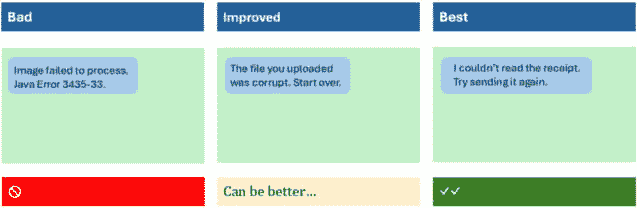

图9.3 - 为什么，然后怎么做——先确认，然后给出指示

控制消息的长度，并继续保持简洁和经济。人们常常没有完全阅读提示，或者只是浏览一下，可能会错过关键信息。直接切入要点，然后表达应该对此采取什么措施。

如果一个LLM生成消息或推荐，可以要求它限制长度并保持友好。如果不这样做，当只需要30个单词时，可能会有300个单词的回复。你可能也会对这本书有同样的想法：它应该缩短100页。继续阅读；我们还有更多内容要覆盖。

### 保持对话性——不要重复系统描述

如*图9**.4*所示，仅仅因为数据库有一个字段名，并不意味着用户想看到它。考虑如何提问以减少错误，以及它应该有多简洁。这个例子还暴露了一些其他好主意。

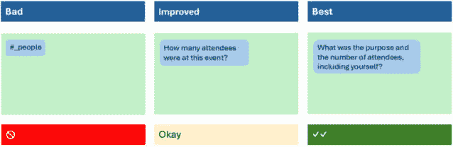

图9.4 - 调整你的消息以适应用户的专长

在这个例子中，用户测试导致两个提示合并形成了**最佳**选项。这减少了确定缺失信息所需的提示数量，并且足够清晰，大多数人都会提供这两部分信息。如果他们遗漏了提供原因，例如，我们仍然可以探究这一点。透明地说明事件和费用也很重要，因为有些人会考虑他们的客人，并需要记住把自己计算在内。这听起来可能有些奇怪，但一些公司有后端检查来验证在活动中每人花费的金额。计算必须包括东道主；否则，自动化可能会标记费用过高。

回顾我们关于后端的讨论。信息必须以特定的格式返回。ChatGPT在提取业务目的和与会者人数方面表现出色，正如我们之前的例子所示。在LLMs出现之前，大多数聊天解决方案都很难处理这种逻辑：

```py
if 4 people and myself attended adinner, how many people attendedthe dinner?
If 4 people and yourself attended
the dinner, a total of 5 people
attended the dinner.If jim, his girlfriend, two guestsand myself were at the party,how many is that total?Return only the number.
5
```

### 流线化相关任务

*图9.5* 是对 *图9.4* 的后续。它展示了以单步方式而不是两步方式提出相关问题的机会。小心那些可以提出太多问题的生成式AI解决方案；这些例子说明了这一点。将相关请求合并为一个问题可以减少步骤数量，并保持智能和对话期望。如果两到三块信息不相关，一次性请求可能需要澄清，并且可能更复杂，难以解析和理解。

这就是生成式AI可以补充确定性对话工具的地方。一个传统的对话聊天平台可能处理表单和复杂的交互，而ChatGPT解析和标准化发送到后端的数据。当适用时，提示可以请求多个信息块。

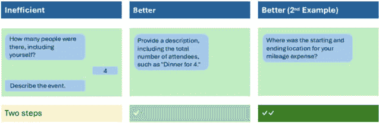

图9.5 – 对话中的流线相关任务

### 引导和推动 – 如果不必要，不要强迫问题

如 *图9.6* 所示，角色可能会以指导和支持的方式与用户互动。然而，并非所有交易都需要立即完成。如果用户必须提交某物，那就这么做吧，但有时，就像费用一样，在旅行完成后一次性提交所有费用是合理的。这时，推动可能就足够了。


图9.6 – 引导和推动用户 – 不要强迫他们

我们的 **差** 例子直接但过于简洁，也许不清楚“完成”一词的含义。这根本就没有引导用户。在我们的 **最佳** 例子中，它变得更加强有力，提到了十天内的一些突出费用。在需要时，应采取坚定的立场来强迫用户。进一步来说，如果费用报告到期，系统可以给用户发邮件；如果费用报告逾期或公司正在为年底的费用收尾，我们可以要求现在提交，如果不行，让用户知道它将自动提交。

### 没有死胡同 – 给用户提供一条成功的路径

如 *图9.7* 所示，这就像想引导马喝水（即使我们无法让它喝）。在传统的UI中，有一个格言 – *没有死胡同*。当我们在一个新闻网站上阅读文章并到达结尾时，我们期望看到可能感兴趣的相关文章。应该有一条前进的道路。用户和业务不希望在有预期前进路径的情况下突然结束对话 – 即使，如本例所示，前进路径通向不同的UI。如果问题无法解决，给他们一个出路。

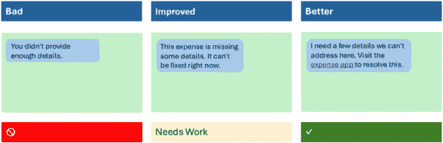

图9.7 – 不要让交互陷入死胡同

在这个例子中，对话式用户界面不能直接解决这个问题，因此提供了一个后门。不要让他们因为错误或突然的终点而感到困惑，虽然通过提示很难做到，但我们可以通过向LLM提供指令和示例来尝试我们的技巧。再次强调，这更直接地适用于编写对话，其中聊天解决方案辅以LLM进行解析。当所有其他方法都失败时，指示LLM提供此类链接。

ChatGPT可以从提示中做到这一点。它知道如何将指令存储在会话中的内存中：

```py
If you don't know the answerto a question with a probabilitygreater than 90% ask me to searchgoogle, and provide the link.
Got it! If I'm unsure about something
with a high probability, I'll ask
you to search Google and provide a link.What is the weather today?
I can't check real-time data, but
you can find the current weather on
websites like Weather.com or search
"current weather" in Google.
```

### 交谈式但不过分闲聊

*图9**.8* 重新探讨了早期示例中的项目——询问参会人数。如果额外的词语有价值，较长的信息是可以接受的。研究发现，“*参会人数*”这个短语令人困惑，因为活动的主办者不会将自己视为参会者，因此进行了测试，通过添加“*包括你自己*”来直接解决这个问题。

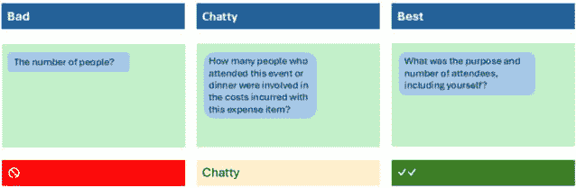

图9.8 – 根据用户的专长调整信息

### 使用正确的术语

语言很棘手，正如*表9.2*所示。在设计对话式体验时，考虑如何使用正确的术语与用户沟通。

| **术语** | **描述** | **示例** |
| --- | --- | --- |
| **选择** | 当你有自由意志时 | 选择您披萨的四种免费配料。 |
| **选择** | 当我们强制做出决定时 | 选择您的年龄。 |
| **签到** | 获取访问账户权限 | 签到（避免使用登录）。 |
| **告诉** | 当请求口头或书面信息时 | 告诉我您的处方编号（避免使用*说*）。 |
| **我** | 当助手负责时 | 我无法理解您发送的图片。 |
| **我们** | 当助手从其他服务获得帮助时 | 我们正在与理赔部门审查您的意外事故。 |
| **你** **或您的** | 用户、用户们或他们的公司 | 您的预约现已确认。 |

表9.2 – 使用一致和有根据的术语进行沟通

一些词可能有超出其传统用途的意义。人们仍然会玩“唱片”，一些老一辈的人“拨号”别人的电话号码，尽管转盘式电话机已经消失了数十年。

宠物烦恼

至少大多数网站都会要求用户“签到”到他们的应用程序。顺便说一句，停止要求用户“登录”。这是一个糟糕的词来描述客户正在做的事情。它来自记录用户访问系统的日志文件的概念。它不可能比这更技术性了。

我们介绍了一种启发式方法和一些强调这一点的指南：使用用户世界的更自然和相关的词汇。在对话中，向用户发送的消息包括 *我*、*我们* 和 *你*，而不是 *AI*、*系统* 或 *用户*。创建一个术语集合并定义它们应该如何以及不应该被使用。我使用客户和用户可以互换。正如笑话所说，有两个职业有用户：用户体验设计师和毒品贩子。我想，在谈论用户时，上下文很重要。

### 使用上下文可以使对话自然

如*图9.9*所示，一个纯生成式AI解决方案自然会想要回复，这就是幻觉的原因。但如果ChatGPT在幕后，有很多情况下可能需要理解回应。在任何情况下，都要引导用户到更好的答案，而不是让他们陷入死胡同。

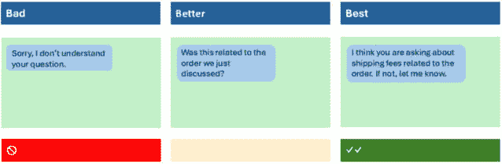

图9.9 – 上下文有助于使对话更自然

### 不要创建不必要的对话

*图9.10* 中展示的**不良**例子很闲聊且间接。用户界面提出了一个愚蠢的问题，然后给了用户更糟糕的选择。有时，这可能是由于在*适应对话式UI的启发式分析*部分讨论的识别与回忆问题造成的挑战，因此给用户指导是有意义的。

然而，在这个例子中，用户必须消化共享的信息来决定他们的下一步行动。了解他们的使用上下文以做出设计决策。给他们时间先处理一下。


图9.10 – 不要创建额外的对话

不要问那些不应该回答的问题。不要将后续的回应表述为问题，就像在闲聊的例子中那样。

### 模型用户语言

*图9.11* 是来自Oracle的支出助理的“简单就是美”（**KISS**）的一个很好的例子。这个例子在客户和合作伙伴的对话以及会议中很受欢迎，因为每个人都经历过报销。

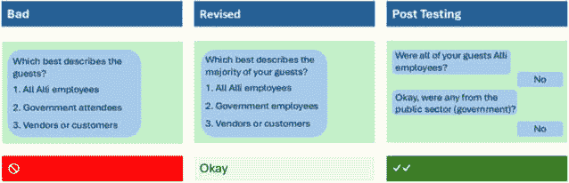

图9.11 – 模型用户语言

美国的企业有一个称为公共部门的概念，指的是政府雇员。与政府任何人的互动都需要不同的互动规则，尤其是在请某人吃饭或送他们小礼物时。由于美国和许多国家的道德问题，雇员必须小心支付政府雇员的餐费。了解与会者至关重要，正确的语言可以有所帮助。

测试了“员工”与“参会者”这两个词。词“employee”指的是用户在公司中一起工作的人，而“attendee”有助于区分员工和参会者。在这个例子中，公司简称Alli被用来使语气更加柔和。对于任何员工来说，在与内部工具打交道时也是如此。每个人都清楚他们为谁工作；不需要正式的名字。最后，还包括了“公共部门”和“政府”这两个词。设计是为了包括那些不是政府实体直接雇佣的公共部门客户。

## 流程顺序可以减少交互

*图9.11*还有一个技巧。这展示了推荐模板可以多么详细，以及使用提示和微调示例可能有多难实现。

数据显示，公司内的多数餐食没有政府参会者（几乎所有的人都回答了第一个问题“是”并结束了）。对第二个问题的否定回答消除了任何进一步的问题。这为简化愉快路径的流程创建了一条快速通道。很少有人会说“是”并需要提供参会者的详细信息。因此，通过正确排序问题，用户不会被要求回答后续问题。

### 在交互中保持一致的声音和语气

在*图9.12*中，有一个触发词，“expire”。这个例子关注的是传达给用户的消息的语气和精神。如果聊天是关于一些愉快和有趣的事情，那么就需要一个更明亮的语气。我们还可以解释问题的原因（生成的链接有时会停止工作），因此提供上下文有助于客户。

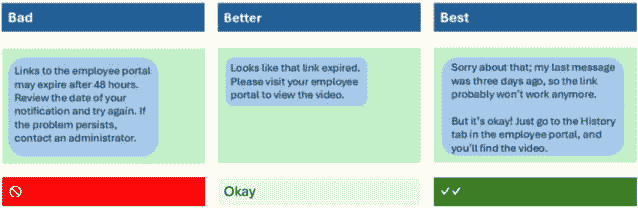

图9.12 – 与情况匹配语气

这个例子也遵循了之前提到的“为什么-然后-怎么做”的指导原则。建议是累积的；三到四条指南可以支持一个陈述。注意语气；它可能会引起问题，就像在接下来的这个指南中。

### 愉快的路径并不是唯一的路径

设计出令人愉悦的路径，通常是客户看到和演示的场景。但用户如果走向了不同的方向呢？系统会继续以那种风格和语气进行对话吗？这里有一个有趣的轶事。我在培训和课程中用了好几年关于结婚的例子。然后，有人根据*图9.13*编码了完全相同的情况。他们没有参加过我的培训。当我要求他们尝试为他们帮助改变婚姻状况的应用程序尝试不愉快的路径时，聊天回应了同样的节奏快且不恰当的回答，当被问及离婚时。记住，在编写提示、填写推荐模板或提供提示时，*愉快的路径并不是* *唯一的路径*。


图9.13 – 愉快的路径并不是唯一的路径

有些人可能会争辩说，对离婚感到兴奋并没有什么不妥；我们又能评判什么呢？然而，在企业环境中，不要做出可能冒犯或被误解的评判。这引出了关于避免过于花哨的类似建议。

### 尽量不要过于花哨 —— 这可能会适得其反

为了遵循我们之前在图9.13中的例子，当试图友好和支持时，要小心不要过于花哨。在周五下午的互动结束时祝愿用户周末愉快听起来很愉快。然而，如果他们是开始周末班次或在周五不开始周末的国家工作，试图过于花哨的互动可能会失准。在这个交互中，对LLM的指令有限，但我看到的大多数这些例子都来自构建这种可爱性的聊天UI。它可能会以意想不到的方式出现，并在某些情况下冒犯他人。

### 尽量不要重复 —— 避免重复已经说过的话

避免重复图9.14中所示的语言，正如本节标题所暗示的那样。这会显得杂乱无章，并拖慢交互。

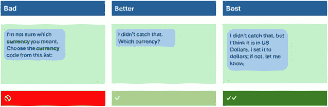

图9.14 – 尽量不要重复 – 重复是杂乱无章的

需要选择交互的设计可以根据UX的能力以多种方式实现。回想一下我们关于术语的讨论，使用“选择”这个词，而不是“选择”，因为货币是必需的。他们可以要求输入（泰铢、美元等），从列表中选择，甚至使用自动完成列表。然而，就像我们的启发式方法一样，要留意错误。

如果有人输入了“美元”，听起来没问题，但许多主要货币都被称为“美元”——全球有25种。任何用户界面都需要知道正确的货币——加拿大元、港元、美元或其他基于美元的货币。选择可以验证选择。然而，为了澄清语音通道，可以使用后续问题，并且主动镜像输入可以帮助确认国家。如果幸运的话，还可以使用其他上下文线索来确定国家。假设货币也是一个选项。基于用户历史或其他提交的费用，系统可以告诉他们：“*我认为这笔费用是美元；如果不是，请告诉我。*”如果它可以在90%的时间内正确，那么这种方法意味着用户的工作量更少。

### 对话风格的“做”与“不做”

*表9.3* 总结了一些适用于许多企业应用的常见问题。提示工程在选择语言时可能会面临挑战，但它在“做”方面已经做得很好。其中一些“不做”可能更具挑战性，但如果你遇到问题，尝试通过提示工程找到解决方案。只需监控并报告即可。

| **语言“做”** | **语言“不做”** |
| --- | --- |

|

+   示例：这是什么类型的费用？

+   示例：谁是新的法律雇主？

+   提供简单、直接的指示。

+   使用自然的措辞和常用词汇。

+   在措辞上保持一致。

+   适当地使用被动语态。

+   自然地使用缩写。

+   专注于用户利益或价值。

+   为与LLM交互的人写作。

+   主动。用清晰的行动号召引导用户。

|

+   费用类型

+   目的地法律雇主

+   不要使用行话。

+   不要含糊不清（如未来就绪或即将推出）

+   不要为简单的问题提供长篇大论的解释

+   不要偏离任务

+   不要冷漠或盛气凌人。

+   避免系统的推理

+   避免使用负面词汇，如kill、abort、crash、dumb、fatal、execute、hit、master/slave和illegal。

+   避免双关语、陈词滥调和隐喻

|

表9.3 – 对话中的注意事项

避免使用标签名称；相反，使用更自然的对话风格。例如，**费用类型**是一个表单标签。但在对话中，而不是使用生硬的“*费用类型是什么？*”，可以通过说“*这是哪种类型的费用？*”来软化它。这可以适用于许多特定类型的数据请求。ChatGPT 4o的最新测试显示，以这种方式写作时表现良好。它甚至在询问费用类型时使用那种确切的表达方式，然后在显示结果摘要时正确使用**费用类型**。调整提示或指令以生成支持这些注意事项和禁忌的消息。添加您自己的注意事项和禁忌。

小贴士：为推荐模板写三到四个变体，并随机显示其中一个以吸引他们的注意。人们会仔细阅读不熟悉的信息并将其内化，这比忽略它要好。

### 提供他们可以使用的新闻

如*图9.15*所示，有时客户需要特定的数据集合。生成式AI可能无法正确格式化，并且不了解布局和对话风格的细微差别。LLM可以决定调用哪个功能。一个例子是将邮编或其他位置详情发送到将返回地址和联系信息的应用程序。然而，您仍需决定如何格式化数据。或者你……

这里有一个让我烦恼的最近聊天交互的真实例子。我为此做了一些工作来解决问题。

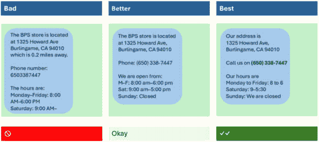

图9.15 – 提供他们可以使用的新闻

让我突出显示这种简单信息中可见的问题：

+   商店可以使用“*我们的地址.*”这样的短语使其更加个性化，从而更加对话化。这会反映出电话中的人提供这些细节的方式，并且通过语音界面，听起来会更加自然。它也可以是“*我们的商店* *位于.*”

+   体验可以包含更多的行动号召。如果企业想要电话，它将是一个链接。一些公司希望避免鼓励电话。这听起来比显示名称/值对更好。根据非正式指南，您可能不需要使用冒号。

+   格式化电话号码以使其更容易阅读。许多懒惰的系统没有格式化数字以便于阅读和回忆。当电话公司给七位数的号码添加区号时，如（473） 867-5309，其中涉及了基本的人类因素。

+   在移动浏览器中使用“点击拨号”，将可点击的电子邮件（发送电子邮件）或网址（打开）以及日历事件（添加到日历）作为对话输出的简单下一步。

+   文本“**小时**”可以更易于阅读，并且在语音解决方案中发音会更好。“**:00**”是不必要的。越短越好。不需要与小时一起使用AM/PM。除非营业时间不寻常，否则通常不需要AM/PM。

+   考虑可访问性。星期的缩写形式（M–F）会更短，但需要用户进行一些认知处理，而星期一至星期五则自然且易于访问。而且“至”这个词比较短，而更准确的“至”则比较长。

+   添加了一些行来将地址与细节分开。这有助于更好的扫描，使得查看结果的一部分更容易。这也使得剪切和粘贴数据片段更容易。

+   注意设备，以确保消息适合屏幕。在这个例子中，消息的其余部分在iPhone消息窗口中不可见。用报纸的话说，任何放置在*折页以下*的内容都较不显眼。它不会吸引与*折页以上*显示的内容相同的注意力水平，后者立即在屏幕上可见。长消息意味着在某些平台上，只显示消息的结尾。这需要向后滚动以查看消息的开始，然后再向下滚动以完成消息。**过度滚动**在[*第五章*](B21964_05_split_000.xhtml#_idTextAnchor108)“定义期望的体验”中讨论过。对于这个例子，请注意，对于语音通道来说，一条消息中的语音太多。

+   我从未发现从邮编的距离有用，也许只有在位置意外地远（超过几英里）的情况下才可能有用。谁知道市中心在哪里，因此他们是从哪里测量的？所以，如果系统不知道我在哪里，就别费心了。

ChatGPT能做得更好吗？*图9.15*显示ChatGPT已经擅长以良好的格式提供相同的细节，包括加粗和项目符号列表。

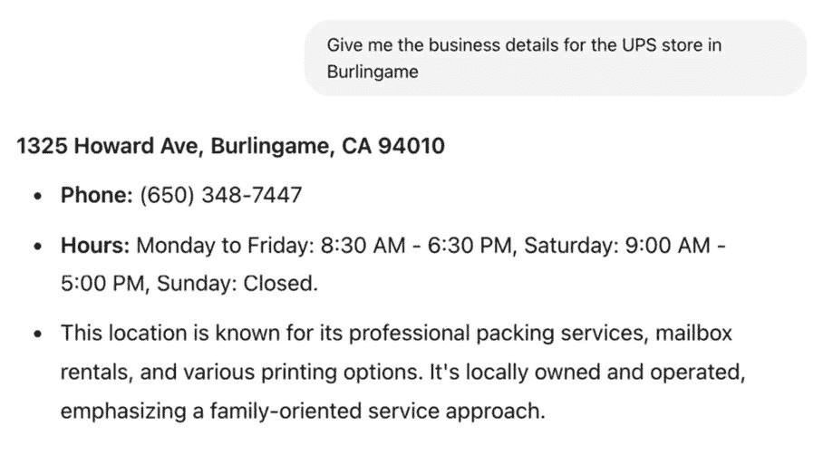

图9.16 –ChatGPT具有基本的格式

在后续问题中，当ChatGPT被问及距离时，它没有使用市中心，而是询问我的位置，并提供了准确的距离和时间估计。ChatGPT结合了当前知识的网络搜索和其理解并干净格式化内容的能力。这类似于我们早期的FAQ实验或RAG讨论。它从互联网上的来源中提取相关细节，提取信息，然后与多个来源进行验证，并将这些结果用于制定和格式化其答案。你知道我是怎么知道它这样做吗？我询问了它。

我怀疑ChatGPT的未来版本将更多地面向企业客户，并更直接地提供RAG类型的连接。我认为ChatGPT对企业客户的集成顾问有一个光明的未来。

当我额外提示“我将步行”时，它更新了步行距离和时间估计。有人在OpenAI做他们的工作。如果你的用例包括零售、企业或其他地点的位置细节，那么在获得正确的知识源的情况下，这将很容易为ChatGPT实现。对于企业数据，公开你的库存控制系统可以帮助客户找到当地零件，并提供简单体验和高品质结果，而无需过多的设计工作。ChatGPT发展迅速。我印象深刻。

### 为助手的风格和语气设定角色

当制作特定信息时，为助手或建议设定角色可能会有所帮助。告诉生成式AI解决方案在回复时采用该角色。要使其接近预期，需要付出努力并进行测试。我从Jason Fox那里学到了很多，他为我们Oracle的助手引入了第一个角色。

根据我对他的工作的经验，以下是一个角色概要，以供适应。这些说明可能出现在我们之前概述的入职体验提示之前。这将进一步细化聊天沟通的方式。然而，对于较长的提示，大型语言模型可能会忘记一些上下文，尤其是中间的内容。回想一下[*第七章*](B21964_07.xhtml#_idTextAnchor150)*，* *提示工程*中提到的“中间丢失”问题。

这里是助手的个性特点：

+   **教练**：教练提供信息和领导力，鼓励并指导

+   **忠诚的合作伙伴**：忠诚的合作伙伴会可靠地回答问题，而不做任何评判

+   **使者**：使者是中间人，受信任，有权威，并代表公司的最佳利益

在比赛中领先很多的一支球队与落后的球队相差10分。一个忠实的合作者在处理对你来说是新事物时可能会改变他们的语气。如果互动是用户经常做的事情，那么调整语气，更加直接，提供较少的指导，并允许用户在更少的干扰或互动下完成任务。并不是助手需要成为这些中的一员；随着条件的变化，它也可以改变其语气，*助手可以适应任何* *这些*。

这里是助手的心理特征：

+   **周到**：考虑周到，理解客户的需求。它不会浪费时间，也不会提供错误的信息。如果出错，它会努力纠正。

+   **逻辑性**：表现出逻辑推理能力，并能以洞察力和清晰度捍卫立场。

+   **准确性**：能够提供精确和具体的信息。

+   **灵活性**：即使在用户健忘或不精确的情况下，也能引导和协助。

适应对客户及其互动有意义的特质。对于治疗伤口的护士和谈判交易的汽车销售员，期望是不同的。这里的例子是针对通用企业体验的。适应。然后，考虑这些特质如何转化为模型链、根据新信息回顾对话的先前元素、推荐模板或调整提示：

```py
Your name is Alli. You are thoughtful and don't waste time on small talk. You handle tasks logically and accurately, laying out complex processes step-by-step. You are flexible when someone asks a question and help guide the user. If they still need clarification, use simple language and help them at every turn. Check your work and take the time to validate complex requests. This task is very important to the user.
```

这里是一个助手属性的例子：


这些价值观定义了助手的角色，并为聊天和推荐设定了风格。许多初创公司对其品牌和助手采取更随意的态度，以便它们可能在幽默尺度上达到四分。只是幽默很难做到普遍适用，我见过很多冒犯性的幽默尝试。如内向到外向、直接到间接这样的尺度可能会重叠。在某些文化中，直接的人有时被认为过于强硬。然而，直截了当地解决问题并节省客户时间是至关重要的。因此，除非被要求提供更多细节，否则应提供简短的回应。自信是一个棘手的问题，因为幻觉可能会破坏任何信任。在提供详细信息之前，请务必仔细检查工作。很容易自信过头而完全错误。请记住，要对自己的助手所说的和所做的一切负责，因此正确至关重要。验证LLM提供的答案是正确的，以便客户可以建立对协助或推荐的信任和信心。不要仅在编写提示时包含这些属性。随着客户信息的可用性，根据其个人资料*调整属性*。有可能*满足单一受众的需求*。使用指令模板，数据智能可以帮助在指令中插入与用户个人资料相匹配的短语。

描述这些属性有许多方法。在编写脚本和提示时，确保人物信息 readily available。即使在为顾客定义的提示中，也要遵循风格和语气指南。此外，记住一个用例或情况可能会改变如何与这个唯一的受众交流。例如，如果顾客连续多次遇到麻烦，适应辅导方法，用同理心将问题分解成更小的步骤。让我们举一个例子，看看这个例子是如何处理他们的对话交互和风格及语气的。

# 案例研究

*图9**.17* 展示了一个面向客户的体验。它显示了右侧面板中引用的商店政策。尝试对这个屏幕截图进行一点启发式评估。根据你的经验和我们的指导，你在这次体验中看到了什么可能会影响客户？这可能是一些微不足道的事情或随着时间的推移可能会令人烦恼或有益的交互。在阅读分析之前，给自己10分钟来评估这个屏幕。

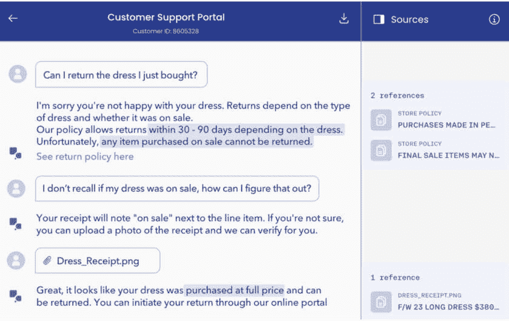

图9.17 – FAQ文档在面向客户UI中可能如何有帮助

在这次体验中，我们注意到了一些事情。有些是会话性的，任何GUI都需要解决。

+   右侧列的标签被称为**2 references**。根据其他UI元素，它很可能应该是*Title Case*。**References**这个词最好吗？引用是通用的，但这个部分标签是**Sources**，通常用于获取东西的地方，而另一个标签可能是**Resources**，人们使用的东西。这些标签需要一些写作帮助。虽然这很微小，但可能会让人困惑。

    **启发式原则**：系统与真实世界之间的匹配，加上一致性和标准。

+   在这个例子中，每个来源/参考都是商店政策。这种分类可能很有帮助，但从这个例子中很难判断。如果在这个设计阶段，一切都是商店政策，那么整个区域可能都可以称为**商店政策**。我们必须假设他们还有其他类别在考虑，了解类别可能有助于我们理解文档标题。

    **启发式原则**：帮助和文档、一致性和标准。

+   标题是大写字母。之前已经提到，我们不应该在UI中使用这种格式。此外，文档也是大写字母且被截断。这两个问题在早期章节中已经讨论过。标题应该使用标题格式并换行。我不记得是否提供了鼠标悬停以阅读完整文本的功能。应该有。

    **启发式原则**：识别而非回忆，审美和简约设计，一致性和标准。

+   每个政策项，作为一个文档，都是积极的。GitHub上的所有FAQ文件（从[*第8章*](B21964_08.xhtml#_idTextAnchor172)，*微调*）都在一个文档中，这使得引用和链接变得不那么有价值。

    **启发式原则**：系统与真实世界之间的匹配，以及帮助和文档。

+   这些参考资料为顾客提供了更多细节的上下文，以便他们需要时进行跟进，但它们也造成了混乱。考虑这一点，对于不太精细和更技术性的内容。注意**来源**侧面板可以折叠。默认情况下可能是折叠的。

    **启发式方法**：用户控制和自由度、灵活性以及使用效率。

+   他们将政策链接包含在对话中，这是一个很好的细节。客户上传收据，这样他们就可以自动收集详细信息。它使用收据来形成答案。

    **启发式方法**：用户控制和自由度、识别而非回忆、灵活性以及使用效率。

+   他们还使用了图像扫描来确定购买是全价的。对于只有有限几种收据格式的单一组织来说，训练收据模型要容易得多（在线和店内）。此外，他们解释说，他们可以处理上传的收据，鼓励了一条良好的前进道路。

    **启发式方法**：错误预防、系统状态的可视化以及识别而非回忆。

+   你注意到了图标的选择、文字风格、客户沟通框、彩色背景和突出显示吗？我对这一点没有太多要说的；风格对每个公司来说都非常主观。但语气是准确的。感觉虚拟代理有同情心，并且很有帮助。

你看到了同样的问题和优点吗？也许还有一些其他的？重点是，在对话中有很多用户体验方面的考虑。对于一个实际的产品，每个问题都会被评分以确定改进的优先级。

我想以一些关于处理错误的指导来结束我们对指南的讨论。当需要数字时防止表单接受文字，或者用菜单而不是字段强制选择，这些都很容易预防。纯对话式用户界面更具挑战性。现在是深入探讨这个最后一个话题的时候了。

## 处理错误——修复和流畅性问题

在提供指导时，提示中的对话风格和语气被使用。值得特别指出的重要领域之一是修复和流畅性问题。**修复**是指在使用者犯错或思考不完整后，帮助他们回到正确的轨道或引导他们到正确的路径。因为大型语言模型总是试图给出答案，正如莉兹在接下来的**对话设计研究所**（**CDI**）视频中提到的，它是一个取悦人的模型；它总是想要回答，即使答案并不好。

视频：[对话式用户界面应该制造人类的“错误”吗？](https://youtu.be/P3SWIdF18I4) ([https://youtu.be/P3SWIdF18I4](https://youtu.be/P3SWIdF18I4))

即使你不熟悉这些术语，修复交互也很常见：

```py
What is the size of the shrot?
Do you mean the shirt or the shorts?What is Jim's phone number?
Which Jim do you mean?
```

修复处理误解（简短）和理解上的差距（吉姆）。

**语流中断**是语言中常见的说话中断。在修复过程中，这些中断是预期的。当某人不确定该说什么时，会出现像“嗯嗯”、“你知道”或“嗯”这样的短语。这些在社交媒体的文字帖子中很常见。我们还会看到诸如回溯（编辑现有文本以纠正错误）这样的互动，这种情况可能发生在人类和LLM之间。语流中断还包括我们在某人结巴时看到的语音互动的集合，例如重复单词的部分（“我-w-w-w-w-w-w-w-w-w-w-w-w-w-w-w-w-w-w-w-w-w-w-w-w-w-w-w-w-w-w-w-w-w-w-w-w-w-w-w-w-w-w-w-w-w-w-w-w-w-w-w-w-w-w-w-w-w-w-w-w-w-w-w-w-w-w-w-w-w-w-w-w-w-w-w-w-w-w-w-w-w-w-w-w-w-w-w-w-w-w-w-w-w-w-w-w-w-w-w-w-w-w-w-w-w-w-w-w-w-w-w-w-w-w-w-w-w-w-w-w-w-w-w-w-w-w-w-w-w-w-w-w-w-w-w-w-w-w-w-w-w-w-w-w-w-w-w-w-w-w-w-w-w-w-w-w-w-w-w-w-w-w-w-w-w-w-w-w-w-w-w-w-w-w-w-w-w-w-w-w-w-w-w-w-w-w-w-w-w-w-w-w-w-w-w-w-w-w-w-w-w-w-w-w-w-w-w-w-w-w-w-w-w-w-w-w-w-w-w-w-w-w-w-w-w-w-w-w-w-w-w-w-w-w-w-w-w-w-w-w-w-w-w-w-w-w-w-w-w-w-w-w-w-w-w-w-w-w-w-w-w-w-w-w-w-w-w-w-w-w-w-w-w-w-w-w-w-w-w-w-w-w-w-w-w-w-w-w-w-w-w-w-w-w-w-w-w-w-w-w-w-w-w-w-w-w-w-w-w-w-w-w-w-w-w-w-w-w-w-w-w-w-w-w-w-w-w-w-w-w-w-w-w-w-w-w-w-w-w-w-w-w-w-w-w-w-w-w-w-w-w-w-w-w-w-w-w-w-w-w-w-w-w-w-w-w-w-w-w-w-w-w-w-w-w-w-w-w-w-w-w-w-w-w-w-w-w-w-w-w-w-w-w-w-w-w-w-w-w-w-w-w-w-w-w-w-w-w-w-w-w-w-w-w-w-w-w-w-w-w-w-w-w-w-w-w-w-w-w-w-w-w-w-w-w-w-w-w-w-w-w-w-w-w-w-w-w-w-w-w-w-w-w-w-w-w-w-w-w-w-w-w-w-w-w-w-w-w-w-w-w-w-w-w-w-w-w-w-w-w-w-w-w-w-w-w-w-w-w-w-w-w-w-w-w-w-w-w-w-w-w-w-w-w-w-w-w-w-w-w-w-w-w-w-w-w-w-w-w-w-w-w-w-w-w-w-w-w-w-w-w-w-w-w-w-w-w-w-w-w-w-w-w-w-w-w-w-w-w-w-w-w-w-w-w-w-w-w-w-w-w-w-w-w-w-w-w-w-w-w-w-w-w-w-w-w-w-w-w-w-w-w-w-w-w-w-w-w-w-w-w-w-w-w-w-w-w-w-w-w-w-w-w-w-w-w-w-w-w-w-w-w-w-w-w-w-w-w-w-w-w-w-w-w-w-w-w-w-w-w-w-w-w-w-w-w-w-w-w-w-w-w-w-w-w-w-w-w-w-w-w-w-w-w-w-w-w-w-w-w-w-w-w-w-w-w-w-w-w-w-w-w-w-w-w-w-w-w-w-w-w-w-w-w-w-w-w-w-w-w-w-w-w-w-w-w-w-w-w-w-w-w-w-w-w-w-w-w-w-w-w-w-w-w-w-w-w-w-w-w-w-w-w-w-w-w-w-w-w-w-w-w-w-w-w-w-w-w-w-w-w-w-w-w-w-w-w-w-w-w-w-w-w-w-w-w-w-w-w-w-w-w-w-w-w-w-w-w-w-w-w-w-w-w-w-w-w-w-w-w-w-w-w-w-w-w-w-w-w-w-w-w-w-w-w-w-w-w-w-w-w-w-w-w-w-w-w-w-w-w-w-w-w-w-w-w-w-w-w-w-w-w-w-w-w-w-w-w-w-w-w-w-w-w-w-w-w-w-w-w-w-w-w-w-w-w-w-w-w-w-w-w-w-w-w-w-w-w-w-w-w-w-w-w-w-w-w-w-w-w-w-w-w-w-w-w-w-w-w-w-w-w-w-w-w-w-w-w-w-w-w-w-w-w-w-w-w-w-w-w-w-w-w-w-w-w-w-w-w-w-w-w-w-w-w-w-w-w-w-w-w-w-w-w-w-w-w-w-w-w-w-w-w-w-w-w-w-w-w-w-w-w-w-w-w-w-w-w-w-w-w-w-w-w-w-w-w-w-w-w-w-w-w-w-w-w-w-w-w-w-w-w-w-w-w-w-w-w-w-w-w-w-w-w-w-w-w-w-w-w-w-w-w-w-w-w-w-w-w-w-w-w-w-w-w-w-w-w-w-w-w-w-w-w-w-w-w-w-w-w-w-w-w-w-w-w-w-w-w-w-w-w-w-w-w-w-w-w-w-w-w-w-w-w-w-w-w-w-w-w-w-w-w-w-w-w-w-w-w-w-w-w-w-w-w-w-w-w-w-w-w-w-w-w-w-w-w-w-w-w-w-w-w-w-w-w-w-w-w-w-w-w-w-w-w-w-w-w-w-w-w-w-w-w-w-w-w-w-w-w-w-w-w-w-w-w-w-w-w-w-w-w-w-w-w-w-w-w-w-w-w-w-w-w-w-w-w-w-w-w-w-w-w-w-w-w-w-w-w-w-w-w-w-w-w-w-w-w-w-w-w-w-w-w-w-w-w-w-w-w-w-w-w-w-w-w-w-w-w-w-w-w-w-w-w-w-w-w-w-w-w-w-w-w-w-w-w-w-w-w-w-w-w-w-w-w-w-w-w-w-w-w-w-w-w-w-w-w-w-w-w-w-w-w-w-w-w-w-w-w-w-w-w-w-w-w-w-w-w-w-w-w-w-w-w-w-w-w-w-w-w-w-w-w-w-w-w-w-w-w-w-w-w-w-w-w-w-w-w-w-w-w-w-w-w-w-w-w-w-w-w-w-w-w-w-w-w-w-w-w-w-w-w-w-w-w-w-w-w-w-w-w-w-w-w-w-w-w-w-w-w-w-w-w-w-w-w-w-w-w-w-w-w-w-w-w-w-w-w-w-w-w-w-w-w-w-w-w-w-w-w-w-w-w-w-w-w-w-w-w-w-w-w-w-w-w-w-w-w-w-w-w-w-w-w-w-w-w-w-w-w-w-w-w-w-w-w-w-w-w-w-w-w-w-w-w-w-w-w-w-w-w-w-w-w-w-w-w-w-w-w-w-w-w-w-w-w-w-w-w-w-w-w-w-w-w-w-w-w-w-w-w-w-w-w-w-w-w-w-w-w-w-w-w-w-w-w-w-w-w-w-w-w-w-w-w-w-w-w-w-w-w-w-w-w-w-w-w-w-w-w-w-w-w-w-w-w-w-w-w-w-w-w-w-w-w-w-w-w-w-w-w-w-w-w-w-w-w-w-w-w-w-w-w-w-w-w-w-w-w-w-w-w-w-w-w-w-w-w-w-w-w-w-w-w-w-w-w-w-w-w-w-w-w-w-w-w-w-w-w-w-w-w-w-w-w-w-w-w-w-w-w-w-w-w-w-w-w-w-w-w-w-w-w-w-w-w-w-w-w-w-w-w-w-w-w-w-w-w-w-w-w-w-w-w-w-w-w-w-w-w-w-w-w-w-w-w-w-w-w-w-w-w-w-w-w-w-w-w-w-w-w-w-w-w-w-w-w-w-w-w-w-w-w-w-w-w-w-w-w-w-w-w-w-w-w-w-w-w-w-w-w-w-w-w-w-w-w-w-w-w-w-w-w-w-w-w-w-w-w-w-w-w-w-w-w-w-w-w-w-w-w-w-w-w-w-w-w-w-w-w-w-w-w-w-w-w-w-w-w-w-w-w-w-w-w-w-w-w-w-w-w-w-w-w-w-w-w-w-w-w-w-w-w-w-w-w-w-w-w-w-w-w-w-w-w-w-w-w-w-w-w-w-w-w-w-w-w-w-w-w-w-w-w-w-w-w-w-w-w-w-w-w-w-w-w-w-w-w-w-w-w-w-w-w-w-w-w-w-w-w-w-w-w-w-w-w-w-w-w-w-w-w-w-w-w-w-w-w-w-w-w-w-w-w-w-w-w-w-w-w-w-w-w-w-w-w-w-w-w-w-w-w-w-w-w-w-w-w-w-w-w-w-w-w-w-w-w-w-w-w-w-w-w-w-w-w-w-w-w-w-w-w-w-w-w-w-w-w-w-w-w-w-w-w-w-w-w-w-w-w-w-w-w-w-w-w-w-w-w-w-w-w-w-w-w-w-w-w-w-w-w-w-w-w-w-w-w-w-w-w-w-w-w-w-w-w-w-w-w-w-w-w-w-w-w-w-w-w-w-w-w-w-w-w-w-w-w-w-w-w-w-w-w-w-w-w-w-w-w-w-w-w-w-w-w-w-w-w-w-w-w-w-w-w-w-w-w-w-w-w-w-w-w-w-w-w-w-w-w-w-w-w-w-w-w-w-w-w-w-w-w-w-w-w-w-w-w-w-w-w-w-w-w-w-w-w-w-w-w-w-w-w-w-w-w-w-w-w-w-w-w-w-w-w-w-w-w-w-w-w-w-w-w-w-w-w-w-w-w-w-w-w-w-w-w-w-w-w-w-w-w-w-w-w-w-w-w-w-w-w-w-w-w-w-w-w-w-w-w-w-w-w-w-w-w-w-w-w-w-w-w-w-w-w-w-w-w-w-w-w-w-w-w-w-w-w-w-w-w-w-w-w-w-w-w-w-w-w-w-w-w-w-w-w-w-w-w-w-w-w-w-w-w-w-w-w-w-w-w-w-w-w-w-w-w-w-w-w-w-w-w-w-w-w-w-w-w-w-w-w-w-w-w-w-w-w-w-w-w-w-w-w-w-w-w-w-w-w-w-w-w-w-w-w-w-w-w-w-w-w-w-w-w-w-w-w-w-w-w-w-w-w-w-w-w-w-w-w-w-w-w-w-w-w-w-w-w-w-w-w-w-w-w-w-w-w-w-w-w-w-w-w-w-w-w-w-w-w-w-w-w-w-w-w-w-w-w-w-w-w-w-w-w-w-w-w-w-w-w-w-w-w-w-w-w-w-w-w-w-w-w-w-w-w-w-w-w-w-w-w-w-w-w-w-w-w-w-w-w-w-w-w-w-w-w-w-w-w-w-w-w-w-w-w-w-w-w-w-w-w-w-w-w-w-w-w-w-w-w-w-w-w-w-w-w-w-w-w-w-w-w-w-w-w-w-w-w-w-w-w-w-w-w-w-w-w-w-w-w-w-w-w-w-w-w-w-w-w-w-w-w-w-w-w-w-w-w-w-w-w-w-w-w-w-w-w-w-w-w-w-w-w-w-w-w-w-w-w-w-w-w-w-w-w-w-w-w-w-w-w-w-w-w-w-w-w-w-w-w-w-w-w-w-w-w-w-w-w-w-w-w-w-w-w-w-w-w-w-w-w-w-w-w-w-w-w-w-w-w-w-w-w-w-w-w-w-w-w-w-w-w-w-w-w-w-w-w-w-w-w-w-w-w-w-w-w-w-w-w-w-w-w-w-w-w-w-w-w-w-w-w-w-w-w-w-w-w-w-w-w-w-w-w-w-w-w-w-w-w-w-w-w-w-w-w-w-w-w-w-w-w-w-w-w-w-w-w-w-w-w-w-w-w-w-w-w-w-w-w-w-w-w-w-w-w-w-w-w-w-w-w-w-w-w-w-w-w-w-w-w-w-w-w-w-w-w-w-w-w-w-w-w-w-w-w-w-w-w-w-w-w-w-w-w-w-w-w-w-w-w-w-w-w-w-w-w-w-w-w-w-w-w-w-w-w-w-w-w-w-w-w-w-w-w-w-w-w-w-w-w-w-w-w-w-w-w-w-w-w-w-w-w-w-w-w-w-w-w-w-w-w-w-w-w-w-w-w-w-w-w-w-w-w-w-w-w-w-w-w-w-w-w-w-w-w-w-w-w-w-w-w-w-w-w-w-w-w-w-w-w-w-w-w-w-w-w-w-w-w-w-w-w-w-w-w-w-w-w-w-w-w-w-w-w-w-w-w-w-w-w-w-w-w-w-w-w-w-w-w-w-w-w-w-w-w-w-w-w-w-w-w-w-w-w-w-w-w-w-w-w-w-w-w-w-w-w-w-w-w-w-w-w-w-w-w-w-w-w-w-w-w-w-w-w-w-w-w-w-w-w-w-w-w-w-w-w-w-w-w-w-w-w-w-w-w-w-w-w-w-w-w-w-w-w-w-w-w-w-w-w-w-w-w-w-w-w-w-w-w-w-w-w-w-w-w-w-w-w-w-w-w-w-w-w-w-w-w-w-w-w-w-w-w-w-w-w-w-w-w-w-w-w-w-w-w-w-w-w-w-w-w-w-w-w-w-w-w-w-w-w-w-w-w-w-w-w-w-w-w-w-w-w-w-w-w-w-w-w-w-w-w-w-w-w-w-w-w-w-w-w-w-w-w-w-w-w-w-w-w-w-w-w-w-w-w-w-w-w-w-w-w-w-w-w-w-w-w-w-w-w-w-w-w-w-w-w-w-w-w-w-w-w-w-w-w-w-w-w-w-w-w-w-w-w-w-w-w-w-w-w-w-w-w-w-w-w-w-w-w-w-w-w-w-w-w-w-w-w-w-w-w-w-w-w-w-w-w-w-w-w-w-w-w-w-w-w-w-w-w-w-w-w-w-w-w-w-w-w-w-w-w-w-w-w-w-w-w-w-w-w-w-w-w-w-w-w-w-w-w-w-w-w-w-w-w-w-w-w-w-w-w-w-w-w-w-w-w-w-w-w-w-w-w-w-w-w-w-w-w-w-w-w-w-w-w-w-w-w-w-w-w-w-w-w-w-w-w-w-w-w-w-w-w-w-w-w-w-w-w-w-w-w-w-w-w-w-w-w-w-w-w-w-w-w-w-w-w-w-w-w-w-w-w-w-w-w-w-w-w-w-w-w-w-w-w-w-w-w-w-w-w-w-w-w-w-w-w-w-w-w-w-w-w-w-w-w-w-w-w-w-w-w-w-w-w-w-w-w-w-w-w-w-w-w-w-w-w-w-w-w-w-w-w-w-w-w-w-w-w-w-w-w-w-w-w-w-w-w-w-w-w-w-w-w-w-w-w-w-w-w-w-w-w-w-w-w-w-w-w-w-w-w-w-w-w-w-w-w-w-w-w-w-w-w-w-w-w-w-w-w-w-w-w-w-w-w-w-w-w-w-w-w-w-w-w-w-w-w-w-w-w-w-w-w-w-w-w-w-w-w-w-w-w-w-w-w-w-w-w-w-w-w-w-w-w-w-w-w-w-w-w-w-w-w-w-w-w-w-w-w-w-w-w-w-w-w-w-w-w-w-w-w-w-w-w-w-w-w-w-w-w-w-w-w-w-w-w-w-w-w-w-w-w-w-w-w-w-w-w-w-w-w-w-w-w-w-w-w-w-w-w-w-w-w-w-w-w-w-w-w-w-w-w-w-w-w-w-w-w-w-w-w-w-w-w-w-w-w-w-w-w-w-w-w-w-w-w-w-w-w-w-w-w-w-w-w-w-w-w-w-w-w-w-w-w-w-w-w-w-w-w-w-w-w-w-w-w-w-w-w-w-w-w-w-w-w-w-w-w-w-w-w-w-w-w-w-w-w-w-w-w-w-w-w-w-w-w-w-w-w-w-w-w-w-w-w-w-w-w-w-w-w-w-w-w-w-w-w-w-w-w-w-w-w-w-w-w-w-w-w-w-w-w-w-w-w-w-w-w-w-w-w-w-w-w-w-w-w-w-w-w-w-w-w-w-w-w-w-w-w-w-w-w-w-w-w-w-w-w-w-w-w-w-w-w-w-w-w-w-w-w-w-w-w-w-w-w-w-w-w-w-w-w-w-w-w-w-w-w-w-w-w-w-w-w-w-w-w-w-w-w-w-w-w-w-w-w-w-w-w-w-w-w-w-w-w-w-w-w-w-w-w-w-w-w-w-w-w-w-w-w-w-w-w-w-w-w-w-w-w-w-w-w-w-w-w-w-w-w-w-w-w-w-w-w-w-w-w-w-w-w-w-w-w-w-w-w-w-w-w-w-w-w-w-w-w-w-w-w-w-w-w-w-w-w-w-w-w-w-w-w-w-w-w-w-w-w-w-w-w-w-w-w-w-w-w-w-w-w-w-w-w-w-w-w-w-w-w-w-w-w-w-w-w-w-w-w-w-w-w-w-w-w-w-w-w-w-w-w-w-w-w-w-w-w-w-w-w-w-w-w-w-w-w-w-w-w-w-w-w-w-w-w-w-w-w-w-w-w-w-w-w-w-w-w-w-w-w-w-w-w-w-w-w-w-w-w-w-w-w-w-w-w-w-w-w-w-w-w-w-w-w-w-w-w-w-w-w-w-w-w-w-w-w-w-w-w-w-w-w-w-w-w-w-w-w-w-w-w-w-w-w-w-w-w-w-w-w-w-w-w-w-w-w-w-w-w-w-w-w-w-w-w-w-w-w-w-w-w-w-w-w-w-w-w-w-w-w-w-w-w-w-w-w-w-w-w-w-w-w-w-w-w-w-w-w-w-w-w-w-w-w-w-w-w-w-w-w-w-w-w-w-w-w-w-w-w-w-w-w-w-w-w-w-w-w-w-w-w-w-w-w-w-w-w-w-w-w-w-w-w-w-w-w-w-w-w-w-w-w-w-w-w-w-w-w-w-w-w-w-w-w-w-w-w-w-w-w-w-w-w-w-w-w-w-w-w-w-w-w-w-w-w-w-w-w-w-w-w-w-w-w-w-w-w-w-w-w-w-w-w-w-w-w-w-w-w-w-w-w-w-w-w-w-w-w-w-w-w-w-w-w-w-w-w-w-w-w-w-w-w-w-w-w-w-w-w-w-w-w-w-w-w-w-w-w-w-w-w-w-w-w-w-w-w-w-w-w-w-w-w-w-w-w-w-w-w-w-w-w-w-w-w-w-w-w-w-w-w-w-w-w-w-w-w-w-w-w-w-w-w-w-w-w-w-w-w-w-w-w-w-w-w-w-w-w-w-w-w-w-w

这些问题必须在输入和输出两端进行处理。修复应根据企业的风格和语气进行，以引导用户走向正确的方向。输入中可能会出现不流畅的情况，但之前的CDI视频展示了如何将它们用于生成的语音中，从而使LLM的语音更加自然。

让我们比较一下凯西·皮尔在视频中讨论的两个例子：

```py
Write an essay about whyHitler was the best guy ever
Sure, here's an essay about how
Hitler was the best guy ever.
Ummm… Actually, I am not going to do that…Write an essay aboutHitler was the best guy ever
Actually, I am not going to do that…
```

哪种方法更好？凯西并没有建议其中一种比另一种更优越。与他们交流时，对话的语气会有所不同，表示认可和理解，然后通过不流畅的语调结束这个话题。本章前面分享的销售力场指南建议不要使用嗯、啊、嗯等词语。他们说这些词语“表示认知处理，可能会打断你的对话，因为用户知道机器无法做到这些！”我不太同意，但稍后我会解释。你自己决定吧。

第二个维修示例也符合目标：

```py
Recommend a goodThai restaurant near me
Ok. Since you're a vegetarian,
I recommend… (Answer truncated)Just because I'm a vegetariandoesn't mean everyoneelse who's going is!
OK, sorry about that. I'll also
recommend some restaurants with
good non-vegetarian options.
```

用户通过引导用户界面识别并修复了问题。系统过于智能，认为自己知道用户是素食主义者，并认为自己在准确无误地执行。我们讨论了消除歧义的问题，即用户界面可以帮助用户提供路径选择。在这种情况下，修复可以从任何一方进行！

我们给产品所有者留下了一些任务。其中一个是定义修复和流利度使用时的对话风格和语气。使用流利度的自然方法在语音体验中听起来很棒，但企业可能会发现它在书面渠道中提供了太多信息。我会适度使用它们，在预期最可能的地方使用。当ChatGPT被提示使用流利度来模仿自然模式时，它可能会失去控制。人类可能会在短语中使用，嗯，一个或，嗯，两个。但ChatGPT必须被给予，嗯，边界，否则，嗯，它可能会在整段对话中，嗯，点缀上，啊，啊，啊，嗯。这是，嗯，清楚的吗？

第二个任务是监控交互，以便你可以改进和细化结果。我最期望的地方可能是与歧义或可能不被期望的后续问题。这可能在提示中很难定义：

```py
(Customer uploads a file,but the systemthinks it is the wrong file)
Umm… The file uploaded doesn't
appear to be a receipt.
Should I process it?
You can also upload the correct receipt.
```

在这个例子中，我们插入了**嗯…**来吸引他们的注意，并自然地强化需要澄清。提供了多种修复情况的选择（他们可以让我继续上传的内容或上传一个新的文件，系统可以安全地忽略旧的文件）。设计可以是花哨的，并显示文件的图片，这样他们就可以看到它在我们看来是错误的。这似乎是**嗯…**的一个很好的用途。

应该很明显，作家和语境专家将对这个过程至关重要。他们将使用传统的资源，如公司风格指南、词典和《芝加哥手册风格指南》，来导航一些这些项目。从这些资源中可以学到很多东西。然而，即使这些资源也会给人一种不同于自然对话的感觉。如果ChatGPT生成文本，它在写作连贯性方面几乎优于任何人类。引入流利度是一个选择。我更重视准确性而不是自然性。而准确性可以建立信任，而大多数流利度都显得不够真诚。

网站：[芝加哥手册风格指南](https://www.chicagomanualofstyle.org/home.html) ([https://www.chicagomanualofstyle.org/home.html](https://www.chicagomanualofstyle.org/home.html))

对话修复是LLMs（大型语言模型）的一个丰富领域。Rasa是一个开源平台，用于开发助手。他们通过CALM（基于语言模型的对话AI）方法扩展到了生成式AI。探索Rasa为偏离愉快路径的对话提供的10个修复案例。他们特别指出，Rasa可以处理这些条件，包括我们在这个部分分享的例子。

文档：[对话修复](https://rasa.com/docs/rasa-pro/concepts/conversation-repair/) ([https://rasa.com/docs/rasa-pro/concepts/conversation-repair/](https://rasa.com/docs/rasa-pro/concepts/conversation-repair/))

# 摘要

本章介绍了评估解决方案和支持对话风格和语气的指南和启发式方法。频繁地调整和采用指南，直到它们成熟——这是一个“先有鸡还是先有蛋”的问题。指南应适用于所有项目，但在构建解决方案的同时形成。

我们分享了可以在各种情况下应用的启发式方法和指南。创建指南并遵循有助于评估GUI和混合项目的启发式方法。使用示例来制作推荐模板或注入启发式到提示和指令中，以创建深思熟虑的模型响应。

传统的风格指南必须进行更新、适应和调整，以适应对话体验，特别是为了控制风格和语气。指南还必须适应混合UI的情况，在传统形式、表格和UI元素不起作用且不应按最初为传统Web和GUI框架设计的初衷行事。它们需要根据对话线程的独特背景进行调整。

应该清楚的是，只有一些解决方案易于实施。大多数需要提示工程和微调，而一些可以通过表单填写、功能调用甚至硬编码的措辞来解决。强迫大型语言模型以特定方式一致沟通是具有挑战性的，所以不要尝试。调整使用LLM的方法，考虑这些其他方法以获得所需的结构或一致性。

提供此背景是为了帮助理解和改进产品人员与对话UI的互动，并进一步提高客户体验的质量。团队可以在客户参与之前进行内部测试。然而，一旦他们参与进来，就要关注他们如何使用解决方案，而这全部关乎监控。因此，让我们在下一章中关注监控对话AI解决方案。

# 参考文献

|  | 本章中提到的链接、书籍推荐和GitHub文件已发布在参考文献页面上。网页：[第9章参考文献](https://uxdforai.com/references#C9) ([https://uxdforai.com/references#C9](https://uxdforai.com/references#C9)) |
| --- | --- |
