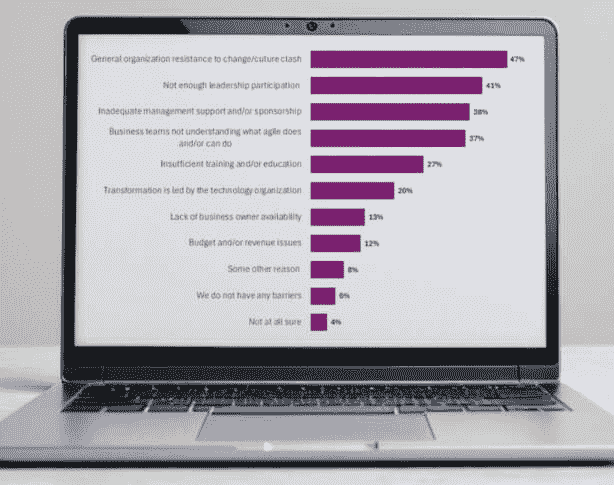
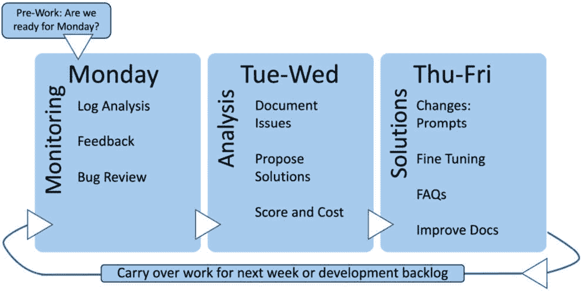
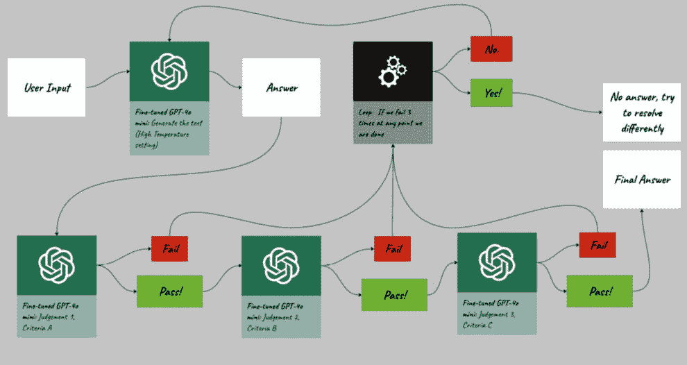
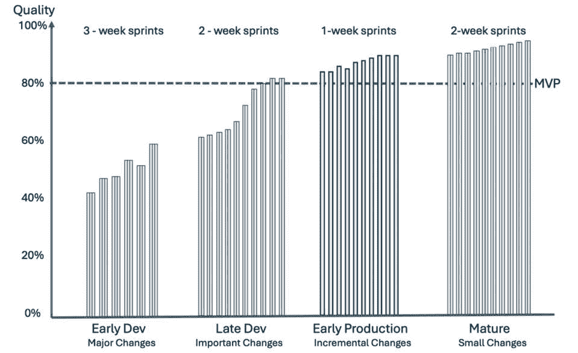

# 流程

并非所有公司都是用同样的方式建立的。发展过程正在全速前进，时间和资源都得到了合理分配，用于在正确的时间和规模上完成设计步骤。完美。最好是由你来写这一章。企业规模的问题伴随着企业规模的问题。让我最头疼的是将设计解决方案融入实际环境所需的时间。*时间是优秀设计的敌人*。随着技术的每一次进步，上市时间和迭代周期都必须更快。今天的用户已不再是过去的用户。

尽快提供最佳解决方案，否则可能失去客户。因此，即使在敏捷的世界里（当我们提到敏捷时，包括Scrum、精益和软件开发的其他迭代现代方法），其目标也是及时交付质量。设计和投入其中的努力可能会让希望快速行动的工程团队感到头疼。记住我们关于便宜、快速和好的讨论，选择两个吗？快速是必要的，以免疏远客户，而客户不再接受企业解决方案中的低质量，因此它必须是好的。因此，它可能并不便宜。嗯，这里的*便宜*意味着投入资源来确保它是好的。前几章讨论了如何让它变得好，但我们需要将这些方法、实践、指南和启发式方法应用于以有利于将优质工作推向市场的方式。

在本章中，我们将讨论在软件开发组织中融入对话设计的两个领域：

+   将设计思维融入开发

+   设计内容改进生命周期

# 将设计思维融入开发

本书的大部分内容是关于使用解决问题的步骤，考虑用户需求，细化问题，以及创建和测试解决方案。这是**设计思维**的精髓。你可能即使不知道它的名字，也在做这些事情。这种动手方法通过书中涵盖的研究方法强调用户同理心。然而，从实际的角度来看，一个设计思维者会在每个流程步骤中记住用户目标。因为敏捷开发与生成式人工智能的迭代特性非常契合，所以本章揭示了在企业软件开发组织中使生成式人工智能成功的技巧。这对提供企业工具的公司和使用企业工具与大众合作的公司都适用。应该清楚，在敏捷人工智能世界中，两者都有令人信服的使用案例和设计思维带来的挑战。

这听起来可能有些严厉。如果一个组织不使用敏捷或任何形式的迭代开发，那么成功的生成式人工智能将遥不可及。我们生活在一个新的、快节奏的世界，这个世界需要一个强大的*迭代*方法来支持它。我强烈建议考虑这一点。有大量的资源可以利用，从早期讨论的规模化敏捷框架到敏捷联盟以及更多。AI工具正在许多开发过程中变得至关重要。实际上，它们也应该被部署给客户。涵盖了提示工程和微调的工具，但还有大量的AI附加组件可以支持待办事项管理、编写更好的问题或丰富开发过程。在Atlassian Marketplace的Jira和Confluence中，有超过50个工具被标记为*AI应用*。我无法评论它们的好坏，但肯定的是，最终，其中一些将节省时间并提高工作流程效率。

网站：[Atlassian 的人工智能市场](https://marketplace.atlassian.com/categories/artificial-intelligence) ([https://marketplace.atlassian.com/categories/artificial-intelligence](https://marketplace.atlassian.com/categories/artificial-intelligence))

这些工具超出了本书的范围，但它们有助于团队向更高效的过程迈进。关键在于这是一个不断变化的世界。适应并学习我们的内容、客户和人工智能如何协同工作，然后能够快速对生产进行改进。

如果有人需要观看这个视频，我会感到惊讶。如果你是敏捷开发的新手，请参加为期三天的敏捷Scrum课程。这些课程可能会改变你的生活，而且有很多东西可以学习。

视频：[敏捷简介](https://www.agilealliance.org/agile101/agile-basics/introduction-to-agile/) ([https://www.agilealliance.org/agile101/agile-basics/introduction-to-agile/](https://www.agilealliance.org/agile101/agile-basics/introduction-to-agile/))

软件行业能够过渡到以AI为中心的方法。第17届年度敏捷状态调查（基于2023年的结果，2024年发布）的结果，共有788位受访者参与，非常引人注目。因为该行业绝大多数采用敏捷方法，并且我们的所有建议都适用于任何方法，所以重点是参考敏捷方法以及如何解决实施过程中的问题。71%的调查公司使用敏捷方法。一些团队使用其他现代方法，例如**DevOps**（**开发和运营**作为一个团队工作）、**迭代**、**精益**（只专注于最关键的项目，不进行多任务处理）或**螺旋**（一个四阶段重复过程）。甚至**瀑布**方法（一个完整的阶段，不允许回退）在28%的受访者中也被发现。

有敏捷的粉丝，但也有批评者。最大的抱怨集中在无休止的节奏和故事点。故事点用于衡量工作量，但有些人主张使用小时数这种易于理解的测量方式。任何对某人生活方式的重大改变都会遭到抱怨。*改变是困难的，但改变是不可避免的*。技术世界的变革步伐一直在不断加快。我们不需要争论故事点。自己进行研究。本章重点介绍设计如何帮助LLM解决方案实现。与敏捷保持一致是有价值的。其中最重要的价值是围绕迭代设计的对齐。在生成式AI中，必须有一个迭代的生命周期。但要做好这一点是有挑战的。从第4章的评分讨论[*章节4*](B21964_04.xhtml#_idTextAnchor085)，*评分故事*中可以看出，设计相关的努力在敏捷中有其位置，但设计师的努力并不适合单一冲刺。研究和研究通常需要时间来撰写和执行计划，但一周的冲刺中并不适合。结果证明这是可以的。有答案。所以，让我总结一些使设计成为生成式AI迭代*敏捷*过程成功部分的技巧。即使没有严格的敏捷方法，原则和指导也可以应用于大多数组织。甚至我们关于寻找赞助者的第一个建议也不仅仅局限于敏捷。

## 寻找赞助商

敏捷方法非常适合迭代式的AI养护和喂养方法。正因为如此，企业在敏捷方法上遇到的问题也就变成了AI采纳的问题。看看数字AI第17次年度敏捷调查中的*图11**.1*。

图 11.1 – 第 17 届敏捷状态调查 – 敏捷方法中的业务问题 (openart.ai)

该调查覆盖了广泛的领域，但组织支持对于敏捷成功至关重要。由此延伸，生成式AI解决方案也需要组织支持。前三大问题（及其他问题）与管理者问题相关。这是最新的调查。

文章：[敏捷状态报告](https://digital.ai/resource-center/analyst-reports/state-of-agile-report/) ([https://digital.ai/resource-center/analyst-reports/state-of-agile-report/](https://digital.ai/resource-center/analyst-reports/state-of-agile-report/))

迭代式关怀与养护方法通常与季度发布日程截然不同。这是一种文化转变。即使在敏捷组织中，许多团队也是按照敏捷日程的倍数来发布产品的。常见的情况是两周冲刺但季度发布。将缓慢的节奏与缺乏领导层的参与和支持相结合，会引发问题。找到一个认识到变化速度对人工智能成功至关重要的赞助者，并能够帮助创建有利于快速变化的过程。当组织认识到做好人工智能所需的努力时，领导层的支持是至关重要的。当然，人员是关键，但工具也有帮助。

## 寻找合适的工具并整合生成式人工智能

毫不奇怪，跟上这种水平的变化、管理大量的测试用例集以及处理整个知识体系是一项庞大的任务。这不仅仅涉及一个工具，而是需要数十个工具，但至少应该从管理流程和变化的过程开始。正如在[*第4章*](B21964_04.xhtml#_idTextAnchor085)中讨论的，使用敏捷跟踪工具进行*评分故事*，结合评分和从WSJF待办事项中工作来管理变化。找到一个没有知识管理工具的大型企业可能具有挑战性。然而，为了准确地为RAG解决方案提供数据，可能需要进行调整——也就是说，认识到知识和数据需要适应以改善ChatGPT生成的结果。这不是魔法，而是填补空白的辛勤工作。这可能意味着调整文章以支持LLM，重新整理现有知识，调整API以在调用中包含更多上下文，并使用中间工具来改善信息流向LLM以供处理。我们也不应忘记使用较小的模型进行几次定制任务，将这些结果反馈给链中的其他模型以改善整体性能。这让我想起了这样一句话：“*坚持计划，坚持计划，坚持计划*。”这意味着对流程进行最后的更改有时可能产生虚假的结果。另一个类似的概念是“*一开始就要虔诚……*”。

## 首先，要有宗教信仰…

有一个原因使得敏捷宣言对数百万人有效，尽管他们对其不足之处有所抱怨。当然，敏捷调查中有15%的受访者对敏捷“*完全不满意*”。但考虑到我们对敏捷、Scrum以及共享概念的理解，经验表明，这主要是因为不知道该责备谁或什么导致了失败。考虑这些以及伴随的原则，因为它们可以应用。一旦你成为专家，*然后*再进行适应。在一个组织中，我参加了一个周三的团队会议，一个大约800人的团队的副总裁宣布，“*从周一开始，我们将开始实施敏捷*。”然后他们开始选择要实施或不实施的元素（包括决定自我组织团队是他们无法做到的，不知道“自我组织”的含义）。不要让严重的无能阻碍质量目标。在摒弃它们之前，尝试理解敏捷原则的意图。让我引用12个基本敏捷原则中的几个：

+   *围绕有激情的个人构建项目。为他们提供所需的环境和支持，并信任他们能够完成任务。*

+   *向开发团队传达信息以及团队内部沟通的最有效和高效的方法是* *面对面交谈*。

+   *工作软件是衡量进度的首要标准*。

+   *敏捷流程促进* *可持续开发*。

    文章：[敏捷宣言](http://agilemanifesto.org/) ([http://agilemanifesto.org/](http://agilemanifesto.org/))

我们的过程支持构建事物：这就是我们学习的方式。即使在视频会议的世界里，人们面对面交流也能更有效率。随着人工智能变化的快速步伐，可持续性需要融入我们的生命周期，以避免人们过度劳累。组织机构喜欢降低风险。通过严格遵守流程来降低风险，直到有信心未知的事物已被了解，并且需要改变。风险会产生未知因素，尤其是在像LLM这样的解决方案中，它每一步会说什么是不可预测的。

## 避免未知之未知

这太好了，值得重复一遍：

“那些说某件事没有发生的报道对我来说总是很有趣，因为我们知道，有已知的已知；有我们知道的已知。我们也知道有已知的未知；也就是说，我们知道有一些我们不知道的事情。但还有未知的未知——那些我们不知道自己不知道的事情。”

– 唐纳德·拉姆斯菲尔德，美国国防部长（2002年2月12日）

深入理解和学习。进行研究，揭示问题的根本原因，并在生成式AI世界中学习*如何学习*。看看为什么设计如此有利于发现问题；设计方法旨在解决这些问题。并且始终尝试进化和改进。

## 永远进化与改进

回顾总结不容错过。它们使内容团队能够学习和对引起关注的工程问题提供反馈。进化到使用更好的指标（价值和工作量，而非缺陷）来推动改进（衡量正确的事情）。在[*第10章*](B21964_10_split_000.xhtml#_idTextAnchor216)“监控与评估”中讨论的一些指标可能令人困惑，并且仍在不断发展，但我们已经学会了理解指标如何变化，并随着它们的发展与之合作。设计思维本质上是关于倾听和学习，因此设计师应该处于最佳位置来帮助团队发展和改进。而改进包括知道如何定义需要完成的事情。这意味着要有需求。

## 敏捷开发并不意味着“没有需求”

明确*他人*的需求；不要过度明确*你*的需求（模块间文档，是的！）敏捷是正确的：

“优先考虑可工作的软件而非详尽的文档……我们更重视左侧的项目。”

这并不意味着你不创建测试用例；这是为了前进而不退步的必要步骤，但这可能就是所有需要做的事情。考虑目标，让数据科学和工程工作去实现这些目标。如果分析确定系统需要更好的上下文回忆能力，定义新的现实目标。没有人会独立在这些项目上工作。关注其他人需要什么。这并不排除为用户研究编写测试计划。做需要做的事情，但如果你知道该做什么，考虑是否需要将其文档化。这引出了我们讨论他人以及如何与团队合作的议题。

## 团队构成和位置很重要

面对面交流是将信息传达给开发团队内部的最有效和高效的方法。这对仅限远程工作的公司或当今的任何公司来说都是一个巨大的挑战。在敏捷状态调查中，91%的受访者表示他们的团队是完全远程的。然而，一些成功的公司认识到部分解决方案——他们有成员在相似时区的团队。在罗马尼亚有作家，在中国有质量保证人员，在加利福尼亚有项目经理和设计师，这是不正确的。努力创建能够实时协作的内容团队，以帮助他们保持对正在进行的工作的一致性。

## 管理进行中的工作（WIP）和技术债务

工作如此之多，时间却如此之少。即使有了生成式AI，也仅能完成有限的工作。将资源集中在[*第4章*](B21964_04.xhtml#_idTextAnchor085)中提到的最有价值的物品上，即*评分故事*。将工作分解成更小的部分，并尽早交付这些价值。*图11**.2*通过如何建造房屋的类比来解释这一点。

图 11.2 – 不要处理过多的进行中工作（Photoshop AI）

这很简单——大多数人宁愿完成80%的工作而不是完成100%的工作的80%。已完成的工作是有价值的。房地产经纪人可以卖出四套房子，然后在下一个地块上开始建造，而不是拥有五套仍在进行中的房子，这些房子无法出售。这就是为什么建筑商有阶段性的原因。他们建造一套房子（为了效率），然后出售，接着再建造下一套房子。这样做可以降低风险并增加价值，客户也能更早地获得好处。内容变更也是如此。逐步推进。这种逐步推进通常意味着更广泛的工作被分解成可管理的部分。*图11.3*幽默地表示了组织以创建可管理的、易于理解的集合，以便进行应对。

图 11.3 – 将大型项目分解为可管理的部分 (openart.ai)

讨论过的优先级工具和敏捷流程（或任何具有待办事项整理的方法）有助于聚焦于优先事项。做值得做的事情。这项工作应该提供最大的客户价值。

## 专注于客户价值

有一整章是关于评分用户故事的。到现在为止，通过优先处理最重要的工作来为顾客提供价值应该已经得到了很好的理解。故事与顾客的共鸣越多，他们的体验就会越好，他们也会更多地称赞它（想想净推荐值），从而增加用户和用户使用率。然后，投资以创造更多的价值。关注顾客价值的一种方式是确保设计过程是整体开发过程的一部分。

## 将设计流程融入开发流程

很少有企业公司采用以设计为先的方法。以设计为先不仅仅意味着先做设计；每个人都必须先做一些设计 *设计先行*。这更多的是关于以设计思维引领，以创造客户成功，而不是因为工程觉得酷或者营销想要一些闪亮的东西而推动解决方案。它必须满足用户需求并驱动价值。此外，正如之前提到的，它应该是**功能性的、可用的、必要的和吸引人的**（**FUN-E** 或 *有趣的*，这是一个好的记忆法）。然而，大多数产品设计人员生活在现实中，因此需要灵活性。使用生成式AI构建的产品还不够成熟，无法在三个月到六个月的发布周期中生存。寻找可以更快发展和逐步改进的地方。此外，设计师、作家、语言学家和产品经理需要与工程、QA和数据分析团队合作，因为许多框架和流程需要实施。但要以设计思维去做，这样新的流程也是 *FUN-E*。

当将通用人工智能（GenAI）或ChatGPT整合到流程中时，请考虑一个专注于知识库（文档和数据）以及提示工程改进的内容冲刺。这个敏捷生命周期可以与传统**开发**（**dev**）冲刺相一致。将介绍内容冲刺的概念。以下是一些针对在敏捷组织中设计生成式人工智能解决方案的关键个人职责的建议：

+   **设计师、作家、语言学家**：

    +   敏捷实践关注设计。然而，大多数设计工作都是在进入*开发*冲刺之前完成的。例如，用户研究不会在一周的开发冲刺中进行。敏捷、扩展敏捷以及许多框架都为进入冲刺所需的工作提供了安排。设计团队应该有*设计*冲刺和流程来创建结果，这样内容团队或开发团队就可以在他们的冲刺期间完成其工作。内容冲刺的概念将在下一节中解释。

    +   在团队开始开发冲刺之前，当设计完成度为90%时交付设计。将内容和提示更改保留在内容冲刺中。跨越内容和开发的项目放置在开发冲刺待办事项中。这允许进行更多技术更改的彻底测试。

    +   使用GenAI工具来构建GenAI产品。就像用于分类、合成数据和微调的工具一样，GenAI工具的数量正在不断增加，这些工具可以使工作更加高效。GenAI工具还有助于专业人士的一般实践，包括编辑、头脑风暴、思考问题、词汇选择、翻译问题以及理解组件和交互设计最佳实践。即使是像ChatGPT 4o这样的通用基础模型，也应该被视为你的实习生，以更好地完成任务。

+   **设计师**：

    +   更多地参与到优先级排序中（以关注端到端并确保客户关键项目按优先级顺序完成）。

    +   学习如何区分提示问题、微调差距、知识或RAG问题、集成数据问题或上下文问题。

    +   积极及时地解决冲刺阶段的问题（即保持响应性并分配时间参与冲刺）。对开发团队的响应性会鼓励他们依赖产品人员。这一点很重要，因为设计师（作家、产品经理甚至语言学家）更能胜任判断这些内容问题。

+   **设计负责人**：

    +   当进入开发冲刺阶段时，冻结该冲刺预期中的UI设计。发布文档后，将重大变更移至下一个版本，并在冲刺期间仅处理剩余的10%的详细设计变更。为开发团队设定不动的目标。

    +   内容冲刺有变更的日程安排；**当有疑问时，将其丢弃**。保留那些已被证明有效的内容，并将其余的移至下一轮冲刺。内容冲刺就像与带电的电线一起工作；不要对结果感到惊讶。

+   **开发者与** **数据科学家**：

    +   不要独自行动；这是一项团队运动。

    +   学习并倾听反馈；一些改变可能产生意料之外的影响。随着团队开始对内容、数据和上下文规模有所感觉，可以原型化和实验其他发布或不同模型，以提升质量。依靠内容人员，如设计师、项目经理和作家，他们更能判断语言和对话交互中问题的适宜性和重要性。

+   **Scrum Master**:

    +   邀请设计师积极参与所有冲刺敏捷活动，并投入活跃的UI工作。最好是让团队专注于UI和内容工作。

    +   开发冲刺中的设计相关任务应每日分配，以确保快速完成UI审查/反馈/冲刺内设计变更。没有人希望在冲刺结束时的审查中遇到惊喜。

+   **产品负责人**：

    +   在开始工作前将需求交给设计师。在设计冲刺期间与设计师合作，为后续的开发冲刺提供“端到端”的故事。一些变更需要测试和研究，可能无法与开发冲刺同步进行。敏捷缩放对此表示可以接受。

    +   保持跑道清洁并与预期的设计需求保持同步，以便在开发冲刺开始之前提供设计方案。即使是内容冲刺团队可能也需要基础设施或想要尝试新的模型，这就会退回到开发冲刺来提供。

    +   正确评估和规划故事规模。将史诗分解为更小的史诗、故事和任务。例如，采用新的LLM（大型语言模型）将涉及多个阶段和冲刺，用于测试、微调和验证。

    +   尽早让内容专家参与其中。在进入冲刺阶段之前，就语言问题、产品俚语的支持、产品的过时术语、已停用的产品名称以及产品名称的同义词达成一致。构建这个术语字典，使其超越官方术语。记住，客户会使用他们感到舒适的语言。

+   **Scrum大师/设计所有者**：任何设计师都可以加入最多三个团队，通常是两个。设计师应该“主要”在开发冲刺之前工作。在开发轨道冲刺中，努力应有限制，因为一个故事至少应该在冲刺中达到90%的完成度。内容设计师不会有这样的奢侈，正如我们即将解释的。他们可能从上周遗留10%到20%的工作量，但本周的工作将在冲刺期间确定，并且几乎所有的工作都将在内容更新冲刺内完成。

现在，是时候解释内容改进生命周期和内容冲刺了。

# 设计内容改进生命周期

[*第二章*](B21964_02_split_000.xhtml#_idTextAnchor031)，*有效用户研究*，详细讨论了广泛监控日志文件以改善关怀和喂养生命周期。我无法强调理解与解决方案性能相关的指标以及调整解决方案以改进它的重要性。尽管聊天解决方案与推荐UI的数据可能不同，但两者的过程是相同的。对于幕后工作，找出所需的反馈，以便建立持续改进的过程。

让我们从产品上线后内容设计团队一周的工作愿景开始。*图11**.4* 展示了一个生产内容改进团队可能进行的工作。将这个团队称为 *生产内容团队* 或 *内容/提示冲刺团队*。找到一个合适的名字，以便清楚地表明这比更强大和复杂的多 *dev* 冲刺团队略有不同。

图 11.4 – 内容团队持续改进生命周期的每周节奏

这个生命周期在开发初期可能不是每周一次；它可能是两周或三周一次的节奏。对于不成熟的生产系统来说，一周是一个不错的选择。达到这种节奏需要时间。如果一个组织使用两周的敏捷开发生命周期，可以从匹配这一点开始，并随着时间的推移改进节奏。或者，当产品更加成熟且变化缓慢时，可以考虑回归两周一次的方法。这个过程不需要与开发节奏完全匹配，这不是一成不变的。虽然有一些优势，但考虑权衡利弊是值得的。这可能是打破这种经验法则的地方。

现在我们来详细描述一下会话分析团队典型的每周工作。这同样适用于推荐解决方案，即使没有相同的输入。

## 对话式人工智能的输入

日志是分析的主要输入源，但可以由调查、错误或反馈进行补充。由于日志代表了实际发生的情况，我总是会检查日志与任何轶事反馈的一致性。有一天，一个朋友告诉我，Google Sheets最显著的缺失功能是拖放行功能。我说：“你可以拖放列，那为什么不能拖放行呢？”我们去查看了Google Sheets，拖放行功能在移动版上也能正常工作。不出所料，这是一个可用性问题，正如在第9章[*章节9*](B21964_09_split_000.xhtml#_idTextAnchor190)的启发式评估讨论中提到的，*指南和启发式原则*。在没有明确的视觉指示其支持的情况下，很难知道可以或不可以做什么。始终检查人们报告的内容。很容易对某事感到烦恼，却对其真正原因感到困惑。根本原因分析可以揭示原因。愿意深入挖掘问题的合理原因。我们的以用户为中心的设计方法基于**根本原因分析**的概念。本书遵循这种方法（定义问题、收集数据、识别可能的原因、开发和部署解决方案，然后监控和验证）。你可以将此应用于任何AI解决方案，包括推荐UI。

## 推荐用户界面（UIs）的输入

推荐系统的用户界面不像我们的对话式亲戚那样有日志数据。前几章介绍了反馈方法，但下游指标可以代表使用数据。访问并监控这些数据以判断价值和质量。例如，假设推荐引擎建议进行电话回访、电子邮件公告或产品折扣。来自电话系统、外发电子邮件日志或销售折扣工具的分析可以与推荐相关联。

在无法建立直接关联的地方，可以使用次级方法，例如用户反馈，来确定用户的感知并收集书面或口头评论。至少有一些数据。后端人工智能则不那么幸运。

## 后端人工智能的输入

由于没有用户界面，这可以被视为一个更具挑战性的任务来收集反馈。有两个建议可以考虑。第一个建议是建立指向结果中问题的反馈机制。客户需要找出问题所在。他们会看到他们不喜欢的东西，觉得有点不对劲，或者将其识别为错误。让他们这样做，然后确定根本原因。然而，如果收集到足够的反馈数据（例如他们的使用历史、特定标签的数据集或他们可能会看到的截图），就有可能定位到问题。

第二个问题与构建一个AI监控系统相关。使用真实世界示例，一个次要的AI（不是用于解决方案的同一引擎）可以检查主系统的作业。它可能会发现与预期不符的结果，或者结果比典型情况高出超过一个数量级。这会输入到一个从每周第一天开始的持续改进系统中。如果针对特定标准进行调整，例如*图11*中的检查点测试周期，可以使用相同的基模型。

图 11.5 – 用于验证共享结果的检查点系统

这个例子使我们能够微调检查点模型以通过特定标准的判断。它支持直接的用户输入过程，或者对于后端解决方案，它将代表客户生成提示。

这个答案是否通过了道德测试（**判断1**）？事实是否与讨论的产品相符（**判断2**）？在**判断3**中，这个答案是否在公司能力范围内？如果结果有希望，就将其传递给客户。如果答案不佳，收集更多背景信息或让他们以不同的方式提问。无论如何，这些模型的每个结果都支持主要模型。每一次失败都创造了学习的机会。模型输出的结果是每周改进过程中的一部分。我们的想法是每周都朝着完成所有这些工作前进。让我们看看在流程的第一天需要做的工作。

## 监控周一

[*第二章*](B21964_02_split_000.xhtml#_idTextAnchor031)*，有效用户研究*，涵盖了日志分析。这是了解客户情况的有价值方式。提供了手动工具以开始，并分享了优先考虑结果的方法。周一或任何一周的开始日进行重点分析。

星期一是周的第一天吗？

也许你们的国家从周日开始。然而，这并不能给你带来*监控周一*的押韵效果。这种押韵只在某些语言中有效；以色列、日本和沙特阿拉伯可以从*调查周日*开始。想出适合你们语言的名字。我使用了前面章节中的翻译表格来翻译“监控周一”。在30种语言中，只有一种语言接近押韵。如果你是一个单词爱好者，那将是荷兰语，翻译为“Maandag monitoren”。考虑让它变得有趣，而不是让人感觉像是一个人们会反对的结构化行军（这是典型的敏捷抱怨）。

一支团队在审查日志、查看客户调查、反馈信息、错误报告、多步验证模型中间步骤的失败以及销售或服务反馈方面能做的事情是有限的。筛选出问题，以便在接下来的几天内进行分类处理。利用这段时间来处理上周遗留的项目。

## 分析周二（以及周三的工作总结）

理解、分类和整理结果。对于大量常见问题的集合，不要写20个故事；写一个即可。这就是分类方法和第三方工具发挥作用的地方，如在第[*第2章*](B21964_02_split_000.xhtml#_idTextAnchor031)“进行有效的用户研究”和[*第3章*](B21964_03.xhtml#_idTextAnchor058)“确定ChatGPT的最佳使用案例”中所述。与开发团队合作，理解和将问题划分为本周可以修复的以及需要开发者帮助改进的问题。当然，投资于工具以进行改进，而不需要在每个转折点都投资于开发资源，这是谚语——*如果你给人一条鱼，你只能养活他们一天。如果你教他们捕鱼，你就能养活他们一生*。开发者可以通过提供允许我们进行改进的工具来教我们捕鱼。通过分析，可以考虑编辑知识、提示更改、微调示例、添加测试用例或其他内容更改等解决方案。分析还将为研究人员创造工作，并为开发团队在微调、新模型、更好的反思或模型间集成以及API工作等方面提供大量事项。所有这些工作都是为了决定内容团队在接下来几天内可以交付的内容，并计划开发团队在未来迭代中可以提供的内容。

## 周四治疗，周五故障排查

我非常希望这些活动能在不同的日子里进行，但找出解决方案和测试以识别故障是一个迭代的过程。一些读者可能会嘲笑试图在一周内完成所有这些尝试。我理解；这是目标，朝着这个目标努力。修复和测试应该在两天内完成。预计会有冲突。不出所料，要求模型做一件事可能会破坏另一件事，或者两个新的解决方案可能会冲突。然后提示可能会变得难以控制。所有的人都全力以赴寻找解决方案：编写或编辑知识，更新提示，改进微调，或者整合一个新的API（如前所述，这很可能是来自之前的冲刺，因为API不会神奇地出现）。为了使这一切能够工作，需要自动化来快速重新运行测试案例并分析结果和指标。

只有少数事情可以在几天或几小时内得到解决，但一些改进完全在情理之中。对于*内容*，快速改进是可能的：

+   调整指令和提示

+   训练以提高语法或包含公司特定语言和缩写

+   编辑知识

+   创建知识（快速开发技术文档可能很难，但也许FAQs（常见问题解答）是合理的）

+   添加学习示例

+   确定在说明中包含的上下文元素

+   微调

+   添加测试用例

这可能是一个挑战。内容团队无法进行一次更改、测试，然后再进行更多更改，因为一次测试可能需要几分钟或几小时。同时，也很难调试一批新更改中存在的问题。这是一个权衡。有时，失败的测试可能会阻止解决方案的发布，而有些解决方案可能无法实现，需要更多或不同类型的工作。工作可能会延续到下周，或者需要提交给开发团队。让我们更详细地探讨延续的工作。

## 一周内无法完成的事情仍然很重要

“如果我有一个小时来拯救世界，我会花上55分钟来定义问题，而只花上5分钟来寻找解决方案。”

–阿尔伯特·爱因斯坦（并非真的）

阿尔伯特·爱因斯坦的“著名”引言并非出自他本人（谷歌知道！），但情感依然有效。并非所有解决方案都容易。然而，如果花时间理解问题，通常理解解决方案是可行的。

当识别出一些明显无法在一周或冲刺中完成的问题时，评估它们的价值仍然很重要，同样重要的是获取成本估算并将其根据加权最短作业优先法移入待办事项列表。通过持续这样做，之前几周（或几个月）的故事现在将被整合到本周的变更中。因此，这些变更将在构建测试时影响解决方案。在真正的敏捷方式中，如果某件事太大，会干扰流程，那么它不应该与其他变更一起被采纳；对于更重大、技术更复杂的故事，应使用传统的开发和测试生命周期。

例如，当新的API或集成可用时，将需要新的测试用例。因为这些之前的域外案例变成了域内解决方案，这可能会导致新的冲突。例如，在一个支持销售、库存和团队人员编制报告的内部业务解决方案中，支持营销报告的新API需要与现有的其他*报告*请求协同工作。添加训练数据以帮助系统区分这些新的营销报告，重新运行微调，更新提示，并完善FAQ以考虑这一功能。之前的域外测试用例必须转移到有效的域内测试用例。

*图11**.6* 展示了根据产品阶段调整内容冲刺节奏。这旨在鼓励思考产品开发每个阶段的变化程度以及这种变化的价值。

图 11.6 – 频率可以根据产品的阶段而改变

这表明内容冲刺日程会随着时间的推移而调整。这对于敏捷开发来说是一个激进的想法，但考虑一下可能还是有价值的。由于团队是自我组织的，他们可以做出这样的日程决策。大多数企业都不相信团队能够做出这样的决定，因为他们认为自我组织是不可取的。但应该有一定的灵活性。这并不是建议经常改变，就像过程成熟一样。这就是敏捷的方式。

注意垂直轴的通用**质量**指标。这可能包括任何度量或所有度量。任何特定的指标在构建和测试时都可能看到下降。在[*第10章*](B21964_10_split_000.xhtml#_idTextAnchor216)“监控与评估”中，OpenAI为改善其企业用例所做的努力并非全部成功。记住，即使产品已投入生产，开发方面的努力最终也会上线，并带来比仅从内容角度的增量改进更显著的质量提升机会。仅通过编辑提示、改进调优、添加新API以及与我们知识整合工作所能做的有限。

让我们逐一分析每个阶段及其方法：

+   **早期开发**：在这个阶段没有检查和平衡；请定期尝试测试更改。测试框架和指标仍在开发中，并需要可用以确保进展（尽量别走一步退两步）。手动测试将是典型情况。重大变化将来自主要投资，如果内容冲刺周期没有反映开发进度也是可以的。编写内容、编辑和审查更新以及上线测试都需要时间。

+   **后续发展**: 随着发布日期的临近，变更可能会变得更加严格，并遵循与开发敏捷团队相同的日程。两周是典型的时间；一些团队可能已经在一周内完成一次迭代。然而，请注意，敏捷冲刺的长度并不总是等同于发布日程，这是可以接受的。只有在这些重大投资开始产生回报时，才会出现质量上的重大飞跃。**最小可行产品**（**MVP**）的期望值在先前的图表中显示为**80%**。一个敏锐的读者会注意到我们在其他图表中提到了97%。97%是**目标**；80%是发布的最小要求。在上线之前，展示出能够维持这一水平的重复能力是明智的。一些变更可能会损害某些质量指标。产品范围的重大变化可能会降低每次交互的质量，但会增加可以处理的交互数量；学会接受道路上的这些颠簸。

+   **早期生产**: 目标是在一周内完成整个更新周期。通过分类变化，可以有机会通过一些调整更快地进行更改，而更重大的变化，例如访问新的API，则需要更长的时间。客户需要感受到改进。我全天使用ChatGPT，并每月看到改进。对于某些变化来说，一周是可能的。做最好的事情，但始终以尽快为客户提供价值为焦点。

+   **成熟生产**：随着解决方案的成熟，增量改进带来的价值将越来越少。将质量从80%提升到90%所需的努力可能与将质量从95%提升到96%所需的努力相当。这种递减的回报率表明需要重新考虑如何分配时间。变化的节奏可以降低，因为那些变化的价值很小。可能到了减少内容团队可以完成的故事点数，并将那些资源分配给新的机会或下一代解决方案的时候了。当然，这可能是几年时间，所以当到达那个时刻时再过桥吧。

没有人是完美的，我们也不需要完美。追求完美的代价可能会让你失去生意。回想一下来自[*第6章*](B21964_06_split_000.xhtml#_idTextAnchor134)*，数据收集——内容为王*的失败案例：福特Pinto。最好是做出选择；不要做出糟糕的选择。为高价值、高风险的答案使用护栏。重视道德、减少偏见和准确性，而不是功能扩展。

“完美是无法达到的。但如果我们追求完美，我们就能抓住卓越。”

– 文斯·隆巴迪

随着新模型的涌现，质量变化显著，因此考虑如何重新适应更快的节奏。看到质量出现波动作为新模型的函数并不罕见，就像在过去两年中ChatGPT的发布，它主要呈现的是一个稳固的上升趋势。

采取的做法是迅速实施实践来提高质量，保持客户在愉悦的路径上。定期监控、收集反馈、了解问题、分类整合改进措施、研究问题、测试增强功能，并重新开始这个过程，这是一项充满爱心的劳动。以下是一些克服典型挑战的技巧：

+   监控日志文件可能会变得单调乏味，因此将工作时间进行分块。审查1,000行日志既耗时又繁琐。没有人应该每天都做这件事，所以只需做一天。或者，将审查和总结的任务分配给一个LLM。

+   随着时间的推移，监控速度会更快。与包含200个问题的日志文件相比，审查包含50个问题的1,000个日志文件要快得多（10倍），因为人类可以快速审查没有问题的对话，但需要时间来理解单个问题。ChatGPT模型也可以完成一些这项工作，例如查看哪些内容可以自动化，但仍需手动进行一些监控以了解客户。

+   在一次内容迭代或冲刺中只修复一些问题是可以的。有些项目无法通过提示工程、编辑知识或创建新内容来修复。有时需要新的API；在某些组织中，这可能需要很长时间，甚至永远无法实现。对问题进行分类有助于解决问题，因为如果出现多个相同问题的实例，就有可能倡导解决它们。使用占位符来确认客户的需求。占位符可能包括指向第三方资源的链接或如果没有其他可用信息，则包括解释。有可用的良好AI分类器；可以创建一个模型来对问题进行分类。

+   列出资源。设计师、分析师、内容创作者、产品经理、工程师、质量保证人员和数据科学家可以理解和诊断问题。通过这些资源共同协作，学习如何最佳地应对情况。对于某些事情可能有不止一种方法。基于收集到的信息进行沟通、协作和结论。此外，也可能有不止一个解决方案。短期解决方案可能通过长期改进知识库来更好地解决。在等待后者解决方案的同时，先实施一个解决方案。

+   版本管理不会希望快速做出更改。这是一个难题。在系统中工作或找到支持改变它的人。最好有一个赞助者。有不同的更改类型；与赞助者一起确定版本管理会批准的更改类型。建立信任并随着时间的推移扩展这个列表。给出例子。如果一个在线新闻机构有一篇文章说，“*每架新的军用飞机将花费2亿美元*”，但实际上是2000万美元，没有人会期望这个*内容*更改需要一周时间来修复。而我们正在处理的大部分是内容。考虑对更改进行分类，以便一些微调可以每周进行，而其他则需要更多的努力、测试和时间。所有这些都应该作为过程的一部分通过自动和手动测试，所以可能这就足够了。

+   输入垃圾，输出垃圾。不要让糟糕的知识破坏RAG模型。不要只给模型提供生成数据；如果可能，尽量节约使用。注入新的、高价值的内容，并寻找改进的机会。没有人会建议每周都编辑或改进所有文章；选择正确的战斗。让数据引领前进。点击量最高的文章优先考虑。利用分析来调整编辑投资。识别并测试不同产品之间相似文档之间的交互。寻找数据库中具有良好上下文数据的地方，这些数据可以增加提示的价值，为顾客提供更定制化和准确的经验。

+   在处理监督微调的过程中投入时间。在技术材料中，添加已知的样本到训练中。在检查日志时，认识到在交互中的一些人类多样性应该更好地理解。考虑FAQ是否已经达到这个目的。记住这些例子中提示应该是什么样子。大量的微调数据集是范围和规模的优秀例子，即使通用数据对于企业用例没有价值。这里有一个很好的例子，包含200,000个健壮的提示。

    文章：[Ultrachat 200,000行数据集](https://huggingface.co/datasets/HuggingFaceH4/ultrachat_200k) ([https://huggingface.co/datasets/HuggingFaceH4/ultrachat_200k](https://huggingface.co/datasets/HuggingFaceH4/ultrachat_200k))

    构建定制的调优材料、测试案例和模板集合，以提供高质量的RAG结果。生成式AI革命并非没有代价。随着时间的推移，模型成本将比整体生命周期成本不那么重要。

现在，让我们总结本章的一些关键要点。

# 结论

“如果没有持续的增长和进步，那么改善、成就和成功这些词就失去了意义。”

– 本杰明·富兰克林

当谈到对话式解决方案时，没有比这更真实的话了。几十年前的软件变化是以年为单位衡量的，然后是几个月或季度，而现在，是以周和天来衡量的。这是预期的、必要的，有时也是很有价值的。有了支持持续改进甚至交付的过程，这是一个双赢的局面。工具和方法将迅速改进，这将使我们有更多的时间来应对新的项目，同时客户也将更快地享受到更好的解决方案。

到目前为止，我们已经探讨了将用户体验设计思维和流程应用于创建卓越的企业级ChatGPT解决方案的整个生命周期。有时，我们深入探讨，给你留下了一些作业。技术发展如此迅速；希望这本书中讨论的96%的概念可以应用于任何对话式人工智能平台或工具集。模型在改进，工具也变得更加稳健。这些方法和实践应该仍然有效，直到我们达到传说中的通用人工智能（GPAI）、强人工智能或通用人工智能（AGI）。这本书将一直适用，直到大型语言模型（LLM）不需要在创建和调整上投入大量资金，只需要适量的关注和培养。因此，我们将在下一章结束我们的旅程，让你踏上征服下一个AI项目的道路。

# 参考文献

|  | 本章中的链接、书籍推荐和GitHub文件均发布在参考页面上。网页：[第11章参考资料](https://uxdforai.com/references#C11) ([https://uxdforai.com/references#C11](https://uxdforai.com/references#C11)) |
| --- | --- |
