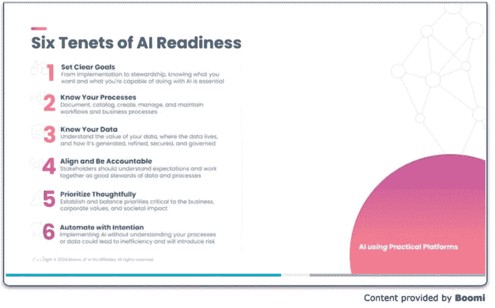
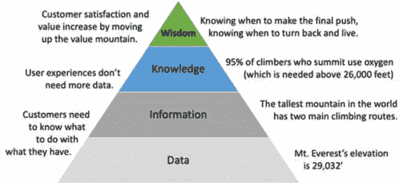

# 12

# 结论

任何阅读到这本书这一部分的产产品人员可能已经接受了一个观点，即生成式AI领域远比简单地询问ChatGPT一个问题并期待一个良好答案要复杂得多。它所能做到的事情令人印象深刻，但当它没有做到预期的事情时，这会让人感到沮丧。关键在于是否已知它本可以更有帮助。在许多地方，客户需要学习或识别出ChatGPT在其自信的氛围中是否在说谎。这就是为什么产品人员是质量把关人的原因。

这最后一章将采取不同的方法，不是简单的总结，而是关注我们通过其他视角和思考生成式AI旅程的几种方式：

+   将所学应用于新的前沿领域

+   仔细检查感觉正确的事情

+   构建适合解决方案的过程

+   结束这次旅程

# 将所学应用于新的前沿领域

本书遵循了传统的生命周期方法，将用户体验设计的方法、实践、启发式和指导应用于新兴的生成式AI领域。尽管章节与开发过程的顺序相一致，但许多这些工具和技术可以在生成式AI旅程的各个阶段使用。用户研究在前期进行，以解锁未来功能的潜在价值，并在解决方案允许验证时再次部署。我们希望将“关怀与滋养方法绝对必要”的理念灌输到生成式解决方案中。人们可能会认为这对于许多软件产品来说是一个绝对的要求，但该行业需要更加着迷于这种方法。公司快速发布新版本时会出现问题。有时，这会影响训练，并破坏服务。生成式AI可以支持持续改进的过程，就像Google搜索一样，无需用户决定即可更新。自从生成式AI在2010年代初随着对话式AI的兴起而出现以来，人们已经广泛理解了为什么大多数AI融合解决方案失败的原因。它们被推给了客户，而没有遵循持续的改进和关怀与滋养实践。现在，生成式智能填补了先前聊天机器人解决方案的一些技术缺陷，并将大多数这些学习应用到创建更有效的生成式AI产品和服务的实践中。

事后看来，大部分时间都花在了交互式对话人工智能产品上，同时确保提供的构建块可以适用于所有推荐类型解决方案。无论是优先处理支持工单还是销售线索，评分营销线索，建立用户声誉，建议下一步最佳行动，根据有害或不希望的内容过滤内容，或者对情感进行分类以鼓励良好的代理行为，这本书都应该提供解决这些问题的指导。人工智能可能改进的后端服务只需要我们的一些方法，但现在有一系列技术可供应用，以应对任何情况。

为了公平起见，不要将每种方法都应用于每个项目。使用[*第4章*](B21964_04.xhtml#_idTextAnchor085)，*评分故事*中的一些简单数学来计算每个工具和技术都有其投资回报率。挑选和选择与开发或权力机构之间的战斗。明智地使用资源。做正确的事情。

# 仔细检查感觉正确的事情

我参加了一个人工智能会议，并听了关于人工智能准备的演讲。鉴于我们关于何时部署解决方案以及使人工智能解决方案成功的所有步骤的讨论，看到其他人如何看待我们已经涵盖的内容将会有所帮助。Ann Maya介绍了由**Boomi**的Michael Bachman（[https://boomi.com](https://boomi.com)）与250位C级高管合作创建的六项人工智能准备原则。

我提出他们的原则，因为它们以略微不同的方式总结了我们的方法，并且很好地与实施一个可以启用这些原则的过程（从[*第10章*](B21964_10_split_000.xhtml#_idTextAnchor216)，*监控与评估*）相吻合。比较方法和实践，了解他人的工作方式总是很有价值的。如果你的工作与他人的工作一致，可能会感觉缺乏创新。然而，在新兴领域，我们的集体走在正确的道路上也是有价值的。即使有了一致性，也有地方可以学习缺失的拼图碎片，这些碎片是有价值的。我在*图12.1*中展示了他们分享的结果。它总结了人工智能准备的六大原则。

图12.1 – 人工智能准备六大原则。

考虑到我们在人工智能准备方面的用户体验倾向，这些原则并不涵盖所有内容，但重叠部分足够多，所以在完成这本书的草稿之前找到这个资源真是太好了。让我将每个目标和它们的解释与本书中的努力对齐。这些并不是按照任何特定顺序排列的。

## 设定明确的目标

*从实施到管理，了解你想要什么以及你能够用人工智能做什么*是至关重要的。

我们通过讨论用例([*第3章*](B21964_03.xhtml#_idTextAnchor058)，*识别ChatGPT的最佳用例*)来定义这一点，使其符合客户的需求。保持可触及性。专注于AI可以提供最大价值和提高质量的地方，然后深思熟虑地拓展。公司只会做其中的一部分，这就是为什么有大量的工具和支持用于实施。问题是是否解决了最佳用例以证明成本是合理的。

## 了解你的流程

*记录、编目、创建、管理和维护工作流程和业务流程。*

在[*第6章*](B21964_06_split_000.xhtml#_idTextAnchor134)*，数据收集——内容为王*中，Wove案例研究提到了将目标和对核心专长的理解与AI工具能做什么相一致。设计流程可以重新评估当前流程中的步骤是否必要。保持工作流程是[*第7章*](B21964_07.xhtml#_idTextAnchor150)*，提示工程*和下一章中的微调的关键。花时间将这些解决方案做对。它们并非一劳永逸。一些当前流程非常适合重新设计。偶尔，一个团队可以重新设计一个流程并从一张白纸开始。规划去往何方可能给出前进的道路。有时，价值来自于简单的渐进式改进。你现在知道如何评估这些价值，并且使用敏捷方法，你可以确定它们的成本。“加权最短作业优先”是决策过程。

考虑可以提高流程的不同模型。例如，轮辐模型或链式模型被提及了几次。随着价格的下降，使用多个模型来解决单个问题变得实际且可预期。具有不同能力、智能、性能和成本的模型可以适应独特的用例。并非所有模型都适合所有情况。生成式AI流程正如[*第11章*](B21964_11.xhtml#_idTextAnchor236)*，流程*所述，需要一些考虑。由于企业解决方案通常包含数十或数百个部分，因此企业中模型的激增是预期之中的。这使得整个维护和喂养生命周期变得更加关键。

## 了解数据

*理解数据的价值、数据所在的位置以及数据的生成、精炼、安全和治理。*

[*第6章*](B21964_06_split_000.xhtml#_idTextAnchor134)，*数据收集——内容为王*，讨论了为定制ChatGPT解决方案管理数据。没有企业数据，就没有额外的价值。构建一个RAG流程来确保业务数据安全并正确展示是至关重要的。

企业数据是这本书的全部原因。它包含了公司的集体智慧，包括产品和服务，以及与客户的客户关系。这就是它的价值所在。这也意味着要意识到固有的偏见。这不仅仅是可能的文化偏见；这可能是知识如何谈论产品或它使用的术语。决定如何管理这些数据，处理数据的治理，并适应它以允许AI充分利用语料库。

## *对齐并承担责任*

*利益相关者应了解期望，并作为数据和流程的良好管理者共同努力。*

我们经常讨论成为模型和数据的好管理者。处理偏见、控制PII以及管理集成对于成功至关重要。正如所有用户体验合作伙伴一样，作为客户倡导者，设定正确的期望。使用前几章的方法，通过遵循[*第九章*](B21964_09_split_000.xhtml#_idTextAnchor190)，*指南和启发式方法*，以及衡量[*第十章*](B21964_10_split_000.xhtml#_idTextAnchor216)，*监控和评估*中审查的结果，将利益相关者引向共同目标。

如果涉及道德考量，要对结果负责。围绕检查结果、使用提示工程以最佳语气进行交流以及提供最准确答案的讨论至关重要。一些大玩家的错误将开始成为新闻。在好莱坞，有句俗语，“*没有坏名声*”。严格控制那些暴露道德、医疗、社会或社区标准问题的用例。不要因为错误的原因而成为新闻。

## *深思熟虑地优先排序*

*建立并平衡对业务、企业价值观和* *社会影响* *至关重要的优先事项。*

[*第四章*](B21964_04.xhtml#_idTextAnchor085)，*评分故事*，介绍了我们使用以客户为中心的方法对积压工作进行评分的方法。作为用户体验专业人士，我们关注客户获得的价值，但作为代理，我们有时会与商业、企业和社会目标保持一致。让我们假设客户的目标有助于实现这些优先事项。这让我想起了在商学院中常读的一本书，也是我的教授们要求阅读的一本书。关键在于能够回答三个问题：*何时改变*，*改变什么*，以及*如何引起改变*。我希望你能看到我们在确定要做什么、如何做以及预期结果方面的相似之处。这本书，《目标：持续改进的过程》，读起来很棒；它足够吸引人，可以一晚上读完。

书籍：[《目标：持续改进的过程》](https://amzn.to/3WJqWHM) ([https://amzn.to/3WJqWHM](https://amzn.to/3WJqWHM))

毫不奇怪，这部小说的主人公采用了迭代的方法。然而，它基于工厂环境（当这本书被写出来的时候，软件行业还不是今天这样的动力源泉）。我仍然鼓励大家以深思熟虑和愉悦的心情去阅读它。

## 有意自动化

*在不理解流程或数据的情况下实施AI可能导致低效并* *引入风险*。

[*第五章*](B21964_05_split_000.xhtml#_idTextAnchor108)，*定义期望的体验*，通过为我们的AI解决方案找到深思熟虑的应用来解决这个问题。做出好的决策，以便AI解决方案提供最大的价值。不要过度使用AI。选择你的战斗。创造价值。

有许多方法可以接近AI解决方案、ChatGPT集成以及使用生成式AI进行问题解决。然而，所有最佳的方法都是深思熟虑地这样做，专注于创造**功能、可用、需要和有效**（**FUN-E**）的体验。让我们以正确的目标开始，沿着一条路径构建一个适合客户需求的流程。

# 构建适合解决方案的过程

我们谈论的是将解决方案带给客户，而不是强迫客户去寻找解决方案。这需要许多形式和许多路径，都遵循这个咒语：

+   用客户的语言交谈，并避免强迫他们学习我们的说话方式。

+   使用提示工程和微调来与客户对齐，并不要期望客户与我们对齐。

+   审查如何部署解决方案，将AI带到他们需要的地方。这可能是在Slack、Teams、Discord或网页频道上。这也可能通过几个消息应用、网络服务、桌面或移动应用来实现，它们具有略微不同的功能。

为了适应这些解决方案，流程必须允许这些互动。解决方案需要跨越多个渠道，每个渠道都有略微不同的需求。客户可能对那些渠道有不同的期望。在简单的消息平台上，文本、图像和链接可能支持更强大的交互，当部署在丰富的网络体验上时，可以达到相同的目标。此外，只有一些步骤将来自生成式AI解决方案。最佳的成功将来自于将用例分解为最适合特定解决方案解决的步骤。*有时*，这包括一个LLM。本书多次讨论了流程流程，我们能够窥见Wove的流程，其中包括通用和微调模型。考虑一下在链中使用的模型示例，如中心辐射模型用于路由到特定任务和LLMs，分支以支持不同的任务，或者通过不同的提示循环使用相同的模型。这只是几种可用的变体。没有一种正确的方法。每种都需要设计工作、测试、验证和关怀与培养过程。每种都是一个应用程序套件本身。这并不令人惊讶，因为许多企业解决方案可能包括数十或数百个系统和服务。

作为产品所有者、设计师和思想领袖，我们应该*将解决方案带给客户，而不是将客户带到解决方案中*。这将帮助我们结束这次旅程。

# 结束这次旅程

有很多内容需要覆盖；这些技能、方法、实践、启发式方法和建议在未来三到五年内仍然有效吗？当然，OpenAI将改变其游乐场，一些链接将停止工作（在线参考将被更新），但概念将存在一段时间。OpenAI的目标是消除与提示工程相关的相当多的工作；当这种情况发生时，回收这本书，退休到海滩上。然而，在可预见的未来，还有工作要做。

也许你注意到我们从未讨论过ChatGPT的*企业*工具。当然，他们即将推出新工具，一些精选公司将是早期采用者。OpenAI可以提供的东西可能是宝贵的，甚至是必要的，但并不充分。其中一些已经包含在任何计划中，比如公共API、多因素认证、离线工作负载的批量API、加密和单点登录（SSO）。生态系统仍然有大量成熟度留给OpenAI、第三方和企业公司去解决。

注意

本书中的概念将超越这些例子中使用的模型。将这种学习应用于最新的模型。

由于目标是拥有最新的知识和智慧，本书的在线参考将被监控以确保它们继续工作。即使在写作过程中，参考也需要被淘汰。我们的共同目标是引导我们的客户走向智慧。仅仅向我们的生成式AI解决方案的消费者重复或推送数据或信息是不够的。我们使用生成式AI的知识和能力应该使我们能够在解决方案中传授*智慧*。我不记得我在哪里找到了*图12.2*中的金字塔。

图12.2 – 智慧是目标

让我们举一个任何人都能理解的例子。关于世界上山的高度，有很多*数据*。然而，对于登山者来说，知道珠穆朗玛峰是世界上最高的山，并且有两条登山路线，这很吸引人。来自先前登山者经验（以及一些基本生理学）的知识告诉我们，登顶通常需要氧气（瓶装并由令人难以置信的夏尔巴人携带）。然而，有一个更重要的原因，为什么登顶者会使用夏尔巴人。如果他们听从他们的明智建议（*智慧*），他们将处于成功最佳的位置。如果他们不接受夏尔巴人的集体智慧，悲剧可能就会发生。这个幻灯片被分享出来，以便它可以适应任何使用场景。

GitHub: [智慧金字塔幻灯片](https://github.com/PacktPublishing/UX-for-Enterprise-ChatGPT-Solutions/blob/main/Chapter12-WisdomPyramid.pptx) ([https://github.com/PacktPublishing/UX-for-Enterprise-ChatGPT-Solutions/blob/main/Chapter12-WisdomPyramid.pptx](https://github.com/PacktPublishing/UX-for-Enterprise-ChatGPT-Solutions/blob/main/Chapter12-WisdomPyramid.pptx))

找出如何为客户提供他们成功所需的智慧。而不仅仅是用新的方式提供相同的数据。通过提供明智的建议，可以释放价值。此外，不要受限于人工智能。智慧可以在没有人工智能的情况下提供。

是时候考虑人工智能的下一步了。快速变化无处不在。尽管投入了大量努力研究这本书，但思考生成式人工智能在企业解决方案中的未来发展方向仍然很有趣。在Skynet之前，接下来几年会带来什么？是时候对未来进行思考：

+   开源模型和能够保护个人身份信息的便携式模型将会变得更加丰富。然而，这种保护带来的副作用是无法学习如何改进它们。允许为了“改进”目的进行数据共享的自愿性项目将成为常态。始终提供这个选项：为享受这项特权而向客户支付或提供信用。学习是基础。

+   随着更多努力投入到更广泛智能的基础模型中，提示工程将变得更加容易。作家和设计师在这里将受到关注，但他们的关键性将随着时间的推移而降低。

+   随着企业应用深入到人工智能，二级服务将蓬勃发展。次要用例和不太关键的业务需求可以利用这些现在标准化的服务，使更多业务生命周期实现人工智能化。是的，它几乎无处不在。

+   失败仍然存在，并将继续成为新闻。除了数据抓取之外，预计还会出现诉讼。然而，就像人类代理的错误一样，随着幻觉的减少，错误和随之而来的诉讼将会减少。

+   一旦我们通过2027年初的炒作周期，解释人工智能幕后工作的必要性将停止，因为那时它将成为常态。这一周期人工智能改进的最大跳跃已经发生。到2025年，我们将进入一个渐进式改进的阶段，直到2031年的下一个主要周期。

+   人工智能革命将比网络革命更大。它将应用于日常生活的每个部分，就像智能手机一样普遍，跨越生活各个领域，远远超出网络和互联网。人工智能可以造福数十亿不幸的人。农作物产量、水资源管理、更实惠的医疗保健、供应链优化、灾害预测和教育都是关键领域，并将与资助这些领域的政府相一致。

+   尽管它将消除一些工作，但它也将为下一代创造更多有价值的机遇。考虑到采用的快速速度，这并不夸张。每一次技术革命，从轮子到互联网，都需要社会适应。在许多方面，我们仍然比人工智能更聪明。

+   在我的一生中，我们终于将看到能够作为通用助手（烹饪、清洁和折叠衣物）的家庭机器人。在接下来的十年里，机器人革命，结合视觉分析和LLMs（大型语言模型），将汇聚在一起。我怀疑对于一些艰苦的体力劳动角色也是如此，因为用于采摘水果的机器视觉已经存在，并且当机器人得到更好的控制时，它将变得更加出色。

我鼓励大家与我以及整个AI社区互动。对于所有类型的UX（用户体验）人员来说，有很多东西可以学习我们数据科学和工程朋友所做的事情，并且在学习他们的同时，我们可以向他们的实践传授丰富的价值，希望这本书中的一些智慧也能被传授。连接、分享和参与。

# 参考资料

|  | 本章中的链接、书籍推荐和GitHub文件已发布在参考页面上。网页：[第12章参考资料](https://uxdforai.com/references#C12) ([https://uxdforai.com/references#C12](https://uxdforai.com/references#C12)) |
| --- | --- |
