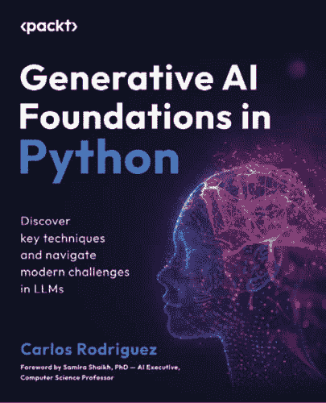

[packtpub.com](http://packtpub.com)

订阅我们的在线数字图书馆，全面访问超过7,000本书籍和视频，以及领先的工具，帮助您规划个人发展并推进职业生涯。更多信息，请访问我们的网站。

# 为什么订阅？

+   使用来自超过4,000位行业专业人士的实用电子书和视频，节省学习时间，多花时间编码

+   通过为您量身定制的技能计划提高您的学习效果

+   每月免费获得一本电子书或视频

+   完全可搜索，便于轻松访问关键信息

+   复制粘贴、打印和收藏内容

您知道吗？Packt为每本书都提供电子书版本，提供PDF和ePub文件。您可以在[packtpub.com](http://packtpub.com)升级到电子书版本，并且作为印刷书客户，您有权获得电子书副本的折扣。有关更多信息，请联系我们[customercare@packtpub.com](mailto:customercare@packtpub.com)。

在[www.packtpub.com](http://www.packtpub.com)，您还可以阅读一系列免费技术文章，订阅各种免费通讯，并享受Packt书籍和电子书的独家折扣和优惠。

# 您可能还会喜欢的其他书籍

如果您喜欢这本书，您可能会对Packt出版的这些其他书籍感兴趣：

**Generative AI Foundations** **in Python**

Carlos Rodriguez

ISBN: 978-1-83546-082-5

+   发现生成AI的基础及其在NLP中的基础

+   分析基础生成架构，包括GANs、transformers和扩散模型

+   了解如何微调LLMs以完成特定的NLP任务

+   理解迁移学习和微调以促进领域适应性，包括金融等领域

+   探索提示工程，包括情境学习、模板化和通过思维链和RAG进行合理化

+   使用生成LLMs实施负责任的做法，以最小化偏见、毒性和其他有害输出

**ChatGPT for Conversational AI** **和Chatbots**

Adrian Thompson

ISBN: 978-1-80512-953-0

+   深入了解ChatGPT及其功能和局限性

+   了解如何使用ChatGPT进行对话设计

+   发现如何使用高级LangChain技术，如提示、记忆、代理、链、向量存储和工具

+   创建一个可以回答您自己数据问题的ChatGPT聊天机器人

+   使用ChatGPT API开发一个聊天机器人

+   探索对话AI、LLMs和ChatGPT替代品的未来

# Packt正在寻找像您这样的作者

如果你有兴趣成为Packt的作者，请访问[authors.packtpub.com](http://authors.packtpub.com)并今天申请。我们已与成千上万的开发人员和科技专业人士合作，就像你一样，帮助他们将见解与全球科技社区分享。你可以提交一般申请，申请我们正在招募作者的特定热门话题，或者提交你自己的想法。

# 分享你的想法

现在你已经完成了*企业ChatGPT解决方案的用户体验*，我们很乐意听听你的想法！如果你从亚马逊购买了本书，请[点击此处直接转到本书的亚马逊评论页面](https://packt.link/r/1-835-46119-0)并分享你的反馈或在该购买网站上留下评论。

你的评论对我们和科技社区非常重要，并将帮助我们确保我们提供高质量的内容。

# 下载本书的免费PDF副本

感谢您购买本书！

你喜欢在旅途中阅读，但无法随身携带你的印刷书籍吗？

你的电子书购买是否与你的选择设备不兼容？

别担心，现在，随着每本Packt书籍，你都可以免费获得该书的DRM免费PDF版本。

在任何地方、任何设备上阅读。直接从你喜欢的技术书籍中搜索、复制和粘贴代码到你的应用程序中。

优惠远不止于此，你还可以获得独家折扣、时事通讯和每日免费内容的邮箱访问权限

按照以下简单步骤获取优惠：

1.  扫描二维码或访问下面的链接

[https://packt.link/free-ebook/978-1-83546-119-8](https://packt.link/free-ebook/978-1-83546-119-8)

1.  提交你的购买证明

1.  就这些！我们将直接将你的免费PDF和其他优惠发送到你的电子邮件

## 目录

1.  [企业ChatGPT解决方案的用户体验](B21964_FM.xhtml#_idParaDest-1)

1.  [序言](Section0002.xhtml#_idParaDest-2)

1.  [致谢](Section0003.xhtml#_idParaDest-3)

1.  [贡献者](Section0004.xhtml#_idParaDest-4)

1.  [关于作者](Section0004.xhtml#_idParaDest-5)

1.  [关于评论者](Section0005.xhtml#_idParaDest-6)

1.  [前言](B21964_Preface.xhtml#_idParaDest-7)

    1.  [本书面向对象](B21964_Preface.xhtml#_idParaDest-8)

    1.  [本书涵盖内容](B21964_Preface.xhtml#_idParaDest-9)

    1.  [充分利用本书](B21964_Preface.xhtml#_idParaDest-10)

    1.  [下载示例和文件](B21964_Preface.xhtml#_idParaDest-11)

    1.  [使用的约定](B21964_Preface.xhtml#_idParaDest-12)

    1.  [联系我们](B21964_Preface.xhtml#_idParaDest-13)

    1.  [分享你的想法](B21964_Preface.xhtml#_idParaDest-14)

    1.  [下载本书的免费PDF副本](B21964_Preface.xhtml#_idParaDest-15)

1.  [第1部分：企业ChatGPT的用户体验基础](B21964_Part_1.xhtml#_idParaDest-16)

1.  [第1章：认识ChatGPT中设计的力量](B21964_01.xhtml#_idParaDest-18)

    1.  [技术要求](B21964_01.xhtml#_idParaDest-19)

        1.  [方法1 – 无代码方法](B21964_01.xhtml#_idParaDest-20)

        1.  [方法2 – 使用Node.JS、Python或curl编写代码](B21964_01.xhtml#_idParaDest-21)

    1.  [穿越对话式人工智能的历史](B21964_01.xhtml#_idParaDest-22)

    1.  [UX设计对ChatGPT的重要性](B21964_01.xhtml#_idParaDest-23)

    1.  [理解UX设计的科学与艺术](B21964_01.xhtml#_idParaDest-24)

        1.  [设计的科学](B21964_01.xhtml#_idParaDest-25)

        1.  [设计的艺术](B21964_01.xhtml#_idParaDest-26)

        1.  [创造卓越UX需要众人的努力](B21964_01.xhtml#_idParaDest-27)

    1.  [设置自定义模型](B21964_01.xhtml#_idParaDest-28)

    1.  [总结](B21964_01.xhtml#_idParaDest-29)

    1.  [参考文献](B21964_01.xhtml#_idParaDest-30)

1.  [第2章：进行有效的用户研究](B21964_02_split_000.xhtml#_idParaDest-32)

    1.  [调查UX研究方法](B21964_02_split_000.xhtml#_idParaDest-33)

    1.  [理解用户需求分析](B21964_02_split_000.xhtml#_idParaDest-34)

        1.  [对话式人工智能的调查](B21964_02_split_000.xhtml#_idParaDest-35)

        1.  [调查清单](B21964_02_split_000.xhtml#_idParaDest-36)

    1.  [有效的调查案例研究](B21964_02_split_000.xhtml#_idParaDest-37)

    1.  [设计有洞察力的访谈](B21964_02_split_000.xhtml#_idParaDest-38)

        1.  [定义研究目标](B21964_02_split_000.xhtml#_idParaDest-39)

        1.  [选择参与者](B21964_02_split_000.xhtml#_idParaDest-40)

        1.  [开发结构化访谈计划](B21964_02_split_000.xhtml#_idParaDest-41)

        1.  [试点访谈过程和计划](B21964_02_split_000.xhtml#_idParaDest-42)

        1.  [进行结构化访谈](B21964_02_split_000.xhtml#_idParaDest-43)

        1.  [记录和记录发现](B21964_02_split_000.xhtml#_idParaDest-44)

        1.  [数据分析](B21964_02_split_000.xhtml#_idParaDest-45)

        1.  [报告发现](B21964_02_split_000.xhtml#_idParaDest-46)

        1.  [访谈过程总结](B21964_02_split_000.xhtml#_idParaDest-47)

    1.  [开始对话分析](B21964_02_split_000.xhtml#_idParaDest-48)

        1.  [标记日志文件应关注每个交互](B21964_02_split_000.xhtml#_idParaDest-49)

        1.  [定义成功和失败类别](B21964_02_split_000.xhtml#_idParaDest-50)

    1.  [尝试对话分析](B21964_02_split_001.xhtml#_idParaDest-51)

        1.  [探索案例研究中的示例](B21964_02_split_001.xhtml#_idParaDest-52)

        1.  [从问题组生成增强功能和错误](B21964_02_split_001.xhtml#_idParaDest-53)

        1.  [评分结果](B21964_02_split_001.xhtml#_idParaDest-54)

        1.  [结果](B21964_02_split_001.xhtml#_idParaDest-55)

    1.  [总结](B21964_02_split_001.xhtml#_idParaDest-56)

    1.  [参考文献](B21964_02_split_001.xhtml#_idParaDest-57)

1.  [第3章：识别ChatGPT的最佳用例](B21964_03.xhtml#_idParaDest-59)

    1.  [理解用例基础知识](B21964_03.xhtml#_idParaDest-60)

        1.  [用例或用户故事](B21964_03.xhtml#_idParaDest-61)

        1.  [使用ChatGPT建立基线](B21964_03.xhtml#_idParaDest-62)

        1.  [ChatGPT实例的示例用例 - 补丁软件](B21964_03.xhtml#_idParaDest-63)

        1.  [从用例创建用户故事](B21964_03.xhtml#_idParaDest-64)

        1.  [从用例中优先考虑ChatGPT机会](B21964_03.xhtml#_idParaDest-65)

    1.  [将LLM与用户目标对齐](B21964_03.xhtml#_idParaDest-66)

        1.  [ChatGPT的应用](B21964_03.xhtml#_idParaDest-67)

        1.  [聊天之外生成式AI的例子](B21964_03.xhtml#_idParaDest-68)

    1.  [避免ChatGPT的限制、偏见和不恰当的回应](B21964_03.xhtml#_idParaDest-69)

        1.  [缺乏实时信息](B21964_03.xhtml#_idParaDest-70)

        1.  [复杂或专业主题](B21964_03.xhtml#_idParaDest-71)

        1.  [长篇内容生成](B21964_03.xhtml#_idParaDest-72)

        1.  [长期记忆](B21964_03.xhtml#_idParaDest-73)

        1.  [敏感信息](B21964_03.xhtml#_idParaDest-74)

        1.  [偏见思维](B21964_03.xhtml#_idParaDest-75)

        1.  [情感和同理心](B21964_03.xhtml#_idParaDest-76)

        1.  [道德和伦理指导](B21964_03.xhtml#_idParaDest-77)

        1.  [关键决策](B21964_03.xhtml#_idParaDest-78)

        1.  [编程和调试](B21964_03.xhtml#_idParaDest-79)

        1.  [翻译准确性](B21964_03.xhtml#_idParaDest-80)

        1.  [教育替代品](B21964_03.xhtml#_idParaDest-81)

        1.  [不要强行适配解决方案](B21964_03.xhtml#_idParaDest-82)

    1.  [总结](B21964_03.xhtml#_idParaDest-83)

    1.  [参考文献](B21964_03.xhtml#_idParaDest-84)

1.  [第4章：评分故事](B21964_04.xhtml#_idParaDest-86)

    1.  [优先处理待办事项](B21964_04.xhtml#_idParaDest-87)

        1.  [WSJF](B21964_04.xhtml#_idParaDest-88)

        1.  [用户需求评分](B21964_04.xhtml#_idParaDest-89)

        1.  [评分企业解决方案](B21964_04.xhtml#_idParaDest-90)

        1.  [评分的例子](B21964_04.xhtml#_idParaDest-91)

        1.  [整理待办事项](B21964_04.xhtml#_idParaDest-92)

        1.  [修补案例研究重访](B21964_04.xhtml#_idParaDest-93)

        1.  [通过评分扩展跟踪工具](B21964_04.xhtml#_idParaDest-94)

        1.  [尝试用户需求评分方法](B21964_04.xhtml#_idParaDest-95)

    1.  [创建更复杂的评分方法](B21964_04.xhtml#_idParaDest-96)

        1.  [在敏捷中处理多个待办事项](B21964_04.xhtml#_idParaDest-97)

    1.  [评分的实际情况](B21964_04.xhtml#_idParaDest-98)

        1.  [我知道敏捷，这不是WSJF](B21964_04.xhtml#_idParaDest-99)

        1.  [使用简单的数字一到四](B21964_04.xhtml#_idParaDest-100)

        1.  [权重因素](B21964_04.xhtml#_idParaDest-101)

        1.  [严重性似乎很难判断](B21964_04.xhtml#_idParaDest-102)

        1.  [成本如此之高以至于我们永远无法完成工作](B21964_04.xhtml#_idParaDest-103)

        1.  [将问题分组为错误以保护质量](B21964_04.xhtml#_idParaDest-104)

        1.  [如何将WSJF融入组织](B21964_04.xhtml#_idParaDest-105)

    1.  [总结](B21964_04.xhtml#_idParaDest-106)

    1.  [参考文献](B21964_04.xhtml#_idParaDest-107)

1.  [第5章：定义期望体验](B21964_05_split_000.xhtml#_idParaDest-109)

    1.  [设计聊天体验](B21964_05_split_000.xhtml#_idParaDest-110)

        1.  [仅聊天体验](B21964_05_split_000.xhtml#_idParaDest-111)

        1.  [将ChatGPT集成到现有的聊天体验中](B21964_05_split_000.xhtml#_idParaDest-112)

        1.  [为聊天体验启用组件](B21964_05_split_000.xhtml#_idParaDest-113)

        1.  [设计混合UI/聊天体验](B21964_05_split_000.xhtml#_idParaDest-114)

        1.  [聊天窗口大小和位置](B21964_05_split_000.xhtml#_idParaDest-115)

        1.  [表格](B21964_05_split_000.xhtml#_idParaDest-116)

        1.  [表单](B21964_05_split_000.xhtml#_idParaDest-117)

        1.  [图表](B21964_05_split_000.xhtml#_idParaDest-118)

        1.  [图形和图像](B21964_05_split_000.xhtml#_idParaDest-119)

        1.  [按钮、菜单和选择列表](B21964_05_split_000.xhtml#_idParaDest-120)

        1.  [链接](B21964_05_split_000.xhtml#_idParaDest-121)

    1.  [创建仅语音的体验](B21964_05_split_000.xhtml#_idParaDest-122)

        1.  [设计推荐系统和幕后体验](B21964_05_split_000.xhtml#_idParaDest-123)

    1.  [总体考虑因素](B21964_05_split_000.xhtml#_idParaDest-124)

        1.  [无障碍性](B21964_05_split_000.xhtml#_idParaDest-125)

        1.  [国际化](B21964_05_split_000.xhtml#_idParaDest-126)

        1.  [信任](B21964_05_split_001.xhtml#_idParaDest-127)

        1.  [安全性](B21964_05_split_001.xhtml#_idParaDest-128)

    1.  [摘要](B21964_05_split_001.xhtml#_idParaDest-129)

    1.  [参考文献](B21964_05_split_001.xhtml#_idParaDest-130)

1.  [第2部分：设计](B21964_Part_2.xhtml#_idParaDest-131)

1.  [第6章：收集数据 – 内容为王](B21964_06_split_000.xhtml#_idParaDest-133)

    1.  [ChatGPT基础模型中有什么](B21964_06_split_000.xhtml#_idParaDest-134)

    1.  [使用RAG整合企业数据](B21964_06_split_000.xhtml#_idParaDest-135)

        1.  [理解RAG](B21964_06_split_000.xhtml#_idParaDest-136)

        1.  [ChatGPT和RAG的限制](B21964_06_split_000.xhtml#_idParaDest-137)

        1.  [使用企业数据构建演示](B21964_06_split_000.xhtml#_idParaDest-138)

        1.  [清理数据](B21964_06_split_000.xhtml#_idParaDest-139)

        1.  [创建高质量数据管道的其他考虑因素](B21964_06_split_000.xhtml#_idParaDest-140)

        1.  [RAG资源](B21964_06_split_001.xhtml#_idParaDest-141)

        1.  [社区资源](B21964_06_split_001.xhtml#_idParaDest-142)

    1.  [摘要](B21964_06_split_001.xhtml#_idParaDest-143)

    1.  [参考文献](B21964_06_split_001.xhtml#_idParaDest-144)

1.  [第7章：提示工程](B21964_07.xhtml#_idParaDest-146)

    1.  [通过提示工程提供上下文](B21964_07.xhtml#_idParaDest-147)

        1.  [提示101](B21964_07.xhtml#_idParaDest-148)

        1.  [设计指令](B21964_07.xhtml#_idParaDest-149)

        1.  [基本策略](B21964_07.xhtml#_idParaDest-150)

        1.  [始终要记住的快捷技巧](B21964_07.xhtml#_idParaDest-151)

        1.  [A/B测试](B21964_07.xhtml#_idParaDest-152)

    1.  [提示工程技巧](B21964_07.xhtml#_idParaDest-153)

        1.  [自洽性](B21964_07.xhtml#_idParaDest-154)

        1.  [通用知识提示](B21964_07.xhtml#_idParaDest-155)

        1.  [提示链](B21964_07.xhtml#_idParaDest-156)

        1.  [程序辅助语言模型](B21964_07.xhtml#_idParaDest-157)

        1.  [少样本提示](B21964_07.xhtml#_idParaDest-158)

    1.  [Andrew Ng的代理方法](B21964_07.xhtml#_idParaDest-159)

        1.  [反思](B21964_07.xhtml#_idParaDest-160)

        1.  [工具使用](B21964_07.xhtml#_idParaDest-161)

        1.  [规划](B21964_07.xhtml#_idParaDest-162)

        1.  [多智能体协作](B21964_07.xhtml#_idParaDest-163)

        1.  [高级技术](B21964_07.xhtml#_idParaDest-164)

    1.  [总结](B21964_07.xhtml#_idParaDest-165)

    1.  [参考文献](B21964_07.xhtml#_idParaDest-166)

1.  [第8章：微调](B21964_08.xhtml#_idParaDest-168)

    1.  [微调101](B21964_08.xhtml#_idParaDest-169)

        1.  [提示工程或微调？资源该花在哪里](B21964_08.xhtml#_idParaDest-170)

        1.  [令牌成本确实很重要](B21964_08.xhtml#_idParaDest-171)

    1.  [创建微调模型](B21964_08.xhtml#_idParaDest-172)

        1.  [风格和语调的微调](B21964_08.xhtml#_idParaDest-173)

        1.  [使用微调模型](B21964_08.xhtml#_idParaDest-174)

        1.  [微调以结构化输出](B21964_08.xhtml#_idParaDest-175)

        1.  [生成数据仍需检查和平衡](B21964_08.xhtml#_idParaDest-176)

        1.  [功能和方法调用微调](B21964_08.xhtml#_idParaDest-177)

    1.  [微调技巧](B21964_08.xhtml#_idParaDest-178)

    1.  [Wove案例研究，继续](B21964_08.xhtml#_idParaDest-179)

        1.  [提示工程](B21964_08.xhtml#_idParaDest-180)

        1.  [为Wove进行微调](B21964_08.xhtml#_idParaDest-181)

    1.  [总结](B21964_08.xhtml#_idParaDest-182)

    1.  [参考文献](B21964_08.xhtml#_idParaDest-183)

1.  [第3部分：照顾和培养](B21964_Part_3.xhtml#_idParaDest-184)

1.  [第9章：指南和启发式方法](B21964_09_split_000.xhtml#_idParaDest-186)

    1.  [将指南应用于设计](B21964_09_split_000.xhtml#_idParaDest-187)

    1.  [将启发式分析应用于对话式用户界面](B21964_09_split_000.xhtml#_idParaDest-188)

        1.  [1 – 系统状态的可见性](B21964_09_split_000.xhtml#_idParaDest-189)

        1.  [2 – 系统与真实世界之间的匹配](B21964_09_split_000.xhtml#_idParaDest-190)

        1.  [3 – 用户控制和自由](B21964_09_split_000.xhtml#_idParaDest-191)

        1.  [4 – 一致性和标准](B21964_09_split_000.xhtml#_idParaDest-192)

        1.  [5 – 预防错误](B21964_09_split_000.xhtml#_idParaDest-193)

        1.  [6 – 识别而非回忆](B21964_09_split_000.xhtml#_idParaDest-194)

        1.  [7 – 使用灵活性和效率](B21964_09_split_000.xhtml#_idParaDest-195)

        1.  [8 – 美学和极简设计](B21964_09_split_000.xhtml#_idParaDest-196)

        1.  [9 – 帮助用户识别、诊断和从错误中恢复](B21964_09_split_000.xhtml#_idParaDest-197)

        1.  [10 – 帮助和文档](B21964_09_split_000.xhtml#_idParaDest-198)

        1.  [是否存在第11种可能的启发式方法？](B21964_09_split_000.xhtml#_idParaDest-199)

    1.  [构建对话指南](B21964_09_split_000.xhtml#_idParaDest-200)

        1.  [网络指南](B21964_09_split_001.xhtml#_idParaDest-201)

        1.  [混合聊天/GUI体验的样本指南集](B21964_09_split_001.xhtml#_idParaDest-202)

        1.  [一些具体的风格和语调指南及示例](B21964_09_split_001.xhtml#_idParaDest-203)

        1.  [流程顺序可以减少交互](B21964_09_split_001.xhtml#_idParaDest-204)

    1.  [案例研究](B21964_09_split_001.xhtml#_idParaDest-205)

        1.  [处理错误 - 修复和流畅度](B21964_09_split_001.xhtml#_idParaDest-206)

    1.  [总结](B21964_09_split_001.xhtml#_idParaDest-207)

    1.  [参考文献](B21964_09_split_001.xhtml#_idParaDest-208)

1.  [第10章：监控和评估](B21964_10_split_000.xhtml#_idParaDest-210)

    1.  [使用RAGAs进行评估](B21964_10_split_000.xhtml#_idParaDest-211)

        1.  [RAGAs流程](B21964_10_split_000.xhtml#_idParaDest-212)

        1.  [数据合成](B21964_10_split_000.xhtml#_idParaDest-213)

        1.  [评估指标](B21964_10_split_000.xhtml#_idParaDest-214)

        1.  [用户体验指标](B21964_10_split_000.xhtml#_idParaDest-215)

        1.  [其他指标](B21964_10_split_000.xhtml#_idParaDest-216)

        1.  [监控和分类幻觉错误类型](B21964_10_split_001.xhtml#_idParaDest-217)

        1.  [OpenAI关于质量和如何衡量的案例研究](B21964_10_split_001.xhtml#_idParaDest-218)

        1.  [系统测试流程](B21964_10_split_001.xhtml#_idParaDest-219)

        1.  [测试矩阵方法](B21964_10_split_001.xhtml#_idParaDest-220)

        1.  [改进检索](B21964_10_split_001.xhtml#_idParaDest-221)

        1.  [LLM评估指标的范围广泛](B21964_10_split_001.xhtml#_idParaDest-222)

    1.  [使用可用性指标进行监控](B21964_10_split_001.xhtml#_idParaDest-223)

        1.  [净推荐值（NPS）](B21964_10_split_001.xhtml#_idParaDest-224)

        1.  [SUS](B21964_10_split_001.xhtml#_idParaDest-225)

    1.  [用启发式评估进行细化](B21964_10_split_001.xhtml#_idParaDest-226)

    1.  [总结](B21964_10_split_001.xhtml#_idParaDest-227)

    1.  [参考文献](B21964_10_split_001.xhtml#_idParaDest-228)

1.  [第11章：过程](B21964_11.xhtml#_idParaDest-230)

    1.  [将设计思维融入开发](B21964_11.xhtml#_idParaDest-231)

        1.  [找到赞助商](B21964_11.xhtml#_idParaDest-232)

        1.  [找到合适的工具并整合生成式AI](B21964_11.xhtml#_idParaDest-233)

        1.  [一开始要虔诚……](B21964_11.xhtml#_idParaDest-234)

        1.  [避免“未知未知”](B21964_11.xhtml#_idParaDest-235)

        1.  [始终进化并改进](B21964_11.xhtml#_idParaDest-236)

        1.  [敏捷并不意味着“没有需求”](B21964_11.xhtml#_idParaDest-237)

        1.  [团队组成和位置很重要](B21964_11.xhtml#_idParaDest-238)

        1.  [管理进行中工作（WIP）和技术债务](B21964_11.xhtml#_idParaDest-239)

        1.  [关注客户价值](B21964_11.xhtml#_idParaDest-240)

        1.  [将设计过程融入开发过程](B21964_11.xhtml#_idParaDest-241)

    1.  [设计内容改进生命周期](B21964_11.xhtml#_idParaDest-242)

        1.  [对话式AI的输入](B21964_11.xhtml#_idParaDest-243)

        1.  [推荐UI的输入](B21964_11.xhtml#_idParaDest-244)

        1.  [后端AI的输入](B21964_11.xhtml#_idParaDest-245)

        1.  [监控星期一](B21964_11.xhtml#_idParaDest-246)

        1.  [分析星期二（以及星期三的工作总结）](B21964_11.xhtml#_idParaDest-247)

        1.  [周四治疗和周五故障查找](B21964_11.xhtml#_idParaDest-248)

        1.  [一周内不适合的内容仍然很重要](B21964_11.xhtml#_idParaDest-249)

    1.  [结论](B21964_11.xhtml#_idParaDest-250)

    1.  [参考文献](B21964_11.xhtml#_idParaDest-251)

1.  [第12章：结论](B21964_12.xhtml#_idParaDest-253)

    1.  [将所学应用于新领域](B21964_12.xhtml#_idParaDest-254)

    1.  [仔细检查感觉正确的事情](B21964_12.xhtml#_idParaDest-255)

        1.  [设定明确的目标](B21964_12.xhtml#_idParaDest-256)

        1.  [了解你的流程](B21964_12.xhtml#_idParaDest-257)

        1.  [了解数据](B21964_12.xhtml#_idParaDest-258)

        1.  [对齐并承担责任](B21964_12.xhtml#_idParaDest-259)

        1.  [深思熟虑地优先考虑](B21964_12.xhtml#_idParaDest-260)

        1.  [有目的地自动化](B21964_12.xhtml#_idParaDest-261)

    1.  [构建适合解决方案的过程](B21964_12.xhtml#_idParaDest-262)

    1.  [结束旅程](B21964_12.xhtml#_idParaDest-263)

    1.  [参考文献](B21964_12.xhtml#_idParaDest-264)

1.  [索引](B21964_Index.xhtml#_idParaDest-265)

    1.  [为什么订阅？](B21964_BM.xhtml#_idParaDest-266)

1.  [你可能还会喜欢的其他书籍](B21964_BM.xhtml#_idParaDest-267)

    1.  [Packt正在寻找像你这样的作者](B21964_BM.xhtml#_idParaDest-268)

    1.  [分享你的想法](B21964_BM.xhtml#_idParaDest-269)

    1.  [免费下载此书的PDF副本](B21964_BM.xhtml#_idParaDest-270)

## 标记

1.  [封面](cover.xhtml)

1.  [目录](B21964_TOC_ePub.xhtml#_idContainer002)

1.  [索引](B21964_Index.xhtml#_idContainer195)
